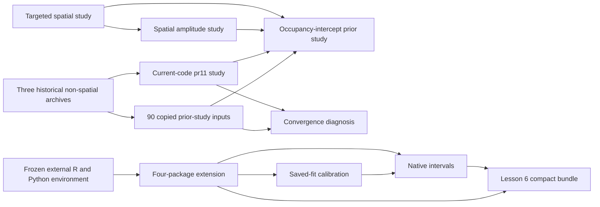

# Local simulation archive review, 7 October 2026

Retain the scientific archives as complete studies, including their initial fits, longer checks, failed attempts and frozen execution records. Compact teaching bundles and report tables already support most routine rendering without loading the large posterior objects. Cold storage is a useful future option; no move, deletion, model fit, numerical reanalysis, package-code edit or commit was performed in this review. A local copy must remain until its replacement has been copied, fully verified and shown to support the required downstream work.

The reviewed root is `/Users/douglasyu/src/occJSDM/dev/simstudy/results`. The review was performed in the separate `post-beta-maintenance` worktree; the report and scripts are now integrated into main. The ignored review evidence was preserved in the complete verified worktree archive before that checkout was retired; see the [cleanup record](../post-beta-maintenance-20261007/cleanup-REPORT.md). Applicable repository instructions require preserving raw results, older environments and worktrees, and writing Markdown paragraphs without wrapping or em-dashes.

## Inventory

The snapshot confirmed by a metadata rerun at 14:56 UTC contains **17 immediate directories, 53 loose files and 14,096 regular files in total: 93,985,353,133 logical bytes, or 87.53 GiB / 93.99 GB**. Allocated file blocks total 94,019,526,656 bytes; this excludes directory metadata and does not measure compressed backup size, APFS shared extents or snapshots. No symlinks, hard-linked duplicate entries, traversal errors or stat errors were found. All inventoried paths retained their sizes and modification times when checked again after the targeted verification.

RDS files account for 6,739 files and 91,794,316,194 bytes, **97.67% of logical space**. Other important types are CSV (1,486 files, 207.92 MB), R source (1,174), logs (1,227), PNG (905), JSON (657), R documentation (528), R Markdown (181), installed R databases (35 RDB files, 522.74 MB), RDA data (24 files, 649.03 MB) and compiled libraries (22 SO files, 13.47 MB). Extensions describe containers, not scientific roles: some RDS files are full fits, others are tiny summaries or metadata.

[studies.csv](studies.csv), [categories.csv](categories.csv), [file-types.csv](file-types.csv) and [largest-files.csv](largest-files.csv) contain exact counts and bytes. The largest file is the longer `pr11-current` fit `jsdm-n1000-02-fit.rds`, 775,664,557 bytes. The full path, size, allocation, mtime and inode inventory is in the worktree's ignored `dev/simstudy/results/post-beta-maintenance-20261007/archive-inventory/files.csv`.

## Per-study retention and dependencies

Sizes below are logical sizes. "Retain" means preserve the present study; "cold-storage candidate" means a complete verified replacement could eventually hold it. It does not authorize removing today's copy. [retention.csv](retention.csv) gives the machine-readable version and [dependencies.csv](dependencies.csv) gives the dependency edges.

| Archive directory | Files / size | What to retain and why |
| --- | --- | --- |
| `intercept-prior-20260929` | 1,174 / 27.62 GiB | Retain all 171 scientific new-arm fits, first fits and repeats, selections, 70 reused-control provenance rows, equivalence/pilots, frozen source/library/fingerprint, amendments, scores, audits and launch logs. Depends on pr11, spatial-targeted, spatial-amplitude and copied inputs. Complete-study cold-storage candidate; compact 66-file evidence rebuilds the report. |
| `lesson-4-extension-20260923` | 5,412 / 20.46 GiB | Retain all 640 attempts, 626 scores, 14 failed gllvm jobs, diagnostic flags, native parameters, posterior draws, 180 distinct input files, 100 truth files, source snapshots and scoring-recovery records. Depends on the external frozen R/Python launcher. Feeds Lessons 5/6 and both calibration follow-ups. Complete-study cold-storage candidate. |
| `pr11-current-20260927` | 850 / 15.84 GiB | Retain 110 initial fits, 51 prescribed longer fits, locked selections, 110 selected result records, saved-input RNG provenance, source-main/library, audits, flagged-chain sensitivity and integration checks. Depends on three external historical studies. Controls feed the intercept-prior and convergence studies. Complete-study cold-storage candidate only with these dependencies. |
| `spatial-amplitude-20260928` | 1,119 / 11.11 GiB | Retain both amplitude-prior arms, all initial/longer and initialization fits, median-based robust analysis, superseded mean analysis, 288 selected conditional posteriors, pilots, restart/recovery logs, source/library and audits. Depends on spatial-targeted inputs and controls; inverse-gamma controls feed the intercept-prior study. Preserve the estimand amendment and rejected extension decision. |
| `spatial-targeted-20260927` | 1,194 / 9.13 GiB | Retain nine input communities/RNG states, 81 initial and 26 prescribed longer fits, selections, source-main/library, separately frozen research/analysis/report sources, full summaries, native-projection audits and rare-species diagnosis. Upstream of amplitude and intercept-prior studies. Preserve the native warning and initial-to-long sensitivity. |
| `convergence-diagnosis-20261001` | 326 / 2.34 GiB | Retain all 40 diagnostic chains, their seeds/schedules, variant-c input, equivalence/pilots, anchors, frozen source/library, analysis provenance, process logs and SDD ledger. Depends on the flagged pr11 fit and copied community-5 input. Do not replace the original pooled fit by its extended diagnostic run. |
| `pr10-integration-20260927` | 1,120 / 527.35 MiB | Retain tested-tree identities, baseline/merge check results and logs, failure records and prerequisite patches. Source/check working copies are build products that can be regenerated from pinned revisions, but logs and tested-tree evidence should travel with a complete verified archive. |
| `pr13-integration-20260928` | 1,097 / 364.53 MiB | Retain merge/source identities, saved-fit validation, source tests, package-check results/logs and TODO comparison records. Generated check/source working copies are cold-storage candidates after a verified record-preserving replacement. |
| `spatial-merge-20260928` | 783 / 118.17 MiB | Retain merge provenance, tests/results, report and historical TODO/stash records. Preserve tested-source identity even if the copied build tree is later regenerated. |
| `intercept-prior-inputs` | 90 / 5.67 MiB | Keep readily available. These byte-checked copies of three historical studies' inputs are used by the intercept-prior and convergence studies. Copies do not replace historical fits, frozen libraries or baseline settings. |
| `lesson-4-native-intervals-20260925` | 188 / 8.10 MiB | Keep the 159 native interval calculations, selected-start agreement evidence, independent-stream checks, source/report snapshots, base and augmented bundles, partitions and logs. Depends on extension fits, baseline calibration and external package environment. Recreating gllvm intervals replays selected starts; it is numerical work, not a render. |
| `lesson-4-calibration-20260925` | 654 / 5.54 MiB | Keep Bayesian probability/coefficient intervals, all 626 calibration records, truth/integration checks, baseline SHA256 records, frozen scoring source and render logs. Depends on extension fits; feeds the native augmentation. |
| `lesson-4-combined-presentation-20260925` | 5 / 0.22 MiB | Keep previous-source snapshots, bundle checksum and render log as inexpensive presentation provenance. Modern lesson sources supersede the presentation, not the evidence it displayed. |
| `lesson-4-validation-presentation-20260925` | 17 / 0.28 MiB | Keep before-files, checksum and display/link/render checks. Styling is superseded by the current plain Markdown lessons; rebuilding presentation does not require fits. |
| `plots` | 3 / 0.35 MiB | Keep historical coverage/bias figures alongside their loose-run summaries. Regeneration needs the matching historical summaries and plotting source. |
| `review-maintenance-20261007` | 10 / 3.12 MiB | Keep source-suite/article-render logs, saved validation code/HTML and primary-TODO hash evidence. Rendered HTML is regenerable; the dated verification record remains useful. |
| `worktree-cleanup-20261007` | 1 / 1.60 KiB | Keep the ignored-file preservation/hash record. It is maintenance provenance, not a substitute for a study archive. |
| Loose historical files | 53 / 25.53 MiB | Keep dated CSV/RDS summaries, checkpoints and logs for July/August runs. No complete per-run frozen library/source chain was established in this review; do not assume current code regenerates their historical conclusions. |

## Cross-study chain

The three historical non-spatial archives under `/Users/douglasyu/Documents/Codex/2026-09-10/fam/work` supply saved observations, biological truth, fitting RNG states and historical result records to pr11. All 110 referenced input files exist and match their recorded MD5s. Ninety copied inputs under `intercept-prior-inputs` also match. The historical archives themselves were not fully inventoried or verified.

The external four-package `run-r` launcher, pilot archive, October 2 three-sample teaching archive and October 7 post-PR14 archive all exist. Their contents, the older environments/worktrees and `.worktrees/_archives/` were preserved; they are outside the 87.53 GiB total. See [external-dependencies.json](external-dependencies.json). Compiled packages alone are insufficient for future reproduction: preserve the source revision, dependency versions, R/Python/runtime records, launchers and documented restricted-CPU wrappers as well.

## Lesson 7 raw archive follow-up

The original archive was `/Users/douglasyu/src/occJSDM-worktrees/lesson-2-spatial-sweep/dev/simstudy/results/spatial-design-20261001`, under the lesson's earlier number. Its frozen package revision was `9af859795974839ee6038d00b6d8422ae77b047f`. The original Claude execution log confirms that `git worktree remove` deleted the worktree on 1 October at 20:54:55 UTC (21:54:55 BST), including the gitignored 3.2 GB archive. The following message explicitly records that main never held a copy. Evidence is in `/Users/douglasyu/.claude/projects/-Users-douglasyu-src-occJSDM/19e4c22b-aa29-4d3d-b934-002c56ed2da1.jsonl`, lines 3226, 3233 and 3238. This resolves the earlier uncertainty about whether the original directory had been deleted.

**Backup candidate found:** Backblaze's local transmission log `bzreports_lastfilestransmitted/01.zip` records 645 transmissions for 288 distinct archive paths. Its `bzbackup/bzdatacenter/bz_done_20261001_0.dat` and `bz_done_20261002_0.dat` catalogs contain 936 matching records, including all 24 initial full fits and results, all three longer full fits and results, all three input communities, 106 oracle RDS files, 65 frozen-source files and 24 installed-library files including `occJSDM.so`. All 24 selected-result paths in the committed `selected-fits.csv` and all 96 selected-oracle paths in `oracle.csv` are catalog-listed. Each longer full fit also has a terminal `!` record after its chunk records. These observations identify a concrete recovery candidate; they do not establish that a cloud restore succeeds or that restored bytes match the scientific manifests.

The [redacted backup path list](lesson-7-backup-paths.csv) retains relative paths, catalog line references and the committed selected-result/oracle MD5s for verification after recovery; it omits backup account/file identifiers and unrelated files. [lesson-7-backup-summary.json](lesson-7-backup-summary.json) records counts, source identity, access limits and the unverified restore status. The source Backblaze records remain unchanged under `/Library/Backblaze.bzpkg/bzdata/`.

The next action is to sign in to Backblaze, select the historical file view for 1 October and restore the complete original study folder to a fresh location, preserving its relative structure. Backblaze documents the historical-date controls in its [restore guide](https://help.backblaze.com/hc/en-us/articles/217665888-How-to-Create-a-Restore-from-Your-Backblaze-Backup). Cloud inspection is blocked at the sign-in page in the available browser. Time Machine's backup directories are blocked by macOS privacy controls even outside the workspace sandbox; available local snapshots start on 6 October, after the deletion. No accessible copy was found in the source/home/worktree locations, temporary directories or the four retained worktree-archive indexes searched. These searches were not exhaustive across privacy-protected locations. No recovery, refit or deletion was performed. The compact `spatial-lesson.rds`, 20 committed result tables/figures and source scripts still support ordinary lesson rendering.

## Rendering, auditing and refitting are different jobs

| Intended job | Minimum retained dependencies | Requires full fits or model execution? |
| --- | --- | --- |
| Render Lessons 0-4 | Current vignette source, compact teaching-data bundles and images, knitting/plotting dependencies | No MCMC. Full-archive re-export/verification instead needs the matching post-PR14 source and library. |
| Render Lesson 5 | `jsdm-comparison.rds`, lesson source and plotting/knitting dependencies | No full fits or Python. Compact archive-mode teaching verification is available. |
| Render Lesson 6 | `lesson-4-extension.rds`, `lesson-4-calibration.rds`, figures and lesson source | No full fits. Calibration or native-interval re-export needs extension objects and its frozen package environment. |
| Render Lesson 7 | `spatial-lesson.rds`, committed spatial-design-sweep results and lesson source | No full fits. `verify-lesson.R` checks the compact evidence without the raw archive. |
| Render current-code/spatial/amplitude reports | Committed compact results, source reports, figures and recorded analysis source | No fitting. Spatial and amplitude R Markdown reports accept the compact results directory. Plain Markdown reports already embed/link their evidence. |
| Repeat numerical reconstruction or convergence audits | Full selected draws, inputs/truth, selection/diagnostic rules, matching frozen package and research source, hash manifests | Yes to full fit reads; no new fits needed for these audits. Some verifiers write audit folders, so use a fresh reviewed output location. |
| Recompute native gllvm intervals | Original inputs, selected start/seed/settings, frozen gllvm environment and archived coefficients | Replays selected numerical optimisation and requires exact agreement. This was not run today. |
| Recreate any scientific experiment | All input RNG states/seeds, pinned fitting source/runtime, protocol, schedules, selection rules and failure/recovery records | New fits; outside today's review. Regeneration against the current package is a new experiment, not proof of historical equivalence. |

Current teaching rebuild instructions are in `dev/simstudy/vignette-lesson/README.md`; four-package instructions are in `dev/simstudy/jsdm-package-comparison/extension/README.md` and `CALIBRATION.md`. Several verifiers deliberately check source identity and absolute paths. Transfer requires an explicit old-to-new path map and documented remapping before numerical verification, rather than silently substituting a different installed package.

## Frozen execution records

| Study | Source/library and settings to preserve |
| --- | --- |
| pr11 | Production `2a75bf1`, `source-main/`, dedicated `library/`, recorded environment, imported historical research helpers, each saved input RNG state, long-selection and selected-manifest. Initial 2 chains / 3,000 burn-in / 5,000 retained; longer 4 / 6,000 / 12,000, thin 1. All initial and longer sets are distinct. |
| Targeted spatial | Production `d3d710e`, `source-main/`, `library/`, `research-frozen/`, `analysis-frozen/`, `report-frozen/`, three revision files, input-manifest with data/fit seeds, locked longer selection. Same initial/long schedules as pr11. Nine inputs serve 81 paired support/observation jobs. |
| Amplitude | Production `4509629`, `source/`, `library/`, robust/legacy source hashes, estimand/compute amendments, original spatial input RNG states, paired longer schedules, initialization selection and accidental-kill recovery records. Median and obsolete mean analyses are separate evidence. |
| Intercept prior | Production `24a1c98`, `source/`, `library/`, 25-row fingerprint; frozen runner/jobs hashes, protocol/amendments/deviation record, per-fit source/input hashes and 70 control-provenance rows. New arms start at each selected control's schedule; flagged initial fits receive one longer repeat. |
| Convergence | Production `707540a`, `source/`, `library/`, fingerprint, fixed anchor classifier, per-chain provenance and distinct seeds, fixed-theta0 clone hashes and SDD ledger. 40 separate single-chain fits; 10,000 burn-in, 40,000 further iterations thinned by 4 to 10,000 retained. These do not replace pr11's original chains. |
| Four-package extension | External pinned R/Python environment; `worker-v1` through `worker-final` and corrected `worker-normal-integral-v1`; both SHA256 source manifests; fixed 640-row job manifest, truth and inputs, status/result/attempt parameters and recovery copies. Generator seed `26093000 + replicate`; base fitting seed `26100000 + 100 * job_number`, with attempt/start increments. Bayesian budgets are saved in each result and frozen `fit-job.R`; do not discard alternative starts or longer attempts. |

[provenance.csv](provenance.csv) records these anchors and [existing-verification.csv](existing-verification.csv) distinguishes inspected historical audit evidence from today's checks. The pr11 work-state file still includes an in-progress historical narrative; final selection/audit records and the completed report, not a stale progress paragraph, establish the completed run.

## Integrity checks and duplicates

Today's scripts made **3,945 manifest/path checks: 1,432 matching checksum checks and 2,513 existence-only checks, with zero missing paths or mismatches** after resolving each manifest's actual archive-relative path convention. Repeated manifest rows are counted as checks, not distinct files. Checksum reads covered 925 distinct files across raw, compact and external dependencies, 1,775,427,632 logical bytes. Of these, **698 files / 1,758,051,200 bytes are inside the raw archive: only 1.87% of its bytes**. This is targeted integrity evidence, not verification of all 87.53 GiB, deserialisation of every RDS, a new numerical audit, or a backup restore test.

Checks include both four-package frozen source manifests, all 180 distinct manifest inputs, status/result presence for 640 jobs and score presence for 626 successful jobs; all 110 pr11 selected result hashes and inputs; all 81 spatial selected result hashes and nine input-community hashes; all 18 amended amplitude result hashes; the intercept and convergence source/library fingerprints; 66 intercept evidence files against both committed and raw originals; 50 amplitude compact artifacts; named control/conditional/diagnostic fit presence; and a small selection of complete fit payload hashes. The full ledger is the worktree's `archive-inventory/manifest-checks.csv`; [check-summary.csv](check-summary.csv) summarizes it. The 640 job status files still report 505 diagnostic passes, 121 flagged successes and 14 failed attempts, matching the documented completed experiment.

Existing numerical evidence was inspected, not rerun: pr11 has 110 reconstruction rows, spatial has 81 native-projection audit rows, the calibration log records 626 scores and 444 grouped summaries, and native intervals have 159 calculation records. Intercept-prior audit tables contain 80/36/104 passing fit rows, 1,408/861/1,369 passing table rows, 20 phase-A checks and 19 final checks. The convergence impact table has 33 passing reproduction checks. These records do not remove the studies' documented scientific/convergence limitations.

SHA256 comparison confirmed **10 byte-identical files, 200,721,446 bytes (191.42 MiB)** shared by spatial `initial-review/` and `summary-initial/`, including `selection.rds` and `elements.csv`. Their two `provenance.rds` files differ, and `PRELIMINARY.txt` belongs only to the review copy: preserve those provenance records. The native full `calibration.rds` is exactly the shipped compact calibration bundle. Ninety copied prior inputs match their historical recorded hashes. Conversely, the sampled pr11 initial/longer fit pair is byte-distinct. [duplicate-checks.csv](duplicate-checks.csv) records hashes, paths and comparison outcomes.

These are evidence-backed consolidation candidates inside a future verified replacement, not deletion instructions. Do not infer duplication from repeated filenames, equal seeds or similar summaries. Old scoring failures, changed source snapshots, longer fits, alternative starts, rejected mean estimands and recovery logs document different execution histories. Copied package-check working trees, rendered HTML/PNG and object files are usually regenerable build products, but retain their pinned tree identity and dated test logs. A regenerated package check with newer dependencies does not replace a historical check record.

## Next steps

1. Recover `spatial-design-20261001` from the identified Backblaze backup candidate, verify its restored result hashes and register the new location. Preserve the complete study and its library/inputs rather than launching a replacement experiment.
2. Maintain a small active set: committed compact bundles/results, protocols, scripts, manifests, dependency/path map, source/runtime fingerprints and dated audit logs. Retain the copied inputs because they are tiny and used by downstream studies.
3. For space reduction, copy complete studies to a chosen cold-storage destination together with their external dependency closure. Prioritize the 27.62 GiB intercept, 20.46 GiB extension and 15.84 GiB pr11 studies; their scientific contents remain needed for audits even though normal report rendering is compact.
4. Before considering removal of any local copy, calculate a complete SHA256 transfer manifest, verify every destination file against it, retain distinct initial/longer/failed/provenance sets, restore to a fresh scratch location and demonstrate the required compact builds and selected numerical audits with pinned source/runtime. Preserve an explicit path-remapping record. No complete replacement or restore has been verified by this review.
5. Keep the compact review files explicitly tracked despite the broad `/dev/*` ignore rule. The bulky path inventory and checksum ledger stay ignored; the raw archive and existing ignore rules are unchanged.

To repeat the same read-only inventory and targeted checks from the worktree root, use the commands in [REPRODUCE.md](REPRODUCE.md). They write only to this review's compact and bulky output directories and never launch a fitter.
