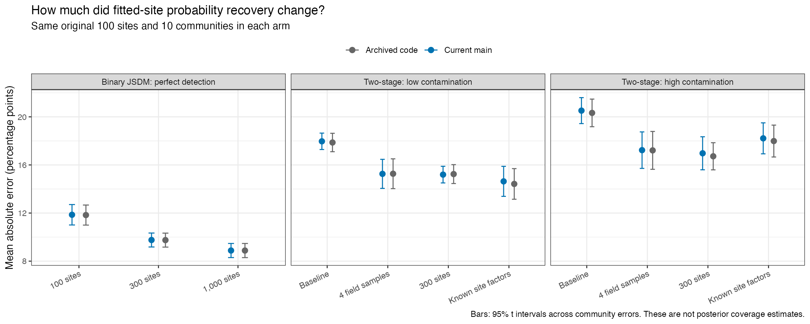
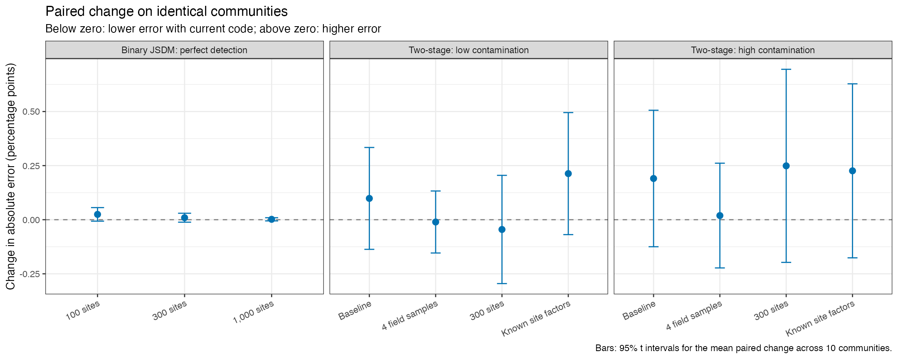
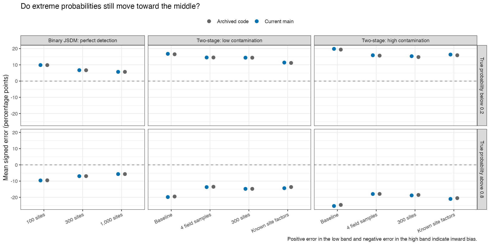

# Did current code change the non-spatial results?

27 September 2026. Paired occJSDM rerun for PR #11.

**The refreshed fits preserve the broad findings: more sites or field samples help, but substantial occupancy-probability errors remain.** Overall accuracy is very similar to the archived results. Five fits retain convergence flags, including one substantial case, so small differences need caution.

## What was rerun?

We reused the same ten simulated communities, saved observations, generating probabilities and initial random states as the archived studies. No observations or truth were regenerated. There are 110 initial fits: 30 binary JSDM fits at 100, 300 and 1,000 sites, and 80 two-stage fits covering four designs under two contamination settings. The four designs are the 100-site baseline, four field samples per site, 300 sites, and a research control supplied with the true hidden site conditions. Every primary comparison assesses the same original 100 sites and gives each community equal weight. Each community contains ten species.

The two contamination versions share ecological truth; they are not twenty independent communities. The binary comparison supplies exact presence/absence and removes collection and PCR errors. The two-stage comparisons retain those observation processes, two primers and six PCR replicates per primer. These are fitted-site recovery checks, not predictions at unsampled sites.

As in the archived study, environmental and collection covariates are standardized within each fitted design. The generating coefficients are transformed to preserve the original biological relationships. Fixed prior settings on the standardized scale can nevertheless imply slightly different priors on the raw measurement scale when a design adds sites or samples.

## What changed in the code?

The archived fits used revision `80d449d`; the rerun uses production revision `2a75bf1`, which includes the recently merged PRs #8 and #10. The relevant change is that numeric species traits are now centred and scaled. Keeping the same numerical prior settings after that change does not preserve exactly the same prior on species-environment relationships. This justified checking fresh fits instead of assuming the archived results still applied.

The spatial changes do not enter these non-spatial fits. The optional continuous-noise prior does not enter binary or two-stage models. The read-threshold correction does not change their threshold-one observations. This comparison evaluates the code versions together; it is not a separate experiment that isolates every intervening change.

The simulation checker also now puts numeric trait-effect truth on the fitted scale. Centring moves a constant trait contribution into residual species coefficients. The full environmental coefficients and the true occupancy probabilities remain unchanged. The previous corrections for collection-covariate units and positive-read detection probabilities are retained. PR #11 changes this scoring and the research evidence; it does not change production fitting code or default prior settings.

## How much did probability accuracy change?

The broad results are similar. Across the ten-community summaries, overall mean absolute error changed by at most **0.025 percentage points in binary JSDM** and **0.249 points in the two-stage comparisons**. Every paired 95% interval for these eleven changes includes zero. This does not establish statistical equivalence, and the convergence flags below limit precise claims about small changes. Individual communities and probability bands can move more than these overall averages.

All errors and changes are in percentage points.

|Scenario                       |Design             | Archived MAE| Current MAE| Paired change| 95% lower| 95% upper|
|:------------------------------|:------------------|------------:|-----------:|-------------:|---------:|---------:|
|Binary JSDM: perfect detection |100 sites          |       11.832|      11.857|         0.025|    -0.007|     0.056|
|Binary JSDM: perfect detection |300 sites          |        9.748|       9.757|         0.009|    -0.011|     0.030|
|Binary JSDM: perfect detection |1,000 sites        |        8.882|       8.884|         0.002|    -0.006|     0.009|
|Two-stage: low contamination   |Baseline           |       17.867|      17.965|         0.098|    -0.137|     0.334|
|Two-stage: low contamination   |4 field samples    |       15.269|      15.259|        -0.011|    -0.154|     0.133|
|Two-stage: low contamination   |300 sites          |       15.241|      15.196|        -0.045|    -0.295|     0.205|
|Two-stage: low contamination   |Known site factors |       14.421|      14.634|         0.213|    -0.069|     0.495|
|Two-stage: high contamination  |Baseline           |       20.328|      20.519|         0.191|    -0.125|     0.506|
|Two-stage: high contamination  |4 field samples    |       17.211|      17.230|         0.019|    -0.223|     0.261|
|Two-stage: high contamination  |300 sites          |       16.721|      16.970|         0.249|    -0.197|     0.695|
|Two-stage: high contamination  |Known site factors |       17.987|      18.213|         0.226|    -0.176|     0.628|

Average absolute error measures the size of a miss before averaging, so errors in opposite directions cannot cancel. A change of 0.1 percentage points is small relative to a 15-point absolute error. Signed error instead records direction: positive means estimates are too high, and negative means they are too low. Low and high probability bands are defined using the generating truth, not the fitted answer.

## Do the practical conclusions change?

**More survey information still helps, but substantial probability errors remain.**

- With perfect detection, error falls from **11.86 to 9.76 to 8.88 points** as fitting sites increase from 100 to 300 to 1,000. All ten communities improve at each increase. The 100-to-1,000 reduction is 2.97 points, about 25%, with a paired 95% interval of 2.59 to 3.35 points.
- In the two-stage model, four field samples reduce error from **17.97 to 15.26 points** under low contamination and from **20.52 to 17.23** under high contamination. Using 300 sites gives **15.20 and 16.97** points. Every community improves relative to the baseline in each of these comparisons.
- The additional advantage of 300 sites over four field samples is small: **0.06 points** under low contamination and **0.26** under high contamination. Their paired intervals span zero (-0.98 to 1.11 and -0.90 to 1.42 points). These data do not identify a clear winner between those designs.
- Supplying the true hidden site conditions improves the baseline by **3.33 points** under low contamination and **2.31** under high contamination, but leaves appreciable error.

Low probabilities remain too high and high probabilities remain too low. For example, in the high-contamination baseline, probabilities below 0.2 are overestimated by **19.85 points**, while probabilities above 0.8 are underestimated by **25.35 points**. Opposite errors partly cancel in an overall signed average.

Extra sites teach the model about shared species relationships, but each original site still supplies only ten binary species observations in the perfect-detection experiment. Its unmeasured conditions remain uncertain. More field samples and more sites also require different increases in effort: four samples at 100 sites double the baseline sample/PCR totals, whereas two samples at 300 sites triple them. The known-site-condition arm is a diagnostic control with information unavailable in an ordinary survey. None of these comparisons establishes a universally optimal sampling design or an irreducible error floor.

## Numerical checks and limits

All 110 initial fits used two chains, 3,000 burn-in and 5,000 retained iterations per chain. The fixed rule selected 51 longer fits, including the ten historically extended cases and current cases flagged by fitting warnings or Rhat diagnostics. The rule was applied before comparing ecological errors. Longer fits use four chains, 6,000 burn-in and 12,000 retained iterations per chain; all initial fits are preserved.

On this Mac, with at most four independent workers and one sampler thread per fit, the initial batch took about 45 minutes and the longer batch about 112 minutes. That is about 2 hours 37 minutes for the fitting batches, excluding setup, final verification and reporting. These timings do not predict performance on another machine or a different simulation grid.

Different cases receive longer sampling in the two code versions. Their selected-fit differences therefore also include residual Monte Carlo variation. The initial-to-initial comparison and current initial-to-longer sensitivity are retained so that small changes are not automatically attributed to code changes.

All **110 selected fits and 440 original-site probability-band scores** passed independent reconstruction from the saved posterior draws. The maximum discrepancy in posterior means was **2.60e-14**. All 20 production, library and fitting/scoring fingerprints remained unchanged, and the historical result files were preserved.

**Five selected fits still have diagnostic flags.** Four have mild scored-Rhat exceedances or a package warning. The substantial case is high contamination, 300 sites, community 5: the original-site low-probability mean has Rhat **1.64**, and the worst scored element reaches **1.74**. Its low-band effective sample size is only about six. Correctly reconstructing its stored means does not establish convergence. The [diagnostic summary](results/diagnostic-summary.csv), [remaining flags](results/flagged-diagnostics.csv) and [nine warning messages](results/warnings.csv) are retained.

Replacing initial current fits with the selected longer fits changes a ten-community overall MAE by at most **0.31 points**, and a probability-band MAE or signed error by at most **0.48 points**. The initial-to-initial code comparison likewise has small overall changes: at most 0.025 points for binary JSDM and 0.317 for two-stage fits.

An additional descriptive check, added after the longer-run flags appeared, includes all five flagged fits and keeps all ten communities. It substitutes individual observed-chain means for the pooled means, without selecting or discarding fits according to accuracy. In the affected comparisons, overall MAE ranges from **15.18 to 15.23 points** for low-contamination 300-site fits, **16.68 to 17.31** for high-contamination 300-site fits, and **17.20 to 17.29** for high-contamination four-sample fits. The larger designs still improve on their baselines throughout these observed-chain ranges, and the inward low/high bias persists. The small high-contamination advantage of 300 sites over four samples can reverse.

These are **observed-chain sensitivity ranges**, not confidence intervals or bounds on the true posterior. Different groups and design arms can attain extrema using different chains; unvisited modes remain possible. They support the broad design comparisons within this diagnostic check, while leaving small code-version differences and precise probability estimates uncertain. See the [chain scores](results/flagged-chain-scores.csv), [summary ranges](results/chain-sensitivity-summary.csv) and [design sensitivity](results/design-chain-sensitivity.csv).

Confidence intervals for paired changes describe variation across ten communities. They are not posterior uncertainty intervals for individual probabilities, do not measure interval coverage, and do not correct for non-convergence. The broad historical coverage study was not rerun here. The available rare-species cases are too few for a general rare-species assessment. No non-spatial release target has been approved through this comparison, and PRs #13 and #14 remain pending Alex's review.

## Evidence and reproduction

The [protocol](protocol.md) and [reproduction guide](README.md) describe the archived inputs, isolated production build and checks. Compact results retain each community's errors, paired changes, selected-fit and input hashes, source hashes, warnings and remaining convergence flags. Full fits and logs remain in the separate execution archive; historical evidence is unchanged. The [validation record](VALIDATION.md) records 27 simulation-truth regression expectations and the full package check: 769 passing expectations, zero errors and no new warnings.
