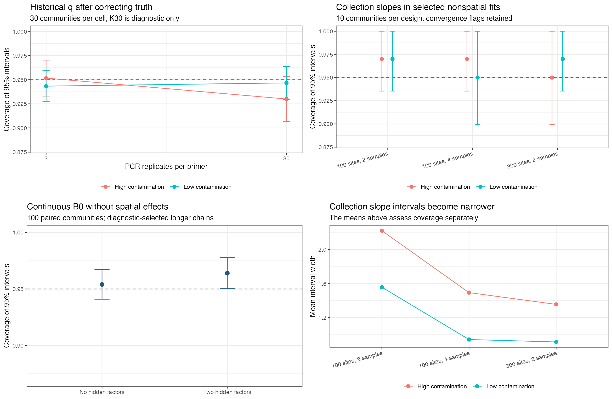

# Targeted interval calibration follow up

The historical q coverage collapse disappears when the intervals are compared with the probability of recorded positive reads. The selected nonspatial collection fits do not reproduce the earlier aggregate slope-undercoverage pattern after the generating coefficients are expressed in fitted covariate units. Their small sample size and numerical flags still prevent a general calibration claim. The clean continuous experiments give B0 coverage of 95.4% without hidden factors and 96.4% with two factors, rather than reproducing the historical 87.9% undercoverage. No production code or prior changed.

Doug requested this targeted follow-up on 8 October 2026 rather than the larger paper-scale study. The [protocol](PROTOCOL.md) separates incorrect scoring, collection row alignment, interval widths and occupancy-intercept bias. These results assess parameter recovery in simulated communities, not prediction at new sites or simulation-based calibration with all truths drawn from the fitted priors.

The high-contamination arms deliberately challenge the low-contamination assumption of the informative priors. In particular, high q is a stress test of the default Beta(1,20) laboratory-contamination prior. Poor recovery or mirror labellings under that mismatch do not, by themselves, establish a model or sampler defect under its intended prior assumptions. They document what can happen when those assumptions are unsuitable for a survey. Retain these results and diagnostic flags as stress-test evidence, while assessing performance under low contamination separately. The corrected historical q intervals themselves show no large coverage collapse in either regime.

## Historical q coverage

The old truth was the probability of a contamination event. The fitted q is the probability of recorded positive reads when the latent field-collection state is w = 0. It combines the contamination-event probability with the chance that an event yields at least one read. With the simulator's defaults, `round(exp(v) - 1) >= 1` requires `v >= log(1.5)`, where v is Normal with mean 1.5 and SD 1. The corrected truth is nominal q multiplied by 0.8631397734521575. The event exactly on the rounding boundary has probability zero.

All 2,400 saved q intervals from the four-cell 21 August 2026 experiment are preserved. Rescoring changes the comparison below; it does not simulate new data or refit historical code. Each cell contains 30 independent communities and 20 primer-species parameters per community. Uncertainty is computed across the 30 community coverage fractions, not across 600 independent parameters.

| Generating contamination range | PCR replicates per primer | Old coverage | Corrected coverage | Monte Carlo SE | Mean interval width | Corrected mean error |
|---|---:|---:|---:|---:|---:|---:|
| Low, nominal q 0.01-0.05 | 3 | 94.83% | 94.33% | 0.79 points | 0.03687 | +0.00400 |
| Low, nominal q 0.01-0.05 | 30 | 60.50% | 94.67% | 0.83 points | 0.00888 | +0.00013 |
| High, nominal q 0.15-0.30 | 3 | 68.33% | 95.17% | 0.91 points | 0.10390 | -0.00580 |
| High, nominal q 0.15-0.30 | 30 | 0.33% | 93.00% | 1.14 points | 0.02346 | -0.00064 |

The high-q K30 cell's 95% Monte Carlo interval is 90.67-95.33%, so this small study does not distinguish its observed 93% from nominal 95%. The earlier diagnosis of a large high-K q interval failure, including the supposed residual failure near the prior mean, is unsupported by these corrected decisions. This does not demonstrate calibration under every contamination level or identify a generally safe alternative prior. Retain the informative detection priors. q has a conjugate Beta update, distinct from the collection-slope Polya-Gamma update.

K30 is diagnostic only; Doug's operational limit remains six PCR replicates per primer. The historical archive contains intervals but no posterior draws, so convergence cannot be newly audited. Its recorded production revision is e155676 with a dirty source tree. These are corrected historical results, not a current-code fit comparison. [Individual corrected rows](results/historical-q-rows.csv), [community summaries](results/historical-q-replicates.csv), [aggregate uncertainty](results/historical-q-summary.csv), and [old versus corrected decisions](results/historical-q-correction.csv) retain the calculations.

## Collection coefficients and q in selected nonspatial fits

The 60 ordinary two-stage fits from the current-main recheck use production revision 2a75bf1: ten shared communities under each of low/high contamination, with two field samples at 100 sites, four samples at 100 sites, or two samples at 300 sites. Every design uses two primers and six PCR replicates per primer, with spatial effects absent. The known-U research control is excluded. All previously selected longer fits and their flags are preserved. The main maintenance changes since that source revision are outside these fits' provenance.

Collection truth uses each fit's actual sample-level covariate mean and SD. A raw slope b becomes `b * sd(x)`, and its intercept becomes `a + mean(x) * b`. Independent reconstruction verifies that the raw and fitted design matrices give the same true linear predictor. This correction is a change in scoring units. The earlier collection row-alignment fix is a separate production change; these results do not quantify how much each correction contributed to the historical apparent undercoverage.

| Design | Contamination | Slope coverage | Mean slope interval width | q coverage | Mean q interval width |
|---|---|---:|---:|---:|---:|
| 100 sites, 2 samples | Low | 97% | 1.558 | 95.5% | 0.02123 |
| 100 sites, 4 samples | Low | 95% | 0.943 | 96.5% | 0.01498 |
| 300 sites, 2 samples | Low | 97% | 0.914 | 96.5% | 0.01228 |
| 100 sites, 2 samples | High | 97% | 2.223 | 95.0% | 0.06492 |
| 100 sites, 4 samples | High | 97% | 1.494 | 96.5% | 0.04656 |
| 300 sites, 2 samples | High | 95% | 1.356 | 96.0% | 0.03876 |

Slope coverage Monte Carlo SE is 1.53-2.24 percentage points across ten communities per design. Coverage by negative, zero and positive slope truth is more variable: 91.7-100% for negative slopes, 92.5-97.5% for positive slopes and 94.2-100% for zero slopes, with sign-specific SEs reaching 5.69 points. Small groups and repeated species within a community prevent precise claims. Interval widths contract with added information, while the aggregate coverage estimates do not reproduce the old collapse. Signed mean error also varies by sign; cancellation in the aggregate does not establish negligible bias for every slope.

Numerical limitations remain. The strict screen flags 35 of 60 fits when any scored collection or q parameter has nonfinite Rhat, Rhat above 1.05, or bulk/tail ESS below 400: 17 low-contamination fits and 18 high-contamination fits. All 35 have an ESS flag; two also have Rhat above 1.05. The high-contamination 300-site community 5 collection intercept has Rhat 1.734 and bulk ESS 6.11, retaining the previously diagnosed mirror-labelling concern in that prior-mismatch stress test. Excluding flagged fits leaves only two to seven communities per cell. Slope coverage in that small sensitivity analysis ranges from 90.0 to 98.3%, and q coverage from 92.5 to 96.3%; these sparse results cannot certify calibration. The primary table keeps all selected fits.

Some groups cover every scored truth. Their empirical across-community MCSE is zero and the mechanical t interval degenerates to [1,1]; this describes the observed sample, not certainty of perfect coverage. [All fitted intervals](results/selected-nonspatial-rows.csv), [sign-specific and aggregate summaries](results/selected-nonspatial-summary.csv), [numerical diagnostics](results/selected-diagnostics.csv), [screened sensitivity](results/selected-screened-sensitivity-summary.csv), and [fit provenance](results/selected-fit-provenance.csv) preserve both the findings and their limits.

## Continuous intercept experiment

The 100 paired communities have 100 sites, ten species, two environmental predictors, two measured traits, two unmeasured traits and generating noise SD one. Spatial effects are absent. The two-factor arm uses the existing continuous simulator. Its no-factor control preserves the intercepts, environmental coefficients, traits and Gaussian residuals, subtracting only the realized hidden-factor contribution. Both the generating and fitted factor structures change; this is a mechanism check rather than a same-observation comparison. Default priors, including the Normal(0, SD 1) intercept prior and inverse-gamma noise prior, are retained.

All 200 initial fits and 77 prescribed longer fits are complete. Initial fits have two chains, 1,000 burn-in and 2,000 retained iterations; longer fits have four chains, 3,000 burn-in and 6,000 retained iterations. The diagnostic rule selected 76 two-factor fits and one no-factor fit, independent of coverage. Every selected fit emits no package warning and clears the B0/tau screen: maximum rank-normalized Rhat 1.01594, minimum bulk ESS 400.54 and minimum tail ESS 607.37. This checks the scored parameters, not every parameter in the model. The screened sensitivity therefore equals the primary result.

| Clean generating and fitted model | B0 coverage | Monte Carlo SE | 95% Monte Carlo interval | Mean B0 error | Mean B0 interval width |
|---|---:|---:|---:|---:|---:|
| No hidden factors | 95.4% | 0.66 points | 94.09-96.71% | +0.00082 | 0.39372 |
| Two hidden factors | 96.4% | 0.69 points | 95.03-97.77% | -0.00360 | 0.56736 |

Mean-error Monte Carlo intervals include zero in both arms. The two-factor arm has a small observed coverage excess; these results do not establish exact nominal calibration. Noise-SD tau coverage is 95.3% and 95.9%, with small positive mean errors of +0.00535 and +0.00513. Replacing diagnostic-flagged initial fits with longer fits changes B0 coverage by zero and -0.1 percentage point, and tau coverage by zero and +0.3 point. Longer chains improve the numerical diagnostics without changing the scientific finding.

Analytic Gaussian references help interpret the interval widths. Supplying true environmental effects, realized factor effects and noise SD gives B0 coverage 95.4% in both arms and mean width 0.39005. Instead integrating the Gaussian factors using their true covariance gives 95.4% without factors and 96.8% with factors, with widths 0.39005 and 0.57642. These conditional references do not estimate unknown nuisance parameters and are not substitutes for the full-model fits. A separate check draws 20,000 joint coefficient updates from the actual `sampleB_SoR()` implementation at each noise SD 0.5, 1 and 2. Its means and full covariance matrices agree with their analytic targets within the prespecified Monte Carlo tolerances, including a nonzero coefficient covariance.

The old continuous archive has 200 communities, spatial effects and hidden factors, with B0 coverage 87.9% and mean error +0.0066. It remains unchanged. Current code and a clean configuration differ from that historical experiment, so this follow-up cannot attribute the difference to one component, explain the old spatial result or establish a defect was repaired. The historical assertion that estimated tau was under-propagated into B0 intervals was an untested explanation; these checks do not establish it. Broader spatial and scenario calibration remains open. Keep this interval-width question separate from occupancy/two-stage intercept bias and the completed occupancy-intercept-prior study.

[Initial results](results/continuous-initial-summary.csv), [selected results](results/continuous-selected-summary.csv), [selection and diagnostics](results/continuous-selection.csv), [initial-to-selected changes](results/continuous-substitution.csv), [screened sensitivity](results/continuous-screened-sensitivity-summary.csv), [known-nuisance reference](results/continuous-known-nuisance-summary.csv), [known-covariance reference](results/continuous-known-covariance-summary.csv), and [Gaussian update check](results/gaussian-update-reference.csv) preserve the numerical evidence.



## Reproduction and verification

Study scripts live beside this report. Raw inputs, fits, logs, source and the private installation remain locally at `dev/simstudy/results/interval-calibration-20261008/`, which is ignored by Git. Historical archives and all input fits are unchanged. Compact CSV evidence is retained in [results](results/). The independent review checks corrected q scoring, fitted-scale collection truth, actual posterior interval endpoints, paired Gaussian residuals, reference formulas and the diagnostic selection rules.

The final independent audit passes [2,600 checks](results/verification.csv). It reconstructs historical q truth by numerical density integration, all 60 selected collection/q interval endpoints, all 200 selected continuous B0/tau interval endpoints, fitted/input identities, preserved executed-script hashes, frozen production/library hashes and the diagnostic-only selection rule. Alternative Gaussian formulas reproduce both analytic references for every community. Coverage uncertainty is independently recomputed across communities, and an empty screened-sensitivity regression preserves missing cells explicitly. All four longer-fit status manifests reconcile with the 77 selected keys. The Gaussian update check passes at all three noise scales, and the final figure has been visually inspected. A separate independent review found no unresolved critical or important issues and confirmed the 277 initial/long result records, provenance, summaries and qualified conclusions. [Source identities](results/source-hashes.csv) and [compact artifact identities](results/artifact-hashes.csv) record the delivered files.

The continuous fitting source is frozen at c9ad954aea21901dee85d06e817a3e8a7b93625a, recorded in the archive's `source-revision.txt`. The private installation uses R 4.5.0 and the existing R 4.5 dependency library. Its native library links explicitly to R 4.5. The machine's default R 4.6 installation has no matching dependencies and is unsuitable for reproducing this run. An isolated local R 4.5 launcher avoids changing the system installation.

The fitting archive preserves `runner-executed.R`, `helpers-executed.R` and `simstudy-helper-executed.R`, whose hashes match the initial and longer-fit records. A concurrent-startup settings-file race affected three launch attempts before they fitted any community. Restarting those workers after the file was complete recovered the jobs. Editing the maintained launcher during active Rscript execution also caused shard 3 to parse stray trailing text after saving all 19 jobs and its successful status. Restoring the exact executed file allowed the remaining workers to exit successfully; a separate completion audit reused all 19 shard-3 results and exited successfully without new MCMC. All 77 longer jobs are present, and both incidents' logs are retained. The maintained runner now atomically saves startup settings and inputs; four concurrent empty-job startup checks pass. This startup correction changes the maintained runner's hash and no scientific calculation. Keep fitting scripts unchanged while their processes run. Use a fresh fitting archive with the maintained runner; the existing archive's resume checks intentionally reject a changed runner.

For a fresh run, export revision c9ad954 into the archive's `source/` directory, install it into `library/`, and save its full revision in `source-revision.txt`. Use a matching R installation with the recorded dependencies. Supply the repo root and fresh archive path to these commands; on this machine replace `Rscript` with the verified local R 4.5 launcher. If PSOCK sockets are restricted, use four disjoint shell shards with `--workers=1 --shard=1`, through `--shard=4`; each writes its own status file. Keep four active fitting processes at most.

```sh
Rscript dev/simstudy/interval-calibration/rescore.R
Rscript dev/simstudy/interval-calibration/run-continuous.R --study=/path/to/fresh/archive --mode=pilot --workers=4 --reps=100
Rscript dev/simstudy/interval-calibration/run-continuous.R --study=/path/to/fresh/archive --mode=initial --workers=4 --reps=100
Rscript dev/simstudy/interval-calibration/run-continuous.R --study=/path/to/fresh/archive --mode=long --workers=4 --reps=100
Rscript dev/simstudy/interval-calibration/summarise.R /path/to/repo /path/to/fresh/archive
Rscript dev/simstudy/interval-calibration/verify.R /path/to/repo /path/to/fresh/archive
Rscript dev/simstudy/interval-calibration/conditional-reference.R /path/to/repo /path/to/fresh/archive
Rscript dev/simstudy/interval-calibration/plot.R /path/to/repo
```
