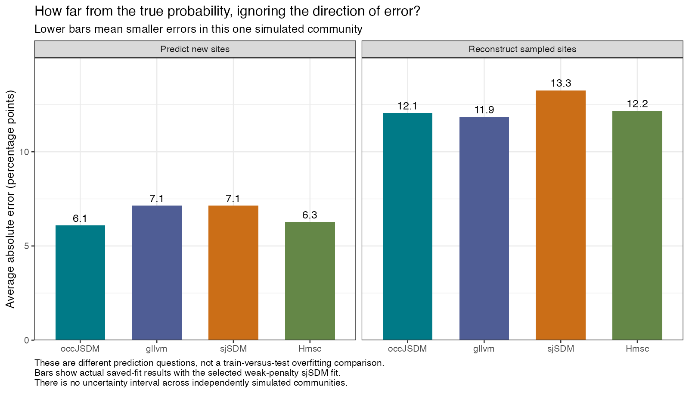
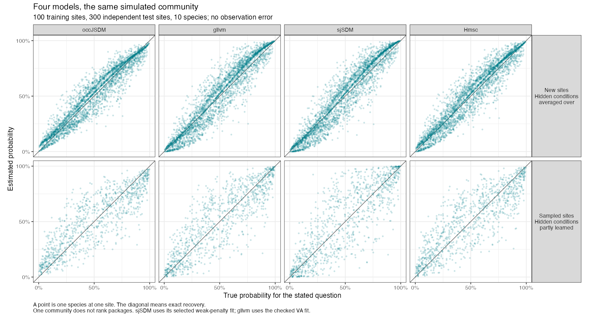

# Lesson 4 pilot: fitting four comparable JSDMs

Run on 22 September 2026. This report records actual fits, not installation tests. This development report supports the [student-facing Lesson 4](../../../vignettes/occJSDM-lesson-4.md).

All four packages receive the same 100 sites, ten species and two environmental measurements. Each species is recorded as present or absent without observation error. Every model has room for two hidden site factors. A separate set of 300 sites is reserved for prediction. The simulator, complete ecological parameter table and all fitting attempts are saved.

## What is comparable, and what still differs

The packages have the same information and the same intended model size. They do not have identical statistical assumptions. Hmsc uses probit; occJSDM, gllvm and sjSDM use logit. The simulated community uses logit. The Bayesian packages also use their own default priors. gllvm has no explicit coefficient or covariance penalty. The sjSDM result now reported uses the optimiser's default weak weight decay of 0.0001; the original unpenalised sjSDM fits are retained in the record and discussed below.

This is one pilot community, so its errors cannot establish a general ranking or a package's systematic bias. A later benchmark would need many communities, including both logit and probit generating models.

| Package | Frozen version and actual configuration |
|---|---|
| occJSDM | 0.1.0 at main commit 3a97267; binary JSDM, two factors, zero latent traits, no spatial or observation stages. Four chains, 2,000 warm-up and 4,000 retained draws per chain. |
| gllvm | 2.0.15; binomial logit, two unconstrained factors, VA approximation. EVA was tried first and rejected for unstable, extreme fits. Multiple initialisations retained. |
| sjSDM | R package 1.0.7 from Doug's fork release v0.2.1, commit d2ca508; linear logit, df = 2, PyTorch CPU, float64, no covariance/environment penalty. Original pilot: zero optimiser weight decay. Revised selection (23 September 2026): default weight decay 0.0001, 3,000 epochs at learning rate 0.002 plus 1,000 at 0.0002, twelve independent starts. Mojo was not used or upgraded. |
| Hmsc | 3.3-7; binary probit, one independent site random level with minimum and maximum factor counts both two. No traits or phylogeny. Four chains, 2,000 warm-up and 4,000 retained draws per chain. |

The environmental columns are centred and scaled using training sites only. Hmsc's additional X scaling is disabled. occJSDM's internal centring/scaling is explicitly checked and is numerically the same because its input is already standardised. The fitted species and site order is verified against the saved input. No test outcomes or known hidden factors enter fitting or fit selection.

For reproducibility, occJSDM retains its default normal intercept/loading priors, the common environmental-coefficient scale, and the hidden-score scale; the two scale variances have inverse-gamma shape 10 and scale 1. Disabling latent traits does not remove this shrinkage. Hmsc retains its default community coefficient hierarchy and factor shrinkage, including random-level a1 = a2 = 50 and b1 = b2 = 1. These differences may affect the answer and must be taught alongside a comparison; matching the factor count does not make the priors equivalent.

## What the fit checks mean

A model can finish running without giving a trustworthy fit. We checked whether repeated Bayesian chains agree, whether enough effectively independent draws remain, whether repeated optimisation starts agree, and whether the reported probabilities can be reproduced from saved numeric parameters.

For occJSDM and Hmsc, the checks cover all environmental coefficients, the residual covariance, 50 probabilities on a fixed environmental grid, and all 1,000 sampled-site probabilities. We check covariance rather than individual factor axes because axes can rotate without changing the ecological model.

The required diagnostic thresholds were Rhat at most 1.01 and both bulk and tail effective sample sizes at least 400. Both Bayesian fits passed all 1,135 monitored quantities. occJSDM's largest Rhat was 1.0015 and its smallest bulk/tail ESS were 3,674/4,894. Hmsc's corresponding values were 1.0048 and 1,051/516. These are checks of sampling reliability, not proof that either model recovers the truth without error.

The gllvm work is a useful teaching warning. All six EVA starts reported convergence, yet produced very large effects and very different objective values. These runs are retained as failed checks, not used to assess prediction accuracy. VA gave finite estimates. Some VA starts still stopped at inferior solutions, including almost zero residual variation. The best VA solution was reproduced from a separate, residual-based initialisation. We select by the fitting objective, check its gradient, and keep every poorer start in the record. We never select a start because its answers resemble the simulated truth.

## The two probability questions

**At a sampled site**, the recorded community can tell us something about that site's hidden conditions. Compare the fitted probability with the true probability that includes those conditions. This is reconstruction of the data used for fitting, not independent predictive performance.

**At a new, unsurveyed site**, the model knows only the two environmental measurements. It must average over the hidden conditions it cannot see. Compare this average prediction with the true probability averaged over the same possible conditions. If the actual hidden conditions happened to favour a species at one simulated site, the model cannot discover that fact from environmental data alone.

The study uses posterior means for Bayesian fits and parameter estimates for optimised fits. For new sites, it integrates normally distributed hidden conditions rather than setting them to zero. For sampled sites, it uses paired Bayesian parameter/site-score draws; for the optimised models, it integrates hidden conditions conditional on the complete observed community, holding the estimated global parameters fixed. The latter is a checked study calculation and is not claimed to be the package's ordinary native prediction output.

These target definitions follow the agreed [pilot design](DESIGN.md). In particular, native [gllvm level-zero predictions](https://jenniniku.github.io/gllvm/reference/predict.gllvm.html) set hidden scores to zero; [Hmsc's prediction interface](https://cran.r-project.org/web/packages/Hmsc/refman/Hmsc.html) supports new random-level units. The study checks the installed source as well as the documentation.

## Results from the saved fits

These are actual results from this simulation, not illustrative numbers. Each error compares an estimated probability with the corresponding known probability. An average absolute error of 6.1 percentage points means that the estimates miss their targets by 6.1 points on average, ignoring whether the miss is upward or downward. It does not mean every estimate is 6.1 points wrong.

| Package | New sites: average absolute error | Sampled sites: average absolute error | Fit assessment |
|---|---:|---:|---|
| occJSDM | 6.1 points | 12.1 points | Passed the planned chain checks |
| gllvm | 7.1 points | 11.9 points | Best VA solution reproduced; multiple starts necessary |
| sjSDM | 7.1 points | 13.3 points | Selected weak-penalty fit: the better of two verified local maxima, reached by four of twelve independent starts |
| Hmsc | 6.3 points | 12.2 points | Passed the planned chain checks |

The new-site errors are smaller here because that target averages over hidden conditions. Reconstructing the particular hidden conditions at a sampled site is a different, harder target in this experiment. Do not read the two columns as evidence that predictions improve merely because sites were held out.

All four mean signed errors are about +1.0 to +1.2 percentage points. That small net error hides individual errors in both directions. The absolute-error column is the better answer to “how far off are the estimated probabilities?”. The direction and size of errors are also saved [by probability band](stability-resolution-results/revised-errors-by-band.csv) and [by species](stability-resolution-results/revised-errors-by-species.csv), with cell counts. Counts are species-by-site comparisons, not independent replicated communities. The original pilot tables, with the provisional unpenalised sjSDM fit, remain in [pilot-results/](pilot-results/); the only row that changed is sjSDM's, whose sampled-site error moved from 13.6 to 13.3 points and whose new-site error is unchanged at 7.1.

The scatterplots compare probabilities, not predicted labels with observed zeros and ones. A point on the diagonal is correct; above the diagonal is an overestimate. All packages retain appreciable uncertainty about the particular hidden conditions at sampled sites.

On the 3,000 held-out presence/absence observations, Brier scores range from 0.1817 to 0.1827 and average negative log scores from 0.5414 to 0.5474. Lower is better for each score. These are scores for predicting the observed outcomes, not percentage-point errors against the underlying probabilities. They are very similar in this one community; no uncertainty interval across independently simulated communities is available.

sjSDM's original longer runs, with zero weight decay, had checked training log likelihoods of -483.795, -484.006 and -484.001. Their spread, 0.2115, exceeded the predeclared 0.1 stability check, so the first version of this report labelled the best of them provisional. The [stability follow-up](SJSDM-STABILITY-REPORT.md) then established the cause: with the optimiser's default weak penalty restored, the penalised training objective has two genuine local maxima, verified by a curvature check that finds exactly one flat direction (the factor rotation) and positive curvature everywhere else. Twelve independent native starts reached the better maximum four times and the other eight times; within each maximum the penalised objectives agree within 0.01 and fixed-grid predictions within 0.1 percentage points. The selection rule, recorded before truth was read, took the native fit with the highest penalised training objective, provided its maximum was reached at least twice and the within-maximum checks passed. Start 11 was selected. Its new-site predictions differ from the original provisional fit by at most 0.38 percentage points; the two maxima differ from each other by at most 1.9 points at new sites but by up to 39 points for some sampled-site reconstructions, concentrated in species 2 and 9, whose hidden-factor loadings swap roles between the solutions.

For gllvm, the selected VA objective is -496.1907, independently reproduced by two starts; the selected fit's maximum absolute gradient is 0.000676. Other starts find poorer solutions, so the lesson must show a multiple-start check. This objective belongs to the VA approximation and must not be compared numerically with sjSDM's integrated likelihood or used to rank packages.

Numerical integration was checked by a finer rule or an independent integral. The largest new-site probability difference was less than 0.000004 percentage points, and the largest sampled-site difference was 0.00018 points. These are numerical approximation errors, much smaller than the ecological estimation errors in the table. The exact checks are saved for the [original pilot](pilot-results/integration-checks.csv) and the [revised selection](stability-resolution-results/revised-integration-checks.csv).

## Saved evidence and reproduction

The scripts in this directory generate the data, fit each model in a fresh R process, check convergence, select fits using training information only, and extract comparable probabilities. The full fitting budget and all subsequent diagnostic decisions are in [RUN-PLAN.md](RUN-PLAN.md). The frozen ecological coefficients, selected-fit identifiers, every fit attempt, convergence tables, probability estimates and figures are in [pilot-results/](pilot-results/).

Full fits and logs are outside Git at `/Users/douglasyu/Documents/Codex/2026-09-10/fam/work/lesson-n-pilot-20260922`. The isolated package library and launcher are at `/Users/douglasyu/Documents/Codex/2026-09-10/fam/work/lesson-n-environment-20260922`. These local paths are required to rerun the current saved environment; they are not package-build dependencies. Development material under `dev/` is excluded from the R package build. No R or C++ package code differs between the original design's intended occJSDM revision 8654ff1 and the installed snapshot 3a97267; the source-baseline update does not change this fitted model.

## Execution limitations and what comes next

The longer sjSDM workers completed their fits and saved complete numeric parameters and success records, but then exited with an R parser error: the driver file had been edited while those processes were reading it. This was an execution mistake, not a clean process exit. We retained the logs and validated the saved fits in fresh R processes, including their training-data hashes, native-prediction reconstruction, and independent integrated likelihood. Future long runs must use an immutable copied driver or parse the driver fully with `source()` before execution. No fits were rerun or discarded to conceal this issue.

The Hmsc native-prediction verification required a local serial wrapper because this environment cannot report its CPU count. A single-posterior-draw call also exposed a singleton-dimension problem; duplicating that same draw twice allowed the comparison. Neither workaround changes the fitted posterior. The mathematical prediction helper matched the resulting native predictions.

The [sjSDM follow-up](SJSDM-STABILITY-REPORT.md) was paused on 22 September and completed on 23 September 2026. Lesson 4 now uses the revised weak-penalty selection, keeps the original provisional result in its record, and teaches the two-local-maxima finding alongside readable simulation/fitting/extraction code and probability-scale environmental response curves. Repeated communities, larger sample sizes, a probit-generating scenario, matched prior sensitivity and spatial comparisons remain later work. No package source code was changed by this pilot.
