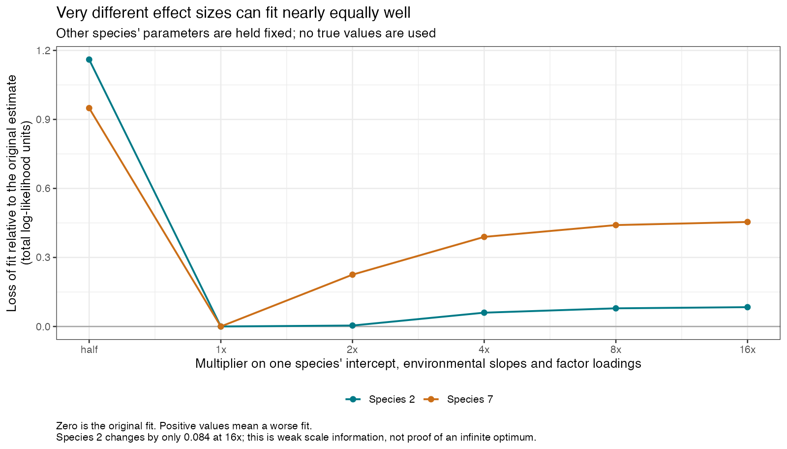
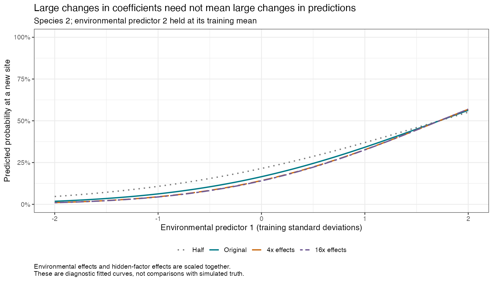

# Why the first sjSDM fits were not fully stable, and how it was resolved

Resolved on 23 September 2026; see the final section. The [handover](SJSDM-STABILITY-HANDOVER.md) records the state at which the investigation was paused the day before.

This continues the [four-package pilot](FITTING-REPORT.md). The investigation uses the same training data and the same two-factor logit model. Test outcomes and simulated truth are not used to choose fitting settings. Original results are retained.

## What the first checks showed

The original longer fits had a 0.2115 gap in their precisely calculated training log likelihoods. We had set a 0.1 computational stability check, so the sjSDM row remained provisional.

That difference is real, not just rounding. However, ordinary package output makes it difficult to see precisely what is happening. This sjSDM version rounds its training loss to three decimal places per site. It also evaluates its final displayed likelihood using only 100 random integration draws by default, even when fitting used 2,000. We therefore calculate a more precise likelihood from the saved parameters and check it with finer integration.

We also checked the likelihood's slope with respect to the fitted parameters. A nonzero slope means a small parameter change could improve the fit. The largest absolute slopes in the three original endpoints were 0.0723, 0.0591 and 0.0647. An independently checked numerical derivative confirms the calculation.

## Smaller steps alone did not solve it

We restored each saved fit and continued the native PyTorch fitter for another 1,500 iterations, with a learning rate ten times smaller. The statistical model and random-integration budget remained the same. We reset the optimiser because its internal history was not saved, and verified that it updated the restored parameter objects.

All three continuations completed cleanly. Their likelihoods improved by only 0.006 to 0.011. The likelihood spread remained 0.2162, still above 0.1; maximum differences among predictions on the fixed environmental grid fell to 0.793 percentage points. This illustrates the distinction between stable predictions and stable fitted parameters/objectives. It does not satisfy both of our original computational checks.

## A misleading apparent improvement was rejected

As a diagnostic, we tried deterministic optimisation of the same likelihood, using a fixed grid to integrate hidden factors. These were separate reference calculations, not native sjSDM fits.

Their optimiser reported convergence and apparently better scores, but the parameter magnitudes grew enormously. The grid could no longer resolve the sharp probability transitions, and a finer grid gave different answers. We rejected all three reference endpoints. They are not used for prediction comparisons. This is why a convergence flag and a better displayed objective are insufficient by themselves.

## The data weakly constrain some effect sizes

We then used a more careful integration that explicitly resolves the sharp transition for one species at a time. Starting from the best native continuation, we multiplied a species' intercept, environmental slopes and factor loadings together by a fixed amount, holding every other parameter unchanged.

For species 2, multiplying all those effects by 16 worsened the precise training log likelihood by only 0.084. For species 7, the worsening was 0.454. These profiles do not prove that a global maximum lies at infinity; indeed, simply increasing those scales did not improve the fit. They do show that substantially different effect sizes can fit this small community almost equally well.

The integration was checked twice. Doubling the resolution in the other factor changed the profile log likelihood by at most 0.00004, and the scale-one likelihood matched our original independent calculation. The conclusions therefore do not rely on the inadequate coarse reference above.

The second figure explains why this matters to an ecologist: very different coefficient sizes can produce similar predicted probability curves when environmental effects and hidden variation grow together. A large raw coefficient is not, by itself, evidence of a much larger change in occupancy probability.

## Testing the package's usual weak penalty

The initial pilot deliberately set optimiser weight decay to zero. sjSDM's exposed RMSprop default is 0.0001. Restoring that small penalty discourages very large environmental effects and factor loadings, including the intercept weights. It adds information about plausible parameter size, so it changes the estimate and must be labelled as a separate regularised fit.

The sensitivity arm uses exactly the same seeds and fitting settings as the original three longer fits, except for this default weight decay. Selection and checks use the penalised training objective, not unpenalised likelihood or closeness to simulated truth. The three fits completed, but their penalised-objective spread was 0.1261, still above 0.1. A final continuation of 1,000 smaller steps reduced the largest fixed-grid prediction difference to 0.706 percentage points; its penalised-objective spread remained 0.1264. All three final integration checks agreed within 0.000000001 log-likelihood units. These results do not pass both declared stability checks.

Doug then redirected work to building Lesson N, and the first version of the lesson labelled sjSDM provisional with the original unpenalised fit. Stable predictions on the checking grid do not establish stable parameter estimates or eliminate uncertainty elsewhere. The investigation resumed afterwards; its outcome is below.

Independent review found no blocking mathematical or data-leakage issue. One minor robustness improvement remains: the unpenalised continuation checker reports its fine-grid disagreement but does not include that guard in its `passed` flag. The observed disagreement is at most 5.2e-9, so this does not change the current failed stability assessment; both penalty checkers already enforce the guard.

## Two genuine local maxima

Deterministic refinement of the three weak-penalty endpoints, with the analytic gradient and 81-node quadrature checked at 161 and 241 nodes, reached two stationary solutions: one with penalised score about -484.30, reached from start 1, and one with score about -484.43, reached from starts 2 and 3, which agree to 1e-5 in every coefficient after a factor rotation. A native random-integration check at the three endpoints showed that Monte Carlo noise in the package's objective does not explain the gap.

The Hessian of the penalised negative log likelihood was then computed at each solution by central differences of the analytic gradient, at 121 and again at 161 nodes. Each has exactly one eigenvalue within 1e-6 of zero, whose eigenvector coincides with the factor-rotation direction to machine precision, and 49 positive eigenvalues between about 0.04 and 20.6. Both solutions are genuine local maxima; neither is a saddle. Along the straight path between them, after aligning their factors, the penalised score falls to 0.25 below the lower solution about 45% of the way across. The solutions are about 4.3 parameter units apart and differ almost entirely in species 2 and 9: the better solution gives species 2 a residual SD of 3.3 and species 9 of 1.0, the other gives 1.1 and 3.1. Compact records are in `stability-resolution-results/`: `curvature-summary.csv`, `path-profile.csv` and `species-differences.csv`.

## Twelve independent starts and the recorded selection

Because the repeated-fit spread criterion assumed one optimum, the assessment was restated before running anything further: report how often independent native starts reach each maximum; require native endpoints within the best maximum to agree within 0.1 in penalised score and within 1 percentage point on the fixed grid; require that maximum to be reached by at least two independent starts; and select the native fit with the highest precise penalised training objective if those conditions hold. Nine fresh native starts (seeds 26092804 to 26092812), each with the same 3,000-epoch fit and 1,000-epoch low-step continuation, joined the original three. Every one of the twelve endpoints was classified by deterministic refinement to within 2e-4 of one of the two known solutions. Four reached the better maximum (starts 1, 9, 10, 11) and eight the other. Within the better maximum the native penalised scores span 0.0064 and grid predictions 0.078 points; within the other, 0.0025 and 0.096 points. Start 11, with penalised score -484.3043, was selected. The selection was saved before truth was read; see `multistart-summary.csv`, `multistart-basins.csv` and `multistart-assessment.csv`.

## What the revision changed

The revised sjSDM export scores 7.14 points average absolute error at new sites and 13.3 at sampled sites, against 7.14 and 13.6 for the original provisional fit. New-site predictions moved by at most 0.38 points. The two maxima differ by at most 1.9 points at new sites and by up to 39 points for some sampled-site reconstructions, mostly species 2 and 9, while their average errors are almost identical. The Lesson N bundle was re-exported from the separately versioned `revised/` results root and re-verified; the original selection and exports are unchanged in the archive. Lesson N now reports the revised fit and teaches the two-maxima finding in its computation-check section.

## Reproducibility

The detailed predeclared steps and subsequent diagnostic decisions are in [SJSDM-STABILITY-PLAN.md](SJSDM-STABILITY-PLAN.md). Full continuations, rejected references, profiles, gradients, logs and scripts from the first investigation are under the original run directory's `stability/` folder. The resumed work, curvature check, multistart fits, revised selection and revised export are committed in [stability-resolution-archive/](stability-resolution-archive/), because the working copy that produced them was temporary; the [README](README.md) lists its contents. Each long worker executes an immutable script snapshot parsed with `source()`. No package source or global Python/R environment is changed. Mojo remains unused.
