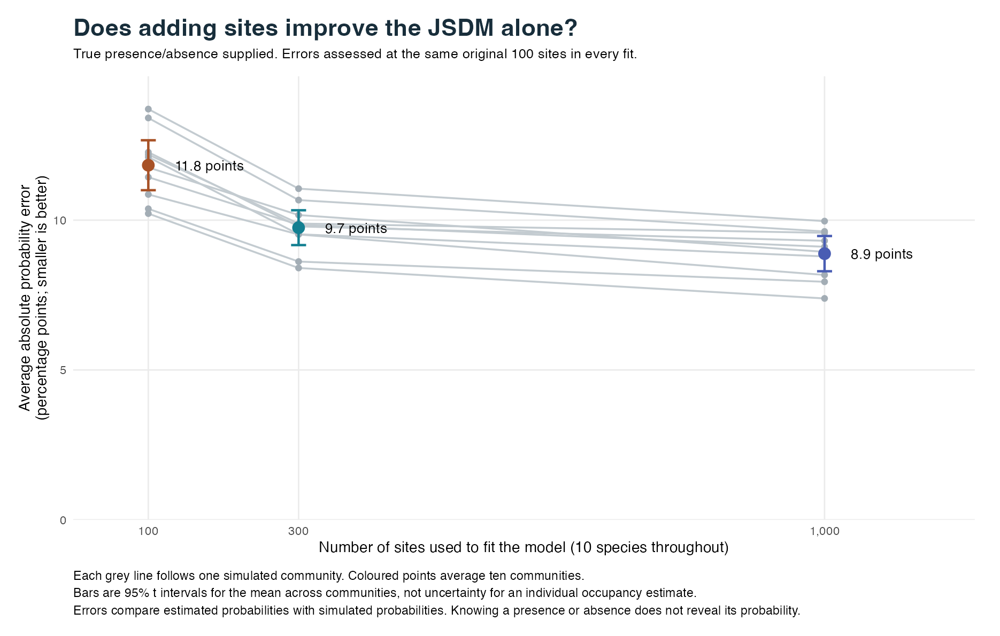
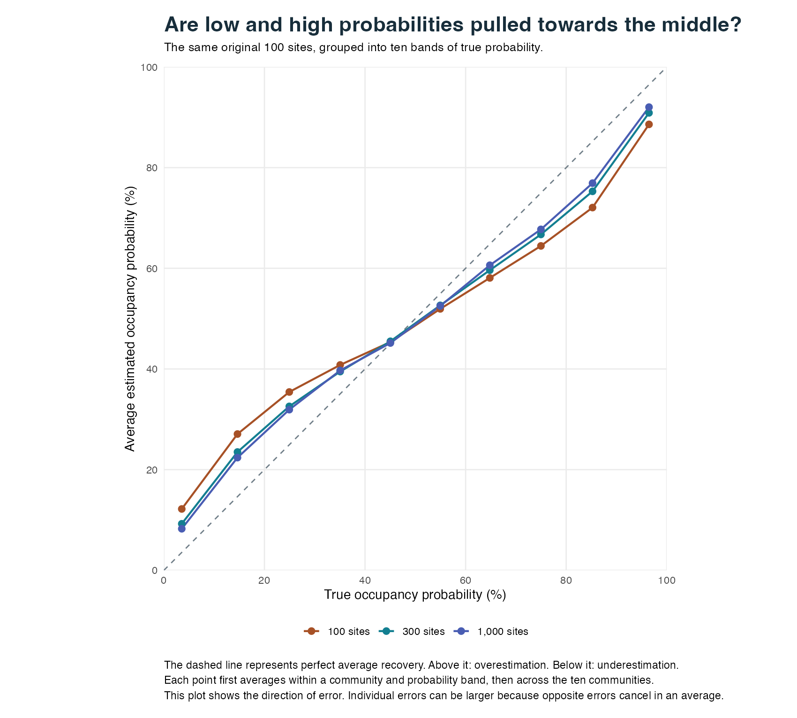
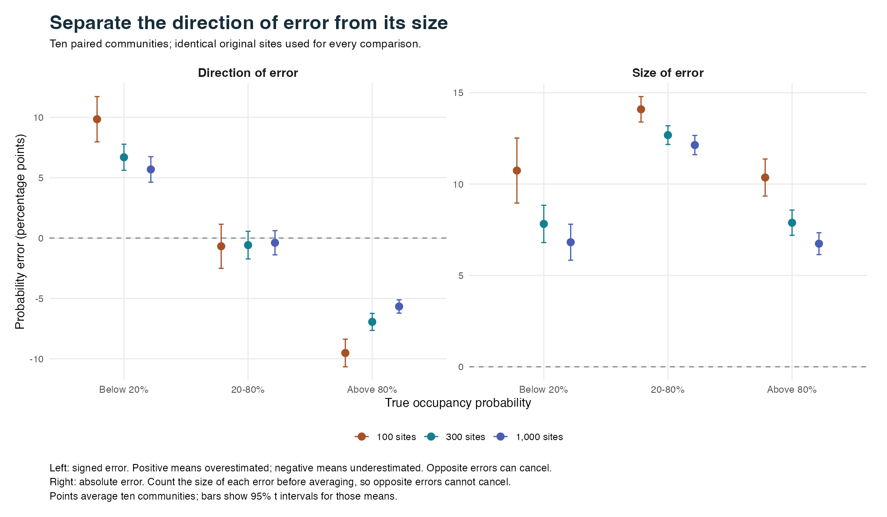

# Does the JSDM improve with more sites when observation is perfect?

19 September 2026. Follow-up to the [non-spatial sampling-design comparison](nonspatial-design-recheck.md).

**Adding sites helped, but substantial error remained.** Average absolute occupancy-probability error fell from **11.8 percentage points with 100 sites**, to **9.7 with 300 sites**, and **8.9 with 1,000 sites**.

These are errors in estimated **occupancy probabilities**, measured at the same original 100 sites. Every model receives the true presence/absence states, so collection failures, PCR failures and false positives play no part in these results.

## What we compared

We fitted each of ten simulated communities three times: once using 100 sites, once using 300, and once using 1,000. Each community contains the same ten species at every size. The environmental relationships, species traits and underlying community structure are preserved. The larger datasets add independent sites; they do not replace or resimulate the original sites.

The model receives the two measured environmental covariates, two measured species traits and the true presence/absence matrix. It still has to estimate species responses and the unmeasured conditions at each site. We retain two site factors and two latent traits, use the same default priors, and fit no spatial effects. There is no field-sample or PCR-replicate setting in this binary JSDM comparison.

The 100- and 300-site inputs are the same ecological communities used in the latest sampling-design study. Its low- and high-contamination versions share identical ecological truth, so we use one copy. The new 1,000-site inputs preserve all 300 existing sites and add 700. The original ten communities each contribute equally to the reported averages.

The previous exact-occupancy study reported an absolute error of about **11.7 points at 100 sites**. That came from different simulated communities. Here we refit the 100-site control on the communities used for this comparison. The previous 11.7-point estimate was a measured error at one sample size, not an established minimum error that no amount of data could improve.

## How much does adding sites help?

| Sites used for fitting | Average absolute error | Average signed error | All fitted sites: absolute error |
|---:|---:|---:|---:|
| 100 | 11.8 points | -0.3 points | 11.8 points |
| 300 | 9.7 points | -0.4 points | 9.5 points |
| 1,000 | 8.9 points | -0.3 points | 8.6 points |

The first two error columns always assess the **same original 100 sites**. This is the main comparison: does observing additional sites improve what the model can infer about those original sites? The final column is a secondary check using every site included in each fit; its set of assessed sites changes with sample size.

**Absolute error measures how far an estimate misses.** For each species at each site, subtract the true probability from the estimated probability and take the size of the difference. Then average. Opposite errors cannot cancel. An average error of ten percentage points would mean missing by that amount on average; it would not mean every estimate misses by exactly ten points. That ten-point example explains the units; the table above contains the measured results.

**Signed error measures the direction of the miss.** Positive means overestimated; negative means underestimated. A small overall signed error can coexist with a large absolute error because overestimates and underestimates cancel. It therefore cannot substitute for the absolute-error column.

| Added sites | Reduction in absolute error | 95% interval across ten communities | Communities that improved |
|---|---:|---:|---:|
| 100 to 300 | 2.08 points | 1.71 to 2.46 points | 10 of 10 |
| 100 to 1,000 | 2.95 points | 2.59 to 3.31 points | 10 of 10 |
| 300 to 1,000 | 0.87 points | 0.63 to 1.10 points | 10 of 10 |

These changes are paired within each community before averaging. The intervals describe uncertainty in the average improvement across ten simulated communities. They are not uncertainty intervals for individual occupancy estimates and do not establish performance across all ecological systems.

Going from 100 to 1,000 sites reduced the average absolute error by about **25%**. It did not remove it. Increasing from 100 to 300 sites improved 10 of the ten communities; increasing from 300 to 1,000 improved 10. The extra 700 sites produced a smaller average gain than the first extra 200 sites. This shows diminishing gains over the three sizes tested, without establishing the shape of the curve beyond 1,000 sites.

## What happens to low, middle and high probabilities?

A low probability means that a particular species is unlikely to occupy a particular site. It does not necessarily mean the species is rare across the whole landscape. The same species can have a low probability at one site and a high probability at another.

| True probability | Sites used for fitting | Average true probability | Average estimate | Signed error | Absolute error |
|---|---:|---:|---:|---:|---:|
| Below 20% | 100 | 7.1% | 17.0% | +9.8 points | 10.7 points |
| Below 20% | 300 | 7.1% | 13.8% | +6.7 points | 7.8 points |
| Below 20% | 1,000 | 7.1% | 12.8% | +5.7 points | 6.8 points |
| 20-80% | 100 | 50.1% | 49.4% | -0.7 points | 14.1 points |
| 20-80% | 300 | 50.1% | 49.5% | -0.6 points | 12.7 points |
| 20-80% | 1,000 | 50.1% | 49.7% | -0.4 points | 12.1 points |
| Above 80% | 100 | 92.8% | 83.3% | -9.5 points | 10.4 points |
| Above 80% | 300 | 92.8% | 85.9% | -6.9 points | 7.9 points |
| Above 80% | 1,000 | 92.8% | 87.1% | -5.7 points | 6.7 points |

Values are rounded separately to one decimal place, so subtracting the displayed averages can differ from the displayed signed error by 0.1 point.

The average true probability in each band is the same across sample sizes because we assess exactly the same species-site combinations. **The low-band signed error is an average over probabilities below 20%, not an error to add to 20% itself.** Likewise, the high-band result is an average over probabilities above 80%. The true and estimated averages in the table show precisely what was compared.

For example, the low-probability group had an average true probability of **7.1%**. With 100 fitting sites, its average estimate was **17.0%**; with 1,000 fitting sites it was **12.8%**. The larger fit reduced that average overestimate. High probabilities were still underestimated at 1,000 sites, by **5.7 points** on average. In the middle band, the signed error was **-0.4 points**, while the absolute error was **12.1 points**. That difference is why both measures matter.

In this figure, perfect average recovery would follow the dashed diagonal. Points above the line are too high; points below it are too low. We first average within ten bands of true probability in each community, then average across communities. Averaging can conceal individual errors, which is why the next figure also shows their absolute size.

Read the left panel as **which way are the errors going?** Read the right panel as **how large are the errors?** A middle-band signed error near zero does not mean that middle-band probabilities were estimated accurately. Some were too high and others too low.

## Why is there still error with perfect observations?

Perfect observation tells us whether a species actually occurred at a site on this occasion. It does not reveal the probability that produced that occurrence. For example, a presence can arise when the underlying probability is 20%, 50% or 90%. Those example probabilities illustrate the distinction; they are not additional simulation results.

More sites provide more examples from which to learn shared species-environment relationships and community structure. That is why adding sites can help even when the original sites' presence/absence records are already known perfectly.

However, **each original site still supplies only ten binary observations, one per species**. Its unmeasured conditions remain uncertain. The larger model also has to learn unmeasured conditions at each newly added site. Increasing site count therefore improves some sources of information while leaving others limited. We have not isolated how much of the remaining error comes from uncertain site conditions, uncertain shared relationships or the priors.

These results do not establish a universal error floor or show that error will eventually reach zero. Three sample sizes and ten communities are insufficient to identify such a limit. They also do not determine whether adding sites, adding species or measuring more environmental variables would be the best next investment in a particular field study.

## What this means for prediction and the beta assessment

The comparison measures **recovery of probabilities at sites used to fit the model**. All fits have seen the true presence/absence states at the original sites. It does not measure prediction at entirely new sites, where those states and the unmeasured site conditions would be unavailable. A separate held-out-site experiment is needed to answer that question.

The larger site counts help the JSDM alone in these simulations. They do not, by themselves, show how well a 1,000-site eDNA survey would perform: a real survey would reintroduce uncertainty from collection and detection. The [sampling-design report](nonspatial-design-recheck.md) measures that separate problem at 100 and 300 sites.

No non-spatial release target was set for this study. Doug asked to see the errors first. These results inform that decision; they do not mark a beta requirement as approved or complete. This ten-community design also does not provide a broad assessment of genuinely rare species.

## Numerical checks and reproducibility

All 30 initial fits completed with two chains, 3,000 burn-in iterations and 5,000 retained iterations per chain. Two 1,000-site fits flagged disagreement between chains for the parameter controlling the scale of unmeasured site variation (`sigma_h`): `n1000-02`, `n1000-04`. We repeated these with four chains, 6,000 burn-in and 12,000 retained iterations per chain. The tables and figures use these longer fits in place of the two initial fits; all original fits are preserved. The longer checks changed a ten-community group signed error by at most **0.008 points** and a group absolute error by at most **0.004 points**.

Across the 30 selected fits, there were **0 fitting warnings**. Maximum Rhat was **1.006** for probability-group means and **1.012** across individual intercepts, environmental slopes and the original sites' probability estimates. Values near one indicate agreement between chains; they do not prove every possible model quantity has converged. The largest combined Monte Carlo standard error for a reported group mean probability was **0.015 percentage points**. This last number measures numerical uncertainty from finite simulation draws, not the ecological estimation error and not the Monte Carlo error of the MAE. The paired intervals in the table instead describe variation across communities.

The fits use the same frozen package revision as the earlier studies: `80d449dc8593b272d5fae1f15407356aa41d6c3b`. This keeps the sample-size comparison separate from intervening changes to the package. Subsequent commits on `main` changed species-trait preprocessing; all three arms here deliberately retain the earlier preparation. These numerical results therefore describe the frozen study version, rather than validating that later preprocessing change. The package's default preprocessing standardizes environmental covariates separately in each dataset. We transform the simulated coefficients accordingly so the biological relationships on the original measurement scale, and all existing sites' true probabilities, remain unchanged. Default priors retain the same settings on the standardized scale; their implications on the raw measurement scale can change slightly with the empirical means and standard deviations.

Input tests verify the nesting, exact occupancy states, unchanged traits, raw-scale relationships and preservation of every original true probability. An independent calculation reconstructs every retained probability draw from all 30 selected raw fits and verifies the group errors, the 30,000 original-site estimates, summary means and paired intervals. Short setup fits are excluded from all reported results.

The [evidence folder](jsdm-sample-size-recheck/README.md) contains the protocol, research scripts, input and fit hashes, per-community results, original-site posterior means, diagnostics and figures. Probability values in CSV files are proportions; multiply by 100 to obtain percentages or percentage-point errors. The original inputs, full fits and logs remain in the local execution archive `work/jsdm-sample-size-20260919`. Production package code and default priors are unchanged by this investigation.
