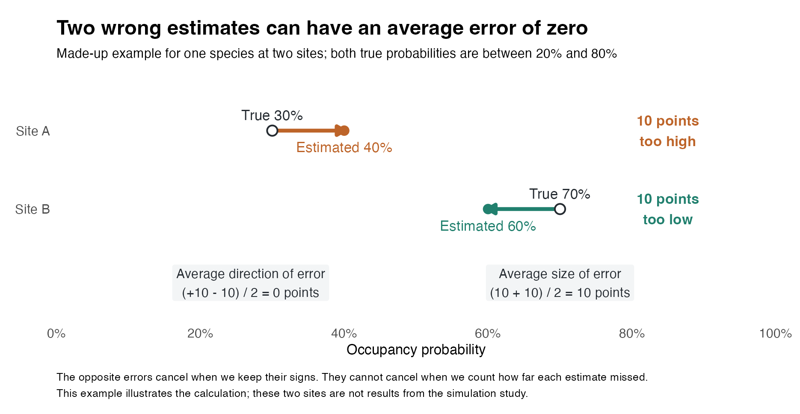
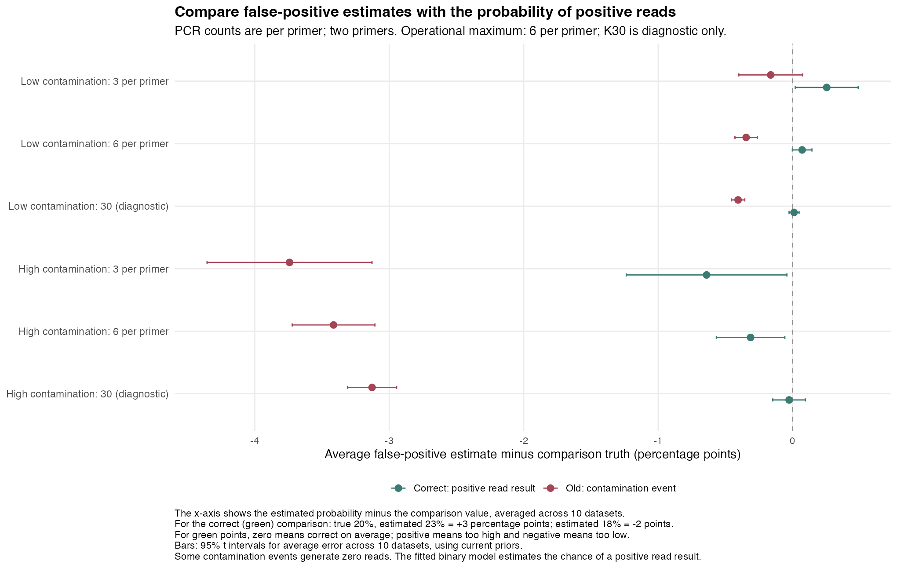
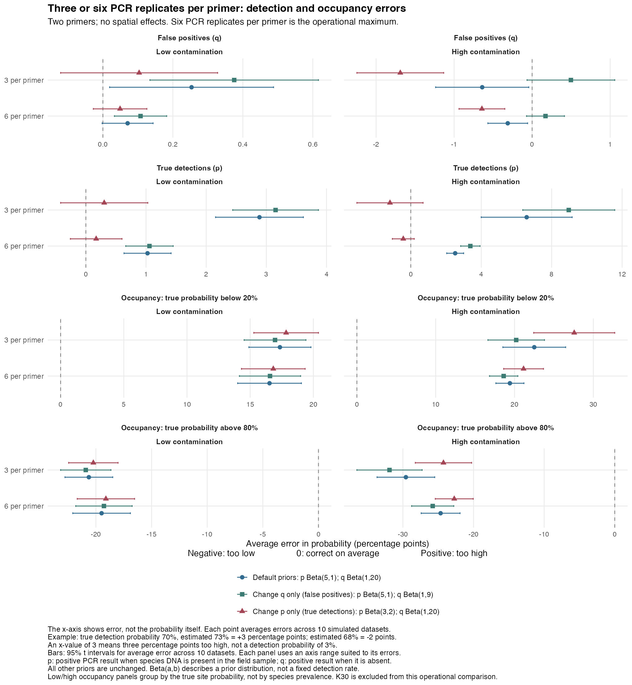
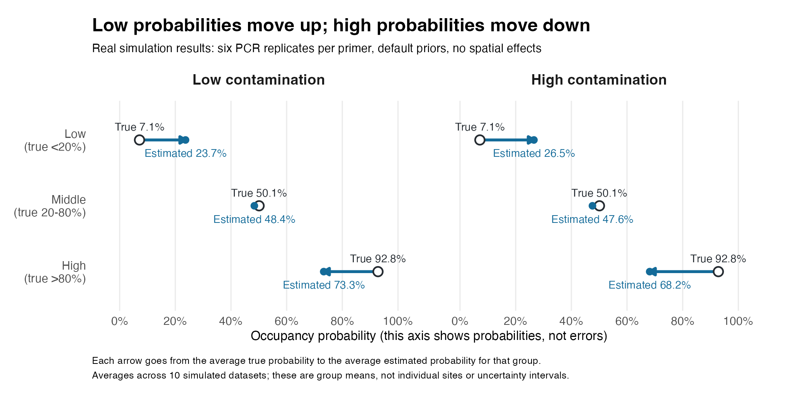
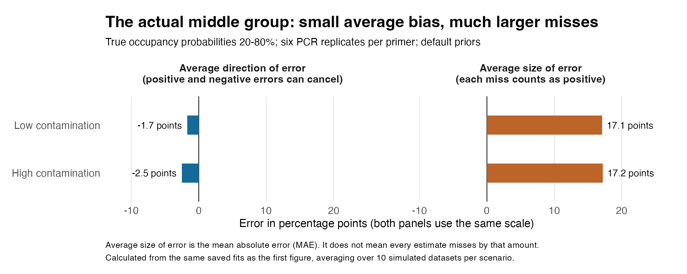
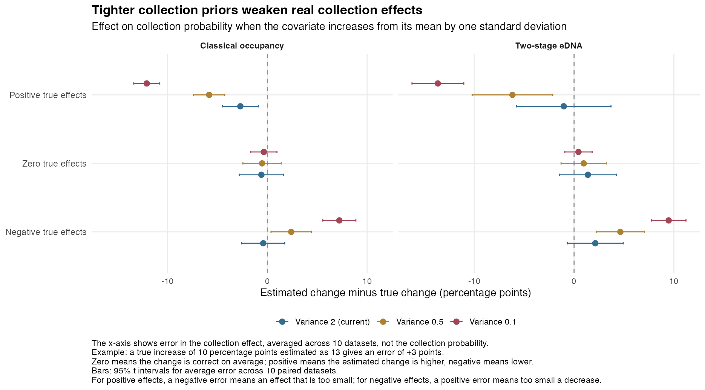
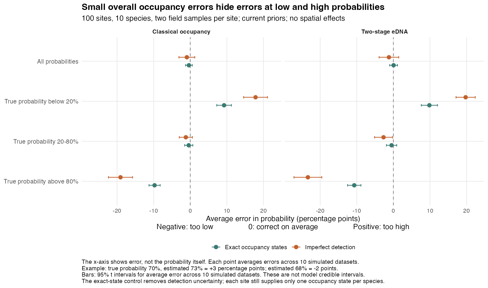

# Non-spatial bias recheck, 14 September 2026

This investigation uses the approved code on main, including the collection-alignment, random-number and residual-correlation fixes. Both the generating model and the fitted model have spatial effects turned off. Doug asked to see the errors before deciding release targets, so these results do not automatically clear either beta check.

The main findings are that the old high false-positive bias was largely a comparison error, tighter collection priors suppress real effects, and substantial occupancy errors remain in these designs. Low and high probabilities are pulled towards the middle. Middle probabilities have a small signed average error, but individual estimates still miss by about 17 percentage points on average at six PCR replicates per primer. That last number is a measured simulation result, not the teaching example below. The practical laboratory comparison respects Doug's limit of six PCR replicates per primer. The report keeps the prior trade-offs, probability errors and numerical uncertainty separate; it does not select new defaults or declare a beta pass.

## How to review this PR

[PR #11](https://github.com/AlexDiana/occJSDM/pull/11) can be reviewed and merged independently of PR #8. Start with this report and its Still needed list, then review `tests/testthat/helper-simstudy.R` alongside `test-simstudy-truth.R`. Those two files correct the truth used to judge simulations; they do not change fitted values. Review the consolidated [TODO](../../TODO.md) and public limitations next. The CSVs and figures preserve the completed evidence and do not need line-by-line code review; the supplied scripts allow targeted checks of a result.

## How to read the results

An occupied/unoccupied state tells us whether a species is present at a particular site. An **occupancy probability** describes how likely that state is. We know the true probabilities here because we generated the simulated datasets; in a field survey they are unknown. The model estimates those probabilities from the available observations.

Keep three stages separate. **Occupancy** concerns presence at the site. **Collection** concerns obtaining the species' DNA in a field sample when it is present at the site. **p** is the probability of a positive PCR result when the DNA is in the sample, and **q** is the probability of a positive result when it is absent from the sample. A small error in a laboratory rate does not establish an accurate occupancy probability.

There are two questions to ask about each set of estimates:

- **Average signed error: does the model tend to estimate too high or too low?** Subtract truth from each estimate, keeping the plus or minus sign, then average. Positive means too high; negative means too low. This is also called average bias. Opposite errors can cancel.
- **Average absolute error: how far do the individual estimates miss?** Take the size of each error without its sign, then average. This is the mean absolute error, or MAE. Every miss counts, so overestimates and underestimates cannot cancel. It is not an uncertainty interval, and it does not mean every estimate misses by the same amount.

Both measures use **percentage points** for probabilities. A true probability of 70% estimated as 73% gives a signed error of +3 points and an absolute error of 3 points. An estimate of 68% gives -2 points and an absolute error of 2 points. An error of 3 points is not a predicted probability of 3%.

**Made-up example, not simulation results:** suppose one species has true occupancy probabilities of 30% and 70% at two sites, estimated as 40% and 60%. One error is +10 points and the other is -10 points. Their average signed error is zero, although both estimates are wrong. Their average absolute error is 10 points. These deliberately illustrative 10-point errors are separate from the real 17.1-point result reported below.



For the actual study, we calculate these summaries within each simulated dataset and then give the ten datasets equal weight. Occupancy errors concern individual species-at-site probability estimates; p/q errors concern species-by-primer rate estimates. Unless a section explicitly says otherwise, the previously reported “average error” is the **signed** measure. RMSE is another measure of error size that gives extra weight to the largest misses; it also prevents opposite errors from cancelling.

The bars in the original error plots show uncertainty in the estimated **average signed error across datasets**. They do not show the spread of individual mistakes, and they are not the model's credible intervals for occupancy. A short bar near zero can therefore coexist with substantial individual errors. The tables below make those errors visible through MAE.

## The previous false-positive comparison used the wrong truth

The simulator first decides whether a contamination event happens and then generates its number of reads. Some simulated contamination events produce zero reads. The fitted binary detection model estimates the chance of a positive read result, so it should be compared with the probability of events that survive the read threshold.

With the existing simulation settings and threshold one, 86.314% of contamination events produce a positive read result. Thus a nominal event probability of 22.44% produces positive reads with probability 19.37%. A fit estimating 19.37% would be correct for the observed data, yet the old calculation called it an underestimate of 3.07 percentage points.

This explains almost all of the old high-replication discrepancy. Using the rounded historical averages, the high-K errors become about +0.008 percentage points in the low-contamination scenario and -0.069 points in the high-contamination scenario, instead of -0.40 and -3.14 points. These are corrections to historical rounded numbers; the new non-spatial fits provide a separate recheck. The earlier claim that the fixed high-K error demonstrated persistent prior shrinkage is not supported by that comparison.

The effect on true detections is negligible with the simulator's default read intensities: almost every simulated true detection produces positive reads. The definitions of occupancy, collection probability and collection effects are unchanged. Correcting the false-positive comparison does not by itself resolve their errors.

The old interval-coverage calculation also compared intervals with the wrong q truth. It cannot support the earlier near-q/high-q coverage claims. This correction does not establish nominal coverage; Doug has allowed interval-coverage work to wait.

## What was compared

Each collection-study dataset has 100 sites, ten species, two field samples per site, two environmental covariates, two observed and two latent traits, and two residual factors. The two-stage version also has two primers and three PCR replicates per primer. The classical occupancy version observes the field collection results directly. They are non-spatial versions of the existing traits_isolated and occupancy scenarios, using their existing seed keys.

Collection-slope prior variances 2, 0.5 and 0.1 are compared on identical data and fitting RNG states. Their standard deviations are about 1.41, 0.71 and 0.32 on the log-odds scale. Smaller values pull slopes more strongly towards zero. The current variance is 2. Collection intercepts and slopes are converted to the sample-standardised covariate scale before they are compared with estimates; the actual generating linear predictor is checked for equality.

The four false-positive scenarios retain the existing low/high contamination-event ranges and three/thirty PCR replicate settings per primer, but have no spatial field. There are two primers, so three replicates per primer means six PCR reactions per field sample. Doug has specified an operational maximum of six PCR replicates per primer. A further sixty fits therefore compare low and high contamination at K=6, each with the current priors, q Beta(1,9), and p Beta(3,2). The six-replicate scenarios use the existing qtest seed key; all twenty sets of community parameters, occupancy states and collection states exactly match their K=3 counterparts. The PCR observations differ and are not claimed to be nested subsets. The thirty-per-primer experiments are retained only as a diagnostic of the old bias claim and are not evidence that such replication is operationally feasible. After thresholding, their true recorded false-positive probabilities range from about 0.86% to 4.32% in the low group and 12.95% to 25.89% in the high group. The qtest seed scheme is unchanged. Each dataset is fitted with q Beta(1,20), the current prior, and q Beta(1,9), an illustrative less concentrated alternative. Initially the p prior remains Beta(5,1). A separate p Beta(3,2) comparison, keeping q Beta(1,20), is made for the two-stage collection scenario and the two K3 scenarios. This tests sensitivity to the true-detection prior without making all detection priors flat or removing their role in distinguishing true and false detections.

Two chains per fit use 3,000 burn-in and 5,000 retained iterations after a shorter pilot exposed convergence limitations. There are ten independent datasets within each scenario. The original grid contains 170 fits; the operational K=6 extension adds sixty, for 230 fits plus twenty exact-occupancy controls. Prior comparisons within a scenario share the exact data. The main model, priors not explicitly varied, and in-fit thread setting are held fixed. A separate paired control fits the same non-spatial community model to the exact simulated occupancy states, removing uncertainty due to imperfect detection.

Occupancy probabilities are scored at the sampled sites. Errors are shown separately for low, middle and high true probabilities, and for rare versus more common species. These are recovery checks, not held-out prediction tests. The low/high groups contain different sites depending on their true probabilities. Rare species are identified by their mean true occupancy below 20%; low-probability sites in an otherwise common species do not count as rare-species evidence.

Each dataset receives equal weight. Reported standard errors measure variation between independently simulated datasets, not variation among species treated as independent replicates. Monte Carlo standard errors measure the separate numerical uncertainty from finite chains. Absolute errors and RMSE remain visible so positive and negative errors cannot conceal each other.

## Independent checks

An independent calculation verifies the detection threshold formula and the exact Beta posterior when collection states are known. It agrees with the C++ sampler's draws and RNG state under irregular sample/primer mappings and missing data. Repeated conditional sampling agrees with the analytic posterior means and variances. These checks distinguish a scoring error from a q-sampler error.

The new runner reconstructs occupancy and collection probabilities from every saved coefficient draw, applying the logistic transform before averaging. It checks those reconstructed means against the package's saved means. The generating and fitted environmental designs, species identities and collection covariate rows are checked directly.

## Separate read-threshold defect

Thresholds greater than one currently erase all positive detections during preprocessing. The code first replaces qualifying counts with one, then compares those replacements with the original threshold and replaces them with zero. This investigation uses threshold one and is unaffected. The reproducer executes the installed fitter's actual preprocessing, stops before MCMC, and verifies the problem at thresholds two and three while preserving missing entries. This is a separate code defect requiring correction, not a reason to change the priors.

## False-positive rates: most of the old discrepancy was a scoring error

With the current priors and three PCR replicates per primer, the new average false-positive error is +0.254 percentage points in the low-contamination scenario and -0.640 points in the high-contamination scenario. Their between-dataset standard errors are 0.104 and 0.264 points. The same estimates scored against the old, nominal event probabilities would appear to have errors of -0.163 and -3.742 points. Thus the old comparison created most of the apparent high-contamination underestimate; a smaller error remains in the operationally relevant three-per-primer setting.

With thirty PCR replicates per primer, the low-contamination error is +0.0107 points, standard error 0.0165. The high-contamination result is -0.0262 points, standard error 0.0538. These larger-replication runs are diagnostic, outside the operational PCR limit Doug has specified. They help distinguish a truth-definition error from persistent sampler bias; they cannot establish practical performance at six or fewer replicates per primer.



### Operational maximum: six replicates per primer

At six PCR replicates per primer, current priors give average q errors of +0.071 percentage points under low contamination and -0.313 points under high contamination. Their between-dataset standard errors are 0.032 and 0.113 points. Average p errors are +1.03 and +2.52 points, compared with +2.89 and +6.58 at three replicates per primer.

**Detection-rate errors at six replicates, using the default priors.** The following values all come from the completed simulations. “Absolute error” counts the size of each species-by-primer rate error before averaging.

| Contamination | Rate being estimated | Average signed error | Average absolute error |
|---|---|---:|---:|
| Low | False-positive probability q | +0.07 points | 0.38 points |
| Low | True-detection probability p | +1.03 points | 2.86 points |
| High | False-positive probability q | -0.31 points | 1.34 points |
| High | True-detection probability p | +2.52 points | 4.27 points |

For example, under low contamination, q is only 0.07 points too high on average, while individual q estimates miss by 0.38 points on average. The first number describes the net direction of error; the second describes its size. Occupancy is a separate quantity and has much larger absolute errors, as shown next.

Occupancy improves less. At six replicates, low/high probability errors remain +16.53/-19.49 points under low contamination and +19.41/-24.66 under high contamination. In the high-contamination comparison, moving from three to six replicates reduces the low-probability overestimate by 3.09 points and the high-probability underestimate by 4.92 points, with paired standard errors of 1.28 and 1.59 points. Mean absolute occupancy error falls from 22.89 to 20.33 points. More PCR information helps, but it does not resolve the large occupancy errors in this design.

At six replicates under high contamination, q Beta(1,9) gives q error +0.17 points but increases p error to +3.38 points. Alternatively, p Beta(3,2) reduces p error to -0.43 points but increases the q underestimate to -0.64 points. Its low/high occupancy errors are +21.15/-22.73 points. These remain trade-offs, not grounds for automatically replacing the defaults.

**How to read the three legend entries.** Here, **p** is the probability of a positive PCR result when the species' DNA is present in the field sample, and **q** is the probability of a positive result when it is absent. Each colour and symbol represents a different pair of prior assumptions used to fit the same datasets:

- **Default priors:** p uses Beta(5,1), and q uses Beta(1,20). Their prior means are about 83% for true detection and 4.8% for false positives.
- **Change q only (false positives):** keep p at Beta(5,1), but change q to Beta(1,9). The false-positive prior mean becomes 10%.
- **Change p only (true detections):** keep q at Beta(1,20), but change p to Beta(3,2). The true-detection prior mean becomes 60%.

These percentages describe the means of the assumed distributions before fitting, not fixed rates imposed on the results. The distributions also differ in shape and concentration. All other priors are held unchanged. Thus the figure compares the defaults with changing one detection prior at a time; it does not compare using a p prior versus using a q prior. Every fit uses both.



### Occupancy: average bias and average size of error at six PCR replicates

**All values in this section come from the simulations.** These are non-spatial fits using six PCR replicates per primer and the default priors, averaged across ten datasets per contamination scenario. The low, middle and high groups are defined by the true occupancy probability, not by the model's estimate. They are groups of species-at-site probabilities, not groups of species classified as rare or common.

The arrows show the change from each group's average true probability to its average estimate. This figure uses a probability axis from 0% to 100%; the earlier error figures use percentage-point differences.



**Low contamination:**

| True-probability group | Average true probability | Average estimate | Average signed error | Average absolute error |
|---|---:|---:|---:|---:|
| Below 20% | 7.1% | 23.7% | +16.5 points | 17.1 points |
| 20-80% | 50.1% | 48.4% | -1.7 points | 17.1 points |
| Above 80% | 92.8% | 73.3% | -19.5 points | 19.8 points |
| All probabilities | 50.2% | 48.5% | -1.8 points | 17.9 points |

**High contamination:**

| True-probability group | Average true probability | Average estimate | Average signed error | Average absolute error |
|---|---:|---:|---:|---:|
| Below 20% | 7.1% | 26.5% | +19.4 points | 19.9 points |
| 20-80% | 50.1% | 47.6% | -2.5 points | 17.2 points |
| Above 80% | 92.8% | 68.2% | -24.7 points | 24.9 points |
| All probabilities | 50.2% | 47.5% | -2.7 points | 20.3 points |

These tables report estimated averages across ten simulated datasets, not a guaranteed error for every future study. The [full-precision summaries](nonspatial-bias-recheck/results/summary.csv) and [per-dataset results](nonspatial-bias-recheck/results/dataset-groups.csv) retain the underlying values. Table values are rounded independently, so subtracting two displayed probabilities may differ slightly from the displayed signed error. The “All probabilities” row includes every species-at-site estimate, with each dataset given equal weight; it is not an equally weighted average of the three bands, which contain different numbers of estimates.

Read the low-contamination results as follows. Where the species should be unlikely to occur, true probabilities average 7.1%, but estimates average 23.7%. Where it should be very likely, true probabilities average 92.8%, but estimates average 73.3%. The estimates therefore show less contrast between low and high occupancy. These arrows describe group averages; they do not mean every individual estimate moves in that direction by the same amount.

**The middle-group result needs particular care.** Its average true probability is 50.1%, and the average estimate is 48.4%. That leaves a signed error of only -1.7 points. But taking the absolute value of each individual error before averaging gives **17.1 points**. The high-contamination figures are **-2.5 points signed error and 17.2 points absolute error**. These four numbers were calculated from the actual saved fits. The 10-point two-site example above only explains how cancellation works.



The left-hand bars answer “what error remains after overestimates and underestimates cancel?” The right-hand bars answer “how far did the individual estimates miss?” A small value on the left does not establish good individual estimates. Nor does it rule out systematic errors within narrower parts of the broad 20-80% group. The mean absolute error of 17.1 points is neither an error bar nor a claim that every estimate is exactly 17.1 points wrong.

For a distribution map, this means that getting a group's average probability approximately right does not guarantee accurate probabilities at individual places. These particular simulations assess recovery at the sampled sites; they do not yet measure accuracy at new, unsampled sites. We also cannot use these results as a correction table for real maps: the groups rely on true probabilities that are unknown in a real survey.

**What did the extra PCR replicates achieve?** Across all occupancy probabilities, the default-prior MAE falls from 18.35 to 17.87 points under low contamination and from 22.89 to 20.33 points under high contamination when moving from three to six replicates per primer. More PCR information helps, but the remaining errors are still substantial. Improved p/q estimates should not be described as having solved occupancy recovery.

### The alternative priors do not improve everything together

At three replicates per primer, replacing q Beta(1,20) with Beta(1,9) changes the high-contamination q error from -0.64 to +0.50 points and slightly lowers q's mean absolute error from 2.01 to 1.93 points. But true-detection error increases from +6.58 to +8.97 points, and overall occupancy error shifts from -4.10 to -6.63 points. High-probability occupancy error worsens from -29.58 to -31.90 points, while low-probability overestimation decreases from +22.50 to +20.21 points. Judging q alone would conceal these consequences.

Changing only p from Beta(5,1) to Beta(3,2) gives a different trade-off. In the high-contamination three-replicate scenario, p error improves from +6.58 to -1.18 points, but q error worsens from -0.64 to -1.69 points. High-probability occupancy error improves to -24.26 points, while low-probability error worsens to +27.57 points. Overall occupancy error becomes +1.36 points, again hiding much larger opposing errors within the probability bands.

In the low-contamination three-replicate scenario, p Beta(3,2) reduces p error from +2.89 to +0.30 points and q error from +0.254 to +0.104 points. The alternative q Beta(1,9) instead increases p error to +3.15 points and q error to +0.375 points. Effects that look useful under low contamination do not transfer unchanged to the higher-contamination setting.

At thirty replicates per primer, the q prior makes very little difference to the high-contamination rates: q errors are -0.026 points under Beta(1,20) and +0.026 points under Beta(1,9), while p errors are +0.322 and +0.344 points. The complete paired comparisons, including their standard errors and occupancy trade-offs, are supplied in the CSV files. No prior is selected as a new default.

**Check error size as well as direction when comparing priors.** For example, under high contamination at six PCR replicates per primer, the MAEs are:

| Prior choice | False-positive q MAE | True-detection p MAE | Occupancy MAE, all probabilities |
|---|---:|---:|---:|
| Defaults | 1.34 points | 4.27 points | 20.33 points |
| Change q only to Beta(1,9) | 1.29 points | 4.62 points | 20.47 points |
| Change p only to Beta(3,2) | 1.43 points | 3.72 points | 20.22 points |

Changing q improves its own MAE slightly but worsens p and occupancy. Changing p improves its own MAE and slightly lowers overall occupancy MAE, but worsens q. All three leave occupancy MAE near 20 points. These point comparisons support assessing the quantities together; small differences here do not establish a generally superior prior. The paired-comparison CSVs report uncertainty in the changes.

### Detection-rate ordering and numerical uncertainty

Three fits with alternative priors contain a species-primer pair for which more than half the saved posterior draws have p below q: one each under q9 and p32 at K3, and one under p32 at K6. In the K3 example, the current priors already leave the ordering nearly evenly split: Pr(p <= q) is 48.36%, rising to 57.90% under q9 and 67.66% under p32. Both chains cross the ordering boundary repeatedly and give similar answers. This supports uncertainty about those rates, rather than establishing that a chain is trapped or that the entire collection model has switched labels. Six replicates resolve the ordering for that particular pair, but a different K6 p32 pair still has Pr(p <= q) = 66.50%. All cases remain in the summaries. Neither alternative is established as a generally safe new default.

The complete grid produced 112 component warnings in 79 of 230 fits, mostly concerning environmental coefficients. For the group averages reported here, rank-normalized Rhat is at most 1.082. The largest combined Monte Carlo standard errors across the main occupancy bands, p and q comparisons are approximately 0.258, 0.078 and 0.022 percentage points. These numerical errors are much smaller than the large occupancy errors, but they do not establish that every individual parameter has converged adequately. Rare-species summaries have greater numerical uncertainty and too few independent datasets.

Two high-contamination K3 fits have individual scored-parameter Rhat above 1.1: `qfar_K3-q20-08` and `qfar_K3-q9-09`, with a maximum of 1.133. Longer checks using four chains, 6,000 burn-in and 12,000 retained iterations were started, then stopped at Doug's request to conserve credits. No completed results from those checks are included. Their original estimates remain in the primary summaries; the longer-run sensitivity check is outstanding.

## Occupancy and collection effects: completed paired results

This section concerns the separate collection-prior experiment: the classical occupancy design and a two-stage design with **three** PCR replicates per primer. Its numbers should not be read as the six-replicate results above. A collection effect describes how changing a field-sampling covariate changes the probability of collecting DNA, conditional on the species being present at the site. It is not the same as changing the species' occupancy probability.

The current collection-slope prior, variance 2, performs better at preserving real collection effects than the two tighter alternatives. For species with positive effects, increasing the covariate from its mean by one standard deviation truly raises collection probability by about 23 percentage points in both designs. The classical occupancy model estimates increases of 20.67 points with variance 2, 17.55 with variance 0.5 and 11.30 with variance 0.1. The two-stage model estimates 22.43, 17.29 and 9.82 points, respectively. These are probabilities of collecting the species conditional on its presence at the site, not changes in occupancy.

Negative effects tell the same story. Their true decreases average 16.92 points in the classical model and 18.25 in the two-stage model. With variance 2 the estimates are decreases of 17.33 and 16.12 points; with variance 0.1 they are only 9.70 and 8.77 points. Smaller priors reduce errors for the genuinely zero effects, but that benefit comes at the cost of weakening real effects. Variance 0.5 is an intermediate trade-off, not a uniformly better setting. The plot shows uncertainty across datasets, and the accompanying data retain absolute errors and all three signs separately.



The occupancy baseline coefficient `B0` is not clearly biased in these ten datasets: its average error is -0.061 in the classical model and -0.055 in the two-stage model, with between-dataset standard errors of about 0.083 in each. These are log-odds coefficients, not percentage points. That uncertainty is too large to claim that small baseline bias has disappeared. Tightening the collection prior to variance 0.1 moves those errors to +0.138 and +0.157. The paired upward shifts are clear, but moving the baseline upwards is not itself evidence of better ecological estimates.

### Small overall occupancy errors conceal large errors at the extremes

With current priors, average occupancy error over all sites and species is -0.93 percentage points in the classical model and -1.22 points in the two-stage model. However, splitting sites by their true probabilities gives a different picture:

- Classical occupancy: low probabilities average 7.92% but are estimated as 25.76%; middle probabilities average 48.97% and are estimated as 47.77%; high probabilities average 92.44% but are estimated as 73.38%.
- Two-stage eDNA: low probabilities average 7.65% but are estimated as 27.40%; middle probabilities average 49.63% and are estimated as 46.94%; high probabilities average 91.99% but are estimated as 68.63%.

The average low/middle/high errors are therefore +17.84/-1.20/-19.06 points for classical occupancy and +19.74/-2.69/-23.36 points for two-stage eDNA. Their between-dataset standard errors are 1.44/0.79/1.46 and 1.16/1.08/1.68 points. These estimates are pulled towards intermediate probabilities. This comparison groups sites by their simulated true probabilities; it describes recovery of low and high probabilities, rather than a calibration check grouping sites by their predicted probabilities. Positive and negative errors nearly cancel in the overall average, but mean absolute occupancy error remains 17.98 and 19.03 points, respectively. Overall RMSE is 23.44 and 23.66 points.

The same distinction between signed and absolute errors applies here. With the current collection prior, the probability-band results are:

| Design | True-probability group | Average signed error | Average absolute error |
|---|---|---:|---:|
| Classical occupancy | Below 20% | +17.84 points | 18.62 points |
| Classical occupancy | 20-80% | -1.20 points | 16.51 points |
| Classical occupancy | Above 80% | -19.06 points | 20.01 points |
| Two-stage, three PCRs per primer | Below 20% | +19.74 points | 19.99 points |
| Two-stage, three PCRs per primer | 20-80% | -2.69 points | 16.25 points |
| Two-stage, three PCRs per primer | Above 80% | -23.36 points | 23.64 points |

The middle groups again illustrate cancellation: average signed errors of -1.20 and -2.69 points coexist with absolute errors of 16.51 and 16.25 points. Small average bias in the middle therefore does not mean that most estimates are close to their true probabilities. These are actual simulation results from this separate experiment.

Tightening collection priors moves occupancy estimates upward. That reduces the underestimation of high probabilities while increasing the overestimation of low probabilities. It leaves overall absolute error essentially unchanged or slightly worse in these designs. It does not solve the compression of the estimated probability range.



### What the exact-occupancy control tells us

For each of the same twenty underlying datasets, a separate control tells the JSDM exactly which species occupied each site. It removes both detection stages. It still has only one observed occupied/unoccupied state per species at each site, so it does not reveal each site's underlying probability directly. That true probability includes the simulated residual site effects as well as the measured environmental relationships; observing the occupancy states does not reveal the exact values of those unmeasured effects.

The control's low/high errors are +9.24/-9.75 points for the classical-study datasets and +9.84/-10.70 for the two-stage-study datasets. Thus some compression occurs even without detection uncertainty. Imperfect detection adds about 8.60/9.31 points to the low/high errors in the classical comparison and 9.91/12.67 points in the two-stage comparison. Those are paired comparisons on the same simulated occupancy probabilities; their standard errors are approximately 0.99/1.33 and 1.03/1.17 points.

This supports limited information and shrinkage as substantial contributors. It does not prove that every remaining error is caused by one particular prior, nor does it establish an error-free sampler for every configuration. The experiment does not separately vary site count, field replication, latent-factor complexity or all community priors. It therefore does not tell us which of those changes would remove the remaining probability errors most efficiently. A design study with more sites, more field replication or better calibration information is a focused next investigation if these errors are scientifically unacceptable. It should respect the operational PCR limit rather than assuming arbitrarily many laboratory repeats.

### A different true-detection prior helps p, but does not fix occupancy

In the two-stage collection scenario, the current `p` prior, Beta(5,1), gives average true-detection error of +4.34 percentage points, with between-dataset standard error 0.55. Changing only that prior to Beta(3,2) reduces the error to +1.59 points, standard error 0.47. The positive collection-effect estimate stays near 22.43 points and the negative estimate improves from a 16.12-point to a 16.57-point decrease. But low/high occupancy errors remain +20.47/-22.59 points: changing this detection prior does not repair occupancy at the extremes.

Beta(3,2) is centred nearer these simulated true-detection rates than Beta(5,1). Its improvement here is useful sensitivity evidence, not a general recommendation. Both priors remain informative. The study also examines `p` and `q` ordering so that an apparent improvement cannot silently arise from confusing true detections with false positives.

## How to interpret this evidence

These checks measure recovery of underlying occupancy and detection probabilities at the sampled sites. They do not test predictions at new sites, all possible priors, spatial models, or every sampling design. Ten datasets are enough to reveal the large prior trade-offs and probability compression seen here, but not to rule out small biases. Rare-species groups occur in only one or two independent datasets in this grid; their rows are retained in the results, but they do not constitute a sufficient rare-species assessment.

Both measures matter for interpretation: signed errors reveal whether a group is shifted systematically, while absolute errors reveal individual mistakes that can cancel in the signed average. Neither alone proves that a particular code defect or prior causes the errors. A requirement to fix material bias does not mean demanding zero absolute error, which is generally unattainable with finite data; the intended ecological use determines which errors matter.

The results do not support changing the collection prior to variance 0.1 to repair the occupancy baseline. The alternative detection priors are sensitivity examples. Their usefulness depends on the detection rates and information in these simulations, and they should not become defaults solely because they improve this grid. No default has been changed.

The remaining release decision is scientific: Alex and Doug need to decide which probability errors matter in the intended beta applications, and whether more informative sampling designs recover probabilities well enough. Doug requested that this report present errors before setting those targets. The provisional five-percentage-point target agreed for separate spatial experiments is not applied here. Interval undercoverage or overcoverage remains a separate, deferred concern.

## Reproduction and review

The statistical investigation fits an independently compiled archive of approved `main` revision `80d449dc8593b272d5fae1f15407356aa41d6c3b`. It does not rely on the pending spatial changes in PR #8. Its scoring helper correction, documentation and consolidated TODO are now reviewed independently on branch `codex/nonspatial-bias-recheck`, based directly on `main`. No production fitting code is changed by this PR. The PR split did not rerun any simulations or alter the saved result files. The correction changes what the study compares with the fit; it does not alter the sampler, simulated observations, seeds or default priors.

The two truth corrections have 19 regression assertions: effective positive-read p/q probabilities, overridden read intensities, collection coefficients transformed to the fitted scale, retained species/covariate identities, rejected ambiguous mappings and absent/intercept-only blocks. Eight assertions failed against the previous helper before the correction. All 19 then passed. Before the PR split, the combined PR #8 source suite, including the three approved fixes and these scoring tests, passed 754 assertions with zero failures, errors or test warnings and one skipped opt-in coverage study. R printed an environment warning that `testthat` was built under R 4.5.2; the run used R 4.5.0. This is a source test run, not the final installed beta package check.

A separate reviewer checked all 70 collection-result rows against the saved results and all 20 exact-occupancy controls. Five stored fits independently reproduced the coefficient transformations and probability contrasts. The independent q audit matches actual C++ draws and the final R RNG state for 18 p/q updates, using irregular sample/primer mappings and missing data. Its 20,000 conditional sampler calls agree with the analytic Beta posterior means and variances. These are conditional checks; they do not establish convergence of every full latent-state model.

The [reproduction directory](nonspatial-bias-recheck/) contains the executed R scripts, [per-fit manifest](nonspatial-bias-recheck/results/fit-manifest.csv), [provenance](nonspatial-bias-recheck/results/provenance.txt), [main summaries](nonspatial-bias-recheck/results/summary.csv), [paired prior comparisons](nonspatial-bias-recheck/results/paired-prior-comparisons.csv), [collection-probability contrasts](nonspatial-bias-recheck/results/collection-contrast-summary.csv), [paired exact-occupancy comparisons](nonspatial-bias-recheck/results/known-occupancy-paired-comparison.csv), element-level results and diagnostics. Errors in the CSV files are proportions unless their column explicitly says percentage points; multiply probability errors by 100 to obtain the units used in this report. `B0` and coefficient errors remain on the log-odds scale. The full fitted objects, input datasets and saved RNG states are retained locally rather than adding several gigabytes to Git.

To reproduce from a fresh directory, install the dependencies listed in the package DESCRIPTION, plus `posterior` and `ggplot2`, then run the following commands from an occJSDM checkout containing the evidence directory. Use a new `study` directory for a new experiment: the executed runners resume existing completion files and are not intended to mix different settings in one output folder.

```sh
mkdir -p study/source-main study/library
cp -R dev/simstudy/nonspatial-bias-recheck/*.R study/
cp -R dev/simstudy/nonspatial-bias-recheck/q-audit study/
git archive 80d449dc8593b272d5fae1f15407356aa41d6c3b | tar -x -C study/source-main
printf '%s\n' 80d449dc8593b272d5fae1f15407356aa41d6c3b > study/source-revision.txt
R CMD INSTALL --library=study/library study/source-main
cd study
Rscript run_nonspatial_recheck_balanced.R --root=. --out=main-results --mode=all --replicates=10 --burn=3000 --iter=5000 --workers=4
Rscript run_nonspatial_recheck_k6.R --root=. --out=operational-k6 --mode=q --replicates=10 --burn=3000 --iter=5000 --workers=4
Rscript run_known_z_control.R .
Rscript summarise_nonspatial_recheck.R main-results,operational-k6 main-results/summary
Rscript summarise_known_z.R .
Rscript q-audit/audit_q.R .
Rscript q-audit/reproduce_threshold_preprocessing.R .
Rscript q-audit/audit_completed_fits.R .
Rscript summarise_collection_contrasts.R .
Rscript summarise_pcr_comparisons.R .
Rscript review_nonspatial_diagnostics.R .
Rscript review_detection_ordering_case.R .
Rscript plot_nonspatial_recheck.R .
Rscript plot_occupancy_error_explainer.R main-results/summary/summary.csv main-results/summary
```

The three teaching figures can also be regenerated directly from the already committed summary, without running or loading any model fit:

```sh
Rscript dev/simstudy/nonspatial-bias-recheck/plot_occupancy_error_explainer.R
```

The script reads `results/summary.csv`, writes the three figures beside it and exports their selected source values as `occupancy-error-explainer-values.csv`. The toy example is explicitly separate from those source values. Adding the MAE tables and teaching figures did not change the simulations, fitted values, original summary CSVs or priors. The report now contains the four original figures and three additional explanatory figures.

The run first used the original `run_nonspatial_recheck.R`. After 117 completed fits, the queue was restarted with `run_nonspatial_recheck_balanced.R`, whose only difference is `chunk.size=1L` in the worker scheduling call. This spreads the longer 30-PCR fits evenly among four processes. Completed results were reused. The original settings were preserved, and source/library fingerprints, MCMC settings and dataset-specific fitting RNG states were checked unchanged. A fresh reproduction can use the balanced runner from the start, followed by the separate K=6 extension. The extension overlapped the finishing original batch locally; both used four workers with one sampler thread each. Its source/library and MCMC fingerprints were verified identical to the original batch.

## Still needed

1. **Finish the two targeted convergence checks.** Resume `run_long_convergence_checks.R`, then run `summarise_long_convergence_checks.R`. Check whether replacing the two original estimates materially changes the ten-dataset average errors. Preserve both versions and record any remaining warnings. The scripts and exact selected fits are saved; this work was stopped before completed diagnostic results were available.
2. **Alex should review the scoring correction and the evidence.** It changes simulated p/q truth to the probability of positive reads and collection coefficients to the fitter's scale. It does not change fitted values. The old coverage claims cannot be retained without recalculating them against the correct truth.
3. **Decide which remaining probability errors are acceptable for the intended beta applications.** No non-spatial release target has been chosen. If the reported occupancy errors are unacceptable, test a more informative design or a justified model change. Respect the maximum of six PCR replicates per primer; consider site information, field replication, calibration data and residual-factor complexity instead of assuming unlimited PCR replication. The exact-state controls do not isolate which of these remedies would work best.
4. **Complete a separate rare-species assessment.** This grid has only one or two independent datasets contributing rare-species cases. Low-probability sites within common species do not replace that assessment.
5. **Fix the read-threshold defect.** Thresholds greater than one currently erase detections. Correct the comparison against original counts, preserve missing values and add regression checks. This remains an open production-code issue in TODO.
6. **Complete the separate spatial and release work.** PR #8 still needs Alex's spatial review and the remaining spatial checks. The optional continuous-noise prior is reviewed separately in [PR #10](https://github.com/AlexDiana/occJSDM/pull/10), which follows PR #8; the default decision remains open. Then check the final installed package, refit bundled example results and refresh affected vignette outputs. The non-spatial report does not clear these items.

No default prior has changed, no beta release gate has been declared passed, and the unfinished longer fits have been stopped. The completed 230 comparison fits, 20 exact-occupancy controls, compact summaries, scripts and original figures are preserved; two new figures show those same results and one is a clearly labelled made-up teaching example.
