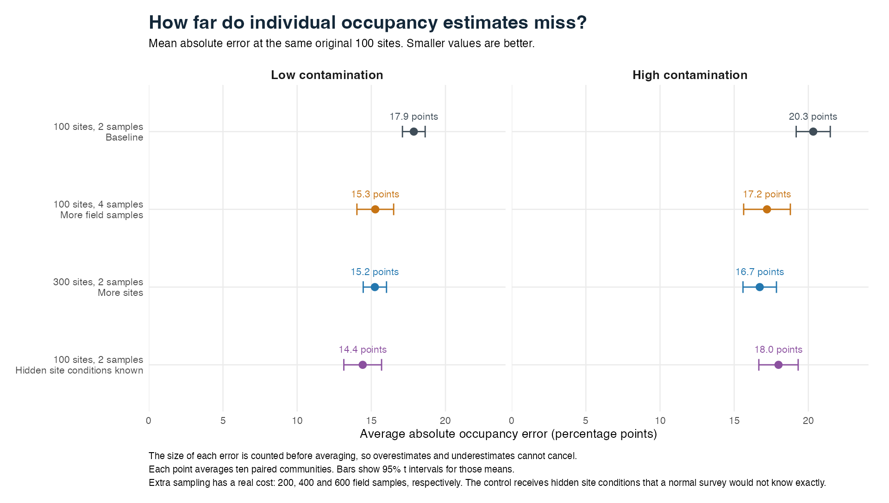
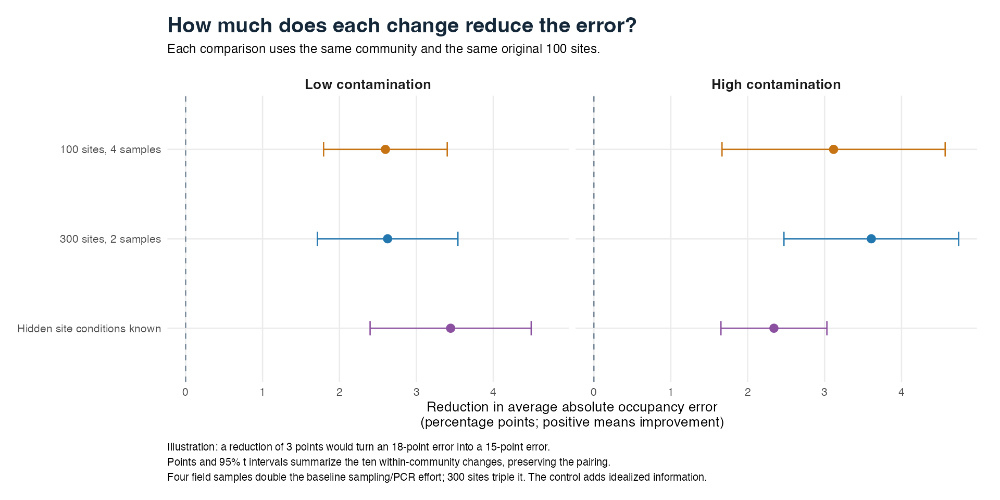
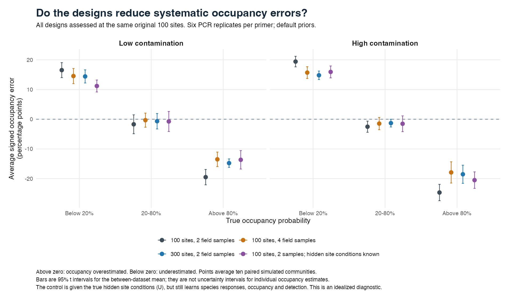

# More field samples, more sites, and known site conditions

This follow-up asks whether the large occupancy errors in the [non-spatial investigation](nonspatial-bias-recheck.md) improve when we collect more field samples, visit more sites, or supply information about the hidden differences between sites. It uses six PCR replicates per primer throughout. **More field samples and more sites both help, but substantial occupancy errors remain.** Four field samples at 100 sites give almost the same overall improvement as two samples at 300 sites in these simulations, with a smaller increase in sampling and PCR effort. Supplying the true hidden site conditions also helps, but does not remove the difficulty.

## What changes in each comparison?

| Design | Sites | Field samples per site | Total field samples | Total PCR reactions |
|---|---:|---:|---:|---:|
| Existing baseline | 100 | 2 | 200 | 2,400 |
| More field samples | 100 | 4 | 400 | 4,800 |
| More sites | 300 | 2 | 600 | 7,200 |
| Hidden site conditions supplied | 100 | 2 | 200 | 2,400 |

There are two primers, each with six PCR replicates, so each field sample requires 12 PCR reactions. The two practical alternatives do not have equal costs: four field samples double the baseline effort, whereas 300 sites triple it. Their field costs may differ further because travelling to new sites takes time.

Each design is fitted to the same ten underlying simulated communities, once under low contamination and once under high contamination. There are ten species in each community. These are ten paired communities with two contamination versions, not twenty independently generated communities. We retain the same species relationships, original occupied/unoccupied states, field samples and PCR observations. The extra samples and sites are additions to those original observations. This makes the changes easier to interpret than comparing unrelated simulated datasets.

The model uses the existing default priors and the approved, frozen package build `80d449d`. Both simulation and fitting have no spatial effects. The pending spatial correction in PR #8 therefore cannot explain differences in this experiment. The package standardizes covariates using each fitted dataset: adding sites or field samples changes those centres and scales, and thus changes the defaults' implications on the raw covariate scale. The simulated biological relationships on the raw scale are preserved.

## What does the hidden-site-condition control actually provide?

The simulations contain two otherwise-unmeasured quantities at each site. Species can respond differently to those quantities. In an ordinary fit, the model has to infer both the site quantities and each species' response to them from the observations.

For this control we give the model the actual simulated values of the two site quantities, called `U` in the code. It still has to estimate how each species responds to them, the occupancy probabilities, and the collection and detection processes. We do not supply the true species responses, the occupied/unoccupied answers, or the occupancy probabilities themselves.

Think of this as an idealized version of measuring two previously missing environmental variables perfectly. An improvement would show that learning those site conditions contributes to the difficulty. It would not prove that any particular real environmental measurement would achieve the same improvement. These simulated site quantities vary independently between sites, so a spatial smoother would not automatically recover them.

## What is being scored?

The main comparison uses the **same original 100 sites in every design**. For the 300-site fit, we ask whether the extra 200 sites help estimate occupancy at those original places. We also retain a separate assessment of all 300 fitted sites. Neither assessment is a test of prediction at an unsampled site.

Every occupancy estimate is a probability for one species at one site. We compare its posterior mean with the probability that generated that species' occupied/unoccupied state. We are not comparing the estimate with a zero-or-one observed detection.

- **Average signed error** tells us whether estimates tend to be too high or too low. Positive means overestimation; negative means underestimation. Opposite errors can cancel.
- **Average absolute error**, also called MAE, tells us how far estimates miss, counting the size of each error before averaging. Opposite errors cannot cancel.

As a made-up example, estimating a true 10% occupancy probability as 25% gives a signed error of +15 percentage points and an absolute error of 15 points. The results below are measured simulation results, not illustrative values.

The low, middle and high groups refer to true probabilities below 20%, between 20% and 80% inclusive, and above 80%. A widespread species can belong to the low group at an unsuitable site. These groups are different from classifying an entire species as rare across the study area.

## How much occupancy error remains?

All numbers in this section are measured simulation results after substituting the eight longer fits. Errors are in **percentage points**. Each community receives equal weight.

| Design | Average absolute error: low contamination | Average absolute error: high contamination |
|---|---:|---:|
| 100 sites, 2 field samples | 17.9 | 20.3 |
| 100 sites, 4 field samples | 15.3 | 17.2 |
| 300 sites, 2 field samples | 15.2 | 16.7 |
| Hidden site conditions supplied | 14.4 | 18.0 |

## How consistent are the improvements?

For each community, subtract the new absolute error from its baseline absolute error. A positive reduction means the new design did better. The figure summarizes those ten paired changes. Its bars describe uncertainty in the average improvement across communities; they do not describe uncertainty around a particular species-at-site probability.

| Change from baseline | Reduction under low contamination (95% interval) | Reduction under high contamination (95% interval) |
|---|---:|---:|
| 100 sites, 4 field samples | 2.60 (1.79 to 3.40) | 3.12 (1.67 to 4.57) |
| 300 sites, 2 field samples | 2.63 (1.71 to 3.54) | 3.61 (2.47 to 4.74) |
| Hidden site conditions supplied | 3.45 (2.40 to 4.49) | 2.34 (1.65 to 3.03) |

These are paired t intervals based on ten communities. They do not include every source of ecological or numerical uncertainty. The full [paired comparisons](nonspatial-design-recheck/results/paired-comparisons.csv) retain standard errors and the number of communities that improved.

## Are low probabilities still too high, and high probabilities too low?

The table below gives **average signed error**. Values closer to zero are better. Positive values mean the model estimates occupancy too high; negative values mean it estimates too low.

| Contamination | Design | True probability below 20% | True probability 20% to 80% | True probability above 80% |
|---|---|---:|---:|---:|
| Low | 100 sites, 2 field samples | +16.5 | -1.7 | -19.5 |
| Low | 100 sites, 4 field samples | +14.5 | -0.3 | -13.5 |
| Low | 300 sites, 2 field samples | +14.4 | -0.7 | -14.8 |
| Low | Hidden site conditions supplied | +11.2 | -0.7 | -13.7 |
| High | 100 sites, 2 field samples | +19.4 | -2.5 | -24.7 |
| High | 100 sites, 4 field samples | +15.7 | -1.5 | -17.9 |
| High | 300 sites, 2 field samples | +14.8 | -1.3 | -18.5 |
| High | Hidden site conditions supplied | +15.9 | -1.5 | -20.5 |

The middle group still illustrates cancellation: small signed averages coexist with much larger individual errors. Its mean absolute errors are:

| Design | Middle-group absolute error: low contamination | Middle-group absolute error: high contamination |
|---|---:|---:|
| 100 sites, 2 field samples | 17.1 | 17.2 |
| 100 sites, 4 field samples | 16.4 | 17.0 |
| 300 sites, 2 field samples | 15.6 | 15.9 |
| Hidden site conditions supplied | 15.8 | 16.6 |

## What does this mean for sampling?

Both practical changes improved overall absolute occupancy error in all ten communities under both contamination settings. The extra benefit of 300 sites over four field samples was only **0.03 points under low contamination** and **0.49 points under high contamination**. The paired 95% intervals for those differences were -1.09 to +1.15 points and -0.41 to +1.39 points. This small study therefore does not establish a clear accuracy winner between the two alternatives. The [direct comparison](nonspatial-design-recheck/results/design-alternative-comparison.csv) retains that calculation.

Four field samples achieved most of the observed improvement while doubling the baseline field-sample and PCR totals. The 300-site design tripled those totals. That makes additional field replication a useful option to consider from this experiment. It does not make four samples an established optimum: we have not compared equal budgets, different geographical coverage, or correlated field subsamples. The new field samples here are independent conditional on the simulated site occupancy, collection covariate and parameters.

The most important caution is that **extra sampling does not make the remaining errors small**. In the four-sample, high-contamination design, low probabilities are still too high by 15.7 points on average, and high probabilities are too low by 17.9 points. Middle probabilities have an average signed error of only -1.5 points, but an average absolute error of 17.0 points. Looking only at that small signed average would hide most of the error.

The known-site-condition control reduces error, especially under low contamination. It shows that estimating otherwise-unmeasured site conditions contributes to the difficulty. It also shows that knowing those conditions alone does not solve it. The control still has only 100 sites and two field samples, and must estimate species responses, collection and detection. Its error is not a lower bound on what a larger or better-calibrated study could achieve.

## Collection and detection also improve with more data

Collection probability is the chance of collecting a species' DNA in a field sample when it occupies the site. We assess its error at the **same original 200 field samples** in every design. Under low contamination, its average absolute error falls from 6.8 points in the baseline to 4.4 with four field samples and 4.3 with 300 sites. Under high contamination, the corresponding values are 8.4, 6.7 and 6.2 points.

The detection quantities concern PCR results after the read threshold: `p` is the positive-result probability when DNA is present in the field sample, and `q` is the positive-result probability when it is absent. Under high contamination, p's absolute error falls from 4.27 points to 3.05 with four field samples and 2.44 with 300 sites; q's falls from 1.34 to 0.90 and 0.75 points. The hidden-site-condition control changes these detection errors very little. The [secondary results](nonspatial-design-recheck/results/secondary-results.csv) give both signed and absolute errors under both contamination settings.

Scoring every fitted site in the 300-site design gives overall occupancy MAEs of 15.2 points under low contamination and 16.7 under high contamination, close to the matched-original-site results. These are still estimates at fitted sites, not predictions at new sites. Two secondary numerical flags described below remain.

## Did longer chains change the conclusions?

The initial study completed 60 new fits, using two chains, 3,000 burn-in iterations and 5,000 retained iterations per chain. Eight fits were selected because an individual scored parameter had Rhat above 1.1 or an occupancy summary at the original sites had Rhat above 1.05. Rhat measures agreement between chains; values closer to one are better. These screening values are numerical checks, not ecological release targets.

All eight fresh longer fits completed without warnings, using four chains, 6,000 burn-in iterations and 12,000 retained iterations per chain. The figures and tables above substitute these longer fits for their initial versions and still give each of the ten communities equal weight. The original fits are preserved. Across the eight substituted fits, the largest change in a ten-community occupancy-band signed error was 0.79 points; the largest change in a band MAE was 0.77 points. The overall low-contamination four-sample MAE changed from 15.7 to 15.3 points. This matters for the precise comparison, but does not remove the remaining large errors.

After substitution, the largest Rhat among the primary occupancy-group summaries is 1.047, and the largest among the scored individual parameters across the 60 selected new fits is 1.092. This is improved numerical evidence, not proof of perfect convergence of every parameter or individual-site probability. Two unrechecked secondary summaries using all 300 sites remain just above the screening value: Rhat 1.051 for the low-probability group in `qnear_K6-sites300-10` and 1.055 for the high-probability group in `qfar_K6-sites300-08`. Their original-100-site summaries are below the screen. The [diagnostic flags](nonspatial-design-recheck/results/diagnostic-flags.csv) retain both cases.

The largest combined Monte Carlo standard error for a ten-community primary occupancy-group mean is 0.163 percentage points. This describes numerical uncertainty in mean probabilities and signed errors; it is not an MCSE for absolute error. The plot bars instead describe variation between communities. The original-200-sample collection summaries have no retained subset trace, so their Rhat and Monte Carlo SE are left missing rather than borrowed from a different set of samples. Package warnings are retained in the [warning record](nonspatial-design-recheck/results/warnings.csv); a warning count is not itself an ecological bias estimate.

The [longer-fit sensitivity table](nonspatial-design-recheck/results/longer-fit-sensitivity.csv) records changes to the ten-community averages. The [group comparison](nonspatial-design-recheck/results/longer-fit-group-comparison.csv), [parameter comparison](nonspatial-design-recheck/results/longer-fit-parameter-comparison.csv) and [fit manifest](nonspatial-design-recheck/results/fit-manifest.csv) retain the individual-fit evidence.

## Limits and remaining decisions

These comparisons recover probabilities at sampled sites under one set of simulated species relationships, collection processes and contamination settings. More samples or sites could have different benefits in another ecological setting. The control supplies information unavailable in a normal survey and is a diagnostic, not a new public fitting option.

Only one species-community case has mean true occupancy below 20% at the original sites. It appears under both contamination versions and all four designs, but those repeated appearances do not create independent rare-species cases. In this one case, the true mean occupancy is 17.1%. Under low contamination its absolute error is 33.2 points in the baseline, 30.4 with four field samples, 30.6 with 300 sites and 23.0 when hidden site conditions are supplied. Under high contamination the corresponding errors are 28.4, 26.5, 24.2 and 20.9 points. These are measured results for one actual species-community case, not a reliable estimate of general rare-species performance. A broader rare-species assessment is still needed; the [species-level results](nonspatial-design-recheck/results/species-occupancy-original-sites.csv) preserve all cases.

Doug and Alex have not yet chosen acceptable non-spatial error targets. This study does not change the priors, correct a production fitting function, or establish that the beta release is ready.

## Reproduction and review

The [protocol](nonspatial-design-recheck/protocol.md) and [reproduction instructions](nonspatial-design-recheck/README.md) explain the pairing, control and execution. The original 20 baseline fits are retained unchanged, along with all new inputs, fits and random states in the local execution archive. The [summary](nonspatial-design-recheck/results/summary.csv), [per-community results](nonspatial-design-recheck/results/dataset-groups.csv) and [paired per-community comparisons](nonspatial-design-recheck/results/paired-dataset-comparisons.csv) retain full precision. CSV probability values are proportions; multiply by 100 for percentages or percentage-point errors. The [initial summaries](nonspatial-design-recheck/initial-results/summary.csv) are also retained. All 80 selected saved-fit probability means were independently checked against their inputs and table rows, including the collection subsets, 800 species records, equal-community averages and paired changes. A separate review checked construction, the conditional site-factor control and the summary/plot logic. The three figures were visually inspected. Six short setup fits are excluded from every reported result. No installed-package release check was run for this evidence-only update.
