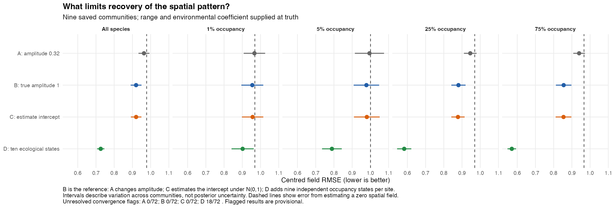
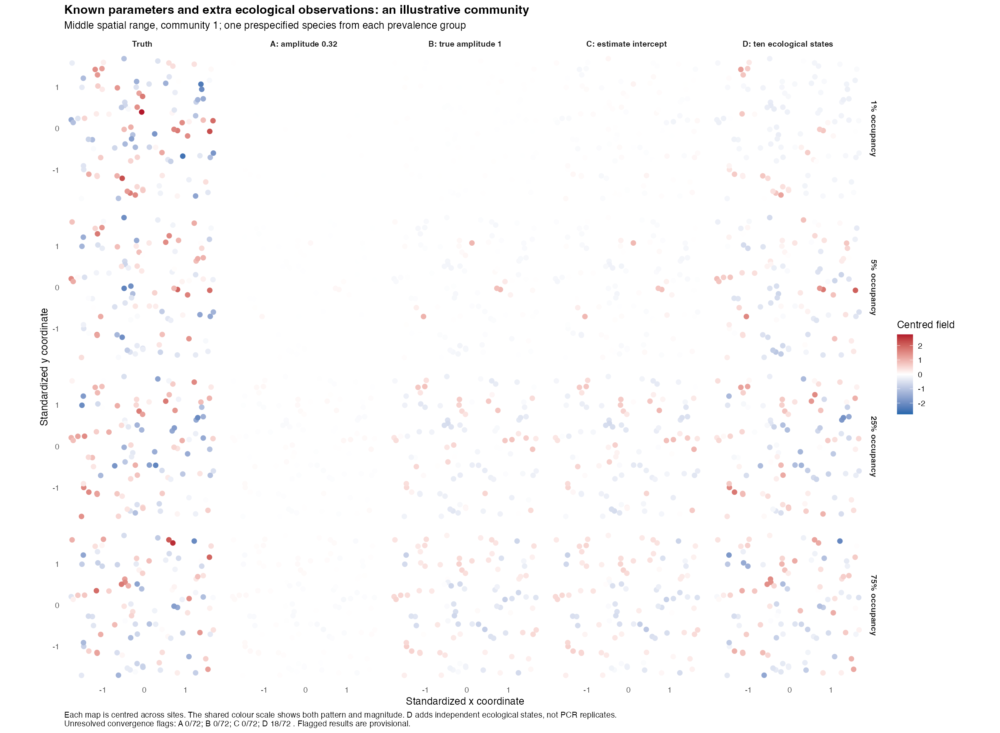
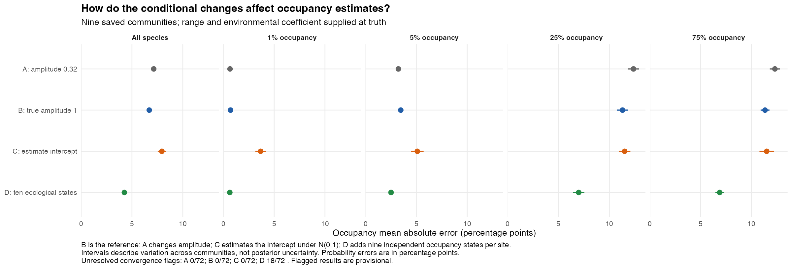

# Why is spatial-effect recovery poor?

28 September 2026. All 288 conditional posteriors have passed the independent saved-draw audit. Convergence qualifications remain as reported below.

Limited information about each species' spatial pattern is a major constraint in these nine communities. Fixing amplitude at the current prior's median, 0.32, gives more field error than fixing it at the true value, 1, but that improvement is modest. Estimating the occupancy intercept under its current prior adds rare-species occupancy bias without materially explaining the poor centred spatial maps in this conditional comparison. The separate full-model half-Cauchy comparison is still running.

## What was compared?

These checks reuse the nine saved binary communities, with 100 sites and eight species each. Observations are the actual occupied/unoccupied states, so there is no detection uncertainty. An independent sampler estimates the spatial field while supplying selected parameters at their generating values. This removes several full-model difficulties and asks how much spatial recovery is possible under these specific, favourable assumptions.

| Conditional check | What changes relative to B? | Spatial-pattern error | Occupancy absolute error |
| --- | --- | ---: | ---: |
| A: amplitude fixed at 0.32 | Use the median of the current amplitude prior | 0.963 | 7.14 percentage points |
| B: amplitude fixed at the true value, 1 | Reference: true intercept, environmental coefficient and range supplied | 0.920 | 6.70 percentage points |
| C: estimate the intercept | Retain its current Normal(0, SD 1) prior | 0.920 | 7.94 percentage points |
| D: ten ecological observations per site (18/72 flagged) | Add nine independent occupancy states | 0.726 | 4.25 percentage points |

Spatial-pattern error is RMSE after centring each species' posterior-median map across sites. Lower is better. Estimating a completely flat, zero spatial field gives error **0.978**. Occupancy error compares posterior-mean probabilities with truth. Errors pool sites and species within each community before averaging the nine communities. These conditional checks are not a comparison of four complete fitted models or four prior distributions: A and B fix amplitude rather than estimate it.

## Why does knowing the correct amplitude help so little?

One binary observation tells us whether a species occurred at a site, not its underlying occupancy probability or the size of its spatial effect. Nearby sites can help, but many sites here have few strongly correlated neighbours. At the shortest generating range, **61--70% of sites have no other site with correlation above 0.5**. Even at the longest range, that proportion is 11--21%.

With true amplitude, range, intercept and environmental coefficient supplied, the spatial-pattern error is only about 6% below the zero-field baseline. This shows that substantial poor recovery persists when amplitude shrinkage and those parameter-estimation difficulties are removed. It does not prove that the full sampler has no additional problem, or establish a formal bound on what every estimator could achieve.

The limitation is strongest for rare species. A species averaging 1% occupancy has only one expected occupied site among 100. Its spatial-pattern error is **0.955** with the correct parameters supplied, compared with **0.969** for a flat zero field. There is little reduction in centred RMSE compared with a zero field. Giving the model ten independent ecological observations lowers that error only to **0.902**. The provisional D summaries suggest a larger benefit for common species: in the 25% group, error falls from **0.880 to 0.583**; in the 75% group, from **0.855 to 0.570**.

These extra observations are **independent ecological occupancy states sharing the same underlying field**, not additional PCR replicates or repeated detections of one occupancy state. D is an information diagnostic, not a proposed sampling design. Its unresolved convergence flags qualify the numerical results below.

## What role does the occupancy-intercept prior play?

Estimating the intercept under the unchanged Normal(0, SD 1) prior barely changes centred spatial-pattern error here: **0.920 to 0.920** overall. It does, however, worsen occupancy probabilities for rare species. For the 1% group, mean signed occupancy error rises from about **+0.01 to +3.62 percentage points**, giving an estimated mean occupancy of about **4.62%**. For the 5% group, signed error rises from **+0.04 to +3.06 points**.

This comparison combines estimating the intercept with using its existing prior; it does not isolate those two effects. It supports keeping the occupancy-bias problem separate from spatial-map recovery, alongside the earlier [rare-species diagnosis](../../spatial-targeted-recheck/diagnosis/REPORT.md). No wider intercept prior was fitted here. The paired full-model widening study remains the next required release-preparation task after the spatial-amplitude comparison.

## Reliability and limits

All 288 conditional targets were fitted, retaining species with no occupied sites. Every target used four chains and the same predetermined diagnostic thresholds. A failed initial screen triggered one longer schedule. All 216 selected A/B/C targets pass. **18 of 72 D targets retain flags**, all among the 25% and 75% species; their largest Rhat is 1.069 and the smallest recorded ESS is about 40. They are not silently treated as converged or excluded.

Independent reconstruction reproduced every selected posterior summary within **1.68e-14** and all **58,824 diagnostic traces' recorded diagnostics exactly**. It also verified original inputs, the package-matched covariance, settings, seeds, longer-run selection and source/result fingerprints. This confirms the calculations from the saved draws; it does not establish convergence of flagged posteriors.

The existing-chain sensitivity check allows independent chain choices for every independently fitted species. Across those observed choices, the mean centred-RMSE difference for **A minus B stays positive, from +0.028 to +0.052**. The difference for **D minus B stays negative, from -0.214 to -0.174**. Thus the respective directions of these two overall comparisons do not depend on selecting one of the four observed chains. For **C minus B**, the envelope spans **-0.022 to +0.024**, consistent with no clear change in centred field error. C's increase in occupancy MAE remains positive, from **+0.99 to +1.47 percentage points**.

These are descriptive observed-chain envelopes, not Monte Carlo confidence bounds or proof that all posterior regions were visited. They retain every species and every convergence flag. The paired community comparisons also agree in direction across all nine communities for A versus B and D versus B. The [paired table](results/paired.csv) gives the separate, descriptive uncertainty intervals across communities; these must not be confused with chain sensitivity or posterior credible intervals.

The sampler was validated against numerical logistic-normal integration, a jointly sampled intercept/field reference, a correlated Gaussian target and exact seed reproducibility. Its covariance matches the package's 100-support spatial representation. The [protocol](PLAN.md), [reproduction instructions](README.md) and compact [results](results/README.md) preserve the assumptions and evidence; complete draws and diagnostics remain in the raw archive.

Range and environmental-coefficient uncertainty are held fixed in all four checks, so their separate contributions remain unmeasured. These comparisons are not an additive decomposition of full-model error. Nine communities also do not establish nominal interval coverage. The half-Cauchy's full-model convergence problem is separate: the present checks hold amplitude fixed and do not validate the production sampler's mixing when amplitude is estimated.

## Implication for the half-Cauchy test

A broader amplitude prior can remove one source of shrinkage, but it cannot create the missing ecological information. These conditional results give no reason to expect a prior change alone to restore detailed spatial maps, especially for rare species. Complete the already-running matched full-model comparison and judge its audited field recovery and convergence together before deciding whether the prior is useful. No production default has changed.
