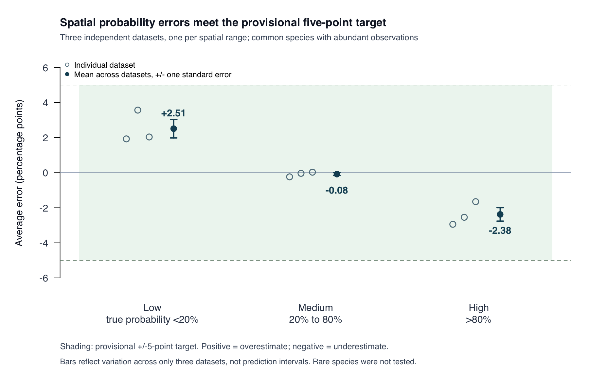

# Spatial beta recheck, 13 September 2026

**DRAFT, ALEX TO REVIEW. The three informative binary checks meet Doug's provisional five-point target.** The continuous-noise default still needs a decision, and these checks do not establish accuracy for rare species or every dataset. This follows the [original spatial validation](spatial-range-validation.md). The RNG fix is now on `main` through PR #9, so PR #8 can be reviewed against `main`. Alex approved PR #7, which merged into `main` on 14 September 2026. PR #8 now includes that correction as well.

## The agreed target

Doug provisionally chose an average systematic occupancy-probability error of no more than five percentage points in sufficiently informative simulations. Check low true probabilities (below 0.2), medium probabilities (0.2 to 0.8), and high probabilities (above 0.8) separately. For example, when the true probability is 20%, an average estimate between 15% and 25% meets this provisional target. This concerns average error across independently simulated datasets, not every prediction or the width of an uncertainty interval. Report the uncertainty in that average. Rare species need separate consideration because five points can be a large relative error for them.

The threshold was chosen before the stronger-data results below. Increasing the amount of simulated information is a diagnostic design choice; it does not change the target or turn earlier failures into successes.

## What the additional code does

- A user can now request one support point at every unique observed location. Previously the fitter silently capped the request at one fewer location and used clustering to select the points. Full support now uses the observed coordinates directly. This avoids losing a spatial direction solely because of the cap. The existing numerical jitter remains. The default count, 20% of unique locations rounded down, is unchanged; users must check whether increasing it materially changes their results. A small support set can still miss short-range spatial variation.
- Repeated binary observations at the same location now share the spatial part of the range calculation. Their individual environmental covariates, latent factors, outcomes and Polya-Gamma precisions are all retained. The calculation rearranges exactly the same sums. It is about 25 times faster for the range-weight calculation in the 4,800-observation benchmark, with a maximum range-probability difference of 1.5e-13. This is not a 25-fold speed claim for complete fits. Continuous fits retain the existing constant-precision shortcut.
- Continuous-response fits now accept an explicit noise prior through `listPriors`, and save the applied choice in `infos$noise_prior`. `tau_prior = "half_cauchy"` places a half-Cauchy prior on each species' noise standard deviation; `tau_scale` defaults to 1 in response units. `tau_prior = "inverse_gamma"` retains the existing family on noise variance, with configurable `a_tau` and `b_tau`, both defaulting to 5. The current default remains inverse-gamma while the default choice is being decided. These settings do not alter the binary or detection models.

The flexible noise option allows small noise values that the previous prior strongly discouraged. It does not force the noise towards the simulated truth. Tests cover residual scales 0.1, 1 and 3, and changing measurement units together with the prior scale.

## Why the noise prior matters

In the original continuous checks, each of 100 locations had only one observation per species, with true noise SD 0.1 and spatial SD 1. The existing inverse-gamma prior produced mean noise estimates 0.787, 0.619 and 0.552 across the three spatial ranges. The estimated spatial fields were much too weak: their slopes against the true fields were 0.415, 0.654 and 0.725, where a slope of 1 would represent the correct magnitude.

An experimental half-Cauchy noise prior, keeping the same 99 support points, changed those field slopes to 0.842, 0.894 and 0.943. Noise estimates fell to 0.357, 0.278 and 0.116. Allowing all 100 locations as support points then gave field slopes 0.918, 0.950 and 0.945, field RMSE 0.169, 0.173 and 0.224, and noise estimates 0.222, 0.150 and 0.110. These are paired mechanism checks, not proof of unbiased estimation. Several individual coefficient and noise traces still had convergence warnings; one observation per location supplies limited information for distinguishing noise from a short-range field.

An independent calculation for the middle range fixes the regression means at their true values and integrates the range, spatial SD and noise SD in observation space. With 99 support points, its mean noise SD is 0.611 under the original prior and 0.277 under the half-Cauchy prior. Using the full generating GP covariance with the half-Cauchy prior reduces this to 0.159. Thus both the prior and the spatial approximation contribute; the remaining noise inflation is present in the specified posterior, rather than demonstrating a faulty noise sampler. Changing the spatial-variance prior alone has a much smaller effect in this comparison.

The original half-Cauchy experiments used an exact rejection sampler for the conditional noise distribution. The public option uses an auxiliary-variable Gibbs update with the same stationary distribution and no rejection loop. It has been checked by direct numerical integration and independent mathematical review. Let `v = tau^2` and `A = tau_scale`. The [half-Cauchy mixture identity](https://arxiv.org/abs/1508.03884) gives

```text
v | auxiliary ~ inverse-Gamma(1/2, 1/auxiliary)
auxiliary ~ inverse-Gamma(1/2, 1/A^2)
auxiliary | v ~ inverse-Gamma(1, 1/v + 1/A^2)
v | auxiliary, residuals ~ inverse-Gamma((n+1)/2, RSS/2 + 1/auxiliary).
```

Here `inverse-Gamma(a,b)` means that the reciprocal has a Gamma distribution with shape `a` and rate `b`. Each update draws the auxiliary variable from the current noise SD, then draws the new variance. The auxiliary is refreshed before every noise update. No detection prior is relaxed by this change.

## What the independent binary calculation establishes

The original binary example had six observations at each of 80 locations. occJSDM overestimated low occupancy probabilities by 14.13 percentage points and underestimated high probabilities by 12.60 points. An independent reference calculation, supplied with the true regression coefficients, range, spatial SD and full generating covariance, still had errors of +12.84 and -11.51 points. Most of the attenuation therefore remains even when these parameters are known. This is evidence of limited information, not permission to accept arbitrary package bias.

The reference uses [elliptical slice sampling](https://proceedings.mlr.press/v9/murray10a.html) of the spatial field, without calling occJSDM's sampler or spatial basis routines. A one-dimensional numerical integration checks its implementation. Applying the logistic transform to every saved package draw and then averaging reproduces the original probability estimates to numerical precision, so the earlier errors do not come from transforming a mean linear predictor incorrectly.

At 30 observations per location, the reference's low-probability error was still +5.23 points. At 60 observations per location, its low, medium and high errors were +3.29, -0.052 and -2.32 points, respectively. Their Monte Carlo standard errors were 0.028, 0.011 and 0.022 percentage points. Some individual spatial-field coordinates still mixed slowly, so the 60-repeat result is an information-adequacy pilot, not a general convergence claim or an independent-replicate beta test.

All eight species in those designs have mean prevalence around 41% to 64%. Low-probability observations within those species do not constitute a rare-species validation. The package's spatial-variance prior remains unchanged; the reference calculation alone cannot isolate its contribution to the smaller package-reference discrepancy.

## Complete-model checks

Three independent binary datasets were fitted at interior range-grid indices 4, 6 and 8. Each has 80 unique locations, 60 observations per location, eight species, 80 support points, one environmental covariate, nonzero intercepts and no latent factors or traits. These are independently generated binary observations with distinct site identities sharing coordinates, not repeated PCR detections of one fixed occupancy state. Each fit estimates the regression coefficients, spatial range and spatial SD, using two chains with 300 burn-in and 600 retained iterations. The priors are unchanged. The different range cells use independently seeded datasets; there is one dataset per range, not three replicates of each range.

Giving each dataset equal weight, the probability results are:

- Low probabilities: average error +2.51 percentage points; between-dataset standard error 0.53 points. Individual dataset errors range from +1.93 to +3.57 points.
- Medium probabilities: average error -0.081 points; between-dataset standard error 0.080 points. Individual errors range from -0.236 to +0.031 points.
- High probabilities: average error -2.38 points; between-dataset standard error 0.38 points. Individual errors range from -2.94 to -1.65 points.

All three average errors and all nine dataset-specific group errors lie within the unchanged five-point target. Five narrower probability bins and the very-low/very-high probability subsets also stay within five points in each dataset. The closest subset is true probability above 0.95 in the longest-range dataset: -4.44 points, with Monte Carlo standard error 0.062 points. None of these datasets contains deliberately rare species.



The between-dataset standard errors use only three independent datasets and include variation between spatial ranges. They do not quantify uncertainty at each range or demonstrate general calibration. Numerical uncertainty from the MCMC draws is much smaller: the combined Monte Carlo errors for the main groups are 0.012, 0.005 and 0.015 points. Their rank-normalized R-hat values are below 1.005, and the smallest effective sample size for a mean is 228. The largest difference between chain means is 0.037 points. Independent reconstruction agrees with the saved probability and field means to numerical precision. No fitting warnings were recorded.

Individual predictions can still be more than five points wrong. The probability RMSE, which measures error size without allowing positive and negative errors to cancel, is 5.63, 5.71 and 4.94 percentage points in the three datasets. The agreed target concerns average systematic error within each probability group, so this is a different measure. [Compact binary results and their column definitions](spatial-beta-binary-results/README.md) include the group errors, parameter estimates, simulation seeds and source fingerprints.

Spatial range means are 0.1063, 0.1676 and 0.2356 against truths 0.1067, 0.1711 and 0.2356. Spatial SD estimates are 0.997, 0.940 and 0.985 against a true value of 1. The posterior mean fields remain attenuated: their estimated-on-true slopes are 0.907, 0.883 and 0.887. This attenuation must remain visible even though the probability target is met. The known-parameter reference also attenuates individual field estimates; agreement with the probability target does not imply perfect recovery of every latent spatial effect.

The public half-Cauchy option was checked in three independent continuous datasets with 100 locations, ten measurements per location, 12 species, true noise SD 0.1 and 100 support points. These use two chains with 300 burn-in and 500 retained iterations. All three generating ranges were recovered. Noise estimates are 0.1006, 0.0993 and 0.1011, and spatial SD estimates are 0.997, 0.992 and 0.972. Total predicted-response RMSE is 0.0314 to 0.0319, with mean error between -0.0012 and +0.0022 in response units. No fitting warnings were recorded.

After centering each species' field around its own average, spatial recovery slopes are 0.994, 0.999 and 1.000. A slope of 1 means that the estimated spatial variation has the correct strength. Uncentered field RMSE is larger, 0.113 to 0.205, because the intercept and the field's average can offset one another; the total predicted level is estimated much more accurately. An [independent observation-space Gaussian integration](spatial-beta-continuous-range-reference.csv) at six dispersed variance states per dataset confirms the strongly concentrated range posteriors. The constant range traces are therefore supported by the posterior calculation, rather than taken as evidence of convergence on their own. [Compact continuous results](spatial-beta-continuous-results.csv) retain all three datasets' metrics.

## Reproduction and review

The portable fitting scripts save input data, truth, seeds, requested settings, applied continuous noise prior, source and loaded-library hashes, fits, warnings and metrics. An explicit new noise-prior request is rejected if an older selected source silently ignores it. The existing source-default mode remains available for reproducing older fits.

```sh
Rscript dev/simstudy/validate_spatial_binary.R --source=/path/to/compiled-source --out=/path/to/binary-results/package60-range6-full --grid-index=6 --repeats=60 --knots=80 --burn=300 --iter=600 --chains=2
Rscript dev/simstudy/validate_spatial_continuous.R --source=/path/to/compiled-source --out=/path/to/new-continuous-results --cell=2 --repeats=10 --tau=.1 --knots=100 --tau-prior=half_cauchy --tau-scale=1 --burn=300 --iter=500 --chains=2
```

Use binary grid indices 4, 6 and 8, saving them in sibling directories named `package60-range4-full`, `package60-range6-full` and `package60-range8-full`. Use continuous cells 1, 2 and 3, each in a fresh output directory. The original weak-information continuous comparison can be rerun with one repeat and 99 or 100 knots, choosing either noise prior explicitly. The existing inverse-gamma settings are `--tau-prior=inverse_gamma --a-tau=5 --b-tau=5`.

The following commands analyze saved package fits and independently check the continuous range probabilities. They do not launch another package fit. The figure script reads the compact results committed with this report.

```sh
Rscript dev/simstudy/summarise_spatial_binary.R --base=/path/to/binary-results --out=/path/to/new-binary-analysis
Rscript dev/simstudy/verify_spatial_continuous_range.R --input=/path/to/new-continuous-results --out=/path/to/new-range-reference
Rscript dev/simstudy/plot_spatial_beta_bias.R
```

The binary reference is also portable. Its numerical-integration check requires no saved data. The reference fit below uses a saved binary dataset and samples the spatial field with the other parameters fixed at their true values; it is an independent diagnostic, not another full occJSDM fit. The 60-observation pilot used four chains, 2,000 burn-in iterations and 4,000 retained draws with thinning by three.

```sh
Rscript dev/simstudy/verify_binary_oracle.R --out=/path/to/new-oracle-check
Rscript dev/simstudy/validate_binary_oracle.R --input=/path/to/binary-pilot/data-truth.rds --out=/path/to/new-oracle --burn=2000 --iter=4000 --thin=3
```

The long runs used immutable source snapshots. The binary snapshot contains the complete-support and grouped-arithmetic changes, with unchanged binary priors. The continuous snapshot additionally contains the public half-Cauchy option, which the saved metadata confirms was applied. Subsequent changes normalize named prior selectors and reject ignored validation options; they do not alter the sampling path used by these runs. The 13 September merge from `main` only removed inactive commented code. The 14 September merge additionally incorporates the approved residual-correlation correction from PR #7. That correction changes factor post-processing; the spatial datasets reported here have no latent factors or traits, so their sampling calculations are unchanged. Full saved fits, datasets and provenance remain in the task's local `work/spatial-binary-resume-20260913` and `work/spatial-noise-resume-20260913` directories. The compact report is not a substitute for those raw files.

The new full-support, grouped-arithmetic and noise-prior tests fail before their respective changes and pass afterward. Independent review checked the mathematics, public wiring and update order. It identified two cases in which a requested prior could be silently ignored; named prior selectors are now normalized, and the validation runner checks the applied prior. The source suite passed 498 assertions before the two added named-selector regressions, which subsequently passed with all 16 noise-prior assertions. After incorporating `main` on 13 September, 174 focused alignment, spatial and noise assertions passed. The 13 September freshly built installed-package check passed 464 assertions with zero test failures or test warnings; its eight skips cover opt-in coverage, CRAN-excluded recovery and source-only checks.

That 13 September package check reports zero errors, three existing warnings and three existing notes. The warnings concern the compiler's R-header warning option, the undocumented `verbose` argument in `predictNewSites.Rd`, and GNU Makevars syntax. The notes concern the worktree's hidden Git file, LICENSE metadata and existing undefined globals. No new package warning was introduced. This verification used arm64 macOS and R 4.5.0; it does not replace cross-platform checking.

On 14 September, after incorporating `main` at `80d449d` and the approved PR #7, the combined source suite passed 735 assertions with zero failures, errors or test warnings. The one skip is the opt-in coverage study. R also printed an environment warning that the installed `testthat` was built under R 4.5.2; the test run used R 4.5.0 and completed successfully. This was a fresh source-suite integration check, not a repeat of the installed-package check or long spatial simulations. The updated TODO removes accidentally committed merge-conflict text and records the three approved code fixes under *Fixed bugs* 49-51; the spatial review and separate beta checks remain open.

**Decision still needed:** choose whether the half-Cauchy noise prior becomes the continuous-model default or remains an explicit option. The code currently preserves the inverse-gamma default. The evidence supports the flexible alternative for small noise, but it is a modelling change for Alex to review. Keep PR #8 in draft until that choice and Alex's review are settled. Before beta, retain the separate checks of rare species, support-point adequacy and the other bias gates in TODO; these three informative datasets do not replace them.
