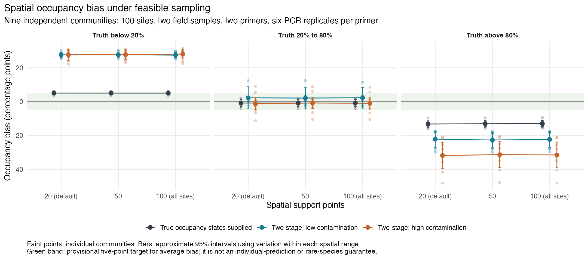
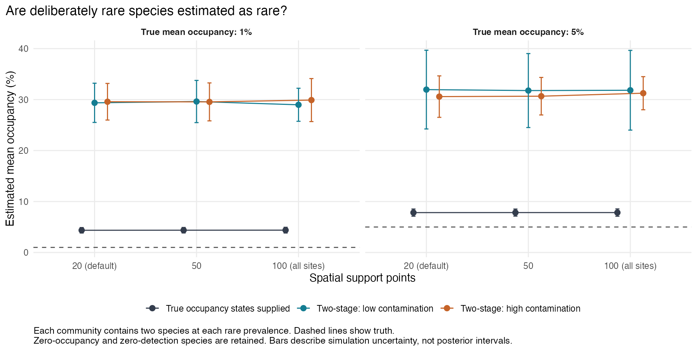
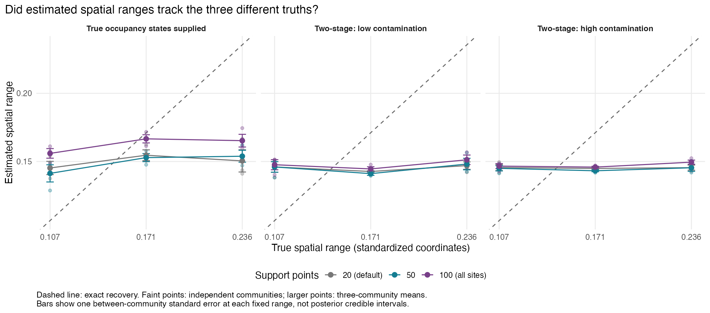

# Spatial recovery under feasible surveys and rare species

Completed 28 September 2026. **The two-stage surveys produced substantial occupancy bias, especially for rare species. More spatial support points did not resolve it.** Supplying true occupied/unoccupied states substantially improved accuracy, but did not eliminate the errors. These findings concern occJSDM under the unchanged defaults and generating scenarios below.

## The main results

At the default 20 spatial support points, averages across nine independent communities were:

| Observation model | Mean absolute error | Bias below 20% truth | Bias above 80% truth | Estimated occupancy of 1% species | 95% intervals containing truth |
| --- | ---: | ---: | ---: | ---: | ---: |
| True occupied/unoccupied states supplied | 8.79 points | +5.08 points | -13.22 points | 4.36% | 42.4% |
| Two-stage, low contamination | 23.09 points | +27.67 points | -22.22 points | 29.36% | 44.6% |
| Two-stage, high contamination | 24.60 points | +27.67 points | -31.81 points | 29.58% | 48.5% |

Positive bias means occupancy is estimated too high. The middle probability group had much smaller average signed errors (-0.80, +2.26 and -1.27 points), but its individual absolute errors still averaged about 13 to 14 points. Opposing errors partly cancel in the signed average.

The true 5%-occupancy species were estimated at 7.83%, 31.96% and 30.58% respectively. Among the 1%-prevalence species, the two-stage 95% intervals contained the true site-level probability only 2.4% of the time under low contamination and 3.8% under high contamination. High containment in the middle-probability group came with wide intervals, averaging 59 and 69 percentage points in the two-stage arms. Containment alone should not be read as precise estimation.

The containment percentages are descriptive. Sites and species within a community are dependent, and nine communities cannot establish nominal 95% coverage precisely. The report retains one unresolved package convergence warning.

## Detection added much more error than extra support points removed

Both two-stage arms had larger overall absolute error than their matching binary control in every community at every support setting. At 20 supports, the added MAE was 14.30 points under low contamination and 15.81 under high contamination; approximate 95% intervals for these paired simulation averages were 12.75 to 15.84 and 12.30 to 19.32 points.

| Observation model | MAE with 20 supports | MAE with 100 supports | Paired change |
| --- | ---: | ---: | ---: |
| True states supplied | 8.79 | 8.69 | -0.10 points |
| Low contamination | 23.09 | 22.97 | -0.12 points |
| High contamination | 24.60 | 24.82 | +0.22 points |

All nine binary-control communities improved with more support points, but only slightly. The small two-stage support differences are not robust to the observed-chain sensitivity summaries, which span both improvement and worsening. These summaries are not confidence intervals or bounds on Monte Carlo error.

## Spatial effects were poorly recovered

Two-stage range estimates remained near 0.14 to 0.15 across generating ranges of 0.107, 0.171 and 0.236. The amplitude parameter averaged 0.323 to 0.329 across settings, compared with generating amplitude 1. Posterior-mean field attenuation slopes were only 0.0007 to 0.0144; a faithfully recovered field would have a slope near 1.

With 100 supports, the selected basis could represent the true fields to numerical precision, yet the fitted fields reproduced little of the true pattern. A near-zero regression slope can reflect weak alignment as well as small estimated magnitude. The limitation therefore was not resolved by making the basis capable of representing the truth.

The earlier strong-information examples remain separate evidence: they had many independent ecological observations sharing each location and demonstrated recovery after the spatial code correction. This study has one ecological occupancy state per species at each of 100 unique sites. The new results do not undo that code correction or establish an unavoidable information limit.

## Why this needs a prior and information assessment

The unchanged intercept prior is Normal(0, 1). Generating intercepts for the 1%-occupancy species range from -5.45 to -4.79, and for the 5% species from -3.79 to -3.12. The spatial-amplitude prior has mean 0.329 and a central 95% interval of 0.242 to 0.457, compared with generating amplitude 1. The two-stage detection priors also favor higher true-detection and lower false-positive probabilities than some generating scenarios.

These scenarios deliberately challenge the defaults. Prior shrinkage is a plausible contributor, but this study did not vary priors or sampling effort, so it cannot isolate their effects or identify a unique cause. The errors still describe practical performance under these defaults. A follow-up should distinguish prior sensitivity from limited ecological information while preserving identifiability between true and false detections. Simply adding support points is not a demonstrated remedy here.

## Design and numerical reliability

- Nine independent communities: three at each of three spatial ranges; 100 sites and eight species, with two species apiece averaging 1%, 5%, 25% and 75% true occupancy.
- Paired binary, low-contamination and high-contamination arms. Two-stage surveys used two field samples per site, two primers and six PCR replicates per primer. Every arm used 20, 50 and 100 supports, for 81 initial fits.
- Zero-occupancy species were retained: eight of the eighteen 1%-prevalence species-community cases had no occupied sites. No traits, residual factors or new-site predictions were studied.
- Initial fits used two chains, 3,000 burn-in and 5,000 retained iterations. The diagnostic rules selected 26 longer checks, all completed with four chains, 6,000 burn-in and 12,000 retained iterations. Selection preceded inspection of scientific outcomes.
- One fit, `range6-rep03-high-k050`, retains a native warning for a PCR false-positive probability (classical Rhat 1.113; corresponding rank-normalized Rhat 1.014). It remains included and flagged. Every selected range trace varied within every chain.
- Longer fits changed an aggregate occupancy-group bias or MAE by at most 0.87 point, and containment by 2.74 points. Within an individual community, changes reached 6.16 and 12.5 points respectively. The broad errors persisted, but small comparisons and particular communities remain sensitive.
- The independent audit reconstructed posterior probability draws for all 81 selected fits and checked means, interval endpoints, containment and group scores. Its largest numerical discrepancy was 3.52e-13. This verifies the saved calculations, not posterior calibration or exploration of every mode.

Community averages receive equal weight within three fixed range strata. Approximate simulation uncertainty uses variation among the three independent communities in each stratum, with Satterthwaite degrees of freedom. All communities and both initial/longer fits are retained. The provisional five-point signed-bias target is not a guarantee for rare species or individual predictions, and these operational designs were not assumed sufficiently informative in advance.

Production code was frozen at `d3d710e406c5b022df9cb84b7e29e783b4b225c4`. The [design and reproduction instructions](README.md), [detailed report source](report.Rmd), [compact results](results/README.md) and [validation record](VALIDATION.md) preserve the evidence. No production code or prior was changed for this study. PRs #13 and #14 remain outside its scope.
