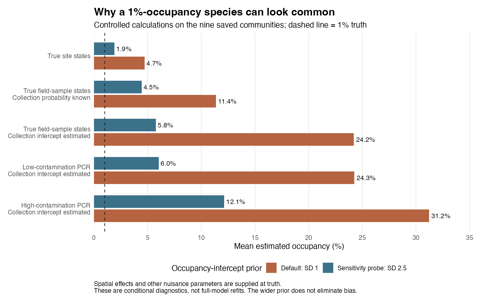

# Why rare species were overestimated

**The evidence supports a combined mechanism: the default occupancy-intercept prior strongly resists very low occupancy, while these field surveys provide little information to distinguish rare occupancy from false-positive collection.** The model can explain the observations by increasing occupancy and decreasing collection probability. Targeted deterministic calculations reproduce that inflation even with the spatial effects supplied exactly. This diagnoses a mechanism; it does not establish that every part of the full-model bias has the same cause.

## What the saved fits show

For the 18 species/community cases with true average occupancy of 1%, the original full spatial fits estimate 29.4% under low PCR contamination and 29.6% under high contamination. The true-state binary control estimates 4.4%.

The fitted field-process parameters move together with occupancy. Mean false-positive collection probability is 6.52% in the generating scenarios, but is estimated at 3.14% and 3.03%. Mean true collection probability is 38.64%, versus fitted means of 25.59% and 29.84%. The average within-fit correlation between occupancy and collection intercepts is -0.67 in the low-contamination arm and -0.29 in the high arm. These are posterior trade-offs, not evidence that the product of posterior means equals a posterior mean probability.

The relevant relationship, for one sample with fixed parameter values, is:

`P(field sample positive) = occupancy * collection + (1 - occupancy) * false-positive collection`

A higher occupancy probability can therefore be offset by lower collection probability or a different false-positive collection rate. Replicate patterns and covariates can distinguish these explanations when they carry enough information. Here they often do not.

## There was very little genuine field signal

Across the target-1% cases, the mean number of occupied sites is 1.11 out of 100. On average there are **0.78 positive field samples from occupied sites, versus 13.17 from unoccupied sites**. Thus 94.4% of the realized positive field samples originate from unoccupied sites. This describes the generator's latent field states, not a classification inferred from the observed PCR data.

Eight of the 18 cases have no occupied site at all, and ten have no positive field sample from an occupied site. Fifteen have no occupied site with both field samples positive. Double-positive field sites average 0.17 from occupied sites and 0.78 from unoccupied sites. There is consequently little repeat-collection evidence identifying a genuinely occupied class.

The six PCR replicates per primer help distinguish a positive field sample from an uncollected sample. In this model, once a field sample is positive, its PCR detection distribution is the same whether its source site was occupied or unoccupied. PCR replication cannot by itself identify the ecological origin of that field signal.

## The default occupancy prior supplies a substantial upward pull

The active occupancy-intercept prior is Normal with mean 0 and standard deviation 1. The target-1% generating intercepts average -5.16 and range from -5.45 to -4.79. These values lie far into that prior's lower tail. The collection intercept also has a Normal(0, SD 1) prior. These defaults are implemented in the active [coefficient sampler](../../../../src/jsdm.cpp) and [fitting entry point](../../../../R/runOccJSDM.R), respectively.

A simple independent calculation demonstrates the effect without any detection or spatial uncertainty. With an intercept-only model and perfectly observed occupancy at 100 sites:

| Observed occupied sites | Posterior mean occupancy: intercept SD 1 | Intercept SD 2.5 |
| --- | ---: | ---: |
| 0 | 3.44% | 0.84% |
| 1 | 4.22% | 1.69% |

The wider prior here is a sensitivity probe. It is not a recommended production default and does not necessarily give well-calibrated inference. The intercept-only demonstration must not be interpreted as the full spatial model's prior distribution of species prevalence.

## Controlled checks reproduce the mechanism

I independently summed over the latent occupancy and collection states, then integrated the remaining one or two unknown intercepts numerically. These calculations use the original nine communities and all 36 target-1%/5% species cases. They use no MCMC sampler.

The spatial field, environmental coefficient, collection slope and false-positive/detection parameters are fixed at their generating truth. The occupancy intercept is estimated in every calculation. The collection intercept is either known or integrated under its unchanged Normal(0, SD 1) prior. Only the occupancy-intercept prior changes between columns below.

**Mean estimated occupancy for species whose truth is 1%:**

| Information supplied to the diagnostic | Occupancy-intercept SD 1 | SD 2.5 |
| --- | ---: | ---: |
| True occupied/unoccupied states | 4.72% | 1.91% |
| True field-sample states; collection probability known | 11.37% | 4.45% |
| True field-sample states; collection intercept estimated | 24.22% | 5.77% |
| Low-contamination PCR observations; collection intercept estimated | 24.26% | 6.05% |
| High-contamination PCR observations; collection intercept estimated | 31.23% | 12.12% |

These comparisons demonstrate both ingredients. Holding the prior fixed, uncertainty in collection probability markedly increases the estimate. Holding the likelihood and all other priors fixed, widening the occupancy-intercept prior markedly reduces it. Providing the true field-sample states does not remove the problem, so errors in identifying those states from PCR cannot be its sole explanation. High PCR contamination still worsens the controlled calculations.

The target-5% cases show the same broad mechanism: with low-contamination observations and unknown collection intercept, the estimate falls from 23.21% to 10.40%; under high contamination, from 28.05% to 11.65%. Widening this prior does not eliminate bias for either prevalence group.

## What this establishes, and the next test

The combined prior and field-information mechanism is demonstrated. Strong rare-species inflation does not require a spatial reconstruction error or poor MCMC mixing: it appears in deterministic calculations with the spatial field known. The original support-point comparison also showed little improvement from 20 to 100 supports. Spatial shrinkage remains relevant to field recovery and site-level errors, but changing the number of support points does not address this demonstrated mechanism.

These conditional calculations are not full-model refits. They cannot assign an additive fraction of the original bias to each prior, identify a unique production remedy, or rule out additional implementation or mixing problems. Fixing the true nuisance parameters removes several dependencies present in the fitted model.

The next decisive test is a small, paired full-model comparison that varies the occupancy-intercept prior separately from independently calibrated field-contamination/collection information. Field sampling effort should then be assessed separately. The PCR priors that distinguish true detection from false positives should retain their identifiability role; this diagnosis does not justify flattening them. No package code or default prior was changed here.

## Verification and reproduction

All 27 selected default-support result hashes were checked. Diagnostic extraction preserves the identities of the nine inputs and 18 two-stage fit files. There are 504 conditional posterior results, with 18 species/community cases contributing to each prevalence-specific summary. Sites or species are not treated as independent simulation replicates; these are descriptive averages across the same nine communities.

The independently collapsed likelihood agrees with explicit enumeration of latent states. Its C++ grid implementation agrees with a separate R calculation, and intercept-only results agree with adaptive integration of the binomial posterior. Halving the grid spacing changed posterior mean occupancy by at most 2.38e-10; the largest posterior weight in the outer unit-width boundary strips was 6.84e-10 after extending the integration domain. This is a numerical check, not a statistical confidence bound.

An independent reviewer recomputed all 28 aggregate summaries and checked a two-intercept posterior using direct probability products and nested adaptive integration, without the grid helpers. Agreement was within 8.7e-16 for that case. The original full-model study's one unresolved native convergence warning remains documented in its report; these deterministic diagnostics do not clear that warning.

See [reproduction instructions](README.md), [diagnostic plan](PLAN.md), [oracle calculations](oracle.R), [runner](run.R) and [compact numerical evidence](results/README.md).
