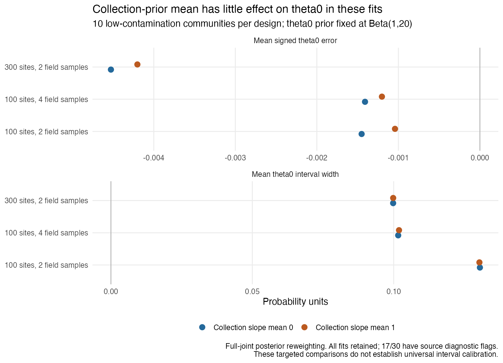
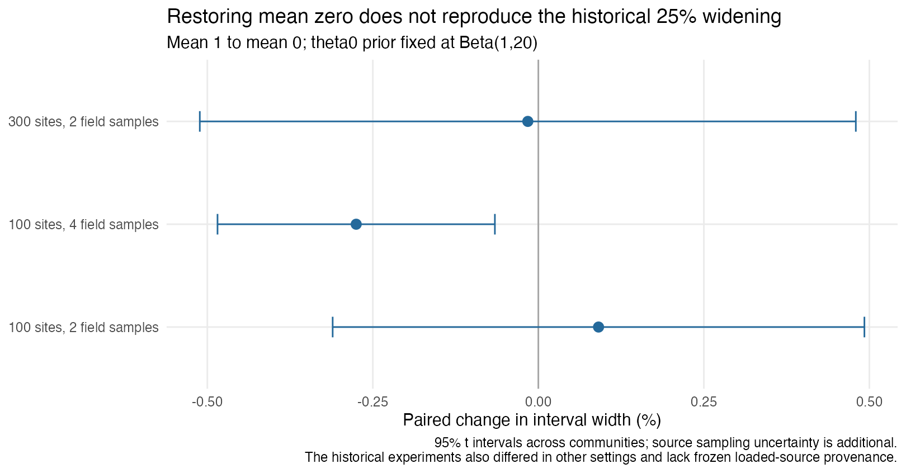
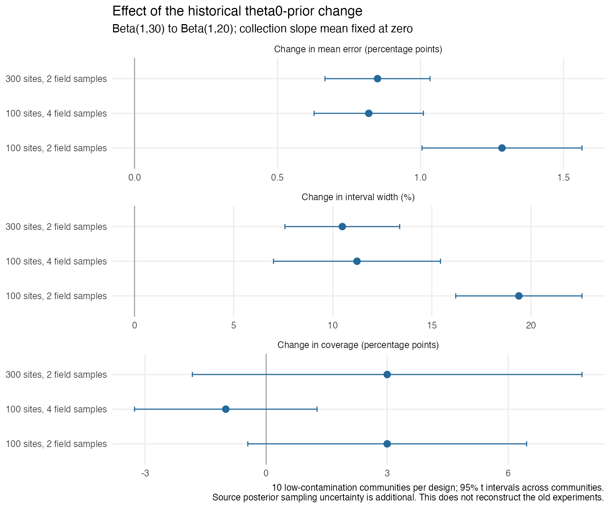

# Targeted theta0 prior sensitivity investigation

The historical theta0-prior change has a much larger effect than the collection-prior mean in these current nonspatial designs. At collection mean zero, moving from Beta(1,30) to Beta(1,20) widens low-contamination theta0 intervals by approximately 19.4%, 11.2% and 10.5% under the baseline, four-field-sample and 300-site designs, while reducing downward mean error by 1.28, 0.82 and 0.85 percentage points. The collection-mean effect on width stays below 0.34% under either theta0 prior. This makes theta0's own prior change a plausible contributor to the historical bias/width shift, without proving what caused the old experiments. No package code, sampler or default prior changed.

The mean-only study was completed first, holding theta0 at Beta(1,20). Douglas then explicitly requested the historical Beta(1,30) comparison on 8 October 2026. The expanded study separates both prior effects through all four combinations of collection means zero/one and theta0 Beta(1,20)/Beta(1,30), with collection variance two, intercept Normal(0,1) and detection priors fixed. Its original evidence is preserved intact in the raw archive. There is no recommendation to tighten theta0's prior to hit a coverage target; excess interval width remains acceptable for beta, and this targeted study does not establish universal interval calibration.

## What was tested

The [protocol](PROTOCOL.md) was written before inspecting sensitivity outcomes. We reused all 60 selected ordinary nonspatial posterior fits from the [current-main recheck](../current-main-recheck/README.md), the same fits used in the [targeted interval follow-up](../interval-calibration/REPORT.md). These are ten communities in each low/high laboratory-contamination condition under three designs, with ten species, two primers and six PCR replicates per primer. The designs are 100 sites with two field samples, 100 sites with four field samples, and 300 sites with two field samples. Truth, input data, source identity and all chains were preserved.

For each retained joint posterior draw, the Normal(1,variance 2)/Normal(0,variance 2) density ratio is multiplied across every collection slope and species. The historical theta0 comparison additionally multiplies the Beta(1,30)/Beta(1,20) density ratio across all species within the same joint draw. The four combinations therefore include both ratios when both priors change. The collection intercept stays Normal(0,1). Ordinary normalized weights give means and inverse empirical-CDF equal-tailed 95% intervals; Pareto diagnostics and autocorrelation-adjusted importance ESS assess the weight approximation. Weighting one species separately would fail to include its dependence through the shared model. At exact uniform-weight quantile boundaries, floating-point accumulation can choose the next order statistic; the reviewer observed one draw of endpoint resolution (up to 0.000052 in the first checked fit). The preserved calculations do not claim endpoint precision at that scale. Saved theta0 truth is the probability of field contamination, and requires no positive-read correction; that correction belongs to p and q at the laboratory observation stage.

Changes are calculated within each community before averaging. Monte Carlo SE and 95% t intervals use communities as independent replicates. A screened comparison uses the same communities in both prior arms, so changing eligibility cannot produce an apparent prior effect. These generating truths were not drawn from the complete fitting prior, and ten communities per cell do not constitute simulation-based calibration or precise coverage validation.

## Collection-mean comparison with the current theta0 prior

All low-contamination fits are retained in the following primary descriptive table. Widths and mean errors are in probability units; relative width changes are means of within-community percentage changes, in the historical direction mean one to mean zero.

| Design | Coverage, mean 1 / mean 0 | Width, mean 1 / mean 0 | Mean error, mean 1 / mean 0 | Paired width change |
| --- | --- | --- | --- | --- |
| 100 sites, 2 field samples | 98% / 98% | 0.13032 / 0.13050 | -0.00104 / -0.00145 | +0.091% |
| 100 sites, 4 field samples | 98% / 98% | 0.10189 / 0.10159 | -0.00120 / -0.00141 | -0.275% |
| 300 sites, 2 field samples | 97% / 97% | 0.09982 / 0.09981 | -0.00420 / -0.00453 | -0.016% |

The paired width-change 95% intervals are -0.311% to +0.493%, -0.485% to -0.066%, and -0.511% to +0.480%, respectively. They describe variation across the ten communities; source posterior Monte Carlo uncertainty is additional. Mean-zero minus mean-one signed error is -0.000409, -0.000207 and -0.000324. The mean change does not materially change the observed mean error in these fits, and does not reproduce the historical approximately 25% increase in interval width. Its direction and magnitude can differ in other designs.

Source diagnostics flag 17 of 30 low-contamination fits and 18 of 30 high-contamination fits, primarily for ESS. Four low-contamination and six high-contamination mean-one reweightings have importance ESS below 400; all ordinary weight ESS values exceed 2,958, and the largest Pareto k is 0.407. Reweighting cannot repair a poorly sampled source posterior or determine missing-mode mass. Common-input screened comparisons retain seven baseline, four four-field-sample and two 300-site low-contamination communities, with mean width changes +0.020%, -0.238% and +0.073%. That sensitivity also shows small changes, but the small retained counts prohibit a stronger calibration conclusion.

[Primary summaries](results/importance-summary.csv), [paired community changes and uncertainty](results/paired-summary.csv), [source diagnostics](results/selected-fit-provenance.csv), [importance diagnostics](results/importance-diagnostics.csv) and [every chain's weight fraction](results/chain-weight-fractions.csv) retain the full evidence.





## Historical theta0-prior comparison

The following low-contamination primary table keeps collection slope mean at its current value zero. Both theta0 priors use exactly the same source communities; change percentages are averaged within communities before aggregation. All low-contamination source fits are retained.

| Design | Coverage, Beta(1,30) / Beta(1,20) | Width, Beta(1,30) / Beta(1,20) | Mean error, Beta(1,30) / Beta(1,20) | Paired width change, 30 to 20 |
| --- | --- | --- | --- | --- |
| 100 sites, 2 field samples | 95% / 98% | 0.10901 / 0.13050 | -0.01430 / -0.00145 | +19.39% |
| 100 sites, 4 field samples | 99% / 98% | 0.09097 / 0.10159 | -0.00960 / -0.00141 | +11.22% |
| 300 sites, 2 field samples | 94% / 97% | 0.09017 / 0.09981 | -0.01302 / -0.00453 | +10.48% |

The paired width-change 95% intervals are +16.21% to +22.58%, +7.01% to +15.44% and +7.59% to +13.38%. Corresponding changes in mean error are +1.285, +0.819 and +0.850 percentage points, with 95% intervals +1.005 to +1.564, +0.628 to +1.010 and +0.666 to +1.033 points. The positive changes reduce the observed downward bias; they do not mean all species become unbiased. Coverage changes are +3, -1 and +3 percentage points and their community-based intervals all include zero. Ten communities and source Monte Carlo uncertainty prevent ranking the priors by closeness to a coverage target.

Common-input screened comparisons retain seven/four/two low-contamination communities and give width changes +19.06%, +7.14% and +12.26%. Source diagnostic flags remain 17/30 low and 18/30 high. Under Beta(1,30), autocorrelation-adjusted importance ESS flags 12/30 low fits at collection mean zero and 13/30 at mean one, with 6/30 and 7/30 high fits flagged respectively. All ordinary weight ESS values exceed 870; largest Pareto k across the complete factorial is 0.444. Source sampling limitations remain material even when the density ratios have acceptable tails.

At collection mean one, the historical theta0-prior comparison produces almost the same changes. Moving collection mean one to zero under Beta(1,30) changes widths by -0.328%, -0.310% and -0.152%, compared with +0.091%, -0.275% and -0.016% under Beta(1,20). The difference between theta-prior effects at the two collection means is at most 0.000053 in mean error and 0.000510 in width in these cell averages. Its low-contamination 95% intervals include zero. This documents small observed interaction; it is not an assumption that the mechanisms are universally additive. [Four-arm interaction results](results/factorial-interaction-summary.csv) retain the exact direction and common-input screen.

These results reproduce the direction and much of the baseline magnitude of the historical bias/width shift through theta0's own prior alone. The historical notes reported approximately 25% widening and a large bias reduction. The current comparison instead uses nonspatial K6 data, holds collection variance fixed at two, and does not establish which loaded prior produced the historical K3/spatial archives. It therefore identifies a plausible contributor, rather than assigning the entire historical shift to this prior. A baseline coverage of 95% under Beta(1,30) accompanies substantially more downward bias; that number does not justify restoring the tighter prior.



## Full-fit validation

Before seeing the mean-only outcomes, we selected low-contamination community one in each design and refitted both collection means with the frozen current c9ad954 package. The authorized historical-prior extension uses these same inputs and starting R RNG states. The short mean-zero wrapper control reproduces the exported fitter's complete posterior output exactly. The mean-one clone changes exactly the slope-mean constant; the intercept is subsequently reset to zero in both arms, formals and namespace are identical, and restoring the constant restores the original body. Explicit theta0 arguments select Beta(1,20) or Beta(1,30); the other detection and contamination priors stay at current defaults.

All twelve initial fits use four chains, 3,000 burn-in and 6,000 retained iterations per chain and emitted no package warnings. The original Beta(1,20) stage flagged four fits: both baseline and both 300-site arms. The added Beta(1,30) stage flagged only the two 300-site arms. Exactly these six diagnostic flags received one extension to four chains, 6,000 burn-in and 12,000 retained iterations. All extensions emitted no warnings; every initial fit is retained. Selection uses diagnostics, never coverage or effect size, giving eighteen distinct fit files and twelve selected arms.

Nine of twelve selected arms pass the theta0/collection/p/q screen. The Beta(1,20) mean-one 300-site fit retains theta0 bulk ESS 324.64 and collection bulk ESS 247.46. Under Beta(1,30), the 300-site mean-zero fit retains theta0/collection bulk ESS 394.32/289.92, and mean-one retains 286.79/272.19. The largest selected Rhat is 1.02945. These remaining numerical flags limit endpoint precision and are retained after the prespecified single extension.

Across all four prior combinations, initial reweighted versus full-refit mean differences are at most 0.00485 per species; interval-width differences reach 0.02635. After diagnostic substitution, the maxima are 0.00603 and 0.01177. Source and refits reuse starting R RNG states, so their numerical errors can be correlated. Each mean MCSE and their sum are reported as a conservative uncertainty scale under unknown covariance, without an independent-fit Z score. No initial or selected mean difference exceeds three times that sum. Widths and interval endpoints have no corresponding MCSE agreement guarantee, especially for flagged fits.

At collection mean zero, selected full refits under Beta(1,30) to Beta(1,20) widen intervals and shift signed error upward in all three inputs. Width increases are 15.19%, 11.64% and 5.06%; mean-error changes are +1.415, +0.766 and +1.094 percentage points. That shift overshoots zero in the baseline and 300-site inputs: signed errors change from -0.158 to +1.257 and -0.123 to +0.972 percentage points, while species-averaged absolute errors increase from 1.550 to 2.402 and 1.276 to 1.813 points. Directional agreement therefore does not imply improved accuracy in every community. This is one community per design, with a flagged 300-site historical-prior fit, and supplies validation rather than an additional coverage sample. It supports the direction of the sensitivity result without replacing the ten-community estimates or removing their sampling limitations. [Factorial initial diagnostics](results/factorial-full-fit-provenance.csv), [selected diagnostics and provenance](results/factorial-full-fit-selected-provenance.csv), [initial comparisons](results/factorial-importance-versus-full-initial.csv) and [selected comparisons](results/factorial-importance-versus-full-selected.csv) preserve both stages. The original mean-only full-fit tables also remain unchanged.

## Known-state reference

Knowing the true occupancy and field states removes their uncertainty. For each species, count collected and uncollected field samples among absent sites and compute the exact Beta(1 + collected, b + uncollected) posterior, where b is 20 or 30. Information from PCR replicates does not enter that conditional once field states are known. The exact low-contamination reference gives coverage 96%, 94% and 93%, widths 0.07951, 0.06014 and 0.05032, and mean errors -0.00177, -0.00225 and -0.00193 across the three designs.

Under Beta(1,30), exact known-state coverage is 94%, 95% and 93%, widths are 0.07306, 0.05721 and 0.04862, and mean errors are -0.00628, -0.00489 and -0.00378. Both priors therefore show the narrower-width/more-downward-bias tradeoff even when states are known.

Under Beta(1,20), the full latent-state intervals are approximately 1.64, 1.69 and 1.98 times those known-state widths. This documents the cost of unknown states and nuisance parameters. It is not an additive causal decomposition and cannot show that the additional uncertainty is excessive. The direct Beta formula and independent sample-to-site mapping agree for every archived community.

## Source-history correction

Commit e60e3ad6e576b314038f8c3fc887f43255ff797f, dated 28 July 2026, changes collection slope mean one to zero and variance one to two. The next prior-block change, commit 42198d97a0dace76295de5434e0f168496218cc3, dated 29 July, changes theta0's default from Beta(1,30) to Beta(1,20). Its parent already has the mean-zero/variance-two collection prior. [Exact extracted prior statements and source hashes](results/history-prior-blocks.csv) preserve this audit.

The July summary archives preserve reported intervals and session information but no frozen loaded namespace or posterior fits. Source history establishes that the prior changed in code; it does not prove which loaded version produced either historical archive. Consequently, the old claim that theta0's own prior was unchanged cannot support causal exclusion of that change. The recorded historical bias and width values remain observations, while their old attribution and the assertion that the pre-fix widths were definitely too narrow are unestablished. This study fixes collection variance at two and uses nonspatial current fits; it does not recreate all historical changes.

## Contamination assumptions and disposition

The thirty high-contamination fits are retained and tabulated as deliberate mismatches to low-contamination priors. The known 300-site community-five mirror labelling and its flags remain in the data. Poor recovery in that regime alone is not a defect verdict. Low-contamination flags also exist and should not be attributed to the high-contamination mismatch.

**Closed by Doug, 8 October 2026:** retain Beta(1,20) for the beta release. The targeted investigation is complete and the limitation is disclosed in README Known limitations, the installed quickstart, `?runOccJSDM`, Lesson 2's prior explanation and Lesson 3's interval/diagnostic guidance. Broader calibration remains deferred to the paper study. Across the three low-contamination designs, average absolute error changes by only -0.096, -0.017 and -0.021 percentage points from Beta(1,30) to Beta(1,20); all corresponding community-based 95% intervals include zero. Smaller signed downward error therefore does not establish better overall point accuracy.

Both the requested collection-mean hypothesis and the subsequently authorized historical theta0-prior control are complete on the selected nonspatial designs. The former has a small observed effect; the latter produces substantially wider, less downward-biased theta0 posteriors under the current prior. Neither provides a reason to tighten a default against a coverage target. Broad calibration, any claim of nominal coverage, and a complete explanation of the historical July shift remain outside this targeted result.

## Reproducibility and checks

Original selected fits use production revision 2a75bf1. Fresh fits reuse the frozen source and installed R 4.5 library from the previous targeted study at c9ad954aea21901dee85d06e817a3e8a7b93625a; at fit time all corresponding production R/C++/header files matched the checkout. Subsequent main includes posterior-accessor work and public-help edits; the exact fit-time source and native library remain preserved, and the public-help edits leave executable fitting expressions unchanged. The private library, native binary and source are hashed in every fit. One sampler thread and at most four independent shell processes are used. Executed research scripts are preserved in the raw archive and left unchanged while fitting.

Raw evidence lives in dev/simstudy/results/theta0-prior-mean-20261008; it includes initial and longer fits, executed scripts, history snapshots and logs, and depends on the preserved previous-study package/runtime plus the selected-fit manifest's original inputs. No original archive was rewritten or removed. The completed mean-only report, scripts, compact results, settings and planning entries are preserved in b20-only-evidence-before-history; its six initial and four longer fits remain at their original paths. Original executed scripts are retained, while amended scoring/comparison/plot scripts receive separate factorial snapshots. Tracked scripts and compact CSV/PNG evidence live beside this report.

The completed mean-only audit passed 11,889 checks and remains in the preserved earlier evidence. The expanded audit independently evaluates all four joint density ratios with Normal/Beta densities, validates inverse-CDF endpoints through their bracketed probability mass, reconstructs sample-to-site mapping from input info, verifies exact Beta endpoints under both priors, and checks all truth/input/fit identities and production/native/executed-runner hashes. It also verifies all eighteen validation fit files (twelve initial and six longer), diagnostic-selected job counts, every paired contrast with its common screened community set, and the four-arm interaction with its uncertainty. CSV probability values are compared within 1e-12 to allow round-trip precision; raw RDS hashes are exact. The final audit passes 28,701 checks, recorded in [the verification record](results/verification.txt). Separate reviewer audits confirm all sixty source mappings, posterior structure, frozen priors and clone restoration. The [final factorial review](results/factorial-review.txt) adds 3,674 independent paired/interaction assertions and 768 fresh mean/MCSE checks, verifies actual historical-prior arguments and selected diagnostics from raw draws, and confirms preservation of original evidence. It found no critical or important issue; the minor selected-refit accuracy wording was corrected with explicit overshoot and absolute-error values. [Preservation checks](results/preservation-checks.txt) separately confirm the complete earlier evidence against its original hashes. All three figures have been inspected visually; all fitting processes have exited.

To reproduce the expanded comparison, use the preserved R 4.5 launcher with R_LIBS_USER pointing to the R 4.5 dependency library. Score both priors, fit both means under each prior, compare the twelve initial fits, extend the four original Beta(1,20) flags and two additional Beta(1,30) flags, then compare diagnostic-selected fits and verify. run-long.R retains its original six-fit selection manifest and original executed source; run-historical-long.R selects only Beta(1,30) flags from the factorial initial manifest. Absolute input paths are retained for audit; the large raw archives are not distributed in Git.


The exact local commands are shown below. Fitting runners require production source bytes matching the preserved c9ad954 source; use a matching checkout for refits after later documentation edits, rather than changing recorded hashes to bypass that gate. Scoring, comparison and verification use the saved archives without new MCMC. The shell loops use at most four fitting processes; wait for each loop before comparison. Existing raw fits are reused only when their stored arguments and hashes match.

```sh
cd /Users/douglasyu/src/occJSDM
export R_LIBS_USER=/Users/douglasyu/Library/R/arm64/4.5/library
export OMP_NUM_THREADS=1 OPENBLAS_NUM_THREADS=1 VECLIB_MAXIMUM_THREADS=1
theta0_r=dev/simstudy/results/interval-calibration-20261008/R-4.5-runtime/bin/Rscript
"$theta0_r" dev/simstudy/theta0-prior-mean/check-wrapper.R .
"$theta0_r" dev/simstudy/theta0-prior-mean/rescore.R . 20,30
for theta0_shard in 1 2 3 4; do
  "$theta0_r" dev/simstudy/theta0-prior-mean/run.R --repo=. --b=20,30 --shard="$theta0_shard" --shards=4 > "dev/simstudy/results/theta0-prior-mean-20261008/logs/reproduce-initial-$theta0_shard.log" 2>&1 &
done
wait
"$theta0_r" dev/simstudy/theta0-prior-mean/compare.R . initial
for theta0_shard in 1 2 3 4; do
  "$theta0_r" dev/simstudy/theta0-prior-mean/run-long.R --repo=. --b=20 --shard="$theta0_shard" --shards=4 > "dev/simstudy/results/theta0-prior-mean-20261008/logs/reproduce-long-$theta0_shard.log" 2>&1 &
done
wait
for theta0_shard in 1 2 3 4; do
  "$theta0_r" dev/simstudy/theta0-prior-mean/run-historical-long.R --repo=. --b=30 --shard="$theta0_shard" --shards=4 > "dev/simstudy/results/theta0-prior-mean-20261008/logs/reproduce-history-long-$theta0_shard.log" 2>&1 &
done
wait
"$theta0_r" dev/simstudy/theta0-prior-mean/compare.R . selected
"$theta0_r" dev/simstudy/theta0-prior-mean/verify.R .
"$theta0_r" dev/simstudy/theta0-prior-mean/plot.R .
```

Public documentation verification is recorded in [public-disclosure-checks.txt](results/public-disclosure-checks.txt), with an independent [documentation review](results/public-disclosure-review.txt) finding no critical or important issues. The quickstart and Lessons 2 and 3 rendered to HTML and Markdown, generated function help passed its checks, and links were checked. Executable fitting expressions and original teaching figures were preserved. The final wording uses "beta release" to distinguish the release stage from a Beta prior or model coefficient; [public-disclosure-hashes.csv](results/public-disclosure-hashes.csv) identifies the reviewed documentation bytes.
