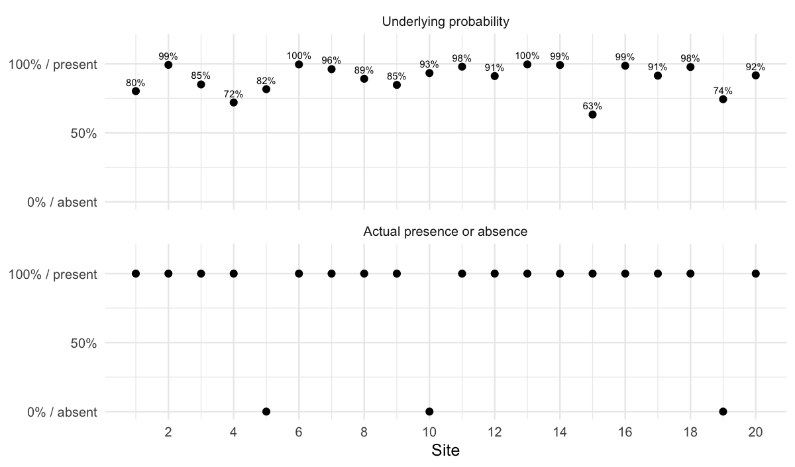
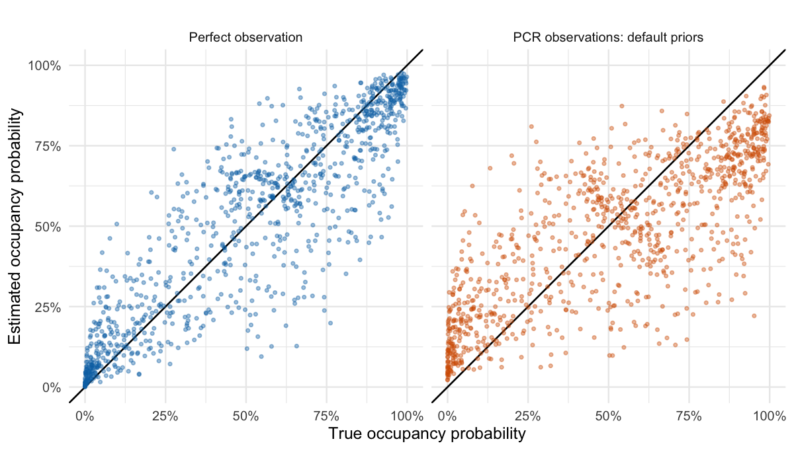
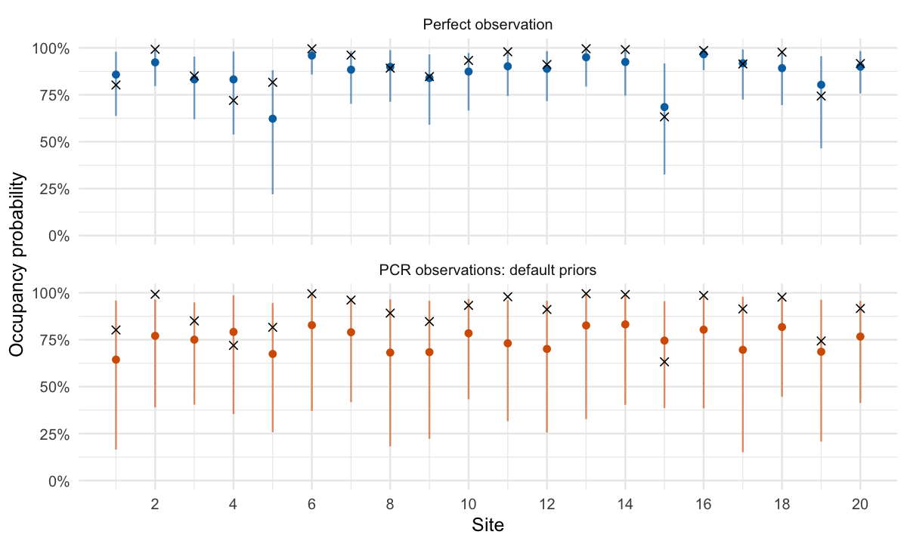
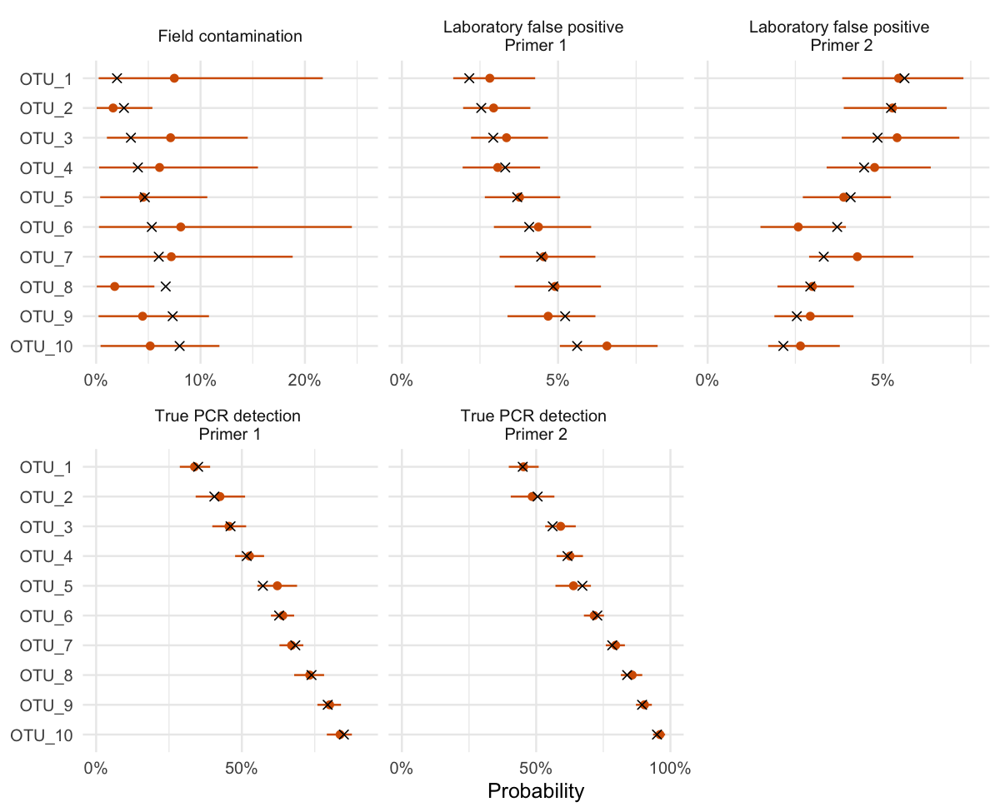
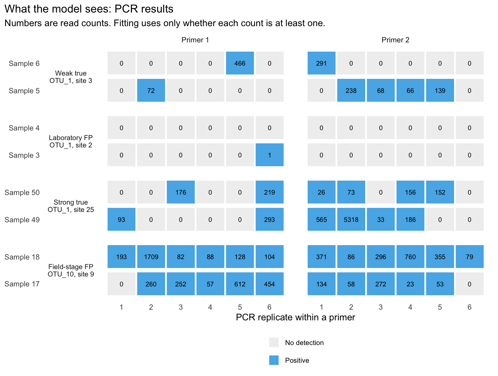
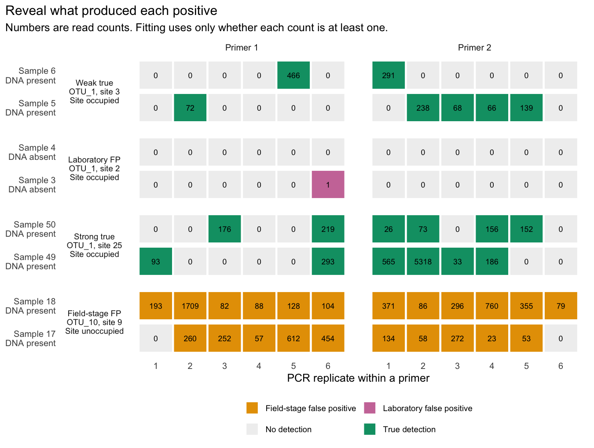

Learning occJSDM with a community whose truth we know
================

## What are we trying to learn?

Suppose we survey a community using environmental DNA. A species can be
present at a site without appearing in our samples. Its DNA can be in a
sample without appearing in every PCR. Conversely, contamination can
produce a positive result when the species is absent.

occJSDM connects these stages. This lesson asks two questions: **How
closely does it recover the underlying occupancy probabilities? When
does it believe a positive detection, and can that judgment be wrong?**

We use a simulated community so that we can reveal the answers. Truth is
used to check the fit; it is withheld from the model except in the
explicitly labelled perfect-observation control. Every number below is
calculated from this matching simulation and its fitted results. This is
one teaching dataset, not an estimate of performance across all
ecological surveys.

The example has:

- **100 sites and 10 species**, with two measured environmental
  gradients and two measured species traits;
- two hidden community factors describing additional variation among
  sites;
- **two independent field samples per site**;
- **two primers and six PCR replicates per primer per sample**;
- no spatial effects.

That is 200 field samples and 2,400 PCR observations for each species.
Environmental values are simulated quantities with arbitrary units. We
do not give them a real-world interpretation such as degrees Celsius.

## Three questions, three different truths

| Question | Model quantity | What we know from the simulation |
|----|----|----|
| How likely is this species to occur at this site? | Underlying occupancy probability, `psi` | A probability between 0 and 1. |
| Did it actually occur there? | Site state, `z` | Either absent (0) or present (1), drawn using that probability. |
| Was its DNA in this particular field sample? | Sample state, `w` | Either absent (0) or present (1), allowing collection failure and field-stage contamination. |

PCR results are a further observation of the sample state. They are not
the site state itself.

A true occupancy probability of 20% does not mean a species is “20%
present”. It means presence occurs in 20% of hypothetical repetitions
under those conditions. In the one realization we simulate, the species
is either present or absent. Even if someone tells us every true
presence and absence, we still have to estimate the probabilities that
produced them.

<figure>

<figcaption aria-hidden="true">Both panels show known truth for OTU_1 at
the first 20 sites. The lower panel is one binary realization of the
probabilities above. Neither panel shows a fitted estimate.</figcaption>
</figure>

## First give the JSDM perfect observations

We fit the JSDM to the actual simulated presence/absence matrix. This
control removes uncertainty about field collection and PCR, but retains
the need to estimate environmental relationships and hidden community
structure from binary data.

The following code is run from the repository root. The helper contains
the complete fixed simulation settings and seed; it does not search for
an easy dataset.

``` r
library(occJSDM)
source("dev/simstudy/vignette-lesson/helpers.R")
example <- make_lesson()
perfect_data <- lesson_binary_data(example)  # uses actual simulated z
set.seed(20260920)
perfect_fit <- runOccJSDM(
  perfect_data,
  occCovariates = c("X_psi.EnvCov.1", "X_psi.EnvCov.2"),
  listParams = list(n_factors = 2, n_lattrait = 1),
  spatCovariates = NULL,
  MCMCparams = list(nchain = 4, nburn = 3000, niter = 6000, nthin = 1)
)
```

## Now give occJSDM only the PCR observations

For the second fit, we supply the environmental and collection
covariates, traits and read counts. The model must infer which sites and
samples were actually occupied as well as estimate the underlying
probabilities. It receives exactly the same simulated community as the
perfect-observation fit.

``` r
set.seed(20260921)
fit <- runOccJSDM(
  example$sim$data_list,
  occCovariates = c("X_psi.EnvCov.1", "X_psi.EnvCov.2"),
  collCovariates = "X_theta",
  listParams = list(n_factors = 2, n_lattrait = 1),
  spatCovariates = NULL,
  threshold = 1,
  MCMCparams = list(nchain = 4, nburn = 3000, niter = 6000, nthin = 1)
)
```

<figure>

<figcaption aria-hidden="true">Each point represents one species at one
fitted site. The black diagonal is perfect recovery of the generating
occupancy probability. Points above it are overestimates; points below
it are underestimates. The sites are the same in both
panels.</figcaption>
</figure>

With perfect observations, the **mean absolute error is 11.0 percentage
points**. With PCR observations and default priors, it is **17.1
points**. Thus observation uncertainty adds error in this example, but
does not explain all of it.

To calculate absolute error, subtract truth from the estimate and ignore
the sign. An estimate of 35% for a true probability of 20% has an
absolute error of 15 percentage points. This is an arithmetic
illustration; the reported averages come from the simulation. Signed
error retains the sign, so positive and negative mistakes can cancel.

| Fit | True probability group | Species-site pairs | Mean truth | Mean estimate | Signed error (points) | Absolute error (points) |
|:---|:---|---:|:---|:---|:---|:---|
| Perfect observation | All | 1000 | 51.2% | 50.7% | -0.6 | 11.0 |
| Perfect observation | Below 20% | 257 | 6.5% | 12.8% | 6.2 | 7.4 |
| Perfect observation | 20% to 80% | 469 | 52.4% | 52.9% | 0.5 | 13.6 |
| Perfect observation | Above 80% | 274 | 91.2% | 82.4% | -8.8 | 9.8 |
| PCR observations: default priors | All | 1000 | 51.2% | 47.5% | -3.8 | 17.1 |
| PCR observations: default priors | Below 20% | 257 | 6.5% | 20.7% | 14.2 | 14.5 |
| PCR observations: default priors | 20% to 80% | 469 | 52.4% | 49.3% | -3.1 | 15.7 |
| PCR observations: default priors | Above 80% | 274 | 91.2% | 69.5% | -21.7 | 21.7 |

For example, among low-probability cases, the true probabilities average
6.5%, whereas the default two-stage estimates average 20.7%. Among
high-probability cases, the corresponding averages are 91.2% and 69.5%.
Averaging all errors together hides much of this pattern.

The scatterplot omits intervals to remain readable. Here are intervals
for the first 20 sites of OTU_1, selected by site number rather than fit
quality:

<figure>

<figcaption aria-hidden="true">Black points are generating
probabilities. Coloured points are posterior means and bars are 95%
credible intervals. Intervals describe uncertainty; they do not ensure
that the true value is recovered.</figcaption>
</figure>

These are fitted-site estimates. The hidden site factors have been
inferred using the observations at these sites. This is not a test of
prediction at new sites, and the generating probabilities are not
supplied to either fit.

## How does good practice enter the model?

Good field and laboratory practice gives us a reason to expect
contamination to be uncommon. occJSDM expresses that expectation through
**priors**, starting beliefs about plausible rates that are updated
using the observations. It does not inspect the protocol or prove that
the work was carried out carefully.

| Rate | What it means | Default starting expectation |
|----|----|----|
| `p` | Positive PCR when DNA is in the sample, separately for each species and primer. | Beta(5, 1): favours reasonably effective detection; prior mean 83.3%. |
| `q` | Positive PCR when DNA is absent from the sample, separately for each species and primer. | Beta(1, 20): favours uncommon laboratory false positives; prior mean 4.8%. |
| `theta0` | DNA enters a sample even though the species is absent from the site, separately for each species. | Beta(1, 20): favours uncommon field-stage false positives; prior mean 4.8%. |

The means are not fixed error rates or measurements of laboratory
quality. High true-detection probability is an additional assumption:
careful work does not prevent primer mismatch or inhibition. The priors
do not strictly require `p` to exceed `q`, and false positives are not
required to be weak.

An occasional stray positive is plausible without DNA in the sample.
Repeated positives are usually easier to explain with DNA present,
provided detection is appreciably more likely than a false positive.
Negative PCRs matter too. The model combines the whole pattern with
collection conditions and the ecological model, estimating rates and
hidden presence states together. There is no universal rule such as “one
positive is false; three positives are true”.

Here are the rates the model actually estimated, next to their known
generating values:

<figure>

<figcaption aria-hidden="true">Black crosses are the true rates for
positive read results. Orange estimates and 95% credible intervals come
from the default two-stage fit. Horizontal scales differ so that small
false-positive rates are readable. Laboratory rates differ by primer;
field-stage contamination has one rate per species.</figcaption>
</figure>

There is a small but important detail in this truth comparison. The
simulator first draws a laboratory detection event, then draws its read
count. Some events yield zero reads. The fitted `p` and `q` describe
**positive read results**, so the black crosses account for that extra
step. With this simulation’s false-positive read distribution, a nominal
event probability of 5% would produce positive reads about 4.32% of the
time. That 5% example explains the conversion; the plotted values use
each species’ actual simulated rate.

## Four examples: inspect the observations first

Each row below is one field sample. There are six PCR columns for each
of two primers. Numbers are read counts; blue cells are positive. At
threshold one, a count of 1 and a count of 1,000 both contribute a
single positive result to this model. “Strong evidence” therefore refers
to how detections recur across replicates, not how large an
above-threshold count is.

These four cases were selected from known truth and observed patterns
**before looking at fitted probabilities**. Weak true cases have one or
two positive PCRs in the focal sample; strong true cases have at least
six in the focal sample and at least three genuine positives in each of
two samples. For each category, the first case in species-name,
numeric-site and numeric-sample order was selected. The headings name
the teaching categories; the colours initially show only observed
results.

<figure>

<figcaption aria-hidden="true">These are actual rows from the simulated
dataset. Both field samples at each selected site are shown, including
the sample used to select the case. A positive PCR by itself does not
reveal its source.</figcaption>
</figure>

| Case | Species | Site | Focal sample | Positive PCRs | PCRs observed | Eligible samples |
|:---|:---|---:|---:|---:|---:|---:|
| Weak true detection | OTU_1 | 3 | 6 | 2 | 12 | 11 |
| Laboratory false positive | OTU_1 | 2 | 3 | 1 | 12 | 541 |
| Strong true detection | OTU_1 | 25 | 49 | 6 | 12 | 260 |
| Field-stage false positive | OTU_10 | 9 | 17 | 10 | 12 | 44 |

## Reveal the truth and compare it with the fit

<figure>

<figcaption aria-hidden="true">Green positives come from DNA collected
at an occupied site. Pink positives arise in a sample without the
species’ DNA. Orange positives amplify DNA in a field sample despite the
species being absent from the site. These labels come from the
simulation, not the fitted model.</figcaption>
</figure>

| Case | True site state | Estimated chance site was occupied | True focal sample state | Estimated chance DNA was in focal sample |
|:---|:---|:---|:---|:---|
| Weak true detection | Present | 94.9% | DNA present | 24.0% |
| Laboratory false positive | Present | 70.6% | DNA absent | 0.9% |
| Strong true detection | Present | 98.9% | DNA present | 100.0% |
| Field-stage false positive | Absent | 94.9% | DNA present | 100.0% |

**Weak true detection:** OTU_1 really occupied site 3 and its DNA was in
sample 6, but only two of the twelve PCRs from that sample were
positive. The model gives site presence 94.9% probability, but sample
presence only 24.0%. It therefore retains the genuine site occurrence
while tending to miss the DNA in this particular sample. This is a
useful example of the two questions receiving different answers, not a
wholly successful classification.

**Laboratory false positive:** sample 3 at site 2 did not contain OTU_1
DNA, yet one PCR was positive. The model assigns sample presence only
0.9% probability. However, OTU_1 really was present at the site, and the
model assigns site presence 70.6% probability. A false-positive PCR does
not require the species to be absent from the entire site. Collection
failure and a laboratory false positive can occur together.

**Strong true detection:** OTU_1 really occupied site 25. Both field
samples contain its DNA and repeated PCRs detect it. The fitted
probability of site presence is 98.9%, and the probability of DNA in the
focal sample is 100.0%. Here the strong evidence leads to the correct
interpretation.

**Field-stage false positive:** OTU_10 was absent from site 9, but the
simulation contaminated both field samples with its DNA. Sample 17 has
ten positive PCRs and sample 18 has twelve. The model correctly
concludes that the samples contain DNA, but incorrectly assigns site
presence 94.9% probability. Even independent low-probability
contamination events can occasionally coincide. This case was selected
by the stated rule, not because of the model’s mistake.

Thus, more PCRs can establish DNA presence in a tube, while independent
field samples provide additional evidence about occurrence at a site.
Neither type of replication guarantees a correct answer. Contamination
shared across field samples or laboratory batches could be harder still
if that dependence is not represented by the model.

Do not confuse these conditional site-presence probabilities with the
underlying occupancy probabilities. For OTU_10 at site 9, the generating
occupancy probability was 31.7%, and the fitted underlying probability
is 26.1%. The much higher conditional probability above answers a
different question: after seeing this site’s PCR results, how likely is
it that this particular site was occupied?

The model also considers **collection conditions**. Here is the
sample-level evidence for both field samples in each case. The
collection covariate is a simulated measurement in arbitrary units. The
true collection probability is calculated from that sample’s covariate
and the generating species coefficients, rather than substituted with an
average rate.

| Case | Sample | True DNA state | Fitted DNA probability | Collection covariate | True collection probability | Fitted collection probability |
|:---|---:|:---|:---|---:|:---|:---|
| Weak true detection | 5 | Present | 99.9% | -1.07 | 61.1% | 62.4% |
| Weak true detection | 6 | Present | 24.0% | 0.54 | 23.9% | 23.7% |
| Laboratory false positive | 3 | Absent | 0.9% | 1.65 | 9.4% | 9.5% |
| Laboratory false positive | 4 | Absent | 0.1% | 0.01 | 34.9% | 35.1% |
| Strong true detection | 49 | Present | 100.0% | -2.27 | 83.9% | 84.0% |
| Strong true detection | 50 | Present | 100.0% | -0.67 | 51.2% | 52.3% |
| Field-stage false positive | 17 | Present | 100.0% | -1.59 | 75.0% | 62.2% |
| Field-stage false positive | 18 | Present | 100.0% | 0.46 | 75.0% | 60.5% |

The last two columns answer: **if the species occupies the site, how
likely is DNA to enter this sample?** They are different from the fitted
probability that DNA actually entered the sample after considering its
PCR results. For the field-contamination case, the site was absent, so
the generating probability of DNA entering each sample was instead 8.0%,
the field false-positive rate for OTU_10.

For the weak true case, sample 5 has five positive PCRs and fitted
DNA-presence probability 99.9%; sample 6 has only two positives and
fitted DNA-presence probability 24.0%. The model can therefore remain
confident about the site while discounting sample 6. This interpretation
uses the other sample and the ecological model as well as the focal
sample’s PCRs; the simulation reveals that discounting sample 6 was a
mistake.

## What changes if we are less confident about low contamination?

We refit the **same observations**, changing only the priors on
laboratory and field-stage false-positive rates from Beta(1, 20), mean
4.8%, to Beta(1, 4), mean 20%. The true-detection prior is unchanged.
This is a stress test of the low-contamination assumption, not a
recommended replacement prior.

``` r
set.seed(20260922)
alternative_fit <- runOccJSDM(
  example$sim$data_list,
  occCovariates = c("X_psi.EnvCov.1", "X_psi.EnvCov.2"),
  collCovariates = "X_theta",
  listParams = list(n_factors = 2, n_lattrait = 1),
  spatCovariates = NULL, threshold = 1,
  listPriors = list(a_q = 1, b_q = 4, a_theta0 = 1, b_theta0 = 4),
  MCMCparams = list(nchain = 4, nburn = 6000, niter = 12000, nthin = 1)
)
```

<figure>

<figcaption aria-hidden="true">Each estimate is a posterior probability
about an actual 0/1 state. Black crosses reveal those states. The two
coloured points use exactly the same PCR observations but different
contamination priors. These probabilities are not estimates of the
generating occupancy probability.</figcaption>
</figure>

The field-stage false-positive case still receives 90.8% probability of
site presence under the alternative priors. Allowing more contamination
does not make this case unambiguous. Across all 1,000 species-site
pairs, mean absolute occupancy error changes from 17.1 to 19.2
percentage points. The alternative priors therefore worsen overall
recovery in this dataset. They were not tuned to get the desired
answers.

To put the four examples in perspective, the next table uses **every
field sample with at least one positive PCR**, including both primers.
Cases are grouped by their known source category. The estimated sample
and site probabilities answer different questions, so their
corresponding true frequencies are shown separately. Averages can still
conceal errors in individual cases.

| Category | Samples | Actually contained DNA | Mean fitted DNA probability | Actually occupied sites | Mean fitted site probability |
|:---|---:|:---|:---|:---|:---|
| Field-stage false positive | 44 | 100.0% | 99.6% | 0.0% | 67.6% |
| Laboratory false positive | 541 | 0.0% | 2.2% | 31.6% | 30.1% |
| True detection | 536 | 100.0% | 97.2% | 100.0% | 91.2% |

This table counts species-sample pairs, so the same species-site can
occur twice. It describes these simulated positive samples, not a
universal false-positive rate for occJSDM. The simulation’s source
labels also do not exhaust every contamination mechanism possible in a
real survey.

## Are the calculations stable enough to interpret?

The perfect-observation and default-prior fits each use four chains,
3,000 burn-in iterations and 6,000 retained draws per chain. The
alternative-prior fit initially used the same schedule. Its
field-contamination rate for OTU_6 mixed more slowly, so we extended
that fit to 6,000 burn-in and 12,000 retained draws per chain. Both
versions are retained in the build archive.

Rhat compares the chains; values close to one are desirable. Effective
sample size estimates how much independent information their correlated
draws contain. These are checks on numerical sampling, not checks that
the model’s biological conclusions are correct.

| Fit | Largest parameter Rhat | Smallest parameter ESS | Largest occupancy-probability Rhat | Parameters above Rhat 1.01 |
|:---|---:|---:|---:|---:|
| Perfect observation | 1.002 | 2096.978 | 1.002 | 0 |
| PCR observations: default priors | 1.008 | 940.025 | 1.007 | 0 |
| PCR observations: more permissive FP priors | 1.014 | 360.945 | 1.009 | 2 |

The parameter checks cover occupancy intercepts and slopes, collection
coefficients and detection/error rates. The occupancy-probability checks
also examine the combined contribution of the hidden factors. They do
not establish convergence of every latent-factor coordinate or every
possible derived quantity. Any remaining warnings must be considered
alongside the results. The large recovery errors and the
field-contamination mistake remain substantive lessons even when chains
agree well.

After the extension, 2 parameters in the alternative-prior fit remain
above the Rhat 1.01 screen, with a maximum of 1.014. The smallest
parameter effective sample size is 361, below the commonly used screen
of 400. Treat small differences under those alternative priors
cautiously; we do not claim that every parameter has fully converged.

## Reproduce the lesson and inspect its evidence

The figures are rendered from a compact saved bundle, not refitted while
knitting the vignette. The bundle retains the complete simulation,
generating inputs, case-selection rules, posterior summaries, source
hashes, seeds, diagnostics and the hashes of the full fits. The original
package examples `sampledata` and `sampleresults` are separate and are
not used here.

The fitted code is revision **b53048a**. The simulation seed is
**20260919**. The recorded R version is **R version 4.5.0
(2025-04-11)**; the complete package versions for each fit are retained
in `lesson$manifests[["default"]]$session` (and likewise for the other
fits). Instructions for regenerating the full fits and this compact
bundle are in [the lesson build
README](../dev/simstudy/vignette-lesson/README.md). The compact bundle
is
[teaching-data/nonspatial-lesson.rds](teaching-data/nonspatial-lesson.rds).
Figure code is in this vignette’s `.Rmd` source.

This first lesson concerns non-spatial recovery at sampled sites and the
interpretation of detections. It does not validate predictions at new
sites, establish a beta-release error target, or implement a Paper2Agent
interface. The broader tutorial design will add environmental and trait
interpretation, **variation partitioning**, spatial examples and
held-out prediction, each with its own matching truth comparison. The
[reference walkthrough](occJSDM.html) provides the existing function
tour while those lessons are developed.
