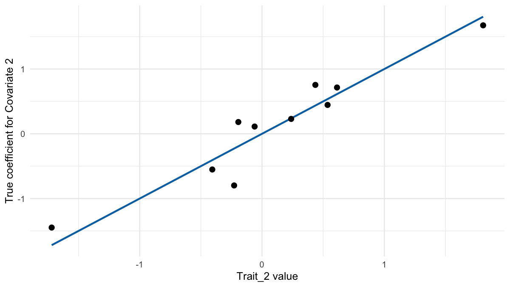
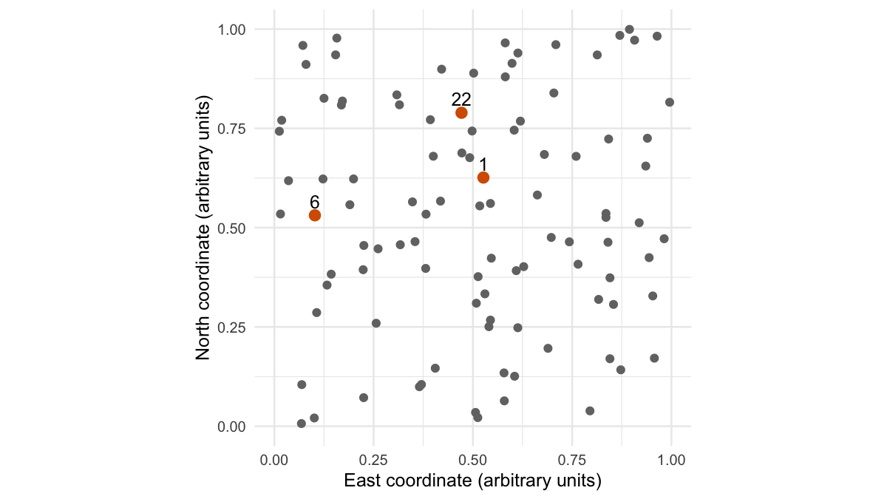
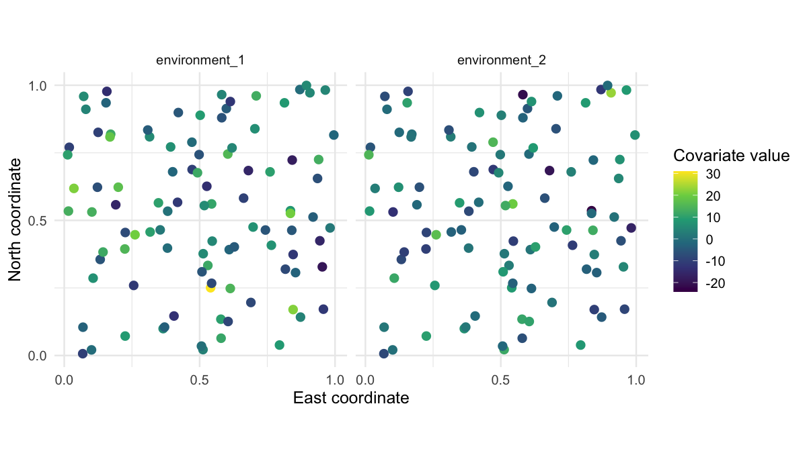
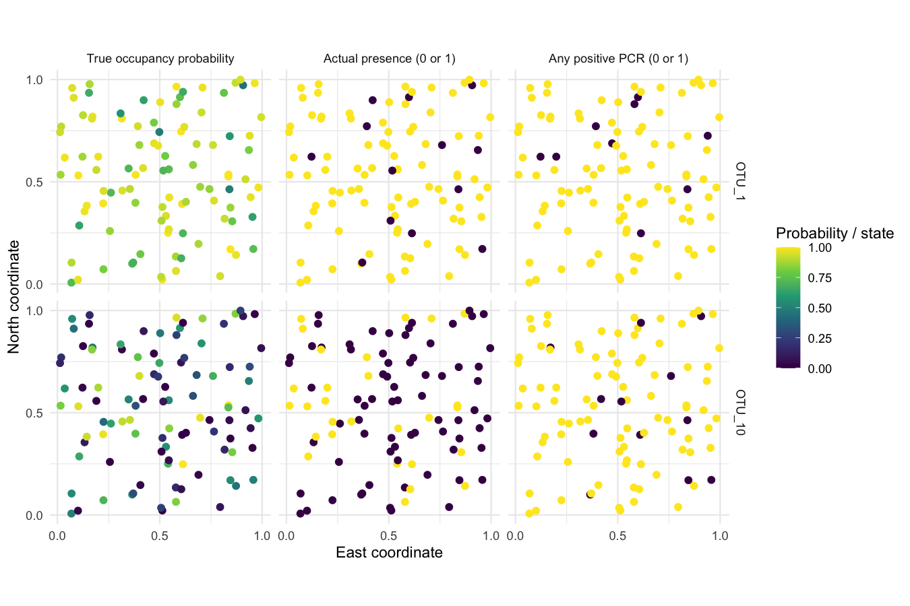
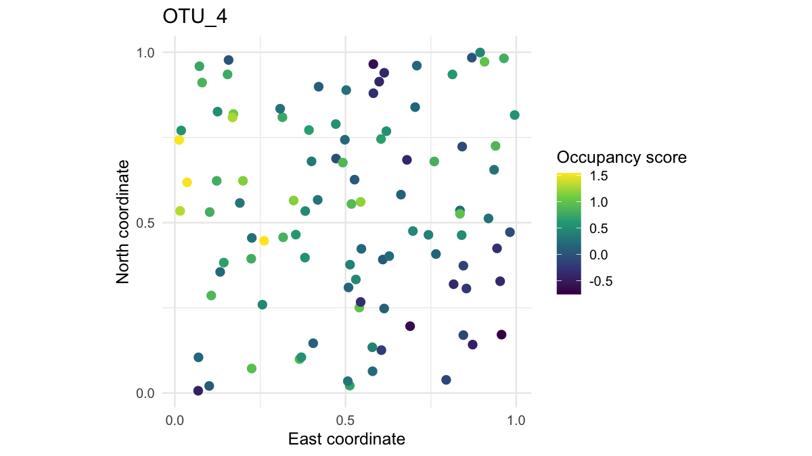

Lesson 0 (optional): Create and explore a simulated survey
================

## Where this lesson fits

We will learn occJSDM using a community whose true distribution is known. A real survey never reveals which sites a species truly occupies, so it cannot show whether a model’s answers are right. A simulation keeps those answers, so every estimate the model makes can be checked against the truth that generated the data. occJSDM estimates which species occupy which sites from eDNA surveys. It allows for false negatives (from imperfect field collection, imperfect PCR detection or both) and for false positives (from contamination in the field, in the lab or both). The [quickstart](occJSDM.md) shows a first fit on the package’s example data. This lesson creates and explores the survey, and [Lesson 2](occJSDM-lesson-2.md) fits the model. [Lesson 1](occJSDM-lesson-1.md) works through, by hand, what an occupancy model and a joint species distribution model do; it is the first required lesson, so every reader starts there, before Lesson 2.

You can skip Lesson 0 and start Lesson 2 with the supplied dataset. Read this lesson if you want to understand where that dataset came from, change the simulation settings, or learn how to prepare the tables and figures yourself.

This survey has no spatial structure. Its sites have coordinates, which let us draw maps, but location does not generate its environmental values or enter its fitted model. That makes it a good place to start: the model’s answers can be checked without also asking whether it has captured a spatial pattern. The spatial lesson deliberately changes that.

## Load the teaching data and the R tools

The teaching data are in the occJSDM repository, not in the installed package, so first clone or download [the repository from GitHub](https://github.com/AlexDiana/occJSDM). Run the code with the repository’s `vignettes` directory as your working directory. Knitting this document uses that directory automatically. In RStudio, opening the `.Rmd` file and choosing **Session \> Set Working Directory \> To Source File Location** gives the same starting point for running chunks interactively.

**What this lesson assumes you know.** The code uses base R and the tidyverse: the pipe `|>`, and from dplyr and tidyr the verbs listed below. If any are new, the two chapters of R for Data Science on [data transformation](https://r4ds.hadley.nz/data-transform) and [data tidying](https://r4ds.hadley.nz/data-tidy) teach everything used here in an afternoon. Operations that are unusual, such as joining two tables on species identity, are explained where they appear.

- `select()` and `pull()` to choose columns, or to take one column out as a vector.
- `filter()`, `distinct()`, `arrange()`, `slice_head()` and `slice_sample()` to keep, deduplicate, order and pick rows, including a random pick.
- `mutate()`, `transmute()` and `case_when()` to add or recode columns (`transmute()` keeps only the new ones), and `group_by()`, `summarise()` and `count()` to summarise or count by group.
- `bind_cols()` to put two tables side by side, and `left_join()` and `anti_join()` to combine tables on shared identifiers, or to drop the rows that match.
- `pivot_longer()` to move from one column per measurement to one row per measurement.

``` r
library(dplyr)
library(tidyr)
library(tibble)
library(ggplot2)

lesson <- readRDS("teaching-data/nonspatial-lesson.rds")

simulation <- lesson$input$sim
survey_data <- simulation$data_list
known_truth <- simulation$true_params

format_percent <- function(probability, digits = 1) {
  paste0(formatC(100 * probability, format = "f", digits = digits), "%")
}
```

`format_percent()` prints probabilities as percentages in the text. Here is what the saved file holds.

``` r
names(lesson)
```

    #>  [1] "schema"                    "input"                    
    #>  [3] "observations"              "cases"                    
    #>  [5] "cells"                     "groups"                   
    #>  [7] "rates"                     "samples"                  
    #>  [9] "diagnostics"               "manifests"                
    #> [11] "input_md5"                 "summary_source_hashes"    
    #> [13] "reconstruction_difference"

``` r
str(survey_data, max.level = 1)
```

    #> List of 3
    #>  $ info  :'data.frame':  3600 obs. of  8 variables:
    #>  $ OTU   : num [1:3600, 1:10] 0 0 0 0 0 0 0 1 0 0 ...
    #>   ..- attr(*, "dimnames")=List of 2
    #>  $ traits: num [1:10, 1:2] 0.088 0.421 -0.204 1.41 0.018 ...
    #>   ..- attr(*, "dimnames")=List of 2

``` r
names(known_truth)
```

    #> [1] "jsdmParams_true" "beta_theta_true" "z_true"          "w_true"         
    #> [5] "p_true"          "q_true"

`lesson` is the saved file that Lesson 2 also reads. `input` holds the simulation, and `cases` the four detection examples that Lesson 2 selected. Most of the other components summarise Lesson 2’s model fits, which this lesson does not use. `survey_data` is what the two-stage model receives: the three tables `info`, `OTU` and `traits`, which “Understand the three input objects” describes. `known_truth` is what the simulation knew and the model never sees. `z_true` records whether each species truly occupies each site, and `w_true` whether its DNA truly entered each field sample. `jsdmParams_true` holds the ecological model’s coefficients and each site’s true occupancy score for each species. `beta_theta_true` holds the collection coefficients, and `p_true` and `q_true` the laboratory rates. “Decide how collection and PCR can fail” explains the two-stage process that these truths describe.

occJSDM takes the read counts as a matrix with one column per species, which is how `survey_data$OTU` stores them. To explore the observations we reshape a copy into a long table, with one row per species and PCR.

## Specify the survey, one decision at a time

First give the sampling decisions meaningful names. These are the actual settings of the saved teaching dataset.

``` r
n_sites <- 100
n_species <- 10
samples_per_site <- 3
n_primers <- 2
pcrs_per_primer <- 6

n_field_samples <- n_sites * samples_per_site
n_pcr_observations <- n_field_samples * n_primers * pcrs_per_primer

tibble(
  quantity = c("Sites", "Species", "Field samples", "PCR reactions"),
  number = c(n_sites, n_species, n_field_samples, n_pcr_observations)
)
```

    #> # A tibble: 4 × 2
    #>   quantity      number
    #>   <chr>          <dbl>
    #> 1 Sites            100
    #> 2 Species           10
    #> 3 Field samples    300
    #> 4 PCR reactions   3600

There are 300 field samples and 3,600 PCR reactions. As in metabarcoding, each reaction yields a read count for every species, so there are not separate PCRs for each species. Six PCR replicates means **six per primer per field sample**, not six divided between the two primers.

These numbers are a choice made for teaching. One hundred sites and ten species make a community small enough for the lessons to display every site and species. Three field samples per site matches the quickstart’s `sampledata`. Field replication is what lets the model weigh a sample’s positive against the site’s other samples. [Lesson 2’s appendix](occJSDM-lesson-2.md#why-the-survey-has-three-field-samples-per-site) records why two samples per site were not enough. Two primers with six PCRs each give every sample 12 PCRs, many repeated laboratory results from which to learn the laboratory rates. On your own survey these numbers are whatever your field and laboratory design produced; you do not choose them for occJSDM.

The simulator uses shorter argument names. This list translates our decisions into its interface. `M` and `K` are vectors rather than single numbers. `M` holds the number of field samples at each site, and `K` the number of PCRs for each combination of field sample and primer. `K` runs through the samples in order, with each sample’s primers together. Vectors are what allow unequal replication, which “Unequal numbers of field samples” prepares. Here every value of `K` is six, so their order does not matter. A **trait** is a measured property of each species, such as body size. An **occupancy covariate** describes the habitat at a site, such as water temperature. A **collection covariate** describes how each field sample was taken, such as the volume of water filtered. It changes how likely a sample is to capture DNA, not whether the species is there.

``` r
survey_settings <- list(
  n = n_sites,
  S = n_species,
  g = 2,                         # Two measured traits per species.
  M = rep(samples_per_site, n_sites),
  P = n_primers,
  K = rep(pcrs_per_primer, n_field_samples * n_primers),
  ncov_psi = 2,                   # Two environmental covariates per site.
  ncov_theta = 1                  # One collection covariate per field sample.
)

str(survey_settings)
```

    #> List of 8
    #>  $ n         : num 100
    #>  $ S         : num 10
    #>  $ g         : num 2
    #>  $ M         : num [1:100] 3 3 3 3 3 3 3 3 3 3 ...
    #>  $ P         : num 2
    #>  $ K         : num [1:600] 6 6 6 6 6 6 6 6 6 6 ...
    #>  $ ncov_psi  : num 2
    #>  $ ncov_theta: num 1

`M` has 100 values, one per site, and `K` has 600, one per field sample and primer; the other settings are single numbers.

## Decide how collection and PCR can fail

An eDNA survey is a **two-stage process**: DNA is collected in the field, then detected by PCR in the laboratory. Each stage can go wrong in two ways. In the field, a species either occupies a site or not, and each field sample either captures its DNA or not. Collection can miss a species that is present, which is a **false negative**. It can also pick up the species’ DNA when the species is absent from the site, for example from equipment used at another site. That is a **field-stage false positive**. In the laboratory, a PCR can miss DNA that is in the sample, another false negative. It can also report DNA that is not there, through contamination in the laboratory, which is a **laboratory false positive**. The simulator gives each of these events a probability:

- `theta`, the collection probability: the probability that a field sample captures the species’ DNA when the species occupies the site. A collection failure, a false negative at the field stage, has probability `1 - theta`.
- `theta0`: the probability that the species’ DNA enters a field sample although the species does not occupy the site, the field-stage false positive.
- `p`: the probability that a PCR detects the species when its DNA is in the sample. A PCR failure, a false negative at the laboratory stage, has probability `1 - p`.
- `q`: the probability that a PCR reports the species when its DNA is not in the sample, the laboratory false positive.

[Lesson 1](occJSDM-lesson-1.md#what-an-occupancy-model-does) shows the one-stage version of this process, with a single detection probability and no false positives. [Lesson 2](occJSDM-lesson-2.md#three-questions-three-different-truths) explains the full model.

We deliberately let species differ in how reliably they are collected and detected. For example, the probability that primer 1 detects DNA in the sample rises from 0.35 to 0.85 across the ten species. The second primer has somewhat higher probabilities. These are assigned simulation settings, not findings about real primers.

``` r
primer_1_detection <- seq(0.35, 0.85, length.out = n_species)
primer_2_detection <- pmin(0.95, primer_1_detection + 0.10)

observation_settings <- list(
  p = rbind(primer_1_detection, primer_2_detection),
  q = rbind(
    seq(0.025, 0.065, length.out = n_species),
    seq(0.065, 0.025, length.out = n_species)
  ),
  theta0 = seq(0.02, 0.08, length.out = n_species),
  theta_baseline = seq(0.35, 0.75, length.out = n_species),
  mu1 = 5,
  sigma1 = 1,
  mu0 = 1.5,
  sigma0 = 1
)

str(observation_settings)
```

    #> List of 8
    #>  $ p             : num [1:2, 1:10] 0.35 0.45 0.406 0.506 0.461 ...
    #>   ..- attr(*, "dimnames")=List of 2
    #>   .. ..$ : chr [1:2] "primer_1_detection" "primer_2_detection"
    #>   .. ..$ : NULL
    #>  $ q             : num [1:2, 1:10] 0.025 0.065 0.0294 0.0606 0.0339 ...
    #>  $ theta0        : num [1:10] 0.02 0.0267 0.0333 0.04 0.0467 ...
    #>  $ theta_baseline: num [1:10] 0.35 0.394 0.439 0.483 0.528 ...
    #>  $ mu1           : num 5
    #>  $ sigma1        : num 1
    #>  $ mu0           : num 1.5
    #>  $ sigma0        : num 1

`p` and `q` are matrices with one row per primer and one column per species. `theta0` and `theta_baseline` have one value per species, and the four read-count settings are single numbers. The settings have these meanings:

- `p`: the probability of a laboratory detection event when the species’ DNA is in the sample, for each primer and species.
- `q`: the probability of a laboratory false-positive event when the DNA is absent from the sample, for each primer and species.
- `theta0`: the probability that DNA enters a sample although the species is absent from the site, for each species.
- `theta_baseline`: the collection probability `theta` at a collection-covariate value of zero, given that the species occupies the site. The actual collection probability also varies with that covariate. The simulator draws each species’ slope on the covariate itself, and `known_truth$beta_theta_true` holds the slopes it drew.
- `mu1` and `sigma1`: the mean and standard deviation, on the log-read scale, of the read count from a true detection event.
- `mu0` and `sigma0`: the same for a laboratory false-positive event.

These settings make OTU_1 the hardest species to detect. It has the lowest collection probability at baseline (0.35) and the lowest PCR detection probability on both primers (0.35 and 0.45). OTU_10 is the easiest, at 0.75, 0.85 and 0.95. The maps below compare the two species. `pmin(0.95, ...)` caps primer 2’s probabilities at 0.95. No value exceeds the cap with these settings, but the cap keeps every probability valid if you raise the first line. The two primers’ `q` run in opposite directions across the species, so no species has a high laboratory false-positive rate on both primers. `theta0` rises across the species, so field contamination is commonest for OTU_10.

The simulator turns each event into a read count. It draws a value on the log-read scale, converts it with `round(exp(log_read) - 1)` and sets negative counts to zero. A true detection event therefore gives about 147 reads at the median, and a laboratory false-positive event about 3. A field-stage false positive gives as many reads as a true detection, because its sample really holds the species’ DNA. An event can also produce zero reads, when the draw falls below `log(1.5)`. With these settings that almost never happens to a true detection event (0.0002% of them), but it happens to 13.7% of laboratory false-positive events, about one in 7. The fitted model uses positive or negative results at a threshold. Its `p` and `q` must therefore be compared with the probability of a **threshold-positive result**, not simply with these event probabilities. Here the probability of a threshold-positive laboratory false positive is about 86% of the `q` set above. Lesson 2 compares its fitted rates with these threshold-positive truths.

occJSDM assumes that the survey was run with good field and laboratory practice, so that contamination, and therefore false positives, are infrequent. It expresses this through its **priors**, the starting beliefs about plausible rates that the observations then update. The default priors on `q` and `theta0` are both Beta(1, 20), which has mean 1/(1 + 20), about 4.8%, and puts 95% of its weight below 13.9%. This simulation’s contamination rates are chosen inside that assumption: `q` runs from 2.5% to 6.5%, and `theta0` from 2.0% to 8.0%. Lesson 2 explains [how good practice enters the model](occJSDM-lesson-2.md#how-does-good-practice-enter-the-model) and [stress-tests the assumption](occJSDM-lesson-2.md#what-changes-if-we-are-less-confident-about-low-contamination) by refitting with priors that expect more contamination.

## Specify the ecological model

The ecological model sets each species’ occupancy probability at each site. On the logit scale it adds three parts: the species’ baseline, its responses to the site’s environmental covariates, and the effects of a few hidden site factors. The inverse logit then turns the sum into a probability. Each species’ responses to the environment are built from its traits, measured and unmeasured, plus a remainder of its own. A hidden site factor is a simulated site characteristic that affects several species but is not supplied as a measured environmental column. It need not represent a particular biological mechanism. Because several species respond to the same hidden factors, they occur together more or less often than the measured environment predicts. These are the associations between species that a joint species distribution model estimates, and the number of factors is what the quickstart’s `n_factors` sets. [Lesson 1](occJSDM-lesson-1.md#what-a-joint-model-does) explains them by hand.

``` r
ecological_settings <- list(
  gt = 1,                        # One unmeasured trait per species.
  d = 2,                         # Two hidden site factors.
  ds = 0,                        # Spatial setting, off here; see the appendix.
  sigma_b = 0.5,                  # Spread of environmental responses beyond traits.
  sigma_bs = 0.5,                 # No effect: the simulator never draws with it.
  sigma_ts = 0.5,                 # No effect: the simulator never uses it.
  sigma_h = 1,                    # Spread of the hidden site factors.
  sigma_s = 0.5,                  # Spatial setting, off here; see the appendix.
  l_s = 0.3,                      # Spatial setting, off here; see the appendix.
  tau = rep(1, n_species),         # Required setting, unused for binary occupancy.
  useSpatField = FALSE
)

str(ecological_settings)
```

    #> List of 11
    #>  $ gt          : num 1
    #>  $ d           : num 2
    #>  $ ds          : num 0
    #>  $ sigma_b     : num 0.5
    #>  $ sigma_bs    : num 0.5
    #>  $ sigma_ts    : num 0.5
    #>  $ sigma_h     : num 1
    #>  $ sigma_s     : num 0.5
    #>  $ l_s         : num 0.3
    #>  $ tau         : num [1:10] 1 1 1 1 1 1 1 1 1 1
    #>  $ useSpatField: logi FALSE

`tau` is the only setting with one value per species; every other setting is a single number or a switch. `gt = 1` gives each species one unmeasured trait, a property not in the trait table that also shapes how it responds to the environment. Two hidden factors and one unmeasured trait are a choice made for this simulation, and Lesson 2 fits the model with the matching `n_factors = 2` and `n_lattrait = 1`. `sigma_b` sets how differently species respond to the same environment beyond what their traits predict: a larger value makes their responses more varied. `sigma_h` sets how much the hidden factors vary between sites: a larger value makes them matter more for occupancy, and so strengthens the associations between species.

The most important choice for this lesson is `useSpatField = FALSE`: there is no simulated spatial field and no dispersal process. The simulator still draws site coordinates, whether or not the field is on, which is why the sites can be mapped below. `ds`, `sigma_s` and `l_s` set the spatial field, so they have no effect while the switch is off; [the appendix](#simulate-a-survey-with-a-spatial-field) shows how to switch it on. `sigma_bs` and `sigma_ts` are accepted but have no effect. The simulator has no residual spatial coefficients to draw with `sigma_bs`, and it passes `sigma_ts` on without using it, so leaving both out gives the same survey.

## How traits build each species’ responses

A species’ **coefficient** for an environmental covariate says how its occupancy score changes as that covariate rises. It is positive if the species does better at higher values and negative if it does worse. The simulator standardises each covariate before using it, so a coefficient is the change in the score, on the logit scale, per standard deviation of the covariate. The coefficients are not drawn independently for each species. Each species’ coefficients are the sum of three parts. The first is its measured traits multiplied by a **trait-effect matrix** `G`. The second is its unmeasured traits `A` multiplied by their own effect matrix `C`, and the third is a remainder of its own, `Bt`. In matrix form, with `Tr` the trait table:

`B = t(Tr %*% G + A %*% C + Bt)`

`t()` turns the sum around so that `B` has one row per covariate and one column per species. The simulator, `simulateData()` in `R/jsdmfun.R`, draws each part as follows:

- `G`: each entry is -1, 0 or 1, chosen at random. A measured trait therefore lowers, does not change or raises a species’ response to a covariate, by one unit for each unit of the trait. The traits themselves are drawn from a standard normal distribution, so a trait value of 1 is one standard deviation above the average species.
- `A`: each species’ values of its unmeasured traits, drawn from a standard normal distribution, with one column for each of the `gt` unmeasured traits.
- `C`: the effects of the unmeasured traits, drawn like `G`, except that its diagonal is set to 1 and the entries below it to 0. The first unmeasured trait therefore always raises the response to the first covariate.
- `Bt`: the remainder, drawn from a normal distribution with standard deviation `sigma_b`. Together with the unmeasured traits, it is why two species with identical measured traits can still respond differently.

The saved truth holds every part. Here are `G` and `C` for this survey, labelled with the traits and covariates they connect.

``` r
jsdm_truth <- known_truth$jsdmParams_true
Tr <- as.matrix(survey_data$traits)
covariate_names <- c("Covariate 1", "Covariate 2")

trait_effects <- jsdm_truth$G
dimnames(trait_effects) <- list(colnames(Tr), covariate_names)
trait_effects
```

    #>         Covariate 1 Covariate 2
    #> Trait_1          -1           0
    #> Trait_2          -1           1

``` r
unmeasured_effects <- jsdm_truth$C
dimnames(unmeasured_effects) <- list("Unmeasured trait", covariate_names)
unmeasured_effects
```

    #>                  Covariate 1 Covariate 2
    #> Unmeasured trait           1           0

``` r
describe_effect <- function(entry) c("lowers", "does not change", "raises")[entry + 2]
```

Covariate 1 and Covariate 2 are the two environmental covariates mapped below, the columns `X_psi.EnvCov.1` and `X_psi.EnvCov.2` of `info` that “Understand the three input objects” describes. In this survey `Tr` is 10 species by 2 traits, and `G` is 2 traits by 2 covariates. `A` is 10 species by 1 unmeasured trait, and `C` is 1 by 2. `Bt` and the sum are 10 species by 2 covariates. Read `G` one row at a time. Trait_1 lowers the response to Covariate 1 and does not change the response to Covariate 2. Trait_2 lowers the response to Covariate 1 and raises the response to Covariate 2. In `C`, the unmeasured trait raises the response to Covariate 1 and does not change the response to Covariate 2.

To check that this formula is exactly what generated the survey, rebuild the coefficients from their parts and compare them with the saved ones.

``` r
rebuilt_B <- with(jsdm_truth, t(Tr %*% G + A %*% C + Bt))

# The rebuilt matrix carries species names from the trait table; the saved one has none.
all.equal(unname(rebuilt_B), jsdm_truth$B)
```

    #> [1] TRUE

`all.equal()` returns `TRUE`: the three parts add up to the coefficients that set every species’ occupancy probability in this survey.

How visible is the trait part in the coefficients? The chunk below picks a covariate and a measured trait that acts on it, preferring a covariate on which only one measured trait acts. It plots each species’ true coefficient for that covariate against its value of the trait. The line beside the points is that trait’s part alone, its `G` entry times the trait value.

``` r
# Prefer the covariate on which the fewest measured traits act (at least one).
traits_acting <- colSums(jsdm_truth$G != 0)
stopifnot(any(traits_acting > 0))
candidates <- which(traits_acting > 0)
shown_covariate <- candidates[which.min(traits_acting[candidates])]
shown_trait <- which(jsdm_truth$G[, shown_covariate] != 0)[1]
trait_slope <- jsdm_truth$G[shown_trait, shown_covariate]

# Is the trait's part the only systematic part of this coefficient?
only_this_trait <- traits_acting[shown_covariate] == 1 &&
  all(jsdm_truth$C[, shown_covariate] == 0)
untouched_traits <- colnames(Tr)[jsdm_truth$G[, shown_covariate] == 0]

trait_scatter <- tibble(
  species = rownames(Tr),
  trait_value = Tr[, shown_trait],
  coefficient = jsdm_truth$B[shown_covariate, ],
  trait_prediction = trait_slope * Tr[, shown_trait]
)

ggplot(trait_scatter, aes(x = trait_value)) +
  geom_line(aes(y = trait_prediction), colour = "#0072B2", linewidth = 1) +
  geom_point(aes(y = coefficient), size = 2.5) +
  labs(
    x = paste(colnames(Tr)[shown_trait], "value"),
    y = paste("True coefficient for", covariate_names[shown_covariate])
  ) +
  theme_minimal(base_size = 12)
```

<figure>

<figcaption aria-hidden="true">Each point is one species: its true coefficient for the covariate against its value of a measured trait that acts on it. The line is that trait’s part of the coefficient alone. The vertical gaps between the points and the line are the parts of the coefficient that this trait does not explain.</figcaption>
</figure>

The chunk picks Covariate 2 and Trait_2, whose `G` entry is 1, so the line has slope 1. The points rise with the line, because the sign of the slope follows the `G` entry. They scatter around it because the other parts add to each species’ coefficient. Here no other measured trait and no unmeasured trait acts on this covariate, so the gaps are the remainder alone. Trait_1 has a `G` entry of 0 for this covariate. Plotted against it, the coefficients would vary only through parts that do not involve that trait, and no trend would be expected.

This is the structure that `runOccJSDM()` estimates when it is given a trait table and `n_lattrait`, the number of unmeasured traits. A survey of ten species gives few points from which to learn `G`, and [Lesson 3’s trait section](occJSDM-lesson-3.md#traits-ask-a-harder-different-question) asks how well it can be recovered.

## Recreate the dataset if you want to

The simulator draws the environmental values, traits, coefficients and hidden factors using the settings above. It then calculates occupancy probabilities and draws actual presence or absence from those probabilities. The seed set in the chunk below was not picked to make the fit look good, because a seed chosen that way would mislead you about how well the model works.

The following optional chunk shows the simulator call itself. It is displayed but not run when knitting, because the figures use the saved simulation. To recreate the data yourself, run the chunk with occJSDM installed. It does not fit a model. `model = "two_stage"` asks for PCR read counts. The simulator can also produce `"occupancy"` data, with one record per field sample and no PCR stage, and `"binary"` presence/absence data, like the presence/absence case described in the quickstart.

``` r
library(occJSDM)

set.seed(20260919)

new_simulation <- simulateOccJSDMData(
  list_datasettings = survey_settings,
  list_params = observation_settings,
  list_jsdmParams = ecological_settings,
  model = "two_stage"
)

new_survey_data <- new_simulation$data_list
new_known_truth <- new_simulation$true_params

# Label the truth matrices explicitly, as in the saved teaching dataset.
site_ids <- as.character(seq_len(n_sites))
sample_ids <- as.character(seq_len(n_field_samples))
species_ids <- colnames(new_survey_data$OTU)

dimnames(new_known_truth$z_true) <- list(site_ids, species_ids)
dimnames(new_known_truth$w_true) <- list(sample_ids, species_ids)
dimnames(new_known_truth$jsdmParams_true$eta) <- list(site_ids, species_ids)
```

The last block labels the truth matrices with site, sample and species IDs, as in the saved dataset, because the joins below match truth to observations by those identifiers.

If you change a setting, the old fitted results no longer belong to your new dataset: fit it again before comparing estimates with truth. Simply replacing a covariate column after simulation would also break the match between observations and their generating model. The appendix records the package revision and seed of the saved simulation, and the R version recorded with the matching fits.

## Understand the three input objects

occJSDM receives three tables, and your own data must take the same form: `info` describes each PCR reaction, `OTU` holds its read counts, and `traits` describes each species.

``` r
observation_info <- as_tibble(survey_data$info)
read_counts <- as_tibble(survey_data$OTU)

species_traits <- survey_data$traits |>
  as.data.frame() |>
  rownames_to_column("species") |>
  as_tibble()

observation_info |>
  slice_head(n = 6) |>
  knitr::kable(digits = 2)
```

| Site | Sample | Primer | X_psi.EnvCov.1 | X_psi.EnvCov.2 | Xs.1 | Xs.2 | X_theta |
|-----:|-------:|-------:|---------------:|---------------:|-----:|-----:|--------:|
|    1 |      1 |      1 |         -13.96 |          -2.28 | 0.53 | 0.63 |    0.05 |
|    1 |      1 |      1 |         -13.96 |          -2.28 | 0.53 | 0.63 |    0.05 |
|    1 |      1 |      1 |         -13.96 |          -2.28 | 0.53 | 0.63 |    0.05 |
|    1 |      1 |      1 |         -13.96 |          -2.28 | 0.53 | 0.63 |    0.05 |
|    1 |      1 |      1 |         -13.96 |          -2.28 | 0.53 | 0.63 |    0.05 |
|    1 |      1 |      1 |         -13.96 |          -2.28 | 0.53 | 0.63 |    0.05 |

``` r
read_counts |>
  slice_head(n = 6) |>
  knitr::kable()
```

| OTU_1 | OTU_2 | OTU_3 | OTU_4 | OTU_5 | OTU_6 | OTU_7 | OTU_8 | OTU_9 | OTU_10 |
|------:|------:|------:|------:|------:|------:|------:|------:|------:|-------:|
|     0 |     0 |   246 |     0 |     0 |     0 |   246 |     0 |     0 |      0 |
|     0 |     0 |     0 |     0 |     0 |     0 |     0 |     0 |     0 |      0 |
|     0 |     0 |     0 |     0 |   217 |     0 |  1256 |     0 |     0 |      0 |
|     0 |     0 |    30 |     0 |   798 |     0 |   197 |    35 |     0 |      0 |
|     0 |     0 |     0 |     0 |     0 |     0 |     0 |     0 |     0 |     10 |
|     0 |     0 |     0 |     0 |   198 |     0 |     0 |     0 |     0 |      0 |

``` r
species_traits |>
  knitr::kable(digits = 3)
```

| species | Trait_1 | Trait_2 |
|:--------|--------:|--------:|
| OTU_1   |   0.088 |  -0.407 |
| OTU_2   |   0.421 |   0.536 |
| OTU_3   |  -0.204 |   0.613 |
| OTU_4   |   1.410 |  -0.194 |
| OTU_5   |   0.018 |   1.808 |
| OTU_6   |   0.467 |   0.238 |
| OTU_7   |   0.755 |   0.436 |
| OTU_8   |   0.381 |  -0.061 |
| OTU_9   |  -1.007 |  -0.228 |
| OTU_10  |  -0.391 |  -1.720 |

- `info` has one row per PCR reaction: its `Site`, its field `Sample` and its `Primer`, followed by the covariates. Columns beginning `X_psi.` are occupancy covariates, `X_theta` is the collection covariate, and `Xs.1` and `Xs.2` are the site coordinates.
- `OTU` has one row per PCR reaction, in the same order as `info`, and one read-count column per species. OTU stands for operational taxonomic unit: these columns correspond to the OTU table from your own bioinformatics. Read counts can be supplied as they are, because `runOccJSDM()` converts each count to a detection or non-detection at its `threshold`. OTU_1, for example, is a simulated species label.
- `traits` has one row per species, with two simulated trait measurements. Its row names must match the column names of `OTU`, because `runOccJSDM()` matches traits to species by name.

The first six rows are six PCRs from the same sample and primer. Site conditions repeat because several samples and PCRs belong to the same site. Collection conditions repeat across PCRs from the same field sample.

Rows of `info` and `OTU` must stay paired. Sorting either one on its own would associate read counts with the wrong sample. When we join other tables below, we use explicit site or species identifiers.

## Follow the observations back to their known source

Because the simulation kept the truth, we can label every PCR with what actually produced its result. That shows the false positives and false negatives that the model will have to tell apart without these labels. Make a table with one row per **species and PCR reaction**. Put the already aligned `info` and read-count tables side by side, and number the PCR replicates within each sample and primer. Then `pivot_longer()` puts species names and their read counts into two columns.

``` r
observed_pcrs <- bind_cols(observation_info, read_counts) |>
  group_by(Site, Sample, Primer) |>
  mutate(PCR = row_number()) |>
  ungroup() |>
  pivot_longer(
    cols = all_of(colnames(survey_data$OTU)),
    names_to = "species",
    values_to = "reads"
  ) |>
  mutate(
    Site = as.character(Site),
    Sample = as.character(Sample),
    positive = as.integer(reads >= 1)
  )
```

The new table has 36,000 rows: 3,600 PCR reactions for each of 10 species. `positive` is one for at least one read and zero for no reads, which matches the `threshold = 1` of Lesson 2’s fits. A missing read count would remain missing; this survey has none. A PCR whose result was lost would be `NA`, whereas a field sample that was never analysed is represented by absent rows, as “Unequal numbers of field samples” shows. Species are columns in the fitter’s matrix and rows in this exploration table. Both represent the same observations.

Now turn the true site and sample states into tables. The saved matrices have site or sample IDs as row names and species IDs as column names. `rownames_to_column()` makes the row identifier an explicit column.

``` r
presence_truth <- known_truth$z_true |>
  as.data.frame() |>
  rownames_to_column("Site") |>
  pivot_longer(cols = -Site, names_to = "species", values_to = "presence")

sample_truth <- known_truth$w_true |>
  as.data.frame() |>
  rownames_to_column("Sample") |>
  pivot_longer(cols = -Sample, names_to = "species", values_to = "dna_in_sample")

observations_with_truth <- observed_pcrs |>
  left_join(presence_truth, by = c("Site", "species")) |>
  left_join(sample_truth, by = c("Sample", "species")) |>
  mutate(
    source = case_when(
      is.na(positive) ~ "Missing",
      positive == 0 & presence == 0 ~ "True negative",
      positive == 0 ~ "Missed detection",
      dna_in_sample == 0 ~ "Laboratory false positive",
      presence == 0 ~ "Field-stage false positive",
      TRUE ~ "True detection"
    )
  )

weak_case <- lesson$cases |>
  filter(case == "Weak true detection")

weak_pcrs <- observations_with_truth |>
  filter(
    species == weak_case$species,
    Site == as.character(weak_case$Site),
    Sample == as.character(weak_case$Sample)
  ) |>
  select(Site, Sample, Primer, PCR, reads, positive, presence, dna_in_sample, source)

knitr::kable(weak_pcrs)
```

| Site | Sample | Primer | PCR | reads | positive | presence | dna_in_sample | source           |
|:-----|:-------|-------:|----:|------:|---------:|---------:|--------------:|:-----------------|
| 6    | 18     |      1 |   1 |     0 |        0 |        1 |             1 | Missed detection |
| 6    | 18     |      1 |   2 |     0 |        0 |        1 |             1 | Missed detection |
| 6    | 18     |      1 |   3 |     0 |        0 |        1 |             1 | Missed detection |
| 6    | 18     |      1 |   4 |     0 |        0 |        1 |             1 | Missed detection |
| 6    | 18     |      1 |   5 |     0 |        0 |        1 |             1 | Missed detection |
| 6    | 18     |      1 |   6 |     0 |        0 |        1 |             1 | Missed detection |
| 6    | 18     |      2 |   1 |     0 |        0 |        1 |             1 | Missed detection |
| 6    | 18     |      2 |   2 |   105 |        1 |        1 |             1 | True detection   |
| 6    | 18     |      2 |   3 |   596 |        1 |        1 |             1 | True detection   |
| 6    | 18     |      2 |   4 |     0 |        0 |        1 |             1 | Missed detection |
| 6    | 18     |      2 |   5 |     0 |        0 |        1 |             1 | Missed detection |
| 6    | 18     |      2 |   6 |     0 |        0 |        1 |             1 | Missed detection |

`left_join()` attaches the true states by site, sample and species identity, so the tables need not share a row order. Sample IDs are unique across the whole survey in this dataset, so sample plus species identifies a sample state. The order of `case_when()` matters. A negative PCR is a **true negative** if the species does not occupy the site and a **missed detection** if it does. A positive in a sample without DNA is a **laboratory false positive**, contamination in the laboratory, even if the species happened to occupy the site. A positive from DNA in an unoccupied site’s sample is a **field-stage false positive**, contamination in the field. Any other positive is a **true detection**.

The table shows Lesson 2’s weak true-detection example, OTU_1 in Sample 18 at Site 6. The species occupies the site and its DNA is in the sample: `presence` and `dna_in_sample` are both 1. Yet only 2 of the 12 PCRs are positive, with 105 and 596 reads, from primer 2. The other 10 are missed detections. That is what makes the case weak. A real survey would see a sample with only a few positives, which could come from DNA that the PCRs often miss or from contamination. Lesson 2 asks which explanation the model favours.

These are **known source labels supplied by the simulation**, not classifications produced by the model. We do not pass `observations_with_truth` to the fitter. `lesson$cases` records the four detection examples that Lesson 2 selected before fitting, and Lesson 2 compares the fitted probabilities for this sample with these states.

Across the whole survey, how common is each outcome? Count the PCRs with each label, with the median read count of each.

``` r
source_counts <- observations_with_truth |>
  group_by(source) |>
  summarise(pcrs = n(), median_reads = median(reads), .groups = "drop") |>
  arrange(desc(pcrs))

source_counts
```

    #> # A tibble: 5 × 3
    #>   source                      pcrs median_reads
    #>   <chr>                      <int>        <dbl>
    #> 1 True negative              16349            0
    #> 2 Missed detection           11544            0
    #> 3 True detection              6344          149
    #> 4 Laboratory false positive    960            4
    #> 5 Field-stage false positive   803          153

``` r
pcrs_with <- setNames(source_counts$pcrs, source_counts$source)
```

Each row is one kind of outcome, `pcrs` counts the species-PCR combinations with it, and `median_reads` is their median read count. Most combinations are negative: 16,349 true negatives at sites the species does not occupy and 11,544 missed detections at sites it does. A missed detection here is any negative PCR at an occupied site. It includes the PCRs of samples whose DNA was never collected (8,348 of them), as well as PCRs that missed DNA in the sample. That is why missed detections outnumber the 6,344 true detections. Of the 8,107 positive PCRs, 960 are laboratory false positives and 803 field-stage false positives, together 21.7% of all positives. The read counts follow the settings. Laboratory false positives have a median of 4 reads, against 149 for true detections. These are medians of positive PCRs only. The laboratory false positives’ median sits above the setting’s median of about 3 reads because their zero-read events, about one in 7, are left out. The true detections’ median differs from the setting’s 147 only by chance, because almost none of their events give zero reads. Field-stage false positives have 153, as many as true detections, because their samples really contain the species’ DNA. A low read count can therefore hint at a laboratory false positive, but in this simulation nothing in the reads reveals contamination in the field.

## Put the sites and environmental conditions on a map

The site table has one row per site, because a site’s covariates and coordinates repeat on every PCR row of `info`. For plotting, `east` and `north` are arbitrary coordinates between zero and one, not longitude, latitude or kilometres.

``` r
site_covariates <- observation_info |>
  transmute(
    Site = as.character(Site),
    east = Xs.1,
    north = Xs.2,
    environment_1 = X_psi.EnvCov.1,
    environment_2 = X_psi.EnvCov.2
  ) |>
  distinct()

site_covariates |>
  slice_head(n = 6) |>
  knitr::kable(digits = 3)
```

| Site |  east | north | environment_1 | environment_2 |
|:-----|------:|------:|--------------:|--------------:|
| 1    | 0.526 | 0.626 |       -13.959 |        -2.285 |
| 2    | 0.382 | 0.534 |         0.418 |        -8.001 |
| 3    | 0.381 | 0.397 |        -0.297 |         1.073 |
| 4    | 0.261 | 0.447 |        20.232 |        16.847 |
| 5    | 0.935 | 0.655 |        -6.642 |         5.103 |
| 6    | 0.102 | 0.531 |        13.607 |       -13.299 |

The map marks the sites of the four detection examples in `lesson$cases`.

``` r
example_sites <- lesson$cases |>
  distinct(Site) |>
  mutate(Site = as.character(Site)) |>
  left_join(site_covariates, by = "Site")

ggplot(site_covariates, aes(x = east, y = north)) +
  geom_point(colour = "grey45", size = 2) +
  geom_point(data = example_sites, colour = "#D55E00", size = 3) +
  geom_text(data = example_sites, aes(label = Site), nudge_y = 0.035) +
  coord_equal(xlim = c(0, 1), ylim = c(0, 1)) +
  labs(x = "East coordinate (arbitrary units)", y = "North coordinate (arbitrary units)") +
  theme_minimal(base_size = 12)
```

<figure>

<figcaption aria-hidden="true">The 100 simulated sampling sites. The highlighted sites hold the four detection examples used in Lesson 2; the laboratory false-positive and field-stage false-positive examples share Site 1. They were selected from known truth and observed detection patterns, before examining fitted probabilities.</figcaption>
</figure>

Next, `pivot_longer()` converts the two environmental columns into one value column and a label saying which covariate it belongs to, so that each covariate can have its own panel.

``` r
environment_long <- site_covariates |>
  pivot_longer(
    cols = starts_with("environment_"),
    names_to = "covariate",
    values_to = "value"
  )

ggplot(environment_long, aes(x = east, y = north, colour = value)) +
  geom_point(size = 2.5) +
  facet_wrap(~ covariate) +
  scale_colour_viridis_c(name = "Covariate value") +
  scale_x_continuous(breaks = c(0, 0.5, 1)) +
  scale_y_continuous(breaks = c(0, 0.5, 1)) +
  coord_equal() +
  labs(x = "East coordinate", y = "North coordinate") +
  theme_minimal(base_size = 12)
```

<figure>

<figcaption aria-hidden="true">Environmental values at the actual sampled sites. In this first dataset, neighbouring sites do not systematically share similar conditions. Both panels use the same arbitrary measurement scale.</figcaption>
</figure>

The covariate values are in arbitrary units, from -24.2 to 30.9 across both covariates. The patchiness is intentional in this dataset: the simulator drew environmental values independently of coordinates. We show points instead of interpolating a smooth surface that was never simulated. The spatial lesson, [Lesson 7](occJSDM-lesson-7.md), introduces a smooth environmental gradient, so that geography becomes informative about habitat conditions.

## Map probability, actual occurrence and detection separately

Consider OTU_1 and OTU_10, the species used in Lesson 2’s detection examples. The settings above make them the hardest and the easiest species to detect, so their maps show what detectability does. The species are chosen to connect the lessons, not because their fitted maps look especially good. First calculate whether there was any positive PCR for each species at each site. This deliberately simple detection rule is an observation summary, not an occupancy model. It misses occupied sites where no PCR found the species’ DNA, and it counts unoccupied sites where contamination produced a positive. It can therefore understate or overstate where a species occurs.

``` r
site_detections <- observations_with_truth |>
  group_by(Site, species) |>
  summarise(
    any_positive = if (all(is.na(positive))) {
      NA_real_
    } else {
      as.numeric(any(positive == 1, na.rm = TRUE))
    },
    .groups = "drop"
  ) |>
  mutate(Site = as.character(Site))

# Convert the true occupancy scores to probabilities, then to a long table.
occupancy_truth <- known_truth$jsdmParams_true$eta |>
  plogis() |>
  as.data.frame() |>
  rownames_to_column("Site") |>
  pivot_longer(cols = -Site, names_to = "species", values_to = "probability")

species_truth <- occupancy_truth |>
  filter(species %in% c("OTU_1", "OTU_10")) |>
  left_join(presence_truth, by = c("Site", "species")) |>
  left_join(site_detections, by = c("Site", "species")) |>
  left_join(site_covariates, by = "Site")

truth_map_data <- species_truth |>
  pivot_longer(
    cols = c(probability, presence, any_positive),
    names_to = "quantity",
    values_to = "value"
  ) |>
  mutate(
    quantity = factor(
      quantity,
      levels = c("probability", "presence", "any_positive"),
      labels = c(
        "True occupancy probability", "Actual presence (0 or 1)",
        "Any positive PCR (0 or 1)"
      )
    )
  )
```

The explicit missing-data check prevents an unobserved site from being treated as a negative. `eta` is each site’s true occupancy score for each species: the sum of the baseline, environmental responses and hidden-factor effects, on the logit scale. `plogis()`, the inverse logit, converts it to an occupancy probability.

``` r
ggplot(truth_map_data, aes(x = east, y = north, colour = value)) +
  geom_point(size = 2) +
  facet_grid(species ~ quantity) +
  scale_colour_viridis_c(limits = c(0, 1), name = "Probability / state") +
  scale_x_continuous(breaks = c(0, 0.5, 1)) +
  scale_y_continuous(breaks = c(0, 0.5, 1)) +
  coord_equal() +
  labs(x = "East coordinate", y = "North coordinate") +
  theme_minimal(base_size = 11)
```

<figure>

<figcaption aria-hidden="true">Left: generating occupancy probability. Middle: the actual presence/absence drawn using that probability. Right: whether any of the 36 PCRs at that site was positive. The middle and right panels contain only zeros and ones; their differences expose missed occurrences and false detections. All values come from the matching simulation; no fitted estimates are shown here.</figcaption>
</figure>

Read one row of maps from left to right. A high-probability site need not be occupied in this particular realization. An occupied site can have no positive PCRs. An unoccupied site can have a positive PCR, from contamination in the field or a laboratory false positive. To see how often each happens, count the sites in each combination of true presence and any positive PCR. Then, at the occupied sites, check whether any field sample collected the species’ DNA.

``` r
species_truth |>
  count(species, presence, any_positive)
```

    #> # A tibble: 7 × 4
    #>   species presence any_positive     n
    #>   <chr>      <int>        <dbl> <int>
    #> 1 OTU_1          0            0     5
    #> 2 OTU_1          0            1     8
    #> 3 OTU_1          1            0     4
    #> 4 OTU_1          1            1    83
    #> 5 OTU_10         0            0    12
    #> 6 OTU_10         0            1    60
    #> 7 OTU_10         1            1    28

``` r
occupied_sites <- observations_with_truth |>
  filter(species %in% c("OTU_1", "OTU_10"), presence == 1) |>
  group_by(species, Site) |>
  summarise(
    dna_collected = any(dna_in_sample == 1),
    any_positive = any(positive == 1),
    .groups = "drop"
  )

occupied_sites |>
  count(species, dna_collected, any_positive)
```

    #> # A tibble: 4 × 4
    #>   species dna_collected any_positive     n
    #>   <chr>   <lgl>         <lgl>        <int>
    #> 1 OTU_1   FALSE         FALSE            4
    #> 2 OTU_1   FALSE         TRUE            20
    #> 3 OTU_1   TRUE          TRUE            63
    #> 4 OTU_10  TRUE          TRUE            28

``` r
rule_summary <- species_truth |>
  group_by(species) |>
  summarise(
    occupied = sum(presence == 1),
    rule_sites = sum(any_positive == 1),
    missed = sum(presence == 1 & any_positive == 0),
    false_sites = sum(presence == 0 & any_positive == 1),
    .groups = "drop"
  ) |>
  mutate(rule = case_when(
    rule_sites > occupied ~ "overstates",
    rule_sites < occupied ~ "understates",
    TRUE ~ "matches"
  ))

rule_summary
```

    #> # A tibble: 2 × 6
    #>   species occupied rule_sites missed false_sites rule      
    #>   <chr>      <int>      <int>  <int>       <int> <chr>     
    #> 1 OTU_1         87         91      4           8 overstates
    #> 2 OTU_10        28         88      0          60 overstates

In the first table, `presence` is the true site state, `any_positive` is the simple rule and `n` counts sites. The third table totals the first for each species: `occupied` is the number of truly occupied sites, `rule_sites` the number the rule places the species at, `missed` the occupied sites with no positive and `false_sites` the unoccupied sites with one. The rule overstates OTU_1’s occupancy, placing it at 91 sites against 87 occupied. It overstates OTU_10’s, at 88 against 28. The reasons differ.

OTU_1 is hard to collect and detect, and the second table shows where that bites. At 24 of its occupied sites, no field sample collected its DNA. The rule still shows a positive at 20 of them, but only through laboratory false positives. The rule misses the other 4, and none of the sites where its DNA was collected. OTU_1 is absent from only 13 sites, and 8 of them have a positive PCR. Its map of positives therefore looks much like its map of presence, but partly for the wrong reasons.

OTU_10 is easy to collect and detect. Its DNA reached a field sample at every one of its 28 occupied sites, and the rule misses none of them. Of its 60 errors, 60 are false positives. It is absent from 72 sites, and 60 of them have a positive PCR, 19 of them with a field-stage false positive. With 36 PCRs at each site, even a few percent chance of a laboratory false positive in each PCR makes at least one stray positive likely. OTU_10 also has the highest field contamination rate. The rule therefore places OTU_10 at 88 sites, against 28 truly occupied. Lesson 2 asks how much of this uncertainty the fitted model can resolve.

## Unequal numbers of field samples

Real surveys may lose a field sample. Here we remove one **whole field sample at each of three distinct sites**, keeping every PCR row of all remaining samples. The samples were chosen with seed 3947, fixed before any model was fitted, so that they could not be chosen after seeing results. The choice does not use the species’ states, PCR detections or model results.

``` r
sample_keys <- survey_data$info |>
  distinct(Site, Sample) |>
  arrange(Site, Sample)

set.seed(3947)
removed_sites <- sample(sort(unique(sample_keys$Site)), size = 3)
removed_samples <- sample_keys |>
  filter(Site %in% removed_sites) |>
  group_by(Site) |>
  slice_sample(n = 1) |>
  ungroup() |>
  arrange(Site)

removed_samples
```

    #> # A tibble: 3 × 2
    #>    Site Sample
    #>   <dbl>  <dbl>
    #> 1    12     36
    #> 2    31     91
    #> 3    52    154

This removes Sample 36 from Site 12, Sample 91 from Site 31 and Sample 154 from Site 52. `group_by(Site)` makes `slice_sample(n = 1)` choose exactly one sample within each selected site. We keep the original global sample IDs, so the remaining IDs are no longer consecutive. occJSDM accepts that: [Lesson 2’s fit of this survey](occJSDM-lesson-2.md#fit-a-survey-with-unequal-replication) ran with the original IDs.

The metadata and OTU matrix describe the same PCR rows. `anti_join()` drops metadata rows whose `(Site, Sample)` key is in the removal table. Keeping their original row numbers lets us apply **the identical selection to both tables**. The chunk then counts the samples at each site and the PCRs in each sample and primer, and `stopifnot()` checks the reduced survey’s structure. It confirms the expected numbers of rows and samples and that every site remains. It also confirms that every remaining sample has both primers and six PCRs, and that the species and traits are unchanged. It stops with an error if any check fails. Run checks like these after every subset of your own data.

``` r
retained_rows <- survey_data$info |>
  mutate(original_row = row_number()) |>
  anti_join(removed_samples, by = c("Site", "Sample")) |>
  pull(original_row)

unbalanced_data <- survey_data
unbalanced_data$info <- survey_data$info[retained_rows, , drop = FALSE]
unbalanced_data$OTU <- survey_data$OTU[retained_rows, , drop = FALSE]

samples_per_site_unbalanced <- unbalanced_data$info |>
  distinct(Site, Sample) |>
  count(Site, name = "samples")

pcrs_per_primer_unbalanced <- unbalanced_data$info |>
  count(Site, Sample, Primer, name = "PCRs")

stopifnot(
  nrow(unbalanced_data$info) == 3564,
  nrow(unbalanced_data$OTU) == 3564,
  n_distinct(unbalanced_data$info$Sample) == 297,
  nrow(samples_per_site_unbalanced) == 100,
  all(samples_per_site_unbalanced$samples >= 1),
  nrow(pcrs_per_primer_unbalanced) == 297 * 2,
  all(pcrs_per_primer_unbalanced$PCRs == 6),
  identical(colnames(unbalanced_data$OTU), colnames(survey_data$OTU)),
  identical(unbalanced_data$traits, survey_data$traits)
)

samples_per_site_unbalanced |>
  count(samples, name = "sites")
```

    #>   samples sites
    #> 1       2     3
    #> 2       3    97

There are 97 sites with 3 samples and 3 sites with 2. We removed 3 samples and 36 PCR rows: 297 field samples and 3,564 PCR rows remain, still covering all 100 sites and 10 species. Every retained sample has both primers and six PCRs per primer. No retained read count or covariate changes.

A lost sample is represented by **absent rows**. It is not an observed sample with zero reads, and it is not a collection of `NA` PCR results. The original `known_truth` still describes all 100 sites, all 10 species and all 300 simulated samples, including those we removed from the observed survey. Lesson 2 fits this reduced survey and compares the resulting probabilities with those same truths.

Unequal replication at every level is accepted by the fitter: different numbers of field samples per site, of primers per sample, and of PCRs per sample and primer. `runOccJSDM()` counts the rows in each site, sample and primer block, so nothing needs declaring. Besides Lesson 2’s fit of this survey, the package’s tests fit a survey in which some samples lack a primer and blocks have one to three PCRs. On your own survey, drop the rows of whatever was lost, keep the identifiers of what remains, and judge the result by the fit. `plotCumulativeSpeciesDetections()` is no guide here: it takes a single number of samples per site and of PCRs, so it describes a balanced design.

## Take the right objects into Lesson 2

The main two-stage fit receives **`survey_data` only**, and the fit with unequal replication receives **`unbalanced_data` only**. Neither fit receives the true occupancy probabilities, presence states, sample states or source labels. Lesson 2 also includes a deliberately labelled perfect-observation control. That is a fit given the true presence/absence matrix instead of the PCRs, which shows how well the model could do if detection were perfect. That control still has to estimate the probabilities that generated those binary states.

[The spatial lesson](occJSDM-lesson-7.md) keeps a two-stage survey of the same shape, two primers with six PCRs each, but with two field samples per site and its own detection rates, and it changes the ecological simulation.

The appendix below records the package revision, seed and software environment of the saved simulation, and how the lesson’s code for the unequal survey is checked. It also shows how to simulate a survey with a spatial field.

Continue to [Lesson 1: What occupancy models and joint species distribution models do](occJSDM-lesson-1.md), then [Lesson 2: Fit the model and compare its answers with truth](occJSDM-lesson-2.md).

## Appendix: evidence and reproduction

The simulation was made at occJSDM revision **eeb1675** with seed **20260919**. The recorded R version of the matching fits is **R version 4.5.0 (2025-04-11)**. Exact reproduction requires the recorded code and software environment as well as the seed, because a different package or R version can turn the same seed into different random draws. To install that revision, pass it as the `ref` argument of `remotes::install_github("AlexDiana/occJSDM")`. The package versions are recorded in `lesson$manifests[["default"]]$session`. Instructions for regenerating the saved bundle are in [the lesson build README](https://github.com/AlexDiana/occJSDM/blob/main/dev/simstudy/vignette-lesson/README.md).

The two chunks that prepare the unequal survey, `unbalanced-select-samples` and `unbalanced-paired-rows`, are checked by `dev/simstudy/vignette-lesson/unbalanced-verify.R`. It runs them exactly as displayed here and confirms that they produce the reduced survey of Lesson 2’s saved fit, with every truth unchanged.

### Simulate a survey with a spatial field

This lesson’s survey has no spatial field. This subsection shows how to switch one on, for a reader who wants test data in which nearby sites resemble each other. Fitting a model that learns such a pattern, and placing sites so that it can, is taught in [the spatial lesson](occJSDM-lesson-7.md).

A **spatial field** is a smooth random surface over the site coordinates. The simulator adds it to each species’ occupancy score, so nearby sites share more of it than distant ones. A species then does better or worse in whole patches of the survey area. Four settings control it:

- `useSpatField = TRUE` switches the field on.
- `sigma_s` is the field’s variance at a site. The kernel that sets how much two sites share, `sigma_s * exp(-d^2 / (2 * l_s^2))` for sites a distance `d` apart, equals `sigma_s` at zero distance, so `sigma_s` is a variance, not a standard deviation. The lesson’s 0.5 gives a standard deviation of about 0.71 on the logit scale at any one site. Within one survey the spread across sites is smaller, because nearby sites share the same part of the field.
- `l_s` is the distance over which sites stay similar, in the units of the coordinates. The coordinates are drawn uniformly on the unit square. With `l_s` at 0.3 two sites 0.3 apart have a correlation of 0.61 in the field, and sites twice as far apart 0.14.
- `ds` is 0 here, which gives one field shared by every species. A positive value gives each species its own field instead, built from `ds` underlying patterns shared across species. Some species then tend to do well in the same patches, and others in opposite ones.

The chunk below runs the simulator twice with this lesson’s own settings and saved seed: once as saved, and once with the field switched on by `modifyList()`. It uses new object names, so it changes nothing used above.

``` r
spatial_settings <- modifyList(ecological_settings, list(useSpatField = TRUE))

set.seed(lesson$input$seed)
field_off <- occJSDM::simulateOccJSDMData(
  survey_settings, observation_settings, ecological_settings,
  model = "two_stage"
)

set.seed(lesson$input$seed)
field_on <- occJSDM::simulateOccJSDMData(
  survey_settings, observation_settings, spatial_settings,
  model = "two_stage"
)

# The rerun without the field is this lesson's survey, draw for draw,
# and both runs place the sites at the same coordinates.
identical(field_off$data_list, survey_data)
```

    #> [1] TRUE

``` r
identical(field_on$data_list$info[c("Xs.1", "Xs.2")], survey_data$info[c("Xs.1", "Xs.2")])
```

    #> [1] TRUE

``` r
variance_shares <- function(simulation) {
  simulation$true_params$jsdmParams_true$varPart |>
    mutate(species = colnames(survey_data$OTU), .before = 1) |>
    as_tibble()
}

shares_off <- variance_shares(field_off)
shares_on <- variance_shares(field_on)
shares_off
```

    #> # A tibble: 10 × 5
    #>    species Environmental Spatial Biotic  Total
    #>    <chr>           <dbl>   <dbl>  <dbl>  <dbl>
    #>  1 OTU_1           0.235       0  0.765 0.131 
    #>  2 OTU_2           0.671       0  0.329 0.326 
    #>  3 OTU_3           0.508       0  0.492 0.275 
    #>  4 OTU_4           1           0  0     0.0847
    #>  5 OTU_5           0.425       0  0.575 0.293 
    #>  6 OTU_6           0.305       0  0.695 0.219 
    #>  7 OTU_7           0.506       0  0.494 0.270 
    #>  8 OTU_8           0.572       0  0.428 0.285 
    #>  9 OTU_9           0.442       0  0.558 0.294 
    #> 10 OTU_10          0.547       0  0.453 0.330

``` r
shares_on
```

    #> # A tibble: 10 × 5
    #>    species Environmental Spatial Biotic Total
    #>    <chr>           <dbl>   <dbl>  <dbl> <dbl>
    #>  1 OTU_1           0.135  0.150   0.715 0.131
    #>  2 OTU_2           0.629  0.0858  0.285 0.332
    #>  3 OTU_3           0.464  0.0866  0.449 0.274
    #>  4 OTU_4           0.507  0.493   0     0.118
    #>  5 OTU_5           0.380  0.0996  0.521 0.305
    #>  6 OTU_6           0.232  0.115   0.653 0.209
    #>  7 OTU_7           0.446  0.0929  0.461 0.265
    #>  8 OTU_8           0.531  0.103   0.366 0.295
    #>  9 OTU_9           0.394  0.0892  0.517 0.299
    #> 10 OTU_10          0.507  0.0802  0.412 0.338

The first `TRUE` confirms that the rerun without the field reproduces this lesson’s survey exactly, so the second run differs only in the switch. The second confirms that the site coordinates are the same in both runs: the simulator draws them before it reads the switch. The environment, traits, coefficients and hidden factors are drawn before the switch too, so they are also the same. Only the field, and the presence and detections drawn after it, differ.

`varPart` describes, for each species, how much its true occupancy probability varies across the 100 sites and which source drives that variation. `Total` is the standard deviation of the occupancy probability across sites. `Environmental`, `Spatial` and `Biotic` are the relative contributions of the environmental covariates, the spatial field and the hidden site factors, and they add up to one for each species. The simulator finds each contribution by comparing the standard deviation with that source included and left out, over every combination of the other two. They say which source matters most for a species, but they are not pieces of `Total`: multiplying one by `Total` does not give that source’s standard deviation. Without the field, the spatial contribution is 0 for every species. With it, the spatial contribution ranges from 8.0% for OTU_10 to 49.3% for OTU_4. The environmental contribution is lower with the field for all 10 species, and the hidden-factor contribution for all 9 species that have one (OTU_4 has none in either run). With `ds = 0` the field is the same surface for every species, so on its own it varies every species’ occupancy probability by the same amount. Its relative contribution therefore tends to be largest for species whose other sources vary them least. Without the field, OTU_4 has a `Total` of 0.085, the lowest of the ten species.

The map below shows the continuous occupancy score, `eta`, of that species with the field on, at each site’s coordinates.

``` r
field_species <- shares_on$species[which.max(shares_on$Spatial)]
field_scores <- field_on$true_params$jsdmParams_true$eta

field_map <- field_on$data_list$info |>
  distinct(Site, east = Xs.1, north = Xs.2) |>
  mutate(score = field_scores[Site, match(field_species, colnames(survey_data$OTU))])

ggplot(field_map, aes(x = east, y = north, colour = score)) +
  geom_point(size = 2.5) +
  scale_colour_viridis_c(name = "Occupancy score") +
  scale_x_continuous(breaks = c(0, 0.5, 1)) +
  scale_y_continuous(breaks = c(0, 0.5, 1)) +
  coord_equal() +
  labs(x = "East coordinate", y = "North coordinate", title = field_species) +
  theme_minimal(base_size = 12)
```

<figure>

<figcaption aria-hidden="true">True occupancy score (logit scale) of the species with the largest spatial share, simulated with the spatial field switched on. Nearby sites tend to have similar scores, but the environment and hidden factors also vary the score from site to site, so the pattern is only partly spatial.</figcaption>
</figure>

A map of the 0/1 occupancy states, `z_true`, shows the pattern less clearly. Each state is a single random draw from the probability, and the environment and hidden factors add variation that is not spatial. To make the spatial signal stronger in your own test data, raise `sigma_s`, the direct lever, or lower `sigma_h` to weaken the hidden factors. `l_s` sets the size of the patches. On the unit square, values near 1 or more spread each patch over most of the survey area, which flattens the field across sites and lowers its contribution.
