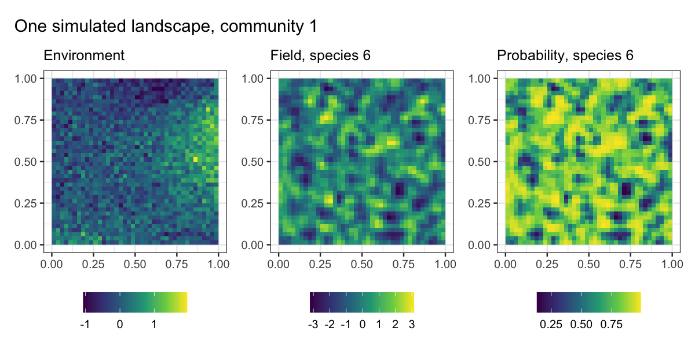
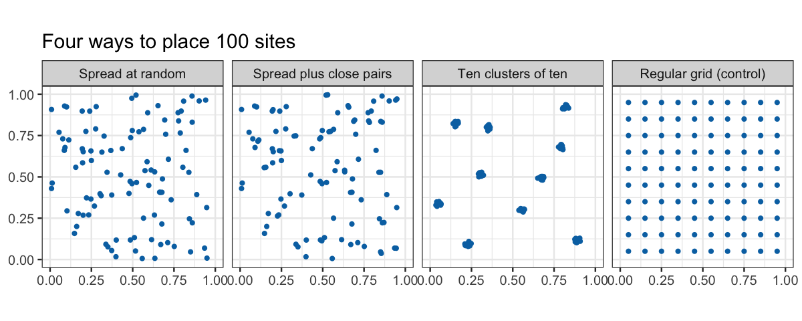
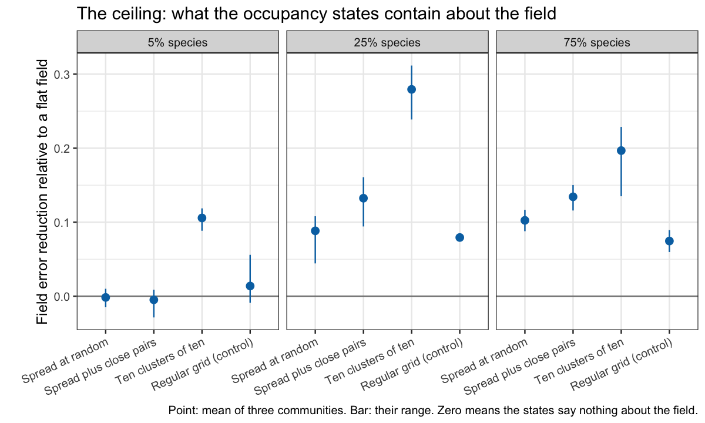
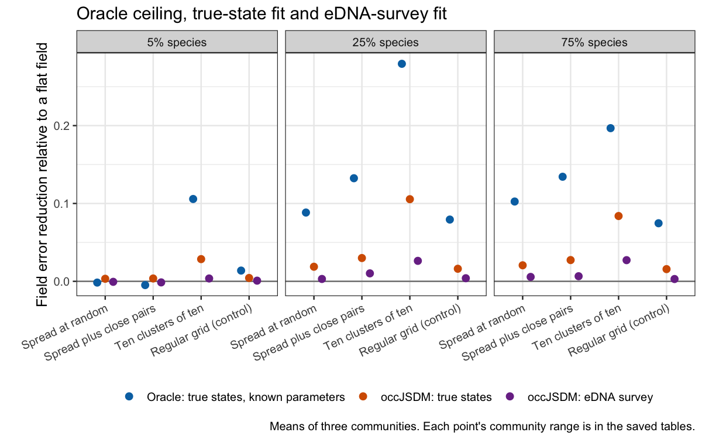
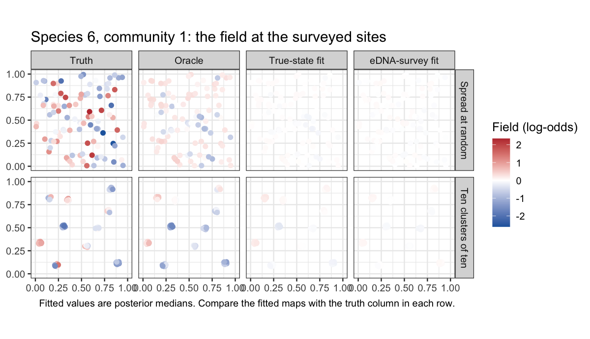
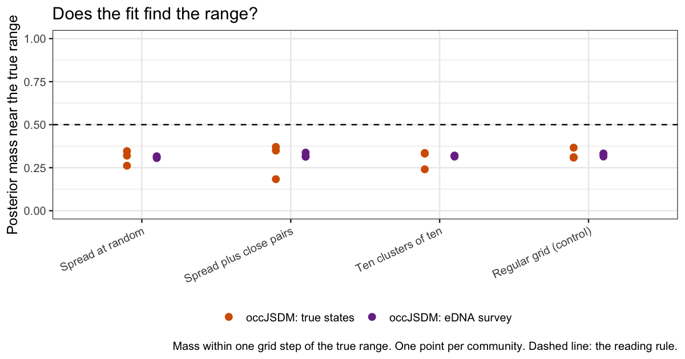
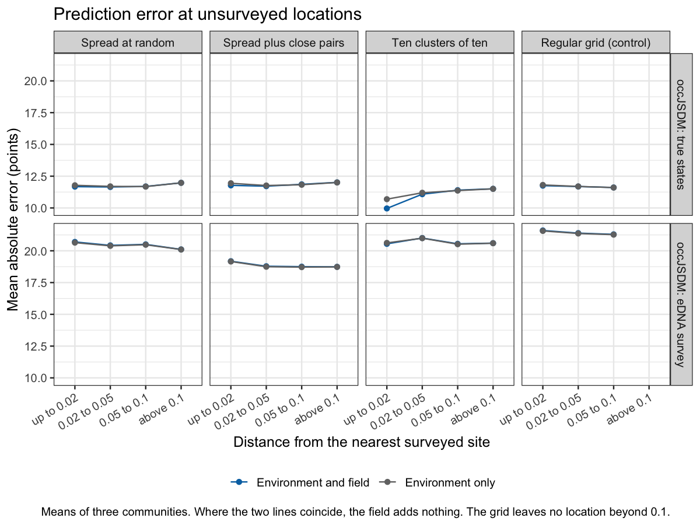
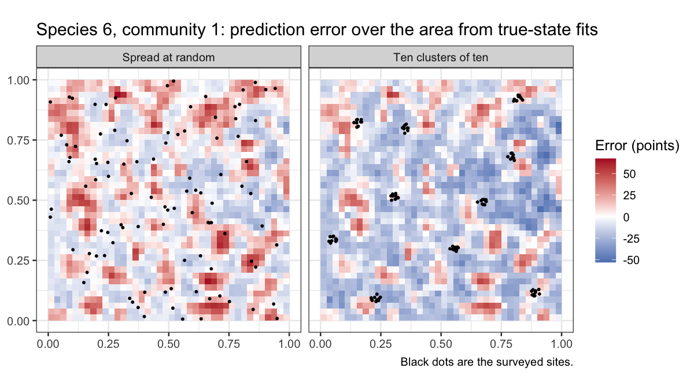

Lesson 2: Spatial landscapes and survey design
================

## What this lesson will add

**The concepts come first; the worked sections below test them on a controlled simulation.** The sweep behind them fixed its design before any fit; the protocol and audited results are in the repository’s development folder. Dispersal and same-scale environmental confounding are not simulated here; the closing section says what remains.

The central ecological question will be: **if a site offers suitable conditions, why might a species still be absent, and what can spatial information tell us?** The worked sections use one broad environmental gradient and one short-range spatial field per species; contrasts between species with different dispersal abilities are deferred, and the closing section says what remains.

## Spatial effects, inference and sampling design

This section explains what the spatial component contributes to species distribution predictions and how that affects survey design. It can be read on its own, before the worked sections. [Lesson 3](occJSDM-lesson-3.md#predict-occupancy-at-genuinely-new-sites) shows the non-spatial prediction call in R.

### What the spatial component learns

The spatial submodel learns a map of where a species is more or less likely to occur than the measured environment alone would suggest. Imagine two forested valleys with similar elevation, rainfall and forest cover. Those environmental measurements might suggest 40% occupancy in both valleys, but the survey evidence may consistently support higher occupancy in one valley and lower occupancy in the other. A spatial adjustment could raise the prediction to 70% in the first and lower it to 20% in the second. These percentages are an illustration, not fitted results.

This map of upward and downward adjustments is called a **spatial field**. Nearby sites are encouraged to have similar adjustments. Their final occupancy probabilities can still differ sharply if their measured habitats differ. Environmental effects, spatial effects and the other model components are estimated together. For occupancy data, the adjustments are added on the model’s log-odds scale and then converted to probabilities, keeping predictions between zero and one. In the two-stage model, field and laboratory detection errors are also considered during fitting; the spatial field is not simply a smoothed map of raw PCR detections.

Two properties help describe the field. Its **range** describes how quickly spatial similarity decreases with distance: shorter ranges allow smaller patches, and longer ranges give broader patterns. This is not the geographical extent of a species’ distribution. Its **strength** describes how large the spatial adjustments are. Species have their own fitted fields, but the current implementation shares one range parameter across species; it does not estimate a separate spatial range for each species.

Enable spatial fitting by supplying two coordinate columns through `spatCovariates`. The current model uses straight-line separation after separately standardising the two axes. It selects among ten range values from 0.01 to 0.30 on that transformed scale. These numbers are not kilometres, and equal transformed distances along the two axes need not correspond to equal physical distances. The model does not explicitly represent river connectivity, downstream DNA transport or movement barriers. Check that this distance model and its range grid can represent the spatial scales relevant to the study.

### How this helps prediction

At a new location, `predictNewSites()` combines its environmental covariates with the fitted spatial field evaluated at its coordinates. Supply coordinates in the same units and coordinate system as the fitting data; the function applies the transformation recorded during fitting. Uncertainty in the fitted parameters and field contributes to the prediction summaries.

The field can be particularly useful for filling gaps within a surveyed landscape, where nearby observations provide information about local departures from the environmental relationship. Far from the sampled landscape, the learned spatial adjustment supplies progressively less information. It cannot reveal the hunting history or unmeasured habitat conditions of a distant region. A smooth prediction map, or a narrow uncertainty interval from the spatial approximation, is not evidence that such extrapolation is reliable. Interval coverage remains a separate beta-validation limitation.

The model represents the field using **support points**, also called knots. These are computational anchors, not extra observations. Too few can prevent the model from representing detailed spatial patterns. More allow greater flexibility at greater computational cost. Set their number with `n_supportpoints` in `listParams`; the default is approximately 20% of the unique observed locations. Using every unique location as a support point has been possible since [PR \#8](https://github.com/AlexDiana/occJSDM/pull/8) was merged on 27 September 2026, and the sweep below does so, with 100 support points for 100 sites. Check sensitivity by increasing this number and comparing the predicted probabilities and strength of the spatial field. More support points cannot replace missing field observations.

### Prediction, association and causal inference

The spatial component can help with prediction and with estimating ecological associations. It does not by itself establish the causes of a geographical pattern. For example, predicting where a species occurs, estimating whether occupancy is higher in protected forest, and estimating how much creating a protected area would increase occupancy are different questions. The last requires evidence that separates protection from other differences among places.

If all protected sites are in one valley and all unprotected sites are in another, protection and valley identity are entangled. Adding a spatial field does not reveal how much of the difference is due to protection, hunting or habitat history. Environmental predictors and spatial effects can also explain overlapping patterns, making their separate contributions difficult to estimate. This is known as spatial confounding; its consequences depend on the scales of the measured and unmeasured variation ([Paciorek, 2010](https://arxiv.org/abs/1011.1139)).

For inference about protection, repeat protected-versus-unprotected comparisons in several geographical areas, with overlapping habitat and elevation conditions. The same principle applies to other ecological contrasts. Repeating a contrast across areas usually provides more useful evidence about that contrast than intensively sampling only one pair of areas. Such replication strengthens inference, although it does not remove every possible source of confounding.

Interpret the spatial field as an unresolved geographical pattern. It could reflect unmeasured habitat, dispersal history, hunting or several processes together. The spatial fraction in a variance-partitioning plot is therefore not automatically the fraction caused by dispersal limitation. Likewise, residual species correlations do not on their own establish biotic interactions.

### Choosing sample grain, spacing and extent

**First define the area represented by a sample.** Occupancy might refer to a plot, a stream reach or another clearly defined ecological unit. For stream-water eDNA, the DNA source can extend upstream; a detection at a bridge does not automatically place an animal beside that bridge. Environmental covariates should describe the intended unit as closely as possible. Catchment-scale transport models illustrate why the sampling location and the organisms’ locations can differ ([Carraro et al., 2020](https://www.nature.com/articles/s41467-020-17337-8)). The current occJSDM spatial field does not resolve that transport process.

**Spread the main sampling locations across the region to be mapped.** Include its main habitats, elevations and geographical subdivisions. Dense sampling in one accessible valley can give a good local picture while leaving the rest of the map weakly supported. A few widely separated sites across an enormous area can reveal broad patterns while missing local variation. At a fixed budget, expanding the extent reduces sampling density, so choose the study area and the intended map detail together.

**Supplement broad coverage with some deliberately close pairs.** Nearby locations reveal how quickly distributions change over short distances, while widely separated locations reveal broader differences. Vary the distances within the pairs, and spread them among habitats and areas. Spatial sampling research supports adding close pairs to a well-spread design when the spatial correlation structure also needs to be estimated ([Chipeta et al.](https://arxiv.org/abs/1605.00104)).

As an illustrative pilot allocation, a budget for 100 distinct sampling locations might place 80 across the region and use 20 as additional locations near selected ones. This is a candidate design to evaluate, not an established optimum or a sufficient sample-size recommendation for occJSDM. Distinct sampling locations must also make sense relative to the area each sample represents.

**Use a pilot to choose spacing in ecological and physical units.** Include separations shorter than, around and longer than the scales at which distributions are expected to change. If the remaining spatial pattern changes over a few kilometres, sampling only every 20 km will reveal little about that local pattern. Sampling every 100 m within one small area would reveal local variation but provide little geographical replication. Aim to observe changes within spatial patches and include several patches across the study extent. Check that the model’s coordinate transformation and candidate ranges can represent those scales before committing to a full survey.

### Field replication, laboratory replication and map resolution

Additional locations help describe the distribution. Separate field samples at a location help estimate collection success. PCR replicates help estimate laboratory detection. These forms of replication complement one another: more PCRs cannot replace missing geographical coverage, and more locations with inadequate replication can leave detection and occupancy difficult to distinguish. Collect replicates within a period over which the intended site’s occupancy state can reasonably be treated as unchanged; widely separated seasons may represent ecological change rather than repeated attempts to detect the same state.

False-positive estimation also needs suitable calibration information or informative assumptions. Repetition alone does not remove every ambiguity between occupancy and detection errors ([Guillera-Arroita et al., 2017](https://doi.org/10.1111/2041-210X.12743)). Retain field and laboratory controls and use the information they provide to assess the assumptions about error rates. The appropriate allocation among locations, field samples and PCRs depends on detection rates, target species and costs, and should be checked using pilot data and simulations of the proposed design. Computational validation with many independent binary observations sharing coordinates is not a recommendation for that many field samples or PCR replicates at a real site.

Map pixel size is not ecological resolution. The software can calculate predictions on a fine grid, but those pixels do not create information between widely spaced observations. Local detail may be supported by measured environmental covariates, spatial evidence or both; it needs validation at the scale where the map will be used. Increasing the number of support points only increases computational flexibility.

### Validate the prediction task that matters

Withholding isolated sites among nearby sampled sites assesses interpolation within the surveyed landscape. Withholding whole catchments or geographical blocks provides a more demanding assessment of prediction to unsurveyed areas. Choose the separation and block sizes to resemble the intended use of the map. Keep all field samples and PCR replicates from a held-out site together in the same fold, and refit without that site’s observations. Randomly splitting PCR rows would let information from the same site enter both fitting and validation.

Spatial blocking can reveal overoptimistic assessments from random validation, but large blocks can also turn an interpolation test into an extrapolation test. Match the design to the scientific question rather than assuming that the largest possible blocks are always best ([Roberts et al., 2017](https://doi.org/10.1111/ecog.02881)). For eDNA surveys, held-out detections still contain observation error: evaluate their predictions through the detection model, and use known simulated occupancy or suitable independent reference information when directly assessing occupancy-probability accuracy. A held-out non-detection is not automatically a true absence.

``` r
library(dplyr)
library(tidyr)
library(tibble)
library(ggplot2)
library(patchwork)

sweep <- readRDS("teaching-data/spatial-lesson.rds")

arrangement_order <- c("spread", "pairs", "clustered", "grid")
arrangement_labels <- c(spread = "Spread at random", pairs = "Spread plus close pairs",
                        clustered = "Ten clusters of ten", grid = "Regular grid (control)")
arm_labels <- c(oracle = "Oracle: true states, known parameters",
                binary = "occJSDM: true states", two_stage = "occJSDM: eDNA survey")
group_labels <- c(prevalence_5pct = "5% species", prevalence_25pct = "25% species",
                  prevalence_75pct = "75% species")

# Helpers for the numbers quoted in the text.
fixed <- function(x, digits = 2) formatC(x, format = "f", digits = digits)
percent <- function(x) paste0(fixed(100 * x, 1), "%")
span <- function(x, digits = 2) paste(fixed(min(x), digits), "to", fixed(max(x), digits))

theme_set(theme_bw(base_size = 12))
```

## 2A. One landscape, four surveys

Everything in the worked sections comes from a simulation designed to isolate one question: with the budget fixed at 100 sites in a fixed study area, how does the arrangement of those sites change what the spatial submodel can learn? The landscape has a single broad environmental gradient, which every arrangement samples, and one independent spatial field per species with a short range, 3% of the side of the area, on which the arrangements differ. All species share that range and a field standard deviation of 1 on the log-odds scale, which is what occJSDM assumes, so the sweep tests information, not model mismatch. Three independent communities were generated; the maps below show the first.

``` r
lat <- sweep$landscape$index$lattice
landscape_cells <- tibble(
  x = sweep$landscape$points[lat, 1], y = sweep$landscape$points[lat, 2],
  environment = sweep$landscape$environment[lat],
  field = sweep$landscape$field[lat, "species06"],
  probability = sweep$landscape$psi[lat, "species06"]
) |>
  pivot_longer(-c(x, y), names_to = "layer", values_to = "value") |>
  mutate(layer = factor(layer, c("environment", "field", "probability"),
                        c("Environment", "Field, species 6", "Probability, species 6")))

# Each layer has its own units, so each map gets its own colour scale.
layer_maps <- lapply(levels(landscape_cells$layer), function(this_layer)
  ggplot(filter(landscape_cells, layer == this_layer), aes(x, y, fill = value)) +
    geom_raster() +
    scale_fill_viridis_c() +
    coord_equal() +
    labs(x = NULL, y = NULL, fill = NULL, subtitle = this_layer) +
    theme(legend.position = "bottom"))

wrap_plots(layer_maps, nrow = 1) + plot_annotation(title = "One simulated landscape, community 1")
```

<!-- -->

The gradient alone, with its site-to-site noise, would give species 6 a broad trend across the area. The field adds patches a few percent of the side wide, and the probability map is their sum on the log-odds scale. A geographically structured distribution is therefore expected even where no spatial process acts, and the spatial submodel’s job is only the patches.

``` r
sites <- sweep$arrangements |>
  filter(community == "rep01") |>
  mutate(arrangement = factor(arrangement, arrangement_order, arrangement_labels))

ggplot(sites, aes(x, y)) +
  geom_point(size = 1.1, colour = "#0072B2") +
  facet_wrap(~ arrangement, nrow = 1) +
  coord_equal(xlim = c(0, 1), ylim = c(0, 1)) +
  labs(x = NULL, y = NULL, title = "Four ways to place 100 sites")
```

<!-- -->

The design table records what each arrangement gives the model. Each site’s own occupancy state says a little about the field where it stands. To see the shape of a patch, the model also needs other sites within about one range, where field values are correlated above 0.5.

``` r
sweep$statistics |>
  group_by(arrangement) |>
  summarise(nearest_neighbour = mean(mean_nearest_neighbour),
            with_correlated_neighbour = mean(fraction_with_half_neighbour),
            standardised_range = mean((standardised_range_x + standardised_range_y) / 2),
            axis_ratio = mean(axis_sd_ratio), .groups = "drop") |>
  mutate(arrangement = factor(arrangement, arrangement_order, arrangement_labels)) |>
  arrange(arrangement) |>
  knitr::kable(digits = c(0, 3, 2, 3, 2),
               col.names = c("Arrangement", "Mean nearest-neighbour distance", "Fraction of sites with a correlated neighbour",
                             "Range on the fitter's standardised scale", "Ratio of axis spreads"),
               caption = "Means over three communities; the study area has side 1 and the field range is 0.03")
```

| Arrangement | Mean nearest-neighbour distance | Fraction of sites with a correlated neighbour | Range on the fitter’s standardised scale | Ratio of axis spreads |
|:---|---:|---:|---:|---:|
| Spread at random | 0.052 | 0.33 | 0.106 | 0.96 |
| Spread plus close pairs | 0.037 | 0.58 | 0.104 | 0.97 |
| Ten clusters of ten | 0.006 | 1.00 | 0.107 | 1.03 |
| Regular grid (control) | 0.100 | 0.00 | 0.104 | 1.00 |

Means over three communities; the study area has side 1 and the field range is 0.03

One trap is worth naming. occJSDM standardises each coordinate axis before fitting, so shrinking the whole study area changes nothing: the standardised range column is about 0.10 for every arrangement, inside the fitter’s grid of 0.01 to 0.30. Closer spacing means more sites within one range of each other, which at a fixed budget means clustering some of them. The grid is the extreme case: its spacing of 0.1 is more than three ranges, so no site on it has a correlated neighbour.

## 2B. What the survey data contain

Before asking what occJSDM recovers, ask what the data allow. An oracle sampler was handed the true occupied states, intercept, slope, range and amplitude and asked only for the field. Nothing can do better from the same states. Its error is compared with the error of assuming a flat field.

``` r
cells <- sweep$aggregate |>
  mutate(reduction = 1 - centred_rmse / zero_field_rmse)
recovery <- cells |>
  mutate(arrangement = factor(arrangement, arrangement_order, arrangement_labels),
         arm = factor(arm, names(arm_labels), arm_labels),
         group = factor(group, names(group_labels), group_labels))

# Each community's reduction, for the bars: errors are averaged over the group's species first.
oracle_communities <- sweep$oracle |>
  group_by(community, arrangement, group) |>
  summarise(reduction = 1 - mean(centred_rmse) / mean(zero_field_rmse),
            correlation = mean(centred_correlation), .groups = "drop")
oracle_bars <- oracle_communities |>
  group_by(arrangement, group) |>
  summarise(low = min(reduction), high = max(reduction), .groups = "drop") |>
  mutate(arrangement = factor(arrangement, arrangement_order, arrangement_labels),
         group = factor(group, names(group_labels), group_labels))

ggplot(filter(recovery, arm == arm_labels["oracle"]), aes(arrangement, reduction)) +
  geom_hline(yintercept = 0, colour = "grey50") +
  geom_linerange(data = oracle_bars, aes(arrangement, ymin = low, ymax = high), inherit.aes = FALSE, colour = "#0072B2") +
  geom_point(colour = "#0072B2", size = 2.6) +
  facet_wrap(~ group) +
  labs(x = NULL, y = "Field error reduction relative to a flat field",
       title = "The ceiling: what the occupancy states contain about the field",
       caption = "Point: mean of three communities. Bar: their range. Zero means the states say nothing about the field.") +
  theme(axis.text.x = element_text(angle = 25, hjust = 1), plot.margin = margin(5.5, 5.5, 5.5, 30))
```

<!-- -->

``` r
oracle_cells <- filter(cells, arm == "oracle")
common <- filter(oracle_cells, group != "prevalence_5pct")
rare <- filter(oracle_cells, group == "prevalence_5pct")
clustered_25 <- filter(oracle_communities, arrangement == "clustered", group == "prevalence_25pct")
clustered_75 <- filter(oracle_communities, arrangement == "clustered", group == "prevalence_75pct")
clustered_5 <- filter(oracle_communities, arrangement == "clustered", group == "prevalence_5pct")
passes <- function(d) sum(d$reduction >= .2 & d$correlation >= .5)
```

The ceiling is low for every arrangement except one. With sites spread at random, in pairs or on the grid, the oracle, knowing everything except the field, removes only 7.5 to 13.4% of the flat-field error for the common species, and almost nothing for the rare ones. Clustering changes that for the common species. For the 25% species the oracle clears both informative thresholds in 3 of 3 communities, with reductions of 23.9 to 31.2% and correlations of 0.64 to 0.73; for the 75% species it clears them in 2 of 3. For the rare species even clustered sites leave the oracle at 8.8 to 11.9%. So for most arrangements 100 occupancy states hold little information about a field whose range is 3% of the area’s side; clustered sites hold enough for the common species, and the next section asks whether occJSDM extracts it.

``` r
sweep$reading |>
  mutate(arrangement = factor(arrangement, arrangement_order, arrangement_labels),
         group = factor(group, names(group_labels), group_labels)) |>
  arrange(group, arrangement) |>
  select(group, arrangement, label, min_reduction, min_correlation) |>
  knitr::kable(digits = 2, col.names = c("Species group", "Arrangement", "Reading", "Smallest error reduction", "Smallest correlation"),
               caption = "Reading rules fixed before fitting, applied to occJSDM's true-state fits across all three communities")
```

| Species group | Arrangement | Reading | Smallest error reduction | Smallest correlation |
|:---|:---|:---|---:|---:|
| 5% species | Spread at random | uninformative | 0.00 | 0.03 |
| 5% species | Spread plus close pairs | uninformative | 0.00 | 0.04 |
| 5% species | Ten clusters of ten | uninformative | 0.02 | 0.38 |
| 5% species | Regular grid (control) | uninformative | 0.00 | 0.10 |
| 25% species | Spread at random | uninformative | 0.01 | 0.29 |
| 25% species | Spread plus close pairs | uninformative | 0.02 | 0.38 |
| 25% species | Ten clusters of ten | intermediate | 0.09 | 0.64 |
| 25% species | Regular grid (control) | uninformative | 0.02 | 0.38 |
| 75% species | Spread at random | uninformative | 0.02 | 0.39 |
| 75% species | Spread plus close pairs | uninformative | 0.02 | 0.44 |
| 75% species | Ten clusters of ten | uninformative | 0.08 | 0.52 |
| 75% species | Regular grid (control) | uninformative | 0.01 | 0.33 |

Reading rules fixed before fitting, applied to occJSDM’s true-state fits across all three communities

The reading labels were defined before any result existed: informative means at least a 20% error reduction and a correlation of at least 0.5 in every community, uninformative means under 10% or under 0.3 in every community, and anything else is intermediate. Read the table rather than the prose for the result; the prose below describes the pattern the table shows.

With sites spread at random, the field is not recoverable for any species group. Even the clustered and paired designs do not reach the informative threshold for any species group in all three communities. In all, 11 of the 12 cells are uninformative. The exception is the clustered design for the 25% species, which is intermediate; exercise 3 below asks why. The clustered design for the 75% species has correlations of at least 0.52 in every community, but its error reductions are all below 10%, so it is uninformative. Rarity is a separate limit: a species at 5% occupancy has about five occupied sites among 100, too few to reveal where its patches are, however the sites are arranged.

## 2C. What occJSDM delivers

The full model must also estimate the intercepts, slopes, range and amplitude, and in the survey arm it must see the field through two field samples, two primers and six PCRs per primer per sample, 12 PCRs per sample. The oracle-to-true-state gap is the cost of estimation; the true-state-to-survey gap is the cost of detection.

``` r
ggplot(recovery, aes(arrangement, reduction, colour = arm)) +
  geom_hline(yintercept = 0, colour = "grey50") +
  geom_point(position = position_dodge(.5), size = 2.4) +
  facet_wrap(~ group) +
  scale_colour_manual(values = c("#0072B2", "#D55E00", "#7B3294")) +
  labs(x = NULL, y = "Field error reduction relative to a flat field", colour = NULL,
       title = "Oracle ceiling, true-state fit and eDNA-survey fit",
       caption = "Means of three communities. Each point's community range is in the saved tables.") +
  theme(axis.text.x = element_text(angle = 25, hjust = 1), legend.position = "bottom", plot.margin = margin(5.5, 5.5, 5.5, 30))
```

<!-- -->

``` r
survey_communities <- sweep$fits$field |>
  filter(arm == "two_stage") |>
  group_by(community, arrangement, target) |>
  summarise(reduction = 1 - mean(centred_rmse) / mean(zero_field_rmse), .groups = "drop")

sweep$paired |>
  group_by(arrangement) |>
  summarise(estimation = mean(estimation_cost), detection = mean(detection_cost), .groups = "drop") |>
  mutate(arrangement = factor(arrangement, arrangement_order, arrangement_labels)) |>
  arrange(arrangement) |>
  knitr::kable(digits = 3, col.names = c("Arrangement", "Estimation cost", "Detection cost"),
               caption = "Increase in field RMSE on the log-odds scale, mean of three communities and three species groups")
```

| Arrangement             | Estimation cost | Detection cost |
|:------------------------|----------------:|---------------:|
| Spread at random        |           0.049 |          0.011 |
| Spread plus close pairs |           0.069 |          0.015 |
| Ten clusters of ten     |           0.117 |          0.051 |
| Regular grid (control)  |           0.044 |          0.009 |

Increase in field RMSE on the log-odds scale, mean of three communities and three species groups

Both gaps are real. Estimation adds 0.070 to the field error on average and adds to it in 30 of the 36 community, arrangement and group cells. Detection adds a further 0.022 on average and adds to it in 35 of 36. The clustered design, which has the highest ceiling, carries the largest of both. The eDNA-survey fits remove at most 2.7% of the flat-field error in any cell when averaged over communities, and at most 3.6% in any single community.

``` r
cells |>
  filter(arrangement == "clustered", group != "prevalence_5pct", arm != "two_stage") |>
  mutate(arm = factor(arm, names(arm_labels), arm_labels),
         group = factor(group, names(group_labels), group_labels)) |>
  arrange(group, arm) |>
  select(group, arm, reduction, correlation) |>
  knitr::kable(digits = 2, col.names = c("Species group", "Arm", "Error reduction", "Correlation with the true field"),
               caption = "The clustered design for the common species, mean of three communities")
```

| Species group | Arm | Error reduction | Correlation with the true field |
|:---|:---|---:|---:|
| 25% species | Oracle: true states, known parameters | 0.28 | 0.69 |
| 25% species | occJSDM: true states | 0.11 | 0.69 |
| 75% species | Oracle: true states, known parameters | 0.20 | 0.60 |
| 75% species | occJSDM: true states | 0.08 | 0.61 |

The clustered design for the common species, mean of three communities

In the clustered design the fit places the patches about as well as the oracle does, but not their strength. For the common species the true-state fit’s correlation with the true field is as high as the oracle’s, yet it removes less than half as much of the error. Correlation ignores scale and the error does not: the fit shrinks the field towards zero. Its posterior median for the field’s standard deviation is 0.31 to 0.36 against a true value of 1, and the upper end of its 95% interval is at most 0.61 in any fit. So where the data do hold the field, the fit falls short of the ceiling through that shrinkage: for the 25% species in the clustered design it removes 10.5% of the error against the oracle’s 27.9%. In the maps below, on one colour scale, the fitted fields are much paler than the truth.

``` r
maps <- sweep$field_maps |>
  filter(community == "rep01", species == "species06", arrangement %in% c("spread", "clustered")) |>
  left_join(filter(sweep$arrangements, community == "rep01"), by = c("community", "arrangement", "site")) |>
  mutate(arrangement = factor(arrangement, arrangement_order, arrangement_labels),
         source = factor(source, c("truth", "oracle", "binary", "two_stage"),
                         c("Truth", "Oracle", "True-state fit", "eDNA-survey fit")))

ggplot(maps, aes(x, y, colour = value)) +
  geom_point(size = 1.8) +
  facet_grid(arrangement ~ source) +
  scale_colour_gradient2(low = "#2166AC", mid = "white", high = "#B2182B", midpoint = 0) +
  coord_equal(xlim = c(0, 1), ylim = c(0, 1)) +
  labs(x = NULL, y = NULL, colour = "Field (log-odds)",
       title = "Species 6, community 1: the field at the surveyed sites",
       caption = "Fitted values are posterior medians. Compare the fitted maps with the truth column in each row.")
```

<!-- -->

The fit does not find the range either. By the prespecified rule, the range is recovered when at least half of its posterior mass lies within one grid step of the truth in every community. That mass is 0.18 to 0.37 across the 24 fits, so the rule finds the range recovered in 0 of the 8 arrangement and arm combinations. The posterior mean range is 0.13 to 0.21 on the standardised scale, against a truth of 0.098 to 0.118: the fits prefer a longer, smoother field than the one simulated.

``` r
sweep$fits$range |>
  mutate(arrangement = factor(arrangement, arrangement_order, arrangement_labels),
         arm = factor(arm, names(arm_labels)[-1], arm_labels[-1])) |>
  ggplot(aes(arrangement, mass_within_one_step, colour = arm)) +
  geom_hline(yintercept = .5, linetype = "dashed") +
  geom_point(position = position_dodge(.4), size = 2.4) +
  scale_colour_manual(values = c("#D55E00", "#7B3294")) +
  ylim(0, 1) +
  labs(x = NULL, y = "Posterior mass near the true range", colour = NULL,
       title = "Does the fit find the range?", caption = "Mass within one grid step of the true range. One point per community. Dashed line: the reading rule.") +
  theme(axis.text.x = element_text(angle = 25, hjust = 1), legend.position = "bottom")
```

<!-- -->

``` r
sweep$fits$groups |>
  filter(metric == "occupancy", group %in% c("low", "medium", "high")) |>
  group_by(arrangement, arm, group) |>
  summarise(signed = 100 * mean(bias), absolute = 100 * mean(mae), .groups = "drop") |>
  mutate(arrangement = factor(arrangement, arrangement_order, arrangement_labels),
         arm = factor(arm, names(arm_labels)[-1], arm_labels[-1]),
         group = factor(group, c("low", "medium", "high"), c("Below 20%", "20% to 80%", "Above 80%"))) |>
  arrange(arm, arrangement, group) |>
  knitr::kable(digits = 1, col.names = c("Arrangement", "Arm", "True probability", "Signed error (points)", "Absolute error (points)"),
               caption = "Occupancy error at the surveyed sites, mean of three communities")
```

| Arrangement | Arm | True probability | Signed error (points) | Absolute error (points) |
|:---|:---|:---|---:|---:|
| Spread at random | occJSDM: true states | Below 20% | 7.6 | 8.3 |
| Spread at random | occJSDM: true states | 20% to 80% | -1.3 | 13.3 |
| Spread at random | occJSDM: true states | Above 80% | -15.3 | 15.4 |
| Spread plus close pairs | occJSDM: true states | Below 20% | 8.3 | 9.1 |
| Spread plus close pairs | occJSDM: true states | 20% to 80% | 0.3 | 13.1 |
| Spread plus close pairs | occJSDM: true states | Above 80% | -14.5 | 14.6 |
| Ten clusters of ten | occJSDM: true states | Below 20% | 5.7 | 6.5 |
| Ten clusters of ten | occJSDM: true states | 20% to 80% | -0.7 | 12.2 |
| Ten clusters of ten | occJSDM: true states | Above 80% | -10.6 | 11.0 |
| Regular grid (control) | occJSDM: true states | Below 20% | 8.4 | 9.3 |
| Regular grid (control) | occJSDM: true states | 20% to 80% | 0.2 | 13.1 |
| Regular grid (control) | occJSDM: true states | Above 80% | -14.3 | 14.3 |
| Spread at random | occJSDM: eDNA survey | Below 20% | 27.7 | 27.7 |
| Spread at random | occJSDM: eDNA survey | 20% to 80% | 1.4 | 11.8 |
| Spread at random | occJSDM: eDNA survey | Above 80% | -22.7 | 22.7 |
| Spread plus close pairs | occJSDM: eDNA survey | Below 20% | 24.3 | 24.3 |
| Spread plus close pairs | occJSDM: eDNA survey | 20% to 80% | 0.1 | 11.4 |
| Spread plus close pairs | occJSDM: eDNA survey | Above 80% | -22.6 | 22.6 |
| Ten clusters of ten | occJSDM: eDNA survey | Below 20% | 26.1 | 26.1 |
| Ten clusters of ten | occJSDM: eDNA survey | 20% to 80% | 1.8 | 13.0 |
| Ten clusters of ten | occJSDM: eDNA survey | Above 80% | -23.5 | 23.5 |
| Regular grid (control) | occJSDM: eDNA survey | Below 20% | 27.7 | 27.7 |
| Regular grid (control) | occJSDM: eDNA survey | 20% to 80% | -1.2 | 13.0 |
| Regular grid (control) | occJSDM: eDNA survey | Above 80% | -25.9 | 25.9 |

Occupancy error at the surveyed sites, mean of three communities

At the surveyed sites the fits pull occupancy probabilities towards the middle: in every arrangement they overestimate the lowest band and underestimate the highest, and the eDNA-survey fits do so much more strongly.

``` r
sweep$selected_fits |>
  filter(needs_long) |>
  select(key, initial_reasons, phase) |>
  knitr::kable(col.names = c("Fit", "Reasons for the longer run", "Fit used"),
               caption = "Initial fits that met the prespecified rule for a longer run")
```

| Fit | Reasons for the longer run | Fit used |
|:---|:---|:---|
| rep01-spread-two_stage | group Rhat \> 1.05; element Rhat \> 1.05; native convergence warning | long |
| rep01-grid-two_stage | native convergence warning | long |
| rep03-spread-two_stage | occupancy species ESS \< 100 | long |

Initial fits that met the prespecified rule for a longer run

``` r
amplitude_ess <- filter(sweep$fits$groups, metric == "spatial_sd")$ess_mean
amplitude_rhat <- filter(sweep$fits$groups, metric == "spatial_sd")$rhat
```

Convergence qualifications are part of the result. 3 of the 24 initial fits met the prespecified rule for a longer run; the longer run replaces the initial fit in every table, and 0 selected fits retain a flag after it. The rule’s Rhat check covers every scored quantity, including the spatial amplitude, whose Rhat is 1.003 to 1.033, but its effective-sample-size threshold covers occupancy only. The amplitude mixes slowly: 10 of the 24 selected fits have an amplitude effective sample size below 100, the lowest 49.5. Their amplitude interval endpoints are therefore imprecisely estimated, although every interval lies far below the true value.

## 2D. Predicting unsurveyed locations

Clustering buys neighbours and spends coverage. The lattice of 1,600 unsurveyed locations tests whether that trade shows in prediction. Prediction error is plotted against the distance from each location to its nearest surveyed site, with and without the spatial term.

``` r
lattice_means <- sweep$fits$lattice |>
  filter(bin != "all", n > 0) |>
  group_by(arrangement, arm, spatial_term, bin) |>
  summarise(mae = 100 * mean(mae), bias = 100 * mean(bias), .groups = "drop")

lattice_means |>
  mutate(arrangement = factor(arrangement, arrangement_order, arrangement_labels),
         arm = factor(arm, names(arm_labels)[-1], arm_labels[-1]),
         bin = factor(bin, c("up to 0.02", "0.02 to 0.05", "0.05 to 0.1", "above 0.1")),
         spatial_term = factor(spatial_term, c("with", "without"), c("Environment and field", "Environment only"))) |>
  ggplot(aes(bin, mae, colour = spatial_term, group = spatial_term)) +
  geom_line() + geom_point() +
  facet_grid(arm ~ arrangement) +
  scale_colour_manual(values = c("#0072B2", "grey45")) +
  labs(x = "Distance from the nearest surveyed site", y = "Mean absolute error (points)", colour = NULL,
       title = "Prediction error at unsurveyed locations",
       caption = "Means of three communities. Where the two lines coincide, the field adds nothing. The grid leaves no location beyond 0.1.") +
  theme(axis.text.x = element_text(angle = 30, hjust = 1), legend.position = "bottom")
```

<!-- -->

``` r
spatial_gain <- lattice_means |>
  filter(arm == "binary") |>
  select(arrangement, bin, spatial_term, mae) |>
  pivot_wider(names_from = spatial_term, values_from = mae) |>
  mutate(gain = without - with)
near_clusters <- spatial_gain$arrangement == "clustered" & spatial_gain$bin == "up to 0.02"
survey <- filter(lattice_means, arm == "two_stage")
```

The lines are nearly flat and nearly coincide. With the spatial term, the true-state fits miss the true occupancy probability by 11.1 to 12.0 points at every distance and in every arrangement, except within 0.02 of a site in the clustered design, at 10.0. Dropping the spatial term changes the error by at most 0.17 points, except in that same bin, where it adds 0.73. Outside the clustered design the error barely changes with distance from the survey. In the clustered design it rises from 10.0 to 11.5 points, and the spatial term accounts for at most 0.73 of that. The fitted field is too weak to matter at any distance: the environment term carries the prediction. The eDNA-survey fits miss by 18.7 to 21.6 points, with a positive bias of 5.7 to 8.5 points, so detection costs far more here than the arrangement does.

``` r
sweep$lattice_maps |>
  filter(source == "binary", arrangement %in% c("spread", "clustered")) |>
  mutate(error = 100 * (with - truth),
         arrangement = factor(arrangement, arrangement_order, arrangement_labels)) |>
  ggplot(aes(x, y, fill = error)) +
  geom_raster() +
  geom_point(data = filter(sweep$arrangements, community == "rep01", arrangement %in% c("spread", "clustered")) |>
               mutate(arrangement = factor(arrangement, arrangement_order, arrangement_labels)),
             aes(x, y), inherit.aes = FALSE, size = .6, colour = "black") +
  facet_wrap(~ arrangement) +
  scale_fill_gradient2(low = "#2166AC", mid = "white", high = "#B2182B", midpoint = 0) +
  coord_equal() +
  labs(x = NULL, y = NULL, fill = "Error (points)",
       title = "Species 6, community 1: prediction error over the area from true-state fits",
       caption = "Black dots are the surveyed sites.")
```

<!-- -->

``` r
true_field <- sweep$landscape$field[sweep$landscape$index$lattice, "species06"]
map_bias <- sweep$lattice_maps |>
  filter(source == "binary") |>
  group_by(arrangement) |>
  summarise(signed = 100 * mean(with - truth), under = mean(with < truth),
            field_correlation = cor(with - truth, true_field))
```

In both maps the errors mirror the true field, with a correlation of -0.94 to -0.91 between the error and the field: where the field raises occupancy the fit underpredicts, and where it lowers occupancy the fit overpredicts, because the fit has not learned the field. With clustered sites species 6 is also broadly underpredicted, by 10.0 points on average and in 73.5% of the cells. This is one species in one community, so it shows what a single map can look like, not a property of clustering.

The conceptual section described clustering as trading coverage for neighbours, with close pairs as a hedge between the two. At this budget and range neither side of the trade shows in prediction. The field the fits learn is too weak to carry information away from the sites, so the coverage that clustering gives up costs nothing measurable, and the neighbours it buys help by less than a point, almost all of it within 0.02 of a site. Adding close pairs to a spread design raised the oracle ceiling for the common species, but the true-state fits still removed about 3% of the error or less. Whether the trade appears with a longer range, a stronger field or a larger budget is not tested here.

## What this establishes, and what it does not

The sweep is a controlled, model-matched simulation: one broad gradient, one field range shared by all species, no dispersal, no species-specific ranges, and no environmental covariate at the field’s scale. Within that, three communities support the reading labels above, not confidence intervals.

At this budget, no arrangement of 100 sites lets occJSDM recover a field with a range of 3% of the area’s side. For most arrangements the information is not in the data: even the oracle ceiling is low. The exception is clustering for the common species, where the oracle clears the informative thresholds for the 25% species in every community; there occJSDM falls short of the ceiling, because it shrinks the field’s amplitude and prefers longer ranges than the truth. Clustering raises the field correlation to the oracle’s level for the common species but barely improves the map. Prediction at unsurveyed locations is carried almost entirely by the environment term, so the coverage that clustering gives up costs nothing measurable here, and the neighbours it gains buy almost nothing. Rare species are unrecoverable in every arrangement. The two-stage survey adds a detection cost on top of the cost of estimation.

Nothing here validates spatial prediction on real data, establishes interval coverage, or shows what happens when species disperse at different scales; those are the separate contrasts still to come, with same-scale environmental confounding the first candidate.

Try these with the saved tables, without refitting:

1.  Using the coordinates in `sweep$arrangements` as a template, compute for a design of your own the fraction of sites whose nearest neighbour is closer than 1.18 ranges, where a squared-exponential field’s correlation falls to 0.5, and compare it with `sweep$statistics`. Use a range that is plausible for your system.
2.  `sweep$lattice_maps` has every lattice cell for community 1 with its distance to the nearest site. Recompute the distance bins at 0.01, 0.03 and 0.06 and redraw the prediction-error figure for the four arrangements and two arms it contains.
3.  The clustered design for the 25% species is the one intermediate cell. From `sweep$fits$field`, compute its error reduction and correlation in each community, then say which part of the informative rule it fails and what keeps it out of the uninformative label.

## Reproduction record

The protocol, scripts, compact results, audit and figures are under `dev/simstudy/spatial-design-sweep/` in the source repository, and its README gives the full reproduction commands. The fits used occJSDM at main revision 9af8597, frozen before the first fit and recorded in the protocol’s amendments. The compact bundle `teaching-data/spatial-lesson.rds` carries everything this lesson renders. From the repository root, with `STUDY` set as in that README, the first command below rebuilds the bundle from the raw archive and the second checks it against the committed results without the archive. No fit is rerun while knitting.

``` bash
Rscript dev/simstudy/spatial-design-sweep/export-teaching.R --repo=. --study=$STUDY
Rscript dev/simstudy/spatial-design-sweep/verify-lesson.R .
```

Return to the [Quickstart and lesson guide](occJSDM.md), [Lesson 1](occJSDM-lesson-1.md) or [Lesson 3](occJSDM-lesson-3.md).
