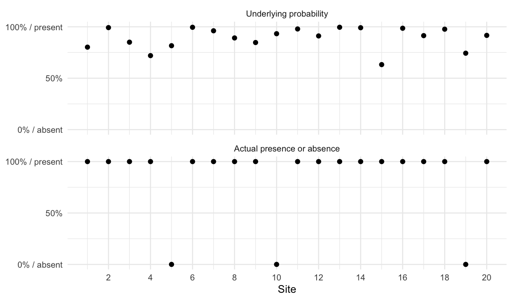
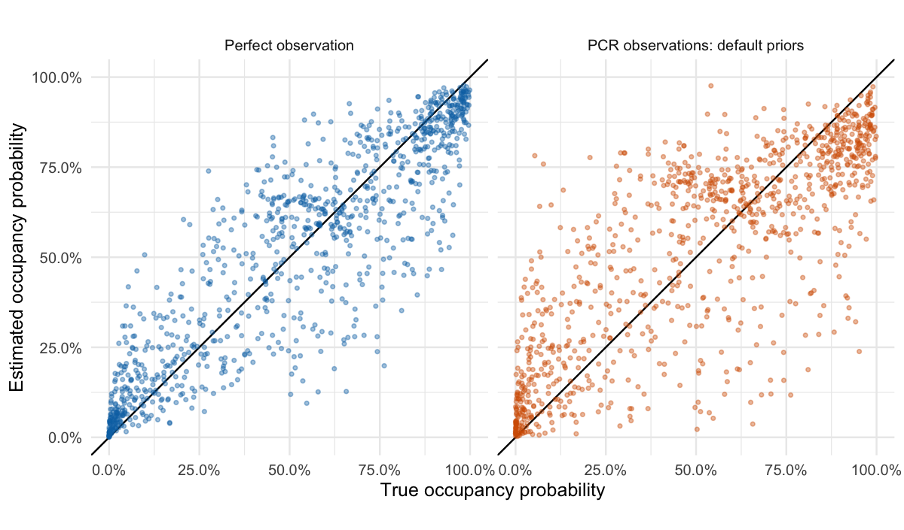
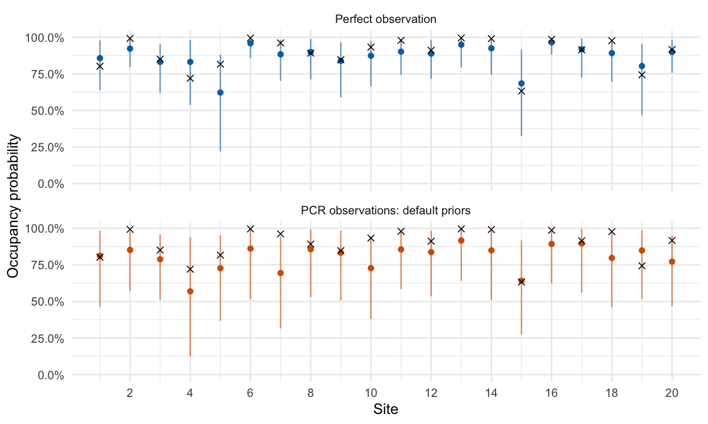
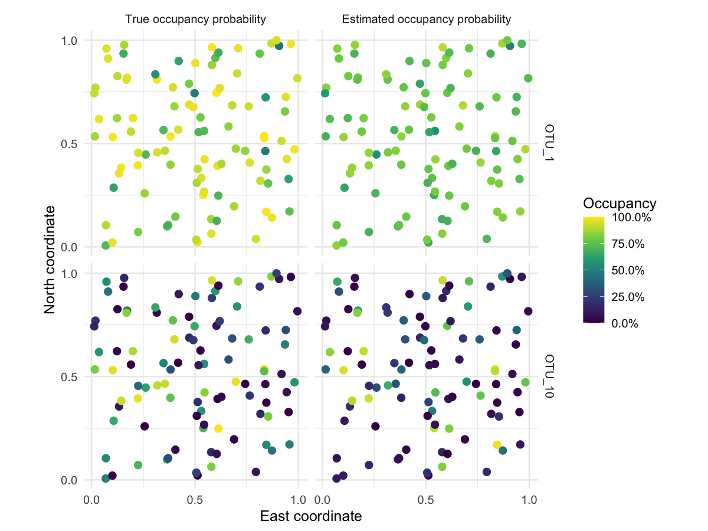
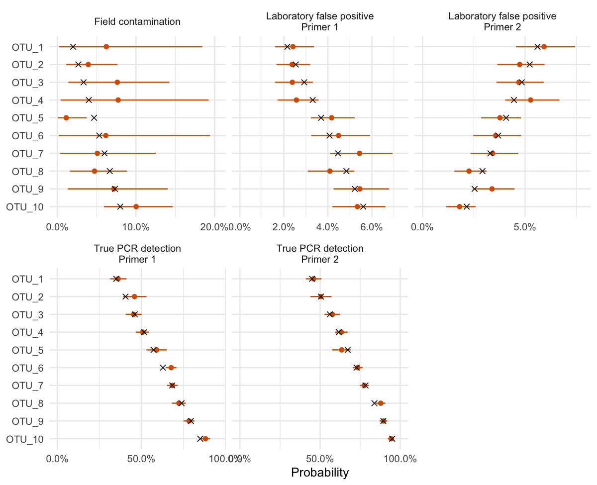
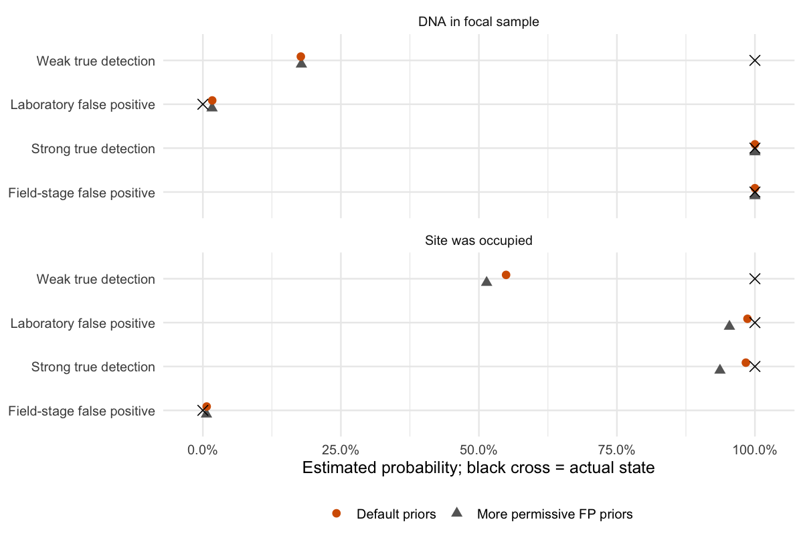

Lesson 2: Fit the model and compare its answers with truth
================

## Before you start

This is **Lesson 2**. [Lesson 0 (optional)](occJSDM-lesson-0.md) explains how we simulated the survey used here and maps its environmental values, true occurrences and detections. You can skip it and use the supplied data. This lesson is non-spatial. The spatial lesson, [Lesson 7](occJSDM-lesson-7.md), covers how sites are arranged in space. Every reader starts with [Lesson 1](occJSDM-lesson-1.md), the first required lesson: it works through occupancy models and joint species distribution models by hand, without fitting a model.

All teaching code is shown. Run the chunks in order with the repository’s `vignettes` directory as the working directory; knitting handles this automatically. In RStudio, use **Session \> Set Working Directory \> To Source File Location** with this file open.

We use saved results so that reading or knitting the lesson does not start a long model fit. A fit produces thousands of draws for each quantity it estimates, each draw one plausible value given the data. The saved file keeps only summaries of those draws, namely their average and the range holding the middle 95% of them, not the draws themselves. Six chunks are shown but not run while knitting, and the text says so beside each. Four are model fits: the perfect-observation fit, the PCR fit, the fit with alternative priors and the fit to a survey with unequal replication. The other two, `inspect-fitted-design` and `extract-your-fit`, need a fit of your own. Every other chunk runs and produces the figures and tables you see. The saved file contains the complete simulation. The unequal-replication section loads a second, smaller file.

**What this lesson assumes you know.** The code uses base R and the tidyverse: the pipe `|>`, and from dplyr and tidyr the verbs listed below. If any are new, the two chapters of R for Data Science on [data transformation](https://r4ds.hadley.nz/data-transform) and [data tidying](https://r4ds.hadley.nz/data-tidy) teach everything used here in an afternoon. Operations that are unusual, such as joining two tables on species identity, are explained where they appear.

- `select()` and `pull()` to choose columns, or to take one column out as a vector.
- `filter()`, `distinct()`, `arrange()`, `slice_head()`, `slice_min()` and `slice_max()` to keep, deduplicate, order and pick rows, including those with the smallest or largest value.
- `mutate()`, `transmute()`, `case_when()`, `if_else()` and `recode()` to add or recode columns (`transmute()` keeps only the new ones), and `group_by()` and `summarise()` to summarise by group.
- `bind_rows()` to stack tables, and `left_join()`, `inner_join()`, `semi_join()` and `anti_join()` to combine tables on shared identifiers, or to keep or drop the rows that match.
- `pivot_longer()` to move from one column per measurement to one row per measurement.

``` r
library(dplyr)
library(tidyr)
library(tibble)
library(ggplot2)

lesson <- readRDS("teaching-data/nonspatial-lesson.rds")

survey_data <- lesson$input$sim$data_list
known_truth <- lesson$input$sim$true_params
occupancy_results <- as_tibble(lesson$cells)
```

`survey_data` contains the covariates, traits and PCR observations supplied to the model. `known_truth` is kept separate so that we can check the model’s answers against it. This is not the quickstart’s `sampledata`: this survey was simulated with its truth kept, so that every answer the model gives can be checked against it.

``` r
names(lesson)
```

    #>  [1] "schema"                    "input"                    
    #>  [3] "observations"              "cases"                    
    #>  [5] "cells"                     "groups"                   
    #>  [7] "rates"                     "samples"                  
    #>  [9] "diagnostics"               "manifests"                
    #> [11] "input_md5"                 "summary_source_hashes"    
    #> [13] "reconstruction_difference"

`lesson` holds the simulation (`input`) and everything the lesson reads from the saved fits. These are the components we use:

- `cells`: one row per species, site and fit, for occupancy.
- `rates`: the detection and false-positive rates.
- `cases`: the four example cases.
- `observations`: one row per species and PCR reaction.
- `samples`: one row per species, field sample and fit.
- `diagnostics`: the convergence checks.

The main lesson does not use the remaining components. `groups` is a ready-made version of the error table we calculate ourselves below. The others (`schema`, `manifests`, the hashes and the reconstruction checks) record how the file was built, which the appendix draws on.

These are the three tables the model receives, and the one that the lesson keeps aside as truth.

``` r
str(survey_data, max.level = 1)
```

    #> List of 3
    #>  $ info  :'data.frame':  3600 obs. of  8 variables:
    #>  $ OTU   : num [1:3600, 1:10] 0 0 0 0 0 0 0 1 0 0 ...
    #>   ..- attr(*, "dimnames")=List of 2
    #>  $ traits: num [1:10, 1:2] 0.088 0.421 -0.204 1.41 0.018 ...
    #>   ..- attr(*, "dimnames")=List of 2

``` r
head(survey_data$info)
```

    #>     Site Sample Primer X_psi.EnvCov.1 X_psi.EnvCov.2      Xs.1    Xs.2
    #> 1      1      1      1      -13.95934      -2.284964 0.5264733 0.62615
    #> 1.1    1      1      1      -13.95934      -2.284964 0.5264733 0.62615
    #> 1.2    1      1      1      -13.95934      -2.284964 0.5264733 0.62615
    #> 1.3    1      1      1      -13.95934      -2.284964 0.5264733 0.62615
    #> 1.4    1      1      1      -13.95934      -2.284964 0.5264733 0.62615
    #> 1.5    1      1      1      -13.95934      -2.284964 0.5264733 0.62615
    #>        X_theta
    #> 1   0.04807685
    #> 1.1 0.04807685
    #> 1.2 0.04807685
    #> 1.3 0.04807685
    #> 1.4 0.04807685
    #> 1.5 0.04807685

``` r
head(survey_data$OTU[, 1:5])
```

    #>      OTU_1 OTU_2 OTU_3 OTU_4 OTU_5
    #> [1,]     0     0   246     0     0
    #> [2,]     0     0     0     0     0
    #> [3,]     0     0     0     0   217
    #> [4,]     0     0    30     0   798
    #> [5,]     0     0     0     0     0
    #> [6,]     0     0     0     0   198

``` r
survey_data$traits
```

    #>            Trait_1     Trait_2
    #> OTU_1   0.08797648 -0.40650778
    #> OTU_2   0.42127082  0.53601978
    #> OTU_3  -0.20395805  0.61312885
    #> OTU_4   1.40969957 -0.19366021
    #> OTU_5   0.01797194  1.80778500
    #> OTU_6   0.46694615  0.23830024
    #> OTU_7   0.75463971  0.43607637
    #> OTU_8   0.38066791 -0.06051129
    #> OTU_9  -1.00747810 -0.22811620
    #> OTU_10 -0.39057863 -1.71973730

``` r
names(known_truth)
```

    #> [1] "jsdmParams_true" "beta_theta_true" "z_true"          "w_true"         
    #> [5] "p_true"          "q_true"

`info` has one row per PCR reaction: its `Site`, its field `Sample` and its `Primer`, followed by the covariates. `X_psi.EnvCov.1` and `X_psi.EnvCov.2` are the two occupancy covariates. `Xs.1` and `Xs.2` are site coordinates that this non-spatial lesson does not use. `X_theta` is the one collection covariate, measured for each field sample. There is no PCR column: the six PCR replicates of a sample and primer are six rows with the same `Sample` and `Primer`. `OTU` has one column per species and one row for each row of `info`, holding that reaction’s read count for the species; the first five species are shown. `traits` has one row per species and one column per measured trait. `known_truth` holds what the simulation knew and the model never sees: the true site states (`z_true`), the true sample states (`w_true`) and the true coefficients and rates. We list its names here so that you can recognise it when the lesson uses it to check the fit.

`occupancy_results` has one row per species, site and fit. `arm` identifies which fit produced a result. `truth` is the true occupancy probability the simulation used. `estimate` is the posterior mean, the average of the fit’s draws and its single best estimate. `lower` and `upper` bound the 95% credible interval, the range that holds the middle 95% of the draws. `z` is the actual simulated presence or absence, which is a different quantity from the true probability.

``` r
occupancy_results |>
  select(arm, Site, species, truth, z, estimate, lower, upper) |>
  slice_head(n = 6)
```

    #> # A tibble: 6 × 8
    #>   arm     Site  species truth     z estimate lower upper
    #>   <chr>   <chr> <chr>   <dbl> <int>    <dbl> <dbl> <dbl>
    #> 1 perfect 1     OTU_1   0.802     1    0.858 0.638 0.979
    #> 2 perfect 2     OTU_1   0.992     1    0.923 0.797 0.987
    #> 3 perfect 3     OTU_1   0.850     1    0.832 0.620 0.953
    #> 4 perfect 4     OTU_1   0.720     1    0.832 0.538 0.980
    #> 5 perfect 5     OTU_1   0.816     0    0.623 0.220 0.881
    #> 6 perfect 6     OTU_1   0.995     1    0.959 0.858 0.996

The following labels and two small formatting functions will keep our figures and tables consistent. They only control presentation; all calculations retain the unrounded values.

``` r
fit_labels <- c(
  perfect = "Perfect observation",
  default = "PCR observations: default priors",
  alternative = "PCR observations: more permissive FP priors"
)

fit_colours <- c(
  perfect = "#0072B2",
  default = "#D55E00",
  alternative = "#7B3294"
)

format_percent <- function(probability, digits = 1) {
  paste0(formatC(100 * probability, format = "f", digits = digits), "%")
}

format_points <- function(error) {
  formatC(100 * error, format = "f", digits = 1)
}

theme_set(theme_minimal(base_size = 12))
```

## What are we trying to learn?

Suppose we survey a community using environmental DNA. A species can be present at a site without appearing in our samples. Its DNA can be in a sample without appearing in every PCR. Both are **false negatives**. Conversely, contamination in the field or in the laboratory can produce a positive result when the species is absent: a **false positive**.

occJSDM gives each of these stages its own probability. These are occupancy (`psi`), the collection of DNA into a field sample (`theta`), PCR detection (`p`) and the two false-positive rates, in the laboratory (`q`) and in the field (`theta0`). It estimates them all together. We compare occupancy with truth in “Calculate the errors ourselves”. We compare the detection and false-positive rates in “How does good practice enter the model?” and collection in “Collection conditions”. This lesson asks two questions: **How closely does it recover the underlying occupancy probabilities? When does it believe a positive detection, and can that judgment be wrong?**

We use a simulated community so that we can reveal the answers. Truth is used to check the fit; it is withheld from the model except in the explicitly labelled perfect-observation control. Every number below is calculated from this matching simulation and its fitted results. This is one teaching dataset, not an estimate of performance across all ecological surveys.

The example has:

- **100 sites and 10 species**, with two measured environmental gradients and two measured species traits;
- two hidden site factors, which let species occur together more or less often than the measured environment predicts;
- **three independent field samples per site**;
- **two primers and six PCR replicates per primer per sample**;
- no spatial effects.

That is 300 field samples and 3,600 PCR observations for each species. What the model reads is the structure: repeated field samples at each site and repeated PCRs within each sample. Three field samples per site matches the quickstart’s `sampledata`. That dataset has three primers with two PCRs each, where this survey has two primers with six. The numbers of primers and PCRs are a choice made for this lesson. Environmental values are simulated quantities with arbitrary units. We do not give them a real-world interpretation such as degrees Celsius.

## Three questions, three different truths

An eDNA survey is a **two-stage process**. In the field, collection can miss a species that is present (collection failure). It can also pick up a species’ DNA from elsewhere when the species is absent from the site (field-stage contamination, which produces a **field-stage false positive**). In the laboratory, a PCR can miss DNA that is in the sample, or report DNA that is not there. The model therefore keeps three quantities apart:

- **How likely is this species to occur at this site?** The model quantity is the underlying occupancy probability, `psi`. The simulation knows it as a probability between 0 and 1.
- **Did it actually occur there?** The model quantity is the site state, `z`. The simulation knows it as absent (0) or present (1), drawn using that probability.
- **Was its DNA in this particular field sample?** The model quantity is the sample state, `w`. The simulation knows it as absent (0) or present (1), after collection failure and field-stage contamination have had their chance to act.

PCR results are a further observation of the sample state. They are not the site state itself.

A true occupancy probability of 20% does not mean a species is “20% present”. It means presence occurs in 20% of hypothetical repetitions under those conditions. In the one realization we simulate, the species is either present or absent. Even if someone tells us every true presence and absence, we still have to estimate the probabilities that produced them.

``` r
probability_and_state <- occupancy_results |>
  filter(arm == "perfect", species == "OTU_1", as.integer(Site) <= 20) |>
  transmute(Site = as.integer(Site), probability = truth, presence = z) |>
  pivot_longer(
    cols = c(probability, presence),
    names_to = "quantity",
    values_to = "value"
  ) |>
  mutate(
    quantity = factor(
      quantity,
      levels = c("probability", "presence"),
      labels = c("Underlying probability", "Actual presence or absence")
    )
  )

ggplot(probability_and_state, aes(x = Site, y = value)) +
  geom_point(size = 2, colour = "black") +
  facet_wrap(~ quantity, ncol = 1) +
  scale_y_continuous(
    breaks = c(0, 0.5, 1),
    labels = c("0% / absent", "50%", "100% / present"),
    limits = c(0, 1)
  ) +
  scale_x_continuous(breaks = seq(2, 20, 2)) +
  labs(x = "Site", y = NULL)
```

<figure>

<figcaption aria-hidden="true">Both panels show known truth for OTU_1 at the first 20 sites. The lower panel is one binary realization of the probabilities above. Neither panel shows a fitted estimate.</figcaption>
</figure>

## First give the JSDM perfect observations

A joint species distribution model (JSDM) models all the species together. It describes their responses to the environment, the role of their traits and the associations between species that the covariates do not explain. We first fit the JSDM to the actual simulated presence/absence matrix. This control removes uncertainty about field collection and PCR, but retains the need to estimate environmental relationships and hidden community structure from presence/absence data. It is a benchmark: it shows how much error comes from the ecological model alone, so that any extra error in the PCR fit can be attributed to detection.

First build the perfect-observation input explicitly. `distinct()` keeps one copy of each site’s environmental covariates. The presence matrix must follow that same site order. The row names in the saved truth matrix are site IDs, so we select by those IDs, not by an assumed row position. Omitting `Sample` and `Primer` makes this a direct presence/absence input.

``` r
perfect_site_info <- survey_data$info |>
  as_tibble() |>
  select(Site, starts_with("X_psi")) |>
  distinct() |>
  arrange(Site)

site_ids <- as.character(perfect_site_info$Site)
species_ids <- colnames(survey_data$OTU)

perfect_data <- list(
  info = as.data.frame(perfect_site_info),
  OTU = known_truth$z_true[site_ids, species_ids, drop = FALSE],
  traits = survey_data$traits
)
```

`drop = FALSE` preserves the matrix structure even if we later select just one species.

**The following fitting chunk is optional and is not run when knitting.** The simulator settings and seed are shown in Lesson 0, and the code here uses that same saved dataset.

The call has no `collCovariates` and no `threshold`: with one row per site there are no detection stages, so neither applies. `n_factors = 2` asks for the two hidden site factors, which the quickstart calls latent factors. `n_lattrait = 1` adds one unmeasured trait: a way in which species resemble each other in their responses to the environment that the two measured traits do not capture. Both settings match the simulation.

`MCMCparams` sets how long the sampler runs. The fit is made by MCMC, which produces the draws described above. A **chain** is one independent run of the sampler from its own starting point, and the convergence section checks that the chains agree. `nchain = 4` runs four chains. `nburn = 3000` discards each chain’s first 3,000 iterations while it settles, and `niter = 6000` keeps the next 6,000 iterations of each chain. `nthin = 1` retains every one of those iterations. The quickstart uses the package default of two chains, each with 5,000 burn-in and 5,000 kept iterations. Four chains give the convergence check more independent runs to compare, and the convergence section shows that these lengths were enough for the perfect-observation and default-prior fits.

``` r
library(occJSDM)

set.seed(20260920)

perfect_fit <- runOccJSDM(
  data = perfect_data,
  occCovariates = c("X_psi.EnvCov.1", "X_psi.EnvCov.2"),
  listParams = list(n_factors = 2, n_lattrait = 1),
  spatCovariates = NULL,
  MCMCparams = list(nchain = 4, nburn = 3000, niter = 6000, nthin = 1)
)
```

## Now give occJSDM only the PCR observations

The second fit receives exactly the same simulated community, but now as the survey would see it: the environmental and collection covariates, the traits and the read counts. This is harder. The model must infer which sites were occupied and which samples contained DNA, while also estimating the underlying probabilities, the collection probabilities and the detection and false-positive rates.

`collCovariates = "X_theta"` names the collection covariate in `info`. `threshold = 1` counts one or more reads as a positive result. `spatCovariates = NULL` excludes coordinates from the fit, though the environmental columns still affect occupancy. The chain settings are the same as for the first fit, and this chunk is not run when knitting either.

The two community factors and one unmeasured trait match the simulation, but on your own data the right numbers are unknown. There is no rule yet for choosing `n_factors` and `n_lattrait`: start small, then refit with one more or one fewer and check that your conclusions do not change.

``` r
library(occJSDM)

set.seed(20260921)

fit <- runOccJSDM(
  data = survey_data,
  occCovariates = c("X_psi.EnvCov.1", "X_psi.EnvCov.2"),
  collCovariates = "X_theta",
  listParams = list(n_factors = 2, n_lattrait = 1),
  spatCovariates = NULL,
  threshold = 1,
  MCMCparams = list(nchain = 4, nburn = 3000, niter = 6000, nthin = 1)
)
```

## Are the calculations stable enough to interpret?

Before reading any estimate, check that the chains agree, as the quickstart does; an estimate from chains that disagree is not an estimate.

Two checks do this. Rhat compares the chains: values close to one mean they agree. Effective sample size (ESS) estimates how much independent information the correlated draws of a parameter contain. These are checks on numerical sampling, not checks that the model’s biological conclusions are correct. For your own fit, `returnConvergenceDiagnostics()` gives both for every parameter, as in the quickstart. Here we read the same checks from the saved file.

We screen at an Rhat of 1.01 and an ESS of 400, following Vehtari, Gelman, Simpson, Carpenter and Bürkner (2021), “Rank-normalization, folding, and localization: An improved R-hat for assessing convergence of MCMC”, *Bayesian Analysis* 16(2), 667-718. Their Rhat threshold of 1.01 is stricter than the older 1.1, which can pass chains that have not yet mixed. An ESS of 400 gives each of four chains about 100 effective draws, the minimum they suggest for reliable Rhat and interval estimates. They defined these thresholds for a rank-normalised Rhat and its matching effective sample size, whereas `returnConvergenceDiagnostics()` reports the classical statistics from the `coda` package. Treat the screens as a guide, not an exact test.

The perfect-observation and default-prior fits each use four chains, 3,000 burn-in iterations and 6,000 retained draws per chain. A third fit, with more permissive contamination priors, is introduced in “What changes if we are less confident about low contamination?” below. It initially used the same schedule. Its field-contamination rate for OTU_6 was slow to agree across chains, so we extended that fit to 6,000 burn-in and 12,000 retained draws per chain. The first remedy for chains that are slow to agree is a longer run, then a second check, not reading the estimate anyway. A longer run does not always clear every parameter, as the paragraphs after the table show. The table summarises all three fits.

``` r
parameter_diagnostics <- bind_rows(lesson$diagnostics, .id = "arm") |>
  group_by(arm) |>
  summarise(
    max_parameter_rhat = max(rhat, na.rm = TRUE),
    min_parameter_ess = min(ess, na.rm = TRUE),
    above_rhat_screen = sum(rhat > 1.01, na.rm = TRUE),
    .groups = "drop"
  )

occupancy_diagnostics <- occupancy_results |>
  group_by(arm) |>
  summarise(max_occupancy_rhat = max(rhat, na.rm = TRUE), .groups = "drop")

parameter_diagnostics |>
  left_join(occupancy_diagnostics, by = "arm") |>
  transmute(
    Fit = fit_labels[arm],
    `Largest parameter Rhat` = max_parameter_rhat,
    `Smallest parameter ESS` = min_parameter_ess,
    `Largest occupancy-probability Rhat` = max_occupancy_rhat,
    `Parameters above Rhat 1.01` = above_rhat_screen
  ) |>
  knitr::kable(digits = 3)
```

| Fit | Largest parameter Rhat | Smallest parameter ESS | Largest occupancy-probability Rhat | Parameters above Rhat 1.01 |
|:---|---:|---:|---:|---:|
| PCR observations: more permissive FP priors | 1.013 | 396.906 | 1.007 | 1 |
| PCR observations: default priors | 1.009 | 835.289 | 1.009 | 0 |
| Perfect observation | 1.002 | 2096.978 | 1.002 | 0 |

The perfect-observation and default-prior fits pass both screens.

The parameter checks cover the occupancy intercepts (`beta0_psi`) and slopes (`beta_psi`), the collection coefficients (`beta_theta`) and the detection and false-positive rates (`p`, `q` and `theta0`). The occupancy-probability checks also examine the combined contribution of the hidden factors. They do not check each factor on its own: individual factors can swap places or flip sign between chains without changing the fit, so their combined effect is checked instead. Nor do they check every possible derived quantity. Chains that agree do not make the estimates right. The recovery errors and the substantial site probabilities given to field-stage false positives, shown below, remain even though the chains of those two fits agree well.

After the extension, the number of parameters in the alternative-prior fit above the Rhat 1.01 screen is 1, with a maximum Rhat of 1.013. The smallest effective sample size of any parameter in that fit is 397, against the screen of 400. The table lists every parameter of that fit outside either screen, named as in the checks above, with `label1` and `label2` locating it by covariate, species or primer.

``` r
lesson$diagnostics$alternative |>
  filter(is.na(rhat) | is.na(ess) | rhat > 1.01 | ess < 400) |>
  select(param, label1, label2, rhat, ess) |>
  knitr::kable(digits = 3)
```

| param    | label1         | label2 |  rhat |      ess |
|:---------|:---------------|:-------|------:|---------:|
| beta_psi | X_psi.EnvCov.1 | OTU_6  | 1.013 | 1273.250 |
| theta0   | OTU_6          | 1      | 1.007 |  396.906 |

Treat small differences under those alternative priors cautiously; we do not claim that every parameter has fully converged.

## Fitting your own data: what the call needs

`runOccJSDM()` uses the rows and identifiers in `data$info` to recognise the observation structure. For binary presence/absence and the read-count detection workflows discussed here:

- **One row per site with a 0/1 species matrix**: a pure JSDM. The rows are observed species presences and absences, treated as perfectly observed.
- **Repeated sites, but each field sample contributes only one row**: a one-stage occupancy model. It is for surveys with repeated field visits or samples but a single detection step, with no PCR replicates.
- **Repeated sites and repeated sample identifiers**: a two-stage occupancy model. The rows are PCR replicates within primers, nested within field samples.

This lesson’s survey has repeated sites and repeated sample identifiers, which is why `runOccJSDM()` inferred the two-stage model. The message it prints when fitting (“occJSDM has inferred two stage (eDNA style) data”) says which model it chose, so check that this matches the survey you intended.

The two-stage model is the one described by [Ji et al. (2025)](occJSDM-lesson-3.md#references-and-further-reading), which separates DNA collection in the field from detection in the laboratory. These lessons use field-sample IDs that are unique across the survey, and reuse a sample’s ID for its PCR rows. Collapsing PCRs or samples into a single row changes the information supplied to the model, so keep the replicates as rows. The one-stage model is an available alternative, not an additional worked fit in this lesson.

If your survey has one row per site and your OTU table holds read counts rather than 0/1, convert the counts to 0/1 yourself before fitting. The threshold is applied only when there are sample or PCR replicates; with one row per site, counts above one make `runOccJSDM()` stop with “Counts model not supported yet”.

The main settings are:

- `data$info` and `data$OTU`: observation metadata and the species matrix, with exactly matching rows.
- `data$traits`: optional species traits, with row names matching species names in the observation matrix.
- `occCovariates`: names of site-level environmental columns in `data$info`.
- `collCovariates`: names of sample-level collection columns in `data$info`.
- `spatCovariates`: coordinate-column names, or `NULL` for the non-spatial fit used here.
- `listParams$n_factors`: number of hidden site factors, which capture species occurring together more or less often than the measured environment predicts.
- `listParams$n_lattrait`: number of unmeasured species-trait dimensions; this is the fitting argument, whereas the simulator calls it `gt`.
- `threshold`: minimum reads counted as a positive result; we use 1 throughout. On your own survey, keep it at 1 unless you have a specific reason to raise it. The model already separates false positives through its laboratory and field false-positive rates, and a higher threshold throws away weak true detections. It must be at least 1; `threshold = 0`, which would model read counts directly, is not supported and stops with an error.
- `listPriors`: prior settings, the model’s starting expectations about rates, explained in “How does good practice enter the model?”; the contamination-prior example below changes named entries explicitly.
- `MCMCparams`: chains, burn-in, retained draws and thinning, explained with the first fit.

An environmental or collection intercept does not require a named covariate. Measured traits and the three covariate groups are optional; omit the corresponding information when the study does not supply it. A categorical covariate is split into one column per level, apart from a baseline level. The coefficient functions expect these new names rather than the original column name. For example, a covariate `habitat` with levels `forest`, `grass` and `wetland` becomes the columns `habitatgrass` and `habitatwetland`, with `forest` as the baseline. After fitting (the chunk below needs a fit of your own, so it is not run when knitting), list the names before asking for a coefficient by name:

``` r
colnames(fit$X_psi)

colnames(fit$X_theta)
```

A failed or unavailable PCR result is **not a negative detection**. Record it as `NA`. In the current implementation, `NA` observations are supported only for the two-stage model. If a one-stage or pure JSDM input contains `NA`, `runOccJSDM()` stops with an error, and this lesson does not test a workaround for those models. The unequal-replication section below shows a distinct case, where an entire field sample is absent. Its observation rows are removed from both input tables, not filled with zeroes.

The default `summarisedLatentPresences = TRUE` saves posterior means for the site and sample states and probabilities. You need the draws themselves to get credible intervals for site occupancy probabilities from your own fit; the extraction example in the appendix gives only means. To keep site-state (`z_output`) and site-probability (`psi_output`) draws, set `summarisedLatentPresences = FALSE` before fitting. In the current implementation, sample-state (`w_output`) and collection-probability (`theta_output`) outputs still contain means; the flag does **not** preserve every latent quantity’s draws.

Keeping draws uses more memory. For example, a fit to 500 sites and 100 species with 4,000 retained iterations in total across chains keeps 500 × 100 × 4,000 = 200 million values in `psi_output`. At 8 bytes each that is about 1.6 GB, and `z_output` is the same size again. Setting `nthin` above one keeps every `nthin`-th iteration and shrinks the object in proportion, at the cost of fewer draws for the summaries. Thinning does not repair chains that disagree; it only reduces storage. Lesson 3 shows how to inspect output dimensions rather than guess what an array contains.

## Calculate the errors ourselves

Start with the whole picture: every estimated occupancy probability against the true probability the simulation used, for both fits.

``` r
comparison_results <- occupancy_results |>
  filter(arm %in% c("perfect", "default")) |>
  mutate(
    fit_label = factor(arm, levels = c("perfect", "default"),
                       labels = fit_labels[c("perfect", "default")])
  )

ggplot(comparison_results, aes(x = truth, y = estimate, colour = arm)) +
  geom_abline(slope = 1, intercept = 0, colour = "black") +
  geom_point(alpha = 0.4, size = 0.9) +
  facet_wrap(~ fit_label) +
  scale_colour_manual(values = fit_colours, guide = "none") +
  scale_x_continuous(limits = c(0, 1), labels = format_percent) +
  scale_y_continuous(limits = c(0, 1), labels = format_percent) +
  coord_equal() +
  labs(x = "True occupancy probability", y = "Estimated occupancy probability")
```

<figure>

<figcaption aria-hidden="true">Each point represents one species at one fitted site. The black diagonal is perfect recovery of the true occupancy probability. Points above it are overestimates; points below it are underestimates. The sites are the same in both panels.</figcaption>
</figure>

The true probabilities were not supplied to either fit. In both panels, estimates are **pulled towards the middle**. At the left, where true probabilities are low, most points sit above the diagonal, so low probabilities are overestimated. At the right, most sit below it, so high probabilities are underestimated. The pull is stronger in the PCR fit. In that fit, the model does this because a site with few detections cannot be told apart from a site with a low probability. With so little to go on, its estimate hedges towards the middle. The perfect-observation fit has no detection problem, so its pull has a different cause, given just before the error table below. The table measures the pull.

To calculate absolute error, subtract truth from the estimate and ignore the sign. An estimate of 35% for a true probability of 20% has an absolute error of 15 percentage points. Signed error retains the sign, so positive and negative mistakes can cancel. We also group the true probabilities as below 20%, 20% to 80% (including exactly 20% and 80%) and above 80%. These cut points separate rare and near-certain occupancy from the rest, which is where a pull towards the middle would show.

``` r
occupancy_errors <- occupancy_results |>
  mutate(
    signed_error = estimate - truth,
    absolute_error = abs(signed_error),
    band = case_when(
      truth < 0.2 ~ "Low",
      truth > 0.8 ~ "High",
      TRUE ~ "Middle"
    )
  )

# One summary for each fit and true-probability group.
errors_by_band <- occupancy_errors |>
  group_by(arm, band) |>
  summarise(
    cells = n(),
    truth = mean(truth),
    estimate = mean(estimate),
    signed_error = mean(signed_error),
    mae = mean(absolute_error),
    .groups = "drop"
  )

# Also summarise all species-site pairs together.
overall_errors <- occupancy_errors |>
  group_by(arm) |>
  summarise(
    band = "All",
    cells = n(),
    truth = mean(truth),
    estimate = mean(estimate),
    signed_error = mean(signed_error),
    mae = mean(absolute_error),
    .groups = "drop"
  )

error_summary <- bind_rows(overall_errors, errors_by_band) |>
  mutate(band = factor(band, levels = c("All", "Low", "Middle", "High"))) |>
  arrange(arm, band)
```

Each row here is a species-site pair, so every pair receives equal weight. Missing fitted values should be investigated, not silently removed from these error calculations.

With perfect observations, the **mean absolute error is 11.0 percentage points**. With PCR observations and default priors, it is **15.4 points**. Thus observation uncertainty adds error in this example, but does not explain all of it. Even with perfect observations, each species at each site contributes a single present-or-absent outcome, which carries little information about the probability behind it. The prior on each species’ baseline occupancy also pulls estimates towards the middle (see “Why rare and common species are pulled towards the middle” below).

``` r
error_summary |>
  filter(arm %in% c("perfect", "default")) |>
  transmute(
    Fit = fit_labels[arm],
    `True probability group` = recode(
      as.character(band),
      All = "All", Low = "Below 20%", Middle = "20% to 80%", High = "Above 80%"
    ),
    `Species-site pairs` = cells,
    `Mean truth` = format_percent(truth),
    `Mean estimate` = format_percent(estimate),
    `Signed error (points)` = format_points(signed_error),
    `Absolute error (points)` = format_points(mae)
  ) |>
  knitr::kable()
```

| Fit | True probability group | Species-site pairs | Mean truth | Mean estimate | Signed error (points) | Absolute error (points) |
|:---|:---|---:|:---|:---|:---|:---|
| PCR observations: default priors | All | 1000 | 51.2% | 51.7% | 0.5 | 15.4 |
| PCR observations: default priors | Below 20% | 257 | 6.5% | 18.3% | 11.8 | 13.1 |
| PCR observations: default priors | 20% to 80% | 469 | 52.4% | 55.6% | 3.1 | 16.9 |
| PCR observations: default priors | Above 80% | 274 | 91.2% | 76.5% | -14.7 | 15.1 |
| Perfect observation | All | 1000 | 51.2% | 50.7% | -0.6 | 11.0 |
| Perfect observation | Below 20% | 257 | 6.5% | 12.8% | 6.2 | 7.4 |
| Perfect observation | 20% to 80% | 469 | 52.4% | 52.9% | 0.5 | 13.6 |
| Perfect observation | Above 80% | 274 | 91.2% | 82.4% | -8.8 | 9.8 |

The table shows the pull towards the middle in numbers. Among low-probability cases, the true probabilities average 6.5%, whereas the default two-stage estimates average 18.3%, an overestimate of 11.8 points. The perfect-observation fit averages 12.8%. Among high-probability cases, the true probabilities average 91.2% and the default estimates 76.5%. Averaging the signed error over all pairs hides much of this pattern, because the overestimates at low probabilities and the underestimates at high probabilities cancel. If you are estimating where a rare species occurs, expect its occupancy probabilities to come out higher than they really are, and a common species’ lower.

The scatterplot omits intervals to remain readable. Here are intervals for the first 20 sites of OTU_1, selected by site number rather than fit quality:

``` r
interval_results <- comparison_results |>
  filter(species == "OTU_1", as.integer(Site) <= 20) |>
  mutate(site_number = as.integer(Site))

ggplot(interval_results, aes(x = site_number, y = estimate, colour = arm)) +
  geom_linerange(aes(ymin = lower, ymax = upper), alpha = 0.6) +
  geom_point(size = 1.7) +
  geom_point(aes(y = truth), colour = "black", shape = 4, size = 2) +
  facet_wrap(~ fit_label, ncol = 1) +
  scale_colour_manual(values = fit_colours, guide = "none") +
  scale_y_continuous(limits = c(0, 1), labels = format_percent) +
  scale_x_continuous(breaks = seq(2, 20, 2)) +
  labs(x = "Site", y = "Occupancy probability")
```

<figure>

<figcaption aria-hidden="true">Black points are true probabilities. Coloured points are posterior means and bars are 95% credible intervals. Intervals describe uncertainty; they do not ensure that the true value is recovered.</figcaption>
</figure>

If the intervals were calibrated, about 95% of them would contain the true probability. Across all 1,000 species-site pairs, they do so 89.2% of the time in the perfect-observation fit and 76.8% in the default PCR fit. The README’s [known limitations](https://github.com/AlexDiana/occJSDM#known-limitations) record that interval coverage has not been established; read these intervals as the model’s uncertainty, not as a guarantee.

These are estimates for the sites the model was fitted to: the hidden site factors were inferred from the observations at these same sites. That is easier than predicting a new site, so this is not a test of prediction at new sites.

## Where do the errors occur on the map?

Are the errors concentrated in one part of the survey area? On your own fit, errors that cluster in space are a sign of spatial structure the model is missing. Here we map the estimates next to their true probabilities for OTU_1 and OTU_10. We chose them because they are the species in the detection examples below, not because their fitted maps look especially good.

First attach coordinates by site ID. Site IDs are stored as text in `occupancy_results`, so we use the same type in `site_coordinates`.

``` r
site_coordinates <- survey_data$info |>
  as_tibble() |>
  transmute(Site = as.character(Site), east = Xs.1, north = Xs.2) |>
  distinct()

mapped_results <- occupancy_errors |>
  filter(arm == "default", species %in% c("OTU_1", "OTU_10")) |>
  left_join(site_coordinates, by = "Site")

probability_maps <- mapped_results |>
  pivot_longer(
    cols = c(truth, estimate),
    names_to = "quantity",
    values_to = "probability"
  ) |>
  mutate(
    quantity = factor(
      quantity,
      levels = c("truth", "estimate"),
      labels = c("True occupancy probability", "Estimated occupancy probability")
    )
  )
```

So that both map panels use exactly the same colour scale, `pivot_longer()` stacks truth and estimates into one column, with a label saying which each value is.

``` r
ggplot(probability_maps, aes(x = east, y = north, colour = probability)) +
  geom_point(size = 2.5) +
  facet_grid(species ~ quantity) +
  scale_colour_viridis_c(
    limits = c(0, 1), labels = format_percent, name = "Occupancy"
  ) +
  scale_x_continuous(breaks = c(0, 0.5, 1)) +
  scale_y_continuous(breaks = c(0, 0.5, 1)) +
  coord_equal() +
  labs(x = "East coordinate", y = "North coordinate")
```

<figure>

<figcaption aria-hidden="true">The default two-stage fit at the sampled sites, compared with its matching simulated truth. Both species and both quantities share the 0 to 100% colour scale. These are point maps of a non-spatial fit, not predictions for the unsampled space between points.</figcaption>
</figure>

To see the direction and size of individual mistakes, map estimate minus truth, in percentage points, on a scale centred at zero and shared by both species.

``` r
map_errors <- mapped_results |>
  mutate(error_pp = 100 * signed_error)

largest_error <- max(abs(map_errors$error_pp))

ggplot(map_errors, aes(x = east, y = north, colour = error_pp)) +
  geom_point(size = 2.5) +
  facet_wrap(~ species) +
  scale_colour_gradient2(
    low = "#0072B2", mid = "#F0F0F0", high = "#D55E00",
    midpoint = 0, limits = c(-largest_error, largest_error),
    name = "Error (points)"
  ) +
  scale_x_continuous(breaks = c(0, 0.5, 1)) +
  scale_y_continuous(breaks = c(0, 0.5, 1)) +
  coord_equal() +
  labs(x = "East coordinate", y = "North coordinate")
```

<figure>

<figcaption aria-hidden="true">Orange points are overestimates and blue points are underestimates. Pale points have small errors. These are errors in the underlying probability, not wrong classifications of the actual 0/1 occupancy state.</figcaption>
</figure>

OTU_1 is common, and 81% of its sites are blue: the pull towards the middle again, underestimating its high probabilities. Neither map shows errors gathered in one part of the survey area; large overestimates and underestimates sit next to each other. That is what this simulation should produce, because its environmental values and hidden site factors were generated independently of coordinates. Smoothing these points would invent a surface that this simulation never generated. The spatial lesson, [Lesson 7](occJSDM-lesson-7.md), introduces a smooth habitat gradient and spatial structure.

## How does good practice enter the model?

Good field and laboratory practice gives us a reason to expect contamination to be uncommon. occJSDM expresses that expectation through **priors**, starting beliefs about plausible rates that are updated using the observations. It does not inspect the protocol or prove that the work was carried out carefully.

The detection and false-positive priors are Beta distributions. A Beta distribution describes a probability between 0 and 1, and its two numbers act like prior successes and failures. Beta(1, 20) behaves like having seen one contamination in 21 tries, so its mean is 1/21, about 4.8%. The rates of the observation stages and their default priors are:

- `p`, a positive PCR when DNA is in the sample, separately for each species and primer. Default Beta(5, 1): favours reasonably effective detection; prior mean 83.3%.
- `q`, a positive PCR when DNA is absent from the sample, separately for each species and primer. Default Beta(1, 20): favours uncommon laboratory false positives; prior mean 4.8%.
- `theta0`, DNA entering a sample even though the species is absent from the site, separately for each species. Default Beta(1, 20): favours uncommon field-stage false positives; prior mean 4.8%.
- `theta`, the collection probability: DNA entering a sample when the species occupies the site. It has no Beta prior of its own, because it is built from each species’ collection intercept and its slope on the collection covariate; the priors are on those coefficients.

The means are not fixed error rates or measurements of laboratory quality. High true-detection probability is an additional assumption: careful work does not prevent primer mismatch or inhibition. The priors do not strictly require `p` to exceed `q`, and false positives are not required to be weak. If you want to change the contamination priors for your own survey, one basis you could use is the contamination rate seen in your field blanks and negative controls. The entries are listed under `listPriors` in `?runOccJSDM`, and the stress test below shows how to refit with changed contamination priors.

An occasional stray positive is plausible without DNA in the sample. Repeated positives are usually easier to explain with DNA present, provided detection is appreciably more likely than a false positive. Negative PCRs matter too. The model combines the whole pattern with collection conditions and the ecological model, estimating rates and hidden presence states together. There is no universal rule such as “one positive is false; three positives are true”.

Here are the rates the model actually estimated, next to their true values. The saved `rates` table already contains the fit’s summaries and the true rates; we select the default-prior fit and label each parameter before plotting it. Unlike the occupancy maps, these panels have different horizontal scales so small false-positive rates remain readable; compare the axis labels as well as the points.

``` r
detection_rates <- lesson$rates |>
  as_tibble() |>
  filter(arm == "default") |>
  mutate(
    rate_label = case_when(
      param == "theta0" ~ "Field contamination",
      param == "p" ~ paste("True PCR detection\nPrimer", Primer),
      param == "q" ~ paste("Laboratory false positive\nPrimer", Primer)
    ),
    species = factor(species, levels = paste0("OTU_", 10:1))
  )

ggplot(detection_rates, aes(x = estimate, y = species)) +
  geom_linerange(aes(xmin = lower, xmax = upper), colour = fit_colours[["default"]]) +
  geom_point(colour = fit_colours[["default"]], size = 1.7) +
  geom_point(aes(x = truth), shape = 4, colour = "black", size = 2) +
  facet_wrap(~ rate_label, ncol = 3, scales = "free_x") +
  scale_x_continuous(
    limits = function(values) c(0, min(1, max(values) * 1.05)),
    breaks = function(limits) pretty(limits, n = 3),
    labels = format_percent
  ) +
  labs(x = "Probability", y = NULL)
```

<figure>

<figcaption aria-hidden="true">Black crosses are the true rates for positive read results. Orange estimates and 95% credible intervals come from the default two-stage fit. Horizontal scales differ so that small false-positive rates are readable. Laboratory rates differ by primer; field-stage contamination has one rate per species.</figcaption>
</figure>

The laboratory rates are recovered well: 37 of the 40 intervals for `p` and `q` contain the true value. The intervals are comparatively narrow, none wider than 79% of its estimate, because every sample’s twelve PCRs give the model many repeated laboratory results to learn from. The field-contamination rate is harder: 9 of its 10 intervals contain the true value, but they are wide, from 87% to 329% of the estimate and reaching up to 19.4%. They are wide because field-stage contamination happens only at unoccupied sites, and a contaminated sample looks like any other sample with DNA.

The black crosses for `p` and `q` are lower than the simulator’s settings in Lesson 0, because some simulated laboratory events produce zero reads and so never appear as positives. [Lesson 0](occJSDM-lesson-0.md#decide-how-collection-and-pcr-can-fail) explains how the simulator turns events into read counts.

### Why rare and common species are pulled towards the middle

The detection rates are not the only quantities with priors. Each species also has a baseline occupancy, `B0`, which sets its occupancy probability at a site with average covariate values. The probability is the logistic function of `B0`, so `B0` itself is on the logit scale. The default prior puts about 95% of its weight on baselines between 12% and 88%. Very rare or very common species are therefore pulled towards the middle, which is one reason for the pull in the error table above. Setting `sigma_b0 = 2` in `listPriors` widens that range to about 2% to 98%. This option is **experimental**. In a [simulation study](https://github.com/AlexDiana/occJSDM/blob/main/dev/simstudy/occupancy-intercept-prior/REPORT.md), wider values reduced the overestimation of low occupancy probabilities in JSDM fits to presence/absence data, which have one record per site and species, like this lesson’s perfect-observation fit. The reduction was clear in spatial fits and only slight in non-spatial ones. In two-stage (eDNA) fits such as this lesson’s PCR fit, they made the chains slower to agree. One-stage occupancy and continuous fits were not tested. Keep the default for one-stage occupancy and two-stage data; if you try a larger value for a JSDM fit to presence/absence data, check that the chains agree. The `listPriors` entry in `?runOccJSDM` gives the details.

## Four examples: inspect the observations first

`lesson$observations` has one row per species and PCR reaction. Each row holds the reaction’s site, sample, primer and PCR number, its read count and its 0/1 result at threshold one. For the reveal below, it also holds the true site and sample states and the true source of the result.

Each row of the figure below is one field sample. There are six PCR columns for each of two primers. Numbers are read counts; blue cells are positive. At threshold one, a count of 1 and a count of 1,000 both contribute a single positive result to this model. “Strong evidence” therefore refers to how detections recur across replicates, not how large an above-threshold count is.

These four cases were selected from known truth and observed patterns **before looking at fitted probabilities**, so that they could not be picked to flatter the model. Each case has a **focal sample**, the sample whose PCR pattern placed it in its category. Weak true cases have one or two positive PCRs in the focal sample. Strong true cases have at least six in the focal sample and at least three true detections in each of at least two samples. For each category, the first case in species-name, numeric-site and numeric-sample order was selected. The headings name the teaching categories; the colours initially show only observed results.

We now join the observation rows to the selected case IDs. `inner_join()` both keeps the matching sites and adds the case label. The key is **species plus site** so that we keep all three field samples, including the two non-focal samples.

``` r
case_order <- lesson$cases$case

case_sites <- lesson$cases |>
  as_tibble() |>
  select(case, species, Site)

case_observations <- lesson$observations |>
  as_tibble() |>
  inner_join(case_sites, by = c("species", "Site")) |>
  mutate(
    case = factor(case, levels = case_order),
    sample_label = paste("Sample", Sample),
    primer_label = paste("Primer", Primer),
    observed_result = case_when(
      is.na(positive) ~ "Missing",
      positive == 1 ~ "Positive",
      TRUE ~ "No detection"
    )
  )
```

The colour in the first figure uses **only observed PCR results**. The category names identify examples selected using simulation truth; they are not model classifications. Missing observations have their own colour instead of being treated as negatives. Before reading on, decide for each pattern whether you would believe the species was at the site.

``` r
ggplot(case_observations, aes(x = PCR, y = sample_label, fill = observed_result)) +
  geom_tile(colour = "white", linewidth = 1, height = 0.9) +
  geom_text(aes(label = if_else(is.na(reads), "NA", as.character(reads))), size = 3) +
  facet_grid(case ~ primer_label, scales = "free_y", space = "free_y", switch = "y") +
  scale_fill_manual(
    values = c(Positive = "#56B4E9", `No detection` = "#F0F0F0", Missing = "white"),
    name = NULL
  ) +
  scale_x_continuous(breaks = 1:6) +
  labs(x = "PCR replicate within a primer", y = NULL) +
  theme(
    panel.grid = element_blank(),
    strip.placement = "outside",
    strip.text.y.left = element_text(angle = 0, size = 9),
    axis.text.y = element_text(margin = margin(r = 8)),
    legend.position = "bottom"
  )
```

<figure>

<figcaption aria-hidden="true">These are actual rows from the simulated dataset. All three field samples at each selected site are shown, including the sample used to select the case. A positive PCR by itself does not reveal its source.</figcaption>
</figure>

``` r
lesson$cases |>
  select(case, species, Site, Sample, positives, observed, eligible) |>
  knitr::kable(
    col.names = c("Case", "Species", "Site", "Focal sample", "Positive PCRs",
                  "PCRs observed", "Eligible samples")
  )
```

| Case | Species | Site | Focal sample | Positive PCRs | PCRs observed | Eligible samples |
|:---|:---|---:|---:|---:|---:|---:|
| Weak true detection | OTU_1 | 6 | 18 | 2 | 12 | 11 |
| Laboratory false positive | OTU_1 | 1 | 1 | 1 | 12 | 781 |
| Strong true detection | OTU_1 | 22 | 66 | 8 | 12 | 528 |
| Field-stage false positive | OTU_10 | 1 | 2 | 9 | 12 | 90 |

“Eligible samples” counts the samples in the whole survey that met each category’s rule, which also tells you how common each situation is here.

## Reveal the truth and compare it with the fit

The figure below colours each positive by its true source, which the simulation knows and the model does not.

``` r
revealed_observations <- case_observations |>
  mutate(
    sample_label = paste0("Sample ", Sample, "\nDNA ", if_else(w == 1, "present", "absent")),
    site_label = paste0(case, "\n", species, ", site ", Site, "\n",
                        if_else(z == 1, "Occupied", "Unoccupied"))
  ) |>
  arrange(case) |>
  mutate(site_label = factor(site_label, levels = unique(site_label)))

ggplot(revealed_observations, aes(x = PCR, y = sample_label, fill = source)) +
  geom_tile(colour = "white", linewidth = 1, height = 0.9) +
  geom_text(aes(label = if_else(is.na(reads), "NA", as.character(reads))), size = 3) +
  facet_grid(site_label ~ primer_label, scales = "free_y", space = "free_y", switch = "y") +
  scale_fill_manual(
    values = c(
      `True detection` = "#009E73",
      `Laboratory false positive` = "#CC79A7",
      `Field-stage false positive` = "#E69F00",
      `No detection` = "#F0F0F0",
      Missing = "white"
    ),
    name = NULL
  ) +
  scale_x_continuous(breaks = 1:6) +
  labs(x = "PCR replicate within a primer", y = NULL) +
  theme(
    panel.grid = element_blank(),
    strip.placement = "outside",
    strip.text.y.left = element_text(angle = 0, size = 9),
    axis.text.y = element_text(margin = margin(r = 8)),
    legend.position = "bottom",
    legend.text = element_text(size = 9)
  ) +
  guides(fill = guide_legend(nrow = 2, byrow = TRUE))
```

<figure>

<figcaption aria-hidden="true">Green positives come from DNA collected at an occupied site. Pink positives arise in a sample without the species’ DNA. Orange positives amplify DNA in a field sample despite the species being absent from the site. These labels come from the simulation, not the fitted model.</figcaption>
</figure>

The table gives two fitted probabilities for each case. The first is a **conditional site-presence probability**: after seeing all of this site’s PCR results, how likely is it that the species occupied the site? The second is the probability that DNA was in the focal sample. In your own fit, these come from the `z_output` and `w_output` components of the fit’s `results_output`, which hold posterior means by default.

``` r
case_results <- lesson$cases |>
  select(case, species, Site, Sample) |>
  inner_join(lesson$samples, by = c("species", "Site", "Sample")) |>
  mutate(case = factor(case, levels = case_order)) |>
  arrange(case, arm)

case_results |>
  filter(arm == "default") |>
  transmute(
    Case = case,
    `True site state` = if_else(z == 1, "Present", "Absent"),
    `Estimated chance site was occupied` = format_percent(site_probability),
    `True focal sample state` = if_else(w == 1, "DNA present", "DNA absent"),
    `Estimated chance DNA was in focal sample` = format_percent(sample_probability)
  ) |>
  knitr::kable()
```

| Case | True site state | Estimated chance site was occupied | True focal sample state | Estimated chance DNA was in focal sample |
|:---|:---|:---|:---|:---|
| Weak true detection | Present | 54.9% | DNA present | 17.7% |
| Laboratory false positive | Present | 98.7% | DNA absent | 1.7% |
| Strong true detection | Present | 98.4% | DNA present | 100.0% |
| Field-stage false positive | Absent | 0.7% | DNA present | 100.0% |

The paragraphs below take each case’s identifiers from `lesson$cases` and count its site’s positive PCRs from `case_observations`, so they describe whichever cases the selection rule picked.

``` r
weak <- "Weak true detection"
lab_fp <- "Laboratory false positive"
strong <- "Strong true detection"
field_fp <- "Field-stage false positive"

case_field <- function(name, field) {
  lesson$cases[[field]][lesson$cases$case == name]
}

# Every sample at each case's site, with its positive PCRs and true DNA state.
case_site_samples <- case_observations |>
  group_by(case, Sample) |>
  summarise(positives = sum(positive, na.rm = TRUE), w = first(w), .groups = "drop")

samples_of <- function(name, dna) {
  case_site_samples |> filter(case == name, w == dna)
}

list_samples <- function(samples) {
  paste(samples, collapse = " and ")
}
```

**Weak true detection:** OTU_1 really occupied site 6 and its DNA was in sample 18, but only 2 of the 12 PCRs from that sample were positive. Its DNA did not enter the site’s other samples, 16 and 17, which have no positive PCRs. The model gives a 54.9% probability that the site was occupied, but only a 17.7% probability that DNA was in this sample. It therefore leaves the genuine site occurrence uncertain while tending to miss the DNA in this particular sample. This is a useful example of the two questions receiving different answers, not a wholly successful classification.

**Laboratory false positive:** sample 1 at site 1 did not contain OTU_1 DNA, yet 1 of its 12 PCRs was positive. The model gives only a 1.7% probability that DNA was in the sample. However, OTU_1 really was present at the site, and the model gives a 98.7% probability that the site was occupied. A false-positive PCR does not require the species to be absent from the entire site. Collection failure and a laboratory false positive can occur together.

**Strong true detection:** OTU_1 really occupied site 22. Its DNA entered samples 65 and 66, and repeated PCRs detect it in each (5 and 8 positive PCRs). Sample 64 contains no DNA of the species and has no positive PCRs. The fitted probability of site presence is 98.4%, and the probability of DNA in the focal sample is 100.0%. Here the strong evidence leads to the correct interpretation.

**Field-stage false positive:** OTU_10 was absent from site 1, but the simulation contaminated sample 2 with its DNA. That sample has 9 positive PCRs; samples 1 and 3 contain no DNA of the species, and have 2 laboratory false-positive PCRs between them. The model correctly concludes that sample 2 contains DNA (100.0%), and correctly gives only a 0.7% probability that the site was occupied. This case was selected by the stated rule, not because of the model’s answer. The table of all positive samples below shows that field-stage false positives are not always rejected this clearly.

Thus, more PCRs can establish DNA presence in a tube, while the other field samples at a site are the evidence about occurrence there. Neither type of replication guarantees a correct answer. The model treats each contamination event as independent, so contamination shared across field samples or laboratory batches is not represented. A shared contamination event would look like extra evidence that the species is present.

Do not confuse these conditional site-presence probabilities with the underlying occupancy probabilities. For OTU_10 at site 1, the true occupancy probability was 1.9%, and the fitted underlying probability is 1.9%. The conditional probability above, 0.7%, answers a different question: after seeing this site’s PCR results, how likely is it that this particular site was occupied?

### Collection conditions

**If the species occupies the site, how likely is DNA to enter this sample?** That is the collection probability, and the model estimates it as well. Here is the sample-level evidence for all three field samples in each case. The collection covariate is a simulated measurement in arbitrary units. The true collection probability is calculated from that sample’s covariate and the true species coefficients, rather than substituted with an average rate.

``` r
collection_covariates <- survey_data$info |>
  as_tibble() |>
  select(Sample, covariate = X_theta) |>
  distinct()

# Rows of beta_theta_true are the intercept and collection-covariate slope.
collection_coefficients <- tibble(
  species = colnames(survey_data$OTU),
  intercept = known_truth$beta_theta_true[1, ],
  slope = known_truth$beta_theta_true[2, ]
)

sample_context <- lesson$samples |>
  as_tibble() |>
  filter(arm == "default") |>
  inner_join(case_sites, by = c("species", "Site")) |>
  left_join(collection_covariates, by = "Sample") |>
  left_join(collection_coefficients, by = "species") |>
  mutate(
    case = factor(case, levels = case_order),
    true_collection = plogis(intercept + slope * covariate)
  ) |>
  arrange(case, Sample)

sample_context |>
  transmute(
    Case = case,
    Sample,
    `True DNA state` = if_else(w == 1, "Present", "Absent"),
    `Fitted DNA probability` = format_percent(sample_probability),
    `Collection covariate` = round(covariate, 2),
    `True collection probability` = if_else(
      z == 1, format_percent(true_collection), "not applicable"
    ),
    `Fitted collection probability` = format_percent(collection_probability)
  ) |>
  knitr::kable(
    caption = paste(
      "The true collection probability applies only if the species occupies the site.",
      case_field(field_fp, "species"), "was absent from site", paste0(case_field(field_fp, "Site"), ","),
      "so for every sample in the field-stage case it is not applicable:",
      "DNA entered sample", case_field(field_fp, "Sample"), "through contamination instead."
    )
  )
```

| Case | Sample | True DNA state | Fitted DNA probability | Collection covariate | True collection probability | Fitted collection probability |
|:---|---:|:---|:---|---:|:---|:---|
| Weak true detection | 16 | Absent | 0.8% | 1.90 | 78.3% | 82.9% |
| Weak true detection | 17 | Absent | 0.0% | -1.59 | 9.9% | 5.4% |
| Weak true detection | 18 | Present | 17.7% | 0.46 | 46.1% | 44.0% |
| Laboratory false positive | 1 | Absent | 1.7% | 0.05 | 36.1% | 31.3% |
| Laboratory false positive | 2 | Present | 98.6% | 0.16 | 38.7% | 34.6% |
| Laboratory false positive | 3 | Present | 98.0% | 1.65 | 73.7% | 78.2% |
| Strong true detection | 64 | Absent | 0.0% | -1.57 | 10.1% | 5.5% |
| Strong true detection | 65 | Present | 100.0% | 1.51 | 71.0% | 75.2% |
| Strong true detection | 66 | Present | 100.0% | 0.29 | 41.9% | 38.7% |
| Field-stage false positive | 1 | Absent | 0.0% | 0.05 | not applicable | 73.6% |
| Field-stage false positive | 2 | Present | 100.0% | 0.16 | not applicable | 75.1% |
| Field-stage false positive | 3 | Absent | 0.0% | 1.65 | not applicable | 88.6% |

The true collection probability applies only if the species occupies the site. OTU_10 was absent from site 1, so for every sample in the field-stage case it is not applicable: DNA entered sample 2 through contamination instead.

The last two columns answer the collection question. They differ from the “Fitted DNA probability” column, which is the probability that DNA actually entered the sample after considering its PCR results. For the field-contamination case, the species was absent from the site, so the true probability of DNA entering each sample was instead 8.0%, the field false-positive rate for OTU_10.

In the code, `intercept + slope * covariate` is the true collection score for a particular species and sample. `plogis()` converts that score to a probability between zero and one. The same logistic conversion links every covariate score in the model to a probability, occupancy included. The fitted collection probabilities in the final column come from the posterior summaries; they are not calculated using the true coefficients.

For the weak true case, samples 16 and 17 have no positive PCRs, and the model gives each at most 0.8% probability of containing DNA; the simulation confirms that none did. Sample 18 has only 2 positives and fitted DNA-presence probability 17.7%. The site probability, 54.9%, is well below the fitted underlying occupancy probability at this site, 86.1%: three samples with only 2 positive PCRs between them count against presence. This interpretation uses the other samples and the ecological model as well as the focal sample’s PCRs; the simulation reveals that discounting sample 18 was a mistake.

### Every positive sample in the survey

To put the four examples in perspective, the next table uses **every field sample with at least one positive PCR**, including both primers. Cases are grouped by their known source category. The estimated sample and site probabilities answer different questions, so their corresponding true frequencies are shown separately. Averages can still conceal errors in individual cases.

``` r
sample_counts <- lesson$observations |>
  group_by(species, Site, Sample) |>
  summarise(
    positives = sum(positive, na.rm = TRUE),
    observed = sum(!is.na(positive)),
    .groups = "drop"
  )

positive_sample_summary <- lesson$samples |>
  as_tibble() |>
  filter(arm == "default") |>
  inner_join(sample_counts, by = c("species", "Site", "Sample")) |>
  filter(observed > 0, positives > 0) |>
  mutate(
    category = case_when(
      w == 0 ~ "Laboratory false positive",
      z == 0 ~ "Field-stage false positive",
      TRUE ~ "True detection"
    )
  ) |>
  group_by(category) |>
  summarise(
    samples = n(),
    true_dna_frequency = mean(w),
    fitted_dna_probability = mean(sample_probability),
    true_site_frequency = mean(z),
    fitted_site_probability = mean(site_probability),
    .groups = "drop"
  )

positive_sample_summary |>
  transmute(
    Category = category,
    Samples = samples,
    `Actually contained DNA` = format_percent(true_dna_frequency),
    `Mean fitted DNA probability` = format_percent(fitted_dna_probability),
    `Actually occupied sites` = format_percent(true_site_frequency),
    `Mean fitted site probability` = format_percent(fitted_site_probability)
  ) |>
  knitr::kable()
```

| Category | Samples | Actually contained DNA | Mean fitted DNA probability | Actually occupied sites | Mean fitted site probability |
|:---|---:|:---|:---|:---|:---|
| Field-stage false positive | 90 | 100.0% | 97.2% | 0.0% | 47.4% |
| Laboratory false positive | 781 | 0.0% | 1.4% | 34.1% | 34.7% |
| True detection | 794 | 100.0% | 98.3% | 100.0% | 93.9% |

This table counts species-sample pairs, so the same species-site can occur up to three times. It describes these simulated positive samples, not a universal false-positive rate for occJSDM. The simulation’s source labels also do not exhaust every contamination mechanism possible in a real survey.

The field-stage false-positive row needs a closer look. None of those sites was occupied, yet their mean fitted site probability is far from zero. The next chunk groups each field-stage false-positive sample by what the other two samples at its site show. The groups are: no positive PCRs, laboratory false positives only, another contaminated sample, or both a contaminated sample and a laboratory false positive.

``` r
default_samples <- lesson$samples |>
  as_tibble() |>
  filter(arm == "default") |>
  inner_join(sample_counts, by = c("species", "Site", "Sample")) |>
  mutate(
    contaminated = positives > 0 & z == 0 & w == 1,
    laboratory_only = positives > 0 & w == 0
  )

# Count, for each species and site, the positive samples of each source.
site_sources <- default_samples |>
  group_by(species, Site) |>
  summarise(
    contaminated_at_site = sum(contaminated),
    laboratory_only_at_site = sum(laboratory_only),
    .groups = "drop"
  )

field_stage_samples <- default_samples |>
  filter(contaminated) |>
  left_join(site_sources, by = c("species", "Site")) |>
  mutate(
    other_contaminated = contaminated_at_site - 1,
    context = case_when(
      other_contaminated == 0 & laboratory_only_at_site == 0 ~ "Every other sample negative",
      other_contaminated == 0 ~ "Other samples have only laboratory false positives",
      laboratory_only_at_site == 0 ~ "Another sample also contaminated",
      TRUE ~ "One other sample contaminated, one with a laboratory false positive"
    )
  )

field_stage_summary <- field_stage_samples |>
  group_by(context) |>
  summarise(
    samples = n(),
    fitted_dna_probability = mean(sample_probability),
    fitted_occupancy_probability = mean(occupancy_estimate),
    fitted_site_probability = mean(site_probability),
    .groups = "drop"
  ) |>
  arrange(desc(samples))

field_stage_summary |>
  transmute(
    `Other samples at the site` = context,
    Samples = samples,
    `Mean fitted DNA probability` = format_percent(fitted_dna_probability),
    `Mean fitted occupancy probability` = format_percent(fitted_occupancy_probability),
    `Mean fitted site probability` = format_percent(fitted_site_probability)
  ) |>
  knitr::kable()
```

| Other samples at the site | Samples | Mean fitted DNA probability | Mean fitted occupancy probability | Mean fitted site probability |
|:---|---:|:---|:---|:---|
| Other samples have only laboratory false positives | 42 | 98.0% | 35.5% | 38.7% |
| Every other sample negative | 38 | 95.6% | 37.7% | 44.4% |
| Another sample also contaminated | 6 | 100.0% | 50.5% | 96.1% |
| One other sample contaminated, one with a laboratory false positive | 4 | 100.0% | 50.6% | 94.7% |

``` r
# The negative samples beside a lone contaminated sample.
lone_contaminated <- field_stage_samples |>
  filter(context == "Every other sample negative")

negative_neighbours <- default_samples |>
  semi_join(lone_contaminated, by = c("species", "Site")) |>
  anti_join(lone_contaminated, by = c("species", "Site", "Sample"))

# The lone contaminated samples in the poorest and the best habitat.
poorest_habitat <- slice_min(lone_contaminated, occupancy_estimate, n = 1)
best_habitat <- slice_max(lone_contaminated, occupancy_estimate, n = 1)
```

Laboratory false positives are caught by PCR replication within the sample. Across the 781 samples whose positives all came from the laboratory, the mean fitted probability that DNA was in the sample is only 1.4%. Field-stage false positives are different, and the difference is a limit of field replication, not a flaw in how the model treats contamination. Such a sample genuinely contains the species’ DNA, so at the sample level it is indistinguishable from a true positive. The model rightly gives it a high probability of DNA presence (97.2% on average over the 90 such samples).

At the site level, the survey data’s only evidence against site presence is the site’s other field samples. The habitat-based occupancy probability also weighs in, as the paragraphs below show. With three samples per site, the field-stage false-positive samples get a mean site probability of 47.4%. The table above splits them by what the site’s other samples show. There are 38 with every other sample negative (mean 44.4%), 42 where the other samples carry only laboratory false positives (38.7%), 6 with another sample also contaminated (96.1%) and 4 with one of each (94.7%).

Extra laboratory false positives beside a contaminated sample do not raise the site probability. The model recognises those samples as containing no DNA (mean fitted DNA probability 0.6%), so they count much as negatives do. That group’s habitat is also slightly poorer (mean fitted occupancy probability 35.5% against 37.7% for the 38 with every other sample negative).

A lone contaminated sample beside negative samples leaves its site at a substantial probability on average: the 38 such samples average 44.4%, but they range from 0.7% to 89.7%. The model sees the contaminated sample’s DNA (mean fitted DNA probability 95.6%). That DNA could have come from a species occupying the site or from field contamination, which the default prior expects to be uncommon (prior mean 4.8%). The negatives beside it count against occupancy, but only partly, because even at an occupied site DNA enters each sample only with the collection probability. For the 76 negative samples beside these contaminated ones, the fitted collection probability averages 59.1%.

The model weighs the DNA and the negatives using three inputs. The first is the fitted occupancy probability, which says how suitable the site’s habitat is from its environment and estimated hidden site conditions. The others are the collection probability and the contamination prior. Here the DNA and the negatives roughly cancel, so the site probability falls back near the fitted occupancy probability. The fitted occupancy probability averages 37.7% for these species and sites, and each site probability is on average 12.4 percentage points from its own.

So a contaminated sample in poor habitat is rejected, and one in good habitat is not. For the species and site with the lowest fitted occupancy probability (0.3%) the lone contaminated sample leaves a site probability of 0.7%, and for the one with the highest (82.1%) it leaves 89.7%. The lesson’s own field-stage case is a contaminated sample in poor habitat, though it is not one of these 38. Its other samples carry laboratory false positives (see the case above), so it is in the group of 42. Its fitted occupancy probability is 1.9% and its site probability 0.7%.

The simulated contamination rates, 2% to 8% per sample in the field and 2.5% to 6.5% per PCR in the laboratory (Lesson 0’s settings), sit inside what the default priors assume. This is therefore the default-prior fit on a survey run with good practice. The practical advice follows. More field samples per site, not more PCRs, are what guard site occupancy against contamination at collection, while PCR replication guards against laboratory false positives.

## What changes if we are less confident about low contamination?

We refit the **same observations**, changing only the priors on laboratory and field-stage false-positive rates from Beta(1, 20), mean 4.8%, to Beta(1, 4), mean 20%, about four times the default mean. The true-detection prior is unchanged. This is a stress test of the low-contamination assumption, not a recommended replacement prior.

The fitting code below is not run when knitting. It reproduces the longer alternative fit used in the saved results. `a_q` and `b_q` are the two numbers of the Beta prior on `q`, and `a_theta0` and `b_theta0` those of the prior on `theta0`. The chains are twice as long as for the other fits, for the reason given in the convergence section above. Changing two priors together tests the combined assumption; it does not identify which change caused a difference.

``` r
library(occJSDM)

set.seed(20260922)

alternative_fit <- runOccJSDM(
  data = survey_data,
  occCovariates = c("X_psi.EnvCov.1", "X_psi.EnvCov.2"),
  collCovariates = "X_theta",
  listParams = list(n_factors = 2, n_lattrait = 1),
  spatCovariates = NULL,
  threshold = 1,
  listPriors = list(a_q = 1, b_q = 4, a_theta0 = 1, b_theta0 = 4),
  MCMCparams = list(nchain = 4, nburn = 6000, niter = 12000, nthin = 1)
)
```

``` r
case_comparison <- bind_rows(
  case_results |>
    transmute(case, arm, quantity = "Site was occupied",
              estimate = site_probability, truth = z),
  case_results |>
    transmute(case, arm, quantity = "DNA in focal sample",
              estimate = sample_probability, truth = w)
) |>
  mutate(case = factor(case, levels = rev(case_order)))

case_truth <- case_comparison |>
  distinct(case, quantity, truth)

ggplot(case_comparison, aes(x = estimate, y = case, colour = arm)) +
  geom_point(position = position_dodge(width = 0.35), size = 2.5) +
  geom_point(
    data = case_truth, aes(x = truth, y = case),
    inherit.aes = FALSE, shape = 4, size = 3, colour = "black"
  ) +
  facet_wrap(~ quantity, ncol = 1) +
  scale_colour_manual(
    values = fit_colours,
    breaks = c("default", "alternative"),
    labels = c("Default priors", "More permissive FP priors"),
    name = NULL
  ) +
  scale_x_continuous(limits = c(-0.02, 1.02), breaks = seq(0, 1, 0.25), labels = format_percent) +
  labs(x = "Estimated probability; black cross = actual state", y = NULL) +
  theme(legend.position = "bottom")
```

<figure>

<figcaption aria-hidden="true">Each estimate is a posterior probability about an actual 0/1 state. Black crosses reveal those states. The two coloured points use exactly the same PCR observations but different contamination priors. These probabilities are not estimates of the true occupancy probability.</figcaption>
</figure>

Under the alternative priors, the field-stage false-positive case receives 0.6% probability of site presence, close to its 0.7% under the default priors. Although this case is rejected under both priors, loosening the contamination priors does not resolve field-stage false positives across the survey. Their mean site probability is 41.4% under the alternative priors, against 47.4% under the default priors, because the ambiguity is in the data, not the prior. Across all 1,000 species-site pairs, mean absolute occupancy error changes from 15.4 to 16.2 percentage points. The alternative priors therefore worsen overall recovery in this dataset. We did not tune them to get any particular answer. On your own survey, refitting under a more permissive contamination prior is a way to see whether your key conclusions depend on the contamination assumption.

When laboratory contamination is in fact far above what the default priors assume, a separate simulation study found one species’ chains settling on two different explanations of the same observations. [Lesson 3](occJSDM-lesson-3.md#when-chains-settle-on-two-different-explanations) shows how to check a fit for this.

## Fit a survey with unequal replication

Real surveys lose samples, and this section shows how to supply a survey that has lost some. Lesson 0 removes one whole field sample from each of three sites, using a fixed random choice made before fitting. The following code reconstructs that reduced dataset from the saved removal keys, so this section also works if you skipped Lesson 0.

``` r
unbalanced_lesson <- readRDS("teaching-data/unbalanced-lesson.rds")
removed_samples <- unbalanced_lesson$removal$removed_samples

retained_rows <- survey_data$info |>
  mutate(original_row = row_number()) |>
  anti_join(removed_samples, by = c("Site", "Sample")) |>
  pull(original_row)

unbalanced_data <- survey_data
unbalanced_data$info <- survey_data$info[retained_rows, , drop = FALSE]
unbalanced_data$OTU <- survey_data$OTU[retained_rows, , drop = FALSE]

removed_samples
```

    #> # A tibble: 3 × 2
    #>    Site Sample
    #>   <dbl>  <dbl>
    #> 1    12     36
    #> 2    31     91
    #> 3    52    154

The removed samples are 36, 91 and 154, at sites 12, 31 and 52. We keep all 100 sites and all ten species, with 297 samples and 3,564 PCR rows. A lost sample is absent rows, not all-zero or `NA` PCR results. A sample that was never analysed has no PCR results to record, whereas zeros would claim twelve PCRs that found nothing. The rows are removed from `info` and `OTU` together, so the two tables stay paired. The remaining samples retain both primers and all six PCRs per primer. Original sample IDs and all simulated truths stay unchanged.

The fit needs nothing else: the optional call uses the same priors, model settings and chain lengths as the original default-prior fit, with only the data changed. It uses its own sampling seed, 20260924. **This chunk is not run when knitting.** The matching saved fit supplies the results.

``` r
set.seed(20260924)
unbalanced_fit <- occJSDM::runOccJSDM(
  data = unbalanced_data,
  listParams = list(n_factors = 2L, n_lattrait = 1L),
  threshold = 1,
  occCovariates = c("X_psi.EnvCov.1", "X_psi.EnvCov.2"),
  collCovariates = "X_theta",
  spatCovariates = NULL,
  MCMCparams = list(nchain = 4L, nburn = 3000L, niter = 6000L, nthin = 1L),
  listPriors = list(),
  summarisedLatentPresences = TRUE
)
```

The fit runs. Its mean absolute occupancy error over all 1,000 species-site pairs is 15.4 points, against 15.4 for the complete survey; the appendix compares the two fits with truth in full. Unequal replication at the other levels is accepted too, because the fitter counts the rows in each block. The package’s collection-alignment test fits a survey with unequal numbers of primers per sample and of PCRs per sample and primer. The practical message: drop the rows of a lost sample, keep the IDs of the samples that remain, and change nothing else.

## What this lesson showed

- Occupancy estimates are pulled towards the middle: rare species’ probabilities come out too high and common species’ too low, more so from PCR data.
- Laboratory false positives are well handled, because PCR replication within a sample exposes a stray positive.
- Field-stage false positives are a limit of field replication: a contaminated sample really contains DNA, so only the site’s other samples, weighed against how suitable its habitat is, can argue against it.
- Field replicates matter for site occupancy: more field samples per site, not more PCRs, guard it against contamination at collection.

Real surveys often pre-filter detections before modelling; a later addition contrasts that with modelling detection. Continue to [Lesson 3](occJSDM-lesson-3.md) for environmental and trait effects, species associations, ordination and detection effort, each with matching truth comparisons. The appendix below holds the full comparison of the unequal-replication fit with truth, its convergence checks and the reason the survey has three field samples per site. It also shows how to extract estimates from your own fit and how to reproduce the lesson.

## Appendix: evidence and reproduction

This appendix is for readers who want to check the evidence behind the lesson or reproduce it; the lesson’s conclusions do not depend on reading it.

### Unequal replication: the full comparison with truth

First compare every estimated occupancy probability with its matching simulation truth. Highlighting the 30 species-site combinations at the three reduced sites helps us locate them within the full set of 1,000 combinations. The line marks exact agreement.

``` r
replication_results <- bind_rows(
  lesson$cells |> filter(arm == "default"),
  unbalanced_lesson$cells
) |>
  mutate(
    survey = factor(arm, levels = c("default", "unbalanced"),
                    labels = c("Original: 300 samples", "Reduced: 297 samples")),
    reduced_site = Site %in% as.character(removed_samples$Site),
    site_group = if_else(reduced_site, "Three selected sites", "Other 97 sites")
  )
```

``` r
replication_results |>
  arrange(reduced_site) |>
  ggplot(aes(x = truth, y = estimate, colour = site_group)) +
  geom_abline(slope = 1, intercept = 0, colour = "grey55") +
  geom_point(alpha = 0.55, size = 1.3) +
  facet_wrap(~ survey) +
  scale_colour_manual(values = c("Other 97 sites" = "#777777",
                                "Three selected sites" = "#D55E00")) +
  coord_equal(xlim = c(0, 1), ylim = c(0, 1)) +
  labs(x = "True occupancy probability", y = "Estimated occupancy probability",
       colour = NULL) +
  theme(legend.position = "bottom")
```

<!-- -->

For a closer look at the selected sites, diamonds show each unchanged true probability. Points and 95% credible intervals show the two fitted answers. These are probabilities `psi`, not the binary simulated site states `z`.

``` r
selected_probabilities <- replication_results |>
  filter(reduced_site) |>
  mutate(species = factor(species, levels = paste0("OTU_", 1:10)))

selected_probabilities |>
  ggplot(aes(x = species, y = estimate, colour = survey)) +
  geom_pointrange(aes(ymin = lower, ymax = upper),
                  position = position_dodge(width = 0.6), linewidth = 0.3) +
  geom_point(data = selected_probabilities |> filter(arm == "unbalanced"),
             aes(y = truth), colour = "black", shape = 18, size = 2.6) +
  facet_wrap(~ Site, nrow = 1, labeller = label_both) +
  scale_colour_manual(values = c("#0072B2", "#D55E00")) +
  scale_y_continuous(limits = c(0, 1)) +
  labs(x = NULL, y = "Occupancy probability", colour = NULL,
       caption = "Black diamonds: unchanged simulation truth. Lines: 95% credible intervals.") +
  theme(axis.text.x = element_text(angle = 90, hjust = 1),
        legend.position = "bottom")
```

<!-- -->

Calculate errors for both the complete community and the selected sites, using the signed and absolute errors defined in “Calculate the errors ourselves”. The `truth` and `estimate` columns remain probabilities, and the two error columns are percentage points. The errors are calculated before the probabilities are averaged.

``` r
replication_errors <- bind_rows(
  replication_results |> mutate(scope = "All 100 sites"),
  replication_results |> filter(reduced_site) |>
    mutate(scope = "Three sites with one sample removed")
) |>
  group_by(scope, survey) |>
  summarise(
    cells = n(),
    signed_error_pp = 100 * mean(estimate - truth),
    mean_absolute_error_pp = 100 * mean(abs(estimate - truth)),
    truth = mean(truth),
    estimate = mean(estimate),
    .groups = "drop"
  )

knitr::kable(replication_errors, digits = 3)
```

| scope | survey | cells | signed_error_pp | mean_absolute_error_pp | truth | estimate |
|:---|:---|---:|---:|---:|---:|---:|
| All 100 sites | Original: 300 samples | 1000 | 0.470 | 15.435 | 0.512 | 0.517 |
| All 100 sites | Reduced: 297 samples | 1000 | 0.509 | 15.404 | 0.512 | 0.518 |
| Three sites with one sample removed | Original: 300 samples | 30 | -0.619 | 13.531 | 0.525 | 0.519 |
| Three sites with one sample removed | Reduced: 297 samples | 30 | -0.622 | 13.338 | 0.525 | 0.519 |

The full-community mean absolute error is 15.4 percentage points in the original fit and 15.4 in the reduced one. **This single deletion and fit do not estimate the general effect of losing samples.** The two fits also use different MCMC seeds. Comparing their answers demonstrates a working input with unequal replication; a study of sample loss would repeat survey generation, deletion and fitting. It would also measure how much the answers vary from one run of the sampler to the next.

Check the convergence diagnostics before drawing further conclusions. The first table below lists every parameter from `returnConvergenceDiagnostics()` that has a missing Rhat or ESS, an Rhat above 1.01 or an ESS below 400. It has 0 rows for this fit, and the largest parameter Rhat is 1.004. Had a parameter been flagged, we would report it rather than choose another seed or silently extend the fit.

``` r
unbalanced_lesson$diagnostics |>
  filter(is.na(rhat) | is.na(ess) | rhat > 1.01 | ess < 400) |>
  select(param, label1, label2, rhat, ess) |>
  knitr::kable(digits = 3)
```

| param | label1 | label2 | rhat | ess |
|:------|:-------|:-------|-----:|----:|

``` r
unbalanced_lesson$cells |>
  summarise(
    probabilities = n(),
    max_Rhat = max(rhat),
    min_ESS = min(ess),
    flagged = sum(is.na(rhat) | is.na(ess) | rhat > 1.01 | ess < 400)
  ) |>
  knitr::kable(digits = 3)
```

| probabilities | max_Rhat |  min_ESS | flagged |
|--------------:|---------:|---------:|--------:|
|          1000 |    1.008 | 1220.854 |       0 |

The first table comes from the package’s `returnConvergenceDiagnostics()`, which is the check to use on your own fit. The second is this lesson’s extra check, on the occupancy probabilities reconstructed for every draw: 1,000 of the 1,000 pass these thresholds, with maximum Rhat 1.008 and minimum ESS 1221. These measures ask how well chains explored their distributions. They do not establish accuracy against ecological truth, which is why the paired truth figures and error table remain necessary.

### Why the survey has three field samples per site

The lesson plan’s decisions log ([`vignettes/LESSON-PLAN.md`](https://github.com/AlexDiana/occJSDM/blob/main/vignettes/LESSON-PLAN.md), entry “three field samples per site” of 2 October 2026) records the change. An earlier version of this survey had two field samples per site, and with two samples “the field-stage false-positive explanation did not hold (of 44 field-stage false-positive samples, the other sample was negative for only 17), and the first goal of the lessons is to show occJSDM working successfully.” The entry goes on: “Every seed, prior, MCMC setting and case-selection rule is unchanged.” In teaching terms, the reason is field replication. This lesson shows the model weighing a contaminated sample against the site’s other samples, alongside the site’s habitat. With two samples per site, a contaminated sample has only one other sample to be weighed against, too little field replication to show that mechanism. With three it has two, enough for the lesson to show how field replication weighs it. Only the number of samples changed; the model, its settings and the rules for choosing the cases did not.

### Reproduce the lesson and inspect its evidence

If you run the optional two-stage fit, the chunk below shows how to turn its saved occupancy means into a tidy table. It is not run when knitting. `computePredictiveOccupancyProbs()` returns a matrix with the **fit’s own species and site IDs** attached. Despite “predictive” in its name, these are probabilities at the fitted sites, not a held-out prediction test. Make the row names into a site column before joining to any truth table.

``` r
your_occupancy_estimates <- computePredictiveOccupancyProbs(fit) |>
  as.data.frame() |>
  rownames_to_column("Site") |>
  pivot_longer(
    cols = -Site,
    names_to = "species",
    values_to = "estimate"
  )

matching_truth <- occupancy_results |>
  filter(arm == "default") |>
  select(Site, species, truth)

your_comparison <- your_occupancy_estimates |>
  left_join(matching_truth, by = c("Site", "species")) |>
  mutate(absolute_error_pp = 100 * abs(estimate - truth))
```

This truth join is valid for the unchanged teaching dataset. If you simulate new data, construct the truth table from that new simulation instead. This chunk extracts posterior **means** for the two-stage fit. To get intervals for your own fit’s site occupancy probabilities, fit with `summarisedLatentPresences = FALSE` so that the draws are kept, as described in “Fitting your own data: what the call needs”. The lesson’s intervals and convergence summaries require draws, which are processed by the documented build scripts. Those scripts compute the intervals for occupancy probabilities by converting each draw to a probability and then summarising. They do not convert an average coefficient, because the probability at an average coefficient is not the average of the probabilities.

The figures are rendered from a compact saved bundle, not refitted while knitting the vignette. The bundle retains the complete simulation, generating inputs, case-selection rules, posterior summaries, source hashes, seeds, diagnostics and the hashes of the full fits. The original package examples `sampledata` and `sampleresults` are separate and are not used here.

The fits were run at occJSDM revision **eeb1675**. The simulation seed is **20260919**. The recorded R version is **R version 4.5.0 (2025-04-11)**. The complete package versions for each fit are retained in `lesson$manifests[["default"]]$session`, and likewise for the other fits. Instructions for regenerating the full fits and this compact bundle are in [the lesson build README](https://github.com/AlexDiana/occJSDM/blob/main/dev/simstudy/vignette-lesson/README.md). The compact bundle is [teaching-data/nonspatial-lesson.rds](teaching-data/nonspatial-lesson.rds). All figure code is displayed above.
