```{r setup, include=FALSE}
knitr::opts_chunk$set(
  echo = TRUE, collapse = FALSE, comment = "#>",
  fig.width = 9, fig.height = 5, dpi = 150, dev = "png"
)

source("lesson-links.R")
```

## What this lesson answers

An environmental effect can be real in the simulation and still be estimated imprecisely. A fitted curve can look convincing and still miss the truth. This lesson shows how to distinguish those situations.

It replaces the output tour in the original occJSDM vignette. Start with [Lesson 1](occJSDM-lesson-1.md) for fitting and false-positive interpretation; [Lesson 0](occJSDM-lesson-0.md) explains the simulation. You do not need the planned spatial Lesson 2 first. Here we use the same **non-spatial** community: 100 sites, 10 species, two measured environmental covariates, two measured traits, two field samples per site, two primers and six PCR replicates per primer.

We compare two existing fits of that community: one given the actual presence/absence matrix (**perfect observation**) and one given the PCR observations. The diagnostics section also revisits Lesson 1's longer alternative-prior fit. This is not a before/after comparison of software versions. The fits use the verified model source recorded in Lesson 1; that source matches the code on main when this lesson was prepared. Most examples reuse these fits. The new-site comparison below adds one fit to the same PCR observations, changing only the number of hidden site factors from two to one.

All teaching code is visible. Run chunks with `vignettes` as the working directory, or knit this file. Figures and tables use compact saved summaries. Optional chunks labelled `eval=FALSE` explain how to obtain the underlying outputs from a full fit, without starting a long fit while knitting.

```{r load-results, message=FALSE, warning=FALSE}
library(dplyr)
library(tidyr)
library(tibble)
library(ggplot2)

lesson <- readRDS("teaching-data/nonspatial-lesson.rds")
outputs <- readRDS("teaching-data/output-lesson.rds")
diagnostic_examples <- readRDS("teaching-data/diagnostics-lesson.rds")
known_truth <- lesson$input$sim$true_params

fit_labels <- c(
  perfect = "Perfect observation",
  default = "PCR observations"
)

environment_labels <- c(
  X_psi.EnvCov.1 = "Environmental gradient 1",
  X_psi.EnvCov.2 = "Environmental gradient 2"
)

species_order <- colnames(lesson$input$sim$data_list$OTU)

# This theme also works after occJSDM loads its ternary-plot dependency.
theme_set(ggtern::theme_bw(base_size = 12))
```

In the figures, **black crosses or lines show truth**. Blue points or lines show estimates, and blue intervals show posterior uncertainty. An interval is not a measurement of how far the estimate actually is from truth; simulation lets us check both separately.

## Do environmental effects really go undetected?

Each environmental coefficient describes how one species responds to one gradient, after accounting for the other model components. With ten species and two gradients, there are twenty coefficients.

The older `sampleresults` object currently shipped with the package has `r outputs$legacy_counts$excludes_zero[outputs$legacy_counts$block == "environment"]` of `r outputs$legacy_counts$total[outputs$legacy_counts$block == "environment"]` environmental intervals and `r outputs$legacy_counts$excludes_zero[outputs$legacy_counts$block == "trait"]` of `r outputs$legacy_counts$total[outputs$legacy_counts$block == "trait"]` trait intervals excluding zero. Thus that particular saved fit does not show an absence of all effects. Its generating truth is not stored with it, so we cannot tell from that object alone how accurately it recovered the original effects. The results below use the newer matching simulation and fits instead.

```{r summarize-effect-evidence}
effect_counts <- outputs$coefficients |>
  group_by(arm, block) |>
  summarise(
    effects = n(),
    intervals_excluding_zero = sum(excludes_zero),
    .groups = "drop"
  ) |>
  mutate(fit = unname(fit_labels[arm])) |>
  select(fit, block, effects, intervals_excluding_zero)

knitr::kable(effect_counts, caption = "How many 95% intervals exclude zero?")
```

Perfect observation identifies the direction of more environmental effects in this example. That makes ecological sense: it removes uncertainty about whether each species was present. It does not reveal the underlying occurrence probabilities or guarantee precise coefficients.

### Put the true coefficient beside its estimate

The public function returns an array: posterior draws by environmental covariate by species. A full fit is available after following the reproduction instructions at the end of this lesson.

```{r extract-environment-coefficients, eval=FALSE}
environment_draws <- occJSDM::returnOccupancyCovariates(fitmodel)

example_draws <- environment_draws[, "X_psi.EnvCov.1", "OTU_1"]

tibble(
  estimate = mean(example_draws),
  lower = quantile(example_draws, 0.025),
  upper = quantile(example_draws, 0.975)
)
```

For the complete comparison we use the same calculation for every coefficient. The exporter joins each summary to the generating coefficient by its species and covariate identifiers. The environmental predictor scale was checked by reconstructing the simulation's full ecological predictor from the fitted design matrix and the true parameters.

```{r environmental-coefficients, fig.height=8}
environment_effects <- outputs$coefficients |>
  filter(block == "Environment") |>
  mutate(species = factor(term, levels = species_order))

ggplot(environment_effects, aes(x = species)) +
  geom_hline(yintercept = 0, colour = "grey55", linetype = "dashed") +
  geom_pointrange(
    aes(y = estimate, ymin = lower, ymax = upper),
    colour = "#0072B2"
  ) +
  geom_point(aes(y = truth), shape = 4, size = 3, stroke = 1) +
  facet_grid(
    covariate ~ arm,
    labeller = labeller(covariate = environment_labels, arm = fit_labels)
  ) +
  labs(
    x = "Species",
    y = "Environmental effect on log-odds of occurrence",
    caption = "Black cross: true coefficient. Blue point: posterior mean. Bar: 95% interval."
  ) +
  theme(axis.text.x = element_text(angle = 60, hjust = 1))
```

A positive coefficient means occurrence becomes more likely along that gradient; a negative one means less likely. Zero means no direct response to that covariate in this model. These coefficients are changes in log-odds for a one-standard-deviation change in the environmental predictor, not percentage-point changes in occurrence probability.

Read each species in three steps: where is the black cross, how far is the blue point from it, and how wide is the blue interval? If the interval crosses zero, the fitted model has not clearly resolved the direction under this criterion. It does **not** establish that the environmental effect is absent. Conversely, excluding zero does not guarantee an accurate effect size.

## What does an effect mean for a species' distribution?

A response curve translates a coefficient into occurrence probabilities. Here we change one measured gradient, hold the other at its median, and set the hidden site-factor contribution to zero. Both the true and fitted curves use those same conditions.

These are **environmental response profiles**, not maps, fitted probabilities at particular surveyed sites, or predictions averaged over unknown conditions at a new site. Those quantities answer different questions. The public function used here, `returnOccupancyGradient()`, evaluates the zero-factor profile.

```{r extract-response-profile, eval=FALSE}
response_profile <- occJSDM::returnOccupancyGradient(
  fitmodel,
  covName = "X_psi.EnvCov.1",
  n_grid = 40
)
```

```{r response-profile-1, fig.height=7}
response_curves <- outputs$gradients |>
  filter(arm == "default") |>
  mutate(species = factor(species, levels = species_order))

plot_response <- function(covariate_name) {
  response_curves |>
    filter(covariate == covariate_name) |>
    ggplot(aes(x = x)) +
    geom_ribbon(aes(ymin = low, ymax = high), fill = "#0072B2", alpha = 0.2) +
    geom_line(aes(y = med), colour = "#0072B2", linewidth = 0.7) +
    geom_line(aes(y = truth), colour = "black", linetype = "dashed", linewidth = 0.7) +
    facet_wrap(~ species, ncol = 5) +
    scale_y_continuous(labels = scales::label_percent(), limits = c(0, 1)) +
    labs(
      title = unname(environment_labels[covariate_name]),
      x = "Environmental value (standard deviations)",
      y = "Occurrence probability",
      caption = "Black dashed: truth. Blue: posterior median and 95% interval. Hidden site factors set to zero."
    )
}

plot_response("X_psi.EnvCov.1")
```

```{r response-profile-2, fig.height=7}
plot_response("X_psi.EnvCov.2")
```

Notice that the same coefficient can produce very different probability changes depending on where the species starts on the vertical axis. An effect near a baseline probability of 50% has more room to move the probability than the same log-odds change near 0% or 100%. The curves make that easier to see than the coefficient plot alone.

`returnOccupancyRates()` similarly describes the probability when the standardized measured predictors and the hidden factors are all zero. It is not the average occupancy across the landscape. Here are the posterior means of that baseline probability and their matching true values.

```{r baseline-probabilities}
outputs$baseline |>
  filter(arm == "default") |>
  select(species, truth, estimate, lower, upper) |>
  mutate(across(c(truth, estimate, lower, upper), ~ scales::percent(.x, accuracy = 0.1))) |>
  knitr::kable(caption = "Baseline probabilities: all predictor contributions set to zero.")
```

## Traits ask a harder, different question

An environmental coefficient asks, for example, whether a particular species becomes more likely along a gradient. A trait effect asks whether **differences in that coefficient among species** can be explained by a measured trait. The trait acts on the environmental response, not directly on the occurrence observation.

We have 100 sites to help estimate each species' environmental response, but only ten species whose responses can be compared with their traits. More PCRs do not create more species-level contrasts. More sites can improve the estimated species responses, but they do not remove all uncertainty in the trait relationship.

```{r extract-trait-coefficients, eval=FALSE}
trait_draws <- occJSDM::returnTraitsCoeff(fitmodel)

# Draws for how Trait_1 changes the response to environmental gradient 1.
trait_1_draws <- trait_draws[, "X_psi.EnvCov.1", "Trait_1"]
```

The generating trait matrix is `known_truth$jsdmParams_true$G`. The simulator used unstandardized traits, whereas fitting standardized them. A raw coefficient of -1 therefore does not necessarily appear as -1 on the fitted scale. The comparison below multiplies each generating trait coefficient by that trait's sample standard deviation. The environmental scale already matches.

```{r trait-effects, fig.height=6}
trait_effects <- outputs$coefficients |>
  filter(block == "Trait")

ggplot(trait_effects, aes(x = term)) +
  geom_hline(yintercept = 0, colour = "grey55", linetype = "dashed") +
  geom_pointrange(
    aes(y = estimate, ymin = lower, ymax = upper),
    colour = "#0072B2"
  ) +
  geom_point(aes(y = truth), shape = 4, size = 3, stroke = 1) +
  facet_grid(
    covariate ~ arm,
    labeller = labeller(covariate = environment_labels, arm = fit_labels)
  ) +
  labs(
    x = "Measured species trait",
    y = "Change in environmental coefficient per trait standard deviation",
    caption = "Black cross: generating trait effect on the fitted scale. Blue: posterior mean and 95% interval."
  )
```

Three of the four generating trait effects are nonzero. Only one of the four intervals excludes zero in either fit. That is a genuine limitation of recovery in this example. It is not evidence that the simulation omitted trait effects, and removing observation error does not make it disappear.

### Use the native trait-coefficient plots

`plotTraitsCoefficients()` displays one environmental response at a time, with a 95% posterior interval for each measured trait. It does not draw a posterior mean. Here are both environmental responses from the PCR-observation fit, with the same generating coefficients used above. The black crosses include the trait-standardization adjustment: each raw generating coefficient is multiplied by that trait's standard deviation among the ten species. Red lines mark zero effect.

These calls use the full `fitmodel`. Knitting displays the exported figures from that unchanged fit, including all 24,000 retained draws.

```{r native-traits-setup, eval=FALSE, purl=TRUE}
native_trait_truth <- outputs$coefficients |>
  filter(arm == "default", block == "Trait") |>
  select(covariate, trait = term, truth)

native_trait_theme <- ggtern::theme_bw(base_size = 12) +
  theme(axis.text = element_text(angle = 0))
```

```{r native-traits-gradient-1, eval=FALSE, purl=TRUE}
native_traits_1 <- occJSDM::plotTraitsCoefficients(
  fitmodel, covName = "X_psi.EnvCov.1"
) +
  native_trait_theme +
  geom_point(
    data = filter(native_trait_truth, covariate == "X_psi.EnvCov.1"),
    aes(x = trait, y = truth), inherit.aes = FALSE,
    shape = 4, size = 3, stroke = 1
  ) +
  labs(
    title = "Trait effects on the response to environmental gradient 1",
    x = "Measured trait",
    y = "Change in environmental coefficient\nper trait standard deviation",
    caption = "Black cross: generating effect on the fitted scale. Bar: native 95% interval."
  )

native_traits_1
```

```{r native-traits-gradient-1-image, echo=FALSE, purl=FALSE, out.width="100%"}
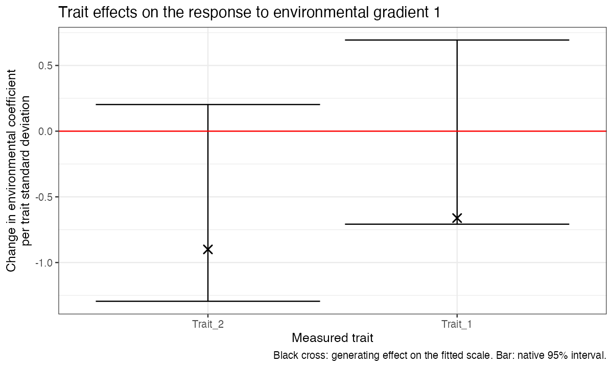
```

```{r native-traits-gradient-2, eval=FALSE, purl=TRUE}
native_traits_2 <- occJSDM::plotTraitsCoefficients(
  fitmodel, covName = "X_psi.EnvCov.2"
) +
  native_trait_theme +
  geom_point(
    data = filter(native_trait_truth, covariate == "X_psi.EnvCov.2"),
    aes(x = trait, y = truth), inherit.aes = FALSE,
    shape = 4, size = 3, stroke = 1
  ) +
  labs(
    title = "Trait effects on the response to environmental gradient 2",
    x = "Measured trait",
    y = "Change in environmental coefficient\nper trait standard deviation",
    caption = "Black cross: generating effect on the fitted scale. Bar: native 95% interval."
  )

native_traits_2
```

```{r native-traits-gradient-2-image, echo=FALSE, purl=FALSE, out.width="100%"}
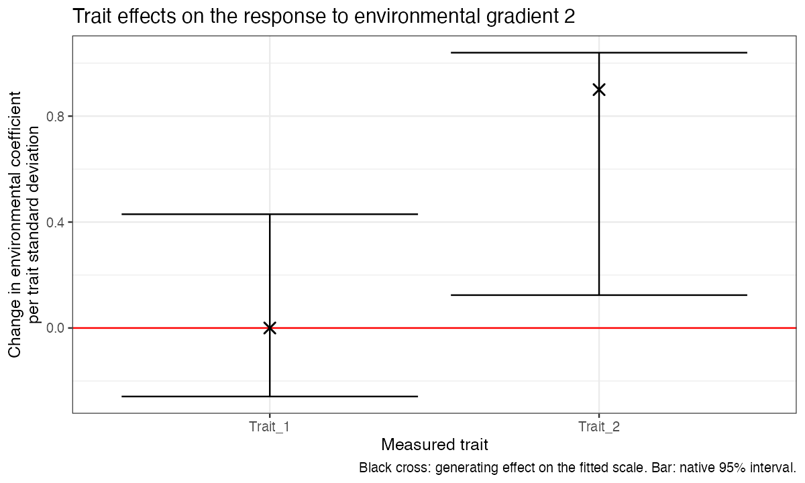
```

Read each bar against both references. Crossing the red line means the fitted interval includes zero; enclosing the black cross means it includes the generating effect. Those are separate questions. The native function orders traits by their lower interval endpoints, so match by the trait labels when comparing the two figures.

The plot draws intervals only. To report point estimates beside them, or to sort and filter trait-by-environment pairs, summarise the posterior array yourself. `returnTraitsCoeff()` returns draws with dimensions `[draw, environmental covariate, trait]`, with names on the last two. The recipe below builds one row per pair and works for any posterior array this package returns, such as `returnOccupancyCovariates()` or `returnCollectionCovariates()`, after adjusting the dimension names.

```{r summarise-trait-array, eval=FALSE}
trait_draws <- occJSDM::returnTraitsCoeff(fitmodel)

trait_summary <- expand_grid(
  covariate = dimnames(trait_draws)[[2]],
  trait = dimnames(trait_draws)[[3]]
) |>
  rowwise() |>
  mutate(
    draws = list(trait_draws[, covariate, trait]),
    mean = mean(draws),
    lower = quantile(draws, 0.025),
    upper = quantile(draws, 0.975)
  ) |>
  ungroup() |>
  select(-draws) |>
  arrange(covariate, lower)

trait_summary
```

`expand_grid()` lists every covariate-by-trait pair, `rowwise()` lets each row pull its own vector of draws, and the three summaries are computed from that vector. The result is an ordinary tibble that can be filtered, joined to the generating values, or passed to `ggplot2`.

### A real cancellation inside this simulated community

The model allows a species' environmental response to combine three contributions: its measured traits, unmeasured species traits, and remaining species differences. These are distinct from the **site** factors used to describe unmeasured conditions at sites.

In these ten species, Trait_1 happens to correlate with the unmeasured species trait (`r round(outputs$trait_hidden_correlation["Trait_1", 1], 2)`). The generator drew these traits independently; a small realized sample can still contain a substantial correlation. For environmental gradient 1, the resulting contributions oppose one another.

The following is an **oracle diagnostic**, possible only because we have the simulation truth. Regress the known species environmental coefficients on both measured traits, then repeat the regression for each generating contribution. Because these regressions use the same predictors, the contributions add to the observed relationship among these ten species.

```{r oracle-trait-regression}
species_comparison <- lesson$input$sim$data_list$traits |>
  as_tibble() |>
  mutate(across(everything(), ~ as.numeric(scale(.x)))) |>
  mutate(true_response = known_truth$jsdmParams_true$B[1, ])

oracle_regression <- lm(
  true_response ~ Trait_1 + Trait_2,
  data = species_comparison
)

enframe(coef(oracle_regression), name = "term", value = "relationship") |>
  knitr::kable(digits = 3)
```

The coefficient of Trait_1 here describes the net relationship in the ten generated species, after adjusting for Trait_2. It is not the isolated generating effect of Trait_1. The decomposition below shows the difference.

```{r trait-cancellation, fig.height=4.5}
cancellation <- outputs$trait_components |>
  filter(trait == "Trait_1", covariate == "X_psi.EnvCov.1") |>
  select(component, value)

cancellation <- bind_rows(
  cancellation,
  tibble(
    component = "Net relationship among these ten species",
    value = sum(cancellation$value)
  )
)

cancellation |>
  mutate(component = factor(component, levels = rev(component))) |>
  ggplot(aes(x = value, y = component)) +
  geom_vline(xintercept = 0, colour = "grey55") +
  geom_col(fill = "#595959", width = 0.6) +
  geom_text(aes(label = sprintf("%+.2f", value)),
            hjust = ifelse(cancellation$value >= 0, -0.15, 1.15)) +
  scale_x_continuous(expand = expansion(mult = 0.18)) +
  labs(
    x = "Contribution to the Trait_1 relationship with environmental response 1",
    y = NULL,
    caption = "All four bars come from known simulation components; none is an estimated occJSDM effect."
  )
```

The negative generating effect is about `r round(cancellation$value[1], 2)`, but the unmeasured-trait contribution is about `r round(cancellation$value[2], 2)`. After adding the remaining differences, the net relationship among the ten species is only `r round(tail(cancellation$value, 1), 2)`. The model must disentangle these overlapping sources using imperfectly estimated species responses. This explains why simply knowing that we put a nonzero effect into the simulator is not a guarantee that its interval will exclude zero.

This is a diagnosis of **this simulation**, not proof that all weak trait results have this cause. It also does not establish the cause of an older fit whose generating values were not saved. A larger, replicated species-sample experiment would be needed to measure how much additional species information helps.

## Residual species associations: did we recover what was put in?

The residual correlation describes the model's shared hidden site component. It is not the raw correlation of PCR detections, and it does not establish a biological interaction between species. Even after supplying every measured environmental covariate, this simulation still contains the deliberately generated hidden site factors.

```{r extract-correlations, eval=FALSE}
residual_correlations <- occJSDM::returnResidualCorrelationMatrix(fitmodel)

# First dimension: lower limit, median, upper limit.
median_correlations <- residual_correlations[2, , ]
```

```{r correlation-truth, fig.height=5}
correlation_plot <- outputs$correlations |>
  filter(arm == "default") |>
  select(species1, species2, Truth = truth, Estimate = estimate) |>
  pivot_longer(c(Truth, Estimate), names_to = "result", values_to = "correlation") |>
  mutate(
    species1 = factor(species1, levels = species_order),
    species2 = factor(species2, levels = rev(species_order)),
    result = factor(result, levels = c("Truth", "Estimate"))
  )

ggplot(correlation_plot, aes(x = species1, y = species2, fill = correlation)) +
  geom_tile() +
  facet_wrap(~ result) +
  scale_fill_gradient2(
    low = "#2166AC", mid = "white", high = "#B2182B",
    limits = c(-1, 1), na.value = "grey65"
  ) +
  coord_equal() +
  labs(x = NULL, y = NULL, fill = "Correlation",
       caption = "Estimate: posterior median. Grey truth cells have undefined correlation, not correlation zero.") +
  theme(axis.text.x = element_text(angle = 60, hjust = 1))
```

OTU_4 was generated with zero loading on both hidden site factors. Its hidden contribution has no variation, so its correlation with another hidden contribution is mathematically undefined. We show those true cells in grey and exclude them from numerical correlation-error summaries. Painting them white would incorrectly claim their true correlation was zero.

Compare the pattern and magnitude, not just whether an interval crosses zero. An apparently strong estimated correlation can still be far from the generating value.

## Ordination: compare the combined effect before naming the axes

The occupancy part of the model writes species $j$'s log-odds of occupying site $i$ as $\text{logit}(\psi_{ij}) = \beta_{0j} + X_i \beta_j + U_i L_j$. The first two terms are the intercept and the measured environmental effects. In the third, $U_i$ holds site $i$'s scores on the hidden factors and $L_j$ holds species $j$'s loadings on them. That product is what carries residual co-occurrence: species that load on the same factor rise and fall together across sites for reasons the measured covariates do not explain, whether an unmeasured gradient or an interaction. `returnOrdinationScores()` returns the hidden site scores $U$; `returnFactorLoadings()` returns the species loadings $L$. Multiplying a site's scores by a species' loadings gives their combined contribution to its occurrence predictor. Rotating both sets of axes, or reversing their signs together, can leave that contribution unchanged. Unaligned true and fitted axes are therefore a misleading accuracy comparison.

```{r extract-ordination, eval=FALSE}
site_scores <- occJSDM::returnOrdinationScores(fitmodel)
species_loadings <- occJSDM::returnFactorLoadings(fitmodel)

occJSDM::plotBiplot(fitmodel)
```

For a truth check, the exporter multiplies scores by loadings **within each posterior draw**, then averages the products. Multiplying the mean scores by the mean loadings would not give the same answer.

```{r ordination-contribution, fig.height=4.5}
ggplot(outputs$residual, aes(x = truth, y = estimate)) +
  geom_abline(intercept = 0, slope = 1, linetype = "dashed") +
  geom_point(alpha = 0.25, size = 1, colour = "#0072B2") +
  facet_wrap(~ arm, labeller = labeller(arm = fit_labels)) +
  coord_equal() +
  labs(
    x = "True combined hidden site contribution (log-odds)",
    y = "Estimated hidden site contribution\n(posterior mean, log-odds)",
    caption = "Each point is a species at a surveyed site. This comparison is invariant to factor rotation."
  )
```

The diagonal is exact recovery. Points closer to zero than their true values show underestimation of the hidden contribution's magnitude. These are fitted-site results: the observations at a site helped estimate its hidden scores.

### Read native ordination plots after aligning their axes

The combined contribution above avoids an ambiguity: a rotation or reflection of both the site scores and species loadings leaves every fitted occurrence probability unchanged. Axis 1 in two fits need not represent the same direction. The package already chooses a loading-based orientation at fitting, but that convention alone does not make an axis a biological quantity.

For this simulation we can use the **known species loadings** to orient every posterior draw. The orthogonal Procrustes calculation below finds the rotation or reflection that brings the fitted loadings closest to the generating loadings, without changing their lengths. We apply that same transformation to the site scores. This is a simulation-only aid: the true loadings would be unavailable for real observations. It removes orientation differences, not estimation error, and uses no true site scores to choose the rotation.

These plots use the PCR-observation fit, including all 6,000 retained iterations from each of four chains. We make a separate plotting copy. For a rotation matrix `rotation`, the transformed scores and loadings are `scores %*% rotation` and `t(rotation) %*% loadings`; their product is still `scores %*% loadings`. The exporter also verifies this for every draw.

```{r ordination-load-examples, purl=FALSE}
ordination_examples <- readRDS("teaching-data/ordination-examples.rds")
```

For an ordinary analysis, the same five native functions work directly on `fitmodel`, using the package's stored orientation:

```{r ordination-standard, eval=FALSE, purl=TRUE}
ordinary_site_quantiles <- occJSDM::returnOrdinationScores(fitmodel)
ordinary_loading_quantiles <- occJSDM::returnFactorLoadings(fitmodel)
ordinary_sites <- occJSDM::plotOrdinationScores(fitmodel)
ordinary_loadings <- occJSDM::plotFactorLoadings(fitmodel)
ordinary_biplot <- occJSDM::plotBiplot(fitmodel)
```

With the full `fitmodel` from Lesson 1, run this simulation comparison preparation once. `known_truth` is the generating parameter list loaded at the start of this lesson.

```{r ordination-align, eval=FALSE, purl=TRUE}
true_factors <- known_truth$jsdmParams_true
score_draws <- fitmodel$results_output$jsdm_output$U_output
loading_draws <- fitmodel$results_output$jsdm_output$L_output
aligned_scores <- score_draws
aligned_loadings <- loading_draws

for (chain in seq_len(dim(loading_draws)[4])) {
  for (iteration in seq_len(dim(loading_draws)[3])) {
    current_loadings <- loading_draws[, , iteration, chain]
    decomposition <- svd(current_loadings %*% t(true_factors$L))
    rotation <- decomposition$u %*% t(decomposition$v)

    aligned_scores[, , iteration, chain] <-
      score_draws[, , iteration, chain] %*% rotation
    aligned_loadings[, , iteration, chain] <-
      crossprod(rotation, current_loadings)
  }
}

fit_for_ordination <- fitmodel
fit_for_ordination$results_output$jsdm_output$U_output <- aligned_scores
fit_for_ordination$results_output$jsdm_output$L_output <- aligned_loadings

# Match truth by the identities attached to the original simulation.
site_names <- as.character(fitmodel$infos$siteNames)
species_names <- fitmodel$infos$speciesNames
true_sites <- true_factors$U[
  match(site_names, rownames(known_truth$z_true)), , drop = FALSE
]
true_species <- true_factors$L[
  , match(species_names, colnames(known_truth$z_true)), drop = FALSE
]
site_truth <- tibble(site = site_names, x = true_sites[, 1], y = true_sites[, 2])
loading_truth <- tibble(
  species = species_names, x = true_species[1, ], y = true_species[2, ]
)

# Quantiles are 2.5%, 50% and 97.5%, pooled across all retained draws.
site_quantiles <- occJSDM::returnOrdinationScores(fit_for_ordination)
loading_quantiles <- occJSDM::returnFactorLoadings(fit_for_ordination)

# Choose sites by their original order, before inspecting their estimates.
shown_sites <- site_names[seq(1, length(site_names), by = 10)]
score_comparison <- site_truth |>
  mutate(
    estimate = site_quantiles["50%", site, 1],
    lower = site_quantiles["2.5%", site, 1],
    upper = site_quantiles["97.5%", site, 1]
  ) |>
  filter(site %in% shown_sites) |>
  select(site, truth = x, estimate, lower, upper)
```

The native return functions provide arrays, with quantile first, then site and factor for scores, or factor and species for loadings. Here is the first aligned coordinate for the ten displayed sites. These are summaries **after truth-assisted orientation**, not estimates of an intrinsically labelled ecological axis.

```{r ordination-score-table, purl=FALSE}
ordination_examples$score_comparison |>
  knitr::kable(digits = 2, caption = "First aligned site coordinate: truth and posterior quantiles.")
```

#### Site scores: what differs among locations?

The native plot places each site label at its posterior median. We show the same ten sites in separate panels with common axes to keep the figure readable. A black cross marks the generating score; a dotted connector identifies the corresponding estimate. Sites close together have similar fitted residual scores, after the measured environmental effects have been accounted for. This is a factor-space comparison, not a geographical map.

```{r ordination-sites, eval=FALSE, purl=TRUE}
native_sites <- occJSDM::plotOrdinationScores(fit_for_ordination)
site_plot_data <- native_sites$data |>
  mutate(name = as.character(name), site = name) |>
  filter(site %in% shown_sites) |>
  left_join(site_truth, by = "site", suffix = c("", "_truth"))

native_sites$data <- site_plot_data
native_sites <- native_sites +
  geom_segment(
    data = site_plot_data,
    aes(x = x, y = y, xend = x_truth, yend = y_truth),
    inherit.aes = FALSE, linetype = "dotted", colour = "grey35"
  ) +
  geom_point(
    data = site_truth |>
      filter(site %in% shown_sites) |>
      mutate(name = site),
    aes(x = x, y = y), inherit.aes = FALSE, shape = 4, size = 3
  ) +
  facet_wrap(~ name, ncol = 5) +
  coord_equal() +
  labs(
    title = "Ten sites in aligned factor space",
    caption = "Black crosses: truth. Labels: fitted medians. Circles summarize marginal interval widths."
  )

native_sites
```

```{r ordination-sites-image, echo=FALSE, purl=FALSE, out.width="100%"}
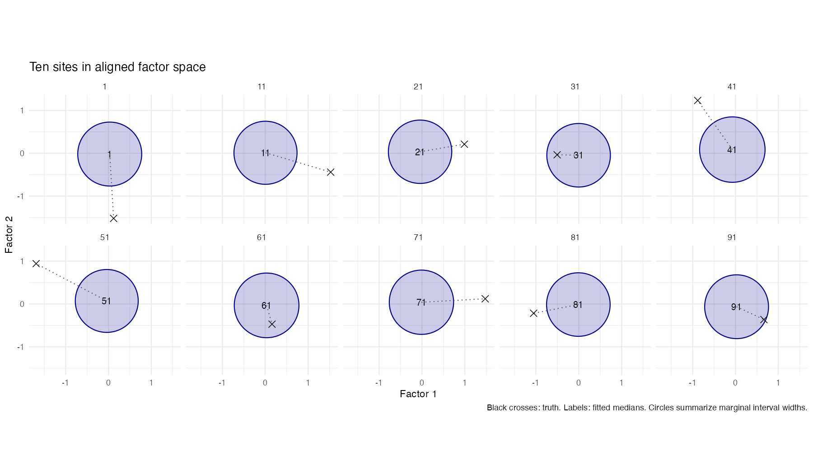
```

Here the site medians cluster near zero despite quite different generating scores. Alignment has not recovered those site differences precisely. The circles are a visual summary of uncertainty, **not 95% joint credible regions**. The native function gives each circle the area of the rectangle formed by the two marginal 95% intervals: its radius is `sqrt(width_1 * width_2 / pi)`. It does not use the joint shape of the posterior cloud. Consult the returned marginal quantiles for interval values; a truth cross inside a circle is not a formal coverage test.

#### Species loadings: how does each species respond to the factors?

A loading is a species' response to a unit change in a hidden site score, on the occurrence log-odds scale. Opposite loading directions indicate opposite residual responses. They do not establish competition, facilitation or another causal interaction.

```{r ordination-loadings, eval=FALSE, purl=TRUE}
native_loadings <- occJSDM::plotFactorLoadings(fit_for_ordination)
loading_plot_data <- native_loadings$data |>
  mutate(species = as.character(name)) |>
  left_join(loading_truth, by = "species", suffix = c("", "_truth"))

native_loadings$data <- loading_plot_data
native_loadings <- native_loadings +
  geom_segment(
    data = loading_plot_data,
    aes(x = x, y = y, xend = x_truth, yend = y_truth),
    inherit.aes = FALSE, linetype = "dotted", colour = "grey35"
  ) +
  geom_point(
    data = mutate(loading_truth, name = species), aes(x = x, y = y),
    inherit.aes = FALSE, shape = 4, size = 3
  ) +
  facet_wrap(~ name, ncol = 5) +
  coord_equal() +
  labs(
    title = "Species responses to the aligned factors",
    caption = "Black crosses: true loadings. Labels: fitted medians. Circles are not joint credible regions."
  )

native_loadings
```

```{r ordination-loadings-image, echo=FALSE, purl=FALSE, out.width="100%"}
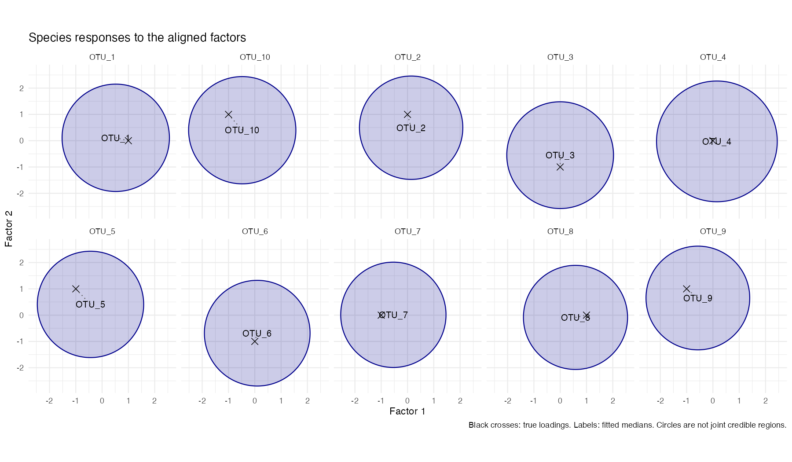
```

Each species has its own panel with common axes. Several species have identical generating loadings, so their truth crosses coincide. OTU_4 has zero generating loadings and sits at the origin. The fitted loadings need not be exactly zero or identical even after alignment.

#### Biplot: put sites and species together

The biplot uses all 100 sites and the ten species. Grey points are fitted site medians; blue arrows are fitted loading medians. The dashed black arrows are the generating loadings, multiplied by **the same display multiplier** as the blue arrows. Arrow lengths are rescaled for readability, so they are not on the site-score scale and are not direct effect-size readings from this figure.

```{r ordination-biplot, eval=FALSE, purl=TRUE}
site_medians <- site_quantiles["50%", , ]
loading_medians <- loading_quantiles["50%", , ]
arrow_multiplier <- 0.8 *
  max(sqrt(rowSums(site_medians^2))) /
  max(sqrt(colSums(loading_medians^2)))

native_biplot <- occJSDM::plotBiplot(fit_for_ordination, arrow_scale = 0.8) +
  geom_segment(
    data = loading_truth,
    aes(x = 0, y = 0, xend = x * arrow_multiplier, yend = y * arrow_multiplier),
    inherit.aes = FALSE, linetype = "dashed", colour = "black",
    arrow = grid::arrow(length = grid::unit(0.15, "cm"))
  ) +
  coord_equal() +
  labs(
    title = "Sites and species in one aligned biplot",
    caption = "Grey: fitted sites. Blue: fitted species. Dashed black: true species, at the same display scale."
  )

native_biplot
```

```{r ordination-biplot-image, echo=FALSE, purl=FALSE, out.width="100%"}
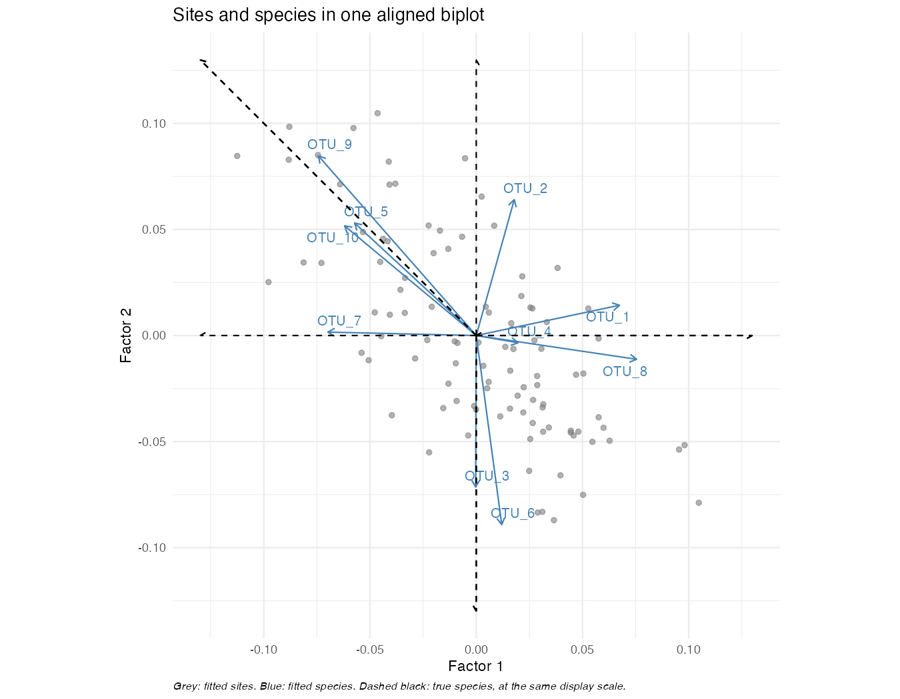
```

A site lying farther in a species-arrow direction tends to receive a larger contribution from these factors to that species' occurrence log-odds. The complete probability also includes the intercept and measured environmental effects. Because truth helped choose the orientation, agreement in arrow direction is not an independent accuracy check. This median biplot has no uncertainty display, and multiplying separate posterior medians does not reproduce the median of the draw-by-draw contribution. Use the invariant contribution comparison above to assess recovery of that contribution, and variation partitioning below to ask how large it is relative to the other model components.

## Variation partitioning: an allocation within the model

The package divides variation among environmental, spatial and residual-factor components. In this non-spatial example the spatial fraction is zero, so showing the environmental fraction is enough: the residual fraction is one minus it.

The package calls the residual fraction `Biotic`. That label does not mean it has identified biotic interactions. Here the hidden site factors were simulated directly, without simulating ecological interactions.

```{r extract-variation, eval=FALSE}
variation_table <- occJSDM::returnVariancePartitioning(fitmodel)
```

```{r variation-truth, fig.height=4.5}
outputs$variation |>
  filter(component == "Environmental") |>
  ggplot(aes(x = truth, y = estimate, label = species)) +
  geom_abline(intercept = 0, slope = 1, linetype = "dashed") +
  geom_point(colour = "#0072B2", size = 2) +
  geom_text(
    aes(hjust = if_else(truth > 0.9, 1.1, 0.5)),
    nudge_y = 0.025, size = 2.8, check_overlap = TRUE
  ) +
  facet_wrap(~ arm, labeller = labeller(arm = fit_labels)) +
  scale_x_continuous(labels = scales::label_percent(), limits = c(0, 1)) +
  scale_y_continuous(labels = scales::label_percent(), limits = c(0, 1)) +
  coord_equal() +
  labs(x = "True environmental fraction", y = "Estimated environmental fraction",
       caption = "Matching package definition on the same sites. Estimates are posterior means.")
```

The true fractions use the same package definition as the estimates: changes in the standard deviation of probabilities when model components are combined, with negative increments truncated and contributions normalized. They are not a generic fraction of raw detection variance explained. That definition matters when comparing this plot with another package's variation partitioning.

For OTU_4, the true environmental fraction is 100% because its hidden site contribution is zero. The estimate does not automatically discover that fact. Other points above the diagonal allocate too much to the environment under this definition; points below it allocate too little. Good-looking occupancy predictions do not guarantee correct attribution among components.

Why does the PCR fit still allocate variation to hidden site factors when their average contributions in the preceding figure are so close to zero? Each posterior draw can contain substantial positive and negative contributions. If the draws disagree about a site's contribution, those values can cancel when averaged. The partition is instead calculated within each draw and then averaged. A contribution whose average is near zero can therefore still account for variation within individual draws.

## Collection effects and detection probabilities

Collection covariates predict whether DNA enters a field sample, conditional on the species being present at the site. They are separate from the environmental covariates predicting the species' distribution.

```{r collection-effects, fig.height=4}
outputs$collection |>
  filter(covariate == "X_theta") |>
  mutate(species = factor(term, levels = species_order)) |>
  ggplot(aes(x = species)) +
  geom_hline(yintercept = 0, colour = "grey55", linetype = "dashed") +
  geom_pointrange(aes(y = estimate, ymin = lower, ymax = upper), colour = "#0072B2") +
  geom_point(aes(y = truth), shape = 4, size = 3) +
  labs(x = "Species", y = "Collection effect\n(per covariate standard deviation)",
       caption = "Black cross: truth. Blue: posterior mean and 95% interval. Compare on the same standardized scale.") +
  theme(axis.text.x = element_text(angle = 60, hjust = 1))
```

Use `returnCollectionCovariates()` to extract these draws. [Lesson 1](occJSDM-lesson-1.md) compares true and estimated PCR detection, laboratory false-positive and field-contamination probabilities, and shows why their values alone cannot classify every positive detection correctly. Its truth accounts for whether simulated reads actually pass the fitted threshold.

### Would more field samples or PCR replicates help detection?

Consider a deliberately restricted question: **if all ten species occupy a site, how many do we expect to detect truly at least once?** Hold collection conditions at their mean, use both primers, and count only detections arising from collected DNA. False-positive detections are excluded from this calculation. This is neither landscape richness nor the number of species an analysis will correctly infer to be present.

For one species, let `theta` be collection probability and `p1`, `p2` the two primer detection probabilities. With `K` PCRs per primer, the probability of missing collected DNA in every PCR is `(1 - p1)^K * (1 - p2)^K`. Combine this with collection failure, then with `M` independent field samples:

```{r expected-detections-formula, eval=FALSE}
missed_in_pcr <- (1 - p1)^K * (1 - p2)^K

detected_in_one_sample <- theta * (1 - missed_in_pcr)

detected_in_any_sample <- 1 - (1 - detected_in_one_sample)^M

expected_species_detected <- sum(detected_in_any_sample)
```

The exporter applies that formula to the known probabilities and to every posterior draw. The ribbons below describe uncertainty in the **expected number**, not the wider variation in the number a single survey might actually detect. The package's `plotCumulativeSpeciesDetections()` instead simulates survey outcomes; do not equate its interval with this interval for an expectation.

```{r detection-effort, fig.height=5}
outputs$detection_effort |>
  mutate(samples = factor(M)) |>
  ggplot(aes(x = K)) +
  geom_ribbon(aes(ymin = lower, ymax = upper), fill = "#0072B2", alpha = 0.2) +
  geom_line(aes(y = estimate), colour = "#0072B2", linewidth = 0.8) +
  geom_line(aes(y = truth), linetype = "dashed", linewidth = 0.8) +
  facet_wrap(~ samples, ncol = 2, labeller = label_both) +
  scale_x_continuous(breaks = 1:6) +
  scale_y_continuous(limits = c(0, 10)) +
  labs(
    x = "PCR replicates per primer (two primers)",
    y = "Expected species detected out of ten",
    caption = "samples = field samples per site. Black dashed: truth. Blue: posterior mean and 95% interval."
  )
```

Repeated PCRs cannot recover DNA that never entered the field sample. That is why the one-sample curve levels off even when PCR replication increases. Another independent field sample gives another opportunity to collect the species' DNA. These curves hold the fitted parameter distribution fixed; they do not measure how collecting more data would improve a refitted model.

## Distinguish fitted probabilities, occupancy states and new-site predictions

`computePredictiveOccupancyProbs()` returns the fitted ecological probability at surveyed sites. Despite its name, the fitted site factors were learned using the observations. Calling it a prediction based only on measured environmental covariates is incomplete.

`computeConditionalOccupancyProbs()` summarizes the model's belief that the species actually occupied the surveyed site, accounting for the observation process. Its appropriate simulation check is the realized 0/1 state, not the generating probability. [Lesson 1](occJSDM-lesson-1.md) puts these quantities alongside the actual simulated detection cases, with maps in Lesson 0.

Which one should a study report? [Ji et al. (2025)](#references-and-further-reading) reported the predictive probabilities, because they are estimated from the environmental relationships learned across all sites and are therefore less sensitive to the handful of detections at any one site. The conditional probability moves with that site's own PCR results, so a single contaminated or failed sample can shift it substantially. The two are most useful together: a site where the conditional probability is high but the predictive probability is low is one where weak positive evidence overrode unfavourable covariates, and the reverse pattern marks a site the model believes occupied despite few detections. Their Supplementary Information 12 works through such cases; Lesson 1's worked detections do the same on this simulation.

`returnLatentPresences()` and `plotLatentPresences()` collect those fitted quantities by site, sample and primer. The next section demonstrates them on this lesson's own simulation, so the observations, estimates and truth all refer to the same records.

Genuine prediction at an unsurveyed site requires keeping its observations out of fitting and averaging appropriately over its unknown conditions. Reusing the fitting sites' covariates is not an independent prediction test. The new-site example below supplies 300 independently generated sites that neither model has seen. Spatial prediction remains part of the planned Lesson 2.

## Predict occupancy at genuinely new sites

Imagine receiving habitat measurements from a second survey area before collecting any eDNA there. Can the fitted model predict which species are likely to occur? To answer this, we generated **300 new sites** from the same environmental distribution and the same ten-species community. Neither the new presence/absence observations nor the hidden site conditions were supplied to either fit.

The original training survey is unchanged: 100 sites, two field samples per site, two primers and six PCR replicates per primer per sample. We compare its existing two-factor PCR fit with a new one-factor fit. Both use the same observations, environmental covariates, traits, priors and MCMC settings. The only model-setting change is the number of hidden site factors. The generating community has two factors, but that does not guarantee that two fitted factors will predict more accurately from this amount of data.

```{r prediction-load}
prediction_examples <- readRDS("teaching-data/prediction-lesson.rds")

prediction_labels <- c(
  one_factor = "One hidden site factor",
  two_factors = "Two hidden site factors"
)

new_habitat <- as.data.frame(prediction_examples$input$raw_covariates)

head(new_habitat) |>
  knitr::kable(digits = 2, caption = "Raw environmental values at the first six new sites.")
```

Site identifiers run from 101 to 400, so they cannot be mistaken for the training sites numbered 1 to 100. Their two environmental variables were drawn independently from the original Normal distribution with mean zero and standard deviation 10. The fitted model standardizes them using the **training** means and standard deviations. Recalculating those constants from the new sites would change the meaning of the fitted coefficients.

There are `r sum(prediction_examples$input$outside_training_range)` new sites with at least one environmental value outside the observed training range. We retain and flag them rather than remove difficult cases. These are new draws from the same distribution, not a test of prediction in a different climate, a different species community or a spatially separated region.

### Which true probability should a new-site prediction recover?

Two probabilities are useful here. They answer different questions.

1. **Probability given this site's actual local conditions.** The simulator knows the measured environment and the hidden site factors. Together they determine the site's generating occupancy probability. The actual presence or absence is then a random draw using that probability.
2. **Probability given only the measured environment.** An ecologist visiting a new site does not yet know its hidden conditions. We average occupancy probabilities over the range of possible hidden conditions. This is the relevant probability for predicting presence or absence using the available habitat measurements.

The second is often called a **marginal probability**, because the unmeasured conditions have been averaged out. The first is a **conditional probability**, because it assumes those conditions are known. Neither is the actual presence/absence observation, which is only zero or one.

Here is a concrete example from the simulation. The code uses the true parameters to show the distinction for OTU_6 at site 101. `plogis()` converts log-odds into a probability. `dnorm()` gives more weight to common hidden conditions and less weight to unusual ones; `integrate()` adds up their weighted probabilities.

```{r prediction-one-site-meaning}
true_parameters <- known_truth$jsdmParams_true
example_species <- match("OTU_6", species_order)
example_site <- match("101", rownames(new_habitat))

environmental_log_odds <-
  prediction_examples$input$environmental_eta[example_site, example_species]

hidden_sd <- lesson$input$jsdm$sigma_h *
  sqrt(sum(true_parameters$L[, example_species]^2))

average_over_hidden_conditions <- integrate(
  function(hidden) {
    plogis(environmental_log_odds + hidden_sd * hidden) * dnorm(hidden)
  },
  lower = -Inf,
  upper = Inf
)$value

site_example <- prediction_examples$truth |>
  filter(Site == "101", species == "OTU_6")

tibble(
  quantity = c(
    "True probability with actual hidden conditions",
    "True probability averaged over unknown conditions",
    "Probability with hidden contribution set to zero",
    "Actual presence (1) or absence (0)"
  ),
  value = c(
    site_example$conditional_truth,
    average_over_hidden_conditions,
    plogis(environmental_log_odds),
    site_example$z
  )
) |>
  knitr::kable(digits = 3)
```

For this species and site, the true probability is about **93% with its actual hidden conditions**, or **82% when we know only the measured habitat**. The species happens to be present. Predicting 82% before seeing that observation can be appropriate even though the conditional probability is 93%. Presence alone does not tell us which probability generated it.

Setting the hidden contribution to zero is a third calculation. It is the target of the earlier response profiles, but is generally different from averaging probabilities over unknown conditions. The inverse-logit curve is nonlinear, so “convert the average log-odds” and “average the converted probabilities” need not agree.

### Use the package's new-site prediction function

With a full saved PCR fit loaded as `fitmodel`, the native call below predicts the ten sites selected before fitting or inspecting results. Supply raw environmental values with the same column names as in training. This is a non-spatial example.

```{r prediction-native-call, eval=FALSE}
shown_habitat <- new_habitat[prediction_examples$input$selected_sites, , drop = FALSE]

set.seed(prediction_examples$input$public_prediction_seed)

new_site_quantiles <- occJSDM::predictNewSites(
  fitmodel,
  X_psi = shown_habitat,
  useSpatial = FALSE,
  confidence = 0.95,
  verbose = FALSE
)

# The returned array is quantile by site by species, without dimension names.
# Its three slices are the lower limit, median and upper limit.
tibble(
  Site = rownames(shown_habitat),
  lower = new_site_quantiles[1, , 1],
  median = new_site_quantiles[2, , 1],
  upper = new_site_quantiles[3, , 1]
)
```

For each retained parameter draw, `predictNewSites()` also draws new hidden conditions. Its interval therefore includes uncertainty about those conditions as well as uncertainty about the fitted parameters. Compare that interval with the simulator's **conditional probability for the site's actual conditions**. It is not a confidence interval for a binary presence/absence observation, and its middle slice is a **median**, not a posterior mean.

```{r prediction-native-intervals, fig.height=5.5}
native_prediction_examples <- prediction_examples$public |>
  filter(arm == "two_factors", species %in% c("OTU_1", "OTU_6")) |>
  mutate(Site = factor(Site, levels = prediction_examples$input$selected_sites))

ggplot(native_prediction_examples, aes(x = Site)) +
  geom_pointrange(
    aes(y = median, ymin = lower, ymax = upper),
    colour = "#0072B2"
  ) +
  geom_point(aes(y = conditional_truth), shape = 4, size = 3, stroke = 1) +
  facet_wrap(~ species) +
  scale_y_continuous(labels = scales::label_percent(), limits = c(0, 1)) +
  labs(
    x = "New site",
    y = "Occupancy probability",
    caption = paste(
      "Blue: native median and 95% interval, including unknown local conditions.",
      "Black cross: true probability with the site's actual hidden conditions.",
      sep = "\n"
    )
  )
```

The wide intervals are informative: habitat alone leaves considerable uncertainty about a particular site's occupancy probability. Seeing truth inside an interval is a useful check, but these twenty examples cannot establish an overall coverage rate.

### Check point predictions against the appropriate truth

For a single probability prediction, we use the **posterior mean of probabilities averaged over unknown conditions**. The exporter performs the same kind of averaging illustrated by `integrate()` above, using every retained parameter draw, then averages across all 24,000 draws. This removes additional noise from repeatedly drawing hypothetical conditions. It does not remove uncertainty or Monte Carlo error in the fitted parameters. The development helper is separate from the package's public `predictNewSites()` function.

In the next figure, both axes refer to probability given **only the measured environment**. Each point represents one species at one new site. The diagonal is exact agreement. Points above it are overestimates; points below it are underestimates. The two fits produce very similar predictions.

```{r prediction-marginal-recovery, fig.height=5}
prediction_cells <- prediction_examples$cells |>
  mutate(model = unname(prediction_labels[arm]))

ggplot(prediction_cells, aes(x = truth, y = estimate)) +
  geom_abline(intercept = 0, slope = 1, linetype = "dashed") +
  geom_point(
    aes(shape = outside_training_range),
    alpha = 0.25, size = 1.1, colour = "#0072B2"
  ) +
  facet_wrap(~ model) +
  scale_shape_manual(
    values = c(`FALSE` = 16, `TRUE` = 4),
    labels = c(`FALSE` = "Within training ranges", `TRUE` = "Beyond at least one range")
  ) +
  scale_x_continuous(labels = scales::label_percent(), limits = c(0, 1)) +
  scale_y_continuous(labels = scales::label_percent(), limits = c(0, 1)) +
  coord_equal() +
  labs(
    x = "True probability averaged over hidden conditions",
    y = "Predicted probability (posterior mean)",
    shape = "New site's environment",
    caption = "3,000 species-site probabilities per model. Diagonal: exact recovery."
  ) +
  theme(legend.position = "bottom")
```

Calculate the average direction and size of the errors separately. A negative signed error means underestimation on average. Absolute errors count both overestimates and underestimates as positive distances, so they cannot cancel.

```{r prediction-probability-errors}
prediction_cells |>
  group_by(model) |>
  summarise(
    `Signed error (percentage points)` = 100 * mean(estimate - truth),
    `Absolute error (percentage points)` = 100 * mean(abs(estimate - truth)),
    `RMSE (percentage points)` = 100 * sqrt(mean((estimate - truth)^2)),
    .groups = "drop"
  ) |>
  knitr::kable(digits = 2)
```

Both models underestimate these probabilities by about **3.8 percentage points on average**, while their **average absolute error is about 10 percentage points**. Those are results from this simulation, not hypothetical examples. The difference between the two error measures means that errors in opposite directions partially cancel. An absolute error of ten points would be a prediction of 40% or 60% when truth is 50%; that last sentence is only an illustration of the unit, not a claim that all errors equal ten points.

These new-site errors have a different target from Lesson 1's errors in fitted-site probabilities. Here we average over unknown local conditions; there we check the probability for each surveyed site's actual conditions. Comparing their magnitudes as if they measured the same task would be misleading.

### Compare models using what actually occurred

In a real new survey we would not know the generating probabilities. If we could establish the actual presence/absence states accurately, we could score the predictions against those states instead. The simulated new survey gives us exactly those binary states, without collection or PCR error.

The **Brier score** is the squared difference between the predicted probability and the zero-or-one outcome. The **negative log score** penalizes confidently wrong predictions especially strongly. Smaller is better for both. Neither is measured in percentage points, and neither is an absolute error in the unknown probability. Even the true generating probabilities can have nonzero scores because presence/absence is random.

```{r prediction-observed-scores}
observed_scores <- prediction_cells |>
  mutate(
    brier = (estimate - z)^2,
    negative_log_score = -if_else(z == 1, log(estimate), log1p(-estimate))
  )

observed_scores |>
  group_by(model) |>
  summarise(
    Brier = mean(brier),
    `Negative log score` = mean(negative_log_score),
    .groups = "drop"
  ) |>
  knitr::kable(digits = 5)
```

Both models predict the **same new sites**, so compare their scores in pairs. Species at a site share hidden conditions; treating 3,000 species-site outcomes as independent would exaggerate the amount of independent evidence. We first average across the ten species within each site, then calculate differences across the 300 sites.

```{r prediction-paired-scores}
paired_sites <- observed_scores |>
  group_by(Site, arm) |>
  summarise(Brier = mean(brier), .groups = "drop") |>
  pivot_wider(names_from = arm, values_from = Brier) |>
  mutate(difference = one_factor - two_factors)

paired_sites |>
  summarise(
    `Mean Brier difference` = mean(difference),
    `Standard error across sites` = sd(difference) / sqrt(n())
  ) |>
  knitr::kable(digits = 7)
```

The difference is about **-0.00014 Brier units**, slightly favouring the one-factor fit in this particular experiment. The site-based standard error is about **0.000067**. It describes variation among new sites **conditional on these fitted predictions**. It excludes Monte Carlo error in the MCMC estimates, variation from repeating the original training survey, and changes to the simulated community. A site-only interval can therefore exclude zero without establishing a dependable model advantage.

An independent calculation from all retained posterior draws estimates the Monte Carlo standard error of that Brier-score difference at about **0.00025**, larger than the observed difference of 0.00014. This is numerical uncertainty from MCMC, a different source of uncertainty from the site-based standard error. It directly supports withholding a model ranking. The calculation uses a first-order approximation and is documented in the prediction verifier.

The broad result is that these two fits have nearly identical predictive performance here. We do not select a winning factor count from this tiny difference. Predicting each species' marginal occurrence also does not test whether the model has recovered joint community structure or the correct number of hidden ecological drivers. A model can give useful single-species probabilities while describing species associations poorly.

### Check the additional fit and understand the WAIC limitation

To reproduce the additional fit, use the same training data and settings as the baseline, changing `n_factors`. This command is displayed but does not run when knitting.

```{r prediction-fit-one-factor, eval=FALSE}
set.seed(prediction_examples$input$fitting_seed)

fit_one_factor <- occJSDM::runOccJSDM(
  data = lesson$input$sim$data_list,
  occCovariates = colnames(new_habitat),
  collCovariates = "X_theta",
  spatCovariates = NULL,
  threshold = 1,
  listParams = list(n_factors = 1, n_lattrait = 1),
  MCMCparams = prediction_examples$manifests$two_factors$mcmc,
  listPriors = prediction_examples$manifests$two_factors$priors,
  summarisedLatentPresences = TRUE
)
```

Each model has four chains, 3,000 burn-in iterations and 6,000 retained iterations per chain, with no thinning. The additional fit produced no warnings. The following table checks both the public parameter diagnostics and diagnostics for each species' predicted probability averaged across the 300 new sites. Rhat and effective sample size check MCMC behaviour; they do not have ecological true values to overlay.

```{r prediction-diagnostics}
prediction_examples$diagnostics |>
  group_by(arm) |>
  summarise(
    `Parameter rows` = n(),
    `Missing or flagged rows` = sum(
      is.na(rhat) | is.na(ess) | rhat > 1.01 | ess < 400
    ),
    .groups = "drop"
  ) |>
  left_join(
    prediction_examples$probability_diagnostics |>
      group_by(arm) |>
      summarise(
        `Largest prediction Rhat` = max(rhat),
        `Smallest prediction ESS` = min(ess),
        `Largest prediction MCSE (percentage points)` = 100 * max(mcse),
        .groups = "drop"
      ),
    by = "arm"
  ) |>
  mutate(model = unname(prediction_labels[arm])) |>
  select(model, everything(), -arm) |>
  knitr::kable(digits = 3)
```

There are no flagged rows under these checks. Nevertheless, the largest Monte Carlo standard error of a species' average predicted probability is about 0.39 percentage points. This measures numerical uncertainty remaining in that posterior mean, not ecological prediction error. Passing the diagnostic thresholds does not make tiny differences between model scores exact.

The old walkthrough extracted WAIC to compare model specifications. Here is the current extraction syntax, followed by the values from these same-data fits:

```{r prediction-extract-waic, eval=FALSE}
occJSDM::extractWAIC(fitmodel)
occJSDM::extractWAIC(fit_one_factor)
```

```{r prediction-waic-values}
tibble(
  model = unname(prediction_labels[names(prediction_examples$manifests)]),
  `Current extractWAIC value` = vapply(
    prediction_examples$manifests, function(fit) fit$waic, numeric(1)
  )
) |>
  knitr::kable(digits = 2)
```

**Do not use this table to choose the better model for unsurveyed sites.** The current calculation combines likelihood terms for the sampled, unobserved site and collection states with terms for the PCR observations. Those hidden states are learned using the training observations. It does not average them out to evaluate the probability of new observations at a new site. Matching the training dataset is necessary for comparison, but does not by itself fix this difference in target. The independent-site scores above provide the worked predictive comparison. A validated observed-data WAIC or site-level cross-validation workflow remains separate work.


## Put the observations, inferred states and truth in one table

The native latent-presence table answers a practical question: **what did we observe, and what does the fitted model think happened at this site and in this sample?** A row is one PCR observation for one species. The same inferred site probability therefore repeats across that site's samples and PCRs. Repeated entries are not additional independent estimates.

For your own full fit, these two calls extract the table and display it. Match the species name to the fitted names instead of assuming that a particular column is always the species you want.

```{r extract-native-latent-table, eval=FALSE}
species_index <- match("OTU_1", fitmodel$infos$speciesNames)
stopifnot(!is.na(species_index))

latent_presences <- occJSDM::returnLatentPresences(
  fitmodel,
  idx_species = species_index
)

occJSDM::plotLatentPresences(
  latent_presences,
  species_name = "OTU_1"
)
```

To keep knitting quick, the next chunk reads the exact tables exported from the saved default-prior fit. No estimates are recalculated or replaced with truth. We focus on OTU_1 at sites 2 and 3: the laboratory false-positive and weak true-detection cases selected in Lesson 1. Both field samples and both primers are retained at each site. The six PCRs within each sample/primer combination are numbered in their original observation order.

```{r choose-native-table-rows}
native_tables <- readRDS("teaching-data/latent-presence-lesson.rds")

latent_rows <- native_tables$tables |>
  filter(species == "OTU_1", Site %in% c(2, 3)) |>
  arrange(Site, Sample, Primer, PCR)

observed_truth <- lesson$observations |>
  select(
    species, Site, Sample, Primer, PCR,
    TrueSite = z, TrueSample = w, Source = source
  )

state_table <- latent_rows |>
  left_join(
    observed_truth,
    by = c("species", "Site", "Sample", "Primer", "PCR"),
    relationship = "one-to-one"
  )
```

The join uses the species and all observation identifiers. It would be unsafe to attach truth by position after sorting or filtering either table. `relationship = "one-to-one"` also makes duplicate truth records an error instead of silently multiplying rows.

`TrueSite` and `TrueSample` are actual simulated states: 1 means present and 0 means absent. Their matching estimates are `CondOccProb` and `CondSampleProb`, which are probabilities between zero and one. `OTU` is the observed read count. `Source` reveals where a positive came from in the simulation; this information was never supplied to the fit.

```{r display-native-state-table}
state_columns <- c(
  "Site", "Sample", "Primer", "PCR", "OTU", "Source",
  "TrueSite", "CondOccProb", "TrueSample", "CondSampleProb"
)

native_state_table <- occJSDM::plotLatentPresences(
  state_table,
  species_name = "OTU_1",
  title = "Actual states beside the model's probabilities",
  columns = state_columns,
  container_height = 450
) |>
  gt::fmt_number(columns = c(PCR, TrueSite, TrueSample), decimals = 0) |>
  gt::fmt_percent(columns = c(CondOccProb, CondSampleProb), decimals = 1)

if (knitr::pandoc_to() %in% c("html", "html4", "html5")) {
  native_state_table
} else {
  state_table |>
    select(all_of(state_columns)) |>
    knitr::kable(digits = 3)
}
```

In HTML, colours group the sites and shades group samples and primers. They do not indicate confidence or whether the model is correct. Markdown shows the same records as an ordinary table; its probabilities are decimals rather than percentages.

At site 2, sample 3 has no OTU_1 DNA (`TrueSample = 0`), despite a positive PCR. OTU_1 nevertheless occupies the site (`TrueSite = 1`). This is a **laboratory false positive about the sample**, not evidence that the species must be absent from the entire site. At site 3, sample 6 genuinely contains DNA but gives only two positives across its twelve PCR observations. Read both samples together before judging the site's inferred state.

### Keep generating probabilities separate from actual states

The table's other three probabilities answer different questions. `PredOccProb` estimates the generating occupancy probability at a fitted site, including its learned hidden site contribution. `CollectionProb` estimates collection success **if the species is present at the site**. `DetectionProb` estimates a threshold-positive PCR **if its DNA is in the sample**. Neither collection nor detection probability is an unconditional prediction that an arbitrary PCR will be positive.

For these columns, compare probabilities with probabilities. The true site probabilities are already in the checked occupancy summaries. The true collection probability comes from the raw collection covariate and the simulator's collection intercept and slope. The true PCR probabilities below include the read-threshold adjustment explained in Lesson 1.

```{r join-native-probability-truth}
site_truth <- lesson$cells |>
  filter(arm == "default", species == "OTU_1") |>
  transmute(Site = as.numeric(Site), TrueOccupancy = truth)

truth_species_index <- match(
  "OTU_1",
  colnames(lesson$input$sim$data_list$OTU)
)

collection_coefficients <- lesson$input$sim$true_params$beta_theta_true[
  , truth_species_index
]

sample_truth <- lesson$input$sim$data_list$info |>
  distinct(Site, Sample, X_theta) |>
  mutate(
    TrueCollection = plogis(
      collection_coefficients[1] + collection_coefficients[2] * X_theta
    )
  ) |>
  select(Site, Sample, TrueCollection)

primer_truth <- lesson$rates |>
  filter(arm == "default", species == "OTU_1", param == "p") |>
  transmute(Primer = as.numeric(Primer), TrueDetection = truth)

probability_table <- latent_rows |>
  distinct(Site, Sample, Primer, PredOccProb, CollectionProb, DetectionProb) |>
  left_join(site_truth, by = "Site", relationship = "many-to-one") |>
  left_join(sample_truth, by = c("Site", "Sample"), relationship = "many-to-one") |>
  left_join(primer_truth, by = "Primer", relationship = "many-to-one")
```

```{r display-native-probability-table}
probability_columns <- c(
  "Site", "Sample", "Primer", "TrueOccupancy", "PredOccProb",
  "TrueCollection", "CollectionProb", "TrueDetection", "DetectionProb"
)

native_probability_table <- occJSDM::plotLatentPresences(
  probability_table,
  species_name = "OTU_1",
  title = "Generating probabilities beside their estimates",
  columns = probability_columns,
  container_height = 350
) |>
  gt::fmt_percent(columns = all_of(probability_columns[-c(1, 2, 3)]), decimals = 1)

if (knitr::pandoc_to() %in% c("html", "html4", "html5")) {
  native_probability_table
} else {
  probability_table |>
    select(all_of(probability_columns)) |>
    knitr::kable(digits = 3)
}
```

There are eight rows because these probabilities do not vary among repeated PCRs with the same site, sample and primer. Collection can vary between samples because `X_theta` varies. Detection varies by primer in this model. Inspecting the actual states in the first table and the generating probabilities in the second avoids treating a single success or failure as a probability estimate.

## Check computation as well as ecological recovery

An interval can be wide because the data contain little information, because model components are hard to separate, or because the sampler has not adequately explored its posterior. The figures alone do not distinguish those causes. Check the numerical diagnostics before interpreting uncertainty.

Think of each MCMC chain as a separate exploration of the parameter values that could explain the observations. After discarding the initial settling-in period, the chains should explore similar distributions. They need not take the same path or return the true value on every iteration. Our practical sequence is: obtain the diagnostics, identify individual parameters needing attention, inspect their traces, and decide whether further computation or investigation is needed.

### Get the diagnostics for your own fit

Use the `fitmodel` returned by `runOccJSDM()`. If you are reproducing our saved example instead, load its complete fit first:

```{r extract-full-fit-diagnostics, eval=FALSE}
saved_fit <- readRDS("/path/to/full-fits/default-fit.rds")
fitmodel <- saved_fit$fit

parameter_diagnostics <- occJSDM::returnConvergenceDiagnostics(fitmodel)

parameter_diagnostics |>
  select(param, label1, label2, rhat, ess)
```

There is one row per parameter, such as the collection effect for one species or the detection rate for one species and primer. `idx1` and `idx2` are positions in the saved arrays; `label1` and `label2` identify what those positions mean. A placeholder `"1"` in `label2` for a species-only parameter is not another species or primer.

| `param` | Ecological meaning | `label1` | `label2` |
|---|---|---|---|
| `beta0_psi` | Baseline occupancy on the log-odds scale | Species | Placeholder |
| `beta_psi` | Environmental effect on occupancy | Environmental covariate | Species |
| `beta_theta` | Collection intercept or covariate effect | `(Intercept)` or collection covariate | Species |
| `p` | Positive PCR probability when DNA is in the sample | Primer | Species |
| `q` | Positive PCR probability when DNA is absent from the sample | Primer | Species |
| `theta0` | Field-contamination probability when the species is absent from the site | Species | Placeholder |

The table also contains `mean`, `sd`, `q2.5` and `q97.5`: posterior summaries of the corresponding parameter. They are distinct from the numerical checks `rhat` and `ess`. The public function covers these six parameter blocks, **not every quantity in the model**. In particular, it omits the trait coefficients and the individual latent-factor arrays.

### Find the parameters that need attention

The following code uses the same public diagnostic table saved with each teaching fit. When working with your own model, replace the first assignment with the call above.

```{r flag-default-diagnostics}
parameter_diagnostics <- as_tibble(lesson$diagnostics$default)

flag_parameters <- function(diagnostics) {
  diagnostics |>
    mutate(
      unavailable = !is.finite(rhat) | !is.finite(ess),
      high_rhat = rhat > 1.01,
      low_ess = ess < 400
    ) |>
    filter(unavailable | high_rhat | low_ess) |>
    arrange(desc(unavailable), desc(rhat), ess)
}

flagged_default <- flag_parameters(parameter_diagnostics)

nrow(flagged_default)
```

For this default-prior fit, `r nrow(flagged_default)` rows need attention under this screen. An empty list means that the listed parameters pass these checks; it is not a certificate that all quantities have converged or that the ecological estimates are accurate. Missing diagnostics are flagged too. A missing Rhat can arise from having only one chain or a chain that never moved, so silently dropping missing values would hide a possible problem.

Now apply exactly the same screen to the **longer alternative-prior fit** from Lesson 1. That fit uses weaker low-contamination assumptions and has already been extended to four chains with 12,000 retained iterations each:

```{r flag-alternative-diagnostics}
flagged_alternative <- as_tibble(lesson$diagnostics$alternative) |>
  flag_parameters()

flagged_alternative |>
  select(param, label1, label2, rhat, ess, unavailable, high_rhat, low_ess) |>
  knitr::kable(digits = c(0, 0, 0, 4, 0, 0, 0, 0))
```

Here the rows identify the actual parameter to investigate. For example, `theta0` for OTU_6 has a low effective sample size even though its Rhat is just below 1.01. Looking at Rhat alone would miss that warning. The collection intercept for OTU_6 and the first environmental slope for OTU_1 are flagged for Rhat instead.

These are screening rules, not sharp boundaries between trustworthy and untrustworthy results. In this package revision, `returnConvergenceDiagnostics()` uses the classical `coda` Rhat and effective sample size calculations. The newer `posterior` calculations below use rank-normalized split-chain Rhat and distinguish bulk from tail ESS. Their numbers can differ; do not relabel the public `ess` column as bulk or tail ESS. The [Stan diagnostics guide](https://mc-stan.org/learn-stan/diagnostics-warnings.html) explains the newer diagnostics and the commonly used 1.01 Rhat screen. Our legacy ESS screen of 400 is a prompt to inspect precision, not a guarantee about every posterior summary.

### Read a traceplot for a collection covariate

A traceplot shows the sampled value against iteration, with a colour for each chain. First locate the collection covariate by name. The array has dimensions `[covariate, species, iteration, chain]`; `drop = FALSE` retains those four dimensions after selecting one covariate.

```{r extract-collection-trace, eval=FALSE}
collection_name <- "X_theta"
collection_index <- match(collection_name, colnames(fitmodel$X_theta))

stopifnot(!is.na(collection_index))

collection_draws <- fitmodel$results_output$beta_theta_output[
  collection_index, , , , drop = FALSE
]

occJSDM::plotTraceplot(
  collection_draws,
  param_name = "Collection effect (log-odds)",
  dimnames1 = collection_name,
  dimnames2 = fitmodel$infos$speciesNames
)
```

That call plots every species. For this page, the small saved bundle retains all draws and all four chains for OTU_1 and OTU_6 so the panels remain readable. These are excerpts of the full fit, not newly fitted models. We add the known collection effects on the **fitted standardized-covariate scale**, using the same scale conversion as the coefficient figure above.

```{r collection-trace, fig.height=5}
collection_trace <- diagnostic_examples$traces$collection

occJSDM::plotTraceplot(
  collection_trace$draws,
  param_name = "Collection effect (log-odds)",
  dimnames1 = collection_trace$label1,
  dimnames2 = collection_trace$label2
) +
  geom_hline(
    data = collection_trace$truth,
    aes(yintercept = truth), colour = "black", linetype = "dashed"
  ) +
  facet_grid(label2 ~ chain, scales = "free_y") +
  labs(
    x = "Saved draw after burn-in", colour = "Chain",
    caption = "Columns: chains 1 to 4. Rows: species. Dashed line: generating effect. All 6,000 saved draws per chain are shown."
  ) +
  theme(legend.position = "none")
```

Compare the height and spread of the traces between columns for the same species. Persistent separation between chains, a continuing upward or downward drift, or long periods stuck in a narrow region would warrant investigation. Jagged movement and a wide vertical spread are not by themselves failures: they may reflect a broad posterior distribution.

The black line asks a different question: **where is the generating effect relative to the sampled values?** Agreement between chains checks whether the calculation is stable; proximity to the line checks recovery in this simulation. Chains can agree while being centred away from truth, or agree on a wide interval containing truth. Do not change the sampler merely to force its traces onto the black line.

### Extract a primer and inspect its detection rate

The same method applies to `p` and `q`, but their first dimension is primer rather than covariate. Primer identifiers may be stored as numbers, so convert their labels to character before matching.

```{r extract-primer-trace, eval=FALSE}
primer_name <- "1"
primer_index <- match(primer_name, as.character(fitmodel$infos$primerNames))

stopifnot(!is.na(primer_index))

primer_draws <- fitmodel$results_output$p_output[
  primer_index, , , , drop = FALSE
]

occJSDM::plotTraceplot(
  primer_draws,
  param_name = "PCR detection probability",
  dimnames1 = primer_name,
  dimnames2 = fitmodel$infos$speciesNames
)
```

```{r primer-trace, fig.height=5}
primer_trace <- diagnostic_examples$traces$detection

occJSDM::plotTraceplot(
  primer_trace$draws,
  param_name = "PCR detection probability",
  dimnames1 = primer_trace$label1,
  dimnames2 = primer_trace$label2
) +
  geom_hline(
    data = primer_trace$truth,
    aes(yintercept = truth), colour = "black", linetype = "dashed"
  ) +
  facet_grid(label2 ~ chain, scales = "free_y") +
  scale_y_continuous(labels = scales::label_percent()) +
  labs(
    x = "Saved draw after burn-in",
    caption = "Primer 1, default-prior fit. Columns: chains. Rows: species. Truth accounts for the fitted read threshold."
  ) +
  theme(legend.position = "none")
```

These true probabilities include the chance that a simulated detection event produces enough reads to count as positive. Using just the simulator's event probability would put the reference line at the wrong target. The collection and PCR trace examples use the same two species, so neither panel was selected for especially good recovery.

### Follow up an actual diagnostic warning

For a species-only parameter such as `theta0`, the saved array has three dimensions: `[species, iteration, chain]`. Do not apply the four-index expression above to it. This example selects the field-contamination parameter with the lowest public ESS in the longer alternative-prior fit, which is OTU_6. Selection uses diagnostics, not distance from truth.

```{r extract-field-trace, eval=FALSE}
alternative_fit <- readRDS("/path/to/full-fits/alternative-long-fit.rds")$fit
species_index <- match("OTU_6", alternative_fit$infos$speciesNames)

stopifnot(!is.na(species_index))

field_draws <- alternative_fit$results_output$theta0_output[
  species_index, , , drop = FALSE
]

occJSDM::plotTraceplot(
  field_draws,
  param_name = "Field-contamination probability",
  dimnames1 = "OTU_6"
)
```

```{r flagged-field-trace, fig.height=5.5}
field_trace <- diagnostic_examples$traces$field_contamination

occJSDM::plotTraceplot(
  field_trace$draws,
  param_name = "Field-contamination probability",
  dimnames1 = field_trace$label1
) +
  geom_hline(
    data = field_trace$truth,
    aes(yintercept = truth), colour = "black", linetype = "dashed"
  ) +
  facet_wrap(~ chain, ncol = 1) +
  scale_x_continuous(breaks = seq(0, 12000, by = 3000)) +
  scale_y_continuous(labels = scales::label_percent()) +
  labs(
    x = "Saved draw after burn-in",
    caption = "OTU_6, longer alternative-prior fit. Panels: chains. Dashed line: true field-contamination probability."
  ) +
  theme(legend.position = "none")
```

There are 48,000 retained draws here, but their dependence means they carry much less independent information. The public ESS for this parameter is about `r round(flagged_alternative$ess[flagged_alternative$param == "theta0"])`. That is a numerical limitation on posterior summaries, not a count of field samples and not a claim that only that many iterations were run. This fit should not be described as having cleared every diagnostic simply because it was run for longer.

The traces make this slow movement visible: each chain spends stretches at relatively high or low contamination rates. The true rate is `r scales::percent(field_trace$truth$truth, accuracy = 0.1)`, near the bottom of the panels, but the fit also gives substantial weight to much higher rates. The example therefore raises two separate concerns: how precisely the sampler has estimated its posterior summaries, and how well that posterior recovers the ecological truth.

### Where to find other parameter draws

Start from `fitmodel$results_output`. Keep the iteration and chain dimensions separate when calculating diagnostics; pooling chains into one vector destroys the information Rhat needs.

| Parameter | Array within `results_output` | Dimensions before selecting a parameter |
|---|---|---|
| Occupancy intercept | `jsdm_output$B0_output` | Species, iteration, chain |
| Environmental effect | `jsdm_output$B_output` | Covariate, species, iteration, chain |
| Measured trait effect | `jsdm_output$G_output` | Trait, environmental covariate, iteration, chain |
| Collection intercept/effect | `beta_theta_output` | Covariate, species, iteration, chain |
| PCR detection/false-positive rate | `p_output`, `q_output` | Primer, species, iteration, chain |
| Field-contamination rate | `theta0_output` | Species, iteration, chain |

For example, direct newer diagnostics for one environmental coefficient use an **iteration-by-chain matrix**. This optional code requires the `posterior` package, also used by our offline verification scripts:

```{r direct-coefficient-diagnostics, eval=FALSE}
environment_index <- match("X_psi.EnvCov.1", colnames(fitmodel$X_psi))
species_index <- match("OTU_1", fitmodel$infos$speciesNames)

stopifnot(!anyNA(c(environment_index, species_index)))

coefficient_draws <- fitmodel$results_output$jsdm_output$B_output[
  environment_index, species_index, ,
]

tibble(
  Rhat = posterior::rhat(coefficient_draws),
  bulk_ESS = posterior::ess_bulk(coefficient_draws),
  tail_ESS = posterior::ess_tail(coefficient_draws)
)
```

### Summaries and what to do next

```{r fitting-diagnostics}
diagnostic_summary <- bind_rows(
  as_tibble(lesson$diagnostics$perfect) |> mutate(arm = "perfect"),
  as_tibble(lesson$diagnostics$default) |> mutate(arm = "default")
) |>
  group_by(arm) |>
  summarise(
    parameters = n(),
    unavailable = sum(!is.finite(rhat) | !is.finite(ess)),
    maximum_Rhat = max(rhat[is.finite(rhat)]),
    minimum_ESS = min(ess[is.finite(ess)]),
    .groups = "drop"
  ) |>
  mutate(fit = unname(fit_labels[arm])) |>
  select(fit, everything(), -arm)

knitr::kable(diagnostic_summary, digits = 3)
```

These are the saved parameter diagnostics, not a certification of unbiased inference. Good chain agreement does not resolve limited species information or separate overlapping ecological explanations. Use `returnConvergenceDiagnostics()` and `plotTraceplot()` on the full fit for parameter-level checks; a traceplot can include the corresponding true value as a reference.

The public diagnostics table does not include the trait matrix `G`. Because trait recovery is a main concern here, the exporter also calculates diagnostics directly from the environmental and trait coefficient draws, retaining their chain identities:

```{r coefficient-diagnostics}
outputs$coefficients |>
  group_by(arm, block) |>
  summarise(
    maximum_Rhat = max(rhat),
    minimum_bulk_ESS = min(ess_bulk),
    minimum_tail_ESS = min(ess_tail),
    .groups = "drop"
  ) |>
  mutate(fit = unname(fit_labels[arm])) |>
  select(fit, block, maximum_Rhat, minimum_bulk_ESS, minimum_tail_ESS) |>
  knitr::kable(digits = c(0, 0, 3, 0, 0),
               caption = "Direct checks of environmental and trait coefficient sampling.")
```

Rhat close to one indicates agreement among chains. Effective sample size describes how much independent information remains in the correlated MCMC draws; the tail calculation is relevant to interval endpoints. These diagnostics check computation, not whether the available ecological data can identify the generating trait effect. See the [`posterior` diagnostics documentation](https://mc-stan.org/posterior/reference/diagnostics.html) for the definitions used in this coefficient table.

When a parameter is flagged, inspect its trace and consider which ecological conclusions depend on it. If the chains explore similar distributions but move slowly, more iterations may improve precision. If they remain separated or drift, investigate the model, priors, data information and starting values rather than assuming a longer run will necessarily solve the problem. Recheck both diagnostics and the stability of the reported estimates after any change.

Keep `nthin = 1` unless storage is the limiting concern. Discarding additional draws does not make the sampler explore better or repair chains trapped in different regions. Never discard selected chains or tune priors just to make the examples pass a diagnostic threshold. In a real dataset the black truth lines are unavailable, so convergence checks, model checks and ecological judgment each have a separate role.

WAIC is another calculated quantity with no generating parameter to overlay. The perfect-observation and PCR fits here have different response data, so their WAIC values must not be compared as if they were competing models of one dataset. Moreover, the current implementation includes likelihood terms for sampled, unobserved occupancy and collection states. Its scalar is not an observed-data criterion that averages over those states for prediction at new sites. The new-site section above demonstrates extraction, explains this limitation, and compares two models using actual independent sites instead.

## Appendix: use the package's plotting functions

These are the package's own plots from the same archived PCR fit, with matching simulated truth added. The displayed commands run once you have loaded the full `fitmodel` using the reproduction instructions. Knitting displays the exported figures without fitting a model. The small `native-plots.rds` file contains truth, plotted summaries and provenance, not a replacement fit.

```{r native-read-examples, purl=FALSE}
native_examples <- readRDS("teaching-data/native-plots.rds")
```

```{r native-plot-setup, eval=FALSE, purl=TRUE}
library(occJSDM)
library(dplyr)
library(ggplot2)

native_truth <- native_examples$truth

# Compatible with the ternary theme elements registered by occJSDM.
native_theme <- ggtern::theme_bw(base_size = 12)
```

### Environmental and collection coefficients

Start with the ordinary call and add the known coefficient as a black cross. Bars are native 95% posterior intervals; these functions do not draw a posterior mean. Both coefficients below are changes in log-odds per standard deviation of their predictor. The generating collection slope has therefore been multiplied by the collection predictor's standard deviation before comparison.

```{r native-environment-example, eval=FALSE, purl=TRUE}
environment_truth <- native_truth$environment |>
  filter(covariate == "X_psi.EnvCov.1")

native_environment <- plotOccupancyCovariates(
  fitmodel, covName = "X_psi.EnvCov.1"
) +
  native_theme +
  geom_point(
    data = environment_truth, aes(x = species, y = truth),
    inherit.aes = FALSE, shape = 4, size = 3, stroke = 1
  ) +
  labs(
    title = "Environmental gradient 1",
    y = "Effect on log-odds per standard deviation",
    caption = "Black cross: truth. Bar: native 95% interval. Red line: zero effect."
  ) +
  theme(axis.text.x = element_text(angle = 45, hjust = 1))

native_environment
```

```{r native-environment-image, echo=FALSE, purl=FALSE, out.width="100%"}
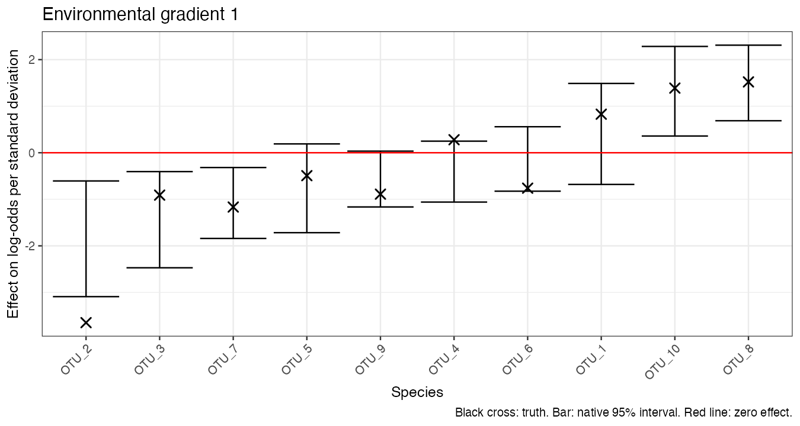
```

```{r native-collection-example, eval=FALSE, purl=TRUE}
collection_truth <- native_truth$collection |>
  filter(covariate == "X_theta")

native_collection <- plotCollectionCovariates(fitmodel, covName = "X_theta") +
  native_theme +
  geom_point(
    data = collection_truth, aes(x = species, y = truth),
    inherit.aes = FALSE, shape = 4, size = 3, stroke = 1
  ) +
  labs(
    title = "Collection covariate",
    y = "Effect on log-odds per standard deviation",
    caption = "Black cross: truth. Bar: native 95% interval. Red line: zero effect."
  ) +
  theme(axis.text.x = element_text(angle = 45, hjust = 1))

native_collection
```

```{r native-collection-image, echo=FALSE, purl=FALSE, out.width="100%"}
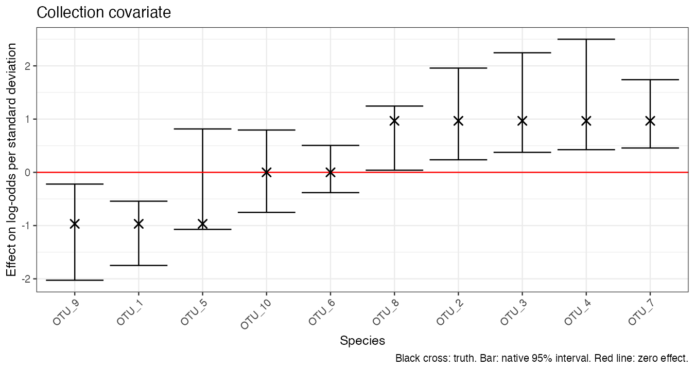
```

A cross outside its bar shows an interval that misses truth in this dataset. A bar crossing the red line means its direction is unresolved under this interval criterion; it does not establish that the simulated effect is absent. Species order follows the native interval bounds, so positions differ between plots.

### Baseline occupancy and collection probabilities

These plots show inverse-logit intercepts. Baseline occupancy sets the standardized environmental predictors and site factors to zero. It is not average occupancy across sites. Baseline collection is conditional on presence and sets the standardized collection predictor to zero, meaning its observed raw-scale mean. Its truth is `plogis(raw_intercept + raw_slope * predictor_mean)`, not `plogis(raw_intercept)`.

```{r native-baseline-occupancy-example, eval=FALSE, purl=TRUE}
native_occupancy_rates <- plotOccupancyRates(fitmodel) +
  native_theme +
  geom_point(
    data = native_truth$occupancy_rates, aes(x = species, y = truth),
    inherit.aes = FALSE, shape = 4, size = 3, stroke = 1
  ) +
  labs(
    title = "Baseline occupancy: zero predictors and zero site factors",
    y = "Occurrence probability",
    caption = "Black cross: truth. Bar: native 95% interval."
  )

native_occupancy_rates
```

```{r native-occupancy-rates-image, echo=FALSE, purl=FALSE, out.width="100%"}
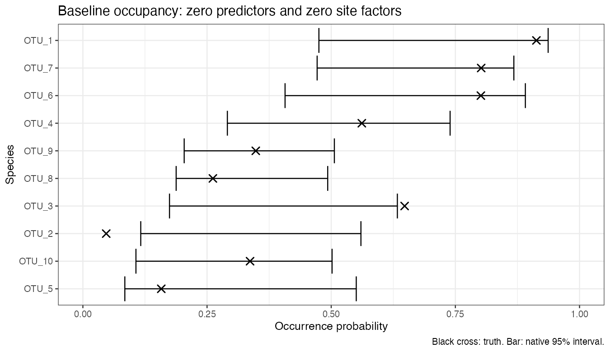
```

```{r native-baseline-collection-example, eval=FALSE, purl=TRUE}
native_collection_rates <- plotCollectionRates(fitmodel) +
  native_theme +
  geom_point(
    data = native_truth$collection_rates, aes(x = species, y = truth),
    inherit.aes = FALSE, shape = 4, size = 3, stroke = 1
  ) +
  labs(
    title = "Baseline collection: collection predictor at its mean",
    y = "Collection probability, given presence",
    caption = "Black cross: truth. Bar: native 95% interval."
  )

native_collection_rates
```

```{r native-collection-rates-image, echo=FALSE, purl=FALSE, out.width="100%"}
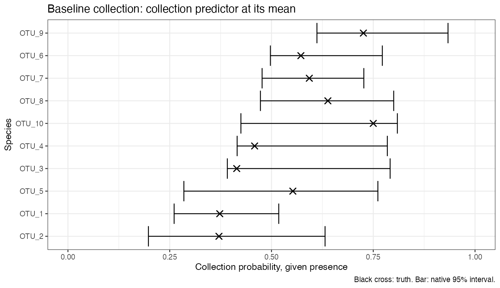
```

### Laboratory true-positive and false-positive rates by primer

Blue intervals describe positive PCR observations given collection; red intervals describe positive PCR observations without collection. Each black cross is the corresponding true probability. With the fitted threshold of one read, truth equals the generating event probability multiplied by the probability that its rounded read count reaches the threshold. The adjustment uses the true-read distribution for true positives and the contamination-read distribution for false positives.

```{r native-primer-1-example, eval=FALSE, purl=TRUE}
primer_1_truth <- native_truth$laboratory |>
  filter(Primer == "1")

native_primer_1 <- plotFPTPStage2Rates(fitmodel, primerName = "1") +
  native_theme +
  geom_point(
    data = primer_1_truth, aes(x = species, y = truth),
    inherit.aes = FALSE, shape = 4, size = 3, stroke = 1
  ) +
  labs(caption = "Black crosses: true rates. Coloured bars: native 95% intervals.")

native_primer_1
```

```{r native-primer-1-image, echo=FALSE, purl=FALSE, out.width="100%"}
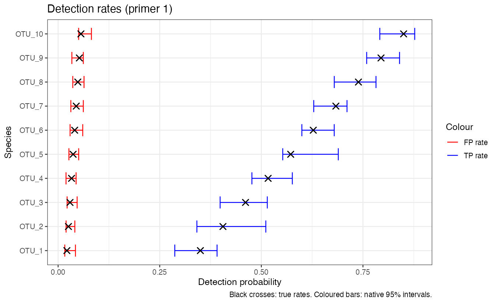
```

```{r native-primer-2-example, eval=FALSE, purl=TRUE}
primer_2_truth <- native_truth$laboratory |>
  filter(Primer == "2")

native_primer_2 <- plotFPTPStage2Rates(fitmodel, primerName = "2") +
  native_theme +
  geom_point(
    data = primer_2_truth, aes(x = species, y = truth),
    inherit.aes = FALSE, shape = 4, size = 3, stroke = 1
  ) +
  labs(caption = "Black crosses: true rates. Coloured bars: native 95% intervals.")

native_primer_2
```

```{r native-primer-2-image, echo=FALSE, purl=FALSE, out.width="100%"}
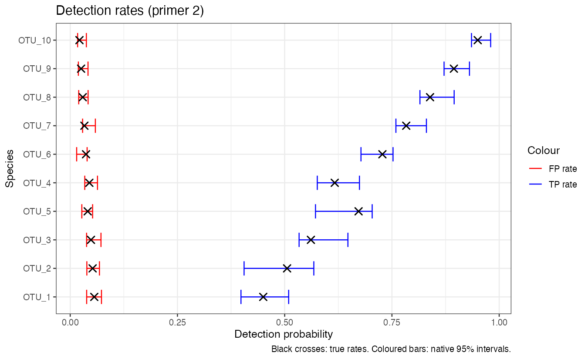
```

### Residual correlations and their uncertainty

The native heat map colours each pair by its fitted median residual correlation. Its central **X means the model cannot confidently establish whether the association is positive or negative**: the 95% credible interval includes zero. It does not mean the true correlation is zero. The small number above each X is the true correlation from the generating loading matrix. For example, `1.00` above an X means a truly strong positive correlation was estimated too uncertainly to establish its direction. All 45 pairs have Xs in this fit. Unlike the crosses in the coefficient plots, these Xs are uncertainty markers; the numbers supply the truth. `NA` means undefined: `OTU_4` has zero true residual variance. This is not a true correlation of zero. Wide uncertainty here coexists with strong true correlations; a pale tile does not prove absence of an association. Residual associations are not direct evidence of biological interactions.

```{r native-correlation-example, eval=FALSE, purl=TRUE}
native_correlations <- plotResidualCorrelationMatrix(
  fitmodel, showSignificance = TRUE, confidence = 0.95
) +
  native_theme +
  geom_text(
    data = native_truth$correlations,
    aes(x = species1, y = species2, label = truth_label),
    inherit.aes = FALSE, nudge_y = 0.27, size = 3
  ) +
  labs(
    title = "Residual correlation: fitted colour and known truth",
    x = "Species", y = "Species",
    caption = "Colour: fitted median. X: direction uncertain (95% interval includes zero).\nNumber: true correlation. An X does not mean the true correlation is zero. NA: undefined truth."
  ) +
  theme(axis.text.x = element_text(angle = 45, hjust = 1))

native_correlations
```

```{r native-correlations-image, echo=FALSE, purl=FALSE, out.width="100%"}
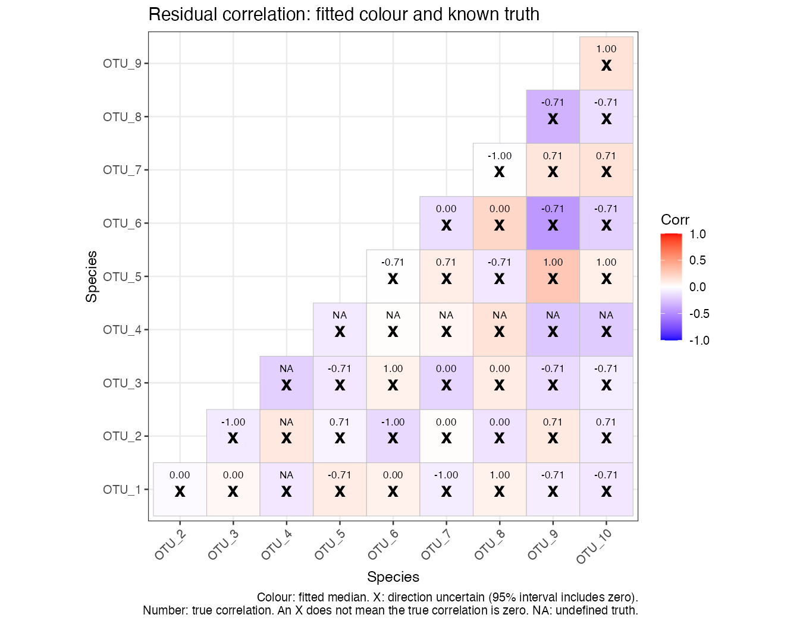
```

### Cumulative detections: compare survey outcomes with survey outcomes

This function asks how many species would be detected if **all ten were present at the site**, the collection predictor were at its mean, and false positives were excluded. It pools both primers and varies field samples (`M`) and PCRs per primer per sample (`K`). It does not predict observed richness at an arbitrary site. Field replication up to four is prospective; the fitted data contained two field samples per site. PCR replication stays within the six-PCR design.

Native bars include both fitted-parameter uncertainty and random collection/PCR outcomes. The routine selects 500 posterior draws to simulate surveys, so endpoints can vary with the seed. Orange bars are the exact 2.5% and 97.5% quantiles of the matching survey-count distribution under the generating parameters. Orange crosses mark its median. These truth intervals remain wide even when parameters are known.

Each species' true detection probability is `1 - (1 - theta * (1 - prod((1 - p)^K)))^M`. Here `theta` is baseline collection conditional on presence and the primer-specific `p` values include the read-threshold adjustment. Combining ten independent detection indicators gives the exact count distribution from zero to ten. Its quantiles are stored in the teaching bundle. This is a distribution of random survey outcomes, not an interval around the analytic expectation taught earlier.

```{r native-effort-k-example, eval=FALSE, purl=TRUE}
set.seed(20260922)

native_effort_k <- plotCumulativeSpeciesDetections(
  fitmodel, M = 4, K = 6, primer = 0, byK = TRUE
) +
  native_theme +
  geom_linerange(
    data = native_truth$survey_counts,
    aes(x = K + 0.12, ymin = lower, ymax = upper),
    inherit.aes = FALSE, colour = "#C45B00", linewidth = 1.2
  ) +
  geom_point(
    data = native_truth$survey_counts, aes(x = K + 0.12, y = median),
    inherit.aes = FALSE, colour = "#C45B00", shape = 4, size = 2.5
  ) +
  labs(
    title = "More PCRs per primer and field sample",
    caption = "Black: native 95% survey interval. Orange: true 95% range and median.\nTruth is offset slightly to the right to keep both intervals visible."
  )

native_effort_k
```

```{r native-effort-k-image, echo=FALSE, purl=FALSE, out.width="100%"}
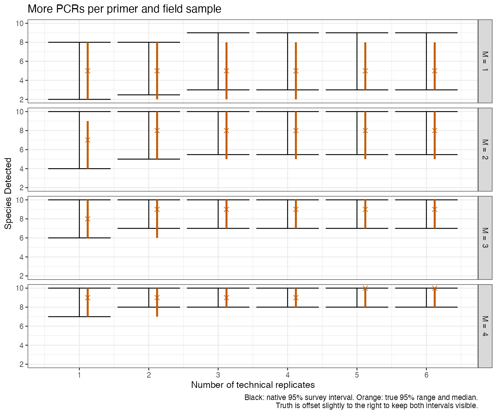
```

Changing `byK` puts field replication on the horizontal axis. Resetting the same seed gives the same native intervals rearranged, not a second fit or a different survey target.

```{r native-effort-m-example, eval=FALSE, purl=TRUE}
set.seed(20260922)

native_effort_m <- plotCumulativeSpeciesDetections(
  fitmodel, M = 4, K = 6, primer = 0, byK = FALSE
) +
  native_theme +
  geom_linerange(
    data = native_truth$survey_counts,
    aes(x = M + 0.12, ymin = lower, ymax = upper),
    inherit.aes = FALSE, colour = "#C45B00", linewidth = 1.2
  ) +
  geom_point(
    data = native_truth$survey_counts, aes(x = M + 0.12, y = median),
    inherit.aes = FALSE, colour = "#C45B00", shape = 4, size = 2.5
  ) +
  labs(
    title = "More field samples per site",
    caption = "Black: native 95% survey interval. Orange: true 95% range and median.\nTruth is offset slightly to the right to keep both intervals visible."
  )

native_effort_m
```

```{r native-effort-m-image, echo=FALSE, purl=FALSE, out.width="100%"}
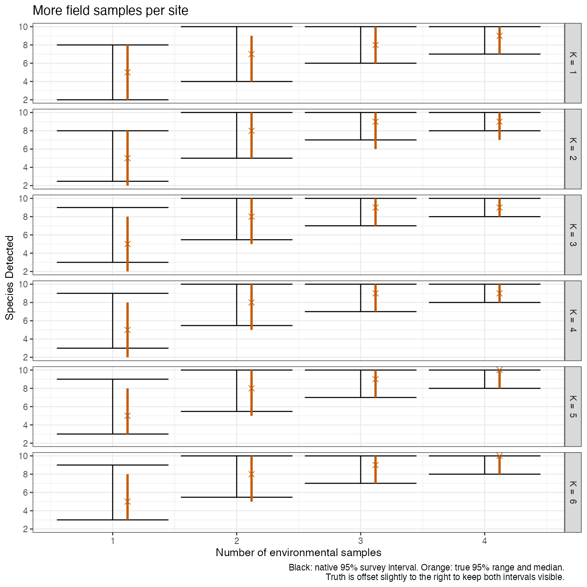
```

### Occupancy response curves with the package helper

`plotOccupancyGradient()` shows how occupancy changes along one environmental predictor. The blue line is the posterior median and the ribbon is a pointwise 95% credible interval. The black dashed line is the generating probability for the same target. Other standardized environmental predictors are held at their observed medians, and site factors are set to zero. These curves do not average over unknown site factors and are not the conditional probabilities for the sampled sites.

The native horizontal axis uses standardized predictor values. Zero is the observed raw-scale mean and one unit is one observed standard deviation. The grid spans the 2nd to 98th percentiles; the rug shows all observed site values. The table supplies the original scale: `raw_value = mean + sd * standardized_value`.

```{r remaining-plots-read, purl=FALSE}
remaining_examples <- readRDS("teaching-data/remaining-plots-data.rds")
knitr::kable(remaining_examples$scaling, digits = 3)
```

```{r remaining-plots-setup, eval=FALSE, purl=TRUE}
library(occJSDM)
library(dplyr)
library(ggplot2)

remaining_truth <- remaining_examples$truth
remaining_theme <- ggtern::theme_bw(base_size = 12)
```

```{r remaining-plots-gradient-1, eval=FALSE, purl=TRUE}
gradient_1_truth <- remaining_truth$gradients |>
  filter(covariate == "X_psi.EnvCov.1")

remaining_gradient_1 <- plotOccupancyGradient(
  fitmodel, covName = "X_psi.EnvCov.1", idx_species = 1:10
) +
  remaining_theme +
  geom_line(
    data = gradient_1_truth, aes(x = x, y = truth),
    inherit.aes = FALSE, colour = "black", linetype = "dashed"
  ) +
  labs(
    title = "Environmental gradient 1: site factors set to zero",
    x = "Environmental gradient 1 (standard deviations from its mean)",
    caption = "Blue: posterior median and pointwise 95% interval. Black dashed: true probability."
  )

remaining_gradient_1
```

```{r remaining-plots-gradient-1-image, echo=FALSE, purl=FALSE, out.width="100%"}
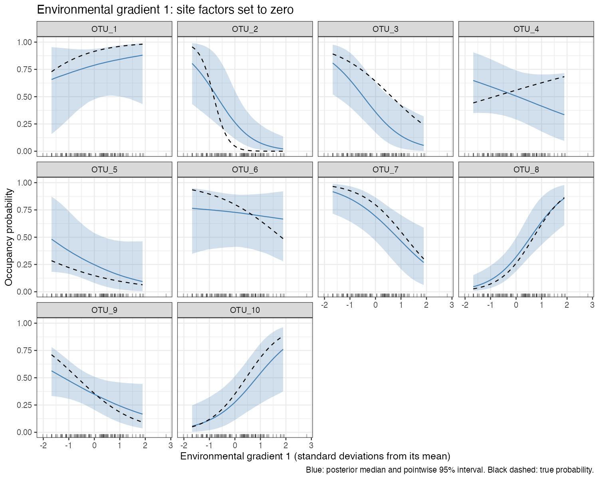
```

The second predictor has its own slope for every species. Apply the same call to its name and compare its true and fitted curves.

```{r remaining-plots-gradient-2, eval=FALSE, purl=TRUE}
gradient_2_truth <- remaining_truth$gradients |>
  filter(covariate == "X_psi.EnvCov.2")

remaining_gradient_2 <- plotOccupancyGradient(
  fitmodel, covName = "X_psi.EnvCov.2", idx_species = 1:10
) +
  remaining_theme +
  geom_line(
    data = gradient_2_truth, aes(x = x, y = truth),
    inherit.aes = FALSE, colour = "black", linetype = "dashed"
  ) +
  labs(
    title = "Environmental gradient 2: site factors set to zero",
    x = "Environmental gradient 2 (standard deviations from its mean)",
    caption = "Blue: posterior median and pointwise 95% interval. Black dashed: true probability."
  )

remaining_gradient_2
```

```{r remaining-plots-gradient-2-image, echo=FALSE, purl=FALSE, out.width="100%"}
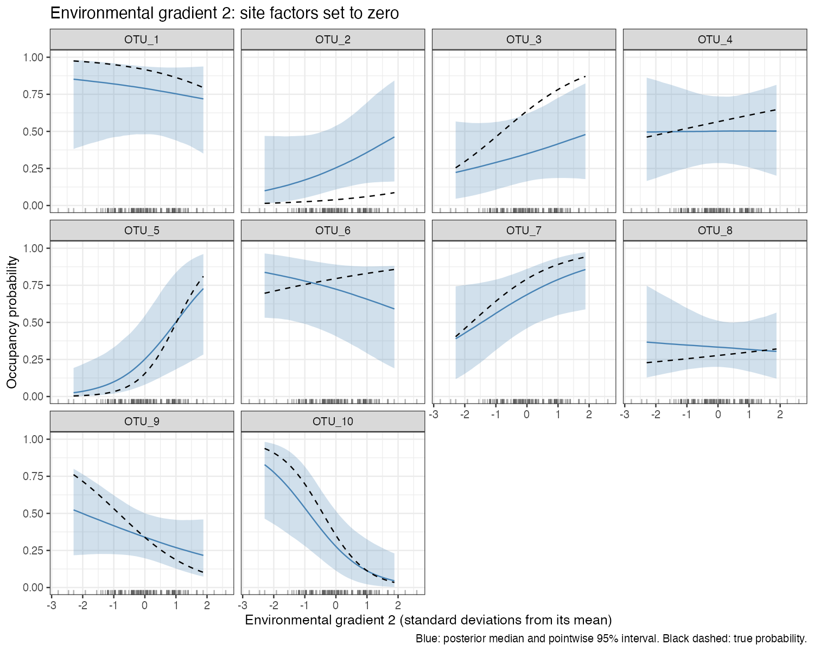
```

The original walkthrough used `plotCovariateEffect()` here. That helper cannot currently be restored as a trustworthy occupancy-probability example: for numeric predictors it adds a log-odds intercept after the inverse-logit transformation, and its purported raw predictor grid is already standardized in this fit. For example, its median for `OTU_1` along environmental gradient 1 ranges from 1.772 to 1.815, outside the probability scale. The developer diagnostic `remaining-plots-diagnose-covariate.R` reproduces this from the archived fit. The two checked `plotOccupancyGradient()` calls above provide the response-curve examples.

A correction to `returnCovariateEffect()` and `plotCovariateEffect()` is awaiting review in [PR #13](https://github.com/AlexDiana/occJSDM/pull/13). It also renames the numeric posterior-median column from `mean` to `median`. The figures above already use the correct probability calculation; their differences from the simulated truth are not caused by that output bug.

### Separate false-positive and detection-rate plots

The first plot shows field contamination: the probability of a collected presence when the species is absent from the site. Black crosses mark the generating `theta0`; bars are native 95% posterior intervals. This is a latent collection event, so its truth does not need a read-threshold adjustment.

```{r remaining-plots-stage1-fp, eval=FALSE, purl=TRUE}
remaining_stage1_fp <- plotStage1FPRates(fitmodel, idx_species = 1:10) +
  remaining_theme +
  geom_point(
    data = remaining_truth$stage1_fp, aes(x = Species, y = truth),
    inherit.aes = FALSE, shape = 4, size = 3, stroke = 1
  ) +
  ylim(0, 1) +
  labs(
    title = "Field false positives",
    y = "Collection probability, given site absence",
    caption = "Black cross: truth. Bar: native 95% interval."
  )

remaining_stage1_fp
```

```{r remaining-plots-stage1-fp-image, echo=FALSE, purl=FALSE, out.width="100%"}
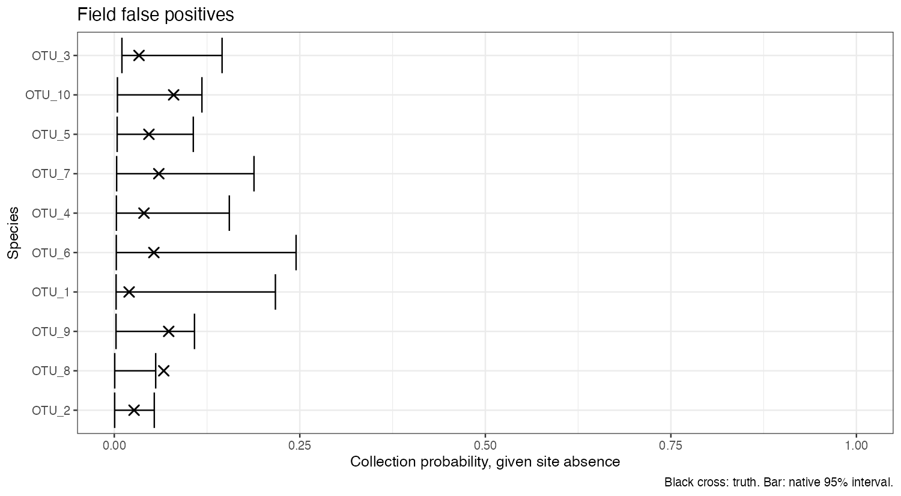
```

The two laboratory helpers display each primer separately; they do not pool primers and have no `primerName` argument. Each truth cross is displaced with its matching primer bar. Use `plotFPTPStage2Rates(fitmodel, primerName = "1")` from the preceding examples when you want to select one primer instead.

Laboratory false positives condition on no collection. True-positive detection conditions on collection. In both cases, the plotted target is a positive observation after the one-read threshold. The corresponding generating event probability is multiplied by the chance that its rounded read count reaches that threshold, using the contamination-read distribution for `q` and the true-read distribution for `p`.

```{r remaining-plots-stage2-fp, eval=FALSE, purl=TRUE}
remaining_stage2_fp <- plotStage2FPRates(fitmodel, idx_species = 1:10) +
  remaining_theme +
  geom_point(
    data = remaining_truth$stage2_fp,
    aes(x = Species, y = truth, group = Primer),
    inherit.aes = FALSE, shape = 4, size = 2.5, stroke = 1,
    position = position_dodge(width = 0.15)
  ) +
  ylim(0, 1) +
  labs(
    title = "Laboratory false positives by primer",
    y = "Positive observation probability, given no collection",
    caption = "Black cross: matching primer truth. Coloured bar: native 95% interval."
  )

remaining_stage2_fp
```

```{r remaining-plots-stage2-fp-image, echo=FALSE, purl=FALSE, out.width="100%"}
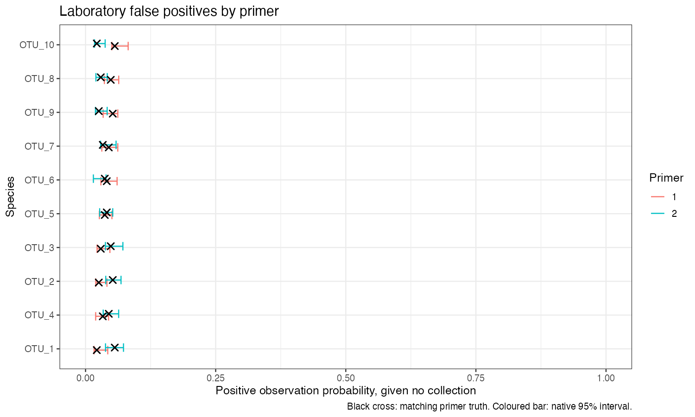
```

```{r remaining-plots-detection, eval=FALSE, purl=TRUE}
remaining_detection <- plotDetectionRates(fitmodel, idx_species = 1:10) +
  remaining_theme +
  geom_point(
    data = remaining_truth$detection,
    aes(x = Species, y = truth, group = Primer),
    inherit.aes = FALSE, shape = 4, size = 2.5, stroke = 1,
    position = position_dodge(width = 0.6)
  ) +
  ylim(0, 1) +
  labs(
    title = "Laboratory true-positive detection by primer",
    y = "Positive observation probability, given collection",
    caption = "Black cross: matching primer truth. Coloured bar: native 95% interval."
  )

remaining_detection
```

```{r remaining-plots-detection-image, echo=FALSE, purl=FALSE, out.width="100%"}
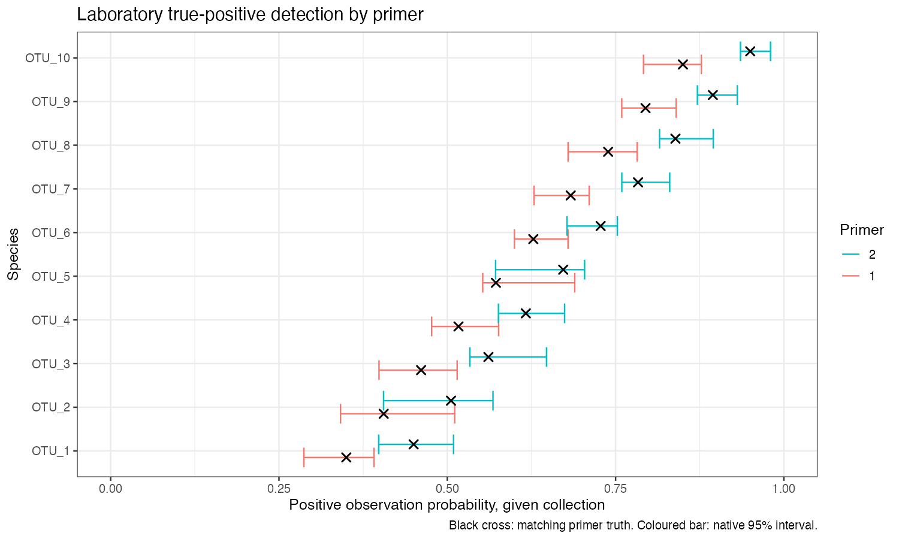
```

Species order is chosen separately by each native helper. A truth cross outside its bar identifies an interval that misses the generating rate in this dataset. These rate intervals summarize parameter uncertainty, unlike the random survey-count ranges in the cumulative-detection examples.

Every plotting function in this package returns a `ggplot2` object, so the plots can be placed side by side with the `patchwork` package. Its `+` operator lays two plots next to each other, and `/` stacks them. Pairing each stage's false-positive plot with its success plot puts what should ideally be low beside what should ideally be high.

```{r combine-rate-plots, eval=FALSE}
library(patchwork)

field_rates <- (plotStage1FPRates(fitmodel, idx_species = 1:10) + ylim(0, 1)) +
  plotCollectionRates(fitmodel, idx_species = 1:10)

laboratory_rates <- (plotStage2FPRates(fitmodel, idx_species = 1:10) + ylim(0, 1)) +
  plotDetectionRates(fitmodel, idx_species = 1:10)

field_rates / laboratory_rates
```

The parentheses matter: the first `+` inside them adds a `ggplot2` layer to one plot, whereas the `+` between the parenthesised plot and the next plot is `patchwork`'s side-by-side operator.

## Reproduce the extraction or find a function

The compact files retain source and fit hashes. Full MCMC fits are kept outside the package because they are much larger. To regenerate them, follow `dev/simstudy/vignette-lesson/README.md` and run the existing simulation/fitting commands with the recorded source. Then export this lesson's additional summaries:

```{bash, eval=FALSE}
Rscript dev/simstudy/vignette-lesson/summarise_outputs.R /path/to/full-fits
Rscript dev/simstudy/vignette-lesson/verify_outputs.R /path/to/full-fits
Rscript dev/simstudy/vignette-lesson/summarise_diagnostics.R /path/to/full-fits
Rscript dev/simstudy/vignette-lesson/verify_diagnostics.R /path/to/full-fits
Rscript dev/simstudy/vignette-lesson/summarise_latent_tables.R /path/to/full-fits
Rscript dev/simstudy/vignette-lesson/verify_latent_tables.R /path/to/full-fits
Rscript dev/simstudy/vignette-lesson/export_native_plots.R /path/to/full-fits
Rscript dev/simstudy/vignette-lesson/verify_native_plots.R /path/to/full-fits
Rscript dev/simstudy/vignette-lesson/ordination-export.R /path/to/full-fits
Rscript dev/simstudy/vignette-lesson/ordination-verify.R /path/to/full-fits
Rscript dev/simstudy/vignette-lesson/remaining-plots-export.R /path/to/full-fits
Rscript dev/simstudy/vignette-lesson/remaining-plots-verify.R /path/to/full-fits
Rscript dev/simstudy/vignette-lesson/native-traits-export.R /path/to/full-fits
Rscript dev/simstudy/vignette-lesson/native-traits-verify.R /path/to/full-fits
```

The new-site comparison needs the additional one-factor fit once. Follow the README to prepare its independent-site data before fitting; then run its exporter and verifier:

```{bash prediction-reproduction, eval=FALSE}
Rscript dev/simstudy/vignette-lesson/prediction-export.R /path/to/full-fits /path/to/new-site-check
Rscript dev/simstudy/vignette-lesson/prediction-verify.R /path/to/full-fits /path/to/new-site-check
```

In an R session with those full fits available:

```{r load-full-fit, eval=FALSE}
saved_fit <- readRDS("/path/to/full-fits/default-fit.rds")
fitmodel <- saved_fit$fit

known_truth <- lesson$input$sim$true_params
```

These exporters preserve all posterior draws for their summaries. They do not rerun MCMC or choose a different community because an effect was not recovered. The separate prediction builder is the command that fits the one-factor comparison model. Student-facing figures use tidy tables so the plotting code remains readable; the export and verification scripts document and check the array calculations behind them.

| Ecological question | Useful functions | Truth check in the lessons |
|---|---|---|
| How do I prepare and fit data? | `simulateOccJSDMData()`, `runOccJSDM()` | Lessons 0 and 1 |
| How does each species respond to the environment? | `returnOccupancyCovariates()`, `plotOccupancyCovariates()`, `returnOccupancyGradient()`, `plotOccupancyGradient()`, `plotCovariateEffect()` | Coefficients and native gradients above; the defect in `plotCovariateEffect()` is explicit |
| What is baseline occupancy? | `returnOccupancyRates()`, `plotOccupancyRates()` | Baseline table and native plot above |
| Do traits explain species responses? | `returnTraitsCoeff()`, `plotTraitsCoefficients()` | Custom and native trait plots with standardized truth; cancellation diagnostic above |
| Which species share unmeasured site responses? | `returnResidualCorrelationMatrix()`, `plotResidualCorrelationMatrix()` | Matched matrices and native uncertainty display above |
| What do ordination axes represent? | `returnOrdinationScores()`, `returnFactorLoadings()`, `plotOrdinationScores()`, `plotFactorLoadings()`, `plotBiplot()` | Combined contribution plus truth-aligned native scores, loadings and biplot |
| How is variation allocated? | `returnVariancePartitioning()`, `plotVariancePartitioning()` | Matching true and fitted fractions above |
| What affects collection? | `returnCollectionCovariates()`, `plotCollectionCovariates()`, `plotCollectionRates()` | Collection effects above; observation process in Lesson 1 |
| What about PCR failures and contamination? | `plotDetectionRates()`, `plotStage1FPRates()`, `plotStage2FPRates()` | Combined and separate native rate plots above; actual cases in Lesson 1 |
| How does sampling effort affect detection? | `plotCumulativeSpeciesDetections()` | Analytic expectation and native survey-outcome intervals above |
| What happened at a particular site/sample? | `computeConditionalOccupancyProbs()`, `computePredictiveOccupancyProbs()`, `returnLatentPresences()`, `plotLatentPresences()` | Native tables above, with matching states and probabilities |
| Can I trust the computation? | `returnConvergenceDiagnostics()`, `plotTraceplot()`, `extractWAIC()` | Diagnostics above; these have no single simulated true value |
| How well does it predict unsurveyed sites? | `predictNewSites()` | 300 independent non-spatial sites above, with clearly distinguished probability targets |
| What about spatial prediction? | Spatial model outputs | Planned Lesson 2; not validated by this lesson |


## References and further reading

Cai, W., Pichler, M., Biggs, J., Nicolet, P., Ewald, N., Griffiths, R. A., Bush, A., Leibold, M. A., Hartig, F., & Yu, D. W. (2025). **Assembly processes inferred from eDNA surveys of a pond metacommunity are consistent with known species ecologies**. *Ecography*, *2025*(6), e07461. <https://doi.org/10.1111/ecog.07461>

Ji, Y., Diana, A., Li, X., Matechou, E., Griffin, J. E., Liu, S., Luo, M., Wu, C., Bai, R., Yao, C., Yin, T., Dong, F., Wu, F., Wang, K., Yu, Z., Chen, X., Jiang, X., Che, J., Yu, D. W., & Popescu, V. D. (2025). **High Quality, Granular, Timely, Trustworthy and Efficient Vertebrate Species Distribution Data Across a 30,000 km^2^ Protected Area Complex**. *Ecology Letters*, *28*(12), e70302. <https://doi.org/10.1111/ele.70302>

Leibold, M. A., Rudolph, F. J., Blanchet, F. G., De Meester, L., Gravel, D., Hartig, F., Peres‐Neto, P., Shoemaker, L., & Chase, J. M. (2021). **The internal structure of metacommunities**. *Oikos*, oik.08618. <https://doi.org/10.1111/oik.08618>

Pichler, M., Creer, S., Martínez, A., Fontaneto, D., Renema, W., & Macher, J.-N. (2025). **Metacommunity Theory and Metabarcoding Reveal the Environmental, Spatial and Biotic Drivers of Meiofaunal Communities in Sandy Beaches**. *Molecular Ecology*, *34*(8), e17733. <https://doi.org/10.1111/mec.17733>
