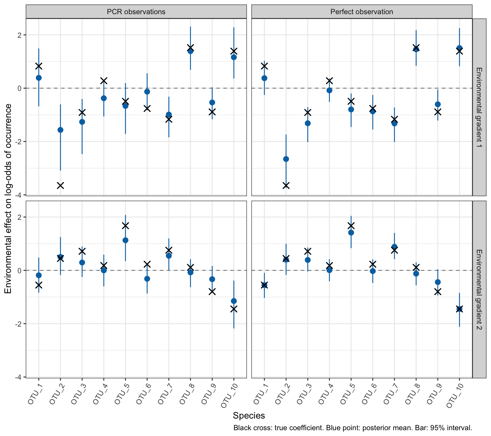
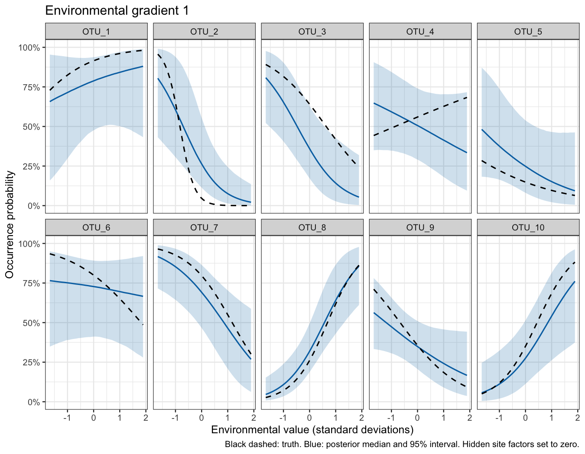
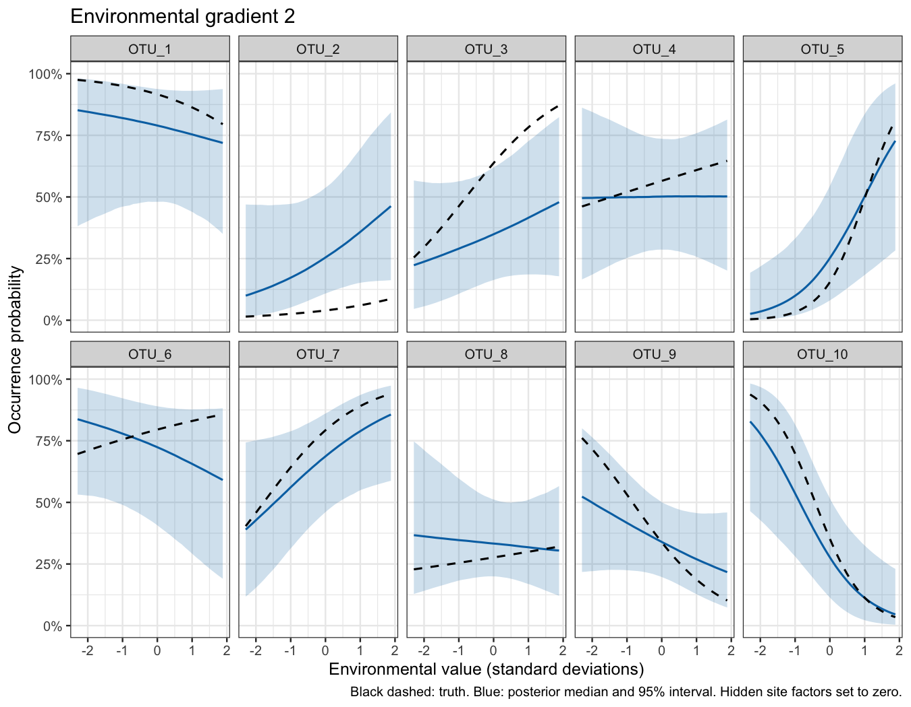
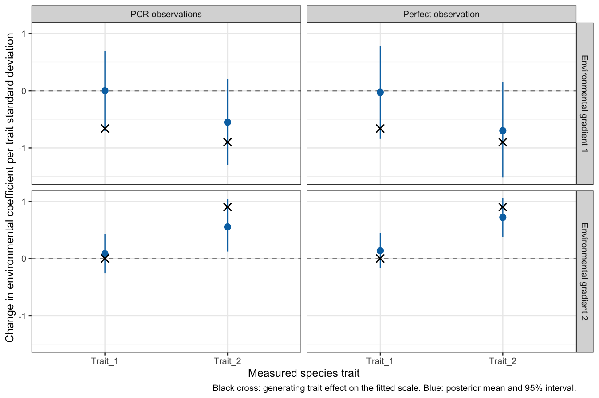
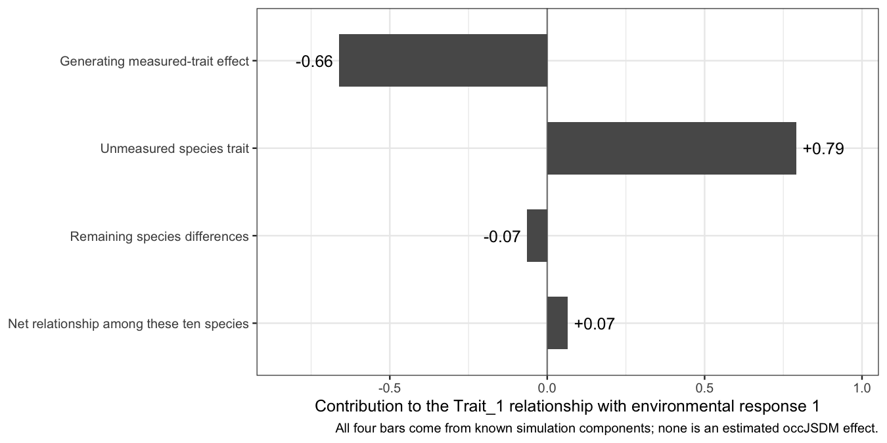
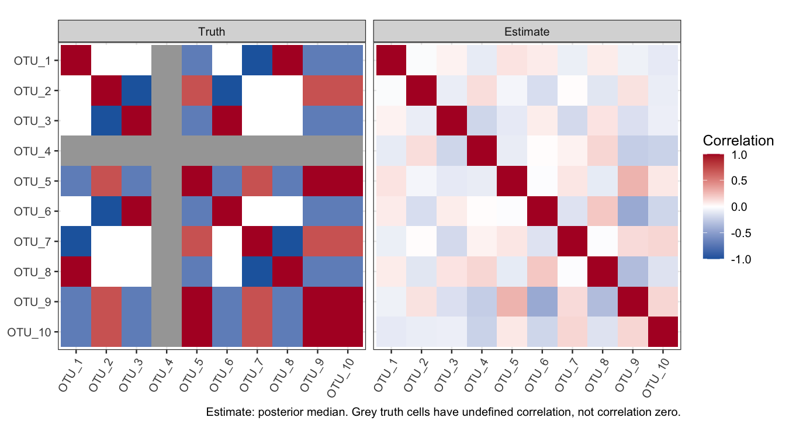
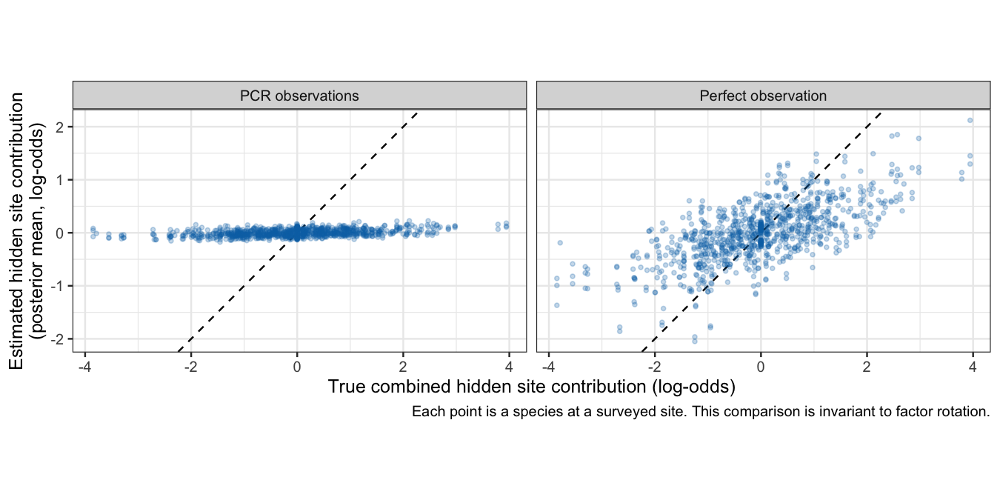
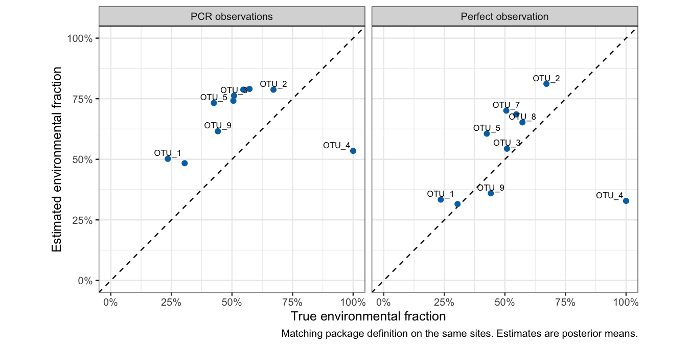
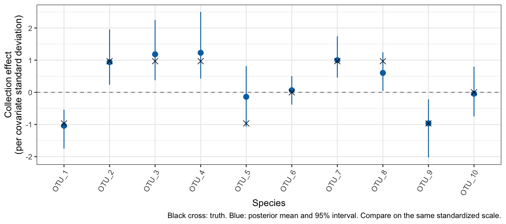
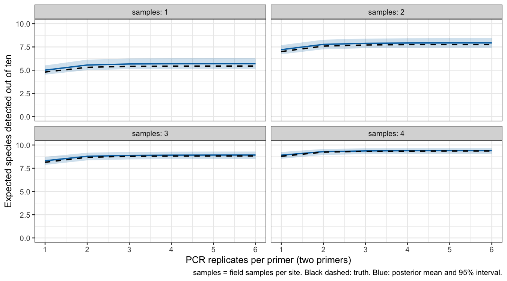

Lesson 3: Understand the model’s outputs by comparing them with truth
================

## What this lesson answers

An environmental effect can be real in the simulation and still be
estimated imprecisely. A fitted curve can look convincing and still miss
the truth. This lesson shows how to distinguish those situations.

It replaces the output tour in the original occJSDM vignette. Start with
[Lesson 1](occJSDM-first-lesson.md) for fitting and false-positive
interpretation; [Lesson 0](occJSDM-lesson-0.md) explains the simulation.
You do not need the planned spatial Lesson 2 first. Here we use the same
**non-spatial** community: 100 sites, 10 species, two measured
environmental covariates, two measured traits, two field samples per
site, two primers and six PCR replicates per primer.

We compare two existing fits of that community: one given the actual
presence/absence matrix (**perfect observation**) and one given the PCR
observations. This is not a before/after comparison of software
versions. The fits use the verified model source recorded in Lesson 1;
that source matches the code on main when this lesson was prepared. No
new MCMC was needed to make these figures.

All teaching code is visible. Run chunks with `vignettes` as the working
directory, or knit this file. Figures and tables use compact saved
summaries. Optional chunks labelled `eval=FALSE` explain how to obtain
the underlying outputs from a full fit, without starting a long fit
while knitting.

``` r
library(dplyr)
library(tidyr)
library(tibble)
library(ggplot2)

lesson <- readRDS("teaching-data/nonspatial-lesson.rds")
outputs <- readRDS("teaching-data/output-lesson.rds")
known_truth <- lesson$input$sim$true_params

fit_labels <- c(
  perfect = "Perfect observation",
  default = "PCR observations"
)

environment_labels <- c(
  X_psi.EnvCov.1 = "Environmental gradient 1",
  X_psi.EnvCov.2 = "Environmental gradient 2"
)

species_order <- colnames(lesson$input$sim$data_list$OTU)

theme_set(theme_bw(base_size = 12))
```

In the figures, **black crosses or lines show truth**. Blue points or
lines show estimates, and blue intervals show posterior uncertainty. An
interval is not a measurement of how far the estimate actually is from
truth; simulation lets us check both separately.

## Do environmental effects really go undetected?

Each environmental coefficient describes how one species responds to one
gradient, after accounting for the other model components. With ten
species and two gradients, there are twenty coefficients.

The older `sampleresults` object currently shipped with the package has
7 of 20 environmental intervals and 2 of 6 trait intervals excluding
zero. Thus that particular saved fit does not show an absence of all
effects. Its generating truth is not stored with it, so we cannot tell
from that object alone how accurately it recovered the original effects.
The results below use the newer matching simulation and fits instead.

``` r
effect_counts <- outputs$coefficients |>
  group_by(arm, block) |>
  summarise(
    effects = n(),
    intervals_excluding_zero = sum(excludes_zero),
    .groups = "drop"
  ) |>
  mutate(fit = unname(fit_labels[arm])) |>
  select(fit, block, effects, intervals_excluding_zero)

knitr::kable(effect_counts, caption = "How many 95% intervals exclude zero?")
```

| fit                 | block       | effects | intervals_excluding_zero |
|:--------------------|:------------|--------:|-------------------------:|
| PCR observations    | Environment |      20 |                        8 |
| PCR observations    | Trait       |       4 |                        1 |
| Perfect observation | Environment |      20 |                       12 |
| Perfect observation | Trait       |       4 |                        1 |

How many 95% intervals exclude zero?

Perfect observation identifies the direction of more environmental
effects in this example. That makes ecological sense: it removes
uncertainty about whether each species was present. It does not reveal
the underlying occurrence probabilities or guarantee precise
coefficients.

### Put the true coefficient beside its estimate

The public function returns an array: posterior draws by environmental
covariate by species. A full fit is available after following the
reproduction instructions at the end of this lesson.

``` r
environment_draws <- occJSDM::returnOccupancyCovariates(fitmodel)

example_draws <- environment_draws[, "X_psi.EnvCov.1", "OTU_1"]

tibble(
  estimate = mean(example_draws),
  lower = quantile(example_draws, 0.025),
  upper = quantile(example_draws, 0.975)
)
```

For the complete comparison we use the same calculation for every
coefficient. The exporter joins each summary to the generating
coefficient by its species and covariate identifiers. The environmental
predictor scale was checked by reconstructing the simulation’s full
ecological predictor from the fitted design matrix and the true
parameters.

``` r
environment_effects <- outputs$coefficients |>
  filter(block == "Environment") |>
  mutate(species = factor(term, levels = species_order))

ggplot(environment_effects, aes(x = species)) +
  geom_hline(yintercept = 0, colour = "grey55", linetype = "dashed") +
  geom_pointrange(
    aes(y = estimate, ymin = lower, ymax = upper),
    colour = "#0072B2"
  ) +
  geom_point(aes(y = truth), shape = 4, size = 3, stroke = 1) +
  facet_grid(
    covariate ~ arm,
    labeller = labeller(covariate = environment_labels, arm = fit_labels)
  ) +
  labs(
    x = "Species",
    y = "Environmental effect on log-odds of occurrence",
    caption = "Black cross: true coefficient. Blue point: posterior mean. Bar: 95% interval."
  ) +
  theme(axis.text.x = element_text(angle = 60, hjust = 1))
```

<!-- -->

A positive coefficient means occurrence becomes more likely along that
gradient; a negative one means less likely. Zero means no direct
response to that covariate in this model. These coefficients are changes
in log-odds for a one-standard-deviation change in the environmental
predictor, not percentage-point changes in occurrence probability.

Read each species in three steps: where is the black cross, how far is
the blue point from it, and how wide is the blue interval? If the
interval crosses zero, the fitted model has not clearly resolved the
direction under this criterion. It does **not** establish that the
environmental effect is absent. Conversely, excluding zero does not
guarantee an accurate effect size.

## What does an effect mean for a species’ distribution?

A response curve translates a coefficient into occurrence probabilities.
Here we change one measured gradient, hold the other at its median, and
set the hidden site-factor contribution to zero. Both the true and
fitted curves use those same conditions.

These are **environmental response profiles**, not maps, fitted
probabilities at particular surveyed sites, or predictions averaged over
unknown conditions at a new site. Those quantities answer different
questions. The public function used here, `returnOccupancyGradient()`,
evaluates the zero-factor profile.

``` r
response_profile <- occJSDM::returnOccupancyGradient(
  fitmodel,
  covName = "X_psi.EnvCov.1",
  n_grid = 40
)
```

``` r
response_curves <- outputs$gradients |>
  filter(arm == "default") |>
  mutate(species = factor(species, levels = species_order))

plot_response <- function(covariate_name) {
  response_curves |>
    filter(covariate == covariate_name) |>
    ggplot(aes(x = x)) +
    geom_ribbon(aes(ymin = low, ymax = high), fill = "#0072B2", alpha = 0.2) +
    geom_line(aes(y = med), colour = "#0072B2", linewidth = 0.7) +
    geom_line(aes(y = truth), colour = "black", linetype = "dashed", linewidth = 0.7) +
    facet_wrap(~ species, ncol = 5) +
    scale_y_continuous(labels = scales::label_percent(), limits = c(0, 1)) +
    labs(
      title = unname(environment_labels[covariate_name]),
      x = "Environmental value (standard deviations)",
      y = "Occurrence probability",
      caption = "Black dashed: truth. Blue: posterior median and 95% interval. Hidden site factors set to zero."
    )
}

plot_response("X_psi.EnvCov.1")
```

<!-- -->

``` r
plot_response("X_psi.EnvCov.2")
```

<!-- -->

Notice that the same coefficient can produce very different probability
changes depending on where the species starts on the vertical axis. An
effect near a baseline probability of 50% has more room to move the
probability than the same log-odds change near 0% or 100%. The curves
make that easier to see than the coefficient plot alone.

`returnOccupancyRates()` similarly describes the probability when the
standardized measured predictors and the hidden factors are all zero. It
is not the average occupancy across the landscape. Here are the
posterior means of that baseline probability and their matching true
values.

``` r
outputs$baseline |>
  filter(arm == "default") |>
  select(species, truth, estimate, lower, upper) |>
  mutate(across(c(truth, estimate, lower, upper), ~ scales::percent(.x, accuracy = 0.1))) |>
  knitr::kable(caption = "Baseline probabilities: all predictor contributions set to zero.")
```

| species | truth | estimate | lower | upper |
|:--------|:------|:---------|:------|:------|
| OTU_1   | 91.3% | 76.6%    | 47.5% | 93.7% |
| OTU_2   | 4.7%  | 28.7%    | 11.7% | 56.0% |
| OTU_3   | 64.8% | 37.4%    | 17.4% | 63.3% |
| OTU_4   | 56.2% | 50.8%    | 29.1% | 73.9% |
| OTU_5   | 15.8% | 27.3%    | 8.4%  | 55.0% |
| OTU_6   | 80.1% | 70.6%    | 40.7% | 89.1% |
| OTU_7   | 80.2% | 69.0%    | 47.2% | 86.8% |
| OTU_8   | 26.2% | 32.4%    | 18.8% | 49.3% |
| OTU_9   | 34.8% | 34.7%    | 20.4% | 50.6% |
| OTU_10  | 33.7% | 27.6%    | 10.7% | 50.2% |

Baseline probabilities: all predictor contributions set to zero.

## Traits ask a harder, different question

An environmental coefficient asks, for example, whether a particular
species becomes more likely along a gradient. A trait effect asks
whether **differences in that coefficient among species** can be
explained by a measured trait. The trait acts on the environmental
response, not directly on the occurrence observation.

We have 100 sites to help estimate each species’ environmental response,
but only ten species whose responses can be compared with their traits.
More PCRs do not create more species-level contrasts. More sites can
improve the estimated species responses, but they do not remove all
uncertainty in the trait relationship.

``` r
trait_draws <- occJSDM::returnTraitsCoeff(fitmodel)

# Draws for how Trait_1 changes the response to environmental gradient 1.
trait_1_draws <- trait_draws[, "X_psi.EnvCov.1", "Trait_1"]
```

The generating trait matrix is `known_truth$jsdmParams_true$G`. The
simulator used unstandardized traits, whereas fitting standardized them.
A raw coefficient of -1 therefore does not necessarily appear as -1 on
the fitted scale. The comparison below multiplies each generating trait
coefficient by that trait’s sample standard deviation. The environmental
scale already matches.

``` r
trait_effects <- outputs$coefficients |>
  filter(block == "Trait")

ggplot(trait_effects, aes(x = term)) +
  geom_hline(yintercept = 0, colour = "grey55", linetype = "dashed") +
  geom_pointrange(
    aes(y = estimate, ymin = lower, ymax = upper),
    colour = "#0072B2"
  ) +
  geom_point(aes(y = truth), shape = 4, size = 3, stroke = 1) +
  facet_grid(
    covariate ~ arm,
    labeller = labeller(covariate = environment_labels, arm = fit_labels)
  ) +
  labs(
    x = "Measured species trait",
    y = "Change in environmental coefficient per trait standard deviation",
    caption = "Black cross: generating trait effect on the fitted scale. Blue: posterior mean and 95% interval."
  )
```

<!-- -->

Three of the four generating trait effects are nonzero. Only one of the
four intervals excludes zero in either fit. That is a genuine limitation
of recovery in this example. It is not evidence that the simulation
omitted trait effects, and removing observation error does not make it
disappear.

### A real cancellation inside this simulated community

The model allows a species’ environmental response to combine three
contributions: its measured traits, unmeasured species traits, and
remaining species differences. These are distinct from the **site**
factors used to describe unmeasured conditions at sites.

In these ten species, Trait_1 happens to correlate with the unmeasured
species trait (0.52). The generator drew these traits independently; a
small realized sample can still contain a substantial correlation. For
environmental gradient 1, the resulting contributions oppose one
another.

The following is an **oracle diagnostic**, possible only because we have
the simulation truth. Regress the known species environmental
coefficients on both measured traits, then repeat the regression for
each generating contribution. Because these regressions use the same
predictors, the contributions add to the observed relationship among
these ten species.

``` r
species_comparison <- lesson$input$sim$data_list$traits |>
  as_tibble() |>
  mutate(across(everything(), ~ as.numeric(scale(.x)))) |>
  mutate(true_response = known_truth$jsdmParams_true$B[1, ])

oracle_regression <- lm(
  true_response ~ Trait_1 + Trait_2,
  data = species_comparison
)

enframe(coef(oracle_regression), name = "term", value = "relationship") |>
  knitr::kable(digits = 3)
```

| term        | relationship |
|:------------|-------------:|
| (Intercept) |       -0.385 |
| Trait_1     |        0.065 |
| Trait_2     |       -0.798 |

The coefficient of Trait_1 here describes the net relationship in the
ten generated species, after adjusting for Trait_2. It is not the
isolated generating effect of Trait_1. The decomposition below shows the
difference.

``` r
cancellation <- outputs$trait_components |>
  filter(trait == "Trait_1", covariate == "X_psi.EnvCov.1") |>
  select(component, value)

cancellation <- bind_rows(
  cancellation,
  tibble(
    component = "Net relationship among these ten species",
    value = sum(cancellation$value)
  )
)

cancellation |>
  mutate(component = factor(component, levels = rev(component))) |>
  ggplot(aes(x = value, y = component)) +
  geom_vline(xintercept = 0, colour = "grey55") +
  geom_col(fill = "#595959", width = 0.6) +
  geom_text(aes(label = sprintf("%+.2f", value)),
            hjust = ifelse(cancellation$value >= 0, -0.15, 1.15)) +
  scale_x_continuous(expand = expansion(mult = 0.18)) +
  labs(
    x = "Contribution to the Trait_1 relationship with environmental response 1",
    y = NULL,
    caption = "All four bars come from known simulation components; none is an estimated occJSDM effect."
  )
```

<!-- -->

The negative generating effect is about -0.66, but the unmeasured-trait
contribution is about 0.79. After adding the remaining differences, the
net relationship among the ten species is only 0.07. The model must
disentangle these overlapping sources using imperfectly estimated
species responses. This explains why simply knowing that we put a
nonzero effect into the simulator is not a guarantee that its interval
will exclude zero.

This is a diagnosis of **this simulation**, not proof that all weak
trait results have this cause. It also does not establish the cause of
an older fit whose generating values were not saved. A larger,
replicated species-sample experiment would be needed to measure how much
additional species information helps.

## Residual species associations: did we recover what was put in?

The residual correlation describes the model’s shared hidden site
component. It is not the raw correlation of PCR detections, and it does
not establish a biological interaction between species. Even after
supplying every measured environmental covariate, this simulation still
contains the deliberately generated hidden site factors.

``` r
residual_correlations <- occJSDM::returnResidualCorrelationMatrix(fitmodel)

# First dimension: lower limit, median, upper limit.
median_correlations <- residual_correlations[2, , ]
```

``` r
correlation_plot <- outputs$correlations |>
  filter(arm == "default") |>
  select(species1, species2, Truth = truth, Estimate = estimate) |>
  pivot_longer(c(Truth, Estimate), names_to = "result", values_to = "correlation") |>
  mutate(
    species1 = factor(species1, levels = species_order),
    species2 = factor(species2, levels = rev(species_order)),
    result = factor(result, levels = c("Truth", "Estimate"))
  )

ggplot(correlation_plot, aes(x = species1, y = species2, fill = correlation)) +
  geom_tile() +
  facet_wrap(~ result) +
  scale_fill_gradient2(
    low = "#2166AC", mid = "white", high = "#B2182B",
    limits = c(-1, 1), na.value = "grey65"
  ) +
  coord_equal() +
  labs(x = NULL, y = NULL, fill = "Correlation",
       caption = "Estimate: posterior median. Grey truth cells have undefined correlation, not correlation zero.") +
  theme(axis.text.x = element_text(angle = 60, hjust = 1))
```

<!-- -->

OTU_4 was generated with zero loading on both hidden site factors. Its
hidden contribution has no variation, so its correlation with another
hidden contribution is mathematically undefined. We show those true
cells in grey and exclude them from numerical correlation-error
summaries. Painting them white would incorrectly claim their true
correlation was zero.

Compare the pattern and magnitude, not just whether an interval crosses
zero. An apparently strong estimated correlation can still be far from
the generating value.

## Ordination: compare the combined effect before naming the axes

`returnOrdinationScores()` returns hidden site scores;
`returnFactorLoadings()` returns species loadings. Multiplying a site’s
scores by a species’ loadings gives their combined contribution to its
occurrence predictor. Rotating both sets of axes, or reversing their
signs together, can leave that contribution unchanged. Unaligned true
and fitted axes are therefore a misleading accuracy comparison.

``` r
site_scores <- occJSDM::returnOrdinationScores(fitmodel)
species_loadings <- occJSDM::returnFactorLoadings(fitmodel)

occJSDM::plotBiplot(fitmodel)
```

For a truth check, the exporter multiplies scores by loadings **within
each posterior draw**, then averages the products. Multiplying the mean
scores by the mean loadings would not give the same answer.

``` r
ggplot(outputs$residual, aes(x = truth, y = estimate)) +
  geom_abline(intercept = 0, slope = 1, linetype = "dashed") +
  geom_point(alpha = 0.25, size = 1, colour = "#0072B2") +
  facet_wrap(~ arm, labeller = labeller(arm = fit_labels)) +
  coord_equal() +
  labs(
    x = "True combined hidden site contribution (log-odds)",
    y = "Estimated hidden site contribution\n(posterior mean, log-odds)",
    caption = "Each point is a species at a surveyed site. This comparison is invariant to factor rotation."
  )
```

<!-- -->

The diagonal is exact recovery. Points closer to zero than their true
values show underestimation of the hidden contribution’s magnitude.
These are fitted-site results: the observations at a site helped
estimate its hidden scores.

## Variation partitioning: an allocation within the model

The package divides variation among environmental, spatial and
residual-factor components. In this non-spatial example the spatial
fraction is zero, so showing the environmental fraction is enough: the
residual fraction is one minus it.

The package calls the residual fraction `Biotic`. That label does not
mean it has identified biotic interactions. Here the hidden site factors
were simulated directly, without simulating ecological interactions.

``` r
variation_table <- occJSDM::returnVariancePartitioning(fitmodel)
```

``` r
outputs$variation |>
  filter(component == "Environmental") |>
  ggplot(aes(x = truth, y = estimate, label = species)) +
  geom_abline(intercept = 0, slope = 1, linetype = "dashed") +
  geom_point(colour = "#0072B2", size = 2) +
  geom_text(
    aes(hjust = if_else(truth > 0.9, 1.1, 0.5)),
    nudge_y = 0.025, size = 2.8, check_overlap = TRUE
  ) +
  facet_wrap(~ arm, labeller = labeller(arm = fit_labels)) +
  scale_x_continuous(labels = scales::label_percent(), limits = c(0, 1)) +
  scale_y_continuous(labels = scales::label_percent(), limits = c(0, 1)) +
  coord_equal() +
  labs(x = "True environmental fraction", y = "Estimated environmental fraction",
       caption = "Matching package definition on the same sites. Estimates are posterior means.")
```

<!-- -->

The true fractions use the same package definition as the estimates:
changes in the standard deviation of probabilities when model components
are combined, with negative increments truncated and contributions
normalized. They are not a generic fraction of raw detection variance
explained. That definition matters when comparing this plot with another
package’s variation partitioning.

For OTU_4, the true environmental fraction is 100% because its hidden
site contribution is zero. The estimate does not automatically discover
that fact. Other points above the diagonal allocate too much to the
environment under this definition; points below it allocate too little.
Good-looking occupancy predictions do not guarantee correct attribution
among components.

Why does the PCR fit still allocate variation to hidden site factors
when their average contributions in the preceding figure are so close to
zero? Each posterior draw can contain substantial positive and negative
contributions. If the draws disagree about a site’s contribution, those
values can cancel when averaged. The partition is instead calculated
within each draw and then averaged. A contribution whose average is near
zero can therefore still account for variation within individual draws.

## Collection effects and detection probabilities

Collection covariates predict whether DNA enters a field sample,
conditional on the species being present at the site. They are separate
from the environmental covariates predicting the species’ distribution.

``` r
outputs$collection |>
  filter(covariate == "X_theta") |>
  mutate(species = factor(term, levels = species_order)) |>
  ggplot(aes(x = species)) +
  geom_hline(yintercept = 0, colour = "grey55", linetype = "dashed") +
  geom_pointrange(aes(y = estimate, ymin = lower, ymax = upper), colour = "#0072B2") +
  geom_point(aes(y = truth), shape = 4, size = 3) +
  labs(x = "Species", y = "Collection effect\n(per covariate standard deviation)",
       caption = "Black cross: truth. Blue: posterior mean and 95% interval. Compare on the same standardized scale.") +
  theme(axis.text.x = element_text(angle = 60, hjust = 1))
```

<!-- -->

Use `returnCollectionCovariates()` to extract these draws. [Lesson
1](occJSDM-first-lesson.md) compares true and estimated PCR detection,
laboratory false-positive and field-contamination probabilities, and
shows why their values alone cannot classify every positive detection
correctly. Its truth accounts for whether simulated reads actually pass
the fitted threshold.

### Would more field samples or PCR replicates help detection?

Consider a deliberately restricted question: **if all ten species occupy
a site, how many do we expect to detect truly at least once?** Hold
collection conditions at their mean, use both primers, and count only
detections arising from collected DNA. False-positive detections are
excluded from this calculation. This is neither landscape richness nor
the number of species an analysis will correctly infer to be present.

For one species, let `theta` be collection probability and `p1`, `p2`
the two primer detection probabilities. With `K` PCRs per primer, the
probability of missing collected DNA in every PCR is
`(1 - p1)^K * (1 - p2)^K`. Combine this with collection failure, then
with `M` independent field samples:

``` r
missed_in_pcr <- (1 - p1)^K * (1 - p2)^K

detected_in_one_sample <- theta * (1 - missed_in_pcr)

detected_in_any_sample <- 1 - (1 - detected_in_one_sample)^M

expected_species_detected <- sum(detected_in_any_sample)
```

The exporter applies that formula to the known probabilities and to
every posterior draw. The ribbons below describe uncertainty in the
**expected number**, not the wider variation in the number a single
survey might actually detect. The package’s
`plotCumulativeSpeciesDetections()` instead simulates survey outcomes;
do not equate its interval with this interval for an expectation.

``` r
outputs$detection_effort |>
  mutate(samples = factor(M)) |>
  ggplot(aes(x = K)) +
  geom_ribbon(aes(ymin = lower, ymax = upper), fill = "#0072B2", alpha = 0.2) +
  geom_line(aes(y = estimate), colour = "#0072B2", linewidth = 0.8) +
  geom_line(aes(y = truth), linetype = "dashed", linewidth = 0.8) +
  facet_wrap(~ samples, ncol = 2, labeller = label_both) +
  scale_x_continuous(breaks = 1:6) +
  scale_y_continuous(limits = c(0, 10)) +
  labs(
    x = "PCR replicates per primer (two primers)",
    y = "Expected species detected out of ten",
    caption = "samples = field samples per site. Black dashed: truth. Blue: posterior mean and 95% interval."
  )
```

<!-- -->

Repeated PCRs cannot recover DNA that never entered the field sample.
That is why the one-sample curve levels off even when PCR replication
increases. Another independent field sample gives another opportunity to
collect the species’ DNA. These curves hold the fitted parameter
distribution fixed; they do not measure how collecting more data would
improve a refitted model.

## Distinguish fitted probabilities, occupancy states and new-site predictions

`computePredictiveOccupancyProbs()` returns the fitted ecological
probability at surveyed sites. Despite its name, the fitted site factors
were learned using the observations. Calling it a prediction based only
on measured environmental covariates is incomplete.

`computeConditionalOccupancyProbs()` summarizes the model’s belief that
the species actually occupied the surveyed site, accounting for the
observation process. Its appropriate simulation check is the realized
0/1 state, not the generating probability. [Lesson
1](occJSDM-first-lesson.md) puts these quantities alongside the actual
simulated detection cases, with maps in Lesson 0.

`returnLatentPresences()` and `plotLatentPresences()` collect those
fitted quantities by site, sample and primer. They are useful diagnostic
displays, but the old vignette’s screenshot came from another
simulation. Use the matched examples in Lesson 1 instead.

Genuine prediction at an unsurveyed site requires keeping its
observations out of fitting and averaging appropriately over its unknown
conditions. Reusing the fitting sites’ covariates is not an independent
prediction test. A dedicated new-site example and the spatial outputs
belong with the planned prediction and spatial lessons; this lesson
makes no held-out or spatial-accuracy claim.

## Check computation as well as ecological recovery

An interval can be wide because the data contain little information,
because model components are hard to separate, or because the sampler
has not adequately explored its posterior. The figures alone do not
distinguish those causes. Check the numerical diagnostics before
interpreting uncertainty.

``` r
diagnostic_summary <- bind_rows(
  as_tibble(lesson$diagnostics$perfect) |> mutate(arm = "perfect"),
  as_tibble(lesson$diagnostics$default) |> mutate(arm = "default")
) |>
  group_by(arm) |>
  summarise(
    parameters = n(),
    unavailable = sum(!is.finite(rhat) | !is.finite(ess)),
    maximum_Rhat = max(rhat[is.finite(rhat)]),
    minimum_ESS = min(ess[is.finite(ess)]),
    .groups = "drop"
  ) |>
  mutate(fit = unname(fit_labels[arm])) |>
  select(fit, everything(), -arm)

knitr::kable(diagnostic_summary, digits = 3)
```

| fit                 | parameters | unavailable | maximum_Rhat | minimum_ESS |
|:--------------------|-----------:|------------:|-------------:|------------:|
| PCR observations    |        100 |           0 |        1.008 |     940.025 |
| Perfect observation |         30 |           0 |        1.002 |    2096.978 |

These are the saved parameter diagnostics, not a certification of
unbiased inference. Good chain agreement does not resolve limited
species information or separate overlapping ecological explanations. Use
`returnConvergenceDiagnostics()` and `plotTraceplot()` on the full fit
for parameter-level checks; a traceplot can include the corresponding
true value as a reference.

The public diagnostics table does not include the trait matrix `G`.
Because trait recovery is a main concern here, the exporter also
calculates diagnostics directly from the environmental and trait
coefficient draws, retaining their chain identities:

``` r
outputs$coefficients |>
  group_by(arm, block) |>
  summarise(
    maximum_Rhat = max(rhat),
    minimum_bulk_ESS = min(ess_bulk),
    minimum_tail_ESS = min(ess_tail),
    .groups = "drop"
  ) |>
  mutate(fit = unname(fit_labels[arm])) |>
  select(fit, block, maximum_Rhat, minimum_bulk_ESS, minimum_tail_ESS) |>
  knitr::kable(digits = c(0, 0, 3, 0, 0),
               caption = "Direct checks of environmental and trait coefficient sampling.")
```

| fit | block | maximum_Rhat | minimum_bulk_ESS | minimum_tail_ESS |
|:---|:---|---:|---:|---:|
| PCR observations | Environment | 1.005 | 978 | 1160 |
| PCR observations | Trait | 1.004 | 1102 | 1971 |
| Perfect observation | Environment | 1.001 | 2141 | 3420 |
| Perfect observation | Trait | 1.004 | 1000 | 1931 |

Direct checks of environmental and trait coefficient sampling.

Rhat close to one indicates agreement among chains. Effective sample
size describes how much independent information remains in the
correlated MCMC draws; the tail calculation is relevant to interval
endpoints. These diagnostics check computation, not whether the
available ecological data can identify the generating trait effect.

WAIC is another diagnostic quantity with no generating parameter to
overlay. `extractWAIC()` can support comparison of models fitted to the
same observations, subject to its assumptions. The perfect-observation
and PCR fits here have different response data, so their WAIC values
must not be compared as if they were competing models of one dataset. We
have not fitted a model-selection example in this lesson.

## Reproduce the extraction or find a function

The compact files retain source and fit hashes. Full MCMC fits are kept
outside the package because they are much larger. To regenerate them,
follow `dev/simstudy/vignette-lesson/README.md` and run the existing
simulation/fitting commands with the recorded source. Then export this
lesson’s additional summaries:

``` bash
Rscript dev/simstudy/vignette-lesson/summarise_outputs.R /path/to/full-fits
Rscript dev/simstudy/vignette-lesson/verify_outputs.R /path/to/full-fits
```

In an R session with those full fits available:

``` r
saved_fit <- readRDS("/path/to/full-fits/default-fit.rds")
fitmodel <- saved_fit$fit

known_truth <- lesson$input$sim$true_params
```

The exporter preserves all posterior draws for its summaries. It does
not rerun MCMC or choose a different community because an effect was not
recovered. Student-facing figures use tidy tables so the plotting code
remains readable; the export and verification scripts document and check
the array calculations behind them.

| Ecological question | Useful functions | Truth check in the lessons |
|----|----|----|
| How do I prepare and fit data? | `simulateOccJSDMData()`, `runOccJSDM()` | Lessons 0 and 1 |
| How does each species respond to the environment? | `returnOccupancyCovariates()`, `plotOccupancyCovariates()`, `returnOccupancyGradient()`, `plotOccupancyGradient()`, `plotCovariateEffect()` | Coefficients and response profiles above |
| What is baseline occupancy? | `returnOccupancyRates()`, `plotOccupancyRates()` | Baseline table above |
| Do traits explain species responses? | `returnTraitsCoeff()`, `plotTraitsCoefficients()` | Trait estimates and cancellation diagnostic above |
| Which species share unmeasured site responses? | `returnResidualCorrelationMatrix()`, `plotResidualCorrelationMatrix()` | Matched correlation matrices above |
| What do ordination axes represent? | `returnOrdinationScores()`, `returnFactorLoadings()`, `plotOrdinationScores()`, `plotFactorLoadings()`, `plotBiplot()` | Rotation-invariant combined contribution above |
| How is variation allocated? | `returnVariancePartitioning()`, `plotVariancePartitioning()` | Matching true and fitted fractions above |
| What affects collection? | `returnCollectionCovariates()`, `plotCollectionCovariates()`, `plotCollectionRates()` | Collection effects above; observation process in Lesson 1 |
| What about PCR failures and contamination? | `plotDetectionRates()`, `plotStage1FPRates()`, `plotStage2FPRates()` | Rate recovery and actual cases in Lesson 1 |
| How does sampling effort affect detection? | `plotCumulativeSpeciesDetections()` | Analytic expectation above, with its interval distinction |
| What happened at a particular site/sample? | `computeConditionalOccupancyProbs()`, `computePredictiveOccupancyProbs()`, `returnLatentPresences()`, `plotLatentPresences()` | Matched probabilities, states and observations in Lesson 1 |
| Can I trust the computation? | `returnConvergenceDiagnostics()`, `plotTraceplot()`, `extractWAIC()` | Diagnostics above; these have no single simulated true value |
| What about space or unsurveyed sites? | `predictNewSites()` and spatial model outputs | Dedicated examples still needed; not validated by this lesson |
