Lesson 3: Understand the model’s outputs by comparing them with truth
================

## What this lesson answers

An environmental effect can be real in the simulation and still be estimated imprecisely. A fitted curve can look convincing and still miss the truth. This lesson shows how to distinguish those situations. With real data the truth is never known, so a simulation whose truth we know is the only place to see what each output can and cannot tell you. The [function finder](#find-the-function-for-your-question) near the end maps each question to the functions that answer it.

Start with [Lesson 2](occJSDM-lesson-2.md) for fitting and false-positive interpretation; [Lesson 0](occJSDM-lesson-0.md) explains the simulation. Here we use the same **non-spatial** community: 100 sites, 10 species, two measured environmental covariates, two measured traits, three field samples per site, two primers and six PCR replicates per primer.

The [quickstart’s](occJSDM.md) `sampledata` also has three field samples per site, but three primers with two PCRs each. The model reads the structure of the survey, repeated samples within sites and repeated PCRs within samples, not fixed counts, as Lesson 2’s [fitting reference](occJSDM-lesson-2.md#fitting-your-own-data-what-the-call-needs) explains.

We compare two existing fits of that community: one given the actual presence/absence matrix (**perfect observation**) and one given the PCR observations. The perfect-observation fit shows what the occupancy part of the model recovers once detection error is removed, so the gap between the two fits is the cost of imperfect detection.

The diagnostics section also revisits Lesson 2’s longer alternative-prior fit. Most examples reuse these fits. [Lesson 4](occJSDM-lesson-4.md), on prediction at new sites, adds one fit to the same PCR observations, changing only the number of hidden site factors from two to one. Hidden site factors stand for unmeasured conditions at a site that several species respond to, as [Lesson 1](occJSDM-lesson-1.md#what-a-joint-model-does) explains.

All teaching code is visible. Run chunks with `vignettes` as the working directory, or knit this file, which means rendering it into this page. Figures and tables use compact saved summaries. Some chunks, marked `eval=FALSE`, are shown but not run while knitting, because they need a full fit, which takes too long to build each time the page is rendered. They show how to obtain the underlying outputs from your own fit.

In those optional examples, `fitmodel` is the full object returned by `runOccJSDM()`. If you followed Lesson 2’s `fit <- runOccJSDM(...)` example, first set `fitmodel <- fit`. The perfect-observation fit is called `fitmodel_perfect` in the optional examples. If you have the archived teaching fits, the [reproduction instructions](#reproduce-the-teaching-figures) load both.

**What this lesson assumes you know.** The code uses base R and the tidyverse: the pipe `|>`, and from dplyr and tidyr the verbs listed below. If any are new, the two chapters of R for Data Science on [data transformation](https://r4ds.hadley.nz/data-transform) and [data tidying](https://r4ds.hadley.nz/data-tidy) teach everything used here in an afternoon. Operations that are unusual, such as `rowwise()`, `expand_grid()` and array slices such as `draws[, "X_psi.EnvCov.1", "OTU_1"]`, are explained where they appear.

- `select()` to choose columns.
- `filter()`, `distinct()` and `arrange()` to keep, deduplicate and order rows.
- `mutate()` and `transmute()` to add columns (`transmute()` keeps only the new ones), with `across()` to change several columns in one step, and `group_by()`, `summarise()` and `ungroup()` to summarise by group.
- `bind_rows()` to stack tables, and `left_join()` to add the columns of one table to another by shared identifiers.
- `as_tibble()` and `enframe()`, from tibble, to turn a data frame or a named vector into a tibble.
- `glimpse()`, also from tibble, to list every column of a table with its first values.

``` r
library(dplyr)
library(tidyr)
library(tibble)
library(ggplot2)

lesson <- readRDS("teaching-data/nonspatial-lesson.rds")
outputs <- readRDS("teaching-data/output-lesson.rds")
diagnostic_examples <- readRDS("teaching-data/diagnostics-lesson.rds")
known_truth <- lesson$input$sim$true_params

fit_labels <- c(
  perfect = "Perfect observation",
  default = "PCR observations"
)

environment_labels <- c(
  X_psi.EnvCov.1 = "Environmental gradient 1",
  X_psi.EnvCov.2 = "Environmental gradient 2"
)

species_order <- colnames(lesson$input$sim$data_list$OTU)
n_species <- length(species_order)
n_sites <- n_distinct(lesson$input$sim$data_list$info$Site)

# Chain means from the mirror-labelling study, used in the diagnostics and the appendix.
mirror_chains <- read.csv("teaching-data/mirror-labelling-chains.csv", comment.char = "#")
mirror_original <- filter(mirror_chains, run == "original 4-chain fit")

# This theme also works after occJSDM loads its ternary-plot dependency.
theme_set(ggtern::theme_bw(base_size = 12))
```

The last line of the chunk sets the plotting theme from the ggtern package, which installing occJSDM also installs. occJSDM uses ggtern for its ternary plots, and once ggtern is loaded, `theme_set(ggplot2::theme_bw())` makes the next plot fail ggplot2’s check of a ternary theme element (`tern.axis.ticks.length.major`); ggtern’s own `theme_bw()` draws the same theme with those elements in place, so these lessons use it. If you plot with ggplot2 after loading occJSDM, do the same, or add `theme_bw()` to each plot instead of calling `theme_set()`.

Here is what the three teaching objects hold, and every column of the coefficient table that several sections use, with its first values.

``` r
names(lesson)
```

    #>  [1] "schema"                    "input"                    
    #>  [3] "observations"              "cases"                    
    #>  [5] "cells"                     "groups"                   
    #>  [7] "rates"                     "samples"                  
    #>  [9] "diagnostics"               "manifests"                
    #> [11] "input_md5"                 "summary_source_hashes"    
    #> [13] "reconstruction_difference"

``` r
names(outputs)
```

    #>  [1] "schema"                   "coefficients"            
    #>  [3] "gradients"                "correlations"            
    #>  [5] "variation"                "residual"                
    #>  [7] "baseline"                 "collection"              
    #>  [9] "detection_effort"         "trait_components"        
    #> [11] "realized_trait_slopes"    "trait_hidden_correlation"
    #> [13] "legacy_counts"            "legacy_fit_md5"          
    #> [15] "source_hashes"            "lesson_md5"              
    #> [17] "fit_manifests"            "exporter_md5"

``` r
names(diagnostic_examples$traces)
```

    #> [1] "collection"          "detection"           "field_contamination"

``` r
glimpse(outputs$coefficients)
```

    #> Rows: 48
    #> Columns: 12
    #> $ covariate     <chr> "X_psi.EnvCov.1", "X_psi.EnvCov.1", "X_psi.EnvCov.1", "X…
    #> $ term          <chr> "OTU_1", "OTU_2", "OTU_3", "OTU_4", "OTU_5", "OTU_6", "O…
    #> $ block         <chr> "Environment", "Environment", "Environment", "Environmen…
    #> $ truth         <dbl> 0.8281640, -3.6499301, -0.9103899, 0.2796435, -0.4922653…
    #> $ estimate      <dbl> 0.376044764, -2.656362833, -1.315172113, -0.081602446, -…
    #> $ lower         <dbl> -0.25474733, -3.74591606, -2.02156162, -0.52139757, -1.4…
    #> $ upper         <dbl> 1.02659391, -1.73718373, -0.70997941, 0.36202006, -0.198…
    #> $ excludes_zero <lgl> FALSE, TRUE, TRUE, FALSE, TRUE, TRUE, TRUE, TRUE, TRUE, …
    #> $ rhat          <dbl> 1.0005696, 1.0010705, 1.0005770, 1.0001550, 1.0006303, 1…
    #> $ ess_bulk      <dbl> 4786.8601, 2140.7017, 3473.6461, 9752.8412, 4756.1448, 4…
    #> $ ess_tail      <dbl> 9234.162, 3419.619, 5714.067, 15702.110, 7970.178, 6755.…
    #> $ arm           <chr> "perfect", "perfect", "perfect", "perfect", "perfect", "…

- `lesson` is Lesson 2’s bundle. `input` holds the simulated survey and its truth. `observations` has one row per PCR observation of each species, with the true site and sample states and where each positive came from. `cases` holds the four detection cases Lesson 2 selected, and `cells` each fit’s estimate for every species at every site. `diagnostics` holds the saved diagnostic tables of the three fits, and `manifests` each fit’s settings. The other elements are Lesson 2’s remaining summaries and records that identify the files the bundle was built from.
- `outputs` holds this lesson’s summaries of the full fits, one table per output. The lesson uses `coefficients`, `baseline` (baseline occupancy), `correlations` (residual correlations), `residual` (the hidden site contributions), `detection_effort` (expected detections for each survey effort), `trait_components` and `trait_hidden_correlation`.
- `diagnostic_examples$traces` holds the three trace excerpts drawn in the diagnostics section: a collection effect, a primer’s detection rate and a field-contamination rate.
- `known_truth` is the simulation’s generating parameters, which no fit saw.

These are teaching summaries exported from the full fits, not what `runOccJSDM()` returns; the optional chunks show the package call that gives each output from your own fit. Each row of `outputs$coefficients` is one coefficient in one fit.

`arm` names the fit (`perfect`, or `default` for the PCR fit with the package’s default priors). `block` says what kind of coefficient the row is. `Environment` is a species’ response to an environmental gradient, with the species in `term`; `Trait` is a trait’s effect on that response, with the trait in `term`. `covariate` names the gradient, and `truth` is the generating value on the fitted scale. `estimate`, `lower` and `upper` are the posterior mean and 95% credible interval described in the terms below, and `excludes_zero` says whether that interval lies wholly on one side of zero. `rhat`, `ess_bulk` and `ess_tail` are the computation checks of the diagnostics section.

**Terms used throughout.**

- A **posterior draw** is one plausible set of parameter values given the data and the priors. A fit keeps thousands, and every estimate in this lesson is a summary taken over them.
- A **chain** is one independent run of the sampler that produces the draws. The perfect-observation and PCR fits each ran four chains of 6,000 kept draws, 24,000 in all.
- A **95% credible interval** is the range holding the middle 95% of the draws. It is the model’s statement of uncertainty given its assumptions, not a measured distance from truth.
- **Log-odds** are the scale on which the model adds effects: `log(p / (1 - p))` for a probability `p`. Zero is 50%, and `plogis()` converts log-odds back to a probability.
- **Hidden site factors**, as in the opening, are unmeasured conditions at a site that several species respond to ([Lesson 1](occJSDM-lesson-1.md#what-a-joint-model-does)). A species’ **hidden site-factor contribution** at a site is their combined effect on its log-odds there.

In the figures, **black crosses or lines show truth**. Blue points or lines show estimates, and blue intervals show posterior uncertainty. An interval is not a measurement of how far the estimate actually is from truth; simulation lets us check both separately.

## Check computation as well as ecological recovery

An interval can be wide because the data contain little information, because model components are hard to separate, or because the sampler has not adequately explored its posterior. The figures alone do not distinguish those causes. Check the numerical diagnostics before interpreting uncertainty.

Think of each MCMC chain as a separate exploration of the parameter values that could explain the observations. After discarding the initial settling-in period, the chains should explore similar distributions. They need not take the same path or return the true value on every iteration. Our practical sequence is: obtain the diagnostics, identify individual parameters needing attention, inspect their traces, and decide whether further computation or investigation is needed.

### Start with an overview of each fit

The saved diagnostic tables of the two fits give a first view. They show how many parameters each covers, how many lack a diagnostic, and the worst Rhat and effective sample size (ESS) among them. Rhat compares the chains, and values close to one mean they agree; ESS estimates how much independent information the correlated draws of a parameter contain.

``` r
diagnostic_summary <- bind_rows(
  as_tibble(lesson$diagnostics$perfect) |> mutate(arm = "perfect"),
  as_tibble(lesson$diagnostics$default) |> mutate(arm = "default")
) |>
  group_by(arm) |>
  summarise(
    parameters = n(),
    unavailable = sum(!is.finite(rhat) | !is.finite(ess)),
    maximum_Rhat = max(rhat[is.finite(rhat)]),
    minimum_ESS = min(ess[is.finite(ess)]),
    .groups = "drop"
  ) |>
  mutate(fit = unname(fit_labels[arm])) |>
  select(fit, everything(), -arm)

knitr::kable(diagnostic_summary, digits = 3)
```

| fit                 | parameters | unavailable | maximum_Rhat | minimum_ESS |
|:--------------------|-----------:|------------:|-------------:|------------:|
| PCR observations    |        100 |           0 |        1.009 |     835.289 |
| Perfect observation |         30 |           0 |        1.002 |    2096.978 |

The perfect-observation fit’s table covers 30 parameters, the occupancy intercepts and environmental slopes, because that fit has no detection stages; its largest Rhat is 1.002 and its smallest ESS 2,097. The PCR fit’s 100 parameters add the collection, field-contamination and laboratory parameters; its largest Rhat is 1.009 and its smallest ESS 835.

Diagnostics check the computation, not ecological accuracy: chains can agree closely on an imprecise estimate, and they cannot separate ecological explanations that the data cannot tell apart. The subsections below get the same table for your own fit and find the individual parameters that need attention.

### Get the diagnostics for your own fit

Use the `fitmodel` returned by `runOccJSDM()`. At the end of fitting, `runOccJSDM()` calls `computeDiagnostics()`. It prints a block-by-block summary of Rhat and effective sample size to the console, and warns if any block has an Rhat above 1.1 or an ESS below 50. Those are loose screening thresholds that catch gross failures. For the stricter, per-parameter checks below, use the table-returning function. The first two lines of the chunk load the archived teaching fit, for readers reproducing this lesson; with your own data, skip them and use your own `fitmodel`.

``` r
saved_fit <- readRDS("/path/to/full-fits/default-fit.rds")
fitmodel <- saved_fit$fit

parameter_diagnostics <- occJSDM::returnConvergenceDiagnostics(fitmodel)

parameter_diagnostics |>
  select(param, label1, label2, rhat, ess)
```

There is one row per parameter, such as the collection effect for one species or the detection rate for one species and primer. `idx1` and `idx2` are positions in the saved arrays; `label1` and `label2` identify what those positions mean. A placeholder `"1"` in `label2` for a species-only parameter is not another species or primer.

- `beta0_psi`: baseline occupancy on the log-odds scale; `label1` species, `label2` placeholder.
- `beta_psi`: environmental effect on occupancy; `label1` environmental covariate, `label2` species.
- `beta_theta`: collection intercept or covariate effect; `label1` `(Intercept)` or collection covariate, `label2` species.
- `p`: positive PCR probability when DNA is in the sample; `label1` primer, `label2` species.
- `q`: positive PCR probability when DNA is absent from the sample; `label1` primer, `label2` species.
- `theta0`: field-contamination probability when the species is absent from the site; `label1` species, `label2` placeholder.

The table also contains `mean`, `sd`, `q2.5` and `q97.5`: posterior summaries of the corresponding parameter. They are distinct from the numerical checks `rhat` and `ess`. The package function covers these six parameter blocks, **not every quantity in the model**. In particular, it omits the trait coefficients and the individual latent-factor arrays.

### Find the parameters that need attention

The code below flags every parameter with an Rhat above 1.01 or an ESS below 400, the screens [Lesson 2](occJSDM-lesson-2.md#are-the-calculations-stable-enough-to-interpret) uses. These are screening rules, not sharp boundaries between trustworthy and untrustworthy results. In this package revision, `returnConvergenceDiagnostics()` uses the classical `coda` Rhat and effective sample size calculations. The newer `posterior` calculations below use rank-normalized split-chain Rhat and distinguish bulk from tail ESS. Their numbers can differ; do not relabel the package’s `ess` column as bulk or tail ESS.

The [Stan diagnostics guide](https://mc-stan.org/learn-stan/diagnostics-warnings.html) explains the newer diagnostics and the commonly used 1.01 Rhat screen. Our legacy ESS screen of 400 is a prompt to inspect precision, not a guarantee about every posterior summary. In practice, screen with the `rhat` and `ess` columns of the package’s table. For any parameter whose interval endpoints matter to your conclusions, also compute the newer `posterior` diagnostics, because the tail ESS describes those endpoints.

The code uses the package’s diagnostic table saved with each teaching fit. When working with your own model, replace the first assignment with the call above.

``` r
parameter_diagnostics <- as_tibble(lesson$diagnostics$default)

flag_parameters <- function(diagnostics) {
  diagnostics |>
    mutate(
      unavailable = !is.finite(rhat) | !is.finite(ess),
      high_rhat = rhat > 1.01,
      low_ess = ess < 400
    ) |>
    filter(unavailable | high_rhat | low_ess) |>
    arrange(desc(unavailable), desc(rhat), ess)
}

flagged_default <- flag_parameters(parameter_diagnostics)

nrow(flagged_default)
```

    #> [1] 0

For this default-prior fit, 0 rows need attention under this screen. An empty list means only that the listed parameters pass these checks. Missing diagnostics are flagged too. A missing Rhat can arise from having only one chain or a chain that never moved, so silently dropping missing values would hide a possible problem.

Now apply exactly the same screen to the **longer alternative-prior fit** from Lesson 2. That fit expects contamination to be less rare.

It replaces the package’s default Beta(1, 20) priors on the laboratory false-positive rate `q` and the field-contamination rate `theta0` with Beta(1, 4) on both ([Lesson 2](occJSDM-lesson-2.md#what-changes-if-we-are-less-confident-about-low-contamination)). It has already been extended to four chains with 12,000 retained draws each:

``` r
flagged_alternative <- as_tibble(lesson$diagnostics$alternative) |>
  flag_parameters()

flagged_alternative |>
  select(param, label1, label2, rhat, ess, unavailable, high_rhat, low_ess) |>
  knitr::kable(digits = c(0, 0, 0, 4, 0, 0, 0, 0))
```

| param    | label1         | label2 |   rhat |  ess | unavailable | high_rhat | low_ess |
|:---------|:---------------|:-------|-------:|-----:|:------------|:----------|:--------|
| beta_psi | X_psi.EnvCov.1 | OTU_6  | 1.0132 | 1273 | FALSE       | TRUE      | FALSE   |
| theta0   | OTU_6          | 1      | 1.0074 |  397 | FALSE       | FALSE     | TRUE    |

Here the rows identify the actual parameter to investigate. For example, `theta0` for OTU_6 has a low effective sample size even though its Rhat is below 1.01. Looking at Rhat alone would miss that warning. The first environmental slope for OTU_6 is flagged for Rhat instead.

### Read a traceplot for a collection covariate

A traceplot shows the sampled value against iteration, with a colour for each chain. `returnConvergenceDiagnostics()` above is the package’s route to the numbers; `plotTraceplot()` draws the traces from an array of draws that keeps chains separate. The package has no function yet that returns such an array from a fit: the [appendix](#read-trace-draws-from-the-fit-object) shows how to take one from `fitmodel$results_output`, and a per-chain accessor is planned (`TODO.md`).

For this page, the small saved bundle retains all draws and all four chains for OTU_1 and OTU_6 so the panels remain readable. We add the known collection effects on the **fitted standardized-covariate scale**, using the same scale conversion as the collection-coefficient plot below.

``` r
collection_trace <- diagnostic_examples$traces$collection

occJSDM::plotTraceplot(
  collection_trace$draws,
  param_name = "Collection effect (log-odds)",
  dimnames1 = collection_trace$label1,
  dimnames2 = collection_trace$label2
) +
  geom_hline(
    data = collection_trace$truth,
    aes(yintercept = truth), colour = "black", linetype = "dashed"
  ) +
  facet_grid(label2 ~ chain, scales = "free_y") +
  labs(
    x = "Saved draw after burn-in", colour = "Chain",
    caption = paste0(
      "Columns: chains 1 to ", lesson$manifests$default$mcmc$nchain,
      ". Rows: species. Dashed line: generating effect. All ",
      format(lesson$manifests$default$mcmc$niter, big.mark = ","),
      " saved draws per chain are shown."
    )
  ) +
  theme(legend.position = "none")
```

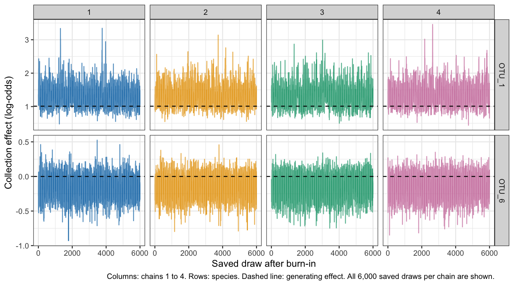<!-- -->

Compare the height and spread of the traces between columns for the same species. Persistent separation between chains, a continuing upward or downward drift, or long periods stuck in a narrow region would warrant investigation. Jagged movement and a wide vertical spread are not by themselves failures: they may reflect a broad posterior distribution.

The black line asks a different question, about **where the generating effect lies relative to the sampled values**. Agreement between chains checks whether the calculation is stable; proximity to the line checks recovery in this simulation. Chains can agree while being centred away from truth, or agree on a wide interval containing truth. Do not change the sampler merely to force its traces onto the black line.

### Inspect a primer’s detection rate

``` r
primer_trace <- diagnostic_examples$traces$detection

occJSDM::plotTraceplot(
  primer_trace$draws,
  param_name = "PCR detection probability",
  dimnames1 = primer_trace$label1,
  dimnames2 = primer_trace$label2
) +
  geom_hline(
    data = primer_trace$truth,
    aes(yintercept = truth), colour = "black", linetype = "dashed"
  ) +
  facet_grid(label2 ~ chain, scales = "free_y") +
  scale_y_continuous(labels = scales::label_percent()) +
  labs(
    x = "Saved draw after burn-in",
    caption = "Primer 1, default-prior fit. Columns: chains. Rows: species. Truth accounts for the fitted read threshold."
  ) +
  theme(legend.position = "none")
```

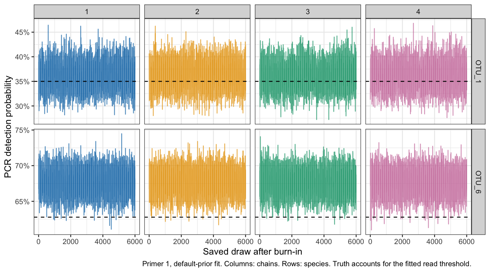<!-- -->

These true probabilities include the read-threshold adjustment explained under [laboratory rates by primer](#laboratory-true-positive-and-false-positive-rates-by-primer). The collection and PCR trace examples use the same two species, so neither panel was selected for especially good recovery.

### Follow up an actual diagnostic warning

This example selects the field-contamination parameter with the lowest ESS in the package’s table for the longer alternative-prior fit, which is OTU_6. Selection uses diagnostics, not distance from truth.

``` r
field_trace <- diagnostic_examples$traces$field_contamination

occJSDM::plotTraceplot(
  field_trace$draws,
  param_name = "Field-contamination probability",
  dimnames1 = field_trace$label1
) +
  geom_hline(
    data = field_trace$truth,
    aes(yintercept = truth), colour = "black", linetype = "dashed"
  ) +
  facet_wrap(~ chain, ncol = 1) +
  scale_x_continuous(breaks = seq(0, 12000, by = 3000)) +
  scale_y_continuous(labels = scales::label_percent()) +
  labs(
    x = "Saved draw after burn-in",
    caption = "OTU_6, longer alternative-prior fit. Panels: chains. Dashed line: true field-contamination probability."
  ) +
  theme(legend.position = "none")
```

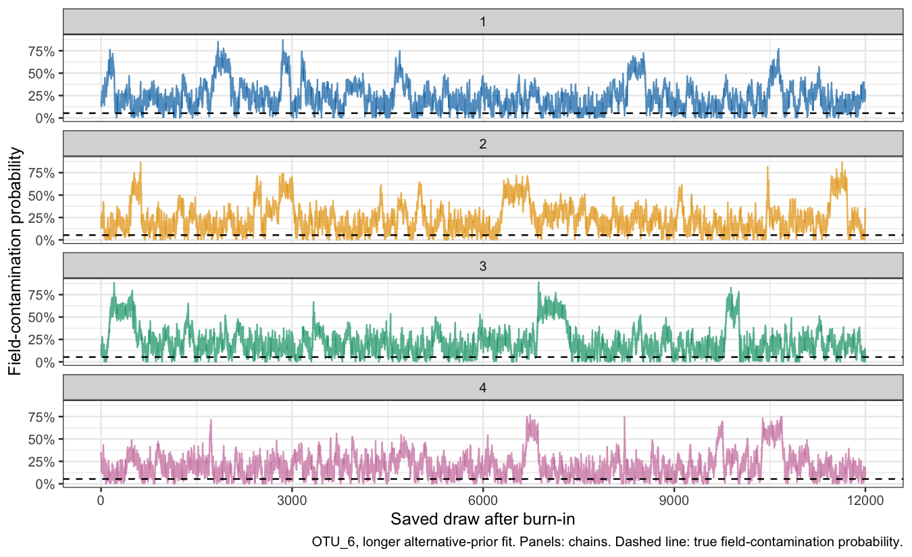<!-- -->

There are 48,000 retained draws here, but their dependence means they carry much less independent information. The package’s ESS for this parameter is about 397. That is a numerical limitation on posterior summaries, not a count of field samples. This fit should not be described as having cleared every diagnostic simply because it was run for longer.

The traces make this slow movement visible: each chain spends stretches at relatively high or low contamination rates. The true rate is 5.3%, near the bottom of the panels, but the fit also gives substantial weight to much higher rates. The example therefore raises two separate concerns: how precisely the sampler has estimated its posterior summaries, and how well that posterior recovers the ecological truth.

### When chains settle on two different explanations

In that example the chains explore the same range of values, only slowly. A different failure is possible. Chains can each settle on a different explanation of the same observations, each looking stable on its own, so that the pooled summary averages the two. Rhat compares chains, so it flags this only when chains actually land in different explanations. One of our simulation studies found such a mirror explanation when laboratory contamination was set far above what the default priors assume; the [appendix](#the-mirror-labelling-study) describes it.

To check your own fit, summarise each chain separately for every species. This needs a two-stage or occupancy fit with at least two chains and two species. The collection and field-contamination arrays are `NULL` for a plain JSDM fit, and with one species or one chain the arrays lose a dimension.

``` r
results <- fitmodel$results_output

# Summarise over iterations (dimension 2), keeping species and chains apart.
chain_summary <- function(draws, statistic = mean) {
  out <- apply(draws, c(1, 3), statistic)
  dimnames(out) <- list(fitmodel$infos$speciesNames,
                        paste0("chain_", seq_len(ncol(out))))
  round(out, 3)
}

chain_summary(results$theta0_output)
chain_summary(results$theta0_output, sd)

# Collection intercept, then the two occupancy slopes.
chain_summary(results$beta_theta_output[1, , , ])
chain_summary(results$beta_theta_output[1, , , ], sd)
chain_summary(results$jsdm_output$B_output[1, , , ])
chain_summary(results$jsdm_output$B_output[2, , , ])

chain_summary(results$jsdm_output$B0_output)
```

`theta0_output` and `jsdm_output$B0_output`, which holds the occupancy intercepts, are species by iteration by chain. The first row of `beta_theta_output` is the collection intercept, on the log-odds scale at the mean of the standardized collection covariates (and reference levels of factors). Rows 1 and 2 of `jsdm_output$B_output` are the occupancy slopes on the first and second environmental covariates.

The warning sign is a species whose chains fall into groups with means that differ by far more than each chain’s own standard deviation. In the study the two groups’ `theta0` means were about 0.036 and 0.25, with chain standard deviations of about 0.025 and 0.04.

In our interpretation, two further signs suggest which group is the mirror. One is a `theta0` far above what its prior expects: under the default Beta(1, 20), about 0.3% of the prior lies above 0.25. The other is occupancy or collection relations that run opposite to what is ecologically plausible for the species. Real data have no truth line to settle the question, so these are judgments, not proofs.

Compare chains on `theta0`, the collection intercept and the two environmental slopes, not on average occupancy or the occupancy intercepts `B0` alone. In the study these four separated the chains and the other two did not.

What to do next is also our interpretation, not a tested procedure. If the chains fall into groups, do not report the pooled summary, which averages the explanations. Report each group’s estimates, and say which you consider plausible and why, or that neither can be ruled out. Refitting with other seeds (`set.seed()` before `runOccJSDM()`) shows how often each explanation appears when chains are run the package’s usual way; it cannot show which one is right. A tighter prior on `theta0` is an assumption to justify from laboratory and field practice, not a tested fix.

### Check the trait coefficients

The package’s diagnostics table does not include the trait coefficients (the matrix `G`). Because trait recovery is a main concern here, this lesson computed their Rhat and ESS from the saved draws, keeping each chain separate, alongside those of the environmental coefficients. The [appendix](#where-to-find-other-parameter-draws) shows how.

``` r
outputs$coefficients |>
  group_by(arm, block) |>
  summarise(
    maximum_Rhat = max(rhat),
    minimum_bulk_ESS = min(ess_bulk),
    minimum_tail_ESS = min(ess_tail),
    .groups = "drop"
  ) |>
  mutate(fit = unname(fit_labels[arm])) |>
  select(fit, block, maximum_Rhat, minimum_bulk_ESS, minimum_tail_ESS) |>
  knitr::kable(digits = c(0, 0, 3, 0, 0),
               caption = "Direct checks of environmental and trait coefficient sampling.")
```

| fit | block | maximum_Rhat | minimum_bulk_ESS | minimum_tail_ESS |
|:---|:---|---:|---:|---:|
| PCR observations | Environment | 1.010 | 736 | 952 |
| PCR observations | Trait | 1.002 | 941 | 1845 |
| Perfect observation | Environment | 1.001 | 2141 | 3420 |
| Perfect observation | Trait | 1.004 | 1000 | 1931 |

Direct checks of environmental and trait coefficient sampling.

The tail ESS is the one that matters for interval endpoints. See the [`posterior` diagnostics documentation](https://mc-stan.org/posterior/reference/diagnostics.html) for the definitions used in this coefficient table.

### Decide what to do about a flagged parameter

When a parameter is flagged, inspect its trace and consider which ecological conclusions depend on it. If the chains explore similar distributions but move slowly, more iterations may improve precision. If they remain separated or drift, investigate the model, priors, data information and starting values rather than assuming a longer run will necessarily solve the problem. Recheck both diagnostics and the stability of the reported estimates after any change.

Keep `nthin = 1` unless storage is the limiting concern. Discarding additional draws does not make the sampler explore better or repair chains trapped in different regions. Never discard selected chains or tune priors just to make the examples pass a diagnostic threshold. In a real dataset the black truth lines are unavailable, so convergence checks, model checks and ecological judgment each have a separate role.

### Can WAIC compare these fits?

WAIC, the widely applicable information criterion, is meant to estimate how well a model would predict new data, with smaller values better. The package’s current value cannot rank the perfect-observation and PCR fits, which have different response data. It is also not yet a valid guide to prediction between fits of the same data; [Lesson 4](occJSDM-lesson-4.md#check-the-additional-fit-and-understand-the-waic-limitation) explains why and compares models using actual independent sites instead.

## How many effects does each fit resolve?

Each environmental coefficient describes how one species responds to one gradient, after accounting for the other gradient and the hidden site factors, which the [ordination section](#ordination-compare-the-combined-effect-before-naming-the-axes) examines. With ten species and two gradients, there are twenty coefficients.

``` r
effect_counts <- outputs$coefficients |>
  group_by(arm, block) |>
  summarise(
    effects = n(),
    intervals_excluding_zero = sum(excludes_zero),
    .groups = "drop"
  ) |>
  mutate(fit = unname(fit_labels[arm])) |>
  select(fit, block, effects, intervals_excluding_zero)

knitr::kable(effect_counts, caption = "How many 95% intervals exclude zero?")
```

| fit                 | block       | effects | intervals_excluding_zero |
|:--------------------|:------------|--------:|-------------------------:|
| PCR observations    | Environment |      20 |                        9 |
| PCR observations    | Trait       |       4 |                        1 |
| Perfect observation | Environment |      20 |                       12 |
| Perfect observation | Trait       |       4 |                        1 |

How many 95% intervals exclude zero?

Of the 20 environmental intervals, 12 exclude zero in the perfect-observation fit and 9 in the PCR fit. An interval that excludes zero is read as a resolved direction, because the whole interval, and so at least 97.5% of the draws, lies on one side of zero.

Perfect observation identifies the direction of more environmental effects in this example. That makes ecological sense: it removes uncertainty about whether each species was present. It does not reveal the underlying occurrence probabilities, because each site still gives one presence or absence per species, not its probability. Nor does it guarantee precise coefficients.

### Put the true coefficient beside its estimate

The package function `returnOccupancyCovariates()` returns an array: posterior draws by environmental covariate by species. The slice `environment_draws[, "X_psi.EnvCov.1", "OTU_1"]` keeps every draw, the empty first position, for one covariate and one species. A full fit is available after following the reproduction instructions at the end of this lesson.

``` r
environment_draws <- occJSDM::returnOccupancyCovariates(fitmodel)

example_draws <- environment_draws[, "X_psi.EnvCov.1", "OTU_1"]

tibble(
  estimate = mean(example_draws),
  lower = quantile(example_draws, 0.025),
  upper = quantile(example_draws, 0.975)
)
```

The package’s plots below put each coefficient beside its generating value. Truth is put on the same standardized scale as the estimates, so a cross and a bar can be compared directly.

These are the package’s own plots with the simulated truth added. Knitting shows saved images of them; the commands run on your own `fitmodel`.

``` r
native_examples <- readRDS("teaching-data/native-plots.rds")
```

``` r
library(occJSDM)
library(dplyr)
library(ggplot2)

native_truth <- native_examples$truth

# Compatible with the ternary theme elements registered by occJSDM.
native_theme <- ggtern::theme_bw(base_size = 12)
```

Start with the ordinary call and add the known coefficient as a black cross. Bars are native 95% posterior intervals, where “native”, here and in the captions, means drawn by the package’s own plotting function; these functions do not draw a posterior mean.

``` r
environment_truth <- native_truth$environment |>
  filter(covariate == "X_psi.EnvCov.1")

native_environment <- plotOccupancyCovariates(
  fitmodel, covName = "X_psi.EnvCov.1"
) +
  native_theme +
  geom_point(
    data = environment_truth, aes(x = species, y = truth),
    inherit.aes = FALSE, shape = 4, size = 3, stroke = 1
  ) +
  labs(
    title = "Environmental gradient 1",
    y = "Effect on log-odds per standard deviation",
    caption = "Black cross: truth. Bar: native 95% interval. Red line: zero effect."
  ) +
  theme(axis.text.x = element_text(angle = 45, hjust = 1))

native_environment
```

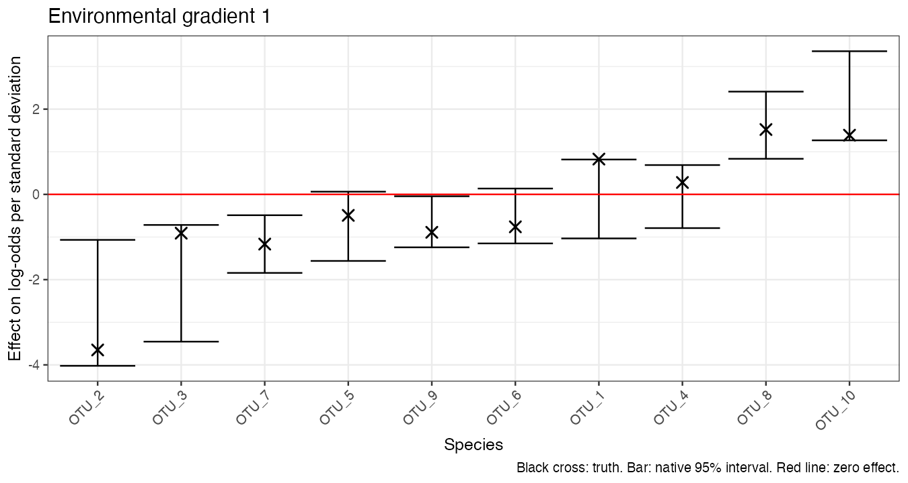

The second environmental gradient uses the same call with its own name.

``` r
environment_2_truth <- native_truth$environment |>
  filter(covariate == "X_psi.EnvCov.2")

native_environment_2 <- plotOccupancyCovariates(
  fitmodel, covName = "X_psi.EnvCov.2"
) +
  native_theme +
  geom_point(
    data = environment_2_truth, aes(x = species, y = truth),
    inherit.aes = FALSE, shape = 4, size = 3, stroke = 1
  ) +
  labs(
    title = "Environmental gradient 2",
    y = "Effect on log-odds per standard deviation",
    caption = "Black cross: truth. Bar: native 95% interval. Red line: zero effect."
  ) +
  theme(axis.text.x = element_text(angle = 45, hjust = 1))

native_environment_2
```

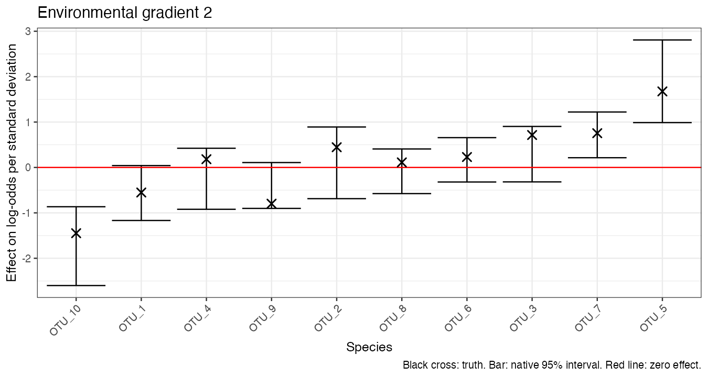

The same calls on the perfect-observation fit, loaded as `fitmodel_perfect`, show what the occupancy model recovers when every presence and absence is known. The truth crosses are the same; only the fit changes.

``` r
native_environment_perfect_1 <- plotOccupancyCovariates(
  fitmodel_perfect, covName = "X_psi.EnvCov.1"
) +
  native_theme +
  geom_point(
    data = environment_truth, aes(x = species, y = truth),
    inherit.aes = FALSE, shape = 4, size = 3, stroke = 1
  ) +
  labs(
    title = "Environmental gradient 1, perfect-observation fit",
    y = "Effect on log-odds per standard deviation",
    caption = "Black cross: truth. Bar: native 95% interval. Red line: zero effect."
  ) +
  theme(axis.text.x = element_text(angle = 45, hjust = 1))

native_environment_perfect_1
```

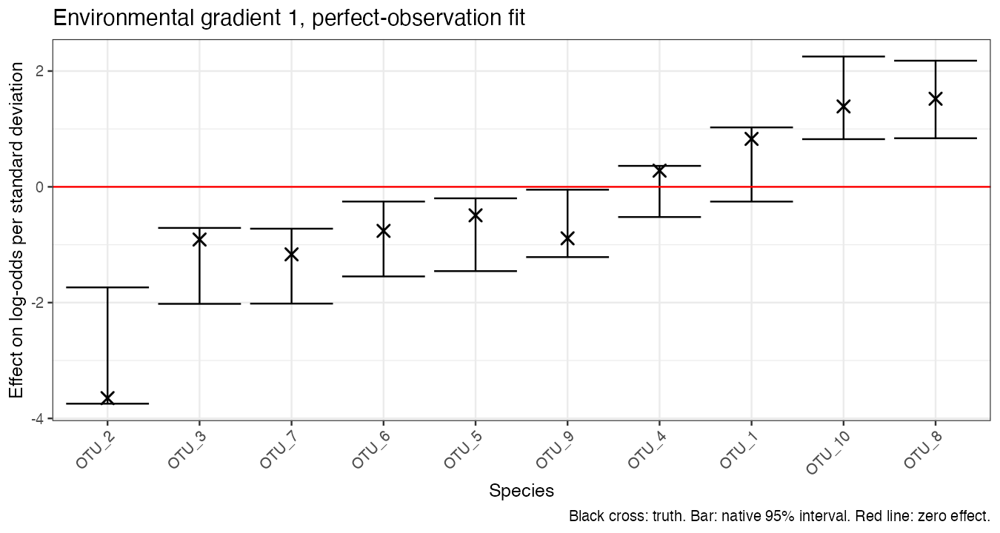

``` r
native_environment_perfect_2 <- plotOccupancyCovariates(
  fitmodel_perfect, covName = "X_psi.EnvCov.2"
) +
  native_theme +
  geom_point(
    data = environment_2_truth, aes(x = species, y = truth),
    inherit.aes = FALSE, shape = 4, size = 3, stroke = 1
  ) +
  labs(
    title = "Environmental gradient 2, perfect-observation fit",
    y = "Effect on log-odds per standard deviation",
    caption = "Black cross: truth. Bar: native 95% interval. Red line: zero effect."
  ) +
  theme(axis.text.x = element_text(angle = 45, hjust = 1))

native_environment_perfect_2
```

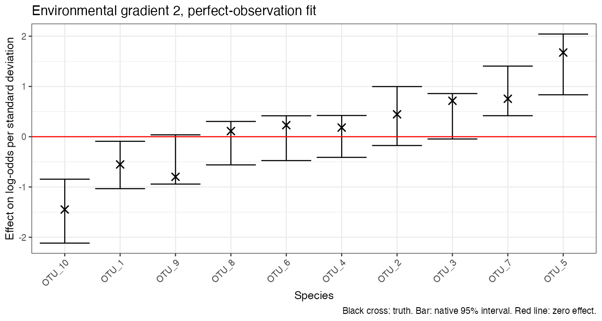

A cross outside its bar shows an interval that misses truth in this dataset. Species order follows the interval bounds, so positions differ between plots. The figure below is custom because no package plot draws both fits in one panel, which this section’s question needs. It keeps one species order for both fits.

``` r
environment_effects <- outputs$coefficients |>
  filter(block == "Environment") |>
  mutate(species = factor(term, levels = species_order))

ggplot(environment_effects, aes(x = species)) +
  geom_hline(yintercept = 0, colour = "grey55", linetype = "dashed") +
  geom_pointrange(
    aes(y = estimate, ymin = lower, ymax = upper),
    colour = "#0072B2"
  ) +
  geom_point(aes(y = truth), shape = 4, size = 3, stroke = 1) +
  facet_grid(
    covariate ~ arm,
    labeller = labeller(covariate = environment_labels, arm = fit_labels)
  ) +
  labs(
    x = "Species",
    y = "Environmental effect on log-odds of occurrence",
    caption = "Black cross: true coefficient. Blue point: posterior mean. Bar: 95% interval."
  ) +
  theme(axis.text.x = element_text(angle = 60, hjust = 1))
```

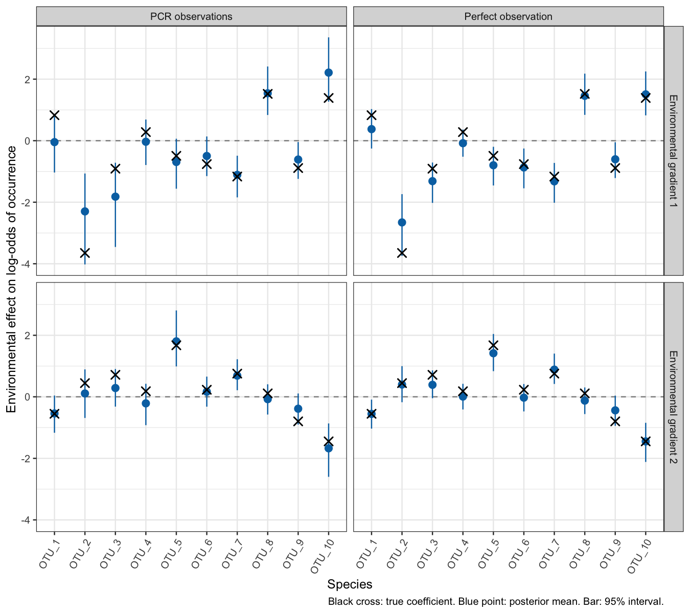<!-- -->

A positive coefficient means occurrence becomes more likely along that gradient; a negative one means less likely. Zero means no direct response to that covariate in this model. These coefficients are changes in log-odds for a one-standard-deviation change in the environmental predictor, not percentage-point changes in occurrence probability.

`runOccJSDM()` standardizes the occupancy covariates itself (the fit stores the table of standardized covariates as `fitmodel$X_psi`), so you supply raw values and read effects per standard deviation. The [response-curve section](#what-does-an-effect-mean-for-a-species-distribution) shows the conversion back to raw units.

Read each species in three steps: where is the black cross, is it inside the bar, and how wide is the bar? If the interval crosses zero, the fitted model has not clearly resolved the direction under this criterion. It does **not** establish that the environmental effect is absent. Conversely, excluding zero does not guarantee an accurate effect size.

## What does an effect mean for a species’ distribution?

A response curve translates a coefficient into occurrence probabilities. Here we change one measured gradient, hold the other at its median, and set the [hidden site-factor contribution](#what-this-lesson-answers) to zero. Both the true and fitted curves use those same conditions.

These are **environmental response profiles**, not fitted probabilities at surveyed sites ([later in this lesson](#distinguish-fitted-probabilities-occupancy-states-and-new-site-predictions)) or averages over unknown conditions at a new site ([Lesson 4](occJSDM-lesson-4.md#which-true-probability-should-a-new-site-prediction-recover)). The package function used here, `returnOccupancyGradient()`, evaluates the zero-factor profile.

``` r
response_profile <- occJSDM::returnOccupancyGradient(
  fitmodel,
  covName = "X_psi.EnvCov.1",
  n_grid = 40
)
```

`plotOccupancyGradient()` shows how occupancy changes along one environmental predictor. The blue line is the posterior median and the ribbon is a pointwise 95% credible interval. The black dashed line is the generating probability for the same target. Other standardized environmental predictors are held at their observed medians, and site factors are set to zero.

The package plot’s horizontal axis uses standardized predictor values. Zero is the observed raw-scale mean and one unit is one observed standard deviation. The grid spans the 2nd to 98th percentiles; the rug shows all observed site values. The table supplies the original scale: `raw_value = mean + sd * standardized_value`.

``` r
remaining_examples <- readRDS("teaching-data/remaining-plots-data.rds")
knitr::kable(remaining_examples$scaling, digits = 3)
```

| covariate      |  mean |     sd |
|:---------------|------:|-------:|
| X_psi.EnvCov.1 | 1.602 | 10.422 |
| X_psi.EnvCov.2 | 0.339 |  8.802 |

``` r
library(occJSDM)
library(dplyr)
library(ggplot2)

remaining_truth <- remaining_examples$truth
remaining_theme <- ggtern::theme_bw(base_size = 12)
```

``` r
gradient_1_truth <- remaining_truth$gradients |>
  filter(covariate == "X_psi.EnvCov.1")

remaining_gradient_1 <- plotOccupancyGradient(
  fitmodel, covName = "X_psi.EnvCov.1", idx_species = 1:10
) +
  remaining_theme +
  geom_line(
    data = gradient_1_truth, aes(x = x, y = truth),
    inherit.aes = FALSE, colour = "black", linetype = "dashed"
  ) +
  labs(
    title = "Environmental gradient 1: site factors set to zero",
    x = "Environmental gradient 1 (standard deviations from its mean)",
    caption = "Blue: posterior median and pointwise 95% interval. Black dashed: true probability."
  )

remaining_gradient_1
```

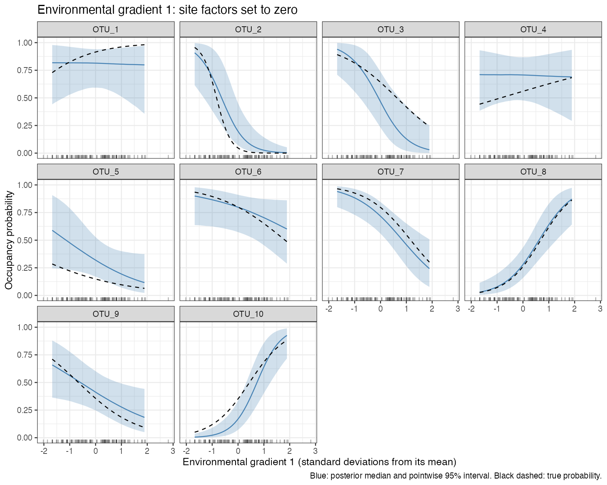

The second predictor has its own slope for every species. Apply the same call to its name and compare its true and fitted curves.

``` r
gradient_2_truth <- remaining_truth$gradients |>
  filter(covariate == "X_psi.EnvCov.2")

remaining_gradient_2 <- plotOccupancyGradient(
  fitmodel, covName = "X_psi.EnvCov.2", idx_species = 1:10
) +
  remaining_theme +
  geom_line(
    data = gradient_2_truth, aes(x = x, y = truth),
    inherit.aes = FALSE, colour = "black", linetype = "dashed"
  ) +
  labs(
    title = "Environmental gradient 2: site factors set to zero",
    x = "Environmental gradient 2 (standard deviations from its mean)",
    caption = "Blue: posterior median and pointwise 95% interval. Black dashed: true probability."
  )

remaining_gradient_2
```

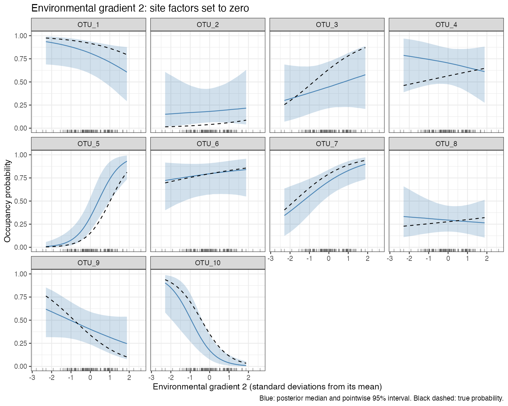

Notice that the same coefficient can produce very different probability changes depending on where the species starts on the vertical axis. An effect near a baseline probability of 50% has more room to move the probability than the same log-odds change near 0% or 100%. The curves make that easier to see than the coefficient plot alone.

### The same curves in original units

`plotOccupancyGradient()` labels its horizontal axis in standard deviations, which makes gradients comparable with each other but is not how a report states them. `plotCovariateEffect()` draws the same curves under the same conditions: other numeric covariates at their medians, and hidden site factors and spatial terms at zero. Its horizontal axis is in the covariate’s original units, the units you recorded it in, and runs over the full observed range rather than the 2nd to 98th percentiles. This is the version to put in a report, or to show a reader outside modelling.

The function accepts several covariate names and returns a named list with one plot per covariate, even when you give one name. Take the plot by its name, as below, before adding layers to it. The black dashed line is the generating curve on the function’s own grid, with the second gradient at its median.

``` r
covariate_effect_examples <- readRDS("teaching-data/covariate-effect-data.rds")
```

``` r
library(occJSDM)
library(dplyr)
library(ggplot2)

covariate_effect_truth <- covariate_effect_examples$truth
covariate_effect_theme <- ggtern::theme_bw(base_size = 12)
```

``` r
# plotCovariateEffect() returns a named list: take the plot by its covariate name.
covariate_effect_1 <- plotCovariateEffect(
  fitmodel, covNames = "X_psi.EnvCov.1", idx_species = 1:10
)[["X_psi.EnvCov.1"]] +
  covariate_effect_theme +
  geom_line(
    data = covariate_effect_truth, aes(x = x, y = truth),
    inherit.aes = FALSE, colour = "black", linetype = "dashed"
  ) +
  labs(
    title = "Environmental gradient 1 in its original units: site factors set to zero",
    x = "Environmental gradient 1 (original units)",
    caption = "Blue: posterior median and pointwise 95% interval. Black dashed: true probability."
  )

covariate_effect_1
```

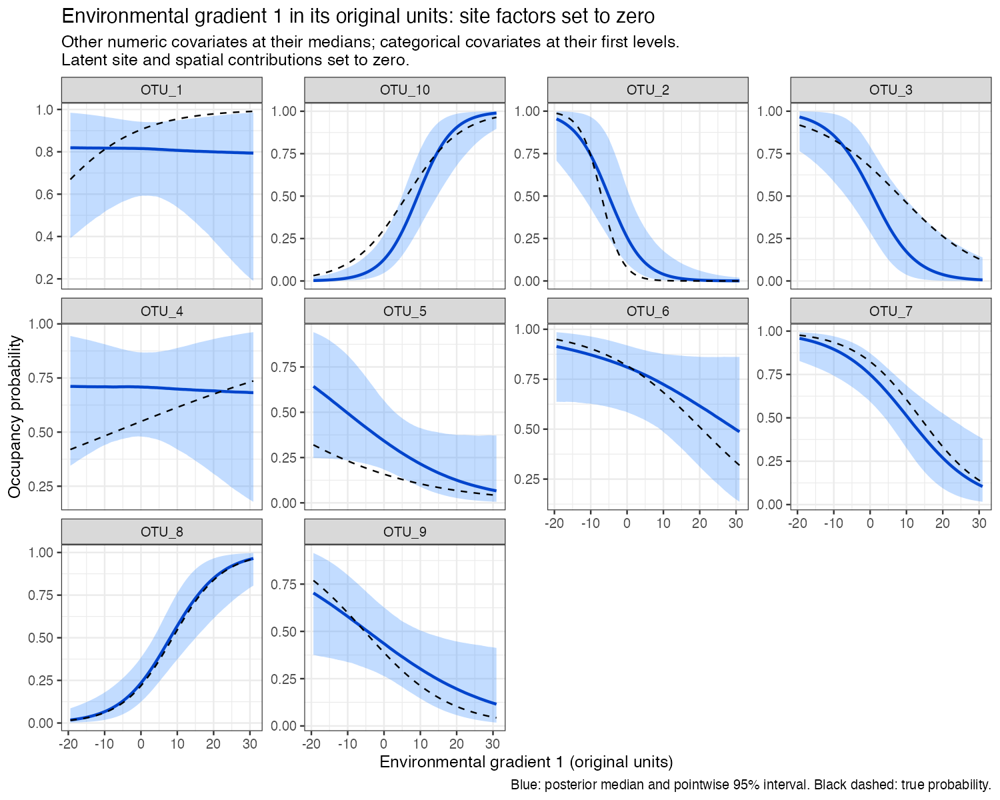

The axis runs from -19.4 to 30.9, the lowest and highest values observed at the sites. The same call with `covNames = "X_psi.EnvCov.2"` draws the second gradient. The function orders the panels alphabetically by species name, so `OTU_10` comes second.

This figure and the coefficient plot answer different questions. The coefficient plot says whether an effect is credibly different from zero on the log-odds scale. This curve shows how large the effect is as a change in occupancy probability. As with the curves above, the same coefficient moves occupancy a lot for a species whose baseline is near 50% and little for one near 0% or 100%.

The generating curve lies inside the 95% band at every point of the grid for six of the ten species. The largest gap between the posterior median and the truth is 0.32 on the probability scale, for OTU_5. These departures are the fit’s, not the function’s. Both functions summarise the same draws under the same conditions, and the standardized curves above miss the truth for the same species. On your own survey there is no dashed line, so read the band’s width as your uncertainty, and trust the curve’s shape only across the range your sites cover.

### Baseline occupancy

Like the response curves, `returnOccupancyRates()` describes the probability under fixed conditions, here with the standardized measured predictors and the hidden factors all at zero. It transforms each species’ occupancy intercept to the probability scale and returns a **posterior-draw-by-species matrix**, pooling the draws of all chains. In this fit, there are 24,000 rows (four chains of 6,000 kept draws) and ten species columns.

Use it to compare species’ baseline occurrence probabilities under the same reference conditions, or to report a baseline estimate with its uncertainty. This is not the average occupancy across the landscape: measured environmental effects and hidden site contributions have been set to zero, not averaged over sites.

``` r
baseline_draws <- occJSDM::returnOccupancyRates(fitmodel)

# One posterior mean per species, named by species.
colMeans(baseline_draws)

# Two rows (lower and upper 95% credible limits), one column per species.
apply(baseline_draws, 2, quantile, probs = c(0.025, 0.975))
```

The package plot below shows the intercepts converted to probabilities. Baseline occupancy sets the standardized environmental predictors and site factors to zero.

``` r
native_occupancy_rates <- plotOccupancyRates(fitmodel) +
  native_theme +
  geom_point(
    data = native_truth$occupancy_rates, aes(x = species, y = truth),
    inherit.aes = FALSE, shape = 4, size = 3, stroke = 1
  ) +
  labs(
    title = "Baseline occupancy: zero predictors and zero site factors",
    y = "Occurrence probability",
    caption = "Black cross: truth. Bar: native 95% interval."
  )

native_occupancy_rates
```

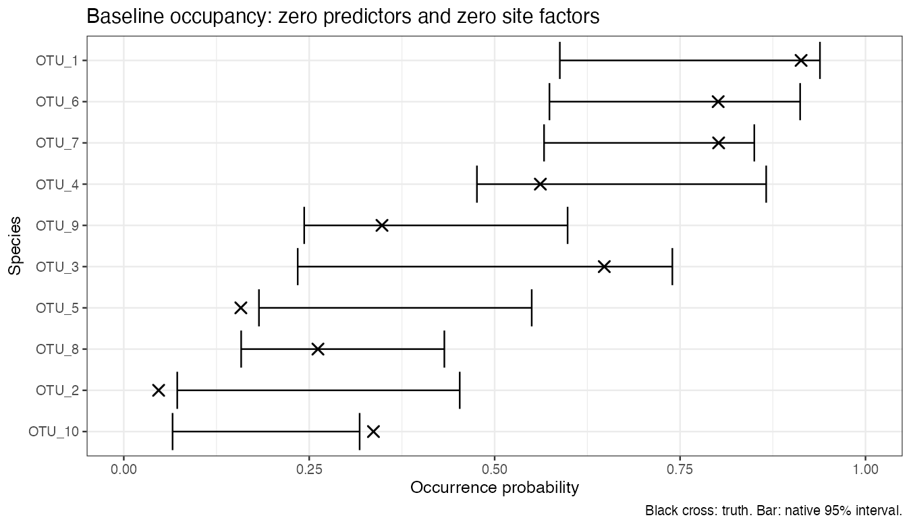

`colMeans()` averages probabilities after transforming every draw; transforming the mean log-odds would generally give a different answer. Report the mean of the transformed draws, as `colMeans()` gives it, because it is the posterior mean of the probability itself. Here are these posterior summaries and their matching true values.

``` r
outputs$baseline |>
  filter(arm == "default") |>
  select(species, truth, estimate, lower, upper) |>
  mutate(across(c(truth, estimate, lower, upper), ~ scales::percent(.x, accuracy = 0.1))) |>
  knitr::kable(caption = "Baseline probabilities: all predictor contributions set to zero.")
```

| species | truth | estimate | lower | upper |
|:--------|:------|:---------|:------|:------|
| OTU_1   | 91.3% | 79.8%    | 58.8% | 93.9% |
| OTU_2   | 4.7%  | 21.6%    | 7.2%  | 45.3% |
| OTU_3   | 64.8% | 47.3%    | 23.5% | 74.0% |
| OTU_4   | 56.2% | 69.5%    | 47.6% | 86.6% |
| OTU_5   | 15.8% | 34.4%    | 18.2% | 55.0% |
| OTU_6   | 80.1% | 78.6%    | 57.4% | 91.2% |
| OTU_7   | 80.2% | 71.9%    | 56.7% | 85.0% |
| OTU_8   | 26.2% | 28.3%    | 15.8% | 43.2% |
| OTU_9   | 34.8% | 41.2%    | 24.3% | 59.8% |
| OTU_10  | 33.7% | 16.7%    | 6.6%  | 31.8% |

Baseline probabilities: all predictor contributions set to zero.

In the PCR fit, the 95% interval misses the true baseline for three of the ten species (OTU_2, OTU_5 and OTU_10) and contains it for the rest.

## Traits ask a harder, different question

An environmental coefficient asks, for example, whether a particular species becomes more likely along a gradient. A trait effect asks whether **differences in that coefficient among species** can be explained by a measured trait. The trait acts on the environmental response, not directly on the occurrence observation. For example, a measured trait such as drought tolerance could make some species respond less steeply to a drying gradient.

We have 100 sites to help estimate each species’ environmental response, but only ten species whose responses can be compared with their traits. More PCRs do not create more species-level contrasts. More sites can improve the estimated species responses, but they do not remove all uncertainty in the trait relationship.

``` r
trait_draws <- occJSDM::returnTraitsCoeff(fitmodel)

# Draws for how Trait_1 changes the response to environmental gradient 1.
trait_1_draws <- trait_draws[, "X_psi.EnvCov.1", "Trait_1"]
```

The generating trait matrix is `known_truth$jsdmParams_true$G`. The simulator used unstandardized traits, whereas fitting standardized them. A raw coefficient of -1 therefore does not necessarily appear as -1 on the fitted scale. The comparison below multiplies each generating trait coefficient by that trait’s sample standard deviation. The environmental scale already matches. Trait coefficients are therefore per standard deviation of the trait across the species surveyed, so a report should give the trait’s standard deviation beside the coefficient.

Three of the four generating trait effects are nonzero. Only one of the four intervals excludes zero in the PCR fit, and one in the perfect-observation fit. That is a genuine limitation of recovery in this example. It is not evidence that the simulation omitted trait effects, and removing observation error does not make it disappear. An oracle decomposition in the [appendix](#a-real-cancellation-inside-this-simulated-community) shows why one of them stays unresolved.

For a survey of ten or so species, expect weak trait results. A trait effect is estimated from differences among species, so more species helps most. More sites sharpen each species’ own response, and more PCRs add no species, so neither adds the species-level contrasts a trait effect needs.

`plotTraitsCoefficients()` displays one environmental response at a time, with a 95% posterior interval for each measured trait. It does not draw a posterior mean. Here are both environmental responses from the PCR-observation fit, with the generating coefficients described above. The black crosses include the trait-standardization adjustment: each raw generating coefficient is multiplied by that trait’s standard deviation among the ten species. Red lines mark zero effect.

These calls use the full `fitmodel`.

``` r
native_trait_truth <- outputs$coefficients |>
  filter(arm == "default", block == "Trait") |>
  select(covariate, trait = term, truth)

native_trait_theme <- ggtern::theme_bw(base_size = 12) +
  theme(axis.text = element_text(angle = 0))
```

The setup takes ggtern’s theme for the reason given at the [start of this lesson](#what-this-lesson-answers), and resets the axis text angle, which the package’s trait plot otherwise turns to vertical.

``` r
native_traits_1 <- occJSDM::plotTraitsCoefficients(
  fitmodel, covName = "X_psi.EnvCov.1"
) +
  native_trait_theme +
  geom_point(
    data = filter(native_trait_truth, covariate == "X_psi.EnvCov.1"),
    aes(x = trait, y = truth), inherit.aes = FALSE,
    shape = 4, size = 3, stroke = 1
  ) +
  labs(
    title = "Trait effects on the response to environmental gradient 1",
    x = "Measured trait",
    y = "Change in environmental coefficient\nper trait standard deviation",
    caption = "Black cross: generating effect on the fitted scale. Bar: native 95% interval."
  )

native_traits_1
```

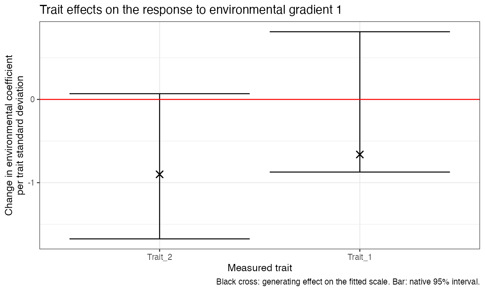

The second gradient uses the same call with its name.

``` r
native_traits_2 <- occJSDM::plotTraitsCoefficients(
  fitmodel, covName = "X_psi.EnvCov.2"
) +
  native_trait_theme +
  geom_point(
    data = filter(native_trait_truth, covariate == "X_psi.EnvCov.2"),
    aes(x = trait, y = truth), inherit.aes = FALSE,
    shape = 4, size = 3, stroke = 1
  ) +
  labs(
    title = "Trait effects on the response to environmental gradient 2",
    x = "Measured trait",
    y = "Change in environmental coefficient\nper trait standard deviation",
    caption = "Black cross: generating effect on the fitted scale. Bar: native 95% interval."
  )

native_traits_2
```

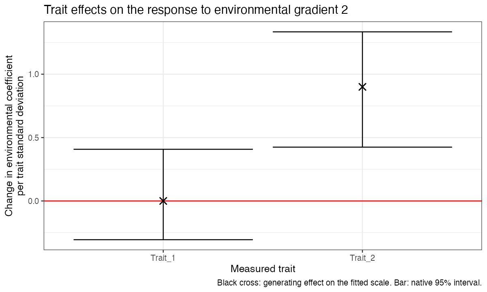

The same two calls on the perfect-observation fit, `fitmodel_perfect`, use the same generating crosses.

``` r
native_traits_perfect_1 <- occJSDM::plotTraitsCoefficients(
  fitmodel_perfect, covName = "X_psi.EnvCov.1"
) +
  native_trait_theme +
  geom_point(
    data = filter(native_trait_truth, covariate == "X_psi.EnvCov.1"),
    aes(x = trait, y = truth), inherit.aes = FALSE,
    shape = 4, size = 3, stroke = 1
  ) +
  labs(
    title = "Trait effects on the response to gradient 1, perfect-observation fit",
    x = "Measured trait",
    y = "Change in environmental coefficient\nper trait standard deviation",
    caption = "Black cross: generating effect on the fitted scale. Bar: native 95% interval."
  )

native_traits_perfect_1
```

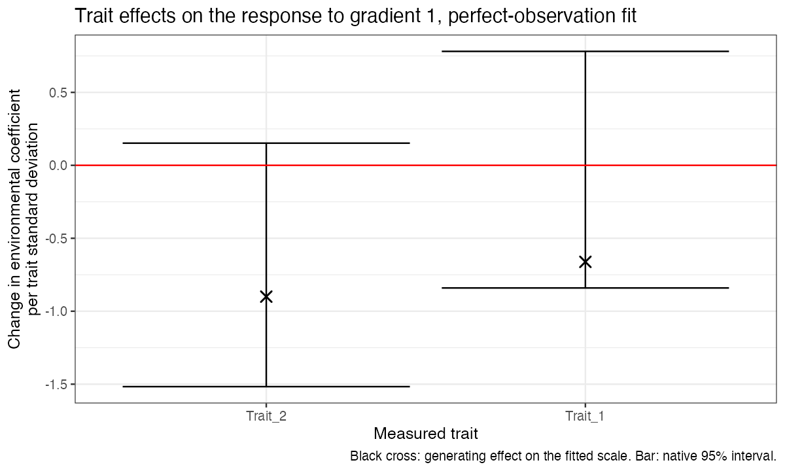

``` r
native_traits_perfect_2 <- occJSDM::plotTraitsCoefficients(
  fitmodel_perfect, covName = "X_psi.EnvCov.2"
) +
  native_trait_theme +
  geom_point(
    data = filter(native_trait_truth, covariate == "X_psi.EnvCov.2"),
    aes(x = trait, y = truth), inherit.aes = FALSE,
    shape = 4, size = 3, stroke = 1
  ) +
  labs(
    title = "Trait effects on the response to gradient 2, perfect-observation fit",
    x = "Measured trait",
    y = "Change in environmental coefficient\nper trait standard deviation",
    caption = "Black cross: generating effect on the fitted scale. Bar: native 95% interval."
  )

native_traits_perfect_2
```

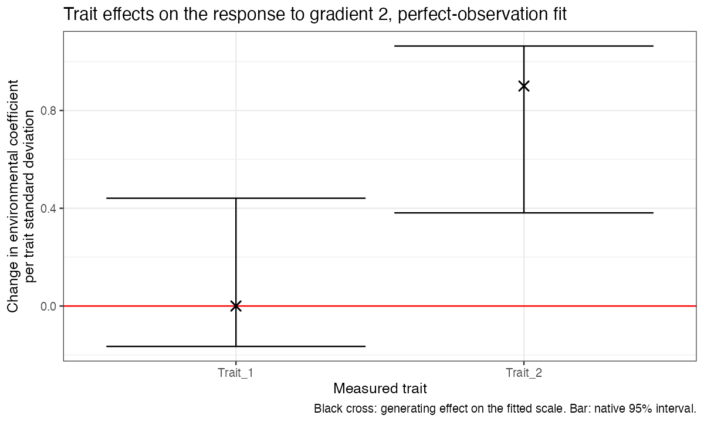

Read each bar against both references. Crossing the red line means the fitted interval includes zero; enclosing the black cross means it includes the generating effect. Those are separate questions. The package’s function orders traits by their lower interval endpoints, so match by the trait labels when comparing the two figures.

The plot draws intervals only. To report point estimates beside them, or to sort and filter trait-by-environment pairs, summarise the posterior array yourself. `returnTraitsCoeff()` returns draws with dimensions `[draw, environmental covariate, trait]`, with names on the last two. The recipe below builds one row per pair and works for any posterior array this package returns, such as `returnOccupancyCovariates()` or `returnCollectionCovariates()`, after adjusting the dimension names.

``` r
trait_draws <- occJSDM::returnTraitsCoeff(fitmodel)

trait_summary <- expand_grid(
  covariate = dimnames(trait_draws)[[2]],
  trait = dimnames(trait_draws)[[3]]
) |>
  rowwise() |>
  mutate(
    draws = list(trait_draws[, covariate, trait]),
    mean = mean(draws),
    lower = quantile(draws, 0.025),
    upper = quantile(draws, 0.975)
  ) |>
  ungroup() |>
  select(-draws) |>
  arrange(covariate, lower)

trait_summary
```

`expand_grid()` lists every covariate-by-trait pair, `rowwise()` lets each row pull its own vector of draws, and the three summaries are computed from that vector. The result is an ordinary tibble that can be filtered, joined to the generating values, or passed to `ggplot2`.

The figure below is custom because no package plot draws both fits in one panel. It shows the posterior mean and 95% interval of each trait effect for the perfect-observation and PCR fits, beside the same standardized truth.

``` r
trait_effects <- outputs$coefficients |>
  filter(block == "Trait")

ggplot(trait_effects, aes(x = term)) +
  geom_hline(yintercept = 0, colour = "grey55", linetype = "dashed") +
  geom_pointrange(
    aes(y = estimate, ymin = lower, ymax = upper),
    colour = "#0072B2"
  ) +
  geom_point(aes(y = truth), shape = 4, size = 3, stroke = 1) +
  facet_grid(
    covariate ~ arm,
    labeller = labeller(covariate = environment_labels, arm = fit_labels)
  ) +
  labs(
    x = "Measured species trait",
    y = "Change in environmental coefficient per trait standard deviation",
    caption = "Black cross: generating trait effect on the fitted scale. Blue: posterior mean and 95% interval."
  )
```

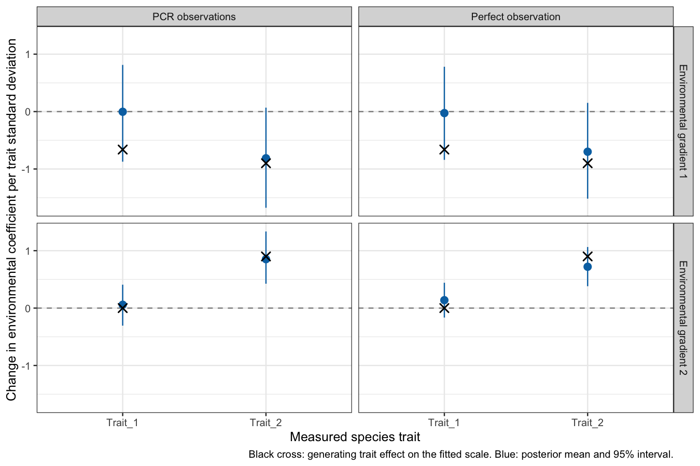<!-- -->

## Residual species associations: did we recover what was put in?

A residual correlation measures whether two species occur together, or apart, more often than their measured environmental responses predict. In the model it comes from the shared hidden site factors. It is not the raw correlation of PCR detections, and it does not establish a biological interaction between species.

Even after supplying every measured environmental covariate, this simulation still contains the deliberately generated hidden site factors. With `n_factors` hidden factors, each species is described by that many loadings. The correlations can therefore express at most that many independent patterns, and too few factors force unrelated pairs to share one.

``` r
residual_correlations <- occJSDM::returnResidualCorrelationMatrix(fitmodel)

# First dimension: lower limit, median, upper limit.
median_correlations <- residual_correlations[2, , ]
```

The returned array is quantile by species by species: its first dimension holds the lower limit, median and upper limit, and the other two name the pair of species.

The package’s heat map colours each pair by its fitted median residual correlation. Its central **X means the model cannot confidently establish whether the association is positive or negative**: the 95% credible interval includes zero. It does not mean the true correlation is zero.

The small number above each X is the true correlation from the generating loading matrix. For example, `1.00` above an X means a truly strong positive correlation was estimated too uncertainly to establish its direction. All 45 pairs have Xs in this fit. Wide uncertainty here coexists with strong true correlations, and a pale tile does not prove absence of an association.

``` r
native_correlations <- plotResidualCorrelationMatrix(
  fitmodel, showSignificance = TRUE, confidence = 0.95
) +
  native_theme +
  geom_text(
    data = native_truth$correlations,
    aes(x = species1, y = species2, label = truth_label),
    inherit.aes = FALSE, nudge_y = 0.27, size = 3
  ) +
  labs(
    title = "Residual correlation: fitted colour and known truth",
    x = "Species", y = "Species",
    caption = "Colour: fitted median. X: direction uncertain (95% interval includes zero).\nNumber: true correlation. An X does not mean the true correlation is zero. NA: undefined truth."
  ) +
  theme(axis.text.x = element_text(angle = 45, hjust = 1))

native_correlations
```

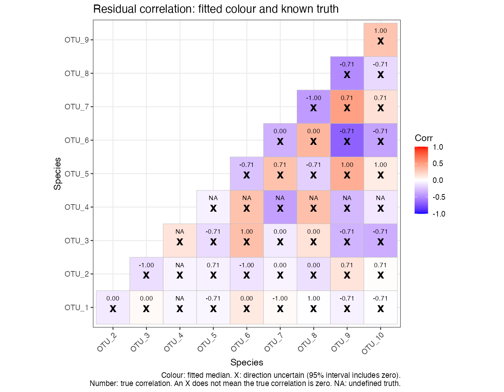

OTU_4 was generated with zero loading on both hidden site factors. Its hidden contribution has no variation, so its correlation with another hidden contribution is mathematically undefined. The package plot labels those cells `NA` and we exclude them from numerical correlation-error summaries.

Compare the pattern and magnitude, not just whether an interval crosses zero. An apparently strong estimated correlation can still be far from the generating value. With real data there is no truth to compare: read the X markers and the intervals, and report as resolved in direction only the pairs whose interval excludes zero.

## Ordination: compare the combined effect before naming the axes

An ordination places sites and species on a few axes that summarise the variation the measured covariates leave unexplained. In occJSDM those axes are the hidden site factors. Each site has a score on each factor, standing for its unmeasured conditions, and each species has a loading on each factor, its response to those conditions.

The occupancy part of the model adds three terms to give species $j$’s log-odds of occupying site $i$. The first is the species’ intercept $\beta_{0j}$. The second is the measured environmental effects: site $i$’s covariate values $X_i$ times species $j$’s coefficients $\beta_j$. The third is the hidden-factor term: site $i$’s scores $U_i$ times species $j$’s loadings $L_j$.

Written out, $\text{logit}(\psi_{ij}) = \beta_{0j} + X_i \beta_j + U_i L_j$, where $\psi_{ij}$ is the probability that species $j$ occupies site $i$ and $\text{logit}$ converts it to log-odds.

The product $U_i L_j$ is the species’ hidden site-factor contribution at that site. It is what carries residual co-occurrence. Species that load on the same factor rise and fall together across sites for reasons the measured covariates do not explain, whether an unmeasured gradient or an interaction. `returnOrdinationScores()` returns the hidden site scores $U$; `returnFactorLoadings()` returns the species loadings $L$.

Rotating both sets of axes, or reversing their signs together, leaves every product unchanged, so the observations cannot tell one orientation from another. Axis signs and order can therefore flip between fits: never interpret an axis by its number or sign alone. For the same reason, comparing unaligned true and fitted axes is a misleading accuracy check.

For an ordinary analysis, the package’s five ordination functions work directly on `fitmodel`, using its stored orientation:

``` r
ordinary_site_quantiles <- occJSDM::returnOrdinationScores(fitmodel)
ordinary_loading_quantiles <- occJSDM::returnFactorLoadings(fitmodel)
ordinary_sites <- occJSDM::plotOrdinationScores(fitmodel)
ordinary_loadings <- occJSDM::plotFactorLoadings(fitmodel)
ordinary_biplot <- occJSDM::plotBiplot(fitmodel)
```

The ordinary biplot uses the package’s stored orientation. It carries no truth overlay: on unaligned axes a correct configuration can be rotated or reflected away from the generating one, so a mismatch would not show an error.

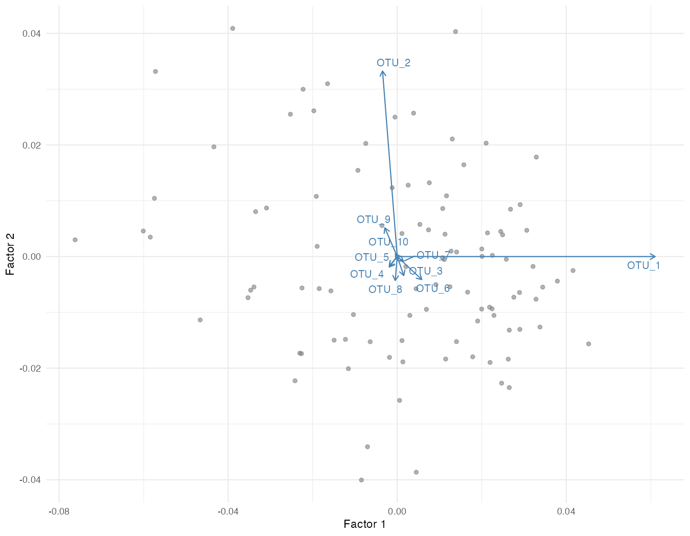

The arrows of OTU_3 and OTU_5 to OTU_10 look short here. The hidden axes’ orientation differs from draw to draw, so their loadings average towards zero across draws. That does not mean those species lack associations (OTU_4 genuinely has none). The aligned biplot in the [appendix](#read-native-ordination-plots-after-aligning-their-axes) is the one to read for associations.

A loading is a species’ response to a unit change in a hidden site score, on the occurrence log-odds scale. Opposite loading directions indicate opposite residual responses.

A site lying farther in a species-arrow direction tends to receive a larger contribution from these factors to that species’ occurrence log-odds. The complete probability also includes the intercept and measured environmental effects.

On your own survey, an ordination is for finding structure the measured covariates missed. Map the site scores to look for an unmeasured gradient. Before naming a cause, check which species load together. A shared loading says only that those species respond alike to something the survey did not measure. An opposite loading says only that they respond in opposite directions. Neither establishes competition, facilitation or another causal interaction.

The comparison with truth uses the combined contribution, multiplying scores by loadings **within each posterior draw** and then averaging the products. Multiplying the mean scores by the mean loadings would not give the same answer. This figure is custom because no package plot draws the combined contribution, the one comparison with truth that does not depend on how the hidden axes are rotated.

``` r
ggplot(outputs$residual, aes(x = truth, y = estimate)) +
  geom_abline(intercept = 0, slope = 1, linetype = "dashed") +
  geom_point(alpha = 0.25, size = 1, colour = "#0072B2") +
  facet_wrap(~ arm, labeller = labeller(arm = fit_labels)) +
  coord_equal() +
  labs(
    x = "True combined hidden site contribution (log-odds)",
    y = "Estimated hidden site contribution\n(posterior mean, log-odds)",
    caption = "Each point is a species at a surveyed site. This comparison is invariant to factor rotation."
  )
```

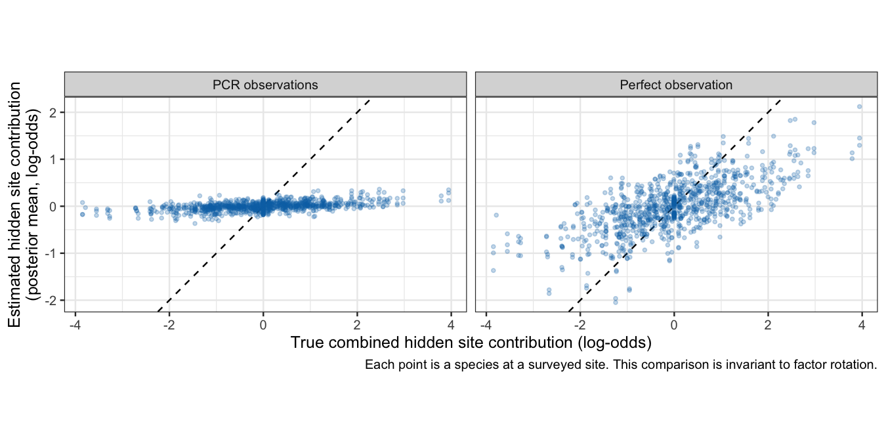<!-- -->

The diagonal is exact recovery. Points closer to zero than their true values show underestimation of the hidden contribution’s magnitude. These are fitted-site results: the observations at a site helped estimate its hidden scores. Fitted sites therefore look better recovered than new sites would.

## Collection effects and detection probabilities

Collection covariates predict whether DNA enters a field sample, conditional on the species being present at the site. Examples are the volume of water filtered, its turbidity, or the time between taking a sample and preserving it. They are separate from the environmental covariates predicting the species’ distribution.

Like the environmental coefficients, the collection coefficient below is a change in log-odds per standard deviation of its predictor. The generating collection slope has therefore been multiplied by the collection predictor’s standard deviation before comparison.

``` r
collection_truth <- native_truth$collection |>
  filter(covariate == "X_theta")

native_collection <- plotCollectionCovariates(fitmodel, covName = "X_theta") +
  native_theme +
  geom_point(
    data = collection_truth, aes(x = species, y = truth),
    inherit.aes = FALSE, shape = 4, size = 3, stroke = 1
  ) +
  labs(
    title = "Collection covariate",
    y = "Effect on log-odds per standard deviation",
    caption = "Black cross: truth. Bar: native 95% interval. Red line: zero effect."
  ) +
  theme(axis.text.x = element_text(angle = 45, hjust = 1))

native_collection
```

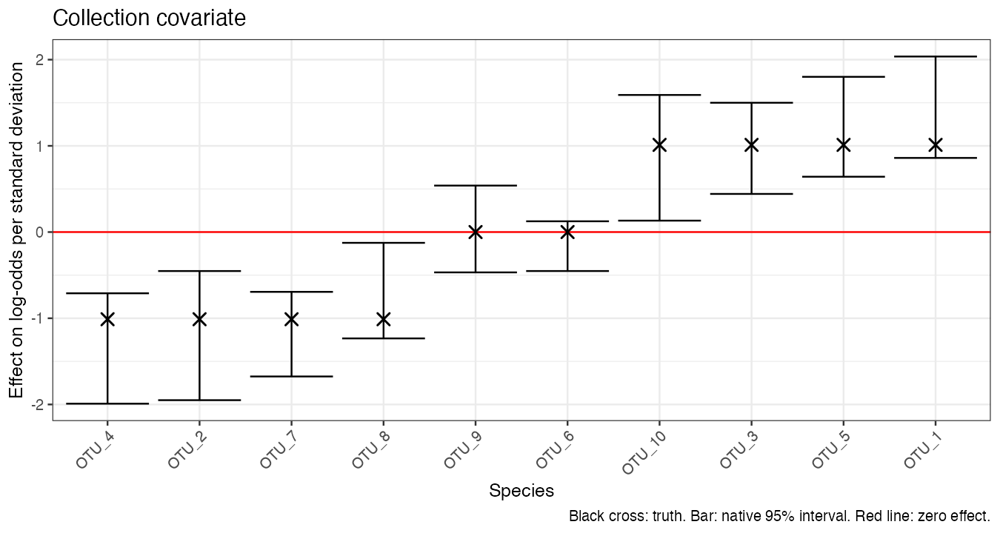

The plot shows the slope only. The intercept is in the array that `returnCollectionCovariates()` returns, used below: `collection_draws[, "(Intercept)", ]` holds its draws for every species, and it is the first row of `collection_means`.

`returnCollectionCovariates()` returns a **posterior-draw-by-collection-covariate-by-species array**, pooling the draws of all chains. Here its dimensions are 24,000 by two by ten: the covariates are `(Intercept)` and `X_theta`. These are coefficients on the **log-odds scale**, not collection probabilities. The intercept describes collection at the mean covariate value; the slope describes the change in log-odds for a one-standard-deviation increase in the collection covariate.

Use these draws to assess the direction, size and uncertainty of collection effects for each species. For example, a positive slope means collection becomes more likely as the covariate increases, conditional on the species being present at the site.

``` r
collection_draws <- occJSDM::returnCollectionCovariates(fitmodel)

# Retain dimensions 2 and 3: covariate rows and species columns.
collection_means <- apply(collection_draws, c(2, 3), mean)
collection_means

# Inspect uncertainty for one named slope and species.
quantile(collection_draws[, "X_theta", "OTU_1"], probs = c(0.025, 0.975))
```

Replace `X_theta` and `OTU_1` with names from your own fit. An interval spanning zero means the direction remains uncertain under this interval criterion. These pooled draws support posterior summaries; use the separate chain arrays, as the [diagnostics section](#check-computation-as-well-as-ecological-recovery) at the start of this lesson does, for convergence checks.

Two related helpers answer different questions about collection. `plotCollectionRates()` shows each species’ collection probability with the covariates fixed at their mean, one value per species.

`computeAverageCollectionProbs()` instead uses each field sample’s actual covariate values. It returns a sample-by-species matrix of posterior mean collection probabilities, the quantity to use when asking which samples were poorly collected.

Baseline collection is conditional on presence and sets the standardized collection predictor to zero, meaning its observed raw-scale mean. Its truth is `plogis(raw_intercept + raw_slope * predictor_mean)`, not `plogis(raw_intercept)`.

``` r
native_collection_rates <- plotCollectionRates(fitmodel) +
  native_theme +
  geom_point(
    data = native_truth$collection_rates, aes(x = species, y = truth),
    inherit.aes = FALSE, shape = 4, size = 3, stroke = 1
  ) +
  labs(
    title = "Baseline collection: collection predictor at its mean",
    y = "Collection probability, given presence",
    caption = "Black cross: truth. Bar: native 95% interval."
  )

native_collection_rates
```

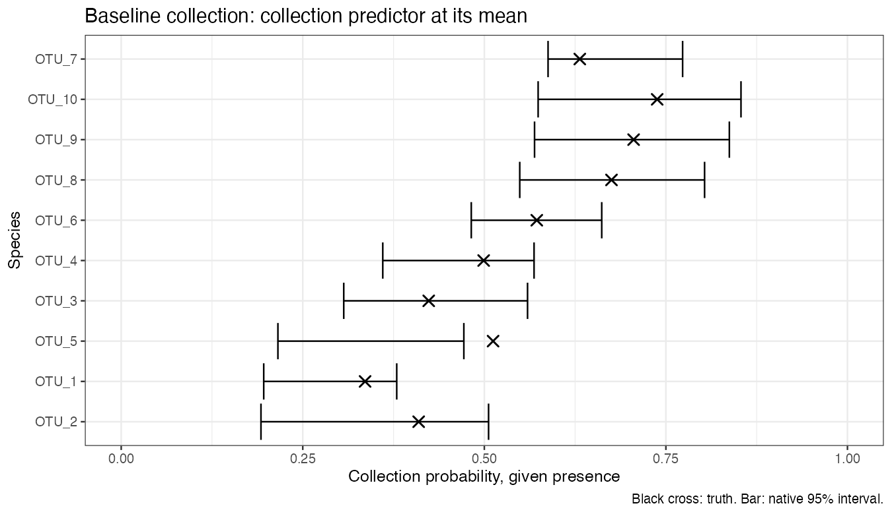

### Laboratory true-positive and false-positive rates by primer

[Lesson 2](occJSDM-lesson-2.md) compares true and estimated PCR detection, laboratory false-positive and field-contamination probabilities, and shows why their values alone cannot classify every positive detection correctly. The plots below check the laboratory rates against their generating values.

Blue intervals describe positive PCR observations given collection; red intervals describe positive PCR observations without collection. Each black cross is the corresponding true probability.

With the fitted threshold of one read, truth equals the generating event probability multiplied by the probability that its rounded read count reaches the threshold. The adjustment uses the true-read distribution for true positives and the contamination-read distribution for false positives.

``` r
primer_1_truth <- native_truth$laboratory |>
  filter(Primer == "1")

native_primer_1 <- plotFPTPStage2Rates(fitmodel, primerName = "1") +
  native_theme +
  geom_point(
    data = primer_1_truth, aes(x = species, y = truth),
    inherit.aes = FALSE, shape = 4, size = 3, stroke = 1
  ) +
  labs(caption = "Black crosses: true rates. Coloured bars: native 95% intervals.")

native_primer_1
```

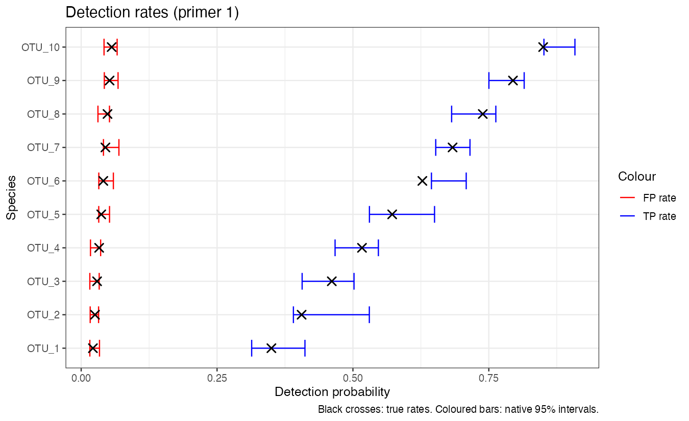

``` r
primer_2_truth <- native_truth$laboratory |>
  filter(Primer == "2")

native_primer_2 <- plotFPTPStage2Rates(fitmodel, primerName = "2") +
  native_theme +
  geom_point(
    data = primer_2_truth, aes(x = species, y = truth),
    inherit.aes = FALSE, shape = 4, size = 3, stroke = 1
  ) +
  labs(caption = "Black crosses: true rates. Coloured bars: native 95% intervals.")

native_primer_2
```

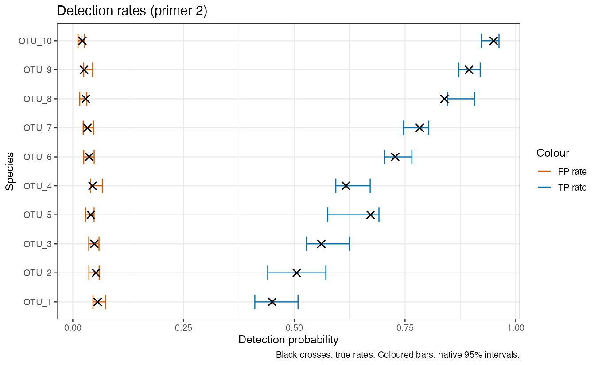

### Separate false-positive and detection-rate plots

The first plot shows field contamination: the probability of a collected presence when the species is absent from the site. Black crosses mark the generating `theta0`; bars are the package’s 95% posterior intervals. This is a latent collection event, so its truth does not need a read-threshold adjustment.

``` r
remaining_stage1_fp <- plotStage1FPRates(fitmodel, idx_species = 1:10) +
  remaining_theme +
  geom_point(
    data = remaining_truth$stage1_fp, aes(x = Species, y = truth),
    inherit.aes = FALSE, shape = 4, size = 3, stroke = 1
  ) +
  ylim(0, 1) +
  labs(
    title = "Field false positives",
    y = "Collection probability, given site absence",
    caption = "Black cross: truth. Bar: native 95% interval."
  )

remaining_stage1_fp
```

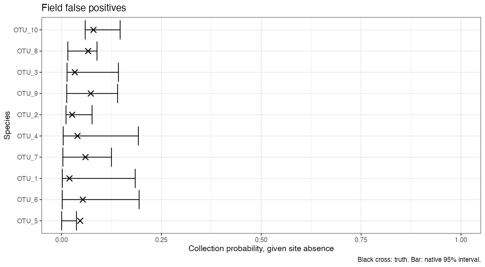

The two laboratory helpers display each primer separately; they do not pool primers and have no `primerName` argument. Each truth cross is displaced with its matching primer bar. Use `plotFPTPStage2Rates(fitmodel, primerName = "1")` from the preceding examples when you want to select one primer instead.

Laboratory false positives condition on no collection. True-positive detection conditions on collection. In both cases the truth includes the read-threshold adjustment explained under [laboratory rates by primer](#laboratory-true-positive-and-false-positive-rates-by-primer).

``` r
remaining_stage2_fp <- plotStage2FPRates(fitmodel, idx_species = 1:10) +
  remaining_theme +
  geom_point(
    data = remaining_truth$stage2_fp,
    aes(x = Species, y = truth, group = Primer),
    inherit.aes = FALSE, shape = 4, size = 2.5, stroke = 1,
    position = position_dodge(width = 0.15)
  ) +
  ylim(0, 1) +
  labs(
    title = "Laboratory false positives by primer",
    y = "Positive observation probability, given no collection",
    caption = "Black cross: matching primer truth. Coloured bar: native 95% interval."
  )

remaining_stage2_fp
```

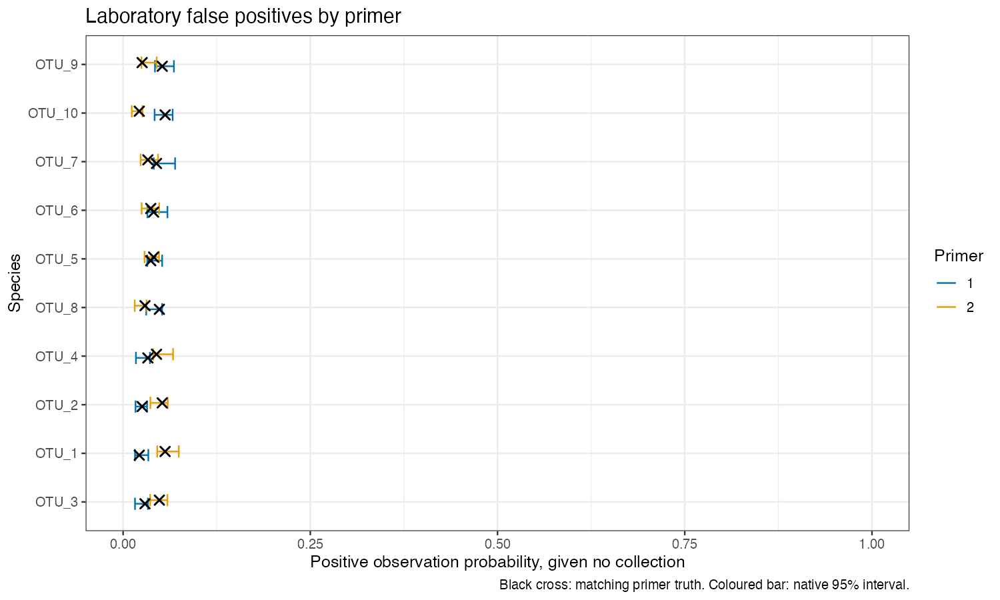

``` r
remaining_detection <- plotDetectionRates(fitmodel, idx_species = 1:10) +
  remaining_theme +
  geom_point(
    data = remaining_truth$detection,
    aes(x = Species, y = truth, group = Primer),
    inherit.aes = FALSE, shape = 4, size = 2.5, stroke = 1,
    position = position_dodge(width = 0.6)
  ) +
  ylim(0, 1) +
  labs(
    title = "Laboratory true-positive detection by primer",
    y = "Positive observation probability, given collection",
    caption = "Black cross: matching primer truth. Coloured bar: native 95% interval."
  )

remaining_detection
```

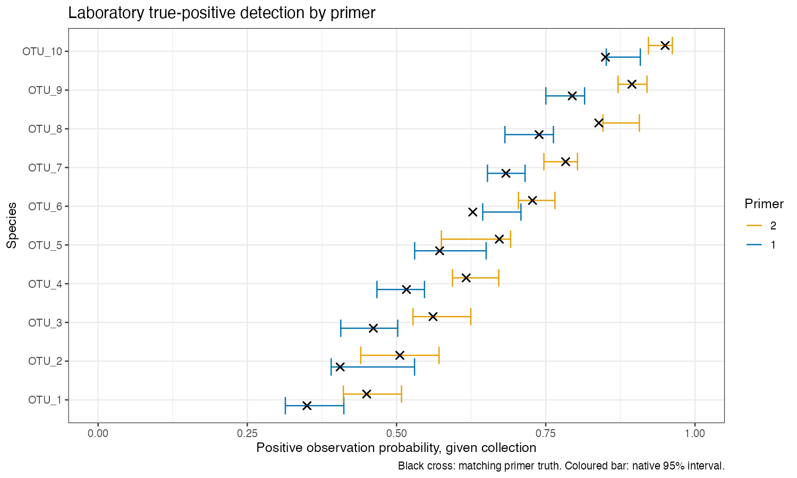

Species order is chosen separately by each of the package’s helpers. A truth cross outside its bar identifies an interval that misses the generating rate in this dataset. These rate intervals summarize parameter uncertainty, unlike the random survey-count ranges in the cumulative-detection examples.

Every plotting function that draws a figure returns a `ggplot2` object, with two exceptions. `plotCovariateEffect()` returns a named list with one plot per covariate, so combine its elements, taken by name as in [the curves in original units](#the-same-curves-in-original-units), rather than the list. `plotLatentPresences()` returns a table. The `ggplot2` plots can therefore be placed side by side with the `patchwork` package. Its `+` operator lays two plots next to each other, and `/` stacks them. Pairing each stage’s false-positive plot with its success plot puts what should ideally be low beside what should ideally be high.

``` r
library(patchwork)

field_rates <- (plotStage1FPRates(fitmodel, idx_species = 1:10) + ylim(0, 1)) +
  plotCollectionRates(fitmodel, idx_species = 1:10)

laboratory_rates <- (plotStage2FPRates(fitmodel, idx_species = 1:10) + ylim(0, 1)) +
  plotDetectionRates(fitmodel, idx_species = 1:10)

field_rates / laboratory_rates
```

The parentheses matter: the first `+` inside them adds a `ggplot2` layer to one plot, whereas the `+` between the parenthesised plot and the next plot is `patchwork`’s side-by-side operator.

### Would more field samples or PCR replicates help detection?

Consider a deliberately restricted question: **if all ten species occupy a site, how many do we expect to detect truly at least once?** Hold collection conditions at their mean, use both primers, and count only detections arising from collected DNA. False-positive detections are excluded from this calculation. This is neither landscape richness nor the number of species an analysis will correctly infer to be present.

For one species, let `theta` be collection probability and `p1`, `p2` the two primer detection probabilities. With `K` PCRs per primer, the probability of missing collected DNA in every PCR is `(1 - p1)^K * (1 - p2)^K`. Combine this with collection failure, then with `M` independent field samples:

``` r
missed_in_pcr <- (1 - p1)^K * (1 - p2)^K

detected_in_one_sample <- theta * (1 - missed_in_pcr)

detected_in_any_sample <- 1 - (1 - detected_in_one_sample)^M

expected_species_detected <- sum(detected_in_any_sample)
```

The package’s `plotCumulativeSpeciesDetections()` below simulates whole surveys rather than computing this expectation. Its intervals therefore include the random outcome of a single survey, and the orange truth is the exact distribution of that outcome under the generating values.

The function pools both primers and varies field samples (`M`) and PCRs per primer per sample (`K`). Field replication of four is prospective; the fitted data contained three field samples per site. PCR replication stays within the six-PCR design.

The package’s bars include both fitted-parameter uncertainty and random collection and PCR outcomes. The routine selects 500 posterior draws to simulate surveys, so endpoints can vary with the seed. Orange bars are the exact 2.5% and 97.5% quantiles of the matching survey-count distribution under the generating parameters. Orange crosses mark its median. These truth intervals remain wide even when parameters are known. When planning a survey, compare designs with the expected count from the formula above, and use the survey-outcome interval to see how much one survey can vary around it.

Each species’ true detection probability is `1 - (1 - theta * (1 - prod((1 - p)^K)))^M`. Here `theta` is baseline collection conditional on presence and the primer-specific `p` values include the read-threshold adjustment explained under [laboratory rates by primer](#laboratory-true-positive-and-false-positive-rates-by-primer). Combining ten independent detection indicators gives the exact count distribution from zero to ten. Its quantiles are stored in the teaching bundle.

``` r
set.seed(20260922)

native_effort_k <- plotCumulativeSpeciesDetections(
  fitmodel, M = 4, K = 6, primer = 0, byK = TRUE
) +
  native_theme +
  geom_linerange(
    data = native_truth$survey_counts,
    aes(x = K + 0.12, ymin = lower, ymax = upper),
    inherit.aes = FALSE, colour = "#C45B00", linewidth = 1.2
  ) +
  geom_point(
    data = native_truth$survey_counts, aes(x = K + 0.12, y = median),
    inherit.aes = FALSE, colour = "#C45B00", shape = 4, size = 2.5
  ) +
  labs(
    title = "More PCRs per primer and field sample",
    caption = "Black: native 95% survey interval. Orange: true 95% range and median.\nTruth is offset slightly to the right to keep both intervals visible."
  )

native_effort_k
```

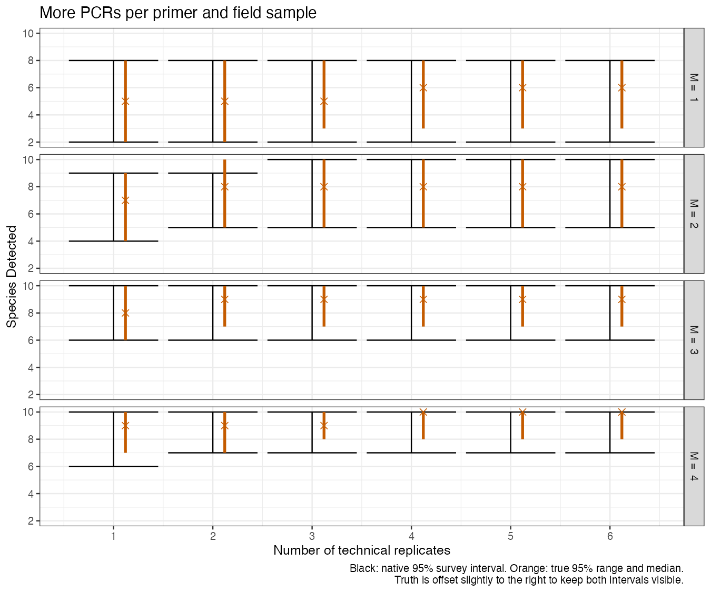

Changing `byK` puts field replication on the horizontal axis. Resetting the same seed gives the same package intervals rearranged, not a second fit or a different survey target.

``` r
set.seed(20260922)

native_effort_m <- plotCumulativeSpeciesDetections(
  fitmodel, M = 4, K = 6, primer = 0, byK = FALSE
) +
  native_theme +
  geom_linerange(
    data = native_truth$survey_counts,
    aes(x = M + 0.12, ymin = lower, ymax = upper),
    inherit.aes = FALSE, colour = "#C45B00", linewidth = 1.2
  ) +
  geom_point(
    data = native_truth$survey_counts, aes(x = M + 0.12, y = median),
    inherit.aes = FALSE, colour = "#C45B00", shape = 4, size = 2.5
  ) +
  labs(
    title = "More field samples per site",
    caption = "Black: native 95% survey interval. Orange: true 95% range and median.\nTruth is offset slightly to the right to keep both intervals visible."
  )

native_effort_m
```

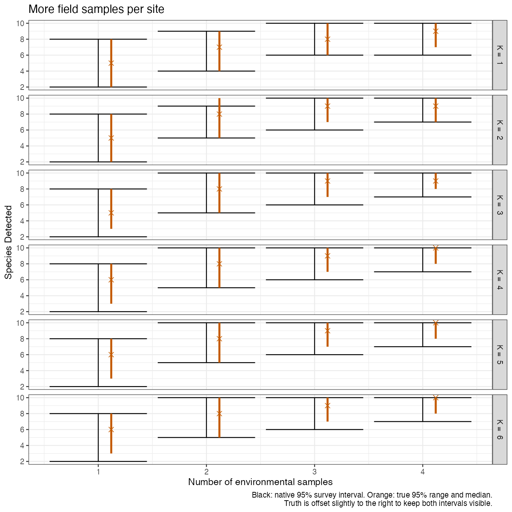

Repeated PCRs cannot recover DNA that never entered the field sample. That is why the one-sample panel levels off even when PCR replication increases. Another independent field sample gives another opportunity to collect the species’ DNA. These plots hold the fitted parameter distribution fixed; they do not measure how collecting more data would improve a refitted model.

The take-home: if all ten species occupy a site, the true expected number detected is 5.5 with one field sample and six PCRs per primer. With two field samples and one PCR per primer, it is 7.1. In this community, a second field sample buys more than more PCRs.

## Distinguish fitted probabilities, occupancy states and new-site predictions

`computePredictiveOccupancyProbs()` gives the fitted habitat-based probability of occupancy at each surveyed site, from the measured environment and the fitted hidden site factors. It is the quantity [Ji et al. (2025)](#references-and-further-reading) reported. Despite its name, it is not a prediction from the measured covariates alone: the fitted site factors were learned using the observations.

`computeConditionalOccupancyProbs()` summarizes the model’s belief that the species actually occupied the surveyed site, accounting for the observation process. It returns a **site-by-species matrix** of posterior probabilities, with site identifiers as row names and species names as column names. Here that is 100 rows by ten columns. Each entry is the posterior mean of the latent occupancy state (1 if present, 0 if absent). An entry of 0.8 therefore means an 80% posterior probability that the species was present at that site, given the survey observations and the fitted model.

``` r
conditional_occupancy <- occJSDM::computeConditionalOccupancyProbs(fitmodel)

# Inspect the first five sites and three species, keeping their labels.
conditional_occupancy[1:5, 1:3, drop = FALSE]

# A named vector for one species, ready to join to a table of site coordinates.
conditional_occupancy[, "OTU_1"]

# The fitted habitat-based probabilities, with the same site-by-species shape.
predictive_occupancy <- occJSDM::computePredictiveOccupancyProbs(fitmodel)
```

Use this matrix to map inferred presence at surveyed sites or examine sites with uncertain occupancy; match its row names to site identifiers when joining other data. It contains posterior probabilities rather than individual draws or credible limits. Its appropriate simulation check is the realized state, present or absent, not the generating probability. These are estimates at surveyed sites; use `predictNewSites()` for unsurveyed sites.

Its sample-level counterpart, `computeConditionalSamplePresenceProbs()`, returns a sample-by-species matrix of posterior probabilities that the species’ DNA was in each field sample. The latent presence table below shows the same quantity in its `CondSampleProb` column, beside the PCR results that produced it. [Lesson 2](occJSDM-lesson-2.md) puts these quantities alongside the actual simulated detection cases, with maps in Lesson 0.

Which one should a study report? [Ji et al. (2025)](#references-and-further-reading) reported the predictive probabilities. Their reason was that the probabilities are estimated from the environmental relationships learned across all sites, so they are less sensitive to the handful of detections at any one site. The conditional probability moves with that site’s own PCR results, so a single contaminated or failed sample can shift it substantially.

The two are most useful together. A site where the conditional probability is high but the predictive probability is low is one where weak positive evidence overrode unfavourable covariates. The reverse pattern marks a site whose habitat suits the species but where few detections made the model doubt it was occupied. It has a high predictive probability and a low conditional one. Their Supplementary Information 12 works through such cases; Lesson 2’s worked detections do the same on this simulation.

`returnLatentPresences()` and `plotLatentPresences()` collect those fitted quantities by site, sample and primer. The next section demonstrates them on this lesson’s own simulation, so the observations, estimates and truth all refer to the same records.

Prediction at unsurveyed sites, and comparing models by what they predict there, are the subject of [Lesson 4](occJSDM-lesson-4.md).

## Put the observations, inferred states and truth in one table

The package’s latent-presence table answers a practical question: **what did we observe, and what does the fitted model think happened at this site and in this sample?** A row is one PCR observation for one species. The same inferred site probability therefore repeats across that site’s samples and PCRs. Repeated entries are not additional independent estimates.

For your own full fit, these two calls extract the table and display it. Match the species name to the fitted names instead of assuming that a particular column is always the species you want.

``` r
species_index <- match("OTU_1", fitmodel$infos$speciesNames)
stopifnot(!is.na(species_index))

latent_presences <- occJSDM::returnLatentPresences(
  fitmodel,
  idx_species = species_index
)

occJSDM::plotLatentPresences(
  latent_presences,
  species_name = "OTU_1"
)
```

To keep knitting quick, the next chunk reads the exact tables exported from the saved default-prior fit. We focus on OTU_1 at sites 1 and 6: the laboratory false-positive and weak true-detection cases selected in Lesson 2, which `example_cases` takes from `lesson$cases`.

All three field samples and both primers are retained at each site. The six PCRs within each sample and primer combination are numbered in their original observation order.

``` r
native_tables <- readRDS("teaching-data/latent-presence-lesson.rds")

example_cases <- lesson$cases |>
  filter(case %in% c("Laboratory false positive", "Weak true detection")) |>
  arrange(Site)

lab_example <- filter(example_cases, case == "Laboratory false positive")
weak_example <- filter(example_cases, case == "Weak true detection")

latent_rows <- native_tables$tables |>
  filter(species == "OTU_1", Site %in% example_cases$Site) |>
  arrange(Site, Sample, Primer, PCR)

observed_truth <- lesson$observations |>
  select(
    species, Site, Sample, Primer, PCR,
    TrueSite = z, TrueSample = w, Source = source
  )

state_table <- latent_rows |>
  left_join(
    observed_truth,
    by = c("species", "Site", "Sample", "Primer", "PCR"),
    relationship = "one-to-one"
  )
```

The join uses the species and all observation identifiers. It would be unsafe to attach truth by position after sorting or filtering either table. `relationship = "one-to-one"` also makes duplicate truth records an error instead of silently multiplying rows.

`TrueSite` and `TrueSample` are actual simulated states: 1 means present and 0 means absent. Their matching estimates are `CondOccProb` and `CondSampleProb`, which are probabilities between zero and one. `OTU` is the observed read count. `Source` reveals where a positive came from in the simulation; this information was never supplied to the fit.

``` r
state_columns <- c(
  "Site", "Sample", "Primer", "PCR", "OTU", "Source",
  "TrueSite", "CondOccProb", "TrueSample", "CondSampleProb"
)

occJSDM::plotLatentPresences(
  state_table,
  species_name = "OTU_1",
  title = "Actual states beside the model's probabilities",
  columns = state_columns,
  container_height = 450
) |>
  gt::fmt_number(columns = c(PCR, TrueSite, TrueSample), decimals = 0) |>
  gt::fmt_percent(columns = c(CondOccProb, CondSampleProb), decimals = 1)
```

| Site | Sample | Primer | PCR | OTU | Source | TrueSite | CondOccProb | TrueSample | CondSampleProb |
|---:|---:|---:|---:|---:|:---|---:|---:|---:|---:|
| 1 | 1 | 1 | 1 | 0 | No detection | 1 | 0.987 | 0 | 0.017 |
| 1 | 1 | 1 | 2 | 0 | No detection | 1 | 0.987 | 0 | 0.017 |
| 1 | 1 | 1 | 3 | 0 | No detection | 1 | 0.987 | 0 | 0.017 |
| 1 | 1 | 1 | 4 | 0 | No detection | 1 | 0.987 | 0 | 0.017 |
| 1 | 1 | 1 | 5 | 0 | No detection | 1 | 0.987 | 0 | 0.017 |
| 1 | 1 | 1 | 6 | 0 | No detection | 1 | 0.987 | 0 | 0.017 |
| 1 | 1 | 2 | 1 | 0 | No detection | 1 | 0.987 | 0 | 0.017 |
| 1 | 1 | 2 | 2 | 1 | Laboratory false positive | 1 | 0.987 | 0 | 0.017 |
| 1 | 1 | 2 | 3 | 0 | No detection | 1 | 0.987 | 0 | 0.017 |
| 1 | 1 | 2 | 4 | 0 | No detection | 1 | 0.987 | 0 | 0.017 |
| 1 | 1 | 2 | 5 | 0 | No detection | 1 | 0.987 | 0 | 0.017 |
| 1 | 1 | 2 | 6 | 0 | No detection | 1 | 0.987 | 0 | 0.017 |
| 1 | 2 | 1 | 1 | 0 | No detection | 1 | 0.987 | 1 | 0.986 |
| 1 | 2 | 1 | 2 | 0 | No detection | 1 | 0.987 | 1 | 0.986 |
| 1 | 2 | 1 | 3 | 0 | No detection | 1 | 0.987 | 1 | 0.986 |
| 1 | 2 | 1 | 4 | 0 | No detection | 1 | 0.987 | 1 | 0.986 |
| 1 | 2 | 1 | 5 | 115 | True detection | 1 | 0.987 | 1 | 0.986 |
| 1 | 2 | 1 | 6 | 0 | No detection | 1 | 0.987 | 1 | 0.986 |
| 1 | 2 | 2 | 1 | 517 | True detection | 1 | 0.987 | 1 | 0.986 |
| 1 | 2 | 2 | 2 | 52 | True detection | 1 | 0.987 | 1 | 0.986 |
| 1 | 2 | 2 | 3 | 0 | No detection | 1 | 0.987 | 1 | 0.986 |
| 1 | 2 | 2 | 4 | 0 | No detection | 1 | 0.987 | 1 | 0.986 |
| 1 | 2 | 2 | 5 | 0 | No detection | 1 | 0.987 | 1 | 0.986 |
| 1 | 2 | 2 | 6 | 89 | True detection | 1 | 0.987 | 1 | 0.986 |
| 1 | 3 | 1 | 1 | 0 | No detection | 1 | 0.987 | 1 | 0.980 |
| 1 | 3 | 1 | 2 | 0 | No detection | 1 | 0.987 | 1 | 0.980 |
| 1 | 3 | 1 | 3 | 0 | No detection | 1 | 0.987 | 1 | 0.980 |
| 1 | 3 | 1 | 4 | 37 | True detection | 1 | 0.987 | 1 | 0.980 |
| 1 | 3 | 1 | 5 | 81 | True detection | 1 | 0.987 | 1 | 0.980 |
| 1 | 3 | 1 | 6 | 0 | No detection | 1 | 0.987 | 1 | 0.980 |
| 1 | 3 | 2 | 1 | 0 | No detection | 1 | 0.987 | 1 | 0.980 |
| 1 | 3 | 2 | 2 | 0 | No detection | 1 | 0.987 | 1 | 0.980 |
| 1 | 3 | 2 | 3 | 0 | No detection | 1 | 0.987 | 1 | 0.980 |
| 1 | 3 | 2 | 4 | 90 | True detection | 1 | 0.987 | 1 | 0.980 |
| 1 | 3 | 2 | 5 | 0 | No detection | 1 | 0.987 | 1 | 0.980 |
| 1 | 3 | 2 | 6 | 0 | No detection | 1 | 0.987 | 1 | 0.980 |
| 6 | 16 | 1 | 1 | 0 | No detection | 1 | 0.549 | 0 | 0.008 |
| 6 | 16 | 1 | 2 | 0 | No detection | 1 | 0.549 | 0 | 0.008 |
| 6 | 16 | 1 | 3 | 0 | No detection | 1 | 0.549 | 0 | 0.008 |
| 6 | 16 | 1 | 4 | 0 | No detection | 1 | 0.549 | 0 | 0.008 |
| 6 | 16 | 1 | 5 | 0 | No detection | 1 | 0.549 | 0 | 0.008 |
| 6 | 16 | 1 | 6 | 0 | No detection | 1 | 0.549 | 0 | 0.008 |
| 6 | 16 | 2 | 1 | 0 | No detection | 1 | 0.549 | 0 | 0.008 |
| 6 | 16 | 2 | 2 | 0 | No detection | 1 | 0.549 | 0 | 0.008 |
| 6 | 16 | 2 | 3 | 0 | No detection | 1 | 0.549 | 0 | 0.008 |
| 6 | 16 | 2 | 4 | 0 | No detection | 1 | 0.549 | 0 | 0.008 |
| 6 | 16 | 2 | 5 | 0 | No detection | 1 | 0.549 | 0 | 0.008 |
| 6 | 16 | 2 | 6 | 0 | No detection | 1 | 0.549 | 0 | 0.008 |
| 6 | 17 | 1 | 1 | 0 | No detection | 1 | 0.549 | 0 | 0.000 |
| 6 | 17 | 1 | 2 | 0 | No detection | 1 | 0.549 | 0 | 0.000 |
| 6 | 17 | 1 | 3 | 0 | No detection | 1 | 0.549 | 0 | 0.000 |
| 6 | 17 | 1 | 4 | 0 | No detection | 1 | 0.549 | 0 | 0.000 |
| 6 | 17 | 1 | 5 | 0 | No detection | 1 | 0.549 | 0 | 0.000 |
| 6 | 17 | 1 | 6 | 0 | No detection | 1 | 0.549 | 0 | 0.000 |
| 6 | 17 | 2 | 1 | 0 | No detection | 1 | 0.549 | 0 | 0.000 |
| 6 | 17 | 2 | 2 | 0 | No detection | 1 | 0.549 | 0 | 0.000 |
| 6 | 17 | 2 | 3 | 0 | No detection | 1 | 0.549 | 0 | 0.000 |
| 6 | 17 | 2 | 4 | 0 | No detection | 1 | 0.549 | 0 | 0.000 |
| 6 | 17 | 2 | 5 | 0 | No detection | 1 | 0.549 | 0 | 0.000 |
| 6 | 17 | 2 | 6 | 0 | No detection | 1 | 0.549 | 0 | 0.000 |
| 6 | 18 | 1 | 1 | 0 | No detection | 1 | 0.549 | 1 | 0.177 |
| 6 | 18 | 1 | 2 | 0 | No detection | 1 | 0.549 | 1 | 0.177 |
| 6 | 18 | 1 | 3 | 0 | No detection | 1 | 0.549 | 1 | 0.177 |
| 6 | 18 | 1 | 4 | 0 | No detection | 1 | 0.549 | 1 | 0.177 |
| 6 | 18 | 1 | 5 | 0 | No detection | 1 | 0.549 | 1 | 0.177 |
| 6 | 18 | 1 | 6 | 0 | No detection | 1 | 0.549 | 1 | 0.177 |
| 6 | 18 | 2 | 1 | 0 | No detection | 1 | 0.549 | 1 | 0.177 |
| 6 | 18 | 2 | 2 | 105 | True detection | 1 | 0.549 | 1 | 0.177 |
| 6 | 18 | 2 | 3 | 596 | True detection | 1 | 0.549 | 1 | 0.177 |
| 6 | 18 | 2 | 4 | 0 | No detection | 1 | 0.549 | 1 | 0.177 |
| 6 | 18 | 2 | 5 | 0 | No detection | 1 | 0.549 | 1 | 0.177 |
| 6 | 18 | 2 | 6 | 0 | No detection | 1 | 0.549 | 1 | 0.177 |

`plotLatentPresences()` returns a gt table, which displays in HTML; the Markdown version of this page shows the same records as a plain table with decimals. In HTML, colours group the sites and shades group samples and primers; they do not indicate confidence or whether the model is correct.

At site 1, sample 1 has no OTU_1 DNA (`TrueSample = 0`), despite a positive PCR. OTU_1 nevertheless occupies the site (`TrueSite = 1`). This is a **laboratory false positive about the sample**, not evidence that the species must be absent from the entire site.

At site 6, sample 18 genuinely contains DNA but gives only 2 positives across its 12 PCR observations, and samples 16 and 17 contain none. Sample identifiers run across the whole survey, so site 6’s samples are 16 to 18, not 1 to 3. Read all three samples together before judging the site’s inferred state.

### Keep generating probabilities separate from actual states

The table’s other three probabilities answer different questions. `PredOccProb` estimates the generating occupancy probability at a fitted site, including its learned hidden site contribution. `CollectionProb` estimates collection success **if the species is present at the site**. `DetectionProb` estimates a threshold-positive PCR **if its DNA is in the sample**. Neither collection nor detection probability is an unconditional prediction that an arbitrary PCR will be positive.

For these columns, compare probabilities with probabilities. The chunk below attaches three true values:

- each site’s occupancy probability;
- each sample’s collection probability, from its raw collection covariate and the simulator’s collection intercept and slope;
- each primer’s detection probability, which includes the read-threshold adjustment explained under [laboratory rates by primer](#laboratory-true-positive-and-false-positive-rates-by-primer).

``` r
site_truth <- lesson$cells |>
  filter(arm == "default", species == "OTU_1") |>
  transmute(Site = as.numeric(Site), TrueOccupancy = truth)

truth_species_index <- match(
  "OTU_1",
  colnames(lesson$input$sim$data_list$OTU)
)

collection_coefficients <- lesson$input$sim$true_params$beta_theta_true[
  , truth_species_index
]

sample_truth <- lesson$input$sim$data_list$info |>
  distinct(Site, Sample, X_theta) |>
  mutate(
    TrueCollection = plogis(
      collection_coefficients[1] + collection_coefficients[2] * X_theta
    )
  ) |>
  select(Site, Sample, TrueCollection)

primer_truth <- lesson$rates |>
  filter(arm == "default", species == "OTU_1", param == "p") |>
  transmute(Primer = as.numeric(Primer), TrueDetection = truth)

probability_table <- latent_rows |>
  distinct(Site, Sample, Primer, PredOccProb, CollectionProb, DetectionProb) |>
  left_join(site_truth, by = "Site", relationship = "many-to-one") |>
  left_join(sample_truth, by = c("Site", "Sample"), relationship = "many-to-one") |>
  left_join(primer_truth, by = "Primer", relationship = "many-to-one")
```

``` r
probability_columns <- c(
  "Site", "Sample", "Primer", "TrueOccupancy", "PredOccProb",
  "TrueCollection", "CollectionProb", "TrueDetection", "DetectionProb"
)

occJSDM::plotLatentPresences(
  probability_table,
  species_name = "OTU_1",
  title = "Generating probabilities beside their estimates",
  columns = probability_columns,
  container_height = 350
) |>
  gt::fmt_percent(columns = all_of(probability_columns[-c(1, 2, 3)]), decimals = 1)
```

| Site | Sample | Primer | TrueOccupancy | PredOccProb | TrueCollection | CollectionProb | TrueDetection | DetectionProb |
|---:|---:|---:|---:|---:|---:|---:|---:|---:|
| 1 | 1 | 1 | 0.802 | 0.811 | 0.361 | 0.313 | 0.35 | 0.361 |
| 1 | 1 | 2 | 0.802 | 0.811 | 0.361 | 0.313 | 0.45 | 0.459 |
| 1 | 2 | 1 | 0.802 | 0.811 | 0.387 | 0.346 | 0.35 | 0.361 |
| 1 | 2 | 2 | 0.802 | 0.811 | 0.387 | 0.346 | 0.45 | 0.459 |
| 1 | 3 | 1 | 0.802 | 0.811 | 0.737 | 0.782 | 0.35 | 0.361 |
| 1 | 3 | 2 | 0.802 | 0.811 | 0.737 | 0.782 | 0.45 | 0.459 |
| 6 | 16 | 1 | 0.995 | 0.861 | 0.783 | 0.829 | 0.35 | 0.361 |
| 6 | 16 | 2 | 0.995 | 0.861 | 0.783 | 0.829 | 0.45 | 0.459 |
| 6 | 17 | 1 | 0.995 | 0.861 | 0.099 | 0.054 | 0.35 | 0.361 |
| 6 | 17 | 2 | 0.995 | 0.861 | 0.099 | 0.054 | 0.45 | 0.459 |
| 6 | 18 | 1 | 0.995 | 0.861 | 0.461 | 0.440 | 0.35 | 0.361 |
| 6 | 18 | 2 | 0.995 | 0.861 | 0.461 | 0.440 | 0.45 | 0.459 |

There are twelve rows because these probabilities do not vary among repeated PCRs with the same site, sample and primer. Collection can vary between samples because `X_theta` varies. Detection varies by primer in this model. Inspecting the actual states in the first table and the generating probabilities in the second avoids treating a single success or failure as a probability estimate.

## Find the function for your question

Each question names the functions that answer it and where these lessons check the answer against truth.

- **How do I prepare and fit data?** `simulateOccJSDMData()`, `runOccJSDM()`. Truth check: Lessons 0 and 2.
- **How does each species respond to the environment?** `returnOccupancyCovariates()`, `plotOccupancyCovariates()`, `returnOccupancyGradient()`, `plotOccupancyGradient()`, `plotCovariateEffect()`. Truth check: the coefficient plots above, for both fits, and the response curves above, in standardized and original units, for the PCR fit.
- **What is baseline occupancy?** `returnOccupancyRates()`, `plotOccupancyRates()`. Truth check: the baseline table and package plot above.
- **Do traits explain species responses?** `returnTraitsCoeff()`, `plotTraitsCoefficients()`. Truth check: the package trait plots and the two-fit comparison above, with standardized truth; the cancellation diagnostic in the appendix.
- **Which species share unmeasured site responses?** `returnResidualCorrelationMatrix()`, `plotResidualCorrelationMatrix()`. Truth check: the package heat map with true correlations above.
- **What do ordination axes represent?** `returnOrdinationScores()`, `returnFactorLoadings()`, `plotOrdinationScores()`, `plotFactorLoadings()`, `plotBiplot()`. Truth check: the combined contribution above; truth-aligned scores, loadings and biplot in the appendix.
- **What affects collection?** `returnCollectionCovariates()`, `plotCollectionCovariates()`, `plotCollectionRates()`, `computeAverageCollectionProbs()`. Truth check: the collection plots above; observation process in Lesson 2.
- **What about PCR failures and contamination?** `plotDetectionRates()`, `plotStage1FPRates()`, `plotStage2FPRates()`. Truth check: combined and separate rate plots above; actual cases in Lesson 2.
- **How does sampling effort affect detection?** `plotCumulativeSpeciesDetections()`. Truth check: package survey-outcome intervals with exact true ranges above.
- **What happened at a particular site or sample?** `computeConditionalOccupancyProbs()`, `computeConditionalSamplePresenceProbs()`, `computePredictiveOccupancyProbs()`, `returnLatentPresences()`, `plotLatentPresences()`. Truth check: package tables above, with matching states and probabilities.
- **Can I trust the computation?** `computeDiagnostics()`, `returnConvergenceDiagnostics()`, `plotTraceplot()`, `extractWAIC()`. Truth check: diagnostics at the start of this lesson; these have no single simulated true value.
- **How well does it predict unsurveyed sites?** `predictNewSites()`. Truth check: 300 independent non-spatial sites in [Lesson 4](occJSDM-lesson-4.md), with clearly distinguished probability targets.
- **What about spatial prediction?** Spatial model outputs. [The spatial lesson](occJSDM-lesson-7.md) works through a site-arrangement sweep; this lesson does not validate spatial outputs.

## Where to go next

[Lesson 4](occJSDM-lesson-4.md) predicts occupancy at 300 new sites and compares two models by what actually occurred there.

The appendix below holds the evidence that needs the simulation’s truth or the full fits:

- the trait cancellation;
- the truth-aligned ordination plots;
- the mirror-labelling study;
- how to read trace draws from the fit object;
- the corrected response-curve helper;
- the commands that reproduce the teaching figures.

## References and further reading

Ji, Y., Diana, A., Li, X., Matechou, E., Griffin, J. E., Liu, S., Luo, M., Wu, C., Bai, R., Yao, C., Yin, T., Dong, F., Wu, F., Wang, K., Yu, Z., Chen, X., Jiang, X., Che, J., Yu, D. W., & Popescu, V. D. (2025). **High Quality, Granular, Timely, Trustworthy and Efficient Vertebrate Species Distribution Data Across a 30,000 km<sup>2</sup> Protected Area Complex**. *Ecology Letters*, *28*(12), e70302. <https://doi.org/10.1111/ele.70302>

## Appendix: evidence and reproduction

This appendix is for readers who want the evidence behind the lesson or need to reproduce it; the lesson’s conclusions do not depend on reading it.

### A real cancellation inside this simulated community

The model allows a species’ environmental response to combine three contributions: its measured traits, unmeasured species traits, and remaining species differences. An unmeasured species trait is a species characteristic the survey did not measure that also shapes environmental responses; `n_lattrait` in `listParams` sets how many the model allows. These are distinct from the **site** factors used to describe unmeasured conditions at sites.

In these ten species, Trait_1 happens to correlate with the unmeasured species trait (0.52). The generator drew these traits independently; a small realized sample can still contain a substantial correlation. For environmental gradient 1, the resulting contributions oppose one another.

The following is an **oracle diagnostic**, possible only because we have the simulation truth. Regress the known species environmental coefficients on both measured traits, then repeat the regression for each generating contribution.

Because these regressions use the same predictors, the contributions add to the observed relationship among these ten species. A least-squares regression is linear in its response, so regressing each component on the same traits gives slopes that sum to the slope of the total. `known_truth$jsdmParams_true$B` holds the true environmental coefficients, one row per covariate and one column per species, so `B[1, ]` is every species’ response to gradient 1.

``` r
species_comparison <- lesson$input$sim$data_list$traits |>
  as_tibble() |>
  mutate(across(everything(), ~ as.numeric(scale(.x)))) |>
  mutate(true_response = known_truth$jsdmParams_true$B[1, ])

oracle_regression <- lm(
  true_response ~ Trait_1 + Trait_2,
  data = species_comparison
)

enframe(coef(oracle_regression), name = "term", value = "relationship") |>
  knitr::kable(digits = 3)
```

| term        | relationship |
|:------------|-------------:|
| (Intercept) |       -0.385 |
| Trait_1     |        0.065 |
| Trait_2     |       -0.798 |

The coefficient of Trait_1 here describes the net relationship in the ten generated species, after adjusting for Trait_2. It is not the isolated generating effect of Trait_1. The decomposition below shows the difference.

``` r
cancellation <- outputs$trait_components |>
  filter(trait == "Trait_1", covariate == "X_psi.EnvCov.1") |>
  select(component, value)

cancellation <- bind_rows(
  cancellation,
  tibble(
    component = "Net relationship among these ten species",
    value = sum(cancellation$value)
  )
)

cancellation |>
  mutate(component = factor(component, levels = rev(component))) |>
  ggplot(aes(x = value, y = component)) +
  geom_vline(xintercept = 0, colour = "grey55") +
  geom_col(fill = "#595959", width = 0.6) +
  geom_text(aes(label = sprintf("%+.2f", value)),
            hjust = ifelse(cancellation$value >= 0, -0.15, 1.15)) +
  scale_x_continuous(expand = expansion(mult = 0.18)) +
  labs(
    x = "Contribution to the Trait_1 relationship with environmental response 1",
    y = NULL,
    caption = "All four bars come from known simulation components; none is an estimated occJSDM effect."
  )
```

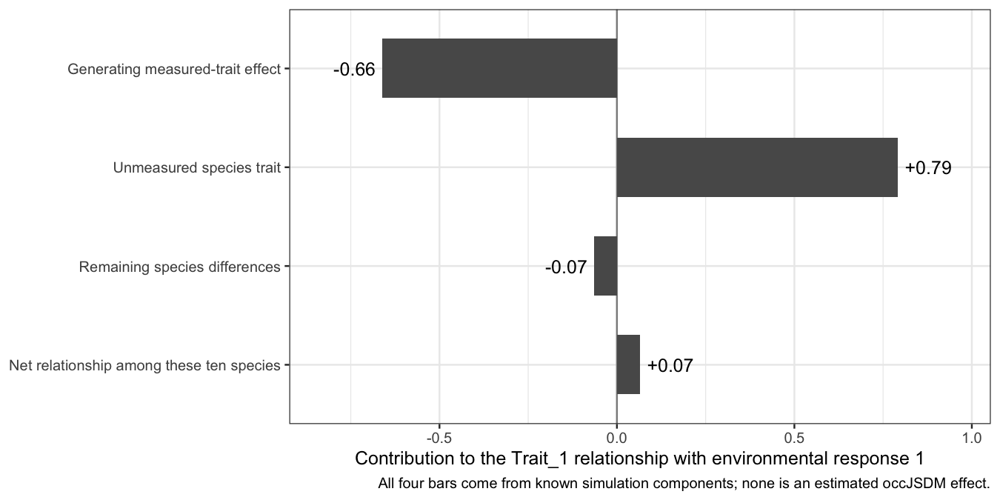<!-- -->

The negative generating effect is about -0.66, but the unmeasured-trait contribution is about 0.79. After adding the remaining differences, the net relationship among the ten species is only 0.07. The model must disentangle these overlapping sources using imperfectly estimated species responses. This explains why simply knowing that we put a nonzero effect into the simulator is not a guarantee that its interval will exclude zero.

This is a diagnosis of **this simulation**, not proof that all weak trait results have this cause. It also does not establish the cause of an older fit whose generating values were not saved. A larger, replicated species-sample experiment would be needed to measure how much additional species information helps.

### Read native ordination plots after aligning their axes

The combined contribution above avoids an ambiguity: a rotation or reflection of both the site scores and species loadings leaves every fitted occurrence probability unchanged. Axis 1 in two fits need not represent the same direction. The package already chooses a loading-based orientation at fitting, but that convention alone does not make an axis a biological quantity.

For this simulation we can use the **known species loadings** to orient every posterior draw. The orthogonal Procrustes calculation below finds the rotation or reflection that brings the fitted loadings closest to the generating loadings, without changing their lengths. We apply that same transformation to the site scores.

This is a simulation-only aid: the true loadings would be unavailable for real observations. It removes orientation differences, not estimation error, and uses no true site scores to choose the rotation.

These plots use the PCR-observation fit, including all 6,000 retained iterations from each of four chains. We make a separate plotting copy. For a rotation matrix `rotation`, the transformed scores and loadings are `scores %*% rotation` and `t(rotation) %*% loadings`; their product is still `scores %*% loadings`. The exporter also verifies this for every draw.

``` r
ordination_examples <- readRDS("teaching-data/ordination-examples.rds")
```

With the full `fitmodel` from Lesson 2, run this simulation comparison preparation once. `known_truth` is the generating parameter list loaded at the start of this lesson.

``` r
true_factors <- known_truth$jsdmParams_true
score_draws <- fitmodel$results_output$jsdm_output$U_output
loading_draws <- fitmodel$results_output$jsdm_output$L_output
aligned_scores <- score_draws
aligned_loadings <- loading_draws

for (chain in seq_len(dim(loading_draws)[4])) {
  for (iteration in seq_len(dim(loading_draws)[3])) {
    current_loadings <- loading_draws[, , iteration, chain]
    decomposition <- svd(current_loadings %*% t(true_factors$L))
    rotation <- decomposition$u %*% t(decomposition$v)

    aligned_scores[, , iteration, chain] <-
      score_draws[, , iteration, chain] %*% rotation
    aligned_loadings[, , iteration, chain] <-
      crossprod(rotation, current_loadings)
  }
}

fit_for_ordination <- fitmodel
fit_for_ordination$results_output$jsdm_output$U_output <- aligned_scores
fit_for_ordination$results_output$jsdm_output$L_output <- aligned_loadings

# Match truth by the identities attached to the original simulation.
site_names <- as.character(fitmodel$infos$siteNames)
species_names <- fitmodel$infos$speciesNames
true_sites <- true_factors$U[
  match(site_names, rownames(known_truth$z_true)), , drop = FALSE
]
true_species <- true_factors$L[
  , match(species_names, colnames(known_truth$z_true)), drop = FALSE
]
site_truth <- tibble(site = site_names, x = true_sites[, 1], y = true_sites[, 2])
loading_truth <- tibble(
  species = species_names, x = true_species[1, ], y = true_species[2, ]
)

# Quantiles are 2.5%, 50% and 97.5%, pooled across all retained draws.
site_quantiles <- occJSDM::returnOrdinationScores(fit_for_ordination)
loading_quantiles <- occJSDM::returnFactorLoadings(fit_for_ordination)

# Choose sites by their original order, before inspecting their estimates.
shown_sites <- site_names[seq(1, length(site_names), by = 10)]
score_comparison <- site_truth |>
  mutate(
    estimate = site_quantiles["50%", site, 1],
    lower = site_quantiles["2.5%", site, 1],
    upper = site_quantiles["97.5%", site, 1]
  ) |>
  filter(site %in% shown_sites) |>
  select(site, truth = x, estimate, lower, upper)
```

The package’s return functions provide arrays, with quantile first, then site and factor for scores, or factor and species for loadings. Here is the first aligned coordinate for the ten displayed sites. They are every tenth site in their original order, chosen before any estimate was inspected, so the choice cannot favour well-recovered sites. These are summaries **after truth-assisted orientation**, not estimates of an intrinsically labelled ecological axis.

``` r
ordination_examples$score_comparison |>
  knitr::kable(digits = 2, caption = "First aligned site coordinate: truth and posterior quantiles.")
```

| site | truth | estimate | lower | upper |
|:-----|------:|---------:|------:|------:|
| 1    |  0.12 |     0.02 | -0.66 |  0.71 |
| 11   |  1.53 |    -0.02 | -0.68 |  0.65 |
| 21   |  0.99 |    -0.03 | -0.72 |  0.65 |
| 31   | -0.50 |    -0.04 | -0.72 |  0.63 |
| 41   | -0.88 |    -0.12 | -0.84 |  0.54 |
| 51   | -1.69 |    -0.04 | -0.73 |  0.63 |
| 61   |  0.16 |     0.03 | -0.66 |  0.76 |
| 71   |  1.47 |    -0.06 | -0.77 |  0.62 |
| 81   | -1.05 |     0.01 | -0.67 |  0.69 |
| 91   |  0.66 |     0.05 | -0.59 |  0.74 |

First aligned site coordinate: truth and posterior quantiles.

#### Site scores: what differs among locations?

The package’s plot places each site label at its posterior median. We show the same ten sites in separate panels with common axes to keep the figure readable. A black cross marks the generating score; a dotted connector identifies the corresponding estimate. Sites close together have similar fitted residual scores, after the measured environmental effects have been accounted for. This is a factor-space comparison, not a geographical map.

``` r
native_sites <- occJSDM::plotOrdinationScores(fit_for_ordination)
site_plot_data <- native_sites$data |>
  mutate(name = as.character(name), site = name) |>
  filter(site %in% shown_sites) |>
  left_join(site_truth, by = "site", suffix = c("", "_truth"))

native_sites$data <- site_plot_data
native_sites <- native_sites +
  geom_segment(
    data = site_plot_data,
    aes(x = x, y = y, xend = x_truth, yend = y_truth),
    inherit.aes = FALSE, linetype = "dotted", colour = "grey35"
  ) +
  geom_point(
    data = site_truth |>
      filter(site %in% shown_sites) |>
      mutate(name = site),
    aes(x = x, y = y), inherit.aes = FALSE, shape = 4, size = 3
  ) +
  facet_wrap(~ name, ncol = 5) +
  coord_equal() +
  labs(
    title = "Ten sites in aligned factor space",
    caption = "Black crosses: truth. Labels: fitted medians. Circles summarize marginal interval widths."
  )

native_sites
```

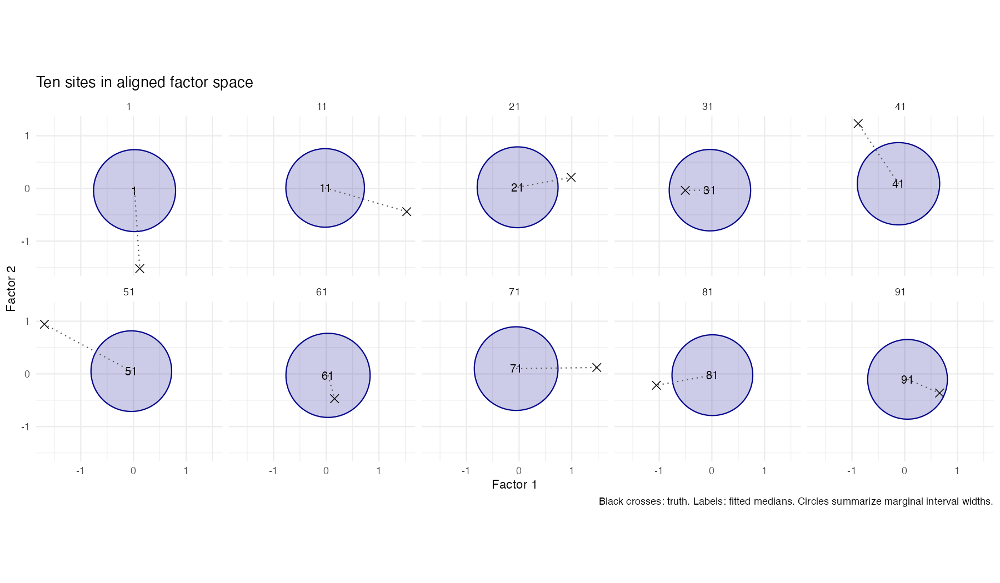

Here the site medians cluster near zero despite quite different generating scores. Alignment has not recovered those site differences precisely. Each site gives little information about its hidden scores, so the estimates shrink towards zero. On a real ordination, expect site scores to look less spread out than the conditions they stand for. The circles are rough size guides built from the marginal intervals, **not 95% joint credible regions**. Consult the returned marginal quantiles for interval values; a truth cross inside a circle is not a formal coverage test.

#### Species loadings: how does each species respond to the factors?

The loadings are read as in the [ordination section](#ordination-compare-the-combined-effect-before-naming-the-axes); here each is compared with its generating value.

``` r
native_loadings <- occJSDM::plotFactorLoadings(fit_for_ordination)
loading_plot_data <- native_loadings$data |>
  mutate(species = as.character(name)) |>
  left_join(loading_truth, by = "species", suffix = c("", "_truth"))

native_loadings$data <- loading_plot_data
native_loadings <- native_loadings +
  geom_segment(
    data = loading_plot_data,
    aes(x = x, y = y, xend = x_truth, yend = y_truth),
    inherit.aes = FALSE, linetype = "dotted", colour = "grey35"
  ) +
  geom_point(
    data = mutate(loading_truth, name = species), aes(x = x, y = y),
    inherit.aes = FALSE, shape = 4, size = 3
  ) +
  facet_wrap(~ name, ncol = 5) +
  coord_equal() +
  labs(
    title = "Species responses to the aligned factors",
    caption = "Black crosses: true loadings. Labels: fitted medians. Circles are not joint credible regions."
  )

native_loadings
```

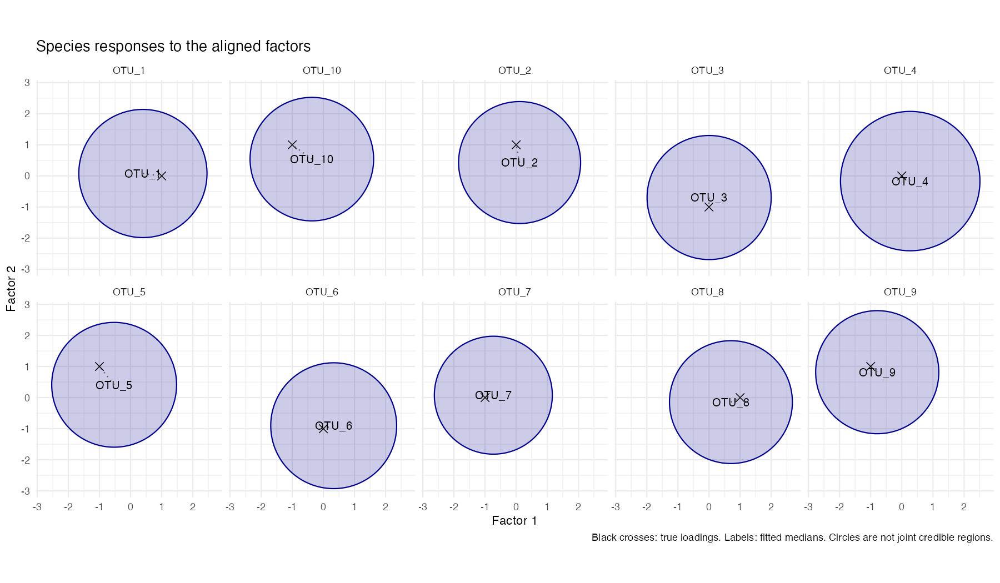

Each species has its own panel with common axes. Several species have identical generating loadings, so their truth crosses coincide. OTU_4 has zero generating loadings and sits at the origin. The fitted loadings need not be exactly zero or identical even after alignment.

#### Biplot: put sites and species together

The biplot uses all 100 sites and the ten species. Grey points are fitted site medians; blue arrows are fitted loading medians. The dashed black arrows are the generating loadings, multiplied by **the same display multiplier** as the blue arrows. Arrow lengths are rescaled for readability, so they are not on the site-score scale and are not direct effect-size readings from this figure.

``` r
site_medians <- site_quantiles["50%", , ]
loading_medians <- loading_quantiles["50%", , ]
arrow_multiplier <- 0.8 *
  max(sqrt(rowSums(site_medians^2))) /
  max(sqrt(colSums(loading_medians^2)))

native_biplot <- occJSDM::plotBiplot(fit_for_ordination, arrow_scale = 0.8) +
  geom_segment(
    data = loading_truth,
    aes(x = 0, y = 0, xend = x * arrow_multiplier, yend = y * arrow_multiplier),
    inherit.aes = FALSE, linetype = "dashed", colour = "black",
    arrow = grid::arrow(length = grid::unit(0.15, "cm"))
  ) +
  coord_equal() +
  labs(
    title = "Sites and species in one aligned biplot",
    caption = "Grey: fitted sites. Blue: fitted species. Dashed black: true species, at the same display scale."
  )

native_biplot
```

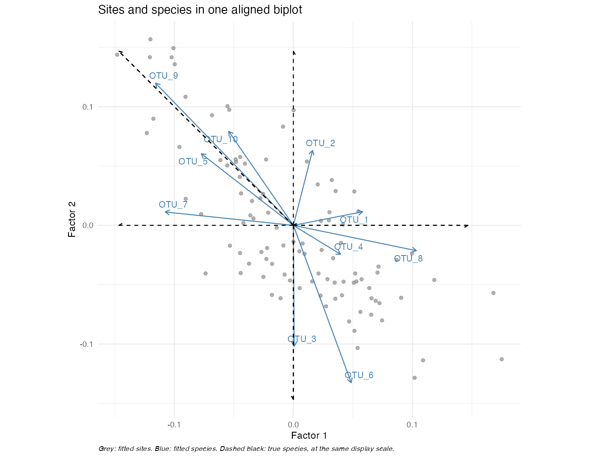

Because truth helped choose the orientation, agreement in arrow direction is not an independent accuracy check. This median biplot has no uncertainty display, and multiplying separate posterior medians does not reproduce the median of the draw-by-draw contribution. Use the invariant contribution comparison above to assess recovery of that contribution.

### The mirror-labelling study

One of our simulation studies of two-stage (eDNA) data found a different pattern, in a design that sets laboratory contamination far above what the default priors assume. A PCR of a field sample without the species’ DNA was positive with probability 0.13 to 0.24, whereas the default Beta(1, 20) prior on `q` has mean 0.048. With 24 PCRs per site, almost every site had at least one positive PCR for every species, so whether a site had any positive said almost nothing about its occupancy.

For one species in that 300-site community, which is not this lesson’s community, two of the four chains settled near the truth. The other two settled on a **mirror** explanation of the same observations, which had:

- a field-contamination probability, or field false-positive rate, `theta0` of about 0.25 (truth 0.038);
- a low collection probability;
- both environmental slopes of the wrong sign;
- site occupancy probabilities running almost opposite to the truth (correlation -0.86).

Both explanations were consistent with the observed rate of positive PCRs. That is a consistency check, not a likelihood comparison, and it does not show that the two fit equally well. Each of the four chains stayed in its explanation for all 12,000 retained draws, so each looked stable on its own. The pooled summary averaged the two, giving `theta0` 0.144.

In the study, the all-chain Rhat for that species’ `theta0`, collection intercept and environmental slopes was about 1.7, and the package’s convergence warnings reported it. The original chains ran one after another in one process, as the package runs them, with 6,000 burn-in and 12,000 retained iterations each. The 16 fresh chains were separate single-chain runs with their own seeds (10,000 burn-in and 40,000 further iterations, every fourth kept), and every one stayed near the truth.

Of the six chains run the package’s usual way, two entered the mirror. The six include the two chains of an earlier, shorter fit of the same data, which sat near the truth judging by their scores. None of the 16 separate runs entered it, and why is not established. Every chain starts from the same default values. Such counts therefore show where chains go from that start, not how much posterior probability the mirror holds, and Rhat cannot warn about an explanation that no chain visits.

This is the only such case found in these studies, and how often it happens in real data is unknown. Other flagged fits of the same community, with wider occupancy-intercept priors, were not examined for it. Nothing in these studies shows the mirror when contamination is at the level the priors assume.

The figure reads the study’s per-chain posterior means for that species from a small saved file, for the original four-chain fit and the 16 fresh chains.

``` r
mirror_chains <- read.csv("teaching-data/mirror-labelling-chains.csv", comment.char = "#")
run_order <- c("original 4-chain fit", "16 fresh chains")

# Draw the original chains last so the fresh chains do not hide them.
mirror_chains |>
  arrange(desc(match(run, run_order))) |>
  ggplot(aes(x = mean_occupancy_mean, y = theta0_mean)) +
  geom_hline(yintercept = 1 / 21, colour = "grey55", linetype = "dashed") +
  geom_point(aes(colour = run, shape = region), size = 2.5, alpha = 0.7) +
  geom_point(
    data = distinct(mirror_chains, true_mean_occupancy, true_theta0),
    aes(x = true_mean_occupancy, y = true_theta0),
    shape = 4, size = 3, stroke = 1
  ) +
  scale_colour_manual(
    values = setNames(c("#D55E00", "#0072B2"), run_order),
    breaks = run_order, name = NULL
  ) +
  scale_shape_manual(
    values = c(`near-truth` = 16, mirror = 17),
    breaks = c("near-truth", "mirror"), name = NULL
  ) +
  scale_x_continuous(labels = scales::label_percent(), limits = c(0.35, 0.6)) +
  scale_y_continuous(labels = scales::label_percent(), limits = c(0, 0.3)) +
  labs(
    x = "Chain mean of average occupancy probability over 100 scored sites",
    y = "Chain mean of theta0\n(field false-positive rate)",
    caption = "One point per chain. Black cross: generating values. Dashed line: mean of the default Beta(1, 20) prior on theta0."
  ) +
  theme(legend.position = "bottom")
```

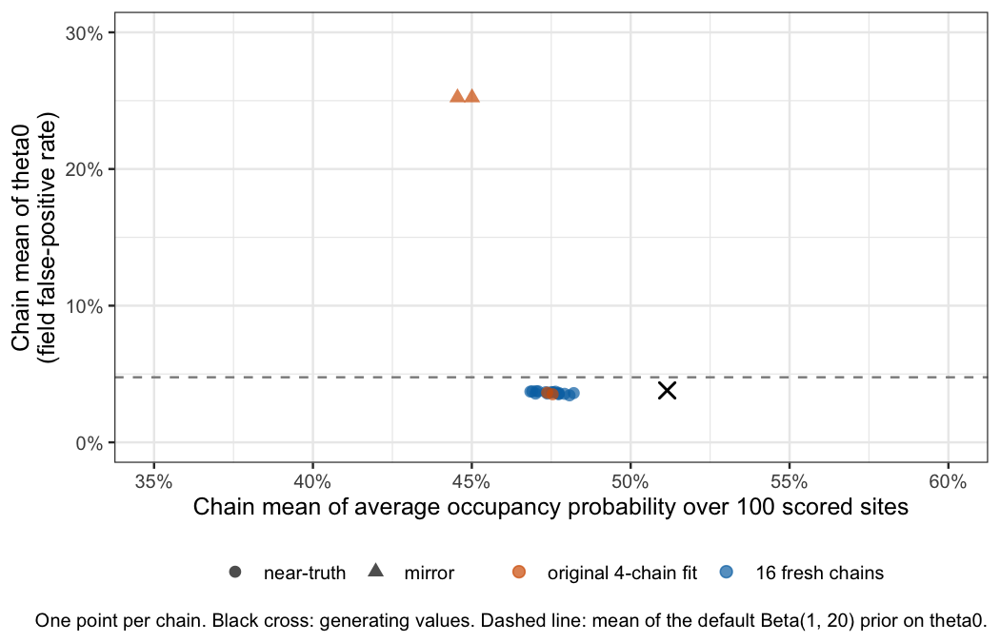

Two chains of the original fit sit far above the rest in `theta0`, yet their average occupancy differs from the other chains’ by only about three percentage points. The site-by-site pattern is reversed, but the average barely moves. In the study, `theta0`, the collection intercept and the two environmental slopes carried the signal, with gaps between chains of 3.5 to 6.1 pooled within-chain standard deviations. `B0` and average occupancy overlapped, with gaps of 0.7 and 0.3.

The study also ran 8 chains with a Beta(1, 100) prior on `theta0`. None of them entered the mirror, but none of the 16 fresh default-prior chains did either, so the comparison could not show whether that prior prevents it. The prior also pulled that species’ `theta0` down to 0.011, against a truth of 0.038. The [study report](https://github.com/AlexDiana/occJSDM/blob/main/dev/simstudy/convergence-flag-diagnosis/REPORT.md) gives the details and limitations.

### Read trace draws from the fit object

These are the extraction steps behind the three traceplots in the diagnostics section. They read internal slots of the fit object, which may change between package versions; a per-chain accessor is planned (`TODO.md`).

#### A collection covariate

First locate the collection covariate by name. The array has dimensions `[covariate, species, iteration, chain]`; `drop = FALSE` retains those four dimensions after selecting one covariate.

``` r
collection_name <- "X_theta"
collection_index <- match(collection_name, colnames(fitmodel$X_theta))

stopifnot(!is.na(collection_index))

collection_draws <- fitmodel$results_output$beta_theta_output[
  collection_index, , , , drop = FALSE
]

occJSDM::plotTraceplot(
  collection_draws,
  param_name = "Collection effect (log-odds)",
  dimnames1 = collection_name,
  dimnames2 = fitmodel$infos$speciesNames
)
```

That call plots every species.

#### A primer

The same method applies to `p` and `q`, but their first dimension is primer rather than covariate. Primer identifiers may be stored as numbers, so convert their labels to character before matching.

``` r
primer_name <- "1"
primer_index <- match(primer_name, as.character(fitmodel$infos$primerNames))

stopifnot(!is.na(primer_index))

primer_draws <- fitmodel$results_output$p_output[
  primer_index, , , , drop = FALSE
]

occJSDM::plotTraceplot(
  primer_draws,
  param_name = "PCR detection probability",
  dimnames1 = primer_name,
  dimnames2 = fitmodel$infos$speciesNames
)
```

#### The field-contamination parameter

For a species-only parameter such as `theta0`, the saved array has three dimensions: `[species, iteration, chain]`. Do not apply the four-index expression above to it. The first line loads the archived alternative-prior fit; with your own data, use your own fit instead.

``` r
alternative_fit <- readRDS("/path/to/full-fits/alternative-long-fit.rds")$fit
species_index <- match("OTU_6", alternative_fit$infos$speciesNames)

stopifnot(!is.na(species_index))

field_draws <- alternative_fit$results_output$theta0_output[
  species_index, , , drop = FALSE
]

occJSDM::plotTraceplot(
  field_draws,
  param_name = "Field-contamination probability",
  dimnames1 = "OTU_6"
)
```

#### Where to find other parameter draws

Start from `fitmodel$results_output`. Keep the iteration and chain dimensions separate when calculating diagnostics; pooling chains into one vector destroys the information Rhat needs. Each bullet names an array within `results_output`, the parameter it holds, and its dimensions before a parameter is selected.

- `jsdm_output$B0_output`: occupancy intercept; species, iteration, chain.
- `jsdm_output$B_output`: environmental effect; covariate, species, iteration, chain.
- `jsdm_output$G_output`: measured trait effect; trait, environmental covariate, iteration, chain.
- `beta_theta_output`: collection intercept or effect; covariate, species, iteration, chain.
- `p_output`, `q_output`: PCR detection or false-positive rate; primer, species, iteration, chain.
- `theta0_output`: field-contamination rate; species, iteration, chain.

For example, direct newer diagnostics for one environmental coefficient use an **iteration-by-chain matrix**. This optional code requires the `posterior` package:

``` r
environment_index <- match("X_psi.EnvCov.1", colnames(fitmodel$X_psi))
species_index <- match("OTU_1", fitmodel$infos$speciesNames)

stopifnot(!anyNA(c(environment_index, species_index)))

coefficient_draws <- fitmodel$results_output$jsdm_output$B_output[
  environment_index, species_index, ,
]

tibble(
  Rhat = posterior::rhat(coefficient_draws),
  bulk_ESS = posterior::ess_bulk(coefficient_draws),
  tail_ESS = posterior::ess_tail(coefficient_draws)
)
```

### The corrected response-curve helper

`returnCovariateEffect()` and `plotCovariateEffect()` vary one predictor in original units. They hold other numeric predictors at their medians and categories at their first fitted levels, and set spatial and latent site effects to zero. Their posterior-median column is named `median` (formerly `mean`), so code that read the old column needs the new name. The two `plotOccupancyGradient()` examples earlier in this lesson were not affected, so their differences from the simulated truth are not caused by this bug.

Before the correction in [PR \#13](https://github.com/AlexDiana/occJSDM/pull/13), these helpers added a log-odds intercept after converting to probabilities and standardized predictors twice, which could give probabilities above one. Existing fits with the required covariate metadata need no refit.

### Reproduce the teaching figures

The compact files retain source and fit hashes. Full MCMC fits are kept outside the package because they are much larger. To regenerate them, follow [the lesson build README](https://github.com/AlexDiana/occJSDM/blob/main/dev/simstudy/vignette-lesson/README.md) and run the existing simulation and fitting commands with the recorded source. Then export this lesson’s additional summaries:

``` bash
Rscript dev/simstudy/vignette-lesson/summarise_outputs.R /path/to/full-fits
Rscript dev/simstudy/vignette-lesson/verify_outputs.R /path/to/full-fits
Rscript dev/simstudy/vignette-lesson/summarise_diagnostics.R /path/to/full-fits
Rscript dev/simstudy/vignette-lesson/verify_diagnostics.R /path/to/full-fits
Rscript dev/simstudy/vignette-lesson/summarise_latent_tables.R /path/to/full-fits
Rscript dev/simstudy/vignette-lesson/verify_latent_tables.R /path/to/full-fits
Rscript dev/simstudy/vignette-lesson/export_native_plots.R /path/to/full-fits
Rscript dev/simstudy/vignette-lesson/verify_native_plots.R /path/to/full-fits
Rscript dev/simstudy/vignette-lesson/ordination-export.R /path/to/full-fits
Rscript dev/simstudy/vignette-lesson/ordination-verify.R /path/to/full-fits
Rscript dev/simstudy/vignette-lesson/remaining-plots-export.R /path/to/full-fits
Rscript dev/simstudy/vignette-lesson/remaining-plots-verify.R /path/to/full-fits
Rscript dev/simstudy/vignette-lesson/covariate-effect-export.R /path/to/full-fits
Rscript dev/simstudy/vignette-lesson/covariate-effect-verify.R /path/to/full-fits
Rscript dev/simstudy/vignette-lesson/native-traits-export.R /path/to/full-fits
Rscript dev/simstudy/vignette-lesson/native-traits-verify.R /path/to/full-fits
```

In an R session with those full fits available:

``` r
saved_fit <- readRDS("/path/to/full-fits/default-fit.rds")
fitmodel <- saved_fit$fit
fitmodel_perfect <- readRDS("/path/to/full-fits/perfect-fit.rds")$fit

known_truth <- lesson$input$sim$true_params
```

These exporters preserve all posterior draws for their summaries. They do not rerun MCMC or choose a different community because an effect was not recovered.
