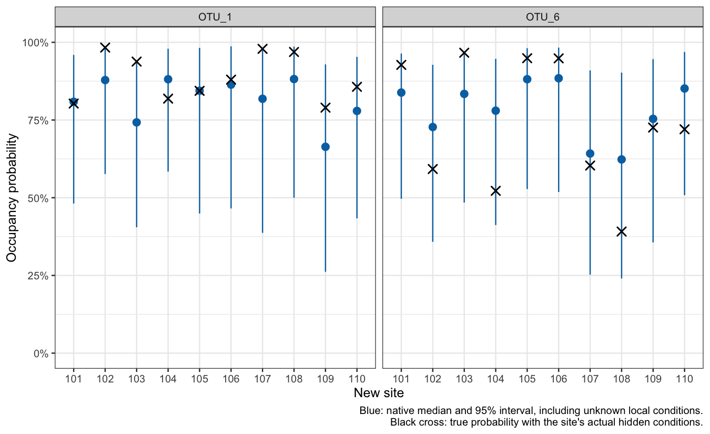
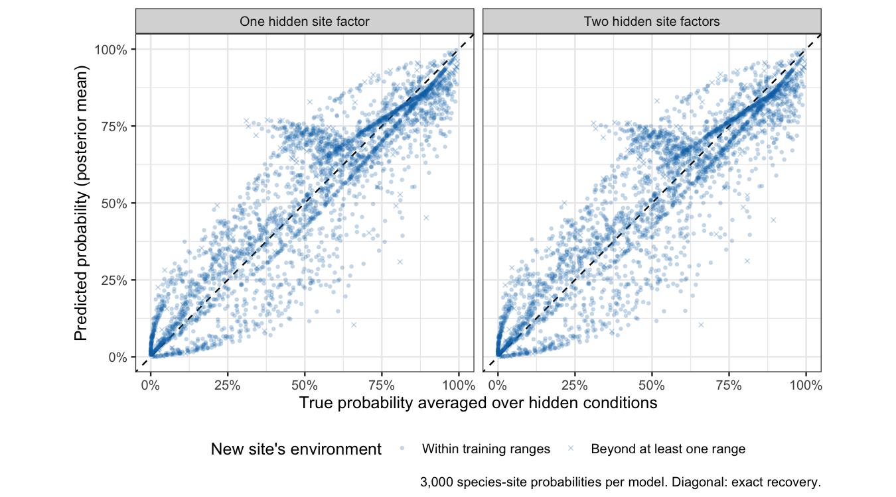

Lesson 4: Predict occupancy at new sites and compare models
================

## What this lesson answers

Genuine prediction at an unsurveyed site requires keeping its observations out of fitting and averaging appropriately over its unknown conditions. Reusing the fitting sites’ covariates is not an independent prediction test. This lesson supplies 300 independently generated sites that neither model has seen, predicts occupancy there with the package’s new-site function, and compares two models by how well they predict what actually occurred. Spatial prediction is in [the spatial lesson](occJSDM-lesson-2.md).

It continues [Lesson 3](occJSDM-lesson-3.md), which reads the same fits’ outputs against truth, and uses the same non-spatial community: 100 sites, 10 species, two measured environmental covariates, two measured traits, three field samples per site, two primers and six PCR replicates per primer.

All teaching code is visible. Figures and tables use compact saved summaries; chunks labelled `eval=FALSE` show how to obtain the underlying outputs from a full fit, where `fitmodel` is the full object returned by `runOccJSDM()`. The [appendix](#appendix-evidence-and-reproduction) shows how to rebuild the new-site comparison.

``` r
library(dplyr)
library(tidyr)
library(tibble)
library(ggplot2)

lesson <- readRDS("teaching-data/nonspatial-lesson.rds")
known_truth <- lesson$input$sim$true_params
species_order <- colnames(lesson$input$sim$data_list$OTU)

# This theme also works after occJSDM loads its ternary-plot dependency.
theme_set(ggtern::theme_bw(base_size = 12))
```

In the figures, **black crosses or lines show truth**. Blue points or lines show estimates, and blue intervals show posterior uncertainty. An interval is not a measurement of how far the estimate actually is from truth; simulation lets us check both separately.

## Predict occupancy at genuinely new sites

Imagine receiving habitat measurements from a second survey area before collecting any eDNA there. Can the fitted model predict which species are likely to occur? To answer this, we generated **300 new sites** from the same environmental distribution and the same ten-species community. Neither the new presence/absence observations nor the hidden site conditions were supplied to either fit.

The original training survey is unchanged: 100 sites, three field samples per site, two primers and six PCR replicates per primer per sample. We compare its existing two-factor PCR fit with a new one-factor fit. Both use the same observations, environmental covariates, traits, priors and MCMC settings. The only model-setting change is the number of hidden site factors. The generating community has two factors, but that does not guarantee that two fitted factors will predict more accurately from this amount of data.

``` r
prediction_examples <- readRDS("teaching-data/prediction-lesson.rds")

prediction_labels <- c(
  one_factor = "One hidden site factor",
  two_factors = "Two hidden site factors"
)

new_habitat <- as.data.frame(prediction_examples$input$raw_covariates)

head(new_habitat) |>
  knitr::kable(digits = 2, caption = "Raw environmental values at the first six new sites.")
```

|     | X_psi.EnvCov.1 | X_psi.EnvCov.2 |
|:----|---------------:|---------------:|
| 101 |          -3.96 |           0.77 |
| 102 |           6.20 |          -8.71 |
| 103 |          -0.85 |           7.01 |
| 104 |           0.26 |          -8.63 |
| 105 |         -13.28 |          -2.89 |
| 106 |         -14.79 |          -5.58 |

Raw environmental values at the first six new sites.

Site identifiers run from 101 to 400, so they cannot be mistaken for the training sites numbered 1 to 100. Their two environmental variables were drawn independently from the original Normal distribution with mean zero and standard deviation 10. The fitted model standardizes them using the **training** means and standard deviations. Recalculating those constants from the new sites would change the meaning of the fitted coefficients.

There are 13 new sites with at least one environmental value outside the observed training range. We retain and flag them rather than remove difficult cases. These are new draws from the same distribution, not a test of prediction in a different climate, a different species community or a spatially separated region.

### Which true probability should a new-site prediction recover?

Two probabilities are useful here. They answer different questions.

1.  **Probability given this site’s actual local conditions.** The simulator knows the measured environment and the hidden site factors. Together they determine the site’s generating occupancy probability. The actual presence or absence is then a random draw using that probability.
2.  **Probability given only the measured environment.** An ecologist visiting a new site does not yet know its hidden conditions. We average occupancy probabilities over the range of possible hidden conditions. This is the relevant probability for predicting presence or absence using the available habitat measurements.

The second is often called a **marginal probability**, because the unmeasured conditions have been averaged out. The first is a **conditional probability**, because it assumes those conditions are known. Neither is the actual presence/absence observation, which is only zero or one.

Here is a concrete example from the simulation. The code uses the true parameters to show the distinction for OTU_6 at site 101. `plogis()` converts log-odds into a probability. `dnorm()` gives more weight to common hidden conditions and less weight to unusual ones; `integrate()` adds up their weighted probabilities.

``` r
true_parameters <- known_truth$jsdmParams_true
example_species <- match("OTU_6", species_order)
example_site <- match("101", rownames(new_habitat))

environmental_log_odds <-
  prediction_examples$input$environmental_eta[example_site, example_species]

hidden_sd <- lesson$input$jsdm$sigma_h *
  sqrt(sum(true_parameters$L[, example_species]^2))

average_over_hidden_conditions <- integrate(
  function(hidden) {
    plogis(environmental_log_odds + hidden_sd * hidden) * dnorm(hidden)
  },
  lower = -Inf,
  upper = Inf
)$value

site_example <- prediction_examples$truth |>
  filter(Site == "101", species == "OTU_6")

tibble(
  quantity = c(
    "True probability with actual hidden conditions",
    "True probability averaged over unknown conditions",
    "Probability with hidden contribution set to zero",
    "Actual presence (1) or absence (0)"
  ),
  value = c(
    site_example$conditional_truth,
    average_over_hidden_conditions,
    plogis(environmental_log_odds),
    site_example$z
  )
) |>
  knitr::kable(digits = 3)
```

| quantity                                          | value |
|:--------------------------------------------------|------:|
| True probability with actual hidden conditions    | 0.927 |
| True probability averaged over unknown conditions | 0.822 |
| Probability with hidden contribution set to zero  | 0.860 |
| Actual presence (1) or absence (0)                | 1.000 |

For this species and site, the true probability is about **93% with its actual hidden conditions**, or **82% when we know only the measured habitat**. The species happens to be present. Predicting 82% before seeing that observation can be appropriate even though the conditional probability is 93%. Presence alone does not tell us which probability generated it.

Setting the hidden contribution to zero is a third calculation. It is the target of [Lesson 3’s response profiles](occJSDM-lesson-3.md#what-does-an-effect-mean-for-a-species-distribution), but is generally different from averaging probabilities over unknown conditions. The inverse-logit curve is nonlinear, so “convert the average log-odds” and “average the converted probabilities” need not agree.

### Use the package’s new-site prediction function

With a full saved PCR fit loaded as `fitmodel`, the native call below predicts the ten sites selected before fitting or inspecting results. Supply raw environmental values with the same column names as in training. This is a non-spatial example.

``` r
shown_habitat <- new_habitat[prediction_examples$input$selected_sites, , drop = FALSE]

set.seed(prediction_examples$input$public_prediction_seed)

new_site_quantiles <- occJSDM::predictNewSites(
  fitmodel,
  X_psi = shown_habitat,
  useSpatial = FALSE,
  confidence = 0.95,
  verbose = FALSE
)

# The returned array is quantile by site by species, without dimension names.
# Its three slices are the lower limit, median and upper limit.
tibble(
  Site = rownames(shown_habitat),
  lower = new_site_quantiles[1, , 1],
  median = new_site_quantiles[2, , 1],
  upper = new_site_quantiles[3, , 1]
)
```

For each retained parameter draw, `predictNewSites()` also draws new hidden conditions. Its interval therefore includes uncertainty about those conditions as well as uncertainty about the fitted parameters. Compare that interval with the simulator’s **conditional probability for the site’s actual conditions**. It is not a confidence interval for a binary presence/absence observation, and its middle slice is a **median**, not a posterior mean.

``` r
native_prediction_examples <- prediction_examples$public |>
  filter(arm == "two_factors", species %in% c("OTU_1", "OTU_6")) |>
  mutate(Site = factor(Site, levels = prediction_examples$input$selected_sites))

ggplot(native_prediction_examples, aes(x = Site)) +
  geom_pointrange(
    aes(y = median, ymin = lower, ymax = upper),
    colour = "#0072B2"
  ) +
  geom_point(aes(y = conditional_truth), shape = 4, size = 3, stroke = 1) +
  facet_wrap(~ species) +
  scale_y_continuous(labels = scales::label_percent(), limits = c(0, 1)) +
  labs(
    x = "New site",
    y = "Occupancy probability",
    caption = paste(
      "Blue: native median and 95% interval, including unknown local conditions.",
      "Black cross: true probability with the site's actual hidden conditions.",
      sep = "\n"
    )
  )
```

<!-- -->

The wide intervals are informative: habitat alone leaves considerable uncertainty about a particular site’s occupancy probability. Seeing truth inside an interval is a useful check, but these twenty examples cannot establish an overall coverage rate.

### Check point predictions against the appropriate truth

For a single probability prediction, we use the **posterior mean of probabilities averaged over unknown conditions**. The exporter performs the same kind of averaging illustrated by `integrate()` above, using every retained parameter draw, then averages across all 24,000 draws. This removes additional noise from repeatedly drawing hypothetical conditions. It does not remove uncertainty or Monte Carlo error in the fitted parameters. The development helper is separate from the package’s public `predictNewSites()` function.

In the next figure, both axes refer to probability given **only the measured environment**. Each point represents one species at one new site. The diagonal is exact agreement. Points above it are overestimates; points below it are underestimates. The two fits produce very similar predictions.

``` r
prediction_cells <- prediction_examples$cells |>
  mutate(model = unname(prediction_labels[arm]))

ggplot(prediction_cells, aes(x = truth, y = estimate)) +
  geom_abline(intercept = 0, slope = 1, linetype = "dashed") +
  geom_point(
    aes(shape = outside_training_range),
    alpha = 0.25, size = 1.1, colour = "#0072B2"
  ) +
  facet_wrap(~ model) +
  scale_shape_manual(
    values = c(`FALSE` = 16, `TRUE` = 4),
    labels = c(`FALSE` = "Within training ranges", `TRUE` = "Beyond at least one range")
  ) +
  scale_x_continuous(labels = scales::label_percent(), limits = c(0, 1)) +
  scale_y_continuous(labels = scales::label_percent(), limits = c(0, 1)) +
  coord_equal() +
  labs(
    x = "True probability averaged over hidden conditions",
    y = "Predicted probability (posterior mean)",
    shape = "New site's environment",
    caption = "3,000 species-site probabilities per model. Diagonal: exact recovery."
  ) +
  theme(legend.position = "bottom")
```

<!-- -->

Calculate the average direction and size of the errors separately. A negative signed error means underestimation on average. Absolute errors count both overestimates and underestimates as positive distances, so they cannot cancel.

``` r
prediction_cells |>
  group_by(model) |>
  summarise(
    `Signed error (percentage points)` = 100 * mean(estimate - truth),
    `Absolute error (percentage points)` = 100 * mean(abs(estimate - truth)),
    `RMSE (percentage points)` = 100 * sqrt(mean((estimate - truth)^2)),
    .groups = "drop"
  ) |>
  knitr::kable(digits = 2)
```

| model | Signed error (percentage points) | Absolute error (percentage points) | RMSE (percentage points) |
|:---|---:|---:|---:|
| One hidden site factor | 0.52 | 8.95 | 12.11 |
| Two hidden site factors | 0.36 | 8.91 | 12.00 |

Both models overestimate these probabilities slightly on average, by **0.52 percentage points** with one factor and **0.36** with two, while their **average absolute error is about 8.9 percentage points**. Those are results from this simulation, not hypothetical examples. The difference between the two error measures means that errors in opposite directions partially cancel. An absolute error of ten points would be a prediction of 40% or 60% when truth is 50%; that last sentence is only an illustration of the unit, not a claim that all errors equal ten points.

These new-site errors have a different target from Lesson 1’s errors in fitted-site probabilities. Here we average over unknown local conditions; there we check the probability for each surveyed site’s actual conditions. Comparing their magnitudes as if they measured the same task would be misleading.

### Compare models using what actually occurred

In a real new survey we would not know the generating probabilities. If we could establish the actual presence/absence states accurately, we could score the predictions against those states instead. The simulated new survey gives us exactly those binary states, without collection or PCR error.

The **Brier score** is the squared difference between the predicted probability and the zero-or-one outcome. The **negative log score** penalizes confidently wrong predictions especially strongly. Smaller is better for both. Neither is measured in percentage points, and neither is an absolute error in the unknown probability. Even the true generating probabilities can have nonzero scores because presence/absence is random.

``` r
observed_scores <- prediction_cells |>
  mutate(
    brier = (estimate - z)^2,
    negative_log_score = -if_else(z == 1, log(estimate), log1p(-estimate))
  )

observed_scores |>
  group_by(model) |>
  summarise(
    Brier = mean(brier),
    `Negative log score` = mean(negative_log_score),
    .groups = "drop"
  ) |>
  knitr::kable(digits = 5)
```

| model                   |   Brier | Negative log score |
|:------------------------|--------:|-------------------:|
| One hidden site factor  | 0.18717 |            0.55462 |
| Two hidden site factors | 0.18684 |            0.55382 |

Both models predict the **same new sites**, so compare their scores in pairs. Species at a site share hidden conditions; treating 3,000 species-site outcomes as independent would exaggerate the amount of independent evidence. We first average across the ten species within each site, then calculate differences across the 300 sites.

``` r
paired_sites <- observed_scores |>
  group_by(Site, arm) |>
  summarise(Brier = mean(brier), .groups = "drop") |>
  pivot_wider(names_from = arm, values_from = Brier) |>
  mutate(difference = one_factor - two_factors)

paired_sites |>
  summarise(
    `Mean Brier difference` = mean(difference),
    `Standard error across sites` = sd(difference) / sqrt(n())
  ) |>
  knitr::kable(digits = 7)
```

| Mean Brier difference | Standard error across sites |
|----------------------:|----------------------------:|
|             0.0003306 |                    6.64e-05 |

The difference, one factor minus two factors, is about **0.00033 Brier units**, slightly favouring the two-factor fit in this particular experiment. The site-based standard error is about **0.000066**. It describes variation among new sites **conditional on these fitted predictions**. It excludes Monte Carlo error in the MCMC estimates, variation from repeating the original training survey, and changes to the simulated community. A site-only interval can therefore exclude zero, as it does here, without establishing a dependable model advantage.

An independent calculation from all retained posterior draws (`prediction-verify.R --score-mcse`, recorded in the build log) estimates the Monte Carlo standard error of that Brier-score difference at about **0.00026**, so the observed difference of 0.00033 is only about 1.3 Monte Carlo standard errors from zero. This is numerical uncertainty from MCMC, a different source of uncertainty from the site-based standard error. A difference this close to its numerical uncertainty supports withholding a model ranking. The calculation uses a first-order approximation and is documented in the prediction verifier.

The broad result is that these two fits have nearly identical predictive performance here. We do not select a winning factor count from this tiny difference. Predicting each species’ marginal occurrence also does not test whether the model has recovered joint community structure or the correct number of hidden ecological drivers. A model can give useful single-species probabilities while describing species associations poorly.

### Check the additional fit and understand the WAIC limitation

To reproduce the additional fit, use the same training data and settings as the baseline, changing `n_factors`. This command is displayed but does not run when knitting.

``` r
set.seed(prediction_examples$input$fitting_seed)

fit_one_factor <- occJSDM::runOccJSDM(
  data = lesson$input$sim$data_list,
  occCovariates = colnames(new_habitat),
  collCovariates = "X_theta",
  spatCovariates = NULL,
  threshold = 1,
  listParams = list(n_factors = 1, n_lattrait = 1),
  MCMCparams = prediction_examples$manifests$two_factors$mcmc,
  listPriors = prediction_examples$manifests$two_factors$priors,
  summarisedLatentPresences = TRUE
)
```

Each model has four chains, 3,000 burn-in iterations and 6,000 retained iterations per chain, with no thinning. The additional fit produced no warnings. The following table checks both the public parameter diagnostics and diagnostics for each species’ predicted probability averaged across the 300 new sites. Rhat and effective sample size check MCMC behaviour; they do not have ecological true values to overlay.

The screen below is the one [Lesson 3’s diagnostics](occJSDM-lesson-3.md#check-computation-as-well-as-ecological-recovery) introduces: flag a parameter whose Rhat exceeds 1.01 or whose effective sample size is below 400.

``` r
prediction_examples$diagnostics |>
  group_by(arm) |>
  summarise(
    `Parameter rows` = n(),
    `Missing or flagged rows` = sum(
      is.na(rhat) | is.na(ess) | rhat > 1.01 | ess < 400
    ),
    .groups = "drop"
  ) |>
  left_join(
    prediction_examples$probability_diagnostics |>
      group_by(arm) |>
      summarise(
        `Largest prediction Rhat` = max(rhat),
        `Smallest prediction ESS` = min(ess),
        `Largest prediction MCSE (percentage points)` = 100 * max(mcse),
        .groups = "drop"
      ),
    by = "arm"
  ) |>
  mutate(model = unname(prediction_labels[arm])) |>
  select(model, everything(), -arm) |>
  knitr::kable(digits = 3)
```

| model | Parameter rows | Missing or flagged rows | Largest prediction Rhat | Smallest prediction ESS | Largest prediction MCSE (percentage points) |
|:---|---:|---:|---:|---:|---:|
| One hidden site factor | 100 | 0 | 1.003 | 1218.026 | 0.254 |
| Two hidden site factors | 100 | 0 | 1.007 | 1289.846 | 0.259 |

There are no flagged rows under these checks. Nevertheless, the largest Monte Carlo standard error of a species’ average predicted probability is about 0.26 percentage points. This measures numerical uncertainty remaining in that posterior mean, not ecological prediction error. Passing the diagnostic thresholds does not make tiny differences between model scores exact.

The old walkthrough extracted WAIC to compare model specifications. Here is the current extraction syntax, followed by the values from these same-data fits:

``` r
occJSDM::extractWAIC(fitmodel)
occJSDM::extractWAIC(fit_one_factor)
```

``` r
tibble(
  model = unname(prediction_labels[names(prediction_examples$manifests)]),
  `Current extractWAIC value` = vapply(
    prediction_examples$manifests, function(fit) fit$waic, numeric(1)
  )
) |>
  knitr::kable(digits = 2)
```

| model                   | Current extractWAIC value |
|:------------------------|--------------------------:|
| Two hidden site factors |                  24495.31 |
| One hidden site factor  |                  24501.00 |

**Do not use this table to choose the better model for unsurveyed sites.** The current calculation combines likelihood terms for the sampled, unobserved site and collection states with terms for the PCR observations. Those hidden states are learned using the training observations. It does not average them out to evaluate the probability of new observations at a new site. Matching the training dataset is necessary for comparison, but does not by itself fix this difference in target. The independent-site scores above provide the worked predictive comparison. A validated observed-data WAIC or site-level cross-validation workflow remains separate work.

## Where to go next

[Lesson 3](occJSDM-lesson-3.md) reads the fitted outputs at the surveyed sites. [The four-JSDM comparison](occJSDM-lesson-4.md) asks the same two prediction questions of four packages on a perfectly observed community. The appendix below holds the commands that rebuild this lesson’s comparison.

## Appendix: evidence and reproduction

This appendix is for readers who want to reproduce the lesson; its conclusions do not depend on reading it.

The new-site comparison needs the additional one-factor fit once. Follow [the lesson build README](https://github.com/AlexDiana/occJSDM/blob/main/dev/simstudy/vignette-lesson/README.md) to prepare its independent-site data before fitting; then run its exporter and verifier:

``` bash
Rscript dev/simstudy/vignette-lesson/prediction-export.R /path/to/full-fits /path/to/new-site-check
Rscript dev/simstudy/vignette-lesson/prediction-verify.R /path/to/full-fits /path/to/new-site-check
```
