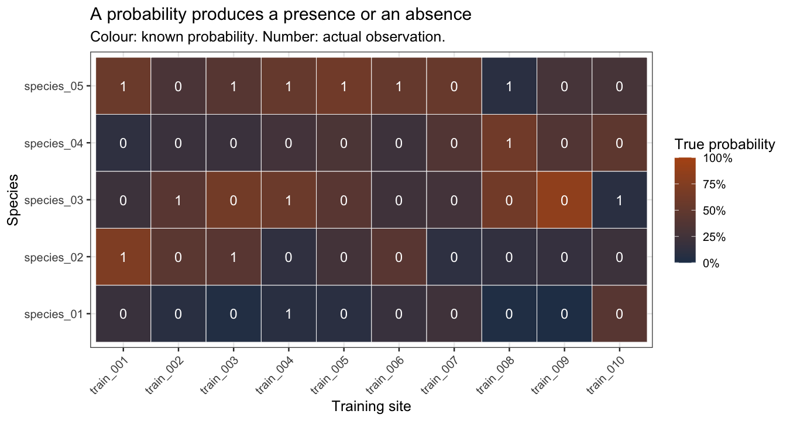
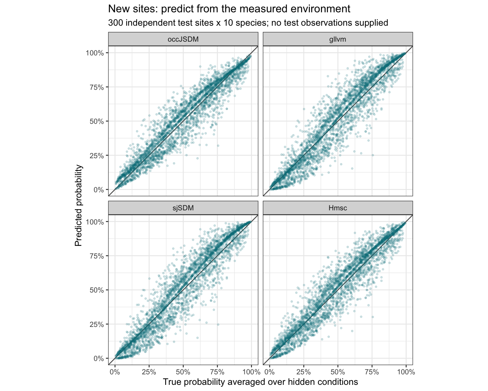
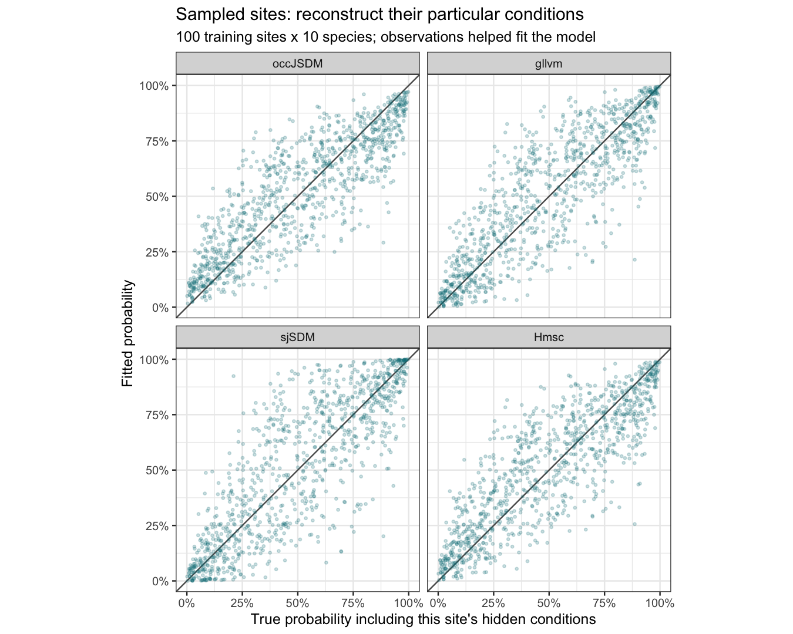
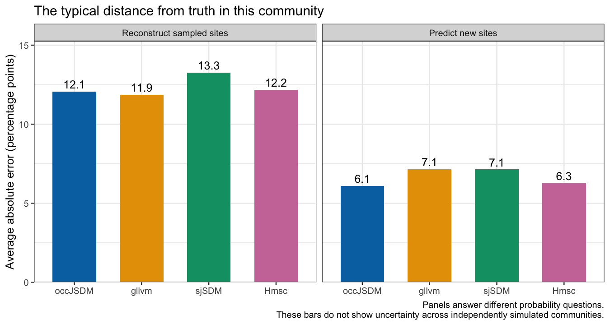
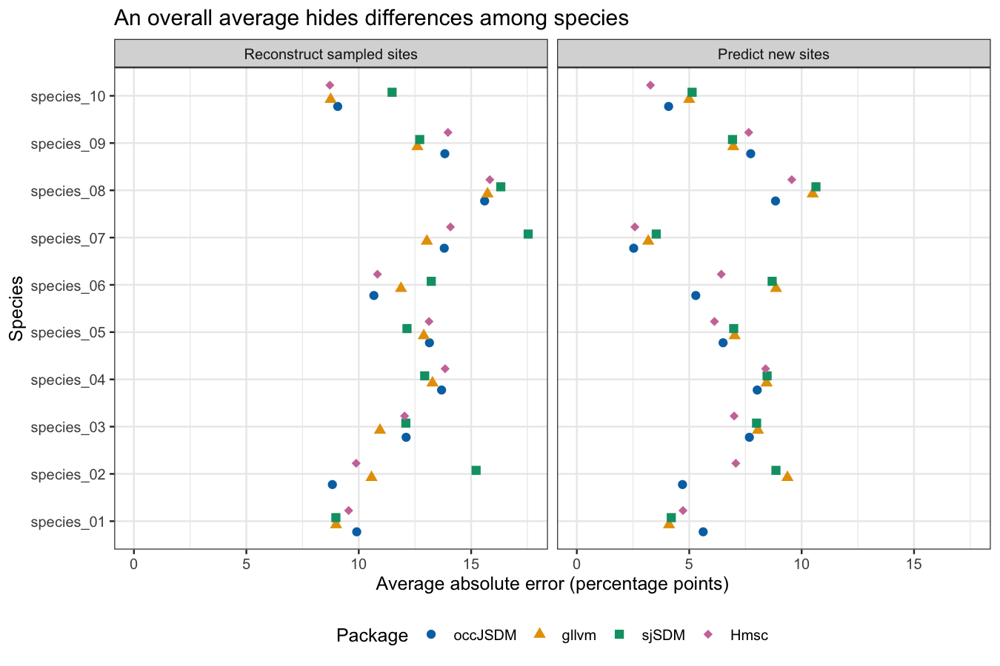
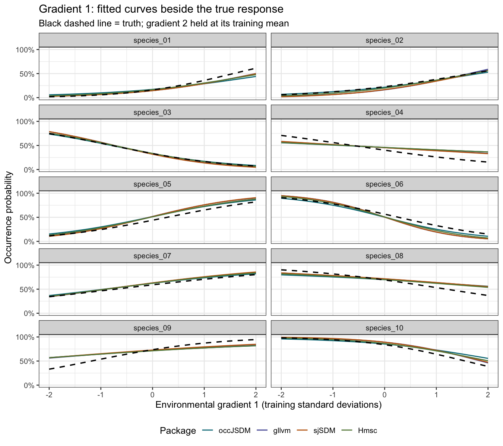
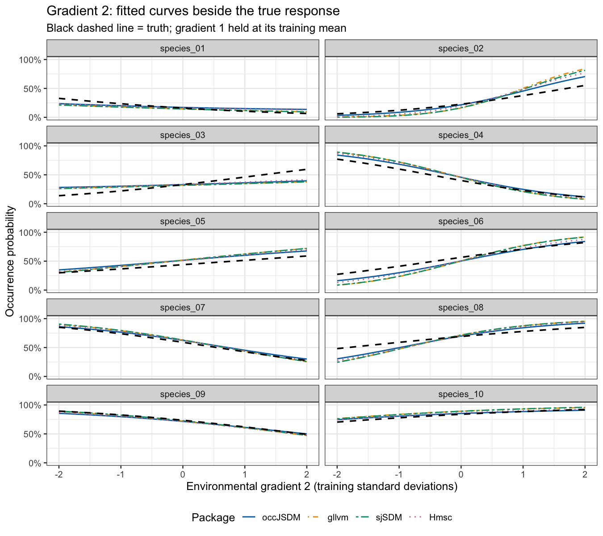

Lesson 5: Compare four JSDMs with a community whose truth we know
================

## What are we comparing?

Suppose we know with certainty which species occupy each surveyed site. Can a joint species distribution model recover the underlying probabilities, and can it predict occurrence at sites we have not surveyed?

We give **occJSDM, gllvm, sjSDM and Hmsc exactly the same simulated observations**. gllvm fits generalised linear latent variable models by approximate likelihood. sjSDM is a fast JSDM fitted by optimisation in PyTorch, a Python machine-learning library. Hmsc is a Bayesian hierarchical JSDM widely used in community ecology.

Why compare an eDNA package with packages that have no detection model? Only occJSDM models detection error. This lesson checks that its ecological core, the part it shares with these established JSDMs, does as well as theirs on perfectly observed data. Here there is no DNA collection failure, PCR detection error or false positive. As the [quickstart](occJSDM.md#the-example-data) notes, when `info` has only one row per site, `runOccJSDM()` skips the detection stages and fits a JSDM to the observed presence/absence. That is the mode used here. The detection processes matter in [Lesson 2](occJSDM-lesson-2.md), but here we remove them to examine the ecological model itself.

This lesson works through **one community**. [Lesson 6](occJSDM-lesson-6.md) repeats the experiment across ten independent communities, compares ecological and trait scenarios, and examines bias and interval coverage. These experiments do not establish a general ranking of the packages. All numbers below come from saved fits. Section 5 explains why the sjSDM fit needed several starts and what its two solutions mean.

You will learn to:

1.  Distinguish a known presence or absence from a known occurrence probability.
2.  Ask the same prediction question of different packages.
3.  Measure both the direction and the size of errors against simulation truth.
4.  Compare environmental responses on the probability scale.
5.  Separate reliable computation from accurate ecological estimation.
6.  Use what makes the model joint to predict one species from another.

All teaching code is visible. Knit this file, or run its chunks with `vignettes` as the working directory. Rendering reads a compact results bundle and does **not** fit any models. The optional simulation and fitting chunks are shown with `eval=FALSE`; run them deliberately if you want to repeat the experiment. Knitting needs only the four packages loaded below and ggtern, which installing occJSDM also installs; gllvm, sjSDM and Hmsc are needed only for the optional fits in the appendix.

**What this lesson assumes you know.** The code uses base R and the tidyverse: the pipe `|>`, and from dplyr and tidyr the verbs listed below. If any are new, the two chapters of R for Data Science on [data transformation](https://r4ds.hadley.nz/data-transform) and [data tidying](https://r4ds.hadley.nz/data-tidy) teach everything used here in an afternoon. The unusual operations, base R’s `sweep()` and `integrate()`, are explained where they appear.

- `select()` to choose columns, `filter()` and `distinct()` to keep and deduplicate rows, and `pull()` to take one column out as a vector.
- `mutate()` and `transmute()` to add columns (`transmute()` keeps only the new ones), and `group_by()` and `summarise()` to summarise by group.
- `left_join()` and `inner_join()` to add the columns of one table to another by shared identifiers (`inner_join()` keeps only the rows that match in both).
- `as_tibble()`, from tibble, to turn a data frame or a matrix into a tibble.
- `pivot_longer()`, from tidyr, to turn several columns into rows, here one row per site and species.

``` r
library(dplyr)
library(tidyr)
library(tibble)
library(ggplot2)

comparison <- readRDS("teaching-data/jsdm-comparison.rds")

training <- comparison$training
known_truth <- comparison$truth
predictions <- as_tibble(comparison$predictions)

package_order <- c("occJSDM", "gllvm", "sjSDM", "Hmsc")
package_labels <- c("occJSDM", "gllvm", "sjSDM", "Hmsc")
package_colours <- c(
  occJSDM = "#007A87", gllvm = "#555AA4",
  sjSDM = "#C16612", Hmsc = "#648747"
)

target_labels <- c(
  sampled_site_recovery = "Reconstruct sampled sites",
  new_site_prediction = "Predict new sites"
)

predictions <- predictions |>
  mutate(
    package = factor(package, levels = package_order),
    question = factor(target, levels = names(target_labels),
                      labels = unname(target_labels)),
    signed_error_pp = 100 * (estimate - truth),
    absolute_error_pp = abs(signed_error_pp)
  )

# This theme also works after occJSDM loads its ternary-plot dependency.
theme_set(ggtern::theme_bw(base_size = 12))
```

The last line sets ggtern’s version of `theme_bw()`; [Lesson 3](occJSDM-lesson-3.md#what-this-lesson-answers) explains why the lessons use it.

`comparison` is a list. Here is every element it holds:

``` r
str(comparison, max.level = 1)
```

    #> List of 12
    #>  $ training          :List of 4
    #>  $ test_x            :'data.frame':  300 obs. of  2 variables:
    #>  $ truth             :List of 10
    #>  $ predictions       :'data.frame':  16000 obs. of  9 variables:
    #>  $ curves            : tibble [4,080 × 6] (S3: tbl_df/tbl/data.frame)
    #>  $ point_parameters  :List of 2
    #>  $ integration_checks: tibble [4 × 2] (S3: tbl_df/tbl/data.frame)
    #>  $ attempts          :'data.frame':  35 obs. of  12 variables:
    #>  $ diagnostics       :'data.frame':  2270 obs. of  9 variables:
    #>  $ selected          : Named chr [1:4] "occJSDM-attempt-1-start-1" "Hmsc-attempt-1-start-1" "gllvm-VA-attempt-2-start-2-res" "sjSDM-multistart-start-11"
    #>   ..- attr(*, "names")= chr [1:4] "occJSDM" "Hmsc" "gllvm" "sjSDM"
    #>  $ sjsdm_revision    :List of 12
    #>  $ provenance        :List of 5

- `training` holds the 100 training sites that every package received: `x`, the standardised environmental table, and `y`, the presence/absence matrix. `centre` and `spread` are the training means and standard deviations used to standardise.
- `test_x` is the standardised environment of the 300 test sites, with no observations.
- `truth` is the simulation’s generating truth, which no fitter saw; we call it `known_truth`, and section 1 names the parts the lesson uses.
- `predictions` has one row for each package, prediction question, site and species, 16,000 in all. Each row holds the estimate, the matching true probability, the observed 0 or 1 and the probability band used in section 7.
- `curves` holds the fitted and true response curves of section 8.
- `point_parameters` holds gllvm’s and sjSDM’s fitted intercepts, slopes and loadings, which section 4 uses.
- `diagnostics` holds the chain diagnostics for occJSDM and Hmsc that section 5 summarises.
- `attempts` lists every fitting attempt with its run time and checks, and `selected` names the attempt chosen for each package; the appendix reads both.
- `sjsdm_revision` holds the evidence for the two sjSDM solutions, shown in the appendix.
- `integration_checks` and `provenance` are records that the reproduction checks read; this lesson does not use them.

## 1. What the models receive, and what we keep secret

There are **100 training sites, 300 independent test sites, 10 species, two measured environmental gradients and two hidden site factors**. The test sites were set aside before fitting. All sites are non-spatial and independently generated.

A hidden factor represents a pattern of unmeasured conditions shared by several species. For example, several species might respond to an unmeasured soil property. The simulation gives us the actual hidden conditions; the fitters never receive them. A factor need not represent a single identifiable ecological cause, and shared responses do not establish species interactions.

The fitter receives an environmental table and a matching presence/absence matrix. The rows must refer to the same sites in the same order.

``` r
# Environmental measurements are already standardised from the training sites.
knitr::kable(head(training$x, 5), digits = 2,
             caption = "Two measured gradients at the first five training sites")
```

|           | environment_1 | environment_2 |
|:----------|--------------:|--------------:|
| train_001 |          1.00 |          1.34 |
| train_002 |         -0.69 |          1.09 |
| train_003 |         -0.32 |          1.60 |
| train_004 |         -1.25 |          0.36 |
| train_005 |          0.76 |          0.59 |

Two measured gradients at the first five training sites

``` r
knitr::kable(training$y[1:5, 1:5],
             caption = "Perfectly observed presence (1) and absence (0)")
```

|           | species_01 | species_02 | species_03 | species_04 | species_05 |
|:----------|-----------:|-----------:|-----------:|-----------:|-----------:|
| train_001 |          0 |          1 |          0 |          0 |          1 |
| train_002 |          0 |          0 |          1 |          0 |          0 |
| train_003 |          0 |          1 |          0 |          0 |          1 |
| train_004 |          1 |          0 |          1 |          0 |          1 |
| train_005 |          0 |          0 |          0 |          0 |          1 |

Perfectly observed presence (1) and absence (0)

**Perfect observation does not mean perfect knowledge of probability.** If a species has a 20% chance of occurring, a survey still records either 0 or 1. It does not record 0.20. The model must learn the probability from patterns across sites and species.

`known_truth` keeps what the fitters never see. The lesson uses four of its parts. `conditional_probability` is the generating probability for every site and species, including the site’s actual hidden conditions. `parameters` is the generating table of intercepts, environmental slopes and hidden-factor loadings, on the raw environmental scale. `scaled_coefficients` holds the same intercepts and slopes converted to the standardised environment the fitters receive, and `loadings` the hidden-factor loadings, each with one column per species.

The next figure shows both kinds of truth for the first ten sites and first five species, chosen by their order, not by how well they were fitted. The background colour is the generating probability. The printed number is the actual presence or absence, which is what the models receive.

``` r
example_truth <- as_tibble(
  known_truth$conditional_probability[1:10, 1:5],
  rownames = "site"
) |>
  pivot_longer(-site, names_to = "species", values_to = "probability")

example_observations <- as_tibble(training$y[1:10, 1:5], rownames = "site") |>
  pivot_longer(-site, names_to = "species", values_to = "observed")

example_cells <- example_truth |>
  left_join(example_observations, by = c("site", "species"))

ggplot(example_cells, aes(site, species, fill = probability)) +
  geom_tile(colour = "white") +
  geom_text(aes(label = observed), colour = "white", size = 4) +
  scale_fill_gradient(low = "#243C57", high = "#B45516", limits = c(0, 1),
                      labels = scales::label_percent()) +
  labs(x = "Training site", y = "Species", fill = "True probability",
       title = "A probability produces a presence or an absence",
       subtitle = "Colour: known probability. Number: actual observation.") +
  theme(axis.text.x = element_text(angle = 45, hjust = 1))
```

<!-- -->

### Optional: reproduce this community

These coefficients were fixed before fitting. Positive environmental slopes favour a species as that gradient increases; negative slopes do the opposite. The values are on the **logit scale**: they are log-odds, `log(p / (1 - p))` for a probability `p`, as in [Lesson 3’s terms list](occJSDM-lesson-3.md#what-this-lesson-answers). A slope of 1 multiplies the odds of occurrence by about 2.7 (`exp(1)`) for each unit of the gradient, so it does not mean a one-percentage-point change. We will use probability curves to understand their ecological meaning.

``` r
knitr::kable(known_truth$parameters, digits = 1,
             caption = "The complete generating parameter table, before environmental standardisation")
```

| species    | intercept | environment_1 | environment_2 | hidden_1 | hidden_2 |
|:-----------|----------:|--------------:|--------------:|---------:|---------:|
| species_01 |      -1.8 |           1.2 |          -0.6 |      0.9 |      0.2 |
| species_02 |      -1.3 |           0.8 |           0.9 |      0.7 |     -0.3 |
| species_03 |      -0.9 |          -1.0 |           0.7 |     -0.8 |      0.2 |
| species_04 |      -0.5 |          -0.7 |          -1.0 |     -0.6 |     -0.4 |
| species_05 |      -0.2 |           1.0 |           0.4 |      0.1 |      0.9 |
| species_06 |       0.2 |          -1.1 |           0.8 |      0.2 |     -0.8 |
| species_07 |       0.5 |           0.6 |          -0.9 |      0.8 |      0.6 |
| species_08 |       0.9 |          -0.8 |           0.6 |     -0.9 |     -0.5 |
| species_09 |       1.3 |           1.0 |          -0.7 |      0.5 |     -0.8 |
| species_10 |       1.8 |          -1.2 |           0.5 |     -0.6 |      0.7 |

The complete generating parameter table, before environmental standardisation

The following code reproduces the saved community. Matrix multiplication adds each species’ environmental and hidden contributions efficiently. The rest of the lesson uses tidy tables for plotting and summarising.

``` r
parameters <- known_truth$parameters

set.seed(26092201)

site_names <- c(
  sprintf("train_%03d", 1:100),
  sprintf("test_%03d", 1:300)
)

raw_environment <- matrix(
  rnorm(400 * 2), nrow = 400, ncol = 2,
  dimnames = list(site_names, c("environment_1", "environment_2"))
)

hidden_conditions <- matrix(rnorm(400 * 2), nrow = 400, ncol = 2)

# One column per species, one row per intercept or effect.
environmental_coefficients <- parameters |>
  select(intercept, environment_1, environment_2) |>
  as.matrix() |>
  t()

factor_loadings <- parameters |>
  select(hidden_1, hidden_2) |>
  as.matrix() |>
  t()

linear_score <- cbind(1, raw_environment) %*% environmental_coefficients +
  hidden_conditions %*% factor_loadings

true_probability <- plogis(linear_score)
colnames(true_probability) <- parameters$species

presence_absence <- matrix(
  rbinom(length(true_probability), size = 1, prob = true_probability),
  nrow = 400, dimnames = dimnames(true_probability)
)

# Learn the transformation from the 100 training sites only.
training_centre <- colMeans(raw_environment[1:100, ])
training_spread <- apply(raw_environment[1:100, ], 2, sd)

standardised_environment <- raw_environment |>
  sweep(2, training_centre, "-") |>
  sweep(2, training_spread, "/")

training_data <- list(
  x = as.data.frame(standardised_environment[1:100, ]),
  y = presence_absence[1:100, ]
)

test_environment <- as.data.frame(standardised_environment[101:400, ])
```

We keep the last 300 observations, all hidden conditions and all generating probabilities out of fitting and tuning. Standardisation puts zero at the training mean and one unit at one training standard deviation. In the code, `sweep()` applies one value per column to a matrix: the first call subtracts each gradient’s training mean, and the second divides by its training standard deviation. Test sites use the **same** transformation; calculating a new test-site mean would change the meaning of a fitted coefficient.

With occJSDM on your own data you do not need to standardise first. `runOccJSDM()` standardises the occupancy covariates itself and saves the training means and standard deviations, and `predictNewSites()` applies that training transformation to raw new-site values, as [Lesson 4](occJSDM-lesson-4.md#predict-occupancy-at-genuinely-new-sites) shows. This lesson standardised beforehand only so that all four packages receive identical inputs.

## 2. How similar are the four models?

All four receive the same information: the presence/absence matrix and the two measured environmental predictors, which enter linearly. Each estimates two hidden factors from those data. We exclude traits, phylogeny, space and observation error from this comparison.

The number of factors is fixed at the known generating count, which removes one source of difference between the packages. **This lesson does not choose the count, by WAIC or otherwise.** On a real survey the count is unknown. [Lesson 4](occJSDM-lesson-4.md#compare-models-using-what-actually-occurred) compares two candidate counts by how well each predicts what was recorded at held-out sites.

The four packages fit in two different ways. occJSDM and Hmsc use Bayesian sampling, which returns a posterior: thousands of plausible sets of parameter values, whose spread measures the uncertainty. gllvm and sjSDM use optimisation, which returns one best estimate. The appendix’s fitting calls explain the remaining technical terms. In this pilot, each package is configured as follows:

- **occJSDM:** version 0.1.0 fits a binary logit model with two site factors and no latent traits, by Bayesian sampling that retains the package’s coefficient and factor priors.
- **gllvm:** version 2.0.15 fits a binary logit model with two unconstrained factors, by variational approximation (VA) checked from multiple starting points. VA is a simpler stand-in for the exact likelihood that is faster to optimise.
- **sjSDM:** version 1.0.7 fits a binary logit model with a linear environment and a covariance factor dimension of two. It uses PyTorch CPU optimisation with the optimiser’s default weak penalty (weight decay 0.0001), from twelve independent starts, each with a low-step continuation.
- **Hmsc:** version 3.3-7 fits a binary probit model with one independent site level holding exactly two factors, by Bayesian sampling that retains its community and factor priors.

Hmsc uses **probit**, whereas the other three use **logit**, as does this simulator. Both turn an ecological score into a probability, but their curves differ. This is why we compare probabilities rather than raw coefficient sizes. The priors and fitting approximations also differ: this is a comparison of these configurations with equal data, not an experiment changing only the package name. The probit link also means Hmsc’s coefficients cannot be checked against the logit truth, which is why [Lesson 6’s coefficient checks](occJSDM-lesson-6.md#how-close-are-the-environmental-effects) leave them out.

To fit sjSDM yourself, install it from Doug’s fork, release [v0.1.0](https://github.com/dougwyu/s-jSDM/releases/tag/v0.1.0), which runs on Apple Silicon and uses PyTorch only. The fits in this lesson ran under the fork’s later release v0.2.1 (sjSDM 1.0.7) with its optional Mojo backend switched off. We did not refit under v0.1.0. Our reason is an argument from reading the two releases’ code, not a rerun. With the backend switch at zero, v0.2.1’s fitting code reaches the same PyTorch loss as v0.1.0 line for line, apart from integer conversions of tensor sizes. A rerun under v0.1.0 is planned. We did not test the CRAN release of sjSDM.

## 3. What a joint model adds to factoring a matrix

A JSDM explains what the measured environment leaves over with hidden site factors and species loadings, so it defines the joint probability of the whole species list at a site. [Lesson 1’s joint-model section](occJSDM-lesson-1.md#what-a-joint-model-does) builds this up from a recommender’s viewer-by-film table, and its [next section](occJSDM-lesson-1.md#what-a-joint-model-adds-to-a-factorisation) explains what a JSDM adds to factoring that table. Two consequences matter here: recording one species at a site is evidence about the others, and the same model answers two different prediction questions, which the next section separates. The exercise at the end of section 4 shows the first consequence in numbers.

## 4. Two probability questions that must not be mixed

[Lesson 4](occJSDM-lesson-4.md#which-true-probability-should-a-new-site-prediction-recover) met the two targets below as the **conditional** probability, given a site’s actual hidden conditions, and the **marginal** probability, averaged over the hidden conditions a site could have. Here each becomes a question we ask of all four packages.

- **Reconstruct a sampled site:** the fitted model has the site’s environment and the observed community used for fitting. The matching simulated truth is the conditional probability, including that site’s actual hidden conditions.
- **Predict a new, unsurveyed site:** the fitted model has the site’s environment, with no species observations there. The matching simulated truth is the marginal probability, averaged over possible hidden conditions.

At a sampled site, the community helps the model infer whether the unmeasured conditions favour a species. We compare its fitted probability with the probability that generated that particular site. This is **reconstruction**, not a held-out prediction test.

At an unsurveyed site, we do not know its hidden conditions. We average over their possible values. This is called a **marginal probability**. To evaluate that answer fairly, the simulation truth must average over hidden conditions too.

For an explicitly hypothetical example, measured habitat might imply a 40% average chance of occurrence, while favourable unmeasured conditions at a particular site raise its actual probability to 70%. A prediction of 40% can correctly describe the average for that habitat without discovering that site’s particular 70%. Neither number is the actual 0 or 1 recorded by a survey.

### Averaging is different from setting hidden conditions to zero

Because the conversion to probability is curved, converting an average score need not equal averaging the converted probabilities. Here is a reproducible numerical illustration, separate from the fitted results. `plogis()` converts log-odds to a probability. `dnorm()` gives more weight to common hidden conditions and less to unusual ones, and `integrate()` adds up the weighted probabilities over every value the hidden condition could take.

``` r
environmental_score <- -2
hidden_standard_deviation <- 2

zero_factor_probability <- plogis(environmental_score)

# Average probabilities over a standard normal hidden condition.
marginal_probability <- integrate(
  function(hidden) {
    plogis(environmental_score + hidden_standard_deviation * hidden) *
      dnorm(hidden)
  },
  lower = -Inf, upper = Inf
)$value

tibble(
  calculation = c("Set hidden contribution to zero", "Average over hidden conditions"),
  probability_percent = 100 * c(zero_factor_probability, marginal_probability)
) |>
  knitr::kable(digits = 1)
```

| calculation                     | probability_percent |
|:--------------------------------|--------------------:|
| Set hidden contribution to zero |                11.9 |
| Average over hidden conditions  |                22.5 |

Setting the hidden contribution to zero gives 11.9%, while averaging over hidden conditions gives 22.5%: averaging nearly doubles the probability here. At a low score, favourable hidden conditions raise the probability more than unfavourable ones lower it, because the curve is steeper above the score than below it. We chose a large hidden spread of 2 to make the effect easy to see.

The comparison therefore does not simply call four functions named `predict()` and assume their outputs mean the same thing. For a new site, the ordinary prediction calls of gllvm and sjSDM set the hidden scores to zero, so neither gives the marginal probability directly. This lesson computed it, as below. Our saved new-site predictions integrate over fitted hidden variation. Each package’s new-site prediction was converted to the same marginal question; the [appendix](#appendix-evidence-and-reproduction) records how.

The following code shows the marginal calculation for one species with fixed logit coefficients. A nonzero residual spread flattens the average environmental response because otherwise similar sites have different hidden conditions.

``` r
# Calculate an actual gllvm prediction for species_01 at mean environment.
marginal_logit_probability <- function(environmental_score, residual_sd) {
  integrate(
    function(hidden) {
      plogis(environmental_score + residual_sd * hidden) * dnorm(hidden)
    },
    lower = -Inf, upper = Inf
  )$value
}

# These numeric parameters were extracted and checked from the selected fit.
global_parameters <- comparison$point_parameters$gllvm
species_number <- match("species_01", colnames(training$y))

environmental_score <- global_parameters$beta[1, species_number]
residual_sd <- sqrt(sum(global_parameters$loading[, species_number]^2))

fitted_probability <- marginal_logit_probability(environmental_score, residual_sd)

# Match the same species and environmental location to its saved true curve.
true_probability <- comparison$curves |>
  filter(package == "gllvm", species == "species_01",
         gradient == "environment_1", value == 0) |>
  pull(truth)

tibble(
  species = "species_01",
  estimated_percent = 100 * fitted_probability,
  true_percent = 100 * true_probability
) |>
  knitr::kable(digits = 1)
```

| species    | estimated_percent | true_percent |
|:-----------|------------------:|-------------:|
| species_01 |              14.6 |         16.1 |

For species_01 at the mean environment, gllvm’s marginal probability is 14.6%, against a true marginal probability of 16.1%: the estimate is 1.5 points too low.

`beta` has one row for the intercept and one for each environmental slope, and `loading` one row for each hidden factor; both have one column per species. The species’ squared loadings, summed, give the variance of its hidden contribution. For Hmsc’s normal-probit model, the corresponding average has the exact expression `pnorm(environmental_score / sqrt(1 + residual_sd^2))`. Bayesian averaging still applies this within each parameter draw. The full checked extraction scripts are named in the [reproduction record](#reproduction-record) in the appendix.

Why use gllvm’s parameters here rather than occJSDM’s? occJSDM’s route to the marginal new-site question is `predictNewSites()` with `useBiotic = TRUE`, the default for a fit with factors. For each posterior draw, `predictNewSites()` draws one new set of hidden conditions. It returns quantiles of the resulting probabilities (a lower limit, median and upper limit), not the probability averaged over hidden conditions. [Lesson 4](occJSDM-lesson-4.md#check-point-predictions-against-the-appropriate-truth) explains that the package cannot return that average yet, and [its new-site section](occJSDM-lesson-4.md#use-the-packages-new-site-prediction-function) shows how to read the interval `predictNewSites()` does return. This lesson’s occJSDM new-site predictions were therefore computed by the study’s own integration, which the appendix describes. `predictNewSites()` also has no mode that conditions on another species’ record at the new site, so the exercise below uses gllvm’s single set of point parameters. With the occJSDM fit from the appendix, the new-site call would be:

``` r
# fit_occJSDM is the fit from the appendix's occJSDM call.
# predictNewSites() draws new hidden conditions, so set a seed for repeatable quantiles.
set.seed(26092212)

test_quantiles <- occJSDM::predictNewSites(
  fit_occJSDM,
  X_psi = comparison$test_x,
  useSpatial = FALSE,
  useBiotic = TRUE,
  confidence = 0.95,
  verbose = FALSE
)

# Quantile by site by species: lower limit, median, upper limit. Species 1 is species_01.
test_quantiles[, 1:5, 1]
```

`predictNewSites()` standardises `X_psi` with the training means and standard deviations. Because `training$x` was already standardised, with mean 0 and standard deviation 1, that step leaves `comparison$test_x` unchanged.

### Exercise: predict one species given another

Suppose a survey at a new site has recorded species_03 as present and we want the probability that species_10 is also there. A stacked model, one species at a time, would give the same answer whether or not species_03 was seen: it assumes independence once the environment is known. A JSDM does not. Species_03’s presence shifts the plausible values of the site’s hidden scores, and species_10’s loadings translate that shift into a changed probability.

The calculation averages over the hidden scores. We draw many standard-normal score pairs, compute both species’ probabilities at each draw, and average. The probability of species_10 alone is the plain average. Its probability given species_03 present weights each draw by how likely species_03 was to be present there, and given species_03 absent weights by the complement. We use the same gllvm parameters as the marginal example above, and the generating parameters, arranged in the same rows and columns, for comparison. The environment is set first to the training mean. It is then set to one standard deviation above the mean on gradient 1, because conditional information matters most where a species is not already near certain.

``` r
conditional_probabilities <- function(parameters, given, target,
                                      environment = c(0, 0), draws = 200000) {
  set.seed(26092299)
  hidden_scores <- matrix(rnorm(draws * nrow(parameters$loading)), nrow = draws)

  linear_score <- function(species) {
    sum(c(1, environment) * parameters$beta[, species]) +
      hidden_scores %*% parameters$loading[, species]
  }

  p_given  <- plogis(linear_score(given))
  p_target <- plogis(linear_score(target))

  c(
    target_alone = mean(p_target),
    target_given_present = sum(p_target * p_given) / sum(p_given),
    target_given_absent = sum(p_target * (1 - p_given)) / sum(1 - p_given)
  )
}

fitted_parameters <- comparison$point_parameters$gllvm

true_parameters <- list(beta = known_truth$scaled_coefficients,
                        loading = known_truth$loadings)
colnames(true_parameters$beta) <- colnames(training$y)
colnames(true_parameters$loading) <- colnames(training$y)

conditional_table <- rbind(
  `Fitted gllvm, mean environment` =
    conditional_probabilities(fitted_parameters, "species_03", "species_10"),
  `Generating truth, mean environment` =
    conditional_probabilities(true_parameters, "species_03", "species_10"),
  `Fitted gllvm, gradient 1 at +1 SD` =
    conditional_probabilities(fitted_parameters, "species_03", "species_10", c(1, 0)),
  `Generating truth, gradient 1 at +1 SD` =
    conditional_probabilities(true_parameters, "species_03", "species_10", c(1, 0))
)

# The gap between the two conditional columns, in points, as the table rounds them.
conditional_gap <- round(100 * conditional_table[, "target_given_present"], 1) -
  round(100 * conditional_table[, "target_given_absent"], 1)

knitr::kable(
  100 * conditional_table, digits = 1,
  col.names = c("species_10 alone", "given species_03 present", "given species_03 absent"),
  caption = "Occurrence probability of species_10 at a new site, in percent"
)
```

|  | species_10 alone | given species_03 present | given species_03 absent |
|:---|---:|---:|---:|
| Fitted gllvm, mean environment | 89.2 | 91.6 | 88.1 |
| Generating truth, mean environment | 83.9 | 88.1 | 81.8 |
| Fitted gllvm, gradient 1 at +1 SD | 72.4 | 78.6 | 71.4 |
| Generating truth, gradient 1 at +1 SD | 64.2 | 73.0 | 62.4 |

Occurrence probability of species_10 at a new site, in percent

Read across a row. A stacked model would put the same number in all three columns. Here the middle column is higher and the right column lower, in the fitted model and in the truth, because species_03 and species_10 respond to the same hidden factors. The gap between them widens when species_10 is less certain to begin with. The fitted gap is 3.5 points against a true 6.3 at the mean environment, and 7.2 against 10.6 at +1 SD: about 56% and 68% of the true gap. The fitted residual spread for these two species is below its generating value: 0.77 against 0.82 for species_03, and 0.57 against 0.92 for species_10. This weakens the link between the two species. It also changes the averaged curves of section 8.

The baseline, species_10 alone, is off too: 89.2% fitted against 83.9% true at the mean environment. gllvm’s fitted intercept for species_10, 2.24, is above the generating 1.91. Its smaller residual spread also pulls the average less towards 50%. The curve therefore sits above the truth there, as section 8’s gradient-1 panel for species_10 shows. With 200,000 draws the Monte Carlo error is in the second decimal place; change the seed to check.

occJSDM offers no call that predicts one species given another’s record at a new site. `computeConditionalOccupancyProbs()` and `computeConditionalSamplePresenceProbs()`, which [Lesson 3](occJSDM-lesson-3.md) teaches, summarise the sites the model was fitted to, not new ones. For your own fitted occJSDM model, this calculation is the way to get a new-site conditional prediction. Apply it within each posterior draw, using that draw’s intercepts, slopes and loadings, and draw the hidden scores with that draw’s standard deviation instead of a standard normal. Then average over the draws. [Lesson 3’s appendix](occJSDM-lesson-3.md#read-trace-draws-from-the-fit-object) shows where the intercept and slope draws are kept; the loadings are in `jsdm_output$L_output` and the hidden scores’ standard deviation in `jsdm_output$sigmah_output`.

This is only a demonstration on a single pair chosen for its strong fitted association, not a validated conditional-prediction test. A real test would hold out species records at independent sites and score the conditional predictions against them.

## 5. Check the computation before interpreting the ecology

For occJSDM and Hmsc we used four chains, each with 2,000 warm-up and 4,000 retained iterations, as the fitting calls in the appendix set them. Warm-up is what the quickstart calls burn-in: the settling-in iterations that are discarded, set by `nburn` in `runOccJSDM()`. The quickstart’s example runs two chains of 5,000 burn-in and 5,000 kept iterations. This comparison runs four chains, as Lessons 2 and 3 do, and keeps 16,000 draws in all rather than 10,000. Four chains was the study’s own choice, set in its run plan (`dev/simstudy/jsdm-package-comparison/RUN-PLAN.md`, line 13) before any fit. The stricter screen below, applied to every monitored quantity, is also easiest to read with four chains: it gives the ESS threshold a per-chain meaning. Chains should agree, and enough effectively independent draws should remain to estimate the quantities we report. Rhat near 1 measures agreement; effective sample size (ESS) measures the usable information in correlated draws. Neither measures ecological accuracy.

``` r
diagnostic_summary <- comparison$diagnostics |>
  group_by(package) |>
  summarise(
    quantities_checked = n(),
    largest_Rhat = max(rhat),
    smallest_bulk_ESS = min(bulk_ess),
    smallest_tail_ESS = min(tail_ess),
    .groups = "drop"
  )

knitr::kable(
  diagnostic_summary, digits = c(0, 0, 4, 0, 0),
  col.names = c("Package", "Quantities", "Largest Rhat", "Smallest bulk ESS", "Smallest tail ESS")
)
```

| Package | Quantities | Largest Rhat | Smallest bulk ESS | Smallest tail ESS |
|:--------|-----------:|-------------:|------------------:|------------------:|
| Hmsc    |       1135 |       1.0048 |              1051 |               516 |
| occJSDM |       1135 |       1.0015 |              3674 |              4894 |

Both passed our checks of Rhat at most 1.01 and bulk and tail ESS at least 400 for all 1,135 quantities monitored in each fit. These are the published screens of Vehtari and colleagues (2021) that [Lesson 2](occJSDM-lesson-2.md#are-the-calculations-stable-enough-to-interpret) adopts and [Lesson 3’s diagnostics section](occJSDM-lesson-3.md#check-computation-as-well-as-ecological-recovery) explains. An ESS of 400 gives each of four chains about 100 effective draws. Here they are applied to the rank-normalised Rhat and the bulk and tail ESS for which they were defined. The monitored quantities include environmental coefficients, residual covariance and reported probabilities. We monitor covariance rather than separate factor axes because axes can rotate or reverse sign without changing the model.

For optimised fits, we also compare different starting points. gllvm’s first fits used its extended variational approximation (EVA), another way of approximating the likelihood. All six reported convergence but gave extreme effects, with coefficients as large as 26,828. Their objectives were also inconsistent: the starts reached approximate log-likelihoods from -461 to -311. The study’s run plan treated repeated optima more than 0.1 log-likelihood units apart as unstable (`RUN-PLAN.md`, line 14), so these starts disagreed far beyond that tolerance. We rejected them. The selected VA solution was reproduced from separate starts. A message saying “converged” is not enough by itself. To check your own gllvm fit, run several starts, with different seeds or with `n.init` in `control.start`, and compare their log-likelihoods with `logLik()`. Trust the best only if more than one start reaches it.

sjSDM’s original longer starts, fitted with no penalty at all, differed by about 0.21 in accurately calculated training log likelihood. That exceeds the 0.1 stability check declared before fitting in the study’s run plan (`dev/simstudy/jsdm-package-comparison/RUN-PLAN.md`, line 15). Smaller optimisation steps did not close the gap. A follow-up then examined the fitting problem itself, and what it found is worth understanding.

### Two local optima in the sjSDM fit

Picture the fitting problem as a landscape whose height is how well a set of parameter values fits the training data. An optimiser climbs from its starting point until no step goes higher. If the landscape has two hills, starts on different slopes stop on different summits. Each summit is a **local maximum**: the highest point nearby, not necessarily the highest anywhere. Restoring the optimiser’s usual weak penalty and refining the saved fits with an exact optimiser found that the penalised fitting problem has two verified local maxima, two hills. Independent starts climb one or the other. Whether these two maxima also explain why the unpenalised starts disagreed is still open: the stability work did not establish it. The declared selection rule picked the better hill, reached by four of twelve starts, before any truth was read.

In the selected solution, species 2 has a large residual spread and species 9 a small one; in the other solution it is the reverse. With 100 sites, the data cannot firmly decide which species’ unexplained variation is large, so two explanations fit almost equally well. The appendix tables show that the choice barely matters for new-site prediction but matters for some sampled-site reconstructions, because those depend on the inferred hidden conditions.

The average errors of the two local maxima are almost identical, and the original unpenalised fit was within 0.4 points of the revised fit at every new site. Some sampled-site probabilities differ by tens of points between the two maxima, mostly for species 2 and 9. This is the teaching point: a converged optimiser is not the same as a unique answer, and agreement of average errors does not mean the models agree about every site. MCMC chains can also settle in different modes, which is one reason several chains are run and compared; [Lesson 3](occJSDM-lesson-3.md#when-chains-settle-on-two-different-explanations) shows how to check your own fit for this.

We select starts by the training fitting criterion, never by similarity to truth. The rule was declared before any truth was read because that prevents choosing the answer you like. Fitting criteria from different packages are not directly comparable here, so a larger numerical likelihood is not a cross-package score.

[The appendix](#the-two-sjsdm-optima-evidence) gives the evidence: the deterministic refinement and curvature check, the twelve-start classification and the tables behind these statements.

## 6. Put the estimated probabilities beside truth

In each panel, a point is one species at one site. On the diagonal, estimate and truth agree. Above it, the model overestimates; below it, it underestimates. Both axes always span 0% to 100%.

``` r
new_site_predictions <- predictions |>
  filter(target == "new_site_prediction")

ggplot(new_site_predictions, aes(truth, estimate)) +
  geom_abline(slope = 1, intercept = 0, colour = "grey35") +
  geom_point(alpha = 0.18, size = 0.8, colour = "#007A87") +
  facet_wrap(~ package, ncol = 2,
             labeller = as_labeller(setNames(package_labels, package_order))) +
  scale_x_continuous(limits = c(0, 1), labels = scales::label_percent()) +
  scale_y_continuous(limits = c(0, 1), labels = scales::label_percent()) +
  coord_equal() +
  labs(x = "True probability averaged over hidden conditions",
       y = "Predicted probability",
       title = "New sites: predict from the measured environment",
       subtitle = "300 independent test sites x 10 species; no test observations supplied")
```

<!-- -->

These are genuine predictions at new sites. The target is the average over possible hidden conditions, not the unknowable particular condition of each test site.

``` r
sampled_site_predictions <- predictions |>
  filter(target == "sampled_site_recovery")

ggplot(sampled_site_predictions, aes(truth, estimate)) +
  geom_abline(slope = 1, intercept = 0, colour = "grey35") +
  geom_point(alpha = 0.22, size = 0.8, colour = "#007A87") +
  facet_wrap(~ package, ncol = 2,
             labeller = as_labeller(setNames(package_labels, package_order))) +
  scale_x_continuous(limits = c(0, 1), labels = scales::label_percent()) +
  scale_y_continuous(limits = c(0, 1), labels = scales::label_percent()) +
  coord_equal() +
  labs(x = "True probability including this site's hidden conditions",
       y = "Fitted probability",
       title = "Sampled sites: reconstruct their particular conditions",
       subtitle = "100 training sites x 10 species; observations helped fit the model")
```

<!-- -->

The four panels in each figure look much alike. At this level the packages are hard to tell apart, so the figures mainly test what they share, the model and the data, rather than the packages. The clearest difference is at sampled sites, where occJSDM’s and Hmsc’s points stay further from 0% and 100% than gllvm’s and sjSDM’s; section 7 measures it by probability band. The sampled-site plot is more scattered because its target is harder, not because observations make predictions worse; section 7 explains why.

## 7. How far wrong, and in which direction?

We calculate an error for every species at every site:

- **Signed error** is estimate minus truth. Positive means too high; negative means too low.
- **Absolute error** ignores the direction. It measures the distance from truth.

Multiplying a probability difference by 100 expresses it in **percentage points**. Estimating 30% when truth is 20% is a +10-point error. It is not a 10% relative error.

Take two predictions that miss by +10 and -10 points. Their errors average to zero signed error, yet their average absolute error is still 10 points. A small signed average can therefore coexist with substantial mistakes.

``` r
overall_errors <- predictions |>
  group_by(package, question) |>
  summarise(
    species_site_comparisons = n(),
    average_signed_error_pp = mean(signed_error_pp),
    average_absolute_error_pp = mean(absolute_error_pp),
    .groups = "drop"
  )

knitr::kable(overall_errors, digits = 1,
             col.names = c("Package", "Question", "Comparisons",
                           "Signed error (points)", "Absolute error (points)"),
             caption = "Actual simulation results from the selected fits")
```

| Package | Question | Comparisons | Signed error (points) | Absolute error (points) |
|:---|:---|---:|---:|---:|
| occJSDM | Reconstruct sampled sites | 1000 | 1.1 | 12.1 |
| occJSDM | Predict new sites | 3000 | 1.0 | 6.1 |
| gllvm | Reconstruct sampled sites | 1000 | 1.1 | 11.9 |
| gllvm | Predict new sites | 3000 | 1.1 | 7.1 |
| sjSDM | Reconstruct sampled sites | 1000 | 1.2 | 13.3 |
| sjSDM | Predict new sites | 3000 | 1.1 | 7.1 |
| Hmsc | Reconstruct sampled sites | 1000 | 1.1 | 12.2 |
| Hmsc | Predict new sites | 3000 | 1.1 | 6.3 |

Actual simulation results from the selected fits

``` r
ggplot(overall_errors, aes(package, average_absolute_error_pp, fill = package)) +
  geom_col(width = 0.65) +
  geom_text(aes(label = sprintf("%.1f", average_absolute_error_pp)), vjust = -0.4) +
  facet_wrap(~ question) +
  scale_fill_manual(values = package_colours, guide = "none") +
  scale_x_discrete(labels = package_labels) +
  scale_y_continuous(limits = c(0, NA), expand = expansion(mult = c(0, 0.15))) +
  labs(x = NULL, y = "Average absolute error (percentage points)",
       title = "The typical distance from truth in this community",
       caption = "Panels answer different probability questions.\nThese bars do not show uncertainty across independently simulated communities.")
```

<!-- -->

At new sites, the average absolute errors are about **6.1, 7.1, 7.1 and 6.3 points**, in package order. At sampled sites they are about **12.1, 11.9, 13.3 and 12.2 points**.

Why are the new-site errors lower here, even though sampled sites supply more observations? The targets differ. At a new site, the score asks for the occurrence probability **averaged over possible hidden site conditions**, not the probability under some “average” hidden condition. At a sampled site, it asks for the probability under that site’s particular hidden conditions. The ten observed presences and absences help infer those conditions, but do not reveal them exactly. If the generating distribution and global model parameters were known perfectly, the new-site average could be calculated exactly, while the sampled-site probability would still be uncertain. The lower new-site error therefore does not show that withholding observations helps; it reflects an easier, averaged target in this comparison.

The signed averages are only +1.0 to +1.2 points, because overestimates and underestimates largely cancel. occJSDM’s average absolute error of 6.1 points at new sites means its predictions miss by that much on average when direction is ignored. It does not mean every prediction is 6.1 points wrong, or that 6.1% of species are incorrectly classified.

### Does performance differ for rare and common occurrences?

The bands below refer to each **species-by-site probability**, not a permanent classification of the species. The same species can have low probability at one site and high probability at another. The edges at 20% and 80% separate occurrences that are unlikely at a site, middling and near-certain. [Lesson 2](occJSDM-lesson-2.md#calculate-the-errors-ourselves) groups its errors at the same cut points to look for its pull towards the middle. The middle band includes 20% and excludes 80%; the upper band starts at 80%.

``` r
band_errors <- predictions |>
  group_by(package, question, band, .drop = FALSE) |>
  summarise(
    comparisons = n(),
    signed_error_pp = mean(signed_error_pp),
    absolute_error_pp = mean(absolute_error_pp),
    .groups = "drop"
  )

knitr::kable(
  filter(band_errors, question == "Predict new sites") |> select(-question),
  digits = 1,
  col.names = c("Package", "True probability", "Comparisons",
                "Signed error (points)", "Absolute error (points)"),
  caption = "New sites: direction and size of errors within each probability band"
)
```

| Package | True probability | Comparisons | Signed error (points) | Absolute error (points) |
|:---|:---|---:|---:|---:|
| occJSDM | Below 20% | 510 | 2.8 | 4.4 |
| occJSDM | 20% to below 80% | 1999 | 1.3 | 7.2 |
| occJSDM | 80% or above | 491 | -2.1 | 3.6 |
| gllvm | Below 20% | 510 | -1.0 | 4.0 |
| gllvm | 20% to below 80% | 1999 | 1.5 | 8.5 |
| gllvm | 80% or above | 491 | 1.6 | 4.8 |
| sjSDM | Below 20% | 510 | -1.2 | 4.0 |
| sjSDM | 20% to below 80% | 1999 | 1.4 | 8.5 |
| sjSDM | 80% or above | 491 | 2.0 | 4.9 |
| Hmsc | Below 20% | 510 | 1.0 | 4.2 |
| Hmsc | 20% to below 80% | 1999 | 1.4 | 7.4 |
| Hmsc | 80% or above | 491 | -0.3 | 3.9 |

New sites: direction and size of errors within each probability band

``` r
knitr::kable(
  filter(band_errors, question == "Reconstruct sampled sites") |> select(-question),
  digits = 1,
  col.names = c("Package", "True probability", "Comparisons",
                "Signed error (points)", "Absolute error (points)"),
  caption = "Sampled sites: direction and size of errors within each probability band"
)
```

| Package | True probability | Comparisons | Signed error (points) | Absolute error (points) |
|:---|:---|---:|---:|---:|
| occJSDM | Below 20% | 220 | 8.8 | 9.8 |
| occJSDM | 20% to below 80% | 559 | 2.6 | 13.4 |
| occJSDM | 80% or above | 221 | -10.4 | 10.9 |
| gllvm | Below 20% | 220 | 4.6 | 7.7 |
| gllvm | 20% to below 80% | 559 | 2.9 | 14.7 |
| gllvm | 80% or above | 221 | -6.9 | 8.9 |
| sjSDM | Below 20% | 220 | 3.0 | 7.6 |
| sjSDM | 20% to below 80% | 559 | 2.9 | 17.2 |
| sjSDM | 80% or above | 221 | -5.0 | 8.8 |
| Hmsc | Below 20% | 220 | 7.4 | 9.3 |
| Hmsc | 20% to below 80% | 559 | 2.8 | 14.0 |
| Hmsc | 80% or above | 221 | -9.4 | 10.5 |

Sampled sites: direction and size of errors within each probability band

``` r
# Signed errors in one band, in package order, quoted in the text below.
band_signed <- function(which_question, which_band) {
  band_errors |>
    filter(question == which_question, band == which_band) |>
    pull(signed_error_pp) |>
    sprintf(fmt = "%+.1f") |>
    knitr::combine_words(oxford_comma = FALSE)
}
```

Read the signed and absolute columns together. A positive signed value in the low band indicates overestimation on average there. A negative value in the high band indicates underestimation. A small middle-band signed average does not imply accurate middle-band predictions; check its absolute-error column. The counts indicate how much of this community each result describes. They are not numbers of independent simulation replicates.

At sampled sites, every package overestimates in the “Below 20%” band, with signed errors of +8.8, +4.6, +3.0 and +7.4 points in package order, and underestimates in the “80% or above” band, at -10.4, -6.9, -5.0 and -9.4. This is **shrinkage towards the middle**: low probabilities come out too high and high ones too low. Part of it follows from the target, as explained above. Ten presences and absences cannot reveal a site’s hidden conditions exactly, so the most extreme conditional probabilities are partly averaged away. The pull is larger for occJSDM and Hmsc than for gllvm and sjSDM. Their priors are one possible reason, which this one community cannot test; [Lesson 2](occJSDM-lesson-2.md#why-rare-and-common-species-are-pulled-towards-the-middle) explains how occJSDM’s prior on baseline occupancy pulls rare and common species towards the middle.

At new sites the band errors are smaller, and their directions differ among packages. In the “Below 20%” band the signed errors are +2.8, -1.0, -1.2 and +1.0 points. In the “80% or above” band they are -2.1, +1.6, +2.0 and -0.3. occJSDM and Hmsc are pulled towards the middle, as at sampled sites. gllvm and sjSDM err slightly the other way, underestimating low probabilities and overestimating high ones. This one community cannot say why they differ.

### Are the same species difficult for every package?

``` r
species_errors <- predictions |>
  group_by(package, question, species) |>
  summarise(
    comparisons = n(),
    signed_error_pp = mean(signed_error_pp),
    absolute_error_pp = mean(absolute_error_pp),
    .groups = "drop"
  )

ggplot(species_errors, aes(absolute_error_pp, species, colour = package)) +
  geom_point(position = position_dodge(width = 0.6), size = 2.4) +
  facet_wrap(~ question) +
  scale_colour_manual(values = package_colours, labels = package_labels) +
  scale_x_continuous(limits = c(0, NA)) +
  labs(x = "Average absolute error (percentage points)", y = "Species",
       colour = "Package", title = "An overall average hides differences among species") +
  theme(legend.position = "bottom")
```

<!-- -->

Every plotted error is a distance from the simulated truth. This figure helps identify which species deserve closer examination. It cannot by itself establish why a species is difficult or whether the same pattern recurs in other communities.

To inspect a species in detail, filter the same table. Here is species_01, the first species in the input order. Change that name to examine another species. The [complete species error table](teaching-data/lesson-4-species-errors.csv) contains both error measures and counts for every species, package and question.

``` r
species_errors |>
  filter(species == "species_01") |>
  select(-species) |>
  knitr::kable(
    digits = 1,
    col.names = c("Package", "Question", "Comparisons",
                  "Signed error (points)", "Absolute error (points)"),
    caption = "Species_01: actual error against truth"
  )
```

| Package | Question | Comparisons | Signed error (points) | Absolute error (points) |
|:---|:---|---:|---:|---:|
| occJSDM | Reconstruct sampled sites | 100 | -0.6 | 9.9 |
| occJSDM | Predict new sites | 300 | -1.2 | 5.6 |
| gllvm | Reconstruct sampled sites | 100 | -2.1 | 9.0 |
| gllvm | Predict new sites | 300 | -3.0 | 4.1 |
| sjSDM | Reconstruct sampled sites | 100 | -2.3 | 9.0 |
| sjSDM | Predict new sites | 300 | -3.2 | 4.2 |
| Hmsc | Reconstruct sampled sites | 100 | -0.8 | 9.5 |
| Hmsc | Predict new sites | 300 | -1.4 | 4.7 |

Species_01: actual error against truth

Every signed error for species_01 is negative, from -3.2 to -0.6 points, although the overall averages above are positive. All four packages put species_01 slightly too low, and the overall average hides that.

## 8. What environmental response does each model recover?

We now move along one gradient while keeping the other at its training mean. The horizontal axis runs from two training standard deviations below the mean to two above it. All curves **average over hidden conditions**, matching the new-site question.

Each black dashed line is the true response. Each coloured line is a model’s estimated response. We show all ten species, rather than selecting the most attractive examples. The curves are point summaries; no common uncertainty interval was calculated across all four fitting methods, because the packages measure uncertainty in different ways. [Lesson 6’s interval checks](occJSDM-lesson-6.md#4-do-95-intervals-contain-the-truth) compare intervals where they can be compared, and have probability intervals only for the two Bayesian packages. Their agreement or separation is not a test of a statistically significant difference between packages.

``` r
response_curves <- as_tibble(comparison$curves) |>
  mutate(package = factor(package, levels = package_order))

true_curves <- response_curves |>
  distinct(gradient, value, species, truth)
```

``` r
# For each package, the largest gap between its curve and the truth, in percentage points.
# Keep the species where that gap exceeds the threshold for all four packages, quoted in the text below.
curve_threshold <- 15

gradient_misses <- response_curves |>
  group_by(gradient, species, package) |>
  summarise(largest_miss_pp = 100 * max(abs(estimate - truth)), .groups = "drop") |>
  group_by(gradient, species) |>
  filter(all(largest_miss_pp > curve_threshold)) |>
  group_by(gradient) |>
  summarise(species = knitr::combine_words(unique(species), oxford_comma = FALSE)) |>
  tibble::deframe()
```

``` r
ggplot(filter(response_curves, gradient == "environment_1"),
       aes(value, estimate, colour = package)) +
  geom_line(linewidth = 0.65) +
  geom_line(data = filter(true_curves, gradient == "environment_1"),
            aes(value, truth), inherit.aes = FALSE,
            colour = "black", linetype = "dashed", linewidth = 0.8) +
  facet_wrap(~ species, ncol = 2) +
  scale_colour_manual(values = package_colours, labels = package_labels) +
  scale_y_continuous(limits = c(0, 1), breaks = c(0, 0.5, 1),
                     labels = scales::label_percent()) +
  labs(x = "Environmental gradient 1 (training standard deviations)",
       y = "Occurrence probability", colour = "Package",
       title = "Gradient 1: fitted curves beside the true response",
       subtitle = "Black dashed line = truth; gradient 2 held at its training mean") +
  theme(legend.position = "bottom")
```

<!-- -->

``` r
ggplot(filter(response_curves, gradient == "environment_2"),
       aes(value, estimate, colour = package)) +
  geom_line(linewidth = 0.65) +
  geom_line(data = filter(true_curves, gradient == "environment_2"),
            aes(value, truth), inherit.aes = FALSE,
            colour = "black", linetype = "dashed", linewidth = 0.8) +
  facet_wrap(~ species, ncol = 2) +
  scale_colour_manual(values = package_colours, labels = package_labels) +
  scale_y_continuous(limits = c(0, 1), breaks = c(0, 0.5, 1),
                     labels = scales::label_percent()) +
  labs(x = "Environmental gradient 2 (training standard deviations)",
       y = "Occurrence probability", colour = "Package",
       title = "Gradient 2: fitted curves beside the true response",
       subtitle = "Black dashed line = truth; gradient 1 held at its training mean") +
  theme(legend.position = "bottom")
```

<!-- -->

Look for three different kinds of disagreement: a curve that is generally too high or low, one that changes too steeply or too weakly, and one that changes in the wrong direction. Their ecological implications differ, even if their overall average errors happen to be similar. For example, species_03’s gradient-1 curves follow truth closely, while species_04’s, species_08’s and species_09’s gradient-1 curves are too flat. Along gradient 2, species_03’s fitted responses are much flatter than its true response.

In almost every panel the four packages’ curves lie on top of each other. Where they miss the truth, all four miss it together. Every package’s curve strays more than 15 points from the truth somewhere along the gradient for species_04, species_08 and species_09 on gradient 1 and for species_02, species_03 and species_08 on gradient 2. These errors come from what 100 sites can reveal about each species, not from any one package.

These are observational responses within this simulated model, with other measured conditions fixed and unmeasured conditions averaged over. For a real dataset, a fitted environmental association does not by itself establish a causal effect. Also, these curves differ from the zero-factor occupancy-gradient profiles taught in [Lesson 3](occJSDM-lesson-3.md): here we deliberately average over hidden variation.

## 9. If we did not know truth, how would we score predictions?

In real field data we observe 0s and 1s, not the probabilities that generated them. Held-out outcomes can still score probabilistic predictions. A **Brier score** averages the squared difference between predicted probability and the observed 0 or 1. A **negative log score** penalises assigning low probability to what actually occurred. Lower is better for both. Neither is measured in percentage points.

``` r
outcome_scores <- new_site_predictions |>
  group_by(package) |>
  summarise(
    Brier_score = mean((estimate - observed)^2),
    negative_log_score = -mean(
      observed * log(estimate) + (1 - observed) * log1p(-estimate)
    ),
    .groups = "drop"
  )

knitr::kable(outcome_scores, digits = 4,
             caption = "Scores for 3,000 held-out binary outcomes")
```

| package | Brier_score | negative_log_score |
|:--------|------------:|-------------------:|
| occJSDM |      0.1818 |             0.5414 |
| gllvm   |      0.1827 |             0.5472 |
| sjSDM   |      0.1826 |             0.5473 |
| Hmsc    |      0.1817 |             0.5422 |

Scores for 3,000 held-out binary outcomes

Is a Brier score of about 0.18 good? Two references, scored on the same outcomes, answer that.

``` r
training_prevalence <- colMeans(training$y)

new_site_predictions |>
  filter(package == "occJSDM") |>
  mutate(prevalence = training_prevalence[as.character(species)]) |>
  summarise(
    `True probabilities` = mean((truth - observed)^2),
    `Each species' training prevalence` = mean((prevalence - observed)^2)
  ) |>
  knitr::kable(digits = 4, caption = "Brier scores of two references on the same 3,000 outcomes")
```

| True probabilities | Each species’ training prevalence |
|-------------------:|----------------------------------:|
|             0.1772 |                            0.2212 |

Brier scores of two references on the same 3,000 outcomes

The true probabilities, averaged over hidden conditions, score 0.1772. That is the best a model given only the environment could expect to score here, because even the generating probabilities leave each 0 or 1 uncertain. Predicting each species’ training prevalence at every site, which ignores the environment, scores 0.2212. The four packages, from 0.1817 to 0.1827, lie much closer to the first. The rows are filtered to one package only because the truth and the outcomes repeat in every package’s rows.

The scores are close in this pilot. Even the true probability will sometimes give substantial error against a random binary outcome: a species predicted with 80% probability is still absent about one time in five. This is why the probability-error tables and the outcome-score table measure different things. We do not use sampled-site outcome scores to claim independent prediction skill, because those observations helped fit the models.

To get such scores on your own presence/absence survey, hold out some sites before fitting and predict them with `predictNewSites()`, as [Lesson 4](occJSDM-lesson-4.md#use-the-packages-new-site-prediction-function) shows. Then score the predictions against what was recorded there, as Lesson 4’s [model comparison](occJSDM-lesson-4.md#compare-models-using-what-actually-occurred) does. With eDNA data, the detections are not the true presences, so the held-out sites need occupancy that you can establish independently, as [Lesson 4](occJSDM-lesson-4.md#predict-occupancy-at-genuinely-new-sites) cautions.

## 10. What this lesson establishes, and what remains open

The four packages can be compared on the same perfectly observed community **when their prediction targets are explicitly matched**. Perfect observation still leaves appreciable probability error. Across this one community, the differences among new-site scores are small, while errors vary among species and probability bands.

For an eDNA user the take-home is this: on perfectly observed presence/absence data, occJSDM’s ecological model performed like the established packages in this community. The choice among them can therefore rest on whether you need the detection model, which only occJSDM has.

This does not establish a generally superior package, prove that any fitted optimum is global, or demonstrate systematic bias across repeated communities. [Lesson 6](occJSDM-lesson-6.md) adds independent simulated communities, sample-size comparisons and a matched trait example. A broader study still needs both logit- and probit-generating scenarios and sensitivity to priors. Spatial effects, residual-correlation comparisons and variation partitioning require their own matched experiments; they are not included in this pilot.

Try these exercises with the saved tables, without refitting:

1.  Choose a species **before** examining its error. Compare its signed and absolute errors across packages and explain why the numbers differ.
2.  Find a probability band with a small signed error but a larger absolute error. Explain what averaging has hidden.
3.  Pick an environmental curve that misses truth. Describe whether its baseline, direction or steepness is wrong.
4.  Explain why the two sampled-site and new-site figures cannot be used as an ordinary training-versus-test overfitting comparison.
5.  Rerun the conditional-prediction example with `comparison$point_parameters$sjSDM` in place of the gllvm parameters. The two fits agree closely on species_10 alone but not on how much species_03 changes it. Explain from their loadings why.

The appendix below holds each package’s fitting call and what the runs cost, the evidence for the two sjSDM optima, and the reproduction record.

Continue to [Lesson 6](occJSDM-lesson-6.md), or return to the [Quickstart](occJSDM.md), [Lesson 2](occJSDM-lesson-2.md) or [Lesson 3](occJSDM-lesson-3.md).

## Appendix: evidence and reproduction

### Fit the same configurations yourself

Run each package’s fitting example in a **fresh R session**, with the package versions listed in [section 2](#2-how-similar-are-the-four-models); the [reproduction record](#reproduction-record) gives the exact snapshots the recorded fits used. Load `comparison` and `training` as above first. The examples show the selected configuration; they do not replace the multiple-start and diagnostic checks. Bayesian defaults and numerical results can change with package versions.

#### occJSDM: directly observed binary data

There are no repeated `Site`, `Sample` or `Primer` identifiers in this input, so `info` has one row per site and occJSDM infers binary JSDM mode, as the opening described. `OTU = training$y` holds 0s and 1s rather than read counts; in this mode they are used directly as absences and presences, so no read threshold applies. `n_lattrait = 0` fits no latent traits, unmeasured species traits that would shape the species’ environmental responses (the default is two); `n_factors = 2` retains the two hidden site factors.

``` r
library(occJSDM)

set.seed(26092211)

fit_occJSDM <- runOccJSDM(
  data = list(info = training$x, OTU = training$y),
  occCovariates = names(training$x),
  listParams = list(n_factors = 2, n_lattrait = 0),
  MCMCparams = list(nchain = 4, nburn = 2000, niter = 4000, nthin = 1)
)
```

#### gllvm: the checked VA configuration

We show the residual-based initialisation that reproduced the best VA solution. The full pilot also tried other seeds and starting methods. A single call cannot demonstrate stability across starts.

``` r
library(gllvm)

fit_gllvm <- gllvm(
  y = training$y,
  X = training$x,
  family = binomial("logit"),
  link = "logit",
  num.lv = 2,
  method = "VA",
  seed = 26092332,
  sd.errors = FALSE,
  control.start = list(starting.val = "res", n.init = 1, jitter.var = 0.1),
  control = list(maxit = 12000, max.iter = 12000)
)
```

`starting.val = "res"` takes the starting values of the hidden factors and loadings from the residuals of a first fit without them, rather than from random values. `jitter.var = 0.1` adds a little random variation to those starting values, so that different seeds start from slightly different points. `maxit` and `max.iter` are the iteration limits of gllvm’s optimisers; both are set to 12,000, twice the 6,000 used by the first attempts (`dev/simstudy/jsdm-package-comparison/RUN-PLAN.md`, lines 14 and 31). `sd.errors = FALSE` skips standard errors, which this pilot did not need because it compares point estimates; [Lesson 6](occJSDM-lesson-6.md#appendix-evidence-and-reproduction), whose interval checks need them, replays its selected gllvm fits to get them.

#### sjSDM: the selected weak-penalty configuration

Install sjSDM from Doug’s fork release v0.1.0, as section 2 recommends, and follow its installation instructions for the Python environment sjSDM needs. With the later release v0.2.1, which the recorded fits used, run `Sys.setenv(SJSDM_MOJO_BACKEND = "0")` before loading sjSDM, so that it fits with PyTorch rather than its optional Mojo backend. The call writes sizes such as `iter = 3000L` as integers. Keep the `L`, because the study’s design notes record that v0.1.0 predates fixes to dimensions passed from R to Python (`dev/simstudy/jsdm-package-comparison/DESIGN.md`, line 21). `df = 2` sets the covariance factor dimension; the environmental response is linear, not a neural network. The seed below is the selected start; the pilot ran twelve.

``` r
library(sjSDM)

fit_sjSDM <- sjSDM(
  Y = training$y,
  env = linear(data = training$x, lambda = 0),
  biotic = bioticStruct(df = 2, lambda = 0),
  family = binomial("logit"),
  device = "cpu",
  dtype = "float64",
  iter = 3000L,
  sampling = 2000L,
  step_size = 100L,
  learning_rate = 0.002,
  parallel = 0L,
  control = sjSDMControl(
    optimizer = RMSprop(weight_decay = 0.0001),
    scheduler = 0,
    early_stopping_training = 0
  ),
  seed = 26092811,
  se = FALSE,
  verbose = FALSE
)
```

`sampling = 2000L` sets how many random draws of the hidden factors sjSDM uses to approximate the likelihood; the bundle records 2,000 for the selected fit. `step_size = 100L` sets how many sites each optimisation step uses; at 100, every step uses all 100 training sites. `lambda = 0` in `linear()` and `bioticStruct()` turns off sjSDM’s own penalties on the environmental coefficients and on the species covariance. `weight_decay = 0.0001` is the optimiser’s own small penalty on large parameter values, which the next paragraph explains.

Weight decay 0.0001 is the optimiser’s usual default in this sjSDM release. The original pilot set it to zero, which allowed coefficients to grow without limit, and its repeated starts disagreed. With the weak penalty, the fitting problem has two verified local maxima; whether they also explain the unpenalised starts’ disagreement is still open. After the call above, the selected fit continued for another 1,000 epochs at learning rate 0.0002 with a fresh optimiser, using the package’s own model object. The exact continuation code is in `dev/simstudy/jsdm-package-comparison/sjsdm-multistart.R`. A single call cannot show which local maximum a start will reach. Repeat it with several seeds and compare their training objectives. sjSDM’s live Python model cannot simply be saved and restored as an ordinary R object; the study archives verified numeric parameters separately.

#### Hmsc: a site level without spatial information

Every training site has its own independent random level. Fixing both the minimum and maximum to two prevents the factor count from changing during this comparison. `XScale = FALSE` avoids changing our already standardised predictors again.

``` r
library(Hmsc)

study_design <- data.frame(
  site = factor(rownames(training$x), levels = rownames(training$x))
)

site_level <- HmscRandomLevel(units = levels(study_design$site)) |>
  setPriors(nfMin = 2, nfMax = 2)

model_Hmsc <- Hmsc(
  Y = training$y,
  XData = training$x,
  XFormula = ~ environment_1 + environment_2,
  XScale = FALSE,
  distr = "probit",
  studyDesign = study_design,
  ranLevels = list(site = site_level)
)

set.seed(26092221)

fit_Hmsc <- sampleMcmc(
  model_Hmsc,
  samples = 4000,
  transient = 2000,
  thin = 1,
  nChains = 4,
  nParallel = 1,
  verbose = 1000
)
```

How each package’s new-site prediction was made marginal: for the Bayesian models, the integration over hidden variation happens separately for each parameter draw, then the probabilities are averaged. For gllvm and sjSDM, we hold their estimated global parameters fixed and integrate over hidden variation. For sampled sites, we condition on the observed community: Bayesian fits already include that information in their joint draws; the other two use a checked study calculation. We do not condition on the test observations or multiply their likelihood into predictions.

#### What did these runs cost?

The table separates time for the selected fit from time spent on all attempts. For sjSDM the attempts include the six original unpenalised starts and the twelve weak-penalty starts with their continuations; the selected fit’s time covers both its stages. Times are elapsed wall time measured on one Apple Silicon machine; some processes ran concurrently. Summing them is an accounting of fit effort, not the elapsed duration of the project or a controlled speed benchmark. It excludes setup, checking, exports and the deterministic diagnostic calculations.

``` r
selected_runs <- tibble(
  package = names(comparison$selected),
  fit = unname(comparison$selected)
)

selected_times <- as_tibble(comparison$attempts) |>
  inner_join(selected_runs, by = c("package", "fit")) |>
  transmute(package, selected_fit_seconds = seconds)

runtime_summary <- as_tibble(comparison$attempts) |>
  group_by(package) |>
  summarise(
    attempts = n(),
    sum_of_attempt_seconds = sum(seconds),
    .groups = "drop"
  ) |>
  left_join(selected_times, by = "package")

knitr::kable(
  runtime_summary, digits = 1,
  col.names = c("Package", "Attempts", "All attempt seconds", "Selected fit seconds")
)
```

| Package | Attempts | All attempt seconds | Selected fit seconds |
|:--------|---------:|--------------------:|---------------------:|
| Hmsc    |        1 |                24.0 |                 24.0 |
| gllvm   |       15 |                39.5 |                  0.6 |
| occJSDM |        1 |                18.6 |                 18.6 |
| sjSDM   |       18 |              7971.7 |                664.4 |

How long will each take? The selected fits took 18.6 seconds for occJSDM, 0.6 for gllvm, 24.0 for Hmsc and 664.4 for sjSDM, about 11 minutes. Because sjSDM was fitted from many starts, its 18 attempts together took 7,972 seconds, about 2.2 hours. On your own data, budget for the repeated starts, not only for one fit.

Of the original sjSDM processes, three ended with an error after saving their fits; `dev/simstudy/jsdm-package-comparison/FITTING-REPORT.md` (line 82) records why, and how the saved fits were checked before use.

### The two sjSDM optima: evidence

We restored the optimiser’s usual weak penalty (weight decay 0.0001) so that coefficients cannot grow without limit, then refined three saved fits with an exact, deterministic optimiser. They stopped at two different stationary solutions. A curvature check at each solution found exactly one flat direction. That direction is the rotation of the two hidden factors, which changes nothing about the model, and all other directions curve downwards. Both solutions are therefore genuine local maxima of the penalised training fit, and the penalised score dips between them. The fitting surface has two hills.

We then ran nine more native sjSDM starts with fresh random seeds, twelve in all, and classified each endpoint by which hill it climbed.

``` r
as_tibble(comparison$sjsdm_revision$basins) |>
  select(basin, count, fresh_count, best_native_score,
         native_score_spread, grid_prediction_spread_pp) |>
  knitr::kable(
    digits = c(0, 0, 0, 3, 4, 3),
    col.names = c("Local maximum", "Starts reaching it", "Of which fresh",
                  "Best penalised training score", "Score spread within",
                  "Prediction spread within (points)"),
    caption = "Twelve independent native sjSDM starts; higher scores fit the training data better"
  )
```

| Local maximum | Starts reaching it | Of which fresh | Best penalised training score | Score spread within | Prediction spread within (points) |
|:---|---:|---:|---:|---:|---:|
| A | 4 | 3 | -484.304 | 0.0064 | 0.078 |
| B | 8 | 6 | -484.431 | 0.0025 | 0.096 |

Twelve independent native sjSDM starts; higher scores fit the training data better

Within each hill the starts agree closely: penalised scores within 0.01 and fixed-grid predictions within 0.1 percentage points, well inside our checks. Between the hills the scores differ by about 0.13. The declared selection rule picked the native fit with the highest penalised training score. It accepted that fit only if its hill was reached by at least two independent starts and the within-hill checks passed. Four of the twelve starts reached the better hill, and start 11 was selected. This was recorded before any truth was read.

What distinguishes the two solutions? Almost everything is shared. They differ in which of two species carries a large hidden-factor loading.

``` r
comparison$sjsdm_revision$species_differences |>
  knitr::kable(
    digits = 2,
    col.names = c("Species", "Coefficient difference", "Residual SD, selected solution",
                  "Residual SD, other solution"),
    caption = "Where the two local maxima disagree: species 2 and species 9 swap roles"
  )
```

| Species | Coefficient difference | Residual SD, selected solution | Residual SD, other solution |
|:---|---:|---:|---:|
| species_01 | 0.06 | 0.34 | 0.52 |
| species_02 | 2.54 | 3.33 | 1.09 |
| species_03 | 0.08 | 1.28 | 1.09 |
| species_04 | 0.03 | 0.37 | 0.59 |
| species_05 | 0.09 | 0.81 | 0.49 |
| species_06 | 0.03 | 0.46 | 0.45 |
| species_07 | 0.14 | 2.70 | 2.49 |
| species_08 | 0.01 | 0.32 | 0.32 |
| species_09 | 1.19 | 0.97 | 3.06 |
| species_10 | 0.47 | 2.11 | 2.61 |

Where the two local maxima disagree: species 2 and species 9 swap roles

``` r
comparison$sjsdm_revision$comparison |>
  mutate(target = target_labels[target]) |>
  select(variant, target, signed_error_pp, absolute_error_pp) |>
  knitr::kable(
    digits = 2,
    col.names = c("sjSDM result", "Question", "Signed error (points)", "Absolute error (points)"),
    caption = "Three sjSDM results scored against the same truth"
  )
```

| sjSDM result | Question | Signed error (points) | Absolute error (points) |
|:---|:---|---:|---:|
| best native fit, basin B | Predict new sites | 1.11 | 7.11 |
| best native fit, basin B | Reconstruct sampled sites | 1.16 | 13.27 |
| original unpenalised (provisional) | Predict new sites | 1.09 | 7.14 |
| original unpenalised (provisional) | Reconstruct sampled sites | 1.16 | 13.55 |
| revised selected, basin A | Predict new sites | 1.08 | 7.14 |
| revised selected, basin A | Reconstruct sampled sites | 1.16 | 13.26 |

Three sjSDM results scored against the same truth

``` r
comparison$sjsdm_revision$prediction_differences |>
  mutate(target = target_labels[target]) |>
  knitr::kable(
    digits = 2,
    col.names = c("Question", "Largest change, original to revised", "Average change, original to revised",
                  "Largest difference between the two maxima", "Average difference between the two maxima"),
    caption = "Differences between sjSDM predictions, in percentage points"
  )
```

| Question | Largest change, original to revised | Average change, original to revised | Largest difference between the two maxima | Average difference between the two maxima |
|:---|---:|---:|---:|---:|
| Predict new sites | 0.38 | 0.04 | 1.86 | 0.22 |
| Reconstruct sampled sites | 8.47 | 0.65 | 39.12 | 4.69 |

Differences between sjSDM predictions, in percentage points

### Reproduction record

The compact bundle records seed 26092201, complete generating truth, fit selection, input and source hashes, diagnostics and unrounded estimates. It also keeps the original provisional sjSDM selection, the twelve-start classification, the curvature summary and the three-way sjSDM comparison shown above. The occJSDM snapshot is `3a97267`; Doug’s sjSDM fork snapshot is `d2ca508` (fork release v0.2.1, Mojo backend off). The examples use gllvm 2.0.15 and Hmsc 3.3-7. No fit is rerun while knitting, and the lesson needs no Python or full MCMC files to render.

For the full fitting, selection, numerical extraction and validation commands, see `dev/simstudy/jsdm-package-comparison/README.md` in the source repository. The development reports retain failed attempts, optimisation follow-ups and environment limitations; that directory is deliberately excluded from the built package. The compact teaching bundle and this lesson are included.
