Lesson 6: Repeat the four-JSDM comparison across ten communities, with traits
================

## What this lesson adds

[Lesson 5](occJSDM-lesson-5.md) gave occJSDM, gllvm, sjSDM and Hmsc the same perfectly observed community and compared their probabilities with truth. This lesson repeats that experiment across ten independent communities, compares ecological and trait scenarios, and examines bias and interval coverage. These experiments do not establish a general ranking of the packages. All numbers below come from saved fits.

You will learn to distinguish bias from error size, and to read interval coverage beside interval width, which the appendix tabulates.

The four packages, the probability each one is asked to predict and the checks on each fit are those of [Lesson 5](occJSDM-lesson-5.md). This lesson reminds you of them where they matter rather than teaching them again.

Sections 1 and 2 show their code. Sections 3 and 4 present the saved results as a report and hide the code that renders them. The appendix shows the code for its tables and figures, and every chunk is in this R Markdown source. Knit this file, or run its chunks with `vignettes` as the working directory. Rendering reads two compact results bundles and does **not** fit any models.

**What this lesson assumes you know.** The code uses base R and the tidyverse: the pipe `|>`, and from dplyr and tidyr the verbs listed below. If any are new, the two chapters of R for Data Science on [data transformation](https://r4ds.hadley.nz/data-transform) and [data tidying](https://r4ds.hadley.nz/data-tidy) teach everything used here in an afternoon. The unusual operations, tibble’s `tribble()` for writing a small table row by row and tidyr’s `expand_grid()` for every combination of several columns, are explained where they appear.

- `select()` to choose columns, `filter()` and `distinct()` to keep and deduplicate rows, and `arrange()` to order them.
- `mutate()` and `transmute()` to add columns (`transmute()` keeps only the new ones), with `if_else()` to pick one of two values by a condition, `coalesce()` to replace missing values and `recode()` to rename values.
- `group_by()` and `summarise()` to summarise by group, and `across()` to apply one summary to several columns.
- `left_join()` to add the columns of one table to another by shared identifiers, and `bind_rows()` to stack tables.
- `as_tibble()`, from tibble, to turn a data frame into a tibble.
- `pivot_longer()` and `pivot_wider()`, from tidyr, to move between one row per measurement and one column per measurement.

``` r
library(dplyr)
library(tidyr)
library(tibble)
library(ggplot2)

package_order <- c("occJSDM", "gllvm", "sjSDM", "Hmsc")

# Keep the registered ternary theme elements valid when vignettes share a session.
theme_set(ggtern::theme_bw(base_size = 12))
```

The last line sets ggtern’s version of `theme_bw()`; [Lesson 3](occJSDM-lesson-3.md#what-this-lesson-answers) explains why the lessons use it.

## 1. Does more data help when ecology becomes harder?

[Lesson 5](occJSDM-lesson-5.md) used one small community. This lesson repeats the experiment across **ten independently simulated communities**, so we can see how much the answer varies between datasets. Within each community, the 100 training sites are part of the 300 training sites. The two fits of each community therefore form a pair, which is why lines connect the two site counts in the figure below. Both fits predict the same 300 independent test sites.

We change one ecological feature at a time. All four packages receive the same observations. This lesson still assumes perfect observation and independent sites; field collection, PCR and spatial effects are not involved.

How rare do the rare species become? The chunk below reads the extension bundle and averages each species’ true probability of occurrence over the 300 test sites and the ten communities. It does so for the baseline and for the rare-species scenario. The truth is the same for every package, so one package’s rows are enough.

``` r
extension <- readRDS("teaching-data/lesson-4-extension.rds")
stopifnot(extension$all_attempted)

species_prevalence <- as_tibble(extension$species) |>
  filter(package == "occJSDM", n_sites == 100, n_species == 10,
         scenario %in% c("baseline", "rare")) |>
  group_by(species, scenario) |>
  summarise(probability = 100 * mean(mean_true_probability),
            presences = mean(training_presences), .groups = "drop") |>
  pivot_wider(names_from = scenario, values_from = c(probability, presences))

knitr::kable(
  species_prevalence, digits = 1,
  col.names = c("Species", "Baseline: true probability (%)", "Rare: true probability (%)",
                "Baseline: presences in 100 sites", "Rare: presences in 100 sites")
)
```

| Species | Baseline: true probability (%) | Rare: true probability (%) | Baseline: presences in 100 sites | Rare: presences in 100 sites |
|:---|---:|---:|---:|---:|
| species_01 | 22.6 | 4.7 | 24.2 | 5.0 |
| species_02 | 26.1 | 4.0 | 25.5 | 3.8 |
| species_03 | 34.2 | 4.9 | 33.3 | 5.7 |
| species_04 | 40.6 | 40.6 | 40.5 | 40.5 |
| species_05 | 46.0 | 46.0 | 47.7 | 47.7 |
| species_06 | 53.3 | 53.3 | 53.6 | 53.6 |
| species_07 | 59.6 | 59.6 | 59.0 | 59.0 |
| species_08 | 67.8 | 67.8 | 67.0 | 67.0 |
| species_09 | 71.1 | 71.1 | 70.4 | 70.4 |
| species_10 | 78.7 | 78.7 | 81.6 | 81.6 |

``` r
# The species whose truth differs between the two scenarios.
rare_rows <- filter(species_prevalence, abs(probability_baseline - probability_rare) > 0.1)
rare_species <- rare_rows$species
```

In the baseline, the ten species’ average true probabilities run from 23% to 79%. The rare-species scenario lowers only species_01, species_02 and species_03, the three least common, from between 23% and 34% to between 4% and 5%. That leaves each with about 4 to 6 presences among 100 training sites. The other seven are unchanged.

- **Baseline:** Lesson 5’s design repeated: ten species, two measured gradients and two hidden site conditions, with the ecological coefficients varying slightly from community to community (`dev/simstudy/jsdm-package-comparison/extension/PLAN.md`, line 9). What we want to learn: does collecting more sites improve estimates?
- **Rare species:** the three least common species become rare, as the table shows. What we want to learn: are their distributions especially difficult to estimate?
- **Correlated environment:** the two predictors are strongly correlated. What we want to learn: can we distinguish their effects when they usually change together?
- **Curved responses:** five species prefer an intermediate value of gradient 1. What we want to learn: does the fitted model need a curve to describe the relationship?

### Which fits passed, remained flagged or failed?

The complete experiment has **640 combinations of package, dataset and model**, before optimisation restarts: 400 ecological comparisons and 240 trait comparisons. The ecological part has five settings: baseline, rare species, correlated environment, and curved responses fitted once with straight responses and once with a squared term. Each setting is crossed with two site counts, ten communities and four packages. The trait part, in section 2, crosses two site counts, two species counts, traits supplied or omitted, ten communities and three packages. Each counted fit represents one combination, even if fitting it required several starts or a longer MCMC run. The table is calculated from the saved results, so unsuccessful combinations remain visible alongside the estimates we can score.

``` r
extension_status <- as_tibble(extension$manifest) |>
  group_by(package) |>
  summarise(
    attempted = sum(completed),
    passed = sum(fit_ok & diagnostic_pass),
    flagged = sum(fit_ok & !diagnostic_pass),
    failed = sum(completed & !fit_ok),
    scored = sum(scored),
    .groups = "drop"
  ) |>
  arrange(match(package, c("occJSDM", "gllvm", "Hmsc", "sjSDM")))

extension_status <- bind_rows(
  extension_status,
  extension_status |>
    summarise(package = "Total", across(where(is.numeric), sum))
)
status_total <- filter(extension_status, package == "Total")

knitr::kable(
  extension_status,
  col.names = c("Package", "Attempted", "Passed", "Flagged", "Failed", "Scored")
)
```

| Package | Attempted | Passed | Flagged | Failed | Scored |
|:--------|----------:|-------:|--------:|-------:|-------:|
| occJSDM |       180 |    180 |       0 |      0 |    180 |
| gllvm   |       180 |    133 |      33 |     14 |    166 |
| Hmsc    |       180 |     94 |      86 |      0 |    180 |
| sjSDM   |       100 |     98 |       2 |      0 |    100 |
| Total   |       640 |    505 |     121 |     14 |    626 |

**Run status:** all 640 combinations were attempted. The `stopifnot()` line after `readRDS()` stops the knit if the bundle ever says otherwise.

**Passed**, **flagged** and **failed** are mutually exclusive outcomes. A passed fit produced estimates and met the declared diagnostics. A flagged fit produced estimates that could be scored, but an unresolved diagnostic means we should treat them as provisional. A failed combination supplied no estimate accepted for scoring within the fixed fitting budget. Here, 505 passed plus 121 flagged fits give 626 scored fits; the remaining 14 failed combinations have no prediction-error score.

For **occJSDM and Hmsc**, the checks are the convergence checks of Lesson 5. The four MCMC chains must agree (Rhat) and keep enough effectively independent draws (effective sample size, ESS) for every monitored quantity. The appendix lists the thresholds. Each fit started with four chains of 2,000 warm-up and 4,000 retained draws. A fit that failed the checks got one longer attempt, with 8,000 warm-up and 16,000 retained draws. A fit still failing after that stays flagged and was not extended further (`extension/PLAN.md`, line 27, and `extension/fit-job.R`, lines 27 and 28, in `dev/simstudy/jsdm-package-comparison/`). All 180 occJSDM fits passed. The 86 flagged Hmsc fits still failed at least one convergence or integration check after the longer attempt. Whether still longer runs would have resolved them was not tested. Having posterior draws available does not make those diagnostics satisfactory.

For **gllvm and sjSDM**, which fit by optimisation rather than by drawing from a posterior, the check is Lesson 5’s comparison of several starts. Each fit had up to six independent starts, and it passes only if a second acceptable start reproduces the best solution. The 33 flagged gllvm fits and 2 flagged sjSDM fits had an acceptable selected estimate that no second start reproduced. In each of the 14 failed gllvm combinations, no start met gllvm’s numerical acceptance rules, such as reported convergence. Thus, “failed” here does not necessarily mean that the software crashed; it means that none of its attempts supplied an estimate we could accept under the declared rules.

Where are the unresolved fits? The chunk below counts Hmsc’s flagged fits and gllvm’s failed fits in each scenario.

``` r
unresolved_by_scenario <- as_tibble(extension$manifest) |>
  group_by(scenario) |>
  summarise(
    hmsc_fits = sum(package == "Hmsc"),
    hmsc_flagged = sum(package == "Hmsc" & fit_ok & !diagnostic_pass),
    gllvm_fits = sum(package == "gllvm"),
    gllvm_failed = sum(package == "gllvm" & completed & !fit_ok),
    .groups = "drop"
  )

knitr::kable(
  unresolved_by_scenario,
  col.names = c("Scenario", "Hmsc fits", "Hmsc flagged", "gllvm fits", "gllvm failed")
)
```

| Scenario   | Hmsc fits | Hmsc flagged | gllvm fits | gllvm failed |
|:-----------|----------:|-------------:|-----------:|-------------:|
| baseline   |        20 |            7 |         20 |            0 |
| correlated |        20 |            9 |         20 |            0 |
| curved     |        40 |           20 |         40 |            0 |
| rare       |        20 |           10 |         20 |            1 |
| traits     |        80 |           40 |         80 |           13 |

Hmsc’s flagged fits are not confined to one kind of ecology. Every scenario has them, from 35% to 50% of its fits. gllvm’s failures are concentrated in the trait experiment, 13 of 14, and 10 of those had traits supplied. The remaining one came from the rare scenario.

All **121 flagged fits remain in the scored results** and are marked as unresolved in the comparisons below. Failed combinations remain in the counts and archive but cannot contribute a prediction error; paired comparisons require estimates at both settings. Read the number of available communities and their diagnostic status alongside each average, because leaving out difficult failed cases can affect that average. We did not keep refitting until favourable results appeared. Nor did we use the known truth to choose a start. sjSDM has fewer attempted combinations because it did not enter the trait experiment. These counts describe the specified datasets, settings and budgets, and passing diagnostics does not establish ecological accuracy.

### What ecological changes did we simulate?

These are the **true generating curves** for the first species in the first simulated community. They show what the ecological changes mean. They are not fitted results. The other environmental predictor is held at zero, and hidden site conditions are averaged over. Gradient 1 is shown in original simulation units: the simulator’s raw values, before the training standardisation used for fitting.

``` r
extension$generating_curves |>
  as_tibble() |>
  filter(scenario %in% c("baseline", "rare", "curved")) |>
  ggplot(aes(environment, probability, colour = scenario)) +
  geom_line(linewidth = 1) +
  scale_y_continuous(labels = scales::percent, limits = c(0, 1)) +
  labs(
    x = "Environmental gradient 1, in original simulation units",
    y = "True probability of occurrence",
    colour = "Simulation",
    caption = "Known generating truth for species_01, community 1; no model estimates in this figure."
  ) +
  theme_bw()
```

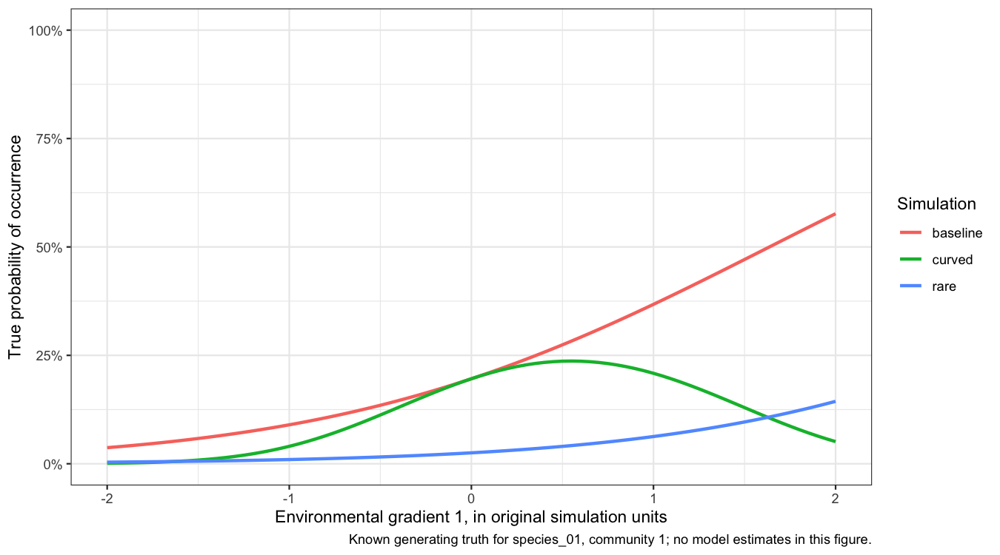<!-- -->

The curved example has a preferred environmental value. Giving a straight-response model more sites cannot make it express that shape. We therefore fit the curved datasets twice: once with the two ordinary predictors, and once with an additional squared-gradient predictor. Each package receives the same set of predictors in each comparison. This separates **too little information** from **an unsuitable response shape**.

``` r
# Construct the curve before learning centring and scaling from training sites.
training_predictors <- as_tibble(extension$curve_training_raw) |>
  mutate(environment_1_squared = environment_1^2)

# Repeat the same operation at test sites.
test_predictors <- as_tibble(extension$curve_test_raw) |>
  mutate(environment_1_squared = environment_1^2)

# Learn each column's centre and spread from the training sites only,
# then apply that same transformation to both sets of sites.
training_centre <- colMeans(training_predictors)
training_spread <- apply(training_predictors, 2, sd)
training_scaled <- scale(training_predictors, center = training_centre, scale = training_spread)
test_scaled <- scale(test_predictors, center = training_centre, scale = training_spread)

head(training_predictors, 3)
```

    #> # A tibble: 3 × 3
    #>   environment_1 environment_2 environment_1_squared
    #>           <dbl>         <dbl>                 <dbl>
    #> 1         0.258        -0.688                0.0668
    #> 2         0.600        -0.955                0.360 
    #> 3        -0.343         0.203                0.118

The study formed the squared column from the raw values before any standardisation (`extension/PLAN.md`, line 17), as the simulator built its curve from raw values. The test sites then reuse the training sites’ centre and spread, so a value means the same thing at both. The scaling lines reproduce what the study passed to every package, the standardised training environment that section 2’s occJSDM call receives as `input$x`. To fit such a curve with occJSDM, add `environment_1_squared` to `info` as a further column and name it in `occCovariates` with the other two. `runOccJSDM()` standardises the occupancy covariates itself, so you can pass the raw squared column.

A pair of strongly correlated environmental measurements creates a different difficulty. If warm sites are nearly always dry, their observations provide little information about whether warmth or dryness explains a species’ response. Predictions within that same setting can look reasonable even when the individual environmental effects remain uncertain.

``` r
extension$correlated_environment |>
  as_tibble() |>
  ggplot(aes(environment_1, environment_2)) +
  geom_point(alpha = 0.45) +
  labs(
    x = "Environmental gradient 1",
    y = "Environmental gradient 2",
    caption = "Actual simulated training conditions; generating correlation = 0.85."
  ) +
  theme_bw()
```

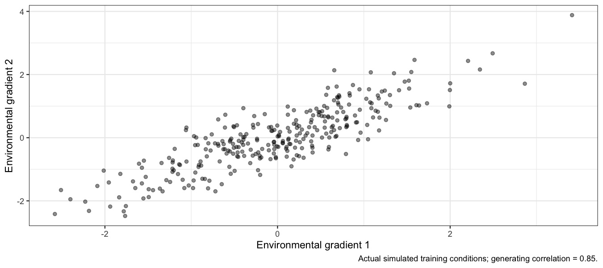<!-- -->

### Compare errors one community at a time

The vertical axis below is the average absolute difference between estimated and true new-site probabilities, in percentage points. Zero means perfect recovery of the probability. Each connected pair represents the **same simulated community**, fitted at the two sample sizes. A downward line means that adding sites reduced error in that community. Differences among the ten lines show how much the answer depends on the dataset.

A fit whose diagnostics remain unresolved is marked separately. An unsuccessful fit has no error estimate and stays in the status table. Neither kind of difficulty should disappear from a package comparison.

``` r
if (nrow(extension$overall) > 0) {
  ecological_errors <- as_tibble(extension$overall) |>
    filter(scenario != "traits") |>
    mutate(
      sites = factor(n_sites, levels = c(100, 300)),
      diagnostic_status = if_else(diagnostic_pass, "Passed checks", "Unresolved"),
      comparison = paste(scenario, response, sep = ": ")
    )

  ggplot(ecological_errors, aes(sites, mae_pp, group = replicate)) +
    geom_line(alpha = 0.4) +
    geom_point(aes(shape = diagnostic_status), size = 2) +
    facet_grid(comparison ~ package) +
    labs(
      x = "Training sites",
      y = "Average absolute error (percentage points)",
      shape = "Fit diagnostics",
      caption = "Each line is one independent community. The table above records missing fits; incomplete runs are not a benchmark."
    ) +
    theme_bw()
}
```

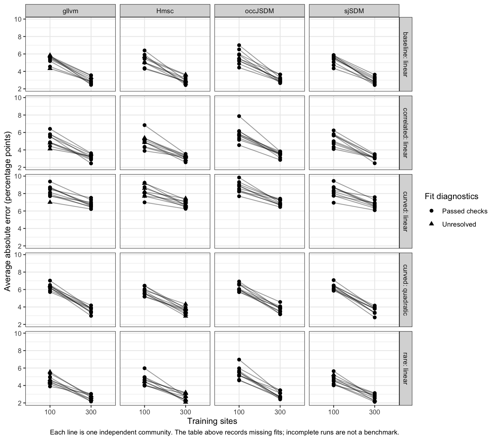<!-- -->

``` r
if (nrow(extension$overall) > 0) {
  paired_errors <- as_tibble(extension$overall) |>
    filter(scenario != "traits") |>
    select(package, scenario, response, replicate, n_sites, mae_pp, diagnostic_pass) |>
    tidyr::pivot_wider(
      names_from = n_sites,
      values_from = c(mae_pp, diagnostic_pass),
      names_expand = TRUE
    )

  if (all(c("mae_pp_100", "mae_pp_300") %in% names(paired_errors))) {
    paired_summary <- paired_errors |>
      filter(!is.na(mae_pp_100), !is.na(mae_pp_300)) |>
      group_by(package, scenario, response) |>
      summarise(
        paired_communities = n(),
        pairs_with_unresolved_diagnostics = sum(!diagnostic_pass_100 | !diagnostic_pass_300),
        error_100_sites = mean(mae_pp_100),
        error_300_sites = mean(mae_pp_300),
        change_in_error = mean(mae_pp_300 - mae_pp_100),
        .groups = "drop"
      )

    knitr::kable(paired_summary, digits = 2, col.names = c(
      "Package", "Scenario", "Response", "Paired communities", "Pairs with unresolved diagnostics",
      "Error, 100 sites", "Error, 300 sites", "Change in error"
    ))
  }
}
```

| Package | Scenario | Response | Paired communities | Pairs with unresolved diagnostics | Error, 100 sites | Error, 300 sites | Change in error |
|:---|:---|:---|---:|---:|---:|---:|---:|
| Hmsc | baseline | linear | 10 | 6 | 5.27 | 3.00 | -2.28 |
| Hmsc | correlated | linear | 10 | 7 | 4.98 | 3.17 | -1.81 |
| Hmsc | curved | linear | 10 | 8 | 8.26 | 6.82 | -1.43 |
| Hmsc | curved | quadratic | 10 | 8 | 5.76 | 3.62 | -2.14 |
| Hmsc | rare | linear | 10 | 9 | 4.61 | 2.68 | -1.93 |
| gllvm | baseline | linear | 10 | 4 | 5.35 | 2.98 | -2.37 |
| gllvm | correlated | linear | 10 | 3 | 5.21 | 3.16 | -2.05 |
| gllvm | curved | linear | 10 | 1 | 8.24 | 6.78 | -1.46 |
| gllvm | curved | quadratic | 10 | 1 | 6.29 | 3.66 | -2.63 |
| gllvm | rare | linear | 9 | 6 | 4.66 | 2.62 | -2.04 |
| occJSDM | baseline | linear | 10 | 0 | 5.60 | 3.10 | -2.50 |
| occJSDM | correlated | linear | 10 | 0 | 5.81 | 3.49 | -2.32 |
| occJSDM | curved | linear | 10 | 0 | 8.70 | 6.95 | -1.75 |
| occJSDM | curved | quadratic | 10 | 0 | 6.21 | 3.74 | -2.47 |
| occJSDM | rare | linear | 10 | 0 | 5.44 | 2.88 | -2.56 |
| sjSDM | baseline | linear | 10 | 0 | 5.37 | 2.94 | -2.43 |
| sjSDM | correlated | linear | 10 | 0 | 5.21 | 3.13 | -2.08 |
| sjSDM | curved | linear | 10 | 0 | 8.26 | 6.76 | -1.50 |
| sjSDM | curved | quadratic | 10 | 0 | 6.30 | 3.62 | -2.68 |
| sjSDM | rare | linear | 10 | 2 | 4.68 | 2.65 | -2.03 |

A negative change means lower error with 300 sites. These averages use only communities with estimates at both site counts, including any marked unresolved fits. Read the number of paired communities and the diagnostic counts alongside every average. An omitted failed fit is not evidence that its prediction error was zero.

More sites reduced the error in every scenario and for every package. In the figure, the error at 300 sites is lower than at 100 in 199 of the 199 paired communities. Every package and scenario has 10 pairs except gllvm with rare species, which has 9 because one of its fits failed. The average reduction runs from 1.4 to 2.7 percentage points. It is smallest for the straight fits to curved truth, which also keep the largest error at 300 sites, 6.8 to 7.0 points against 2.6 to 3.7 elsewhere. The next figure shows why.

``` r
if (nrow(extension$fitted_curves) > 0) {
  extension$fitted_curves |>
    as_tibble() |>
    ggplot(aes(environment)) +
    geom_line(aes(y = truth), colour = "black", linetype = "dashed", linewidth = 0.8) +
    geom_line(aes(y = estimate, colour = response), linewidth = 0.8) +
    facet_grid(n_sites ~ package) +
    scale_y_continuous(labels = scales::percent, limits = c(0, 1)) +
    labs(
      x = "Environmental gradient 1",
      y = "Occurrence probability",
      colour = "Fitted response",
      caption = "Curved scenario, species_01, community 1. Dashed black: truth. Coloured: fitted marginal probabilities. Rows: training sites."
    ) +
    theme_bw()
}
```

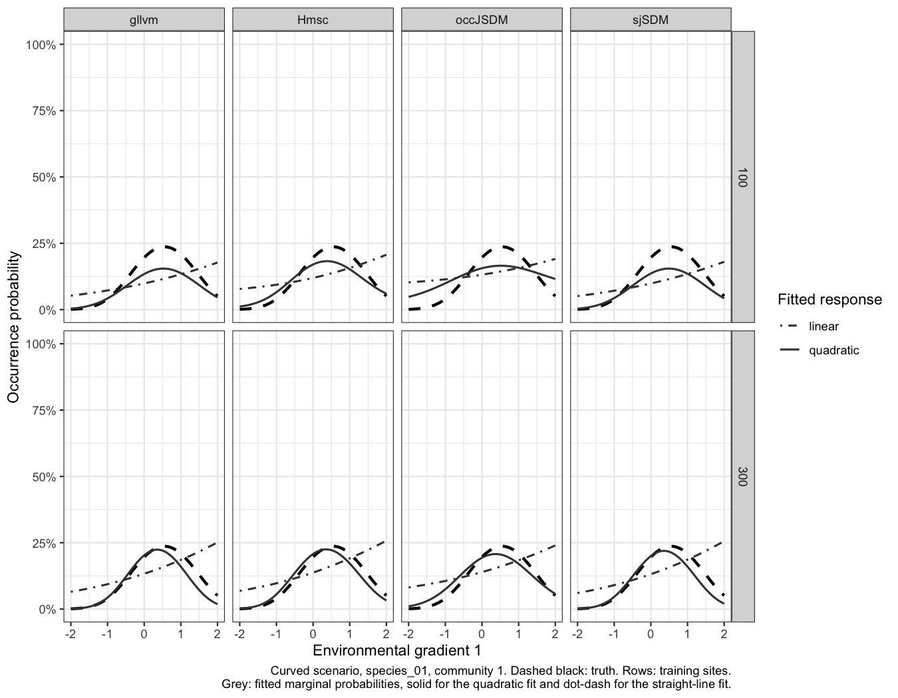<!-- -->

This figure follows one species from the curved scenario, species_01 in community 1, fitted both ways at both site counts. Its true curve peaks in the middle of gradient 1 and falls on both sides. The straight fits cannot bend to follow it, whatever the number of sites. The fits with the squared term follow the curve. The chunk below measures, for each fitted curve, the largest gap from the truth and where along gradient 1 it occurs. It also measures the average gap at the gradient 1 values of community 1’s 300 test sites, which is where the predictions are scored. Base R’s `approx()` reads each curve at those values by straight-line interpolation between the plotted points; the few test sites beyond the plotted range are set to its edge.

``` r
test_gradient <- pmin(pmax(extension$curve_test_raw$environment_1, -2), 2)

curve_gaps <- as_tibble(extension$fitted_curves) |>
  group_by(response, n_sites, package) |>
  summarise(
    largest_gap = 100 * max(abs(estimate - truth)),
    largest_gap_at = environment[which.max(abs(estimate - truth))],
    estimate_at_high_end = 100 * estimate[environment == max(environment)],
    truth_at_high_end = 100 * truth[environment == max(environment)],
    test_site_gap = 100 * mean(abs(approx(environment, estimate - truth, xout = test_gradient)$y)),
    .groups = "drop"
  )

# For the straight fits: the share of test sites where the 300-site curve is closer
# to the truth, and where the sites that got worse lie (below 0, or past the true peak).
# reframe() returns one row per test site for each package and site count;
# first() takes the first value in a group, and peak is the same on every row.
site_gaps <- as_tibble(extension$fitted_curves) |>
  filter(response == "linear") |>
  group_by(package, n_sites) |>
  reframe(
    site = seq_along(test_gradient), gradient = test_gradient,
    peak = environment[which.max(truth)],
    gap = abs(approx(environment, estimate - truth, xout = test_gradient)$y)
  ) |>
  pivot_wider(names_from = n_sites, values_from = gap, names_prefix = "gap_")

closer_at_300 <- site_gaps |>
  group_by(package) |>
  summarise(
    peak = first(peak),
    share = mean(gap_300 < gap_100),
    worse_below_0 = mean(gradient[gap_300 > gap_100] < 0),
    worse_past_peak = mean(gradient[gap_300 > gap_100] > peak)
  )

curve_gaps |>
  group_by(response, n_sites) |>
  summarise(largest_low = min(largest_gap), largest_high = max(largest_gap),
            test_low = min(test_site_gap), test_high = max(test_site_gap), .groups = "drop") |>
  knitr::kable(digits = 1, col.names = c(
    "Fitted response", "Training sites", "Largest gap, best package", "Largest gap, worst package",
    "Average gap at test sites, best package", "Average gap at test sites, worst package"
  ))
```

| Fitted response | Training sites | Largest gap, best package | Largest gap, worst package | Average gap at test sites, best package | Average gap at test sites, worst package |
|:---|---:|---:|---:|---:|---:|
| linear | 100 | 12.6 | 15.6 | 6.5 | 7.1 |
| linear | 300 | 18.9 | 20.7 | 5.7 | 5.9 |
| quadratic | 100 | 6.0 | 8.3 | 3.0 | 4.6 |
| quadratic | 300 | 3.9 | 5.9 | 1.6 | 2.3 |

All gaps are in percentage points. The plotted curve holds gradient 2 at zero, but the test sites vary in both gradients. The test-site average is therefore a guide to where the predictions lie, not the scored error itself.

The straight fits’ largest gap grew with more sites, from 13 to 16 points at 100 sites to 19 to 21 at 300. For every package it lies at gradient 1 = 2, the high end of the figure. Most sites lie on the rising side of the true curve: 68% of community 1’s first 100 training sites are below its peak. A straight line fitted to them must keep rising past the peak, and with 300 sites it is steeper. At the high end it reaches 24 to 26% with 300 sites, against 18 to 21% with 100, where the truth has fallen to 5%. Few sites lie out there: only 6% of the 300 test sites have gradient 1 above 1.5.

Where the test sites do lie, the 300-site straight fits are closer to the truth. Their average gap there falls from 6.5 to 7.1 points to 5.7 to 5.9. That reconciles the figure with the paired table: the scored error averages over every test site. The 300-site straight line is closer to the truth at 65% to 89% of the test sites, depending on the package. The sites where it gets worse lie at the two ends of the gradient. For occJSDM, 88% of them lie past the peak, where 28% of all test sites are. For the other three packages, 63% to 73% of them lie below gradient 1 = 0, on the rising side. More data sharpens the straight line but cannot supply the missing curve, so the gain stays small. The squared-term fits come within 4 to 6 points of the truth all along the gradient at 300 sites. This is one species in one community, so read it as an illustration of the paired table, not as further evidence.

Do not treat the thousands of species-by-site predictions as thousands of independent experimental repetitions. The replication unit here is a simulated community. For a formal sample-size summary we need matched completed fits at both site counts and must report which communities, if any, could not be compared.

## 2. Do traits explain species responses, and do they improve prediction?

A species’ environmental effect describes how its distribution changes along a gradient. A **trait effect** asks why those environmental responses differ among species. For example, do drought-tolerant species respond less negatively to increasingly dry conditions?

This experiment contains two measured traits. The first truly changes the environmental responses. The second has **no generating effect**. Individual species also differ for reasons that these measured traits do not explain. Knowing the simulation truth lets us distinguish missing a real effect from finding an apparent effect for an irrelevant trait.

There are two separate ways to collect more information:

- **More sites, 100 versus 300:** better observations of each species’ environmental response.
- **More species, 10 versus 30:** more species with which to estimate the relationship between traits and environmental responses.

The larger community contains the original ten species. Both site counts are used at both species counts. For every dataset, we fit models **with and without the measured traits**. In gllvm we retain species random slopes in both arms: each species gets its own response to each gradient, drawn from a distribution shared by all species. Keeping them in both arms means that supplying traits does not also switch on an extra allowance for unexplained species differences.

occJSDM, gllvm and Hmsc have suitable trait-model interfaces. The inspected sjSDM fork does not have an equivalent trait-fitting interface, so its absence from this part is not a failed trait-recovery result.

This is the occJSDM call the experiment used for a fit with traits, taken from the study’s fitting script (`dev/simstudy/jsdm-package-comparison/extension/fit-job.R`, lines 31 to 33). Its inputs live in the fitting archive, not in this lesson’s bundle, so the chunk is not run. The trait-free arm makes the same call with `traits` left out of the list.

``` r
# input$x: the standardised training environment; input$y: the 0/1 matrix;
# input$traits: one row per species with drought_tolerance and irrelevant_trait.
fit_with_traits <- occJSDM::runOccJSDM(
  list(info = input$x, OTU = input$y, traits = input$traits),
  occCovariates = names(input$x),
  listParams = list(n_factors = 2, n_lattrait = 0),
  MCMCparams = list(nchain = 4, nburn = 2000, niter = 4000, nthin = 1)
)
```

As in [Lesson 5](occJSDM-lesson-5.md), `info` has one row per site, so `runOccJSDM()` fits a JSDM to the observed presence/absence with no detection stages. `traits` has one row per species, as in the [quickstart](occJSDM.md). `n_lattrait = 0` turns off occJSDM’s optional latent species-trait factors in both arms, so only the measured traits differ between them (`extension/PLAN.md`, line 11). The MCMC settings are the first attempt’s; a fit that failed its checks was rerun with `nburn = 8000` and `niter = 16000`.

``` r
if (nrow(extension$overall) > 0) {
  trait_errors <- as_tibble(extension$overall) |>
    filter(scenario == "traits") |>
    mutate(
      trait_information = if_else(use_traits, "Traits supplied", "Traits omitted"),
      design = paste(n_sites, "sites x", n_species, "species")
    )

  if (nrow(trait_errors) > 0) {
    ggplot(trait_errors, aes(trait_information, mae_pp, group = replicate)) +
      geom_line(alpha = 0.4) +
      geom_point(aes(shape = diagnostic_pass), size = 2) +
      facet_grid(design ~ package) +
      labs(
        x = NULL,
        y = "Average absolute error (percentage points)",
        shape = "Passed fit checks",
        caption = "Paired fits use identical observations. Lower error means probabilities are closer to their simulated truth."
      ) +
      theme_bw() +
      theme(axis.text.x = element_text(angle = 25, hjust = 1))
  }
}
```

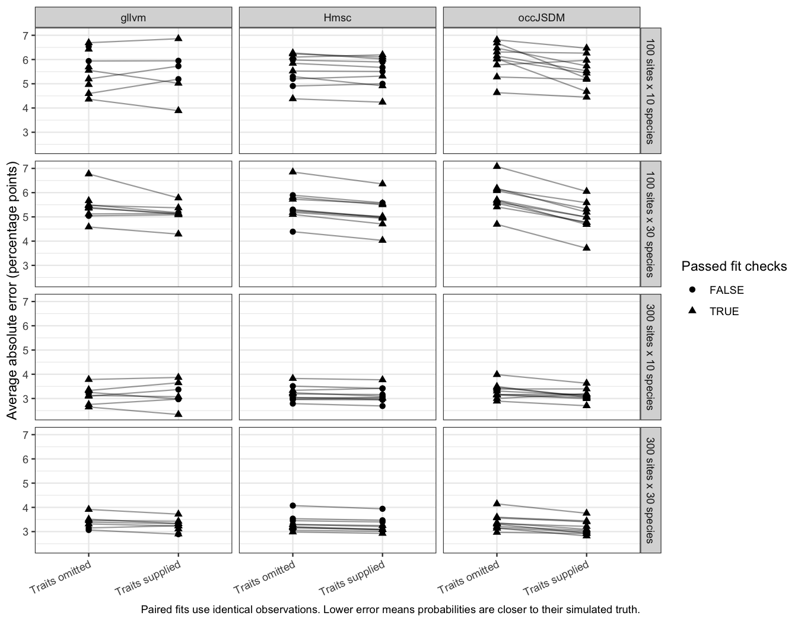<!-- -->

Did supplying traits lower the error? The chunk below pairs each fit with traits with the trait-free fit of the same data, keeps the pairs where both fits were scored, and averages the change.

``` r
trait_change <- as_tibble(extension$overall) |>
  filter(scenario == "traits") |>
  select(package, n_sites, n_species, replicate, use_traits, mae_pp) |>
  pivot_wider(names_from = use_traits, values_from = mae_pp, names_prefix = "traits_") |>
  filter(!is.na(traits_TRUE), !is.na(traits_FALSE)) |>
  group_by(package, n_species) |>
  summarise(
    pairs = n(),
    lower_with_traits = sum(traits_TRUE < traits_FALSE),
    change_in_error = mean(traits_TRUE - traits_FALSE),
    .groups = "drop"
  )

knitr::kable(trait_change, digits = 2, col.names = c(
  "Package", "Species", "Pairs (both site counts)", "Pairs with lower error with traits",
  "Change in error with traits (points)"
))
```

| Package | Species | Pairs (both site counts) | Pairs with lower error with traits | Change in error with traits (points) |
|:---|---:|---:|---:|---:|
| Hmsc | 10 | 20 | 14 | -0.06 |
| Hmsc | 30 | 20 | 20 | -0.20 |
| gllvm | 10 | 13 | 5 | 0.04 |
| gllvm | 30 | 15 | 12 | -0.19 |
| occJSDM | 10 | 20 | 16 | -0.34 |
| occJSDM | 30 | 20 | 20 | -0.51 |

Supplying traits lowered the average error a little, by at most 0.5 percentage points, and by more with 30 species than with 10 for every package. With 30 species, the error fell in 52 of 55 pairs. With 10 species the gain was smaller, and for gllvm the average changed by +0.04 points. Compare that with section 1, where tripling the sites cut the average error by 1.4 to 2.7 points. Traits help most when there are many species from which to learn the trait relationship, and even then they are no substitute for more sites.

Improved prediction and clear evidence of a trait relationship are different outcomes. A model can predict reasonably while remaining uncertain about why species differ. Conversely, a detectable trait relationship need not greatly improve predictions when each species already has plenty of observations.

The next figure subtracts the known true trait effect from each estimate. The dashed black line therefore means **accurate estimation**, not necessarily **no trait effect**. The dotted red line means an estimated effect of zero. For the irrelevant trait, those references coincide because its true effect is zero. An interval crossing the black line includes the truth; an interval crossing the red line includes no effect. These are different questions for a trait whose generating effect is nonzero.

``` r
if (nrow(extension$traits) > 0) {
  matched_trait_effects <- as_tibble(extension$traits) |>
    filter(link == "logit") |>
    mutate(
      coefficient_error = estimate - truth,
      lower_error = lower - truth,
      upper_error = upper - truth,
      design = paste(n_sites, "sites x", n_species, "species"),
      relationship = paste(trait, environment, sep = " / ")
    )

  no_effect_references <- matched_trait_effects |>
    distinct(relationship, design, truth) |>
    mutate(no_effect_on_error_scale = -truth)

  ggplot(matched_trait_effects, aes(factor(replicate), coefficient_error, colour = package)) +
    geom_hline(yintercept = 0, linetype = "dashed") +
    geom_hline(
      data = no_effect_references,
      aes(yintercept = no_effect_on_error_scale),
      colour = "#D55E00", linetype = "dotted"
    ) +
    geom_pointrange(
      aes(ymin = lower_error, ymax = upper_error),
      position = position_dodge(width = 0.5)
    ) +
    facet_grid(relationship ~ design, scales = "free_y") +
    labs(
      x = "Independent simulated community",
      y = "Estimated trait effect minus its true value",
      colour = "Package",
      caption = "Dashed black: estimate equals truth. Dotted red: estimated effect is zero. Coefficient differences are not probability percentage points."
    ) +
    theme_bw()
}
```

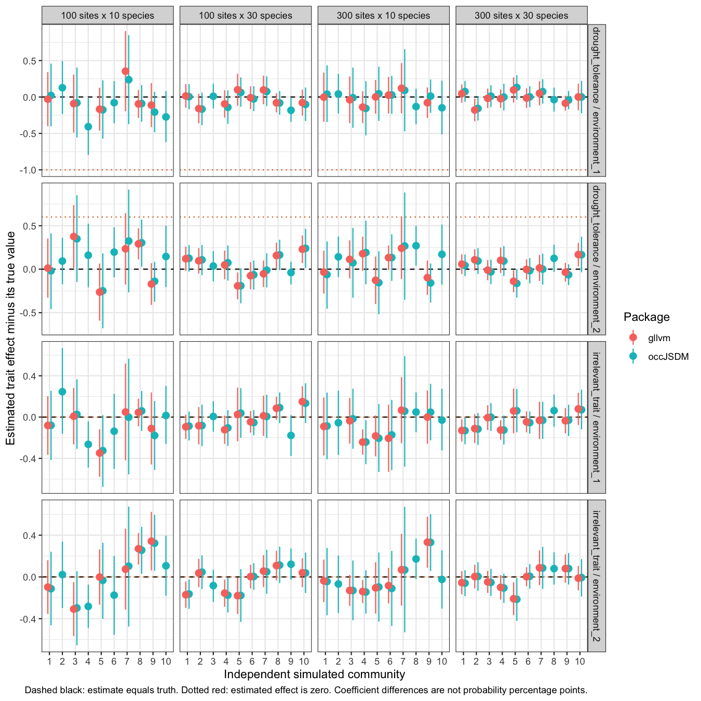<!-- -->

These coefficient comparisons undo both environmental and trait standardisation. Hmsc’s probit coefficients have different units from the simulation’s logit coefficients, so they are not overlaid on the same numerical truth here. Hmsc remains in the probability comparison above. There, estimates and truth share the same meaning. gllvm’s saved records retain its standard-error warnings; passing the objective and gradient checks does not establish that every uncertainty estimate is reliable. The appendix’s table “Trait relationships in the same format” gives each package’s bias, coverage and interval width for these relationships, for 100 sites and ten species. It marks Hmsc’s coefficients as `Different link`.

How often did the intervals in the figure contain the truth, and how often did they exclude zero? The chunk below counts both for each package, trait and design.

``` r
trait_intervals <- matched_trait_effects |>
  mutate(contains_truth = lower <= truth & truth <= upper,
         excludes_zero = lower > 0 | upper < 0) |>
  group_by(package, trait, design) |>
  summarise(intervals = n(), contain_truth = sum(contains_truth),
            exclude_zero = sum(excludes_zero), .groups = "drop")

# The same counts over all four designs, quoted in the text below.
trait_totals <- trait_intervals |>
  group_by(package, trait) |>
  summarise(across(c(intervals, contain_truth, exclude_zero), sum), .groups = "drop")

knitr::kable(trait_intervals, col.names = c(
  "Package", "Trait", "Design", "Intervals", "Contain the truth", "Exclude zero"
))
```

| Package | Trait | Design | Intervals | Contain the truth | Exclude zero |
|:---|:---|:---|---:|---:|---:|
| gllvm | drought_tolerance | 100 sites x 10 species | 12 | 10 | 10 |
| gllvm | drought_tolerance | 100 sites x 30 species | 16 | 13 | 16 |
| gllvm | drought_tolerance | 300 sites x 10 species | 14 | 14 | 14 |
| gllvm | drought_tolerance | 300 sites x 30 species | 18 | 15 | 18 |
| gllvm | irrelevant_trait | 100 sites x 10 species | 12 | 8 | 4 |
| gllvm | irrelevant_trait | 100 sites x 30 species | 16 | 12 | 4 |
| gllvm | irrelevant_trait | 300 sites x 10 species | 14 | 11 | 3 |
| gllvm | irrelevant_trait | 300 sites x 30 species | 18 | 15 | 3 |
| occJSDM | drought_tolerance | 100 sites x 10 species | 20 | 18 | 18 |
| occJSDM | drought_tolerance | 100 sites x 30 species | 20 | 18 | 20 |
| occJSDM | drought_tolerance | 300 sites x 10 species | 20 | 19 | 19 |
| occJSDM | drought_tolerance | 300 sites x 30 species | 20 | 19 | 20 |
| occJSDM | irrelevant_trait | 100 sites x 10 species | 20 | 16 | 4 |
| occJSDM | irrelevant_trait | 100 sites x 30 species | 20 | 18 | 2 |
| occJSDM | irrelevant_trait | 300 sites x 10 species | 20 | 18 | 2 |
| occJSDM | irrelevant_trait | 300 sites x 30 species | 20 | 18 | 2 |

Each interval is one community’s estimate of how a trait changes the response to one gradient, so each design has two per community. For the drought trait, which truly changes the responses, 74 of 80 occJSDM intervals and 52 of 60 gllvm intervals contain the true effect. The same intervals exclude zero in 77 occJSDM and 58 gllvm cases, so the real relationship was usually detected. For the irrelevant trait, whose true effect is zero, an interval that excludes zero is a false detection. Here 10 of 80 occJSDM intervals and 14 of 60 gllvm intervals did so, where a 95% interval should do so about one time in twenty. Both packages made the most false detections with 100 sites. gllvm has fewer intervals because some of its trait fits failed. On your own data, treat a trait effect whose interval only just excludes zero with caution, especially with few sites and species.

Ten independent communities are useful for an exploratory teaching comparison. They do not provide precise estimates of how often an interval misses a true effect or incorrectly excludes zero for an irrelevant trait. We retain the individual results and the diagnostic failures instead of turning a small experiment into a claim that one package is generally best.

## 3. Across communities, are estimates biased?

The four packages give similar occurrence predictions in the baseline scenario. Their uncertainty intervals are less consistent. Getting the estimate close and getting its uncertainty right are separate achievements.

We simulated communities whose true probabilities and environmental effects are known, gave the packages the same observations, and checked their answers. The study is the one section 1 describes: ten independent communities in each scenario, each fitted with 100 and with 300 training sites.

**What the comparison says**

- **Predictions:** average bias is small in the baseline for all four packages. More training sites reduce prediction error substantially.
- **Uncertainty:** coverage is the percentage of 95% intervals that contain the truth, and section 4 reads it in detail. In the baseline, probability coverage is close to 95% for occJSDM and Hmsc, from 94.8% to 96.6%. Coefficient coverage for occJSDM, gllvm and sjSDM strays further from 95%, from 82% to 100%.
- **Harder conditions:** rare species, correlated predictors and an unsuitable response shape can change the answer. Diagnostic warnings and the small number of independent communities prevent a confident overall ranking.

### How close are the predictions?

**Bias** is the average signed error: positive means overestimation, negative means underestimation, and zero means neither direction dominates. Errors can cancel. **Root mean squared error (RMSE)** measures their size: it squares each error, averages the squares and takes the square root, so larger errors count for more. Smaller is better. Both are in percentage points here, so an estimate of 45% for a true probability of 40% has an error of +5 points. As in section 1, the target is each species’ probability of occurrence at the 300 test sites, averaged over the unknown hidden conditions, and each community receives equal weight.

Section 1 measured error size with the mean absolute error. This section uses RMSE because it gives larger errors more weight and is the usual measure across simulation studies. The two are on the same scale but are not the same number. RMSE is always at least as large, so do not compare this section’s RMSE with section 1’s errors.

| Package | 100 sites: Bias | 100 sites: RMSE | 300 sites: Bias | 300 sites: RMSE |
|:--------|:----------------|:----------------|:----------------|:----------------|
| occJSDM | +0.28           | 7.37            | +0.28           | 4.10            |
| gllvm   | +0.31           | 7.28            | +0.29           | 3.99            |
| sjSDM   | +0.35           | 7.31            | +0.30           | 3.93            |
| Hmsc    | +0.30           | 7.13            | +0.30           | 4.00            |

Baseline predictions at 300 independent test sites. Each package has ten scored communities at each training size; flagged fits are included.

**Read this as:** all four packages have average baseline bias below one percentage point. Their RMSE is about 7.1 to 7.4 points with 100 training sites and 3.9 to 4.1 with 300. Small differences between packages are much less convincing than the improvement from adding sites.

### Does that hold when ecology gets harder?

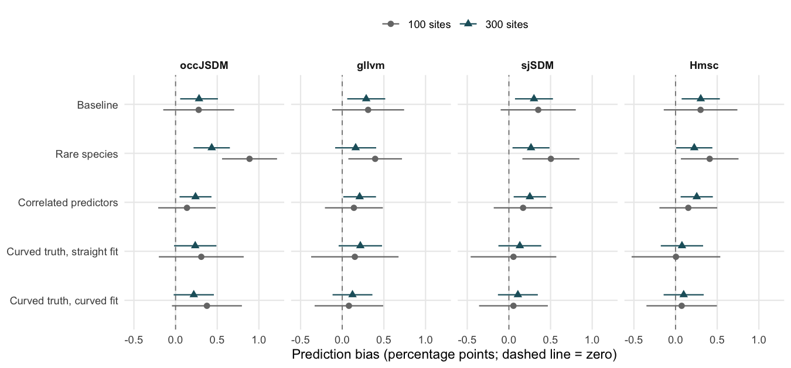

The dots show average bias, and the bars show **one Monte Carlo standard error (MCSE)**. This measures uncertainty from having only ten simulated communities; it is not the uncertainty of an individual species estimate. The same convention is used in the coverage plots below. Species and test sites are not counted as independent simulation repetitions.

The rare-species scenario produces more overestimation, especially for occJSDM with 100 sites. Averaged over all ten species, occJSDM’s bias there is +0.9 points, against +0.3 in the baseline. The three rare species carry most of it: their own average signed error is +3.2 points, on true probabilities of about 5%.

Why occJSDM overestimates rare species is not established. The candidates are the priors, shrinkage and sample size. [Lesson 2](occJSDM-lesson-2.md#why-rare-and-common-species-are-pulled-towards-the-middle) explains how the default prior pulls rare and common species towards the middle, and a rare species gives few presences at 100 sites. The spatial study in [Lesson 7](occJSDM-lesson-7.md) found that the spatial patterns of the rarest species were unrecoverable in every arrangement of sites. The bias recheck in the package’s `TODO.md` (“Required bias recheck and release preparation”) records what has been tested so far. That includes the wider prior on baseline occupancy that Lesson 2 describes, available as the experimental `sigma_b0` option. In that simulation study it reduced the overestimation of low occupancy probabilities clearly in spatial fits but only slightly in non-spatial fits like these. Until the cause is known, treat occJSDM’s estimates for rare species with caution: expect them to be too high, and survey more sites where rare species matter.

Bias alone still misses an important problem: a package can make positive and negative errors that cancel. The full community-level RMSE results are retained in the [appendix](#appendix-evidence-and-reproduction), under Detailed prediction errors.

### How close are the environmental effects?

These coefficients describe a species’ baseline tendency to occur and its response to each measured environment. Their units differ from probability points. The table gives them in original coefficient units: the simulator’s raw units, after undoing the standardisation used for fitting. Hmsc uses a probit link, so its coefficient values cannot be checked against the same logit coefficient truth.

| Target | occJSDM | gllvm | sjSDM | Hmsc |
|:---|:---|:---|:---|:---|
| Species intercept | 0.004 +/- 0.024 | 0.003 +/- 0.026 | 0.083 +/- 0.068 | Different link |
| Environment 1 effect | 0.025 +/- 0.016 | 0.026 +/- 0.024 | 0.030 +/- 0.072 | Different link |
| Environment 2 effect | -0.017 +/- 0.017 | 0.002 +/- 0.021 | -0.033 +/- 0.049 | Different link |

Baseline, 100 training sites: coefficient bias +/- one MCSE, in original coefficient units. The appendix also shows 300 sites, RMSE and interval widths.

Average coefficient bias is also modest in this baseline. That does not establish that every species’ effect is recovered accurately, or that its interval is reliable. The next question checks the intervals directly.

## 4. Do 95% intervals contain the truth?

A 95% interval is useful only if it contains the truth often enough **and** is narrow enough to say something. **Coverage**, as section 3 defined it, is measured across repeated datasets, and the reference is 95%. A value far below that signals too many misses; a value above it can reflect unnecessarily wide intervals. For example, an interval from 0.2 to 0.5 covers a true occurrence probability of 0.4 but misses a truth of 0.7. A narrow interval can be confidently wrong, and a very wide interval can cover the truth while saying little. We therefore read the coverage shown here **beside the interval widths** in the [appendix](#appendix-evidence-and-reproduction) tables.

Bayesian credible intervals and approximate frequentist confidence intervals have different definitions. Repeated simulation lets us measure the coverage of either procedure. Bayesian intervals are not guaranteed to have exactly 95% coverage under the ecological truth distribution used here.

### All four packages together

This table separates **occurrence probabilities** from **environmental coefficients**. To keep the interval calculation inspectable, probability intervals are evaluated at five fixed environmental settings shared by all packages, not at the 300 test sites used for prediction errors above. The settings are both gradients at zero, then each gradient at -1 and +1 while the other remains zero. Coefficients are checked on their original logit scale. The two targets are never averaged together.

| Target | Sites | occJSDM | gllvm | sjSDM | Hmsc |
|:---|---:|:---|:---|:---|:---|
| Occurrence probability | 100 | 95.4 +/- 0.9 | Unavailable | Unavailable | 96.6 +/- 0.9 |
| Species intercept | 100 | 94.0 +/- 3.1 | 98.0 +/- 1.3 | 86.0 +/- 1.6 | Different link |
| Environment 1 effect | 100 | 82.0 +/- 4.9 | 94.0 +/- 2.2 | 82.0 +/- 2.5 | Different link |
| Environment 2 effect | 100 | 92.0 +/- 2.0 | 95.0 +/- 2.2 | 88.0 +/- 2.5 | Different link |
| Occurrence probability | 300 | 94.8 +/- 1.3 | Unavailable | Unavailable | 95.6 +/- 1.2 |
| Species intercept | 300 | 93.0 +/- 2.6 | 91.0 +/- 3.5 | 93.0 +/- 2.1 | Different link |
| Environment 1 effect | 300 | 89.0 +/- 2.8 | 89.0 +/- 2.8 | 92.0 +/- 2.5 | Different link |
| Environment 2 effect | 300 | 100.0 +/- 0.0 | 98.0 +/- 1.3 | 97.0 +/- 1.5 | Different link |

Baseline coverage (%) +/- one MCSE. The reference is 95%; every available result here uses ten communities. Flagged fits remain included.

**How to read the baseline**

- **occJSDM:** probability coverage is close to 95%, but the first environmental effect is covered less often: 82.0% at 100 sites and 89.0% at 300. At 100 sites, 18% of these intervals miss the true effect, where a 95% interval should miss one in twenty, so they are too narrow. Why is not established. The candidates are those for the rare-species bias in section 3: the priors, shrinkage and sample size. [Lesson 2](occJSDM-lesson-2.md#why-rare-and-common-species-are-pulled-towards-the-middle) explains how the prior pulls each species’ baseline occupancy towards the middle; whether a similar pull narrows the intervals for environmental effects has not been tested. Section 3 points to the related evidence.
- **gllvm:** at 100 sites, coverage for the first environmental effect is 94.0%. Its uncertainty calculations have numerical warnings, discussed below.
- **sjSDM:** coverage for that effect rises from 82.0% to 92.0%. Its native intervals, the intervals each package’s own functions return, account for only part of the fitted model’s uncertainty.
- **Hmsc:** probability coverage is close to 95%, but convergence warnings limit how much confidence to place in that result.

**The missing entries have different meanings.** `Unavailable` means we have not calculated probability intervals for gllvm or sjSDM. `Different link` means Hmsc’s coefficients lack a matching numerical truth in this logit-generated experiment. Neither means zero coverage or a failed comparison of predictions: all four packages appear in the prediction checks.

### Probability coverage across the scenarios

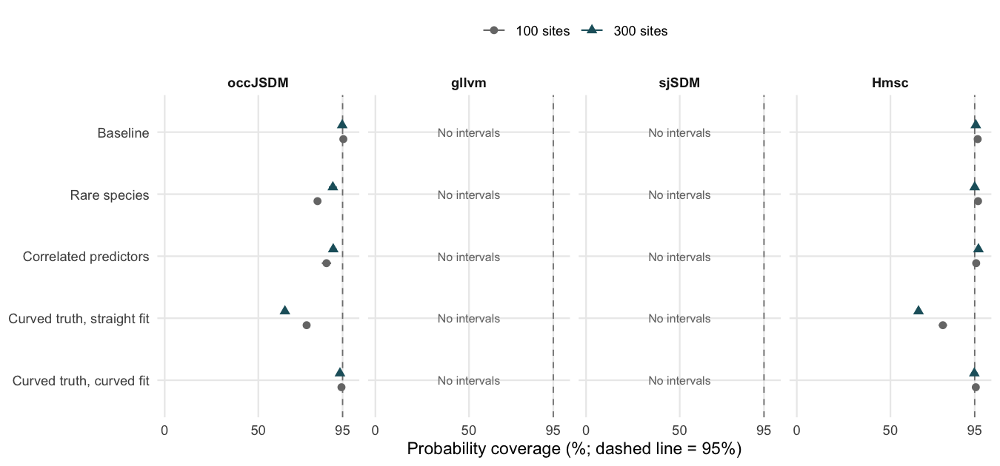

**occJSDM’s baseline is not the whole story.** At 100 sites its probability coverage falls to 81.6% with rare species and 86.4% with correlated predictors. Hmsc is closer to 95% in these scenarios, but unresolved MCMC diagnostics prevent treating that as evidence of a clear winner. Lower coverage in harder scenarios is a pattern to investigate with more communities and diagnostic work; it does not by itself identify a software defect.

**The response shape matters for both packages.** With curved truth and 300 sites, a straight-response fit gives coverage of 64.2% for occJSDM and 65.0% for Hmsc. Including the quadratic term raises those to 93.6% and 94.8%. More data cannot supply a curve that the fitted model leaves out.

On real data you do not know the true curve, but you can test for one. Fit the model with and without a squared term, as in section 1, and hold out some sites. Score both fits’ predictions there against what was recorded, as [Lesson 5](occJSDM-lesson-5.md) scores the four packages in its section on held-out outcomes. If the squared term predicts the held-out sites clearly better, the straight fit is missing a curve, and its intervals should not be trusted.

### Environmental-effect coverage across the scenarios

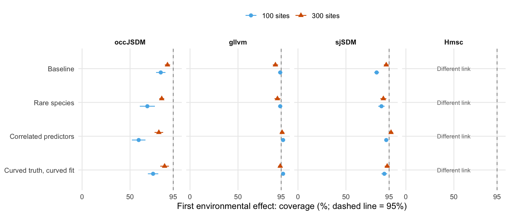

This figure follows the **first environmental effect**, not all coefficients pooled. The curved scenario is included only when the fitted model contains the quadratic term. Every point is an average over the available communities, with one MCSE shown. The appendix tables retain the other effects and the interval widths. In particular, a flagged gllvm fit in the rare-species scenario produces exceptionally wide intervals; high coverage there is not evidence of useful precision.

### What limits the comparison?

**Some fits or uncertainty calculations still have warnings.** Of the 79 saved gllvm fits used for the native interval extension, 20 have a covariance-matrix warning. Hmsc has unresolved MCMC diagnostics in 9 of its 10 rare-species fits at 300 sites. The main results retain flagged fits; the appendix also shows the sensitivity to keeping only fits that pass the relevant checks.

**The intervals use different methods.** occJSDM and Hmsc use posterior draws. gllvm uses its native variational covariance calculation. sjSDM’s native coefficient intervals hold species associations and other species’ coefficients fixed. They therefore omit uncertainty in those fitted quantities. This is a limitation of the uncertainty calculation tested here, not a demonstrated explanation for every coverage shortfall.

**Ten independent communities give a preliminary comparison.** Many species or test sites do not substitute for more communities. These data support the patterns above; they do not establish an overall package ranking. The trait comparison is also narrower. Only occJSDM and gllvm have trait-effect intervals on the simulation’s logit scale, where they can be checked against the truth. Hmsc uses a different coefficient scale, and sjSDM was not fitted in that experiment.

## What this lesson establishes

Across ten independent communities, more training sites reduce prediction error. Average bias is small in the baseline for all four packages, and interval coverage differs more among packages than point accuracy does. Rare species, correlated predictors and an unsuitable response shape change the answer, and the diagnostic warnings and the small number of communities prevent a confident overall ranking.

For an occJSDM user the take-home is this. Its point predictions held up across communities, with errors close to the other packages’, and improved with more sites. Its interval coverage did not always hold up. In the baseline at 100 sites, its intervals for the first environmental effect were too narrow, and in the harder scenarios its probability intervals covered less often. More sites narrowed the shortfall without removing it: across the ecological scenarios, coverage of the first environmental effect at 300 sites was 80% to 89%. Read occJSDM’s intervals for environmental effects from a survey of about 100 sites as too narrow, and add sites. More sites help, but they may not bring coverage up to 95%. Expect estimates for rare species to be too high, and check whether a response needs a curve before trusting any interval.

A larger coverage study should add independent communities, assess marginal-probability intervals for gllvm and sjSDM, and include a probit-generating arm under a declared fitting and diagnostic protocol.

The appendix below holds six things. They are the acceptance rules for each fit, the detailed prediction errors, the interval widths and coverage by community, the diagnostic sensitivity, the trait relationships, and how to filter the saved results yourself.

Continue to [Lesson 7](occJSDM-lesson-7.md), on spatial landscapes and survey design, or return to [Lesson 5](occJSDM-lesson-5.md) or the [Quickstart and lesson guide](occJSDM.md).

## Appendix: evidence and reproduction

This appendix is for readers who want the full tables, interval widths and methods behind sections 3 and 4; the lesson’s conclusions do not depend on reading it.

### Acceptance rules for each fit

These are the rules behind the passed, flagged and failed counts in section 1, declared before any fit was scored (`dev/simstudy/jsdm-package-comparison/extension/PLAN.md`, lines 27 and 29). The integration and finite-gradient checks are in the same directory’s `math.R`, lines 88 and 89, and `fit-job.R`, line 78.

- **occJSDM and Hmsc:** every monitored quantity must have Rhat at most 1.01 and bulk and tail ESS at least 400 across the four chains. The monitored quantities are the identifiable coefficients, the residual covariances, the probabilities on a fixed grid of training environments and, in trait models, the trait effects. The numerical integration used for those probabilities must also be accurate, with an error below 0.0001.
- **gllvm:** three starts, then three more if the best acceptable solution is not reproduced. A start is acceptable only if gllvm reports convergence, every gradient is finite and the largest absolute gradient is below 0.01. A fit fails if no start is acceptable.
- **gllvm and sjSDM agreement:** a second acceptable start must reach an objective within 0.1 units of the best. Its marginal probabilities must also lie within one percentage point of the best start’s on the fixed training grid. gllvm’s objective is its fitted log-likelihood, and sjSDM’s is its checked penalised training log-likelihood. A fit whose best start is acceptable but not reproduced is flagged.

### Detailed prediction errors

``` r
prediction_summary |>
  filter(scenario == "baseline") |>
  select(package, n_sites, communities, flagged, bias_pp, bias_mcse_pp, rmse_pp) |>
  knitr::kable(digits = 2, col.names = c(
    "Package", "Sites", "Communities", "Flagged",
    "Bias (points)", "Bias MCSE (points)", "RMSE (points)"
  ))
```

| Package | Sites | Communities | Flagged | Bias (points) | Bias MCSE (points) | RMSE (points) |
|:---|---:|---:|---:|---:|---:|---:|
| occJSDM | 100 | 10 | 0 | 0.28 | 0.43 | 7.37 |
| occJSDM | 300 | 10 | 0 | 0.28 | 0.23 | 4.10 |
| gllvm | 100 | 10 | 3 | 0.31 | 0.43 | 7.28 |
| gllvm | 300 | 10 | 1 | 0.29 | 0.23 | 3.99 |
| sjSDM | 100 | 10 | 0 | 0.35 | 0.45 | 7.31 |
| sjSDM | 300 | 10 | 0 | 0.30 | 0.23 | 3.93 |
| Hmsc | 100 | 10 | 2 | 0.30 | 0.44 | 7.13 |
| Hmsc | 300 | 10 | 5 | 0.30 | 0.23 | 4.00 |

RMSE is the square root of the average community mean squared error, not the average of community RMSEs.

``` r
prediction_calibration |>
  filter(scenario != "traits") |>
  mutate(
    condition = paste(scenario, response, sep = ": "),
    diagnostic = if_else(diagnostic_pass, "Passed checks", "Unresolved"),
    sites = factor(n_sites)
  ) |>
  select(package, replicate, condition, diagnostic, sites, bias, rmse) |>
  pivot_longer(c(bias, rmse), names_to = "measure", values_to = "error") |>
  mutate(measure = recode(measure, bias = "Signed error", rmse = "RMSE")) |>
  ggplot(aes(package, 100 * error, colour = sites, shape = diagnostic)) +
  geom_hline(yintercept = 0, colour = "grey70") +
  geom_point(position = position_jitterdodge(jitter.width = .15, dodge.width = .6, seed = 25), alpha = .75) +
  facet_grid(condition ~ measure, scales = "free_y") +
  labs(x = NULL, y = "Error (percentage points)", colour = "Training sites", shape = "Diagnostics",
    caption = "Each point is one community. Flagged fits remain visible; failed fits have no score.") +
  theme_bw() + theme(axis.text.x = element_text(angle = 35, hjust = 1))
```

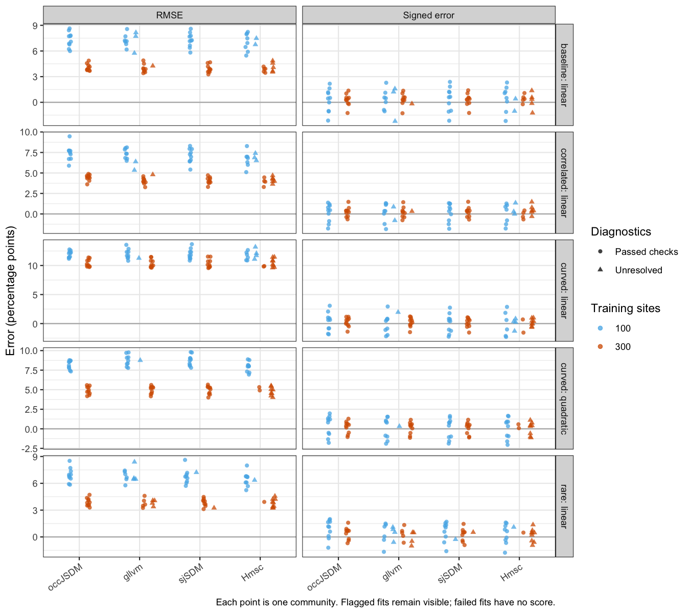<!-- -->

Small signed errors alongside appreciable RMSE mean that errors cancel, not that individual estimates are precise. Compare the distributions of community results, rather than choosing a winner from a small difference between averages. The failure counts in section 1 still apply. Where a package failed on some communities, its average describes only the communities with a scored fit.

### Detailed interval comparisons

#### Which saved results support this calculation?

- **All four packages:** point errors for test-site probabilities and five shared environmental settings.
- **occJSDM and Hmsc:** 95% equal-tailed intervals for marginal occurrence probabilities, calculated from every saved global parameter draw.
- **occJSDM, gllvm and sjSDM:** intervals for environmental coefficients in the ecological scenarios where the fitted response contains the generating terms and the logit coefficient definitions match. occJSDM uses posterior quantiles; gllvm and sjSDM use their native standard errors with a normal approximation.
- **occJSDM and gllvm:** existing intervals for the measured trait effects on their matching logit scale.
- **gllvm and sjSDM probability intervals:** remain unavailable. This extension adds native coefficient intervals; it does not bootstrap occurrence probabilities. Species-specific environmental intervals in gllvm’s hierarchical trait models also remain unavailable; the measured trait-effect intervals above are a different target. Missing intervals are recorded as unavailable, not as zero coverage.

Hmsc fitted a probit model to logit-generated data. Its probabilities can be compared with the true probabilities, but its raw coefficients do not have the same numerical truth as the logit coefficients. For coefficient recovery we restrict the calculation to conditions where the fitted response includes the generating terms for every species. The straight-response fit to the curved scenario is therefore omitted from the coefficient tables as a whole, including the species whose generating responses remain straight. Its probability errors and coverage still include every species. This study measures performance under the existing logit-generating design. A probit-generating arm is still needed for a balanced comparison of that modelling choice.

#### Probability intervals at five shared environments

The five settings are in original simulation units, before training-data standardisation. Every package and community uses the same settings. Hidden site conditions are integrated out **within each posterior draw**, and the interval is then calculated across those marginal-probability draws. These are intervals for the average probability given the measured environment, not intervals for a particular site’s hidden conditions or for a future binary observation.

``` r
knitr::kable(calibration$grid, row.names = TRUE)
```

|                  | environment_1 | environment_2 |
|:-----------------|--------------:|--------------:|
| mean environment |             0 |             0 |
| gradient 1 low   |            -1 |             0 |
| gradient 1 high  |             1 |             0 |
| gradient 2 low   |             0 |            -1 |
| gradient 2 high  |             0 |             1 |

The probability coverage calculation therefore uses a different evaluation set from the 300-site point-error table above. Its mean, lower endpoint and upper endpoint were checked for numerical integration accuracy. It uses every archived draw, including all four chains. The original fitting diagnostics remain attached; post-processing cannot repair an unconverged chain.

#### All four packages together

The tables below use the same four package columns throughout. Each target is kept separate: **probability** means the five fixed environments above, while **intercept** and **slopes** are conditional logit coefficients on the original predictor scale. Probability bias, RMSE and interval width are in percentage points; coefficient bias, RMSE and width are in coefficient units. Coverage is always a percentage. These probability errors therefore use the same five settings as the intervals, unlike the 300-site prediction errors in section 3.

`Unavailable` means an interval was not calculated. `Different link` means Hmsc’s probit coefficient cannot be compared numerically with the logit truth. `Not fitted` is reserved for the sjSDM trait experiment, which was not run. None of these is zero coverage. The community row reports scored communities followed by communities with intervals. MCSE comes from variation between independent communities, not from treating species or environmental settings as independent replicates.

The chunk below uses `tribble()` to write a small table row by row. Each row names a target and term as the bundle stores them, and the label the tables show. `baseline_calibration`, the bundle’s summary for the baseline scenario, is set up in the hidden `calibration-report-setup` chunk just before section 3 of this source.

``` r
appendix_targets <- tribble(
  ~target, ~term, ~Target,
  "Marginal probability", "Five fixed environments", "Probability: five environments",
  "Environmental coefficient", "Intercept", "Coefficient: intercept",
  "Environmental coefficient", "environment_1", "Coefficient: environment 1",
  "Environmental coefficient", "environment_2", "Coefficient: environment 2"
)
```

**Baseline, 100 training sites**

``` r
calibration_comparison_table(
  filter(baseline_calibration, n_sites == 100), appendix_targets, package_order
) |> knitr::kable()
```

| Target | Measure | occJSDM | gllvm | sjSDM | Hmsc |
|:---|:---|:---|:---|:---|:---|
| Probability: five environments | Bias +/- MCSE | 0.33 +/- 0.44 | 0.34 +/- 0.44 | 0.38 +/- 0.46 | 0.37 +/- 0.46 |
| Probability: five environments | RMSE | 5.94 | 6.01 | 6.02 | 5.86 |
| Probability: five environments | Coverage +/- MCSE (%) | 95.4 +/- 0.9 | Unavailable | Unavailable | 96.6 +/- 0.9 |
| Probability: five environments | Mean interval width | 23.03 | Unavailable | Unavailable | 23.38 |
| Probability: five environments | Communities: scored / intervals | 10 / 10 | 10 / 0 | 10 / 0 | 10 / 10 |
| Coefficient: intercept | Bias +/- MCSE | 0.004 +/- 0.024 | 0.003 +/- 0.026 | 0.083 +/- 0.068 | Different link |
| Coefficient: intercept | RMSE | 0.271 | 0.245 | 0.839 | Different link |
| Coefficient: intercept | Coverage +/- MCSE (%) | 94.0 +/- 3.1 | 98.0 +/- 1.3 | 86.0 +/- 1.6 | Different link |
| Coefficient: intercept | Mean interval width | 0.987 | 1.157 | 1.382 | Different link |
| Coefficient: intercept | Communities: scored / intervals | 10 / 10 | 10 / 10 | 10 / 10 | Different link |
| Coefficient: environment 1 | Bias +/- MCSE | 0.025 +/- 0.016 | 0.026 +/- 0.024 | 0.030 +/- 0.072 | Different link |
| Coefficient: environment 1 | RMSE | 0.355 | 0.283 | 0.656 | Different link |
| Coefficient: environment 1 | Coverage +/- MCSE (%) | 82.0 +/- 4.9 | 94.0 +/- 2.2 | 82.0 +/- 2.5 | Different link |
| Coefficient: environment 1 | Mean interval width | 0.970 | 1.210 | 1.460 | Different link |
| Coefficient: environment 1 | Communities: scored / intervals | 10 / 10 | 10 / 10 | 10 / 10 | Different link |
| Coefficient: environment 2 | Bias +/- MCSE | -0.017 +/- 0.017 | 0.002 +/- 0.021 | -0.033 +/- 0.049 | Different link |
| Coefficient: environment 2 | RMSE | 0.271 | 0.287 | 0.646 | Different link |
| Coefficient: environment 2 | Coverage +/- MCSE (%) | 92.0 +/- 2.0 | 95.0 +/- 2.2 | 88.0 +/- 2.5 | Different link |
| Coefficient: environment 2 | Mean interval width | 0.948 | 1.170 | 1.421 | Different link |
| Coefficient: environment 2 | Communities: scored / intervals | 10 / 10 | 10 / 10 | 10 / 10 | Different link |

**Baseline, 300 training sites**

``` r
calibration_comparison_table(
  filter(baseline_calibration, n_sites == 300), appendix_targets, package_order
) |> knitr::kable()
```

| Target | Measure | occJSDM | gllvm | sjSDM | Hmsc |
|:---|:---|:---|:---|:---|:---|
| Probability: five environments | Bias +/- MCSE | 0.29 +/- 0.25 | 0.29 +/- 0.26 | 0.30 +/- 0.26 | 0.32 +/- 0.26 |
| Probability: five environments | RMSE | 3.47 | 3.46 | 3.41 | 3.42 |
| Probability: five environments | Coverage +/- MCSE (%) | 94.8 +/- 1.3 | Unavailable | Unavailable | 95.6 +/- 1.2 |
| Probability: five environments | Mean interval width | 13.78 | Unavailable | Unavailable | 13.74 |
| Probability: five environments | Communities: scored / intervals | 10 / 10 | 10 / 0 | 10 / 0 | 10 / 10 |
| Coefficient: intercept | Bias +/- MCSE | 0.003 +/- 0.016 | 0.003 +/- 0.017 | 0.012 +/- 0.019 | Different link |
| Coefficient: intercept | RMSE | 0.170 | 0.183 | 0.205 | Different link |
| Coefficient: intercept | Coverage +/- MCSE (%) | 93.0 +/- 2.6 | 91.0 +/- 3.5 | 93.0 +/- 2.1 | Different link |
| Coefficient: intercept | Mean interval width | 0.650 | 0.617 | 0.665 | Different link |
| Coefficient: intercept | Communities: scored / intervals | 10 / 10 | 10 / 10 | 10 / 10 | Different link |
| Coefficient: environment 1 | Bias +/- MCSE | 0.008 +/- 0.015 | 0.005 +/- 0.016 | 0.020 +/- 0.025 | Different link |
| Coefficient: environment 1 | RMSE | 0.196 | 0.184 | 0.208 | Different link |
| Coefficient: environment 1 | Coverage +/- MCSE (%) | 89.0 +/- 2.8 | 89.0 +/- 2.8 | 92.0 +/- 2.5 | Different link |
| Coefficient: environment 1 | Mean interval width | 0.655 | 0.652 | 0.707 | Different link |
| Coefficient: environment 1 | Communities: scored / intervals | 10 / 10 | 10 / 10 | 10 / 10 | Different link |
| Coefficient: environment 2 | Bias +/- MCSE | -0.012 +/- 0.011 | -0.010 +/- 0.012 | -0.008 +/- 0.009 | Different link |
| Coefficient: environment 2 | RMSE | 0.143 | 0.140 | 0.173 | Different link |
| Coefficient: environment 2 | Coverage +/- MCSE (%) | 100.0 +/- 0.0 | 98.0 +/- 1.3 | 97.0 +/- 1.5 | Different link |
| Coefficient: environment 2 | Mean interval width | 0.632 | 0.626 | 0.682 | Different link |
| Coefficient: environment 2 | Communities: scored / intervals | 10 / 10 | 10 / 10 | 10 / 10 | Different link |

Within each community, coverage and width are averaged over its eligible species and settings or coefficients; the community summaries then receive equal weight. With ten communities, these results are exploratory and the MCSE itself is uncertain. A wider interval can cover more truths without being more informative. The coefficient methods and additional numerical flags are explained below.

The next figure shows each community’s probability coverage and width. In its chunk, `expand_grid()` builds every combination of condition, measure and the two packages that have no probability intervals. The figure uses it to label their empty columns instead of leaving them blank.

``` r
probability_missing <- expand_grid(
  condition = unique(with(subset(calibration$per_community, target == "Marginal probability" & scenario != "traits"), paste(scenario, response, sep = ": "))),
  measure = c("Coverage (%)", "Mean width (points)"), package = c("gllvm", "sjSDM")
)

as_tibble(calibration$per_community) |>
  filter(target == "Marginal probability", scenario != "traits", intervals > 0) |>
  mutate(
    package = factor(package, levels = package_order),
    condition = paste(scenario, response, sep = ": "),
    diagnostic = if_else(diagnostic_pass, "Passed checks", "Unresolved"),
    sites = factor(n_sites)
  ) |>
  select(package, replicate, condition, diagnostic, sites, coverage, width) |>
  pivot_longer(c(coverage, width), names_to = "measure", values_to = "value") |>
  mutate(measure = recode(measure, coverage = "Coverage (%)", width = "Mean width (points)")) |>
  ggplot(aes(package, 100 * value, colour = sites, shape = diagnostic)) +
  geom_hline(data = data.frame(measure = "Coverage (%)"), aes(yintercept = 95), linetype = 2, inherit.aes = FALSE) +
  geom_point(position = position_jitterdodge(jitter.width = .15, dodge.width = .6, seed = 25), alpha = .8) +
  geom_text(data = probability_missing, aes(x = package, y = -Inf, label = "No intervals"),
    inherit.aes = FALSE, vjust = -.7, size = 2.5) +
  scale_x_discrete(limits = package_order, drop = FALSE) +
  facet_grid(condition ~ measure, scales = "free_y") +
  labs(x = NULL, y = NULL, colour = "Training sites", shape = "Diagnostics",
    caption = "Each point summarises one community. Empty package columns identify missing intervals.") +
  theme_bw()
```

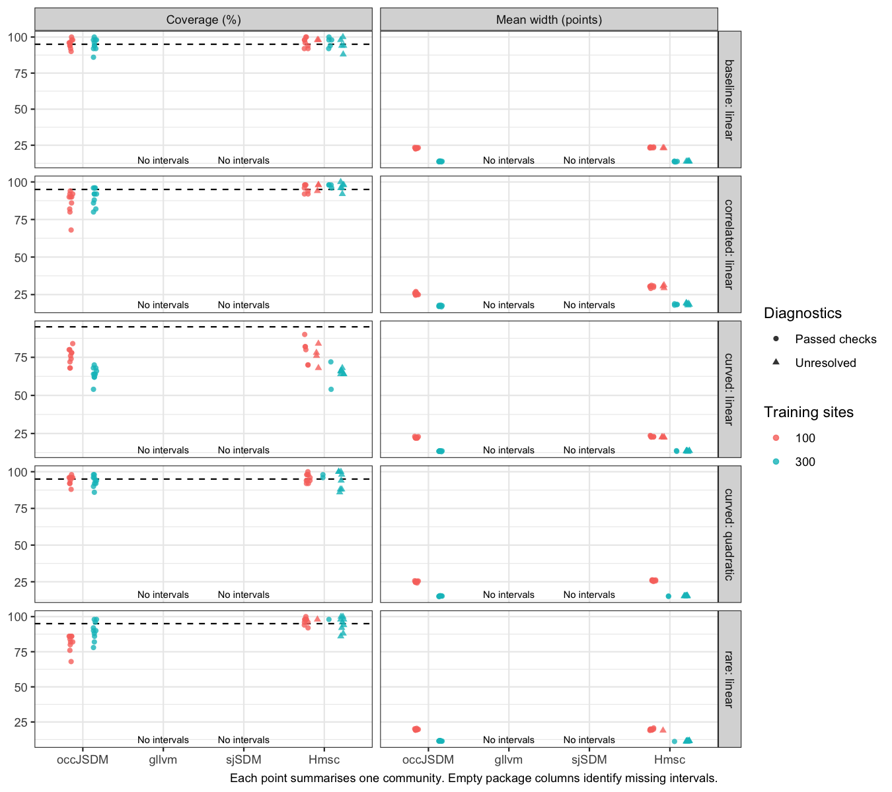<!-- -->

More data can narrow intervals around an unsuitable response shape; it does not supply the missing curve.

#### Environmental coefficients and trait relationships

For compatible coefficient targets we undo predictor scaling and centring. occJSDM’s intercept adjustment is made jointly with each draw’s slopes before taking quantiles. For gllvm and sjSDM, we transform the coefficient covariance matrix before constructing each estimate plus or minus 1.96 standard errors. Rescaling a marginal intercept interval alone would discard its dependence on the slopes.

**The native procedures account for different amounts of uncertainty.** gllvm uses its variational model’s coefficient covariance. Its selected start was replayed using the original frozen package, seed and inputs because the required fitting object had not been saved. The reconstruction must match the archived coefficients, loadings and log likelihood before its intervals are accepted. sjSDM’s saved weights can be restored directly, without optimisation. Its native standard errors hold species associations and other species’ coefficients fixed. Measuring their coverage tests that conditional approximation; these are not intervals that propagate all fitted-parameter uncertainty.

sjSDM’s standard errors also use Monte Carlo integration. Two independent random streams are checked at 2,000 integration draws, increasing to 8,000 and then 32,000 if any standard error on the original predictor scale differs by more than 5%. This checks numerical stability, not whether coverage is good. Covariance problems and remaining integration instability are recorded separately from the original fit diagnostics.

``` r
calibration_status <- as_tibble(calibration$manifest) |>
  filter(scenario != "traits", !(scenario == "curved" & response == "linear")) |>
  left_join(as_tibble(calibration$native_intervals) |>
    select(job, ok, numerical_pass), by = "job") |>
  group_by(package) |>
  summarise(Planned = n(), `Fit passed` = sum(fit_ok & diagnostic_pass),
    `Fit flagged` = sum(fit_ok & !diagnostic_pass), `Fit failed` = sum(!fit_ok),
    `Native interval flags` = if (all(is.na(numerical_pass))) NA_integer_ else sum(ok & !numerical_pass, na.rm = TRUE),
    .groups = "drop") |>
  mutate(package = factor(package, levels = package_order)) |>
  arrange(package)

calibration_status |>
  mutate(`Native interval flags` = if_else(is.na(`Native interval flags`),
    "Not applicable", as.character(`Native interval flags`))) |>
  knitr::kable()
```

| package | Planned | Fit passed | Fit flagged | Fit failed | Native interval flags |
|:--------|--------:|-----------:|------------:|-----------:|:----------------------|
| occJSDM |      80 |         80 |           0 |          0 | Not applicable        |
| gllvm   |      80 |         63 |          16 |          1 | 20                    |
| sjSDM   |      80 |         78 |           2 |          0 | 0                     |
| Hmsc    |      80 |         46 |          34 |          0 | Not applicable        |

This diagnostic table covers the same 80 planned ecological fits per package whose response specification supports coefficient recovery. Native interval flags are an additional check for gllvm and sjSDM and can overlap original fit flags; they are not extra fits. Bayesian intervals retain their original MCMC diagnostics. One gllvm fit failed originally, leaving 79 native gllvm calculations alongside 80 sjSDM calculations. All saved finite intervals remain in the main comparison; invalid species covariance blocks are unavailable.

The next figure follows the first environmental slope across all compatible ecological scenarios. Each point summarises that slope’s ten species within one community; colour distinguishes the training size. Coverage and width should be read together. The quadratic scenario includes the fitted square term even though this figure displays only its linear slope.

``` r
native_status <- as_tibble(calibration$manifest) |>
  select(job, package, scenario, n_sites, n_species, response, use_traits, replicate) |>
  left_join(as_tibble(calibration$native_intervals) |>
    select(job, numerical_pass), by = "job")

as_tibble(calibration$per_community) |>
  filter(target == "Environmental coefficient", term == "environment_1",
    scenario != "traits", intervals > 0) |>
  left_join(native_status, by = c("package", "scenario", "n_sites", "n_species",
    "response", "use_traits", "replicate")) |>
  mutate(package = factor(package, levels = package_order),
    condition = paste(scenario, response, sep = ": "), sites = factor(n_sites),
    diagnostic = if_else(diagnostic_pass & coalesce(numerical_pass, TRUE),
      "Passed available checks", "Fit or interval flagged")) |>
  select(package, condition, sites, diagnostic, coverage, width) |>
  pivot_longer(c(coverage, width), names_to = "measure", values_to = "value") |>
  mutate(value = if_else(measure == "coverage", 100 * value, value),
    measure = recode(measure, coverage = "Coverage (%)", width = "Mean coefficient width")) |>
  ggplot(aes(package, value, colour = sites, shape = diagnostic)) +
  geom_hline(data = data.frame(measure = "Coverage (%)"), aes(yintercept = 95),
    linetype = 2, inherit.aes = FALSE) +
  geom_point(position = position_jitterdodge(jitter.width = .15, dodge.width = .6, seed = 25), alpha = .8) +
  geom_text(data = expand_grid(
      condition = c("baseline: linear", "correlated: linear", "curved: quadratic", "rare: linear"),
      measure = c("Coverage (%)", "Mean coefficient width")) |>
      mutate(package = "Hmsc"),
    aes(x = package, y = -Inf, label = "Different link"), inherit.aes = FALSE, vjust = -.7, size = 2.5) +
  scale_x_discrete(limits = package_order, drop = FALSE) +
  facet_wrap(vars(condition, measure), ncol = 2, scales = "free_y") +
  labs(x = NULL, y = NULL, colour = "Training sites", shape = "Diagnostics",
    caption = "First environmental slope, original predictor units. sjSDM uses conditional native uncertainty.") +
  theme_bw()
```

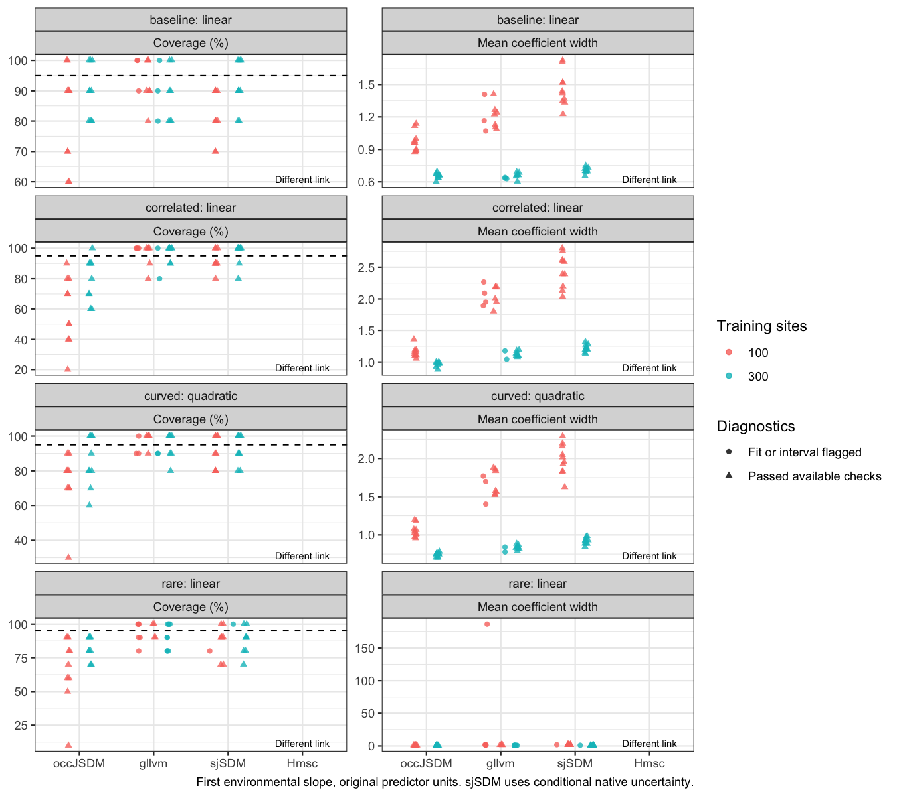<!-- -->

Hmsc keeps its place on the axis, with its coefficient comparison labelled `Different link`.

#### How much do the diagnostic flags matter?

The following combined sensitivity view keeps only fits that pass the relevant checks. occJSDM and Hmsc retain their original MCMC criteria. For gllvm and sjSDM coefficient intervals, both original fitting checks and the additional native interval checks must pass. Probability results retain the original fitting checks; their missing intervals remain unavailable. This filter is applied separately by package, so the retained communities can differ. Excluding difficult fits is a sensitivity analysis, not a corrected ranking.

``` r
checked_calibration <- calibration_checked_summary(calibration) |>
  filter(scenario == "baseline")

for (sites in c(100, 300)) {
  cat("\n\n**Baseline,", sites, "training sites: passed relevant checks**\n\n")
  print(calibration_comparison_table(
    filter(checked_calibration, n_sites == sites), appendix_targets[c(1, 3), ], package_order,
    measures = c("Coverage +/- MCSE (%)", "Mean interval width", "Communities: scored / intervals")
  ) |> knitr::kable())
  cat("\n\n")
}
```

**Baseline, 100 training sites: passed relevant checks**

| Target | Measure | occJSDM | gllvm | sjSDM | Hmsc |
|:---|:---|:---|:---|:---|:---|
| Probability: five environments | Coverage +/- MCSE (%) | 95.4 +/- 0.9 | Unavailable | Unavailable | 96.2 +/- 1.2 |
| Probability: five environments | Mean interval width | 23.03 | Unavailable | Unavailable | 23.45 |
| Probability: five environments | Communities: scored / intervals | 10 / 10 | 7 / 0 | 10 / 0 | 8 / 8 |
| Coefficient: environment 1 | Coverage +/- MCSE (%) | 82.0 +/- 4.9 | 92.9 +/- 2.9 | 82.0 +/- 2.5 | Different link |
| Coefficient: environment 1 | Mean interval width | 0.970 | 1.208 | 1.460 | Different link |
| Coefficient: environment 1 | Communities: scored / intervals | 10 / 10 | 7 / 7 | 10 / 10 | Different link |

**Baseline, 300 training sites: passed relevant checks**

| Target | Measure | occJSDM | gllvm | sjSDM | Hmsc |
|:---|:---|:---|:---|:---|:---|
| Probability: five environments | Coverage +/- MCSE (%) | 94.8 +/- 1.3 | Unavailable | Unavailable | 96.4 +/- 1.5 |
| Probability: five environments | Mean interval width | 13.78 | Unavailable | Unavailable | 13.68 |
| Probability: five environments | Communities: scored / intervals | 10 / 10 | 9 / 0 | 10 / 0 | 5 / 5 |
| Coefficient: environment 1 | Coverage +/- MCSE (%) | 89.0 +/- 2.8 | 88.6 +/- 3.4 | 92.0 +/- 2.5 | Different link |
| Coefficient: environment 1 | Mean interval width | 0.655 | 0.660 | 0.707 | Different link |
| Coefficient: environment 1 | Communities: scored / intervals | 10 / 10 | 7 / 7 | 10 / 10 | Different link |

#### Trait relationships in the same format

``` r
trait_targets <- tribble(
  ~target, ~term, ~Target,
  "Trait coefficient", "drought_tolerance / environment_1", "Drought trait: environment 1",
  "Trait coefficient", "drought_tolerance / environment_2", "Drought trait: environment 2",
  "Trait coefficient", "irrelevant_trait / environment_1", "Irrelevant trait: environment 1",
  "Trait coefficient", "irrelevant_trait / environment_2", "Irrelevant trait: environment 2"
)

calibration_comparison_table(
  filter(as_tibble(calibration$summary), target == "Trait coefficient", n_sites == 100,
    n_species == 10, population == "All scored fits"), trait_targets, package_order
) |> knitr::kable()
```

| Target | Measure | occJSDM | gllvm | sjSDM | Hmsc |
|:---|:---|:---|:---|:---|:---|
| Drought trait: environment 1 | Bias +/- MCSE | -0.093 +/- 0.060 | -0.024 +/- 0.078 | Not fitted | Different link |
| Drought trait: environment 1 | RMSE | 0.202 | 0.175 | Not fitted | Different link |
| Drought trait: environment 1 | Coverage +/- MCSE (%) | 90.0 +/- 10.0 | 100.0 +/- 0.0 | Not fitted | Different link |
| Drought trait: environment 1 | Mean interval width | 0.769 | 0.702 | Not fitted | Different link |
| Drought trait: environment 1 | Communities: scored / intervals | 10 / 10 | 6 / 6 | Not fitted | Different link |
| Drought trait: environment 2 | Bias +/- MCSE | 0.117 +/- 0.063 | 0.080 +/- 0.107 | Not fitted | Different link |
| Drought trait: environment 2 | RMSE | 0.223 | 0.252 | Not fitted | Different link |
| Drought trait: environment 2 | Coverage +/- MCSE (%) | 90.0 +/- 10.0 | 66.7 +/- 21.1 | Not fitted | Different link |
| Drought trait: environment 2 | Mean interval width | 0.746 | 0.620 | Not fitted | Different link |
| Drought trait: environment 2 | Communities: scored / intervals | 10 / 10 | 6 / 6 | Not fitted | Different link |
| Irrelevant trait: environment 1 | Bias +/- MCSE | -0.064 +/- 0.053 | -0.073 +/- 0.061 | Not fitted | Different link |
| Irrelevant trait: environment 1 | RMSE | 0.172 | 0.155 | Not fitted | Different link |
| Irrelevant trait: environment 1 | Coverage +/- MCSE (%) | 90.0 +/- 10.0 | 83.3 +/- 16.7 | Not fitted | Different link |
| Irrelevant trait: environment 1 | Mean interval width | 0.678 | 0.580 | Not fitted | Different link |
| Irrelevant trait: environment 1 | Communities: scored / intervals | 10 / 10 | 6 / 6 | Not fitted | Different link |
| Irrelevant trait: environment 2 | Bias +/- MCSE | -0.009 +/- 0.067 | 0.047 +/- 0.098 | Not fitted | Different link |
| Irrelevant trait: environment 2 | RMSE | 0.201 | 0.224 | Not fitted | Different link |
| Irrelevant trait: environment 2 | Coverage +/- MCSE (%) | 70.0 +/- 15.3 | 50.0 +/- 22.4 | Not fitted | Different link |
| Irrelevant trait: environment 2 | Mean interval width | 0.666 | 0.533 | Not fitted | Different link |
| Irrelevant trait: environment 2 | Communities: scored / intervals | 10 / 10 | 6 / 6 | Not fitted | Different link |

Hmsc trait coefficients are on the probit scale, and sjSDM was not included in the trait experiment. Their columns make those limits explicit. This displayed trait slice uses 100 sites and ten species; the saved summary also contains the 300-site and thirty-species cases. For the irrelevant trait, truth is zero, so an interval that misses truth also excludes zero incorrectly. For a genuinely nonzero effect, covering the truth and excluding zero answer different questions. gllvm’s original standard-error warnings and unavailable fits still matter. These are approximate intervals from the selected fits, not a guarantee of calibration.

The compact bundle contains per-community summaries and individual records for each grid setting and coefficient, so these tables can be filtered without accessing the large fitting archive. For example:

``` r
as_tibble(calibration$per_community) |>
  filter(package == "occJSDM", target == "Marginal probability",
    scenario == "baseline", n_sites == 100) |>
  select(replicate, diagnostic_pass, bias, rmse, coverage, width)
```

    #> # A tibble: 10 × 6
    #>    replicate diagnostic_pass      bias   rmse coverage width
    #>        <int> <lgl>               <dbl>  <dbl>    <dbl> <dbl>
    #>  1         1 TRUE             0.000741 0.0465     1    0.231
    #>  2         2 TRUE             0.0147   0.0489     0.98 0.233
    #>  3         3 TRUE             0.0161   0.0619     0.94 0.228
    #>  4         4 TRUE            -0.0110   0.0697     0.9  0.234
    #>  5         5 TRUE            -0.0101   0.0549     0.98 0.228
    #>  6         6 TRUE             0.00535  0.0580     0.92 0.230
    #>  7         7 TRUE             0.00605  0.0645     0.94 0.224
    #>  8         8 TRUE             0.0127   0.0604     0.96 0.230
    #>  9         9 TRUE             0.0206   0.0623     0.96 0.235
    #> 10        10 TRUE            -0.0223   0.0632     0.96 0.231

The gllvm coefficient-interval calculation replays selected fits solely to recover their native uncertainty calculations; the saved point estimates are retained. sjSDM coefficient intervals require no refit. Preserve these ten communities and their failures as the original experiment.
