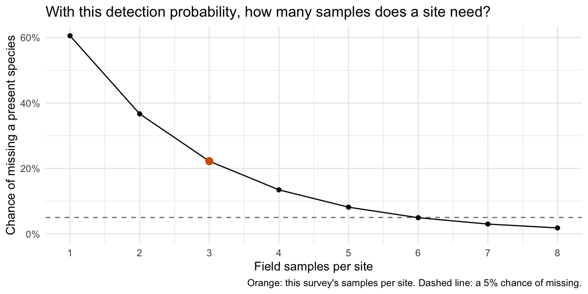

What occupancy models and joint species distribution models do
================

## Where this lesson fits

This lesson explains, by hand and without fitting a model, the two ideas that the other lessons use. The first half shows what a single-season occupancy model does with replicate samples, using one species from the survey of [Lesson 0 (optional)](occJSDM-lesson-0.md) and [Lesson 1](occJSDM-lesson-1.md). The second half shows what a joint species distribution model adds to modelling each species on its own, using a small table typed into the code. Read it before Lesson 1 if either idea is new to you or has gone rusty. Lesson 0 explains where the survey comes from, but you do not need it here. Every chunk runs when the lesson is knitted, in a few seconds: nothing is fitted by MCMC and no saved fit is read. Run the chunks in order with the repository’s `vignettes` directory as the working directory; knitting handles this automatically.

**What this lesson assumes you know.** The code uses base R and the tidyverse: the pipe `|>`, and from dplyr and tidyr the verbs listed below. If any are new, the two chapters of R for Data Science on [data transformation](https://r4ds.hadley.nz/data-transform) and [data tidying](https://r4ds.hadley.nz/data-tidy) teach everything used here in an afternoon. Operations that are unusual, such as joining two tables on species identity, are explained where they appear.

- `select()` and `filter()` to choose columns and keep rows.
- `distinct()`, `arrange()` and `count()` to deduplicate, order and count rows.
- `mutate()` and `if_else()` to add or recode columns, and `group_by()` and `summarise()` to summarise by group.
- `left_join()` to combine tables on shared identifiers.
- `pivot_wider()` to move from one row per measurement to one column per measurement.

``` r
library(dplyr)
library(tidyr)
library(tibble)
library(ggplot2)

lesson <- readRDS("teaching-data/nonspatial-lesson.rds")
truth_samples <- as_tibble(lesson$samples) |> filter(arm == "default")
survey_info <- lesson$input$sim$data_list$info
known_truth <- lesson$input$sim$true_params

format_percent <- function(probability, digits = 1) {
  paste0(formatC(100 * probability, format = "f", digits = digits), "%")
}

theme_set(theme_minimal(base_size = 12))
```

`lesson` is the saved file that Lesson 1 reads. We use three parts of it. `truth_samples` has one row per species and field sample, with the simulation’s true states. `survey_info` is the survey’s `info` table, with one row per PCR and the site, sample and covariate columns that Lesson 1 describes. `known_truth` holds the coefficients the simulation used, which we use only to check answers. `format_percent()` prints probabilities as percentages in the text.

## What an occupancy model does

Every presence/absence survey raises the same question: if we did not find a species at a site, was it absent, or did we miss it? A single-season occupancy model answers it from replicate samples, taken at each site within one season. It assumes three things:

- Each site is either occupied by the species or not, for the whole season. The probability that a site is occupied is `psi`.
- Each replicate sample at an occupied site detects the species with probability `p`, independently of the other samples.
- An unoccupied site never produces a detection. This is the no-false-positive assumption. This half of the lesson keeps it, and Lesson 1 drops it.

Lesson 1 names the two ways a survey can be wrong. A **false negative** is a species that is present but not detected, and a **false positive** is a detection of a species that is absent. This model allows only false negatives.

We use the survey from Lessons 0 and 1: 100 sites with 3 field samples each. That survey is a **two-stage process**: DNA is collected in the field, then detected by PCR in the laboratory. To keep to one stage, we take one species and give each field sample a single record. In this lesson a sample counts as a detection when the species occupies the site and its DNA entered the sample. We build that record from the simulation’s true states, not from the PCRs, so the no-false-positive assumption holds by construction. A sample contaminated at a site the species does not occupy, a **field-stage false positive**, counts here as a non-detection, and the laboratory stage, with its own errors, is left out entirely. It also means that the per-sample detection probability `p` is, by construction, Lesson 1’s collection probability: the probability that DNA enters a field sample when the species occupies the site.

We use OTU_3. It occupies 58% of the sites, so there are occupied and empty sites to tell apart. Its collection probability rises with the collection covariate, which the covariate section uses. And enough of its occupied sites were missed by every sample to make finding them worthwhile.

``` r
focal_species <- "OTU_3"

one_stage <- truth_samples |>
  filter(species == focal_species) |>
  mutate(detected = as.integer(z == 1 & w == 1)) |>
  select(Site, Sample, z, w, detected)

head(one_stage, 9)
```

    #> # A tibble: 9 × 5
    #>    Site Sample     z     w detected
    #>   <dbl>  <dbl> <int> <int>    <int>
    #> 1     1      1     1     1        1
    #> 2     1      2     1     0        0
    #> 3     1      3     1     0        0
    #> 4     2      4     0     0        0
    #> 5     2      5     0     0        0
    #> 6     2      6     0     0        0
    #> 7     3      7     1     1        1
    #> 8     3      8     1     0        0
    #> 9     3      9     1     1        1

There is one row per field sample. `z` is the true site state (1 if OTU_3 occupies the site), `w` is the true sample state (1 if its DNA entered the sample), and `detected` is our one-stage record. Sample identifiers run across the whole survey, so the first nine rows are the first three sites. Among them, OTU_3 occupies site 1 and site 3, and its DNA reached 3 of those sites’ samples. At an empty site, no sample can count as a detection. Across the survey, 3 samples received OTU_3 DNA at sites it did not occupy; in this table they count as non-detections.

An occupancy model works with each site’s detection history, so we count the detections at each site. `occupied` is the true site state, which a real survey would not know; we keep it to check the answers.

``` r
site_history <- one_stage |>
  group_by(Site) |>
  summarise(
    samples = n(),
    detections = sum(detected),
    occupied = first(z),
    .groups = "drop"
  )

count(site_history, detections, occupied)
```

    #> # A tibble: 5 × 3
    #>   detections occupied     n
    #>        <int>    <int> <int>
    #> 1          0        0    42
    #> 2          0        1    10
    #> 3          1        1    26
    #> 4          2        1    19
    #> 5          3        1     3

Each row is a combination of detections and true state, and `n` is the number of sites with it. 3 sites had a detection in every sample, 19 in two and 26 in one. Every site with a detection is occupied, because this table has no false positives. The interesting rows are the 52 sites with no detections. Because the simulation lets us peek, we can see that 10 of them were occupied and missed by every sample, and the other 42 were truly empty. A real survey sees only the `detections` column. The job of the occupancy model is to estimate how many of the all-negative sites are occupied, without peeking.

The simplest estimate of occupancy ignores that job. **Naive occupancy** is the fraction of sites with at least one detection, and it counts every all-negative site as empty.

The occupancy model needs one line of arithmetic for each kind of site. A site where the species was detected in `d` of its `M` samples must be occupied, so its probability is `psi * p^d * (1 - p)^(M - d)`: occupied, then detected `d` times and missed `M - d` times. A site with no detections could be in either state, so its probability is the sum of two routes: `psi * (1 - p)^M`, occupied but missed by every sample, plus `1 - psi`, empty. Multiplying these probabilities over all sites gives the **likelihood**, the probability of the survey’s whole pattern for a given `psi` and `p`. Maximum likelihood chooses the pair that makes the observed pattern most probable.

The function below writes the two lines on the log scale, so that the product over sites becomes a sum. `optim()` searches for the best pair. It searches on the logit scale, and `plogis()` turns each number it tries into a probability between 0 and 1. `fnscale = -1` tells it to maximise rather than minimise.

``` r
naive_occupancy <- mean(site_history$detections > 0)

one_stage_loglik <- function(par, history) {
  psi <- plogis(par[1])
  p <- plogis(par[2])
  with(history, {
    detected_sites <- detections > 0
    ll_detected <- log(psi) + detections * log(p) + (samples - detections) * log(1 - p)
    ll_missed <- log(psi * (1 - p)^samples + (1 - psi))
    sum(ifelse(detected_sites, ll_detected, ll_missed))
  })
}

fit <- optim(c(0, 0), one_stage_loglik, history = site_history,
             control = list(fnscale = -1))
estimates <- c(psi = plogis(fit$par[1]), p = plogis(fit$par[2]))
round(estimates, 3)
```

    #>   psi     p 
    #> 0.617 0.394

The model estimates that a site is occupied with probability 61.7% and that each sample at an occupied site detects the species with probability 39.4%. The information about `p` comes from the sites with detections, where we know the species was present. At those sites, 50.7% of samples detected it, which is higher than the model’s `p`. The difference is not a mistake. A site joins that group only if at least one of its samples succeeded, so the raw share overstates how often a sample succeeds, and the likelihood corrects for this.

Now we compare these with the truth. The true collection probability of each sample is calculated from that sample’s collection covariate and the species’ true coefficients, as in Lesson 1.

``` r
species_column <- match(focal_species, colnames(lesson$input$sim$data_list$OTU))
collection_truth <- survey_info |>
  distinct(Sample, X_theta) |>
  mutate(true_collection = plogis(known_truth$beta_theta_true[1, species_column] +
                                    known_truth$beta_theta_true[2, species_column] * X_theta))

occupied_samples <- one_stage |>
  filter(z == 1) |>
  left_join(collection_truth, by = "Sample")

round(c(
  naive_occupancy = naive_occupancy,
  estimated_psi = estimates[["psi"]],
  true_fraction_occupied = mean(site_history$occupied),
  estimated_p = estimates[["p"]],
  true_mean_collection = mean(occupied_samples$true_collection)
), 3)
```

    #>        naive_occupancy          estimated_psi true_fraction_occupied 
    #>                  0.480                  0.617                  0.580 
    #>            estimated_p   true_mean_collection 
    #>                  0.394                  0.419

Naive occupancy, 48.0%, is too low, because it counts the missed sites as absent. The model’s `psi`, 61.7%, is close to the true fraction of sites occupied, 58.0%. Its `p`, 39.4%, is close to the true mean collection probability of the samples at occupied sites, 41.9%. That match is a feature of how we built the table: a detection here means that DNA was collected at an occupied site, so the detection probability is the collection probability. Neither estimate is exact, because they come from one survey of 100 sites, of which only 58 were occupied.

## The sites where the species was missed

The estimates tell us more than the overall occupancy. They also say how likely it is that a particular all-negative site is occupied. The calculation uses `M`, the number of samples per site, read from the data; every site here has 3.

``` r
M <- unique(site_history$samples)
psi_hat <- estimates[["psi"]]
p_hat <- estimates[["p"]]

occupied_and_missed <- psi_hat * (1 - p_hat)^M
empty <- 1 - psi_hat
conditional_occupancy <- occupied_and_missed / (occupied_and_missed + empty)

round(c(occupied_and_missed = occupied_and_missed,
        empty = empty,
        conditional_occupancy = conditional_occupancy), 3)
```

    #>   occupied_and_missed                 empty conditional_occupancy 
    #>                 0.137                 0.383                 0.264

``` r
missed <- site_history |> filter(detections == 0)

c(no_detection_sites = nrow(missed),
  expected_occupied = round(nrow(missed) * conditional_occupancy, 1),
  actually_occupied = sum(missed$occupied))
```

    #> no_detection_sites  expected_occupied  actually_occupied 
    #>               52.0               13.7               10.0

This is the idea that readers most often find slippery, so take it slowly, with whole sites rather than probabilities. Of 100 sites like these, the model expects 61.7 to be occupied. At each occupied site, the chance that all 3 samples miss the species is `(1 - p)^M`, 22.2%, so it expects 13.7 occupied sites to produce no detections. It also expects 38.3 sites to be truly empty. Both groups end up in the same place in the survey, among the sites with no detections, and nothing in the detections tells them apart. The **conditional probability of occupancy** is the occupied group’s share of the all-negative sites: `psi * (1 - p)^M / (psi * (1 - p)^M + 1 - psi)`, which is 26.4% here. In words, given that a site produced no detections, it is the probability that the species is nonetheless there.

Multiplying by the number of all-negative sites gives how many of them the model expects to be occupied: 52 sites times 26.4% is 13.7. The simulation shows that 10 actually were. This is also where `psi` comes from. The 48 sites with detections, plus the 13.7 expected among the all-negative sites, make 61.7% of the 100 sites, which is the model’s estimate of `psi`. An occupancy model does not inflate naive occupancy by a correction factor. It adds back the sites that its detection probability says were missed.

This model gives every all-negative site the same conditional probability, because it knows nothing that distinguishes one site from another. The next section gives it something.

## Covariates say which sites those are

Two kinds of measured covariate can tell the all-negative sites apart. An **occupancy covariate** describes the habitat: where the habitat suits the species, a site is more likely to be occupied before we look at any samples. A **collection covariate** describes how each sample was taken: where collection was poor, a miss is less surprising. In this survey the occupancy covariates are `X_psi.EnvCov.1` and `X_psi.EnvCov.2`, and the collection covariate is `X_theta`, measured for each field sample. Think of `X_theta` as sampling effort, such as the volume of water filtered; in the simulation it is a measurement in arbitrary units.

Each covariate enters through the same logistic link as in Lesson 1. A site’s occupancy probability is `plogis(a + b * environment)` and a sample’s detection probability is `plogis(c + d * effort)`. We scale both covariates to mean 0 and standard deviation 1, so that `a` and `c` describe an average site and an average sample, and the slopes are changes per standard deviation. We use only `X_psi.EnvCov.1`, which keeps the hand calculation to four numbers, two for each part of the model. OTU_3 responds to both habitat covariates in the simulation, and on your own survey you would include every habitat covariate you measured, as Lesson 1’s fits do.

The likelihood has the same two lines as before. The only change is that each site now has its own `psi`, and each sample its own `p`. Here `distinct()` keeps one copy of each site’s habitat value and each sample’s effort value, because `survey_info` repeats them on every PCR row.

``` r
site_covariates <- survey_info |>
  distinct(Site, environment = X_psi.EnvCov.1)
sample_covariates <- survey_info |>
  distinct(Site, Sample, effort = X_theta)

history_cov <- one_stage |>
  left_join(site_covariates, by = "Site") |>
  left_join(sample_covariates, by = c("Site", "Sample")) |>
  mutate(environment = as.numeric(scale(environment)),
         effort = as.numeric(scale(effort)))

covariate_loglik <- function(par, d) {
  psi <- plogis(par[1] + par[2] * d$environment)
  p <- plogis(par[3] + par[4] * d$effort)
  per_sample <- ifelse(d$detected == 1, log(p), log(1 - p))
  by_site <- d |>
    mutate(per_sample = per_sample, psi = psi) |>
    group_by(Site) |>
    summarise(
      psi = first(psi),
      detected_any = any(detected == 1),
      ll_if_occupied = sum(per_sample),
      .groups = "drop"
    )
  with(by_site, sum(ifelse(detected_any,
    log(psi) + ll_if_occupied,
    log(psi * exp(ll_if_occupied) + (1 - psi)))))
}

fit_cov <- optim(c(0, 0, 0, 0), covariate_loglik, d = history_cov,
                 control = list(fnscale = -1), method = "BFGS")
coefficients <- setNames(fit_cov$par, c("psi_intercept", "psi_environment", "p_intercept", "p_effort"))
round(coefficients, 3)
```

    #>   psi_intercept psi_environment     p_intercept        p_effort 
    #>           0.485          -0.959          -0.397           0.767

The four numbers are on the logit scale. The habitat slope, `psi_environment`, is negative, so OTU_3 is more likely to occupy sites with low values of `X_psi.EnvCov.1`. The effort slope, `p_effort`, is positive: a sample’s chance of detecting the species ranges from 7.6% at the lowest effort in the survey to 87.9% at the highest, and is 40.2% at average effort.

Now we repeat the conditional calculation for each all-negative site, with that site’s own numbers. The chance that every sample misses a species that is present is the product, over the site’s samples, of `1 - p` for each sample, so a site whose samples were all taken with little effort has a high chance of missing it. The conditional probability then has the same form as before: `psi * miss / (psi * miss + 1 - psi)`.

``` r
missed_by_site <- history_cov |>
  mutate(
    psi = plogis(coefficients[["psi_intercept"]] + coefficients[["psi_environment"]] * environment),
    p = plogis(coefficients[["p_intercept"]] + coefficients[["p_effort"]] * effort)
  ) |>
  group_by(Site) |>
  summarise(
    detected_any = any(detected == 1),
    environment = first(environment),
    mean_effort = mean(effort),
    psi = first(psi),
    miss = prod(1 - p),
    occupied = first(z),
    .groups = "drop"
  ) |>
  filter(!detected_any) |>
  mutate(conditional = psi * miss / (psi * miss + 1 - psi)) |>
  select(-detected_any) |>
  arrange(desc(conditional))

n_shown <- 10
head(missed_by_site, n_shown)
```

    #> # A tibble: 10 × 7
    #>     Site environment mean_effort   psi  miss occupied conditional
    #>    <dbl>       <dbl>       <dbl> <dbl> <dbl>    <int>       <dbl>
    #>  1    87      -1.31       -1.16  0.851 0.481        1       0.733
    #>  2    61      -1.45       -0.872 0.867 0.352        1       0.696
    #>  3    85      -1.10       -0.698 0.824 0.336        1       0.611
    #>  4    19      -1.28       -0.247 0.847 0.262        0       0.592
    #>  5    51      -0.732      -0.718 0.766 0.306        0       0.501
    #>  6    71      -0.935      -0.243 0.799 0.238        0       0.486
    #>  7    31      -0.193      -1.04  0.661 0.451        1       0.468
    #>  8    98      -1.33        0.222 0.853 0.146        1       0.458
    #>  9    56      -0.329      -0.460 0.690 0.303        1       0.403
    #> 10    57      -0.374      -0.476 0.699 0.276        1       0.391

Each row is one all-negative site, ranked by its conditional probability of occupancy. `environment` and `mean_effort` are the scaled covariates (the site’s habitat value and the mean effort of its samples), `psi` is the site’s probability of occupancy from its habitat, `miss` is the chance that all its samples miss a species that is present, and `occupied` is the simulation’s answer. Read the top rows from left to right. Suitable habitat raises `psi`, low collection effort raises `miss`, and the sites where both are high are where the species most probably hides. The top site, site 87, has a 85.1% chance of occupancy from its habitat and a 48.1% chance that its samples would all miss the species, which together give 73.3%.

``` r
missed_by_site |>
  mutate(group = if_else(row_number() <= n_shown, "most likely", "the others")) |>
  group_by(group) |>
  summarise(
    sites = n(),
    expected_occupied = round(sum(conditional), 1),
    actually_occupied = sum(occupied),
    .groups = "drop"
  )
```

    #> # A tibble: 2 × 4
    #>   group       sites expected_occupied actually_occupied
    #>   <chr>       <int>             <dbl>             <int>
    #> 1 most likely    10               5.3                 7
    #> 2 the others     42               6.7                 3

The simulation’s `occupied` column confirms the ranking. Of the 10 all-negative sites the model ranks as most likely to be occupied, 7 were occupied. Of the other 42, only 3 were. The `expected_occupied` column adds up the conditional probabilities in each group. Across all the all-negative sites the model expected 12 to be occupied, against 10 that were. The model without covariates gave every one of these sites the same 26.4%. Habitat and effort cannot say which sites are occupied for certain, because the habitat covariate explains only part of where OTU_3 occurs, but they say where to look. On your own survey, this is the reason to record collection conditions for every sample: without them, a miss in a poor sample looks the same as a miss in a good one.

These are the two covariate groups that `runOccJSDM()` takes: `occCovariates` for occupancy, which the package calls `psi`, and `collCovariates` for collection, which it calls `theta`.

## How many replicates are enough

The question every survey designer asks is how many samples a site needs. If each sample detects a species that is present with probability `p`, the chance that all `M` samples miss it is `(1 - p)^M`, and the chance of at least one detection is `1 - (1 - p)^M`. The figure uses the detection probability estimated above.

``` r
replicate_design <- tibble(samples = 1:8) |>
  mutate(chance_of_missing = (1 - p_hat)^samples)

ggplot(replicate_design, aes(samples, chance_of_missing)) +
  geom_hline(yintercept = 0.05, linetype = "dashed", colour = "grey50") +
  geom_line() +
  geom_point() +
  geom_point(data = filter(replicate_design, samples == M), colour = "#D55E00", size = 3) +
  scale_x_continuous(breaks = 1:8) +
  scale_y_continuous(labels = scales::percent, limits = c(0, NA)) +
  labs(x = "Field samples per site", y = "Chance of missing a present species",
       title = "With this detection probability, how many samples does a site need?",
       caption = "Orange: this survey's samples per site. Dashed line: a 5% chance of missing.")
```

<!-- -->

Each point is the chance that a site occupied by OTU_3 produces no detections, for a given number of samples. One sample misses the species 60.6% of the time. This survey’s 3 samples miss it 22.2% of the time, which is why the previous sections found occupied sites among the all-negative ones. Reaching a 5% chance of missing would take 6 samples per site.

The number of replicates is a design decision, and the detection probability sets it. A pilot survey that estimates `p` for the species you care most about tells you how many samples you need; a species that is harder to detect needs more. The covariate section suggests a second lever: raising the effort per sample raises `p`, and a higher `p` needs fewer samples. The same replication logic returns in Lesson 1, where more field samples per site also guard site occupancy against contamination at collection.

The package fits this one-stage occupancy model too. It does so when `info` has repeated rows for each site but no `Sample` column, so that each row is one sample with one detection record. The chunk below builds that input from the same true states for all ten species, and it is not run when knitting. `pivot_wider()` turns the one-row-per-species table into one column per species, and the covariates are joined onto the same rows, so `info` and `OTU` line up row for row. `n_factors = 2` asks for two hidden site factors, which the second half of this lesson explains; the package’s default is none.

``` r
library(occJSDM)

one_stage_survey <- truth_samples |>
  mutate(detected = as.integer(z == 1 & w == 1)) |>
  select(species, Site, Sample, detected) |>
  pivot_wider(names_from = species, values_from = detected) |>
  left_join(distinct(survey_info, Site, Sample, X_psi.EnvCov.1, X_psi.EnvCov.2, X_theta),
            by = c("Site", "Sample")) |>
  arrange(Site, Sample)

one_stage_data <- list(
  info = one_stage_survey |>
    select(Site, X_psi.EnvCov.1, X_psi.EnvCov.2, X_theta) |>
    as.data.frame(),
  OTU = one_stage_survey |>
    select(starts_with("OTU_")) |>
    as.matrix()
)

fit_one_stage <- runOccJSDM(
  data = one_stage_data,
  occCovariates = "X_psi.EnvCov.1",
  collCovariates = "X_theta",
  listParams = list(n_factors = 2),
  spatCovariates = NULL,
  MCMCparams = list(nchain = 2, nburn = 2000, niter = 2000, nthin = 1)
)
# occJSDM prints "occJSDM has inferred occupancy data" for this shape.
```

The message confirms that `runOccJSDM()` inferred the one-stage model. Its collection probability, `theta`, is the per-sample detection probability that the hand calculation called `p`, and it depends on `X_theta` as our `p` depended on effort. The package fits all ten species together, with the hidden factors that the second half of this lesson describes, and it also estimates a small rate of field-stage false positives, which Lesson 1 introduces. This table has none, so the hand calculation leaves that rate out. The chain settings are short, for a quick look; check that the chains agree before reading the results, as Lesson 1 shows.

False positives are excluded from this half of the lesson by construction. They arrive in Lesson 1 with the second stage, PCR detection in the laboratory, which brings laboratory false positives as well as field-stage ones. There, the same replication logic protects site occupancy against contamination at collection.

## What a joint model does

A species distribution model relates the occurrence of one species to the environment. Fit one for each species and you have a stacked model: a set of independent models. Stacking is easy, and it is often fine for predicting one species at a time. What it cannot do is say anything about how species occur together beyond what the measured environment explains, because it assumes that species are independent once the covariates are known. A **joint species distribution model** (JSDM) fits all the species together and adds one thing: the **residual correlation** among species. After the measured environment has been accounted for, do two species still tend to occur together, or apart? Two practical consequences follow. A rare species borrows strength from the better-recorded species it tends to occur with. And predictions can be conditional: given that species A was recorded at a site, how likely is species B?

Hidden factors are a familiar idea outside ecology. A recommender system takes a table of viewers by films and finds two small tables whose product reproduces it: a score for each viewer on a few hidden dimensions, and a position for each film on the same dimensions. The dimensions turn out to be genres that nobody labelled. Replace viewers by sites and films by species, and the same arithmetic recovers unmeasured habitat axes from which species occur together. Here is that arithmetic on a toy community of six sites and five species, with two hidden gradients that we call wetness and shade.

``` r
species_scores <- rbind(                 # species x hidden gradients
  species_A = c(wet = 1.0, shade = 0.0),
  species_B = c(0.9, 0.1),
  species_C = c(0.6, 0.6),
  species_D = c(0.1, 0.9),
  species_E = c(0.0, 1.0)
)
site_scores <- rbind(                    # sites x hidden gradients
  site_1 = c(wet = 1.5, shade = 0.0),
  site_2 = c(1.2, 0.2),
  site_3 = c(1.0, 1.0),
  site_4 = c(0.2, 1.3),
  site_5 = c(0.0, 1.5),
  site_6 = c(0.3, 0.3)
)
suitability <- site_scores %*% t(species_scores)
round(suitability, 2)
```

    #>        species_A species_B species_C species_D species_E
    #> site_1       1.5      1.35      0.90      0.15       0.0
    #> site_2       1.2      1.10      0.84      0.30       0.2
    #> site_3       1.0      1.00      1.20      1.00       1.0
    #> site_4       0.2      0.31      0.90      1.19       1.3
    #> site_5       0.0      0.15      0.90      1.35       1.5
    #> site_6       0.3      0.30      0.36      0.30       0.3

``` r
round(svd(suitability)$d, 3)
```

    #> [1] 4.217 2.344 0.000 0.000 0.000

Each species has a score on each hidden gradient: species_A is a wet-ground specialist, species_E a shade specialist and species_C sits between them. Each site has a score on the same gradients. A cell of `suitability` is the site’s scores multiplied by the species’ scores and added up, so it is high where the two line up. site_3, at 1 on both gradients, and species_C, at 0.6 on both, give 1 times 0.6 plus 1 times 0.6, which is 1.2. site_1 is wet and has no shade, so it scores 1.5 for species_A and 0 for species_E.

The table has 30 numbers, but the second printout shows that only 2 of its singular values are not zero. The singular values measure how many independent patterns a table contains, so every column is a mixture of the same 2 patterns. The two small tables hold 22 numbers and reproduce all 30. In this lesson’s survey, 100 sites by 10 species is 1000 cells, while two hidden factors need 220 scores.

A survey does not record suitability. It records presence or absence, which depends on suitability. Suppose, for the toy, that a species is present wherever its suitability exceeds 0.5.

``` r
presence <- (suitability > 0.5) * 1
presence
```

    #>        species_A species_B species_C species_D species_E
    #> site_1         1         1         1         0         0
    #> site_2         1         1         1         0         0
    #> site_3         1         1         1         1         1
    #> site_4         0         0         1         1         1
    #> site_5         0         0         1         1         1
    #> site_6         0         0         0         0         0

This is the kind of table a survey gives you. The hidden gradients show through it: the wet sites, site_1 and site_2, hold species_A, species_B and species_C; the shaded sites, site_4 and site_5, hold species_C, species_D and species_E; site_3 holds everything and site_6 nothing. Nobody labelled the gradients, but the co-occurrence pattern groups the sites and the species along them. A JSDM works backwards from a table like this to the hidden gradients behind it.

There is a catch in reading those gradients. Rotate both sets of scores by the same angle, and every individual score changes but the table does not.

``` r
theta <- pi / 6
rotation <- matrix(c(cos(theta), sin(theta), -sin(theta), cos(theta)), 2, 2)

round(rbind(original = species_scores["species_A", ],
            rotated = (species_scores %*% rotation)["species_A", ]), 3)
```

    #>            wet shade
    #> original 1.000   0.0
    #> rotated  0.866  -0.5

``` r
max(abs((site_scores %*% rotation) %*% t(species_scores %*% rotation) - suitability))
```

    #> [1] 2.220446e-16

``` r
round(species_scores %*% t(species_scores), 2)
```

    #>           species_A species_B species_C species_D species_E
    #> species_A       1.0      0.90      0.60      0.10       0.0
    #> species_B       0.9      0.82      0.60      0.18       0.1
    #> species_C       0.6      0.60      0.72      0.60       0.6
    #> species_D       0.1      0.18      0.60      0.82       0.9
    #> species_E       0.0      0.10      0.60      0.90       1.0

After the rotation, species_A moves from (1, 0) to (0.866, -0.5), so the axis we called wetness is no longer the wetness axis. Yet the rebuilt table differs from the original by at most 2e-16 in R’s scientific notation, which is rounding error. The names “wet” and “shade” were never in the data; we imposed them. The individual scores are therefore not identified: many sets of scores fit the data equally well.

What survives rotation is the last printout, the species-by-species table of cross-products. Read it as a table of which species go together. species_A and species_B score 0.9, and so do species_D and species_E. species_A and species_E score 0, because they share no gradient. species_C is moderately similar to everything, because it straddles both gradients. **This species-by-species matrix is the interpretable output, and the individual scores are not.** Scaled to correlations, it is what the package reports as the residual correlations between species.

Real data also contain measured covariates. Part of a species’ suitability is explained by environment we measured, and only the rest by hidden gradients. The model then has two parts, `suitability = X %*% B + site_scores %*% t(species_scores)`: a measured part, where `X` holds each site’s environmental covariates and `B` each species’ response to them, plus a hidden part for the structure we did not measure.

Swap the recommender’s nouns for ecology and nothing else changes:

- Viewers become **sites**, and films become **species**.
- The table of ratings becomes the site-by-species table of **occurrences**.
- Viewer attributes, such as age, become the **environmental covariates**, and each species has its own response to them.
- Film positions on the hidden dimensions become the **species loadings**, the species scores above.
- Viewer tastes become **site scores** on the same hidden gradients.
- The film-by-film similarity becomes the **species association matrix**, the residual correlations.

An unmeasured environmental gradient, such as soil pH, plays the role of a genre. Sites differ along it and species respond to it, but nobody measured it, and its fingerprint is a group of species that occur together more often than the measured environment predicts.

## What a joint model adds to a factorisation

A JSDM uses that low-rank idea, but it is not a factorisation of your data matrix, and the difference is worth stating plainly. **A factorisation describes the table you have. A JSDM estimates how species covary, so that it can reason about tables you do not have.** Three additions make the difference.

- **It factors the residual, not the data.** The measured environment enters first as an ordinary regression, one coefficient vector per species. The hidden factors are then asked to explain only what the environment left over. That is why the output is called a *residual* correlation. If you measure a gradient that the factors had been standing in for and add it as a covariate, the association it produced shrinks. That is the model working as intended, not a contradiction.
- **It is a probability model of a presence or absence.** A recommender regresses 1s and 0s as if they were continuous scores and reports a fitted number per cell. A JSDM treats each cell as a Bernoulli outcome whose probability is a logit or probit transform of the linear predictor. That gives a likelihood, and with it uncertainty for every parameter, sensible behaviour for rare species, and a basis for comparing models.
- **It treats the site scores as random and averages over them.** In a recommender, each viewer’s score vector is a parameter, because recommending to that viewer needs it. In a JSDM, a site’s hidden scores are assumed to be drawn from a standard normal distribution. Packages that fit by optimisation, such as gllvm and sjSDM in Lesson 4, average over every value the scores could take and keep only the species loadings; Bayesian packages, such as occJSDM and Hmsc, sample the scores for the fitted sites but likewise average over them at new sites. Because the scores are independent standard normals, the covariance between two species’ residuals at a site is the dot product of their two loading rows. That holds at any site, sampled or not. The loading matrix therefore describes the community rather than the particular sites surveyed, and the species-by-species matrix built from it is what the packages report as the residual covariance or association matrix.

Put together, these define the **joint probability distribution of the whole species vector at a site**. That is the sense in which the model is joint. Two things follow that no factorisation offers. First, recording one species at a site tells you something about the others, because it is evidence about that site’s hidden scores. Second, the same model answers two different prediction questions, depending on whether such evidence is available. [Lesson 4](occJSDM-lesson-4.md) makes that distinction precise in its section “Two probability questions that must not be mixed”, and its [exercise](occJSDM-lesson-4.md#exercise-predict-one-species-given-another) shows the first consequence in numbers.

In occJSDM’s terms, the number of hidden site factors is `n_factors` in `listParams`, and Lesson 1’s fits use 2, matching the simulation. The site scores are returned by `returnOrdinationScores()` and the species loadings by `returnFactorLoadings()`; Lesson 3 writes their product for species `j` at site `i` as `U_i L_j`. `returnResidualCorrelationMatrix()` multiplies each posterior draw of the loadings by its own transpose, scales the result to correlations, and returns the lower limit, median and upper limit of each correlation. For the toy community, the same scaling gives:

``` r
round(cov2cor(species_scores %*% t(species_scores)), 2)
```

    #>           species_A species_B species_C species_D species_E
    #> species_A      1.00      0.99      0.71      0.11      0.00
    #> species_B      0.99      1.00      0.78      0.22      0.11
    #> species_C      0.71      0.78      1.00      0.78      0.71
    #> species_D      0.11      0.22      0.78      1.00      0.99
    #> species_E      0.00      0.11      0.71      0.99      1.00

species_A and species_B, which load on the same gradient, have a correlation of 0.99; species_A and species_E, which share none, have 0; species_C is correlated with both ends at 0.71. In a fitted model, each of these numbers comes with a credible interval, the range holding the middle 95% of the posterior draws.

## What you can now recognise in the other lessons

- **The two stages of an eDNA survey.** [Lesson 1](occJSDM-lesson-1.md#three-questions-three-different-truths) adds PCR detection in the laboratory to the collection stage used here, and with it both kinds of false positive.
- **Replicates as protection.** The replication logic of “How many replicates are enough” returns in [Lesson 1’s conclusions](occJSDM-lesson-1.md#what-this-lesson-showed): more field samples per site guard site occupancy against contamination at collection.
- **Assumptions written as priors.** The no-false-positive assumption made here becomes, in [Lesson 1](occJSDM-lesson-1.md#how-does-good-practice-enter-the-model), a prior that expects contamination to be uncommon without ruling it out.
- **Estimates with uncertainty.** The hand calculation gave single best values; [Lesson 3](occJSDM-lesson-3.md#put-the-true-coefficient-beside-its-estimate) reads the fitted model’s estimates with their credible intervals.
- **Hidden factors and residual correlations.** The species-by-species matrix of the toy community is what [Lesson 3’s association section](occJSDM-lesson-3.md#residual-species-associations-did-we-recover-what-was-put-in) compares with truth, and the rotation problem is why its [ordination section](occJSDM-lesson-3.md#ordination-compare-the-combined-effect-before-naming-the-axes) compares combined effects before naming axes.
- **Conditional prediction.** [Lesson 4’s exercise](occJSDM-lesson-4.md#exercise-predict-one-species-given-another) predicts one species from the presence of another, which only a joint model can do.
