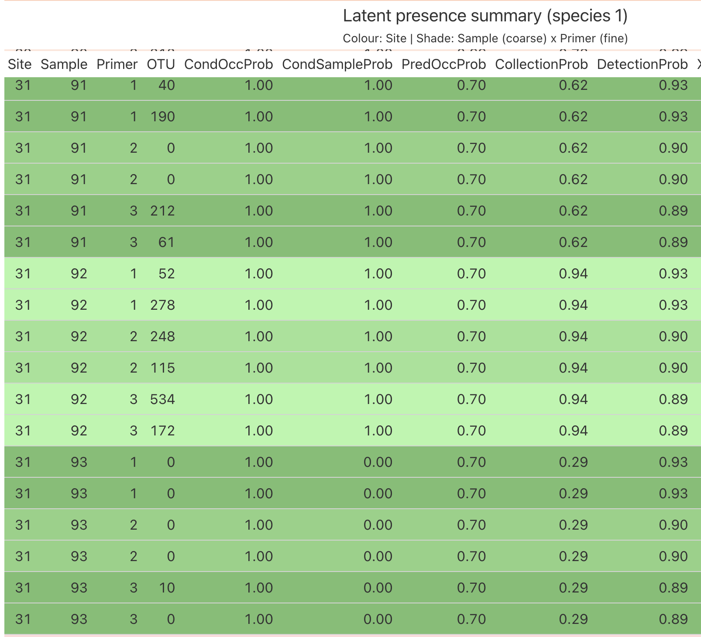

```{r, include = FALSE}
knitr::opts_chunk$set(
  collapse = TRUE,
  warnings = FALSE,
  fig.width = 7,
  fig.height = 4.5,
  comment = "#>"
)

options(warning = -1)
```

```{r setup, include = FALSE}
# library(occJSDM)
devtools::load_all() # change to library(occJSDM) when package finished
# devtools::document() # run manually after editing roxygen comments
# devtools::check() # run manually before commits/releases, builds package, runs examples/tests/vignettes, checks CRAN-style compliance
```

The model can be run using the `runOccJSDM` function.

The arguments of the function are:

- `data`: which we explain below;
- `listParams`: a list of the number of ordination factors used for
  computing occupancy probabilities `n_factors`, and of the number of
  unobserved traits `gt`;
- `threshold`: ≥ this number of reads is counted as a detection (default
  = 1);
- `occCovariates`: vectors of covariates predicting occupancy
  probabilities;
- `collCovariates`: vectors of covariates predicting eDNA collection (=
  detection) probabilities;
- `spatCovariates`: vectors of covariates used to construct a spatial
  random field capturing residual spatial structure in occupancy that is
  not explained by occCovariates;
- `traitsMatrix`: a matrix of species traits (rows = species, columns =
  traits) used to explain how species' occupancy responses to
  `occCovariates` vary as a function of their traits;
- `MCMCparams`: a list specifying the MCMC settings, including `nchain`
  (number of chains), `nburn` (number of burn-in iterations to discard),
  `niter` (number of post-burn-in iterations to keep), and `nthin`
  (thinning interval, i.e. how many iterations to skip between saved
  samples).

## Data preparation

The included data object is a list of four elements: `info`, `OTU,`
`spatCovariates`, and `traitsMatrix` and was created in the vignette
`simulateOccJSDMData.Rmd`.

```{r}
data <- sampledata #default name 
head(data$info)
```

`data$info` is a data.frame with $N$ rows, where $N$ is the total number
of samples analyzed and columns:

- `Site`: name (or index) of the site in which this replicate was
  collected;
- `Sample`: name (or index) of the sample from which this replicate was
  analyzed. Following usual practice, samples are uniquely numbered
  across the whole dataset;
- `Primer`: name (or index) of the primer used in this replicate;
- `X_psi.EnvCov.n` are the occupancy covariates (e.g. elevation,
  normalised);
- `Xs.n` are the spatial covariates of each site (e.g. easting and
  northing in a UTM coordinate system, normalised)
- `X_theta.n` are the eDNA collection covariates (e.g. water volume per
  sample, normalised).

In this dataset, there are $n=100$ sites, $S=10$ species, and, in the
balanced case, $M=3$ sample replicates per site and $P=3$ primers. From
this data structure, occJSDM can infer that there are $K=2$ PCR
replicates per sample, so a fully balanced dataset would have had
$3 \times 3 \times 2 = 1800$ rows (i.e. observations).

However, in this vignette, we want to illustrate that `occJSDM` can work
with unbalanced study designs, such as sites with a missing samples.
Thus, we drop $3$ of the $300$ samples (one each at three different
sites) to simulate missing observations, leaving $297$ samples and
$1{,}782$ total replicates.

```{r}
data$info |> count(Site)

set.seed(3947)

samples_by_site <- data$info |>
  dplyr::distinct(Site, Sample) # samples are uniquely numbered

# One sample dropped at each of 3 distinct sites
dropped_samples <- samples_by_site |>
  dplyr::group_by(Site) |>
  dplyr::slice_sample(n = 1) |> # randomly select a sample from each site
  dplyr::ungroup() |>
  dplyr::slice_sample(n = 3) |> # randomly select a row (= a site)
  dplyr::pull(Sample) # pull out sample numbers

dropped_samples

keep_idx <- !(data$info$Sample %in% dropped_samples)

data$info <- data$info[keep_idx, ]
data$OTU <- data$OTU[keep_idx, ]

nrow(data$info)
length(unique(data$info$Sample))
```

```{r}
data$info |> count(Site)
```

After checking, sites have $18$ rows ($3$ samples $\times$ $3$ primers
$\times$ $2$ PCR replicates), but the three affected sites have only
$12$.

```{r}
head(data$OTU); dim(data$OTU)
```

`data$OTU` is a matrix of dimensions $N \times S$, where $N$ is again
the number of samples (in the same order as `data$info`), and $S$ is the
number of species. Each element in the matrix is the number of amplicon
reads assigned to that species in that replicate, which `occJSDM`
converts to detection/non-detection (i.e. 1/0).

```{r}
head(data$traits)
```

`data$traits` is a matrix of dimensions $S \times T$ , where $S$ is the
number of species and $T$ is the number of traits.

## Model fitting

Next, we can run the model:

```{r, eval = FALSE}
fitmodel <- runOccJSDM(data = data,
                       listParams = list(n_factors = 2, gt = 2),
                       threshold = 1,
                       occCovariates = c("X_psi.EnvCov.1", "X_psi.EnvCov.2"),
                       collCovariates = c("X_theta.1", "X_theta.2"),
                       spatCovariates = c("Xs.1", "Xs.2"), 
                       traitsMatrix = data$traits,
                       MCMCparams = list(nchain = 2,
                                         nburn = 5000,
                                         niter = 5000,
                                         nthin = 1),
                       summarisedLatentPresences = T
                       )
```

Fitting the model above takes several minutes, so to keep this vignette
fast to build, we instead load a precomputed fit (`sampleresults`,
shipped with the package):

```{r}
data(sampleresults) # nburn=5000, niter=5000, nthin=1
fitmodel <- sampleresults
```

`runOccJSDM()` uses the study design in `data` to trigger different
models. To recap, $M$ is the number of sample replicates per site, $K$
is the number of PCR replicates per sample, and $P$ is the number of
primer pairs applied to each sample. Internally, `runOccJSDM()` infers
the model from row-level duplication in `data$info` -- specifically,
whether `Site` and `Sample` values repeat across rows -- rather than
from $M$, $K$, or $P$ directly:

- If `data$info$Site` has no repeated values (one row per site, so
  effectively $M = K = P = 1$), `runOccJSDM()` triggers the JSDM-only
  model.

- If `Site` repeats but `Sample` does not (i.e. $M > 1$, with each
  sample contributing exactly one row, so $K = P = 1$), `runOccJSDM()`
  triggers a classical occupancy model.

- If `Sample` repeats -- i.e. some sample contributes more than one row
  because $K > 1$ and/or $P > 1$ -- `runOccJSDM()` triggers the
  two-stage occupancy model from Ji et al. (2025). This holds even when
  $M = 1$ (a single sample per site), as long as that sample has
  multiple PCR replicates and/or primers. This vignette runs the
  two-stage model, here with multiple sample, PCR, and primer
  replicates.

- We plan to add a fourth JSDM using count data, triggered by an
  argument specifying whether `data$OTU` contains actual count data (as
  opposed to PCR read data).

- The type of model inferred by `runOccJSDM()` is printed in a message
  at the start of the run.

The names of the covariates in `occCovariates`, `collCovariates`, and
`spatCovariates` should match the column names in `data$info`. The model
has the ability to run if `data$OTU` has missing data (`NA`) due to
failed samples.

By default `gt = 2` (number of latent traits), which we show explicitly
here.

By default (`threshold = 1`), `runOccJSDM()` treats ≥1 read as a
potential species detection (which might be discounted later as a false
positive), but we give the user the option to manually set this
threshold higher. However, we do not recommend doing this unless you
have good reason, nor is `threshold = 0` allowed.

## Model diagnostics

After model fitting, we check that the MCMC chains have converged and
mixed well. `occJSDM` provides two functions for this:
`returnConvergenceDiagnostics()`, which computes summary statistics
(including `Rhat` and effective sample size) for every parameter, and
`plotTraceplot()`, which lets us visually inspect mixing for a chosen
parameter.

```{r}
convDiag <- returnConvergenceDiagnostics(fitmodel)
str(convDiag)
```

This table summarises the convergence statistics across all model
parameters. `label1`/`label2` describe what each row is estimating.

- **`beta0_psi`**: species-level occupancy intercepts (baseline log-odds
  of occupancy when all covariates are at zero). `label1` = species
  (1–10, `OTU_1`...`OTU_10`). `label2` is a filler column.
- **`beta_psi`**: occupancy covariate effects (slopes on the logit
  scale). `label1` = occupancy covariate (1–2, e.g. `X_psi.EnvCov.1`),
  `label2` = species (1–10, `OTU_1`...).
- **`beta_theta`**: Stage 1 (field collection) covariate effects.
  `label1` = collection covariate (1 is the intercept, and 2 and 3 are
  the two collection covariates), `label2` = species.
- **`p`, `q`**: Stage 2 (lab/PCR) detection rates per primer and
  species. `p` is the true detection rate (probability of a positive
  read given the eDNA was collected), and `q` is the
  false-positive/contamination rate (probability of a positive read
  given the eDNA was *not* collected). `label1` = primer and `label2` =
  species.
- **`theta0`**: per-species Stage 1 false-positive collection rate
  (probability of collecting eDNA for a species that is truly absent at
  the site). `label1` = species, `label2` = dummy variable.

For a large model, it is useful to flag which parameters fall outside
conventional convergence thresholds (`Rhat > 1.01` and/or `ess < 400`):

```{r}
convDiagfiltered <- convDiag |>
  dplyr::filter(rhat > 1.01 | ess < 400) |>
  dplyr::arrange(dplyr::desc(rhat))
```

A few coefficients for three species (`OTU_8`, `OTU_9`, `OTU_10`) fall
just outside these thresholds. None is a cause for concern on its own
(`Rhat` is still $\le 1.03$ and `ess` is still in the low hundreds), but
if this list included much larger deviations, it would be worth
increasing `niter` and/or `nthin` before trusting the affected
coefficients.

At the end of the vignette, we provide code for generating traceplots
for individual covariates.

## Outputs

There are several outputs we can obtain:

### Covariate coefficients

We provide two functions for returning collection and occupancy
covariate coefficient values. The output is returned in the form
(*niter* x *numberOfCovariates* x *numberOfSpecies*).

```{r}
collCovariatesOutput <- returnCollectionCovariates(fitmodel)
str(collCovariatesOutput)
```

```{r}
occCovariatesOutput <- returnOccupancyCovariates(fitmodel)
str(occCovariatesOutput)
```

We provide two functions for plotting collection and occupancy covariate
coefficients:

```{r}
plotCollectionCovariates(fitmodel, idx_species = 1:10, 
                         covName = "X_theta.1")
plotCollectionCovariates(fitmodel, idx_species = 1:10, 
                         covName = "X_theta.2")
```

```{r}
plotOccupancyCovariates(fitmodel, idx_species = 1:10, 
                        covName = "X_psi.EnvCov.1")

plotOccupancyCovariates(fitmodel, idx_species = 1:10, 
                        covName = "X_psi.EnvCov.2")
```

We note that if a categorical covariate is used, the design matrix will
contain the new levels for that categorical covariates and therefore the
names will change. To check the new covariate names, type

```{r}
colnames(fitmodel$X_psi) # here, the covariates are continuous, so the names do not change
```

or

```{r}
colnames(fitmodel$X_theta) # here, the covariate is continuous, so the name does not change
```

### Baseline Occupancy Probabilities and Marginal-effect plots

We can plot baseline occupancy rates, which are the predicted occupancy
probabilities for species $j$ when all covariates are at zero (i.e. no
environmental, spatial, or biotic/factor contributions because
covariates have been normalised). In short, these are the
species-specific intercepts.

```{r baseline occupancy}
plotOccupancyRates(fitmodel, idx_species = 1:10) 

baselineOccupancyRates <- returnOccupancyRates(fitmodel)
str(baselineOccupancyRates)
```

`returnOccupancyRates()` returns an $(niter \times nchain) \times S$
array.

We can also create marginal-effect plots showing predicted occupancy
probabilities across the observed range of a single covariate, holding
all other covariates at their median value. This complements
`plotOccupancyCovariates()` above: that plot shows whether a covariate's
coefficient is credibly different from zero (on the logit scale), while
`plotOccupancyGradient()` shows the size and shape of that effect on the
natural probability scale -- useful since, because of the nonlinear
logit link, the same coefficient can correspond to a large or small
change in occupancy probability depending on where a species' baseline
occupancy sits.

```{r}
plotOccupancyGradient(fitmodel, covName = "X_psi.EnvCov.1")
plotOccupancyGradient(fitmodel, covName = "X_psi.EnvCov.2")
```

### Conditional and Predictive Occupancy Probabilities

We now compute occupancy probabilities after taking into account the
covariate values at each surveyed site.

To compute mean *conditional* occupancy probabilities at each surveyed
site and for each species, we use `computeConditionalOccupancyProbs()`.
In `occJSDM`, the conditional occupancy probability is the occupancy
probability accounting for both the covariates *and* the observed
detection data at each site.

```{r}
condOccProbs <- computeConditionalOccupancyProbs(fitmodel)
str(condOccProbs)
```

To compute mean predictive occupancy probabilities at each surveyed site
and for each species, we use `computePredictiveOccupancyProbs()`. The
predictive occupancy probability accounts for only the covariates at
each site.

```{r}
predOccProbs <- computePredictiveOccupancyProbs(fitmodel)
str(predOccProbs)
```

Both outputs are $n \times S$ matrices, where $n$ is the number of
sites, and $S$ is the number of species, and they contain the posterior
means of the conditional/predictive occupancy probability.

By default (`summariseLatentPresences = T)`, only the means are saved in
the fitmodel object. But if `summariseLatentPresences = F`, then
`runOccJSDM()` saves quantiles, which lets the user calculate occupancy
intervals. The cost is a larger fitmodel object (e.g. 500 sites X 100
species X 4000 `niter` = 800 MB unthinned, but you can set `nthin>1` to
reduce file size.)

In Ji et al. (2025), we reported predictive occupancies because they are
a more robust measure of occupancy, since they are calculated by
estimating the impact of the environmental covariates across all sites,
whereas the conditional probability at a site is sensitive to the
detection(s) at that site. Contrasting predictive with conditional
probabilities can be useful for identifying sites where the model deems
a species to be present despite weakly positive detection data (due to
the site's favourable covariate values) and to be absent despite weakly
positive detection data (due to the site's unfavourable covariate
values) (see Supplementary Information 12 in Ji et al. 2025). Note that
the model will never judge a species to be absent when there are
strongly positive detection data, because the model assumes that field
and lab practice were carried out well, so that false positive
detections are assumed to always be weak.

### Ordination

`occJSDM` predicts species occupancies by calculating site factors and
species factor loadings (Ji et al. 2025). For species $j$, the log-odds
of occupancy is

$$\text{logit}(\psi_j)=\beta{0j}+X\beta_j+U L_j$$

where $U$ is the matrix of site factor scores
(`returnOrdinationScores()`) and $L_j$ is species $j$'s vector of factor
loadings. The term $U
L_j$ captures residual correlation among species: e.g. co-occurrence
driven by unmeasured environmental gradients or biotic interactions that
isn't explained by the observed covariates $X$.

```{r}
plotOrdinationScores(fitmodel)
siteScores <- returnOrdinationScores(fitmodel)
str(siteScores)

plotFactorLoadings(fitmodel)
speciesLoadings <- returnFactorLoadings(fitmodel)
str(speciesLoadings)
```

`returnOrdinationScores()` returns a 3-dimensional array of size
`quantiles x sites x n_factors` giving the posterior credible intervals
(`2.5%`, `50%`, `97.5%`) for each site's latent factor score(s) from the
JSDM's ordination.

`returnFactorLoadings()` returns a 3-dimensional array of size
`quantiles x factors x species` giving the posterior credible intervals
(`2.5%`, `50%`, `97.5%`) for each species' loading on the factors from
the JSDM's ordination.

We can also create a biplot with just the median scores.

```{r}
plotBiplot(
  fitmodel,
  idx_factors = c(1,2),
  arrow_scale = 0.8,
  label_size = 3.5
)
```

### Collection, Detection, and False-Positive rates

We can plot collection, detection, and false-positive rates for Stage 1
(eDNA collection in the field) and Stage 2 (eDNA detection in the lab).

We note that collection rates are the collection probabilities when
fixing all covariates at their mean levels.

The outputs are `ggplot2` objects and so can be combined with the
`patchwork` library.

Stage 1 (in the field)

```{r}
library(patchwork)
p1 <- plotStage1FPRates(fitmodel, idx_species = 1:10) + ylim(c(0,1)) # ideally, these are low
p2 <- plotCollectionRates(fitmodel, idx_species = 1:10) # ideally, these are high
p1 + p2
```

Stage 2 (in the lab)

```{r}
p3 <- plotStage2FPRates(fitmodel, idx_species = 1:10) + ylim(c(0,1)) # ideally, these are low
p4 <- plotDetectionRates(fitmodel, idx_species = 1:10) # ideally, these are high. 
p3 + p4
```

The Stage 2 detection rates are calculated separately for each primer
and species, which allows one to compare how well each primer amplifies
each species. For example, low Stage 2 rates could mean primer
mismatches and/or taxa that release low amounts of eDNA in the
environment.

### Trait X Environment Interactions

We can plot trait X env interaction effects.

```{r}
plotTraitsCoefficients(fitmodel, covName = "X_psi.EnvCov.1")
plotTraitsCoefficients(fitmodel, covName = "X_psi.EnvCov.2")

traitValues <- returnTraitsCoeff(fitmodel)
str(traitValues)
```

`returnTraitsCoeff()` returns the posterior samples of the trait ×
environment interaction coefficients, as an array of dimension
`(niter * nchain) x occupancy covariates x traits`.

`plotTraitsCoefficients()` only draws the 95% credible interval (as an
error bar) for each covariate/trait pair, without showing the posterior
mean. If we want numeric summaries -- e.g. to report point estimates
alongside the credible interval, or to sort/filter the pairs
programmatically -- we can summarise the `returnTraitsCoeff()` array
into a tidy table ourselves. The same pattern works for any other
posterior array returned by this package (e.g.
`returnOccupancyCovariates()`, `returnCollectionCsovariates()`).

```{r}
traitsSummary <- expand.grid(
  cov = dimnames(traitValues)[[2]],
  trait = dimnames(traitValues)[[3]],
  stringsAsFactors = FALSE
) |>
  purrr::pmap_dfr(function(cov, trait) {
    x <- traitValues[, cov, trait]
    tibble::tibble(
      cov = cov, trait = trait,
      mean = mean(x),
      q2.5 = quantile(x, 0.025),
      q97.5 = quantile(x, 0.975)
    )
  })

traitsSummary
```

### Residual correlation matrix

We can plot the posterior median of the *residual* correlation matrix,
after accounting for occupancy covariates (positive in red and negative
in blue). X's mark non-significant correlations. Given that the vignette
dataset was synthesised with the environmental and spatial covariates
used to fit the model, it is not surprising that there is essentially no
residual correlation.

`returnResidualCorrelationMatrix()` returns a $3 \times S \times S$
array (2.5%, 50%, 97.5% along the first dimension) spanning the 95%
credible interval of the correlation coefficients for each pair of the
$S=10$ species in the vignette dataset. The 50% slice is used by
`plotResidualCorrelationMatrix()` to colour-code the correlation matrix,
and the 2.5% and 97.5% bounds are used to determine which cells get the
"X", indicating correlation coefficients whose intervals cross zero. The
array can be used for downstream analyses (such as clustering species by
residual correlation).

```{r}
plotResidualCorrelationMatrix(fitmodel, idx_species = 1:10)
residCorr <- returnResidualCorrelationMatrix(fitmodel, confidence = 0.95)
```

### Variance partitioning

Following theoretical work by Leibold et al. (2021) and empirical work
by Cai et al. (2025), and Pichler et al. (2025), we provide functions to
partition variation across environmental covariates, species
correlations, and spatial structure. `returnVariancePartitioning()`
returns the input table to `plotVariancePartitioning()`.

```{r}
plotVariancePartitioning(fitmodel)
varpart <- returnVariancePartitioning(fitmodel)
```

### Cumulative species detections as a function of PCR replicates

To help allocate effort, we can plot the expected number of species
detected as a function of the number of PCR replicates per sample $K$,
given all species are truly present in the sample. We plan to add a
second function to plot species detections as a function of sample
replicates $M$.

```{r}
plotCumulativeSpeciesDetections(fitmodel, K = 6, primer = 0, alpha = .95) 
```

### Model selection

To aid model comparison, the user can calculate WAIC (Widely Applicable
Information Criterion), a Bayesian analogue of AIC that estimates
predictive accuracy. Lower values of WAIC indicate better expected
predictive performance. Models fit to the same data but with different
specifications (e.g. different numbers of latent factors `n_factor`,
with/without spatial structure) can be compared.

```{r, eval=FALSE}
fitmodel2 <- runOccJSDM(data = data,
                       listParams = list(n_factors = 3, gt = 2),
                       threshold = 1,
                       occCovariates = c("X_psi.EnvCov.1", "X_psi.EnvCov.2"),
                       collCovariates = c("X_theta.1", "X_theta.2"),
                       spatCovariates = c("Xs.1", "Xs.2"), 
                       traitsMatrix = data$traits,
                       MCMCparams = list(nchain = 2,
                                         nburn = 5000,
                                         niter = 5000,
                                         nthin = 1),
                       summarisedLatentPresences = T
                       )

extractWAIC(fitmodel)  # n_factors=2, WAIC=31967.49
extractWAIC(fitmodel2) # n_factors=3, WAIC=31912.9
# n_factors=3 is better
```

### Latent presence table to diagnose how occJSDM has estimated occupancies

To gain insight into how `occJSDM` estimates individual site occupancies
for a given species as a function of the observation data and the
covariates, we generate a `latentPresences` table. The table lists for
every observation (`Site`, `Sample`, `Primer`, and (inferred) `PCR`),
the number of reads (`OTU`), the following values: conditional occupancy
probability (`CondOccProb`), the conditional sample probability
(`CondSampleProb`), the predictive occupancy probability
(`PredOccProb`), the collection probability (`CollectionProb`), the
detection probability (`DetectionProb`), and all the occupancy and
collection covariates.

- `CondOccProb` and `CondSampleProb`: Conditional occupancy and sample
  probabilities. Conditional means occupancy per site or sample is
  estimated by the model using both the site's/sample's environmental,
  detection, and spatial covariates and the site's/sample's observation
  data in column `OTU` ('conditional on the actual observations at that
  site');

- `PredOccProb`: Predictive occupancy probability. Predictive means the
  species' occupancy at each site is estimated by the model using only
  using the site's environmental, detection, and spatial
  covariates[;]{.underline}

- `CollectionProb`: Collection probability is the model's estimate of
  the probability of collecting the eDNA of the species into a given
  sample, conditional on the eDNA being at the site. For example, this
  probability should normally increase with sample water volume;

- `DetectionProb`: Detection probability is the model's estimate of the
  probability of successfully detecting (i.e. amplifying and sequencing)
  the eDNA of the species from a given sample, conditional on the eDNA
  being in the sample. This probability differs by primer;

- `X_psi.n`, `X_theta.n`, and `X/Y_spat`: all the occupancy, collection,
  and spatial covariates.

```{r}
latentPresences <- returnLatentPresences(fitmodel, idx_species = 1)
```

`plotLatentPresences()` displays the data frame as a colour-banded `gt`
table: the fill colour changes each time we move to a new `Site`, and
alternates between lighter and darker shades for each `Sample` and
`Primer` within the site. The sticky header (on by default) keeps column
names visible while scrolling.

```{r}
plotLatentPresences(latentPresences, species_name = "species 1")
```

In this example from a previous simulation, Site 31 has 3 sample
replicates, 3 primers, and 2 PCR replicates per primer. The Conditional
sample probability (`CondSampleProb`) is 100% in the top two samples
because of the many eDNA detections in the two samples and is 0% in the
third sample because of the weak detection signal (only 1/6 positive
detections, which occJSDM deems to be a likely false positive. This is
despite the sample's low eDNA collection probability of `CollectionProb`
of 29%, which has the effect of increasing the model's belief that the
negative detections are false negatives).

Given the two high sample probabilities, it is no surprise that occJSDM
estimates a 100% Conditional *occupancy* probability for the site
(`CondOccProb`). Note that `CondOccProb` has also taken into account the
site's environmental, collection, and spatial covariates (not shown).

The Predictive occupancy probability (`PredOccProb`), which does not
consider the site's detection data, is only 70%, which suggests that the
site's environmental, collection, and/or spatial covariate values (not
shown) are somewhat dissimilar from other sites where the species has
been observed with high confidence, as judged by `occJSDM`.

The Collection probabilities per sample are driven by the sample's
collection covariates, which are fitted using the whole dataset. For
example, the 0.29 `CollectionProb` value in the third sample could be
because the sample's water volume was low. The high `DetectionProb`
values (all $\geq 0.89$) are consistent with the species being easily
amplified by all three primers (with primer pair 1 having a slightly
higher efficiency than the other two pairs).

The Latent presence table can be used to gain intuition about occJSDM
and also to try to diagnose the reasons underlying a given species'
occupancy estimates.



### Traceplots for a single covariate

`plotTraceplot()` expects a 4-dimensional posterior array
(`[covariate/primer, species, niter, nchain]`), so to visualise mixing
for a single covariate, e.g. `X_theta.1`, one of the collection
covariates, we first need to slice that covariate's row out of the
matching coefficient array while keeping the array 4-dimensional
(`drop = FALSE`), so that the remaining dimension is still correctly
interpreted as species.

Which coefficient array and set of column names to use depends on which
type of covariate/parameter we want:

| Covariate/parameter | Column names | Coefficient array |
|------------------------|------------------------|------------------------|
| `X_psi.*` (occupancy covariates) | `colnames(fitmodel$X_psi)` | `fitmodel$results_output$jsdm_output$B_output` (`beta_psi`) |
| species intercept | -- (species-only) | `fitmodel$results_output$jsdm_output$B0_output` (`beta0_psi`) |
| `X_theta.*` (collection covariates) | `colnames(fitmodel$X_theta)` | `fitmodel$results_output$beta_theta_output` (`beta_theta`) |
| primer-level rates | `fitmodel$infos$primerNames` (as character) | `fitmodel$results_output$p_output`, `fitmodel$results_output$q_output` |
| species-only false-positive rate | -- (species-only) | `fitmodel$results_output$theta0_output` (`theta0`) |

A short helper makes it easy to slice out a single covariate/primer from
whichever array applies:

```{r}
extractCovariateSlice <- function(param_output, covNames, covName) {
  idx <- match(covName, covNames)
  if (is.na(idx)) {
    stop(covName, " not found in ", paste(covNames, collapse = ", "))
  }
  param_output[idx, , , , drop = FALSE]
}

X_theta1_output <- extractCovariateSlice(
  fitmodel$results_output$beta_theta_output,
  colnames(fitmodel$X_theta),
  "X_theta.1"
)

plotTraceplot(X_theta1_output,
              param_name = "X_theta.1",
              dimnames2 = fitmodel$infos$speciesNames)
```

The trace plots show good mixing for `X_theta.1` across all 10 species,
with the two chains overlapping closely and no visible trend or
stickiness. The same helper works for any covariate of
`beta_psi`/`beta_theta` (using `colnames(fitmodel$X_psi)`/
`colnames(fitmodel$X_theta)`), or any primer of `p`/`q` (using
`fitmodel$infos$primerNames`, coerced to character since primers are
numbered). For example, here is the trace plot of the true detection
rate `p` for primer 1:

```{r}
p_primer1_output <- extractCovariateSlice(
  fitmodel$results_output$p_output,
  as.character(fitmodel$infos$primerNames),
  "1"
)

plotTraceplot(p_primer1_output,
              param_name = "p (primer 1)",
              dimnames2 = fitmodel$infos$speciesNames)
```

Again, mixing looks good across all 10 species for primer 1.

### Prediction at new sites

```{r}
# these are the original ones but we can use the old ones

# X_psi_new <- data$info[, c("X_psi.EnvCov.1","X_psi.EnvCov.2","X_psi.EnvCov.3")]
# X_s_new <- data$info[, c("Xs.1","Xs.2")]
#
# predictNewSites(fitModel,
#                 X_psi_new,
#                 X_s_new,
# X_psi <- fitmodel$X_psi
# X_s <- fitmodel$X_s
#
# predictNewSites(fitmodel,
#                 X_psi,
#                 X_s,
#                 useEnvCov = T,
#                 useSpatial = T,
#                 useBiotic = T)
```

### References

Cai, W., Pichler, M., Biggs, J., Nicolet, P., Ewald, N., Griffiths, R.
A., Bush, A., Leibold, M. A., Hartig, F., & Yu, D. W. (2025). **Assembly
processes inferred from eDNA surveys of a pond metacommunity are
consistent with known species ecologies**. *Ecography*, *2025*(6),
e07461. <https://doi.org/10.1111/ecog.07461>

Ji, Y., Diana, A., Li, X., Matechou, E., Griffin, J. E., Liu, S., Luo,
M., Wu, C., Bai, R., Yao, C., Yin, T., Dong, F., Wu, F., Wang, K., Yu,
Z., Chen, X., Jiang, X., Che, J., Yu, D. W., & Popescu, V. D. (2025).
**High Quality, Granular, Timely, Trustworthy and Efficient Vertebrate
Species Distribution Data Across a 30,000 km^2^ Protected Area
Complex**. *Ecology Letters*, *28*(12), e70302.
<https://doi.org/10.1111/ele.70302>

Leibold, M. A., Rudolph, F. J., Blanchet, F. G., De Meester, L., Gravel,
D., Hartig, F., Peres‐Neto, P., Shoemaker, L., & Chase, J. M. (2021).
**The internal structure of metacommunities**. *Oikos*, oik.08618.
<https://doi.org/10.1111/oik.08618>

Pichler, M., Creer, S., Martínez, A., Fontaneto, D., Renema, W., &
Macher, J.-N. (2025). **Metacommunity Theory and Metabarcoding Reveal
the Environmental, Spatial and Biotic Drivers of Meiofaunal Communities
in Sandy Beaches**. *Molecular Ecology*, *34*(8), e17733.
<https://doi.org/10.1111/mec.17733>
