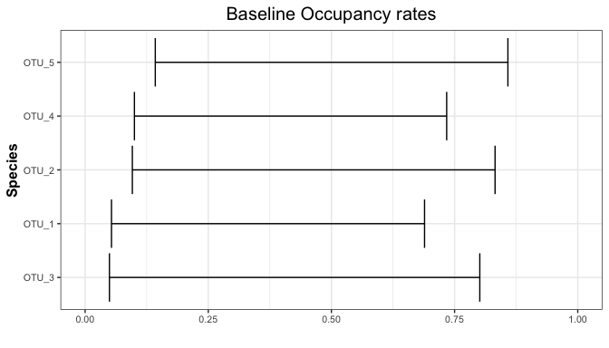
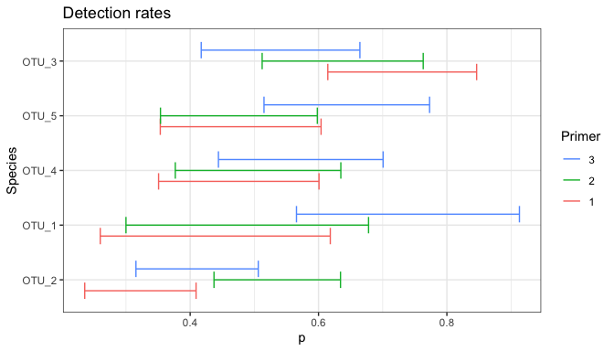

occJSDM: quickstart
================

occJSDM estimates which species occupy which sites from eDNA surveys. It allows for imperfect field collection, imperfect PCR detection and false positives at both stages, and it models the species jointly: their responses to the environment, the role of their traits, and associations between species that the covariates do not explain, optionally with a spatial field. It can also fit a joint species distribution model (JSDM) to directly observed presence/absence data.

This quickstart shows the shape of the input data, a fitting call and a first look at the output, using the example data shipped with the package.

## The example data

`sampledata` is a simulated two-stage eDNA survey of 10 species at 100 sites. Each site has three field samples, and each sample was tested with three primers, twice each.

``` r
library(occJSDM)

str(sampledata, max.level = 1)
```

    #> List of 3
    #>  $ info  :'data.frame':  1800 obs. of  9 variables:
    #>  $ OTU   : num [1:1800, 1:10] 0 0 0 0 0 0 0 0 0 0 ...
    #>   ..- attr(*, "dimnames")=List of 2
    #>  $ traits: num [1:10, 1:3] 0.291 1.066 -0.388 0.745 -0.786 ...
    #>   ..- attr(*, "dimnames")=List of 2

``` r
head(sampledata$info)
```

    #>   Site Sample Primer X_psi.EnvCov.1 X_psi.EnvCov.2      Xs.1      Xs.2
    #> 1    1      1      1      0.8139789       1.023953 0.5219804 0.3722027
    #> 2    1      1      1      0.8139789       1.023953 0.5219804 0.3722027
    #> 3    1      1      2      0.8139789       1.023953 0.5219804 0.3722027
    #> 4    1      1      2      0.8139789       1.023953 0.5219804 0.3722027
    #> 5    1      1      3      0.8139789       1.023953 0.5219804 0.3722027
    #> 6    1      1      3      0.8139789       1.023953 0.5219804 0.3722027
    #>   X_theta.1  X_theta.2
    #> 1 0.4053109 -0.9819493
    #> 2 0.4053109 -0.9819493
    #> 3 0.4053109 -0.9819493
    #> 4 0.4053109 -0.9819493
    #> 5 0.4053109 -0.9819493
    #> 6 0.4053109 -0.9819493

It has three parts:

- `info` has one row per PCR reaction: the `Site`, the field `Sample` the DNA came from, the `Primer`, and the covariates. Columns beginning `X_psi.` are occupancy covariates, columns beginning `X_theta.` are collection covariates, and `Xs.1` and `Xs.2` are the site coordinates.
- `OTU` has one column per species and one row for each row of `info`, holding that species’ read count in that reaction.
- `traits` has one row per species.

`runOccJSDM()` chooses the model from the structure of `info`. Here each sample has several rows, one per primer and PCR replicate, so it fits the two-stage occupancy model. With one row per site it would fit a JSDM to observed presence/absence instead.

## Fit the model

``` r
fit <- runOccJSDM(
  data = sampledata,
  listParams = list(n_factors = 2),
  threshold = 1,
  occCovariates = c("X_psi.EnvCov.1", "X_psi.EnvCov.2"),
  collCovariates = c("X_theta.1", "X_theta.2"),
  spatCovariates = c("Xs.1", "Xs.2"),
  MCMCparams = list(nchain = 2, nburn = 5000, niter = 5000, nthin = 1),
  summarisedLatentPresences = TRUE
)
```

- `threshold`: a reaction with at least this many reads counts as a detection.
- `occCovariates`, `collCovariates` and `spatCovariates` name the columns of `info` to use for occupancy, for collection and for the spatial field. The species traits are taken from `sampledata$traits`.
- `n_factors` is the number of latent factors that capture associations between species.
- `MCMCparams` sets the number of chains, the burn-in and kept iterations, and the thinning.
- The priors have defaults; `listPriors` changes them. `?runOccJSDM` describes every argument.

This chunk is not run while the vignette is built, because the fit takes several minutes. The package ships its result as `sampleresults`, which the rest of this guide uses.

``` r
fit <- sampleresults
```

## Check that the chains agree

Before reading any estimate, check that the chains have converged on the same answer.

``` r
diagnostics <- returnConvergenceDiagnostics(fit)
summary(diagnostics$rhat)
```

    #>    Min. 1st Qu.  Median    Mean 3rd Qu.    Max. 
    #>  0.9999  1.0001  1.0008  1.0049  1.0046  1.0802

``` r
summary(diagnostics$ess)
```

    #>    Min. 1st Qu.  Median    Mean 3rd Qu.    Max. 
    #>   90.84  486.07 2015.90 2471.19 3856.91 7824.07

``` r
head(diagnostics[order(-diagnostics$rhat), c("param", "label1", "label2", "rhat", "ess")])
```

    #> # A tibble: 6 × 5
    #>   param      label1         label2  rhat   ess
    #>   <chr>      <chr>          <chr>  <dbl> <dbl>
    #> 1 beta_psi   X_psi.EnvCov.2 OTU_8   1.08  90.8
    #> 2 beta_psi   X_psi.EnvCov.2 OTU_7   1.07 247. 
    #> 3 beta_psi   X_psi.EnvCov.2 OTU_2   1.05 421. 
    #> 4 beta_theta X_theta.2      OTU_2   1.04 961. 
    #> 5 beta_psi   X_psi.EnvCov.1 OTU_8   1.03 201. 
    #> 6 beta_psi   X_psi.EnvCov.1 OTU_3   1.03 366.

`rhat` compares the chains with each other: values close to 1 mean they agree, and larger values call for longer runs or a closer look at the parameters concerned. `ess` is the effective number of independent draws behind each estimate. The table covers the occupancy and detection coefficients; `plotTraceplot()` shows the chains themselves.

## Look at the results

Each species’ baseline occupancy probability, with its credible interval:

``` r
plotOccupancyRates(fit, idx_species = 1:5)
```

<!-- -->

Each species’ probability, for each primer, that a PCR reaction detects its DNA when that DNA is present in the sample:

``` r
plotDetectionRates(fit, idx_species = 1:5)
```

<!-- -->

The package’s other `plot...()` and `return...()` functions cover covariate effects, collection and false-positive rates, species associations, ordination, variation partitioning and prediction at new sites. Each has its own help page.

## Where to go next

- `?runOccJSDM` for every fitting argument, including the priors.
- `vignette("simulateOccJSDMData", package = "occJSDM")` to simulate a survey whose truth you know, so that you can compare the model’s answers with it. The truth behind `sampledata` is not stored with it.
- The [Known limitations](https://github.com/AlexDiana/occJSDM#known-limitations) section of the README, before relying on the estimates.

Teaching lessons that compare every output with simulated truth will follow after the beta.
